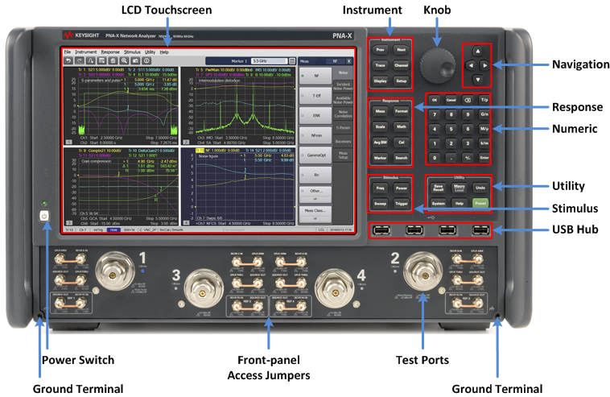
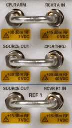
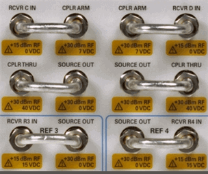
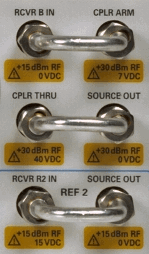
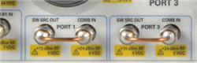

# VNA Front-Panel Tour

* * *

Click on an area of the image to learn more.

### See Also

  * [PNA-X Models/Options](../Support/Configurations.md#PNAX)

  * [N522xB Models/Options](../Support/Configurations.md#N522x)

  * [N523xB Models/Options](../Support/Configurations.md#N523x)
  * [Display area](XScreen.md)

  * Rear-panel Tour

  *     * [PNA-X and N522xB](../Rear_Panel/XRtour.md)

    * [N523xB](../Rear_Panel/N523xRP.md)

* * *

### Power Switch

Used for choosing between power-on ( | ) and standby (O) state.

Learn to power ON and OFF the VNA.

### LCD Touchscreen

VNA is equipped with a 12.1-inch TFT color, touch-sensitive LCD screen for
displaying traces, scales, settings, softkeys and other measurement related
information. The touchscreen LCD allows to manipulate softkeys by touching the
LCD screen directly. For more on the LCD touchscreen, see [Screen Display
Tour](XScreen.htm).

Note:

Do not press the surface of the LCD touchscreen with a sharp object (e.g., a
nail, pen, or screwdriver). Pressing the surface with a sharp-pointed object
will damage the LCD screen surface or cause the screen to fail.

Valid pixels are 99.998 % and more. Below 0.002 % of fixed points of black,
blue, green or red are not regarded as failure.

### Test Ports

The models are available with 2 or 4 test ports.

See [Specs](../Specs/ManualChoice.md) for more information about the Test
port connectors and Input damage levels.

The LED of each test port shows the source output status. When the signal
comes from the port, its LED is lighted.

### Front panel Access Jumpers

These connectors provide direct access to the VNA source and receivers. This
allows you to make a wide variety of measurements and improve dynamic range.

[See front panel jumpers specifications](../Specs/ManualChoice.md)

Port 1 |  Port 3 |  Port 4 |  Port 2  
---|---|---|---  
 |   |    
  
### N5247B

Port 1 and Port 3 SW SRC OUT \- COMB IN jumpers moved from [rear-
panel](../Rear_Panel/XRtour.htm#RFPath) (J8 through J11) to front-panel to
minimize path loss.

Important: All of the N5247B front-panel jumpers are EXTREMELY FRAGILE. [Learn
more](../Tutorials/Connector_Care.htm).

### USB Hub

This USB hub contains four USB ports to power your VNA peripherals. There are
also four USB ports on the [rear panel.](../Rear_Panel/XRtour.md)

Limitation: The total power consumption for all eight USB ports is limited to
4.0 amps. If this limit is exceeded, all USB ports are disabled until a device
is removed and power consumption falls below the limit. When first connected,
Keysight ECal modules 8509x and N4431 draw significantly more current than
other modules.

Note: The FIRST TIME each USB device (ECal module, power sensor, and so forth)
by serial number is connected to a specific VNA USB port, you must be logged
in to the VNA with an Administrator account. [Learn
how](../S0_Start/NewUsers.htm#AddAccounts). When a New Hardware Found dialog
appears, click OK to install the device. After being installed, when that same
USB device is connected to that same USB port, you can be logged in to the VNA
with a Limited/User account.  
---  
  
### Ground terminal

Connect a banana-type plug to this terminal for grounding to the VNA chassis.

### No probe power

Probe power is NOT provided on VNA models. Learn more about [Active
Probing](../Tutorials/Active_Probing.htm)

## Hardkeys

### INSTRUMENT Keys

Manages the Traces and Channels on the VNA display.

Hard Key |  Invokes these Softkeys  
---|---  
Prev |  Makes the previous Trace/Channel/Window active.  
Next |  Makes the next Trace/Channel/Window active.  
Trace |  Invokes the Traces softkey menu which allows you to manage traces.  
Channel |  Invokes the Channels softkey menu which allows you to manage channels.  
Display |  Invokes the Display softkey menu which allows you to manage display functions.  
Setup |  Invokes the Setup softkey menu which allows you to set up a measurement.  
  
### RESPONSE Keys

Performs operations on measurement traces after data is measured - not
including [Data Analysis](XTour.md#marker) operations.

Hard Key |  Invokes these Softkeys - Click to learn more  
---|---  
Meas |  [S-Param](../S1_Settings/Measurement_Parameters.md#S_Params)

  * [Meas Class](../S1_Settings/Measurement_Classes.md)

[Balanced](../S1_Settings/Balanced_Measurements.md)

  * Balanced Source/Topology

[Receivers](../S1_Settings/Measurement_Parameters.md#Receiver) Waves
Auxiliary Meas Setup

  * Conversions
  * Correction
  * Trace Hold
  * [Equation Editor](../S4_Collect/Equation_Editor.md)
  * Memory
  * Time Domain
  * Pulse Setup

  
Format |  Format 1

  * [Format](../S1_Settings/Data_Format.md)
  * Group Delay Aperture

Format 2  
Scale |  Main

  * Autoscale
  * [Scale](../S1_Settings/Scale.md)
  * Reference Level
  * Reference Position
  * Scale Coupling

[Electrical Delay](../S2_Opt/Phase_Accy.md#ed)

  * Delay Time
  * Delay Distance
  * Distance Units
  * [Velocity Factor](../S2_Opt/Phase_Accy.md#ElectricalDiag)
  * [Media -Waveguide/coax](../S2_Opt/Phase_Accy.md#ElectricalDiag)
  * [Waveguide cutoff freq](../S2_Opt/Phase_Accy.md#ElectricalDiag)

Constants

  * System Z0
  * [Phase Offset](../S2_Opt/Phase_Accy.md#po)
  * Mag Offset
  * Mag Slope

  
Math |  Memory

  * [Data/ Memory Math](../S4_Collect/Math_Operations.md#MathMemorydialogbox)
  * Normalize
  * Data Math
  * Display
  * [8510 Mode](../S4_Collect/Math_Operations.md#8510)

Analysis

  * Conversions
  * [Equation Editor](../S4_Collect/Equation_Editor.md)
  * Statistics
  * Uncertainty Analysis
  * Limits
  * Limit Table

Time Domain

  * Transform
  * Start Time
  * Stop Time
  * Center Time
  * Span Time
  * TD Mode
  * TD Toolbar
  * Time Domain Setup

Time Gating

  * Gating
  * Gate Start
  * Gate Stop
  * Gate Center
  * Gate Span
  * Gate Type
  * Gate Shape
  * Gating Setup

  
Avg BW |  Main

  * [Averaging](../S2_Opt/Trce_Noise.md#averaging)
  * Averaging Restart
  * Average Type
  * [IF BW](../S2_Opt/Trce_Noise.md#Variable_IF_Bandwidth)
  * [IF BW Shape](../S2_Opt/Trce_Noise.md#IFBW_Shape)
  * LF Auto BW

Smoothing

  * [Smoothing](../S2_Opt/Trce_Noise.md#Smoothing)
  * Smooth Percent
  * Smooth Points

Delay Aperture

  * Aperture Percent
  * Aperture Points
  * Aperture Frequency

  
Cal |  Main

  * Basic Cal
  * Other Cals
  *     * Cal All
    * Smart Cal
    * ECal
    * Response Cal
    * Source Power Cal
  * [Correction](../S3_Cals/Error_Correction_and_Interpolation.md)
  * Src Power Correct
  * [Interpolation](../S3_Cals/Error_Correction_and_Interpolation.md#Interpolation)
  * Correction Methods
  * Properties

Port Extension

  * Select
  * Port Extension
  * Time
  * Distance
  * [Velocity Factor](../S3_Cals/Port_Extensions.md#More)
  * DC Loss
  * Port Extensions
  * Auto Port Extension

Cal Sets & Cal Kits

  * [Cal Set](../S3_Cals/Cal_Sets.md)
  * [Cal Set Viewer](../S3_Cals/Errors.md#Monitoring)
  * Cal Kit
  * ECal
  * Cal Pod
  * Uncertainty Setup

Fixtures

  * Apply Fixtures
  * Power Comp
  * Fixture Setup
  * Cal Plane Manager
  * Auto Fixture Removal

  
Marker |  [Markers 1-7](../S4_Collect/Markers.md) [Markers 8-15](../S4_Collect/Markers.md) Marker Setup

  * [Delta](../S4_Collect/Markers.md#reference)
  * [Discrete](../S4_Collect/Markers.md#discrete)
  * [Type](../S4_Collect/Markers.md#types)
  * Format
  * [Coupled](../S4_Collect/Markers.md#Coupled_Markers)
  * Marker Display
  * Marker Table
  * All Off

Marker Functions

  * Marker -> Start
  * Marker -> Stop
  * Marker -> Center
  * Marker -> Span
  * Marker -> Ref Level
  * Marker -> Delay
  * Marker -> CW Freq
  * Marker -> SA

  
Search |  Main

  * Max Search
  * Min Search
  * Domain
  * Domain Start
  * Domain Stop
  * Tracking

Peak

  * Peak Search
  * Peak Right >> Search
  * << Peak Left Search
  * Next Peak Search
  * Threshold
  * Excursion
  * Peak Polarity
  * Tracking

Target

  * Target Search
  * Target Right >> Search
  * << Target Left Search
  * Target Value
  * Transition
  * Tracking

Multi Peak & Target

  * Multi Peak Search
  * Peak Threshold
  * Peak Excursion
  * Peak Polarity
  * Multi Target Search
  * Target Value
  * Transition
  * Tracking

Bandwidth & Notch

  * Bandwidth Search
  * BW Ref To Marker/Peak
  * BW Level
  * Notch Search
  * Notch Ref To Marker/Peak
  * Notch Level
  * Tracking

Comp & Sat

  * Compression Search
  * Comp Level
  * Saturation Search
  * Pmax Backoff
  * Tracking

Normal Op Pt

  * Normal Op Search
  * Backoff
  * Pin Offset
  * Tracking

  
  
### STIMULUS Keys

Controls settings that determine what data (stimulus range), and how data
(sweep type and triggering), is measured.

Hard Key |  Invokes these Softkeys - Click to learn more  
---|---  
Freq |  [Frequency Range](../S1_Settings/Frequency_Range.md) [Frequency Offset Mode](../FreqOffset/Frequency_Offset_Mode.md)  
Power |  Main

  * [Power level](../S1_Settings/Power_Level.md)
  * RF Power
  * Start Power
  * Stop Power
  * [Power and Attenuators](../S1_Settings/Power_Level.md#Advanced)

Port Power

  * Select
  * [Power level](../S1_Settings/Power_Level.md)
  * Start Power
  * Stop Power
  * Source State
  * Coupling

Leveling & Offsets

  * Select
  * [Slope](../S1_Settings/Power_Level.md#Power_Slope)
  * Offset
  * Limit
  * Offsets and Limits
  * ALC Hardware
  * Receiver Leveling

  
Sweep |  Main

  * [Number of Points](../S1_Settings/DPoints.md)
  * [Sweep Type](../S1_Settings/Sweep.md#SweepTypeDiag)
  * Start
  * Stop
  * X-axis Type
  * [Sweep Setup](../S1_Settings/Sweep.md#SweepSetup)

Sweep Timing

  * [Sweep Time](../S1_Settings/Sweep.md#sweepTimeDiag)
  * Dwell Time
  * Sweep Delay
  * Sweep Mode
  * Sweep Sequence
  * Fast Sweep

Source Control

  * Frequency Offset
  * Pulse Setup
  * Balanced Source
  * Phase Control
  * DC Source

Segment Table

  * Add Segment
  * Insert Segment
  * Delete Segment
  * Delete All Segments
  * [Segment Table](../S1_Settings/Sweep.md#segment)
  * Show Table

  
Trigger |  Main

  * Hold
  * Single
  * Groups
  * Continuous
  * Manual Trigger
  * Restart
  * Trigger Source
  * [Trigger](../S1_Settings/Trigger.md)

  
  
### UTILITY Keys

Performs global VNA operations.

Hard Key |  Invokes these Softkeys - Click to learn more  
---|---  
Save  
Recall |  [File Recall](../S5_Output/SaveRecall.md#file_recall)

  * Recall State
  * Recall Register
  * Recall Calset
  * Recall Data
  * Recall Order

Save State

  * [Save State](../S5_Output/SaveRecall.md#file_save)
  * [Auto Save](../S5_Output/SaveRecall.md#auto_save)
  * [Save State As](../S5_Output/SaveRecall.md#save_as)
  * Save Register
  * Save Type
  * Delete State

Save Other

  * Save Calset
  * [Save Data](../S5_Output/SaveRecall.md#SaveDataAs)
  * Save Screen
  * [Save User Preset](../S1_Settings/Preset_the_Analyzer.md#PresetUserDefined)
  * [Manage Files](../S5_Output/SaveRecall.md#Manage_files)

  
Macro |  Favorite 1 Favorite 2 Favorite 3 Macro 1 Macro 2 Macro 3 Key Setup

  * [Macro Setup](../Programming/Using_Macros.md#Setup)
  * Clear Favorites

  
System |  Main

  * Show Taskbar
  * Move App to Back
  * Minimize Application
  * Exit
  * Security
  * Control Panel
  * Manage Files

System Setup

  * Next/Prev Keys
  * Preferences
  * Sound
  * Remote Interface
  * LAN Status
  * Code Emulation

Print

  * [Print](../S5_Output/Print.md#Printing)
  * [Print to file](../S5_Output/Print.md#Printtofile)
  * [Page Setup](../S5_Output/Print.md#PrintOptDiag)
  * Print Colors

Help

  * NA Help
  * On The Web
  * [Error Display](../Support/About_Error_Messages.md)
  * [View Error Log](../Support/About_Error_Messages.md)
  * [About NA](../S0_Start/Using_Help.md)

[Service](../Support/Support_Overview.md)

  * Update Firmware
  * Verification
  * Adjustment Routines
  * Diagnostics
  * Option Enable

  
Undo |  Main

  * Undo
  * Redo
  * Clear Undo History

  
Help |  Launches the Help file.  
Preset |  Main

  * [Preset](../S1_Settings/Preset_the_Analyzer.md)
  * [User Preset](../S1_Settings/Preset_the_Analyzer.md#PresetUserDefined)
  * Confirm Preset

  
  
### ENTRY Keys

Hard Key |  Invokes these Softkeys  
---|---  
OK |  Closes a dialog box and enters any values made in the dialog box.  
Cancel |  Closes a dialog box.  
Bk Sp |  Back Space. Backs up the cursor and deletes any previous selection.  
0 to 9 |  Selects values for measurement settings, then press Enter or G/n - M/u - k/m to complete the selection.  
T/p G/n M/u k/m |  Completes the value selection, assigning a unit of measurement.

  * G/n (Giga/Nano) E12 or E-12
  * M/u (Mega/micro) E6 or E-6
  * k/m (kilo/milli) E3 or E-3

  
Enter |  Enters the values that you select for the measurement settings.  
Decimal point |  Enters a decimal point to designate fractions of a whole number.  
+/- |  Plus - Minus Toggles between a positive and negative value entry if it is the first key pressed in the entry.  
  
### Knob

Rotate to increase or decrease the value of the active entry.

### Navigation Keys

These keys allow you to navigate through menus and dialog boxes and select
choices from the active entry toolbar.

Hard Key |  Invokes these Softkeys  
---|---  
Left / Right |  Moves left and right through menus. Moves tab-left and tab-right within dialog boxes.  
Up / Down |  Moves up and down through menus. Behaves as follows in a dialog box:

  * Modifies a numeric value
  * Moves through items in a drop-down list
  * Moves through options buttons in a group of option buttons

  
Click |  Makes a selection just like a mouse click.  
  
* * *

