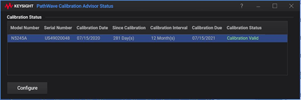

# System

## Main

  * Show Taskbar: _Show the Windows Taskbar_

  * Move App to Back

  * [Minimize Application](../S1_Settings/Customize_Your_Analyzer_Screen.md#Minimize)

  * Exit: _Exit the VNA application_

  * [Security...](../system/frequency_blanking.md)

  * Control Panel... : _Open Windows Control Panel_

  * Manage Files... : _Open Windows File Explore_

## System Setup

  * Next/Prev Keys : _Select Next/Previous window/channel/trace for the selected one_

  * [Preferences...](../System/Preferences.md)

  * [Remote Interface...](../Programming/Learning_about_GPIB/How_to_Configure_for_GPIB_SCPI_and_SICL.md#configure)

## Print

  * [Print...](../S5_Output/Print.md#printout)

  * [Print to File...](../S5_Output/Print.md#Printtofile)

  * [Page Setup...](../S5_Output/Print.md#PrintOptDiag)

  * [Print Colors...](../System/Display_Colors.md#dispColorDiag)

## Help

  * [NA Help...](../S0_Start/Using_Help.md)

  * On The Web... : _Connect to the Web on the keysight.com._

  * [Error Display...](../Support/About_Error_Messages.md#ErrorPrefDiag)

  * [View Error Log...](../Support/About_Error_Messages.md#errorLogDiag)

  * Tech Support

    * [My Software Support...](../Support/Software_Support.md#My_Software_Support)

    * [My Support ID...](../Support/Software_Support.md#My_Support_ID)

    * [Licensed Features](../Support/Software_Support.md#Licensed_Features)

  * [About NA...](../S0_Start/HelpAbout.md)

## Service

  * [Update Firmware](../Support/FW_upgrade.md)

  * Verification

  *     * [Operator's Check](../Support/Operators_Check.md)

    * Performance Tests

    * [System Verification](../Support/System_Verification.md)

    * [CalPod Check](../S3_Cals/CalPod.md#OpCheck)

  * [Adjustment Routines](../Support/Adjust_Overview.md)

  * Diagnostics

  *     * [_Receiver Display_](../Support/ReceiverDisplay.md)

    * _[Receiver Temperature](../Support/Receiver_Temperature.md)_

    * [_EEPROM Headers_](../Support/Adjust_Overview.md)

    * _[Mechanical Counter](../Support/Mechanical_Counter.md)_

    * [_SmartCal Save_](../S3_Cals/Calibration_Wizard.md#GuidedCal)

  * _VNA Cal Status... Opens the PathWave Calibration Advisor Status dialog:   
  
  
For information on how to set up the PahtWave Calibration Advisor, click on
 in the top-
right part of the dialog to access the PathWave Calibration Advisor Help._

