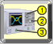
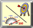
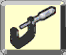
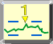
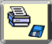
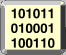

 |  VNA Series Network Analyzers Help  
---|---  
[  
Quick Start](S0_Start/Getting_Started.htm) |  [   
1\. Setup](S1_Settings/Select_a_Measurement_State.htm) |  [  
2\. Optimize](S2_Opt/Optimize.htm) |  [  
3\. Calibrate](S3_Cals/Calibration.htm)  
---|---|---|---  
|  |  |   
[  
4. Analyze Data](S4_Collect/Analyze_Data.htm) |  [  
5. Print/Save](S5_Output/Outputting_Data.htm) |  [  
System Settings](System/System_Topics.htm) |  [  
Programming](Programming/Programming_Guide.htm)  
  
[ Critical Information ](Critical_Information.md)

[What's New for the N52xxB PNA/PNA-X](Whats_New.md) |  Rev A.19.30.xx, 28-Jun-2025  
---|---  
[VNA Applications](Applications/Applications.md) |  [VNA Connectivity](S0_Start/Connectivity.md)  
[Measurement Tutorials](Tutorials/Tutorials1.md) |  [Product Support / Specs](Support/Support_Overview.md)  
[Links to VNA App Notes](Tutorials/App_Notes.md) |  [Links to YouTube Videos](Tutorials/Videos.md)  
[Product and Solution Cybersecurity](Product_and_Solution_Cybersecurity.md) |   
  
Still looking for answers? Post your question at the [Keysight Discussion
Forums](https://community.keysight.com/forums/s/) See the latest PNA online
help at
[helpfiles.keysight.com/csg/N52xxB/help.htm](https://helpfiles.keysight.com/csg/N52xxB/help.htm
"Go to website")  
---  
  
Note: These help pages are best viewed using Microsof Edge. Some scripts may
not work correctly using other browsers.

