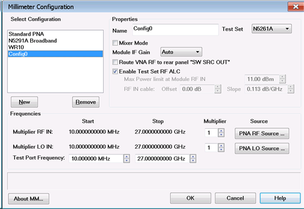
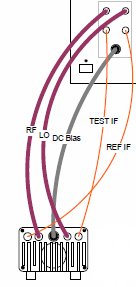
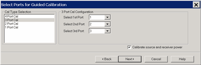
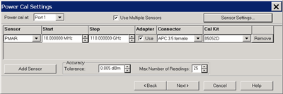
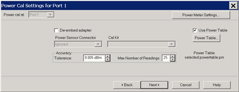

# N5251A External Millimeter-Wave Configuration

* * *

This feature, when used with the N526xA test sets and external mmWave Modules,
extends the frequency coverage of your VNA. The N5251A broadband system is
also configured using the [Millimeter Module Configuration
dialog](External_Test_Head_Configuration.htm#mmconfigImage).

In this topic:

  * [Features and Limitations](External_Test_Head_Configuration.md#Features)

  * [How to Configure Millimeter Modules](External_Test_Head_Configuration.md#How)

  * [Mixer Mode](External_Test_Head_Configuration.md#Mixer)

  * Spectrum Analyzer mmWave Measurements

  * [mmWave Module Power Level Control](External_Test_Head_Configuration.md#Leveled)

  * Using Cal All Wizard for Supported mmWave Measurement Classes

### See Also

  * [N5261A / N5262A User Manual](http://literature.cdn.Keysight.com/litweb/pdf/N5262-90001.pdf) (Requires internet connection)

  * [N5251A Installation Guide](http://literature.cdn.Keysight.com/litweb/pdf/N5251-90001.pdf) (Requires internet connection)

  * [Millimeter-Wave Network Analyzers Technical Overview](http://literature.cdn.Keysight.com/litweb/pdf/5989-7620EN.pdf) (Requires internet connection)

  * [Direct Connect: mmWave Measurements with No Test Set](mmWave_Measurement_w_No_Test_Set.md)

  * [Download a macro for Configuring Frequency Extenders](http://na.support.keysight.com/pna/apps/applications.md) (Requires internet connection)

[Other IF Access Topics](IF_Access_Overview.md)

Note: In the VNA user interface and in this help file, the N526xA Millimeter
Head Controller is referred to as a test set. The test head modules are
referred to as mmWave modules.

CAUTION: Turn OFF test set power before connecting or disconnecting the DC
cable to the mmWave modules.

Features

  * Controls N5261A and N5262A Test Sets.

  * Compatible with [iTMSA (True Mode Stimulus)](../Applications/iTMSA.md).

  * Several methods available to provide [Leveled power to the DUT Input](External_Test_Head_Configuration.md#Leveled)

  * Compatible with Integrated Pulse Application

The following [Applications](../Applications/Applications.md) are supported:

  * [SMC mixer measurements](../FreqOffset/SMC_Measurements.md).

  * [IMSpectrum](../Applications/IMSpectrum.md) and [IMSpectrum for Converters](../Applications/IM_Spectrum_for_Converters.md)

  * [Spectrum Analyzer](../Applications/Spectrum_Analyzer.md)

The following configurations are supported:

  * PNA-X or N522xA with options [Opt 020](../Rear_Panel/XRtour.md#IF) works with N5261A and N5262A Test Sets.

  * When using the N5262A test set, a 2-port PNA-X or N522xB requires [Opt S93551A/B.](../System/External_Testset_Control.md#551)

  * Broadband \- single sweep from 10 MHz to 110 GHz.

  * Banded \- frequency coverage divided into bands.

Limitations

  * Power Settings Your mmWave modules may have a variable attenuator on them. When used with an N5261A or N5262A, after performing a Source Power Cal, then the VNA power settings may be used to control the power into the DUT. See [Leveled Power Capabilities](External_Test_Head_Configuration.md#Leveled). 

  * To protect your mmWave modules from damage, the settings on the Millimeter Module Configuration dialog can ONLY be changed manually. They can NOT be reset or changed by performing a Preset, by recalling an Instrument State, or from a remote program.

  * ONLY the [Applications](../Applications/Applications.md) listed above are supported.

### Broadband and Banded mmWave Measurements

Broadband refers to mmWave configurations with a frequency range of 10 MHz to
110 GHz. This configuration spans the entire frequency range in a single
sweep.

Banded refers to any configuration that is not a broadband configuration and
is waveguide based. Frequency extenders cover frequency ranges from 50 GHz to
1.1 THz. The supported solutions can be configured for different frequency
bands with or without a test set controller depending on the measurements
required and the frequency extenders being used.

The following table shows the waveguide designation equivalents.

MIL-DTL-85/3C | IEEE Std 1785.1 | Frequency Range  
---|---|---  
WR-15 | WM-3759 | 50 GHz to 75 GHz  
WR-12 | WM-3099 | 60 GHz to 90 GHz  
WR-10 | WM-2540 | 75 GHz to 110 GHz  
WR-08 | WM-2032 | 90 GHz to 140 GHz  
WR-06 | WM-1651 | 110 GHz to 170 GHz  
WR-05 | WM-1295 | 140 GHz to 220 GHz  
WR-04 | WM-1092 | 170 GHz to 260 GHz  
WR-03 | WM-864 | 220 GHz to 330 GHz  
WR-02 | WM-570 | 330 GHz to 500 GHz  
WR-1.5 | WM-380 | 500 GHz to 750 GHz  
WR-1.0 | WM-250 | 750 GHz to 1.1 THz  
Reference: IEEE Standard for Rectangular Metallic Waveguides and their
interfaces for frequencies of 110 GHz and above - Part 1: Frequency Bands and
Waveguide Dimensions.  
  
### PNA-X Notes

  * The PNA-X or N522xB rear panel [IF Inputs use 5 SMA connectors](../Rear_Panel/XRtour.md#IF). Previous VNA models use BNC connectors. Adapters may be required.

  * Frequency Offset and SMC Measurements are supported when using mmWave modules. [Learn more.](External_Test_Head_Configuration.md#Mixer)

  * Beginning with A.10.45, Spectrum Analyzer Measurements are supported when using mmWave modules. Learn more.

#### How to Configure Millimeter-Wave Modules  
  
---  
Using a mouse  
  
  1. Click Instrument
  2. Select Setup
  3. Select External Hardware
  4. Select Millimeter Config...

  
  
Millimeter Module Configuration dialog box help |   
---|---  
 Note: To protect your mmWave
modules from damage, settings on this dialog can ONLY be changed manually or
with a remote program. They can NOT be reset or changed by performing a
Preset, or by recalling an Instrument State. Available Configurations Lists
the Standard VNA configuration and other configurations that you have created.

  * Click New for first-time use.
  * For the N5251A, select Broadband 10MHz - 110GHz.
  * For banded, define a frequency band.
  * Select Standard PNA to exit the Millimeter Module Configuration dialog.

Name Shows the currently selected configuration. Edit this field to change the
configuration name. Type a unique name using only alphanumeric characters and
underscore. New Click to create a new Millimeter Module configuration. A name
is automatically selected. Edit the Selected Configuration field to change the
configuration name. Remove Deletes a Millimeter Module Configuration.

### Test Set Properties

Test Set Select a test set to use in the current configuration. The firmware
does NOT check to ensure that the selected test set is connected. Mixer Mode
Check to allow mixer testing using [SMC](../FreqOffset/SMC_Measurements.md).
[Learn more.](External_Test_Head_Configuration.md#Mixer) Route VNA RF to rear
panel "SW SRC OUT" Available ONLY on PNA-X with [option 224 or
423](../Support/Configurations.htm#XOptions) AND when using N5261A and N5262A
test sets. When checked, Port 1 source is switched to J11 and Port 3 source is
switched to J8 on the [VNA rear panel](../Rear_Panel/XRtour.md#RFPath). Use
this configuration to quickly switch the RF Output back to the VNA front
panel. Enable Test Set RF ALC Available for N5261A and N5262A ONLY. When
checked, power is automatically leveled at the mmWave module RF input when
using the standard cables and making non-pulsed measurements. Clear this box
to use non-standard cables or when making pulse measurements. When cleared,
the following fields become available: Max Power Limit The maximum mmWave
module RF input is limited to this value when Test Set RF ALC is OFF. When you
exit this dialog box using OK, set the power out of the VNA using the [Power
and Attenuator dialog.](../S1_Settings/Power_Level.htm#Advanced) Offset Sets
the loss of the cables. The mmWave module RF input is adjusted by this amount.
Positive offset increases the power. Slope Helps compensate for cable and test
fixture power losses at increased frequency. The mmWave module RF input power
increases as the sweep frequency increases in dB/GHz. The slope is defined
relative to the mmWave module RF input frequency. The slope starts at 0Hz and
a positive slope will increase the power level. Range is +/- 2 dB/GHz. Note:
Changing any of the source controls after a calibration will cause the source
power cal to be turned off. A source power cal will need to be performed again
with the new settings.

### Frequency Settings

Multiplier RF IN RF Frequency Range (displayed in grey fields) multiplied by
this value = test port frequency range. Multiplier LO IN LO Frequency Range
(displayed in grey field) multiplied by this value equals the test port
frequency. The IF frequency is:

  * 'C' Models = 8.333 MHz
  * PNA-X models = 7.605 MHz

Test Port Frequency Set the Start and Stop frequencies of the selected configuration at the test ports. This becomes the displayed Start and Stop frequency of the VNA. | Important Notes

  * To set Test Port Frequency, first set the appropriate Multiplier values that are specified in your mmWave module documentation.
  * Ensure that the RF and LO Frequencies (highlighted below) are within the frequency range of the sources. The VNA offers no warning if they are NOT.

  
---  
  
### Source

Click a button to launch the [External Devices
dialog](../System/Configure_an_External_Device.htm) where you can select an
internal or external source to be used for the VNA LO source or VNA RF source.

Cancel Closes dialog box without saving changes.

OK Saves the configuration and the VNA is Preset before making the appropriate
settings.

About MM... Displays information about the current hardware configuration.  
  
## Mixer Mode

Mixer measurements can be made at mmWave frequencies using
[SMC](../FreqOffset/SMC_Measurements.md). (VMC measurements are NOT
supported.)

Beginning with A.09.40, mixer measurements can be made with a 2-port test set
connected to a 4-port PNA-X. This configuration yields a 2-port mmWave system.
[Learn about 2-port system connections and
limitations.](External_Test_Head_Configuration.htm#2portSystem)

Before A.09.40, The Mixer Mode checkbox could be enabled ONLY when the number
of VNA test ports matched the number of ports on the mmWave test set. This
means that an N5261A (2 port test set) could ONLY be connected to a 2-port VNA
and an N5262A (4 -port test set) could ONLY be connected to a 4-port VNA.

### Procedure

  1. Connect your DUT to the mmWave system as described below.

  2. Configure this dialog ([Millimeter Module Configuration](External_Test_Head_Configuration.md#mmconfigImage)). Check Mixer Mode, then press OK. This presets the VNA.

  3. [Create an SMC measurement](../FreqOffset/SMC_Measurements.md#Create).

  4. [Make mixer settings](../Applications/MixerConverter_Setup.md). As with standard SMC measurements, only two DUT ports can be swept in frequency. The remaining DUT port must be a fixed frequency. [See configuration used for harmonic mixers](External_Test_Head_Configuration.md#harmMixer).

  5. [Increase power](../S1_Settings/Power_Level.md#Advanced) for mmWave modules that are connected directly to a VNA port or external source.

  6. Calibrate using the [SMC Calibration Wizard with mmWave Power Control.](External_Test_Head_Configuration.md#SMCPowerProcess)

### Hardware Connections for Mixer mode

The following image shows the standard connections from a N5261A or N5262A
test set port to a mmWave module.

mmWave mixers usually require that two of the three mixer ports operate at
mmWave frequencies. When Mixer Mode is checked on this dialog ([Millimeter
Module Configuration](External_Test_Head_Configuration.htm#mmconfigImage)),
the following restrictions apply:

  * On a 2 port mmWave system, only port 1 of the test set can be used as a mmWave frequency port. Port 2 can NOT be used.

  * On a 4 port mmWave system, only ports 1 and 3 of the test set can be used as mmWave frequency ports. Ports 2 and 4 can NOT be used.

  * The [SMC parameter](../FreqOffset/SMC_Measurements.md#Create) being measured must be within the frequency range of the VNA or within the frequency range of the banded mmWave module. Frequencies in between these ranges are allowed by the [SMC mixer setup dialog](../Applications/MixerConverter_Setup.md), but the measurement results on the screen are NOT accurate.

### Connections with a 4-port mmWave system

Upconverters

  * DUT Input - Connect to VNA port 2 or port 4.

  * DUT LO - Connect mmWave module to test set Port 3.

  * DUT Output - Connect mmWave module to test set Port 1.

Downconverters

  * DUT Input - Connect mmWave module to test set Port 1.

  * DUT LO - Connect mmWave module to test set Port 3.

  * DUT Output - Connect to VNA port 2 or port 4.

### Connections with a 2-port mmWave system

Although supported, testing mmWave mixers with a 2-port system can be
challenging for the following reasons:

  * Testing mmWave mixers requires that two of the three DUT ports be at mmWave frequencies.

  * Only test set port 1 is capable of adequately driving a mmWave module when used as a receiver.

  * Therefore, the second DUT port that requires mmWave frequencies must have the mmWave module connected directly to an external source or a VNA second source.

  * When using the mmWave module as a source, only the DC Bias and RF cable is necessary. The LO cable to the mmWave module is NOT used. This is because the RF input frequencies are multiplied in the mmWave module to provide the source frequencies. So a mmWave module used as a source can use the RF cable to connect directly to the VNA second source or an external source. About +5 dBm of RF power is required to adequately drive the mmWave module.

Downconverters \- requires two mmWave modules as sources

  * DUT Input - Connect the mmWave module to the test set port 1.

  * DUT LO - Connect the RF cable of the mmWave module to an external source or the VNA (SRC2) second source.

  * DUT Output - Connect to VNA port 2.

Upconverters - requires a mmWave module as a source at the DUT LO and a mmWave
module as a receiver at the DUT Output:

  * DUT Input - Connect to VNA port 2.

  * DUT LO - Connect the RF cable of the mmWave module to an external source or the VNA (SRC2) second source.

  * DUT Output - Connect the mmWave module to the test set port 1.

### Measuring Harmonic Mixers

Harmonic mixers have a multiplier circuit in the LO port of the DUT. Enter the
multiplier value in the numerator of the X LO port in the [SMC mixer setup
dialog](../Applications/MixerConverter_Setup.htm#MixerSetupTab). This will
provide the correct LO frequencies out of the appropriate source.

## Spectrum Analyzer mmWave Measurements

Beginning with A.10.45.xx, spectrum analyzer measurements can be made at
mmWave frequencies using the Option S93090xA [Spectrum
Analyzer](../Applications/Spectrum_Analyzer.htm) application plus Option
S93093A/B or Option S93094A/B. Broadband and banded mmWave measurements are
supported. The test set configuration is required for both.

Options S93093A/B and S93094A/B are mmWave measurement options specific to the
Spectrum Analyzer application. Broadband measurements require Option S93093A/B
and measure from 10 MHz to ≤ 110 GHz. Banded measurements require Option
S93094A/B and measure frequencies > 110 GHz.

Note: The [IF Response Adjustment](../Support/Adjust_Overview.md) must be
performed each time a new configuration is set up or if cables are changed.

The following procedure outlines the steps required to set up a spectrum
analyzer mmWave measurement.

  1. Configure the mmWave measurement using the Millimeter Module Configuration dialog.

  2. On the VNA front panel, press Meas > S-Param > Meas Class...

  3. Select Spectrum Analysis, then either:

     * OK delete the existing measurement, or

     * New Channel to create the measurement in a new channel.

  4. A Spectrum Analysis measurement is displayed. [Learn about setting up a Spectrum Analyzer measurement](../Applications/Spectrum_Analyzer.md#Configure_SA_settings).

  5. Select other mmWave supported measurement classes as needed.

## mmWave Module Power Level Control

Beginning with A.09.40, the following TWO features are integrated into [Guided
Cal](../S3_Cals/Calibration_Wizard.htm#GuidedCal):

  * For S-parameter Cal \- Use Multiple Sensors

  * [For SMC Cal](External_Test_Head_Configuration.md#SMCPowerProcess) \- Power Table

The following table shows features that can be used to provide leveled power
to the input of your DUT for S-parameter and SMC measurements.

Feature | Description | Use when... | Use for... | Access the feature...  
---|---|---|---|---  
[Receiver leveling](../S1_Settings/Receiver_Leveling.md) | Provides a sweep-to-sweep leveled power. | Works anytime. | S-params and SMC | Before or after Cal  
[Use Multiple Sensors](../S3_Cals/Guided_Power_Calibration.md#MultipleSensors) | Allows several power sensors to be used to calibrate source power. | You require more than one power sensor to complete the source power calibration of the measurement frequency range. | S-params and SA | During [Guided Power Cal](../S3_Cals/Guided_Power_Calibration.md)  
[Power Table](External_Test_Head_Configuration.md#PowerTable) | Build or use a file that contains data of mmWave module output power vs frequency. | A power sensor is NOT available for calibration of the mmWave modules being used. | S-params | During [Std Source Power Cal](../S3_Cals/PwrCalibration.md)  
SMC and SA | During [Guided Power Cal](../S3_Cals/Guided_Power_Calibration.md)  
[Calibrate the source at multiple power levels](../S3_Cals/PwrCalibration.md#MultPoweLevels) | Source power is measured using the specified power meter/sensor or VNA receiver to construct a 2D power table. | A component is used in the source path which does not have NOT linear gain or loss over frequency. | S-params | During [Std Source Power Cal](../S3_Cals/PwrCalibration.md)  
  
### S-parameter measurements

If you have one or more power sensors that spans the frequency range of your
measurement, then use the following process.

Otherwise, perform a standard Source Power Cal. Learn how.

### Using one or more power sensors

Check [ALC Enabled](External_Test_Head_Configuration.md#MillimeterDiagHelp)
(if available) on the [Millimeter Module
Configuration](External_Test_Head_Configuration.htm#MillimeterDiagHelp)
dialog.

  1. With an S-parameter measurement active, press Cal > Smart Cal....

  2. On the following Select Ports dialog, check Calibrate source and receiver power, then click Next.

  3. Important: In the following dialog, check Use Multiple Sensors, even if using only one sensor.

[Learn about this
dialog](../S3_Cals/Guided_Power_Calibration.htm#MultipleSensors).

  4. Complete the Guided Cal process.

Note: During the 'Connect a power sensor to port n'...step, the following
error message may be displayed:

The default power level of 11 dBm is unachievable after calibration. Lower the
power before starting calibration.

This means that a high amount of loss was measured in the path, and 11 dBm at
the test ports will not be possible.

Cancel the calibration and lower the source power level using the [Power and
Attenuators dialog](../S1_Settings/Power_Level.htm#Advanced).

### Perform a standard Source Power Cal \- S-parameter measurements

When one or more power sensors that span the frequency range of your
S-parameter measurement are NOT available, then use the following process.

Note: Perform an S-parameter calibration AFTER performing the following Source
Power Cal.

  1. Check ALC Enabled (if available) on the [Millimeter Module Configuration](External_Test_Head_Configuration.md#MillimeterDiagHelp) dialog.

  2. Press Cal > Main > Other Cals > Source Power Cal... then Options... to launch the following dialog:

[See the help topic for this dialog](../S3_Cals/PwrCalibration.md#Options)

  3. If one does not already exist, create a power table to be used to calibrate the VNA receiver. Learn how.

  4. Check Use a power table and the analyzer reference receiver.

  5. Click Power Table, then navigate to the *.prn file.

  6. Click OK.

  7. Check Calibrate the source at multiple power levels.

  8. Click Power Levels..., then enter the Max power, Min power, and Step Size at which source power should be corrected. Be sure that the source power for your measurement is within these power levels. Otherwise, source power will NOT be accurate. [Learn more about this feature.](../S3_Cals/PwrCalibration.md#MultPoweLevels)

  9. Check Calibrate the analyzer reference receiver, then click OK.

  10. On the Source Power Cal dialog, click Take a sweep. The output of the test set is set to Max power and a sweep is performed to calibrate the reference receiver.

  11. Power is dropped for several subsequent sweeps. The calibrated reference receiver is used to fully characterize the source power.

  12. The entire correction table can be saved along with the instrument state in a *.csa file. [Learn how](../S5_Output/SaveRecall.md#file_save).

  13. Power out of the input module should be flat and accurate.

### SMC Cal

Use the following calibration process to achieve accurate, leveled power at
the mmWave test ports.

  1. With a configured SMC measurement active, Cal > Main > Smart Cal....

  2. At the SMC [Calibration Setup](../FreqOffset/SMC_Measurements.md#CalSetupDiag) dialog, when a Thru standard is NOT available, check Independent power cals for input and output ports (no thru).

  3. On the [Select Ports](../S3_Cals/Guided_Power_Calibration.md#How) dialog, check Calibrate source and receiver power, then click Next.

  4. At the following Power Cal settings dialog:

[Learn about this
dialog](../S3_Cals/Guided_Power_Calibration.htm#PowerCalSettings)

  1.      1. When you have ONE power sensor that spans the frequency range of your SMC measurement, then click Power Meter Settings to configure the power sensor. There are currently NO provisions for using multiple power sensors with SMC Calibration.

     2. Otherwise, use the following Power Table process.

        1. If one does not already exist, create a power table to be used to calibrate the VNA receiver. Learn how.

        2. Check Use Power Table.

        3. Click Power Table, then navigate to the *.prn file. The selected *.prn file is annotated to the dialog.

        4. Click OK.

  5. If you checked Independent power cals for input and output ports (no thru), you will ALSO be prompted to select a power table for Port 2.

  6. Complete the [Guided SMC Cal](../FreqOffset/SMC_Measurements.md#CalWizard) process.

### Power Table

Note: This is NOT the same table that is used for the [Calibrate the source at
multiple power levels](../S3_Cals/PwrCalibration.htm#MultPoweLevels) feature.

A power table is a text file with data that describes the output power of the
module as a function of frequency. This is valid when the mmWave module is
driven at high levels (+11 dBm). This file may have been created for you by a
third party or shipped with your mmWave Module. If not, you can create this
*.prn file from the manufacturer's specification for the mmWave module.

This file can be created manually, using a text file program such as Notepad.
Copy the header information, and create the file with two columns, one for
frequency and one for output power.

Example .prn file

Note: With Rev. 09.31, the first line of the *.prn file must have the Input
power at which these measurements were made. Otherwise, an error message
appears with the default value that will be assumed. See above image for
format.

## Using Cal All Wizard for Supported mmWave Measurement Classes

Beginning with A.10.45.xx, the [Cal All
Wizard](../S3_Cals/Calibrate_All_Channels.htm) can be used to calibrate
broadband and banded configurations.

A power table can be used instead of multiple power sensors to cover a wide
frequency range. In addition, a power table can be used when the measurement
frequency exceeds the frequency range of the power sensor (typically > 110
GHz). Refer to Power Table for information on how to create a power table.

The power table file name must be powertable1.prn, where "1" corresponds to
the port number. This file must be stored in the following directory on the
VNA:

C:\ProgramData\Keysight\Network Analyzer\Configurations\<configuration name>\

where configuration name is a directory name that is also the name of the
currently selected configuration in the Millimeter Module Configuration
dialog.

Once the power table has been created and saved to the directory shown above,
it will be listed in the Sensor drop down menu in the Power Cal Settings
dialog where it may be selected instead of a power sensor.

  1. Check ALC Enabled (if available) on the [Millimeter Module Configuration](External_Test_Head_Configuration.md#MillimeterDiagHelp) dialog.

  2. Ensure that the measurement classes to calibrate are active.

  3. Press Cal > Main > Other Cals > Cal All... to launch the following dialog showing the active measurement classes:

  4. Select the ports, click Next, then confirm or change the calibration properties in the Measurement Class Cal Properties dialog.

  5. Click Next. to access the Calibration Attenuator Settings dialog.

  6. In the Calibration Attenuator Settings dialog, perform the following:

     1. Set the attenuator settings. [Learn more](../S3_Cals/Calibrate_All_Channels.md#CalAttnSettingsDiag).

     2. Click on the Noise Reduction button to improve measurement accuracy. [Learn more](../S2_Opt/Trce_Noise.md).

     3. Click on the Mechanical Devices button to view all switches and attenuators in the VNA. [Learn more](../System/Mechanical_Devices.md).

  7. Click Next, then select the DUT connectors and calibration kits in the Select DUT Connectors and Cal Kits dialog.

  8. .Click Next to access the Power Cal Settings dialog.

  9. In the Power Cal Settings dialog, perform the following:

     1. Check Use Multiple Sensors if more than one power sensor is needed to cover the frequency range then select a sensor from the Sensor down menu.

     2. Otherwise, check Use Multiple Sensors then select the power table from the Sensor drop down menu. Learn how to create a power table.

     3. Learn more about [Accuracy Tolerance](../S3_Cals/Guided_Power_Calibration.md#Accuracy) and [Max Number of Readings](../S3_Cals/Guided_Power_Calibration.md#Accuracy).

  10. Click Next and follow the calibration process until completed.

* * *

