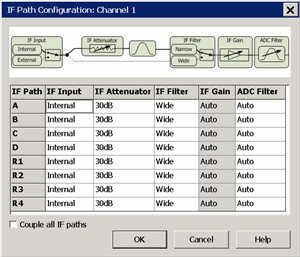
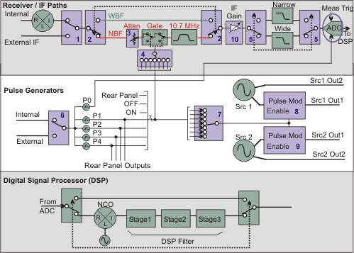

# IF Path Configuration Settings

* * *

This dialog is used to set many IF receiver settings for models.

In this topic:

  * [VNA and N522xB IF Frequencies](IF_Path_Configuration.md#IFFrquencies)

  * [How to Start the IF Path Configuration dialog](IF_Path_Configuration.md#HowIF PathConfig)

  * [IF (Receiver) Path Configuration dialog box](IF_Path_Configuration.md#IFPathConfigDiag)

  * [Expanded Block Diagram and Descriptions](IF_Path_Configuration.md#ExpandedBD)

  * [IF Path Configuration using COM and SCPI](IF_Path_Configuration.md#elements)

[Other IF Access Topics](IF_Access_Overview.md)

### Auto IF Frequencies

Wideband/Normal IF path:

Note: For the following discussion, RF = Receiver Frequency

With DSP Version 4:

  1.      * RF < 53 MHz: IF = 2.535211 MHz [3 x (60e6 / 71)]

     * RF >= 53 MHz: IF = 7.605634 MHz [9 x (60e6 / 71)]

With DSP Version 5, the IF frequency is dependent on the RF AND the current
IFBW setting:

  1.      * All RF; IF Bandwidth >= 1MHz: (All Models)

IFBW  
Setting |  IF  
Frequency  
---|---  
1 MHz |  7.692 MHz  
1.5 MHz |  7.368 MHz  
2 MHz |  8.450 MHz  
3 MHz |  8.163 MHz  
5 MHz |  6.897 MHz  
7 MHz |  10.53 MHz  
10 MHz |  15.38 MHz  
15 MHz |  22.22 MHZ  
  
  * IF Bandwidth <= 600 kHz:

  *     * RF >= 53 MHz; All models: IF = 7.438017 MHz [(9 x (100e6 / 121)]

    * RF <= 53 MHz; PNA-X models:  IF = 2.479339 MHz [(3 x (100e6 / 121)]

    * RF <= 53 MHz; N522xB models: IF = 826.446 kHz [1 x (100e6 / 121)]

Narrowband IF path:

  * IF = 10.70 MHz 

  * Bandwidth = 30 kHz

Note: The IFBW is limited to 600 kHz when performing Swept IMD measurements
even if the [Wide IF path](IF_Path_Configuration.md#IFFrquencies) is
selected.

### Manually change the IF frequency

The IF frequency can be changed to any value between +14.9999 MHz and -14.9999
MHz using [SENS:IF:FREQ](../Programming/GP-
IB_Command_Finder/Sense/XSensIF.htm#freqValue) or
[IFFrequency](../Programming/COM_Reference/Properties/IFFrequency_Property.md)
commands.

  * With DSP Version 4 - 34 and above, min and max IF frequencies up to +/- 20.1 MHz are available.

  * With DSP Version 5, min and max IF frequencies up to +/- 38 MHz are available.

  * Performance is degraded drastically above +/- 14.9999 MHz.

[Learn about DSP Version](../S0_Start/HelpAbout.md)

#### How to start the IF Path Configuration dialog  
  
---  
Using Hardkey/SoftTab/Softkey |  Using a mouse  
  
  1. Press Setup > Internal Hardware > IF Path Config...

|

  1. Click Instrument
  2. Select Setup
  3. Select Internal Hardware
  4. SelectIF Config...

  
  
  
IF (Receiver) Path Configuration dialog box help  
---  
 The IF path, represented in the
block diagram at the top of the dialog, is duplicated for each of the
receivers (A, B, C, D, R1, R2, R3, R4). In addition, each path can be
configured differently for each channel. Element \- Indicates an element in
the [expanded block diagram](IF_Path_Configuration.md#ExpandedBD). IF Input
(1) \- Available on the [PNA-X and N522xB with Opt
020](../Support/Configurations.htm#XOptions). Internal input is a test port or
reference receiver input. External Input is through the [PNA-X and N522xB
rear-panel connectors](../Rear_Panel/XRtour.htm#IF). IF Attenuator (3) \-
Specify IF attenuation for the narrowband path of the selected receiver. IF
Filter (2) \- Select Wideband or Narrowband (includes the ability to pulse
gates). IF Gain (10)\- Set to Auto by default, the following are reasons to
change the IF Gain:

  * For [millimeter systems](External_Test_Head_Configuration.md) that do NOT use the external millimeter test set, the millimeter head output IFs are routed directly to the RF receivers. You may want to change the IF gain to improve the noise figure of the receivers.
  * External couplers are often used for high-power test setups The VNA automatically adjusts the IF Gain depending on the frequency of operation in order to correct for several aspects of the hardware, including the large coupled-arm roll off at low frequencies (below 700MHz). If you replace the internal coupler with one having a different low-frequency roll off, then you may also want to change the IF gain to avoid overdriving the receiver.
  * When using the rear panel direct IF inputs, the gain is set low when in standard operation and very high when in [millimeter mode](External_Test_Head_Configuration.md). You may want to control the gain of the direct IF inputs to improve noise figure or to avoid overdriving the receivers.

ADC Filter (5) \- Select Auto, Narrow (9 MHz or 11 MHz), or Wide (16 MHz or 38
MHz) filter. [Learn more.](IF_Path_Configuration.md#5) Couple all IF paths \-
Check to make the same setting for all receivers.  
  
## Expanded Block Diagram (IF / Pulse Generators / DSP)

Blue boxes are configurable elements.  
Click a blue box, or scroll down, to see how to make settings using
[SCPI](../Programming/GP-IB_Command_Finder/Sense/Path.md) and
[COM](../Programming/COM_Reference/Objects/PathConfiguration_Object.md)
commands.

### Receiver / IF Path (top block)

[Scroll up](IF_Path_Configuration.md#IFPathConfigDiag) for descriptions of
the Receiver / IF Paths blocks. Most of these elements can be set from the
front-panel User Interface (UI).

ADC: (Analog to Digital Converter) This block, responsible for quantifying
receiver measurements, is triggered when BOTH the Meas Trig line AND P0 pulse
generator line are TRUE. In addition, the Meas Trig signal MUST be TRUE before
or at the same time as the P0 signal.

Meas Trig Signal

  * When [VNA Trigger source](../S1_Settings/Trigger.md#source) is set to Internal, the Meas Trig line is ALWAYS TRUE. Internal trigger source is the best setting for making Pulse measurements. This means that the P0 line determines when pulse measurements are made.

  * When VNA Trigger source is set to External, the Meas Trig line can be configured from the [Meas Trig (External) dialog](../S1_Settings/External_Triggering.md#ExternalDiag).

P0 (Trig) Signal \- [See below](IF_Path_Configuration.md#P0).

### Pulse Generators (middle block in [above
diagram](IF_Path_Configuration.htm))

[See how to make these settings remotely](IF_Path_Configuration.md#elements)

Switch 6: Represents Internal or External triggering for the pulse generator.
This setting, and the External Trigger Pulse settings, are made on the Trigger
dialog, Pulse Trigger tab.

On the Integrated Pulse App, Pulse Setup dialog, when Pulse Trigger source is
set to External, then External is selected automatically in the Pulse Gen
dialog.

  * Internal \- The pulse generator is internally triggered and puts out a periodic pulse train with a period defined by the pulse generator settings.

  * External \- The pulse period is ignored, and the pulse generator puts out one set of pulses (P0-P4) per external trigger. All five pulse outputs have unique delay and pulse width settings.

External trigger input is on the [Pulse I/O
connector](../Rear_Panel/XPulseIO.htm) pin 7 (PulseSyncIn). The PulseSyncIn
line provides a trigger signal into the Pulse Generators. If a level trigger
is still valid when the first set of pulses is finished, another set will be
generated. Only one set of pulses is emitted when edge triggering is used.

The External pulse input polarity (positive or negative) and type (edge or
level) is configurable only with DSP version: 4.0 FPGA: 34 or higher. [Learn
more](../S0_Start/HelpAbout.htm). Otherwise, the pulse generators respond only
to positive, level input trigger signals.

P0: When P0 is enabled, it is hardwired to trigger the data acquisition ADCs.
[See ADC (above)](IF_Path_Configuration.md#ReceiverBlock).

  * If the data acquisition system is not ready (Meas Trig = NOT TRIGGERED), the P0 trigger is ignored.

  * If the pulse generator is internally triggered, then the data acquisition system receives periodic triggers.

  * If the pulse generator is externally triggered, then the data acquisition system receives a trigger each time the pulse generator is triggered.

Data acquisition is synchronized to the pulse generator ONLY when P0 is
enabled. This is equivalent to enabling Synchronize ADCs using pulse trigger
on the Pulse Generators Setup dialog. Data acquisition begins on the rising
edge of P0. The width of P0 does NOT directly matter as data acquisition does
not stop when P0 goes false. The following describes how the P0 generator
triggers data acquisition:

  * Step mode sweeps of any sweep type: By default, each P0 rising edge triggers a single data point. When [point averaging](../S2_Opt/Trce_Noise.md#averaging) is on, all of the measurements (subpoints) that are required to average each point are made with a single trigger. To individually trigger the acquisition of each subpoint, send the subPointTrigger ([SCPI](../Programming/GP-IB_Command_Finder/Sense/Pulse.md#subPoint) or [COM](../Programming/COM_Reference/Properties/SubPointTrigger_Property.md)) command.

  * CW sweeps: Each trigger initiates acquisition for the entire sweep. This is currently used for wideband pulse profiling.

P1 thru P4 These four pulse generator outputs are hardwired to rear panel
outputs on the [Pulse I/O connector](../Rear_Panel/XPulseIO.md) (pins 10 -
13). They are also routed to two switches (#4 and #7 on the above diagram)
along with the following three lines:

  * Rear Panel External pulse generator input from [Pulse I/O connector](../Rear_Panel/XPulseIO.md) pin 8 (RFPulseModIn).

  * OFF Pulse is constantly in LOW state causing gate and source to be OFF.

  * ON Pulse is constantly in HIGH state causing gate and source to be ON.

Switch 7 Pulse Modulation - 1 of 7 lines to each of the sources. Important:
When internally modulating the sources, [source leveling must be set to Open-
loop](../S1_Settings/Power_Level.htm#Leveling).

Rear-panel Outputs: [Pulse I/O connector](../Rear_Panel/XPulseIO.md) (pins 10
- 13) hardwired.

Source1 and Source2 pulse modulators: (#8 and #9 on the above diagram)

### DSP (bottom block)

  * Filters the ADC (digital) output from top block and outputs data to the VNA display.

  * See [SCPI](../Programming/GP-IB_Command_Finder/Sense/XSensIF.md) and [COM](../Programming/COM_Reference/Objects/IIFConfiguration_Object.md) commands to control DSP settings.

### See Also

  * Pulse Settings

  * [Remote RF Path Configuration](../Programming/RF_PathConfig.md)

  * [Rear Panel Pulse I/O connector](../Rear_Panel/XPulseIO.md)

## IF Path Configuration using COM and SCPI

Most of the following elements, [highlighted in BLUE in the above Block
Diagram](IF_Path_Configuration.htm#ExpandedBD), have settings that are made
using SCPI or COM commands. In general, the command specifies an element name
and a setting.

  * [See SCPI command](../Programming/GP-IB_Command_Finder/Sense/Path.md)

  * See [COM object](../Programming/COM_Reference/Objects/PathConfiguration_Object.md) and [example.](../Programming/COM_Example_Programs/PathConfiguration_Example.md)

  * These are the same commands that are used to make settings in the [RF Path Configurator](../Programming/GP-IB_Command_Finder/Sense/Path.md).

Ref# |  Element Name Description |  Settings  
---|---|---  
1 |  "IFSWn" For 2-port PNA-X and N522x, n = A, B, R1, R2 For 4-port PNA-X and N522x, n = A, B, C, D, R (for R1 to R4) For example: "IFSWB" Requires Opt 020 external IF inputs on the rear panel |  "Internal" "External" [Rear Panel IF connectors.](../Rear_Panel/XRtour.md#IF) 4-port use R for Ref 1 to 4  
2 |  "IFPathn" For 2-port PNA-X and N522x, n = A, B, R1, R2 For 4-port PNA-X and N522x, n = A, B, C, D, R1, R2, R3, R4 "IFSigPathAll" makes setting for ALL receivers. |  "WBF" Wide Band Filter Path (default) "NBF" Narrow Band Filter Path  
3 |  "NBFATNn" For 2-port PNA-X and N522x, n = A, B, R1, R2 For 4-port PNA-X and N522x, n = A, B, C, D, R1, R2, R3, R4 For example: "NBFATNB" |  0 to 31 in 1 dB steps For example: "28"  
4 |  "IFGaten" For 2-port PNA-X and N522x, n = A, B, R1, R2 For 4-port PNA-X and N522x, n = A, B, C, D, R1, R2, R3, R4 For example: "IFGateB" Note: IF Gate is only available with Advanced pulsed-RF measurements (S9x026B). |  "On" Gate is always ON "Off" Gate is always OFF "RearPanel" (use [Pulse IO pins 1 to 5)](../Rear_Panel/XPulseIO.md) "Pulse1" "Pulse2" "Pulse3" "Pulse4"  
5 |  "IFAntiAliasFilter"

  * This filter is labeled ADC Filter on the [IF Path Configuration](IF_Path_Configuration.md#IFPathConfigDiag) dialog.
  * This setting affects ALL receivers. It can NOT be made for individual receivers.
  * The ADC Filter values depend on the DSP Version. [Learn more.](../S0_Start/HelpAbout.md)

|  "Auto" VNA selects which filter to use based on other IF settings. "Narrow"
Sets 9 MHz for DSP Version 4 Sets 11 MHz for DSP Version 5 "Wide" Sets 16 MHz
for DSP Version 4 Sets 38 MHz for DSP Version 5 "9MHZ" is Superseded \- Use
"Narrow". "16MHZ" is Superseded \- Use "Wide".  
6 |  "PulseTrigInput" Requires Opt S93025A/B - Four Internal Pulse Generators |  "Internal" Internal Pulse In - pulse generators are triggered each period. "External" External Pulse Synch In -[Pulse I/O pin 7](../Rear_Panel/XPulseIO.md)) - An external trigger signal is required to trigger the pulse generators for each pulse. <name> An [external pulse generator](../System/Configure_an_External_Pulse_Generator.md) to be configured as the Primary Pulse Trigger.  
7 |  "PulseModDrive" Select from 1 of 7 lines to modulate the OUT1 path of Sources 1 and 2 . Important: When Pulse 1-4 is selected to modulate the sources, [source leveling must be set to Open-loop](../S1_Settings/Power_Level.md#Leveling). |  "On" Pulse Mod drive is always ON, leaving "SRC1|2 Out 1" ON and not modulated. Default setting. "Off" Pulse Mod drive is always OFF, leaving "SRC1|2 Out 1" OFF. "RearPanel" (use [Pulse IO pin 8)](../Rear_Panel/XPulseIO.md) "Pulse1" "Pulse2" "Pulse3" "Pulse4"  
8 |  "Src1Out1PulseModEnable" Requires Opt 021 - Source1 Pulse Modulator |  "Enable" "Disable"  
9 |  "Src2Out1PulseModEnable" Requires Opt 022 - Source2 Pulse Modulator |  "Enable" "Disable"  
10 |  "IFGAIN""n For 2-port models, n = A, B, R1, R2 For 4-port models, n = A, B, C, D, R1, R2, R3, R4 For example: "IFGAINB" Note: Negative IF Gain settings are only available for IF Mux Rev B or newer, and DSP Revision 5.0 or newer. |  "-11", "-7", "-3", "0", "2", "4", "6", "8", "10", "11", "13", "15", "Auto"  
  
* * *

