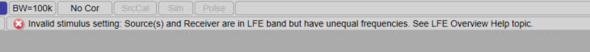
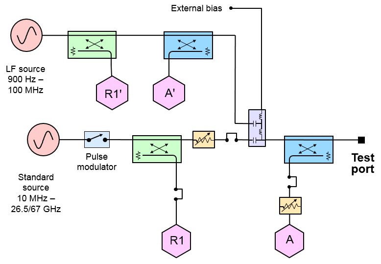

# LFE Overview

The 2-port and 4-port Low Frequency Extension (LFE) options add additional
hardware to extend the start frequency of the VNA down to 900 Hz.

Note: Source and Receiver frequencies MUST BE EQUAL if both are in the LFE
frequency band and LFE is turned on. If they are both in the LFE band and they
are not equal, the following error message is displayed and the VNA will go
into Hold mode:  
  

In this topic:

  * Model Compatibility
  * LFE Block Diagram
  * Supported Applications

## Model Compatibility

The Low Frequency Extension options are available for the following models:

PNA Model | Model Option  
---|---  
2-Port | 4-Port  
[205](../../Support/Configurations.md#205) | [220](../../Support/Configurations.md#220) |  |  | [405](../../Support/Configurations.md#405) | [420](../../Support/Configurations.md#420) | [425](../../Support/Configurations.md#425-N5242B) | [425+S93029A/B](../../Support/Configurations.md#425-029-N5247B)  
N5221B | √ | √ |  |  | √ | √ |  |   
N5222B | √ | √ |  |  | √ | √ |  |   
N5224B | √ | √ |  |  | √ | √ |  |   
N5225B | √ | √ |  |  | √ | √ |  |   
N5227B | √ | √ |  |  | √ | √ |  |   
N5241B | √ |  |  |  |  |  | √ | √  
N5242B | √ |  |  |  |  |  | √ | √  
N5244B |  |  |  |  |  |  | √ | √  
N5245B |  |  |  |  |  |  | √ | √  
N5247B |  |  |  |  |  |  | √ | √  
N5249B |  |  |  |  |  |  | √ | √  
  
## LFE Block Diagram

The following LFE block diagram shows how the low-frequency hardware is
configured for a single test port. The other ports are configured similarly.

## Supported Applications

The following table shows which applications are supported/not supported by
LFE.

Application | Supported by LFE? | Option  
---|---|---  
Gain Compression | Yes | [S93086A/B](../../Support/Configurations.md#S93086A)  
Gain Compression Converters | Yes | [S93086A/B](../../Support/Configurations.md#S93086A)  
Scalar Mixer/Converter (magnitude only) | Yes | [S93082A/B](../../Support/Configurations.md#082)  
Frequency Offset Mode | Yes | [S93080A](../../Support/Configurations.md#080)  
Time Domain | Yes | [S93010A/B](../../Support/Configurations.md#S93010A)  
Dynamic Uncertainty Analysis | Yes | [S93015A/B](../../Support/Configurations.md#S93015A)  
Fast CW | Yes | [S93118A/B](../../Support/Configurations.md#S93118A)  
Auto Fixture Removal | Yes | [S93007A/B](../../Support/Configurations.md#S93007A)  
Scalar Mixer/Converter + Phase | No | [S93083A/B](../../Support/Configurations.md#083)  
Vector Mixer/Converter | No | [S93083A/B](../../Support/Configurations.md#083)  
Embedded LO | No | [S93084A/B](../../Support/Configurations.md#084)  
Swept IMD | No | [S93087A/B](../../Support/Configurations.md#S93087A)  
Swept IMD Converters | No | [S93087A/B](../../Support/Configurations.md#S93087A)  
IM Spectrum | No | [S93087A/B](../../Support/Configurations.md#S93087A)  
IM Spectrum Converters | No | [S93087A/B](../../Support/Configurations.md#S93087A)  
True-Mode Stimulus Application (TMSA) | No | [S93460A/B](../../Support/Configurations.md#S93460A)  
Source Phase Control | No | [S93088A/B](../../Support/Configurations.md#S93088A)  
Multiport | No | [S93551A/B](../../Support/Configurations.md#551)  
Differential IQ | No | [S93089A/B](../../Support/Configurations.md#S93089A)  
Spectrum Analyzer | No | [S93090xA](../../Support/Configurations.md#S930900A), [S9309xA](../../Support/Configurations.md#S93093A)  
Pulsed RF | No | [S93025A/B](../../Support/Configurations.md#S93025A) with [021](../../Support/Configurations.md#021) and [022](../../Support/Configurations.md#022)  
Noise Figure | No | [S93029A/B](../../Support/Configurations.md#029)  
Noise Figure Converters | No | [S93029A/B](../../Support/Configurations.md#029)

