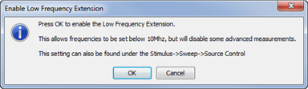

# Starting and Exiting LFE

In this topic:

  * Starting LFE
  * Starting LFE with Auto-Enable
  * Exiting LFE

## Starting LFE

#### How to start LFE  
  
---  
Using Hardkey/SoftTab/Softkey |  Using a mouse  
  
  1. Press Sweep > Source Control > LF Extension.
  2. Ensure that ON is selected in the LF Extension softkey.

|

  1. Click Stimulus
  2. Select Sweep
  3. Select Source Control
  4. Select LF Extension [on/OFF]

  
  
  
## Starting LFE with Auto-Enable

If the frequency is set below 10 MHz and LFE is disabled (OFF), the following
dialog is displayed. Pressing OK enables LFE.

## Exiting LFE

  1. On the VNA, press Sweep > Source Control > LF Extension.
  2. Ensure that OFF is selected in the LF Extension softkey.

