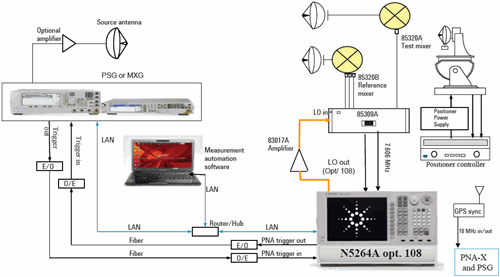

# N5264B Measurement Receiver

* * *

The N5264B is a PNA-X with no Source Ports or Tunable receivers. This makes
the N5264B a very fast and very sensitive IF receiver that has been designed
specifically for antenna and radar cross-section (RCS) measurements. When used
with external sources, the N5264B can make frequency-scan measurements of
antennas, or make RCS measurements in time domain.

  * [N5264B Options and Limitations](N5264A.md#Options)

  * Configuring the N5264B

  * [IF Receivers](N5264A.md#IFReceivers)

  * [Internal LO Source](N5264A.md#InternalLO) (Opt 108)

  * [External Sources](N5264A.md#External)

  * [How to Create Measurements](N5264A.md#createMeas)

  * [Calibrating the N5264B](N5264A.md#Calibration)

  * ### See Also

  * [FIFO and other Antenna Features](FIFO_and_other_Antenna_Features.md)

  * [Antenna Selection Guide](http://literature.cdn.Keysight.com/litweb/pdf/5968-6759E.pdf)

  * 85309 Manual updated for VNA -P/N 85310-90002

  * [N5264B Specs](../Specs/ManualChoice.md)

Typical N5264B Application

Far Field Outdoor Antenna Measurements

* * *

## N5264B Options and Limitations

The N5264B has the following options:

  * IF Receiver (base model) - The A,B,C,D, and R receivers are always set at the specified IF frequency.

  * IF Receiver + LO source (Opt 108) - In addition to the receiver-only option, this option adds a 10 MHz to 26.5 GHz LO source.

  * Fast-Sweep / FIFO Mode (Opt S93118A/B) - These features together allow you to make very fast measurements and save the data to a remote computer. [Learn more.](FIFO_and_other_Antenna_Features.md#FastSweep)

### Limitations

The following VNA features are NOT available on the N5264B

  * No Source ports

  * No S-Parameters - [Arbitrary ratioed parameters ARE allowed](N5264A.md#createMeas).

  * [No Application support](../Applications/Applications.md)

  * [Limited Calibrations](N5264A.md#Calibration)

## Configuring the N5264B

### IF Receivers

  * The five IF receiver inputs are on the N5264B [rear panel](../Rear_Panel/XRtour.md).

  * All five IF receivers are measured at the same time. However, only those measurements that are displayed are updated.

  * External mixers are always required to down-convert signals to the IF frequency.

  * The default IF frequency for the N5264B is 7.605634 MHz.

  * Change the IF frequency to any value between +14.9999 MHz and -14.9999 MHz using [SENS:IF:FREQ](../Programming/GP-IB_Command_Finder/Sense/XSensIF.md#freqValue) (SCPI) or [IFFrequency](../Programming/COM_Reference/Properties/IFFrequency_Property.md) (COM) commands.

### Internal LO Source (Option 108) - 10 MHz to 26.5 GHz

The LO source output connector is on the N5264B [rear
panel](../Rear_Panel/XRtour.htm).

The power level of the internal LO source is typically about +10 dBm and can
NOT be changed.

To change the frequency of the LO Source:

  1. Change the IF frequency of the measurement if necessary.

  2. On the [FOM dialog](../FreqOffset/Frequency_Offset_Mode.md#FreqOffsDiag), change Receivers frequencies to the RF frequency range to be measured.

  3. The LO Source frequency range is set automatically. This frequency value can not be viewed.

### External Sources

Because the N5264B has no internal sources (except for the optional LO), newly
created measurements are displayed with a source port = 0 (zero).

External sources can be configured so that they are controlled by the N5264B.
[Learn how to configure an external
source.](../System/Configure_an_External_Device.htm)

Once configured, all existing and new measurements are changed to use the
external source as the source port. When two or more sources are configured,
the first configured source is displayed by default.

The external source settings can be changed from the following dialogs:

  * [Power and Attenuators dialog](../S1_Settings/Power_Level.md#Advanced) \- Controls the ON | OFF state (set to Auto by default) and Power level of the external source.

  * [FOM dialog](../FreqOffset/Frequency_Offset_Mode.md#FreqOffsDiag) \- Controls the frequency range. External sources are listed by name and uncoupled by default.

### How to Create Measurements

Create ratioed and unratioed measurements using the standard [Receivers
tab](../S1_Settings/Measurement_Parameters.htm#Receiver).

S-parameters are not available.

### Calibration

The only calibrations available are Response, Source Power and Receiver
calibrations.

These are performed from the [Unguided Cal
Wizard](../S3_Cals/Calibration_Wizard.htm#unguided).

* * *

