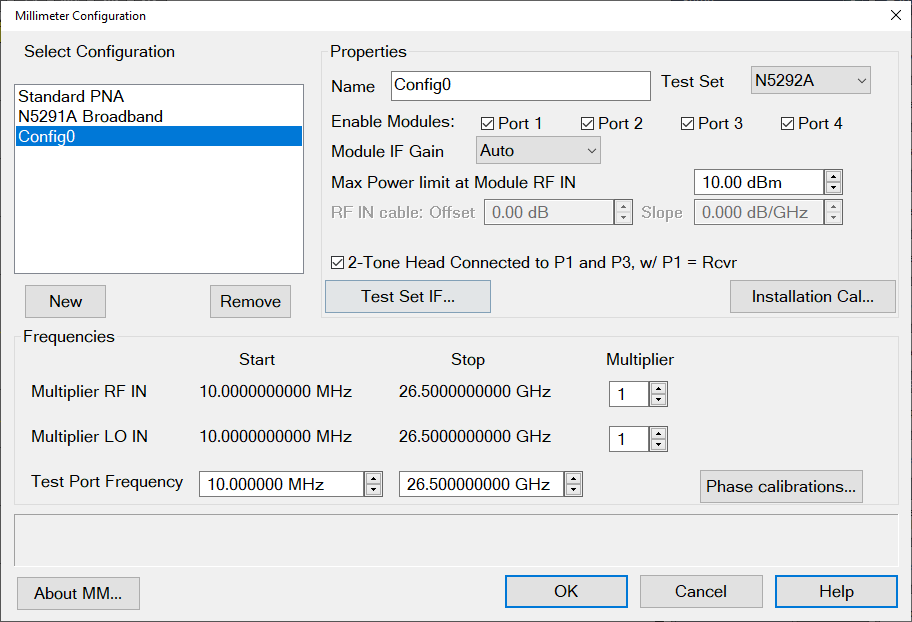

# Banded System Measurement Setup

Banded refers to any configuration that is not a broadband configuration and
is waveguide based. Frequency extenders cover frequency ranges from 50 GHz to
1.1 THz. The supported solutions can be configured for different frequency
bands with the N5292A Test Set controller depending on the measurements
required and the frequency extenders being used.

After minimal setup shown below, the N5290A/91A functions the same as a
standard VNA. All ports can be used at mmWave frequencies or a combination as
required.

The following table shows the waveguide designation equivalents.

MIL-DTL-85/3C | IEEE Std 1785.1 | Frequency Range  
---|---|---  
WR-15 |  WM-3759 |  50 GHz to 75 GHz  
WR-12 |  WM-3099 |  60 GHz to 90 GHz  
WR-10 |  WM-2540 |  75 GHz to 110 GHz  
WR-08 |  WM-2032 |  90 GHz to 140 GHz  
WR-06 |  WM-1651 |  110 GHz to 170 GHz  
WR-05 |  WM-1295 |  140 GHz to 220 GHz  
WR-04 |  WM-1092 |  170 GHz to 260 GHz  
WR-03 |  WM-864 |  220 GHz to 330 GHz  
WR-02 |  WM-570 |  330 GHz to 500 GHz  
WR-1.5 |  WM-380 |  500 GHz to 750 GHz  
WR-1.0 |  WM-250 |  750 GHz to 1.1 THz  
Reference: IEEE Standard for Rectangular Metallic Waveguides and their
interfaces for frequencies of 110 GHz and above - Part 1: Frequency Bands and
Waveguide Dimensions.  
  
## Requirements

  * N5292A Test Set

  * DC Source to provide bias voltage to frequency extenders

  * Option S93080A/B and 020

  * Special adapter cable to connect between frequency extender and N5292A Test Set

  * [Source power calibration](../../S3_Cals/PwrCalibration.md#SourcePowerCalDiagIm) is required for ALL power related measurements with banded millimeter modules

## Limitations

  * ONLY the applications listed in Supported Applications are supported
  * Banded measurements must use the N5292A Test Set

  * No DC power connector in N5292A Test Set to provide bias voltage to frequency extenders for banded measurements

  * No automatic power leveling. However, after performing an [Installation Calibration](Millimeter_Configuration.md#Installation_Cal), the source power at the output of the N5293A or N5295A Frequency Extender is adjustable.

  * Simultaneous broadband and banded measurements NOT supported

  * Work with your frequency extender vendor to determine appropriate IF Gain settings as necessary. For instance, most VDI supplied extenders require 8 dB IF Gain.

### See Also

  * [Banded Millimeter Configuration Dialog](Millimeter_Configuration.md#Banded_Millimeter_Configuration_Dialog)
  * Supported Applications
  * [Supported Configurations](Supported_Configurations.md)

  * [Low Frequency Extension (LFE)](../Low_Frequency_Extension/Overview.md)

## Setting Up a Measurement

  1. Press Setup > External Hardware > Millimeter Config.
  2. Select a banded configuration.

  3. Click PNA RF Source or PNA LO Source to launch the [External Devices dialog](../../System/Configure_an_External_Device.md) where you can select an internal or external source to be used for the VNA RF source or VNA LO source.

  4. Set the appropriate Multiplier values that are specified in your mmWave module documentation.
  5. In the Test Port Frequency fields, set the Start and Stop frequencies.
  6. Ensure that the RF and LO Frequencies are within the frequency range of the sources. The VNA offers no warning if they are NOT.
  7. Press OK. This closes the dialog.

