# Calibration

The procedure in this topic describes how to perform a calibration using the
[Cal All Calibration Wizard](../../S3_Cals/Calibrate_All_Channels.md) method,
which allows multiple channel calibration in a single session.

Also described here is the Installation Cal, which should be done each time a
change is made to the configuration, and the Banded Installation Menu, which
is displayed only when a calibration is out of date or has not been performed.

Calibration procedures accessed in the user interface vary depending on which
application ([Measurement Class](../../S1_Settings/Measurement_Classes.md))
is active. For information about other calibration methods and their purpose,
refer to the following links:

  * [Basic Cal](../../S3_Cals/Calibration_Wizard.md#BasicCal) (separate topic)
  * [Smart Cal](../../S3_Cals/Calibration_Wizard.md#GuidedCal) (separate topic)
  * [ECal](../../S3_Cals/Using_ECal.md) (separate topic)
  * [Response Cal](../../S3_Cals/Calibration_Wizard.md#unguided) (separate topic)
  * [Source Power Cal](../../S3_Cals/PwrCalibration.md#SourcePowerCal) (separate topic)
  * [Mixer Char Wizard](../../FreqOffset/VMC_Measurements.md#MixerCharCal) (separate topic)
  * [Phase Reference Wizard](../../FreqOffset/Phase_Reference_Calibration.md#Detailed) (separate topic)
  * Cal All Procedure
  * Installation Cal

  * Creating a Power Table
  * Installation Calibration on a Banded Configuration

## Cal All Procedure

A power table can be used instead of multiple power sensors to cover a wide
frequency range. In addition, a power table can be used when the measurement
frequency exceeds the frequency range of the power sensor (typically > 110
GHz). Refer to Creating a Power Table for information on how to create a power
table.

  1. Ensure that the measurement classes to calibrate are active.

  2. Press Cal > Main > Other Cals > Cal All... to launch the following dialog showing the active measurement classes:

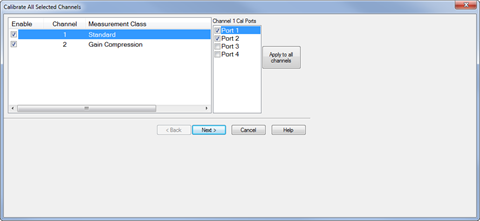

  5. Check the measurement classes to calibrate.

  6. Select the ports, then click on the Apply to all channels button to apply the port selections to all channels.

  7. Click Next, then confirm or change the calibration properties in the Measurement Class Cal Properties dialog.

  8. Click Next. to access the Calibration Attenuator Settings dialog.

  9. In the Calibration Attenuator Settings dialog, perform the following:

     1. Set the attenuator settings. [Learn more](../../S3_Cals/Calibrate_All_Channels.md#CalAttnSettingsDiag).

     2. Click on the Noise Reduction button to improve measurement accuracy. [Learn more](../../S2_Opt/Trce_Noise.md).

     3. Click on the Mechanical Devices button to view all switches and attenuators in the VNA. [Learn more](../../System/Mechanical_Devices.md).

  10. Click Next, then select the DUT connectors and calibration kits in the Select DUT Connectors and Cal Kits dialog.

  11. .Click Next to access the Power Cal Settings dialog.

  12. In the Power Cal Settings dialog, perform the following:

     1. Check Use Multiple Sensors if more than one power sensor is needed to cover the frequency range then select a sensor from the Sensor down menu.

     2. Otherwise, check Use Multiple Sensors then select the power table from the Sensor drop down menu. Learn how to create a power table.

     3. Learn more about [Accuracy Tolerance](../../S3_Cals/Guided_Power_Calibration.md#Accuracy) and [Max Number of Readings](../../S3_Cals/Guided_Power_Calibration.md#Accuracy).

  13. Click Next and follow the calibration process until completed.

## Installation Cal

This calibration should be done each time a change is made to the
configuration.

  1. Press Setup > External Hardware > Millimeter Config.

  2. Click New to create a new configuration or select one from the list under Select Configuration.

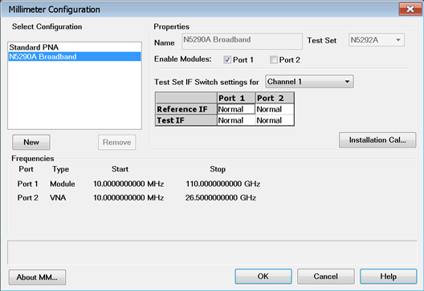

  3. If desired, change the name shown in the Name field.

  4. Click on the Installation Cal... button to launch the calibration. The following dialog is displayed.

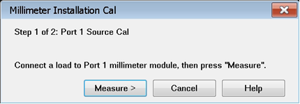

  5. Connect a load to the port then click the Measure button.

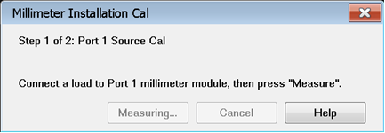

  6. When finished, the following dialog is displayed. Remove the load then click the Finish button.

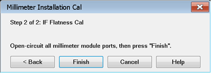

  7. The following dialog is displayed until the calibration is finished.

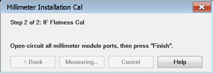

## Creating a Power Table

A power table is a text file with data that describes the output power of the
module as a function of frequency. This is valid when the frequency extender
module is driven at high levels (+11 dBm). This file may have been created for
you by a third party or shipped with your frequency extender Module. If not,
you can create this *.prn file from the manufacturer's specification for the
frequency extender module.

This file can be created manually, using a text file program such as Notepad.

  1. Copy the header information, and create the file with two columns, one for frequency and one for output power.

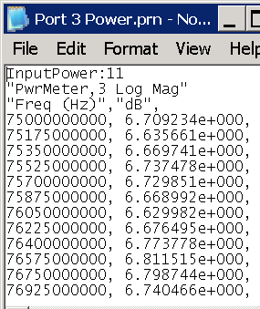

Example .prn file

  2. Name the power table file powertable1.prn, where "1" corresponds to the port number. This file must be stored in the following directory on the VNA:

C:\ProgramData\Keysight\Network Analyzer\Configurations\<configuration name>\

where configuration name is a directory name that is also the name of the
currently selected configuration in the [Millimeter
Configuration](Millimeter_Configuration.htm#MillimeterDiagHelp) dialog. For
example, "N5291A Broadband".

  3. Once the power table has been created and saved to the directory shown above, it will be listed in the Sensor drop down menu in the Power Cal Settings dialog where it may be selected instead of a power sensor.

## Installation Calibration on a Banded Configuration

The following describes the process for the installation and calibration when
using banded 3rd party frequency extenders with a PNA/PNA-X that is connected
via a N5292A test controller.

This is to ensure that when the N5290/91A broadband is used with the N5290A304
1.8m cable adapter the system is optimized for the best power levels being
applied to the RF and LO of the external modules. In addition, it will ensure
that we have a calibrated IF channel for accurate raw receiver measurements
that require this level of accuracy, like the Spectrum Analysis application.

Note that the above calibration and installation process optimized for use
with supported VDI and OML frequency extenders. While other Frequency
extenders maybe used, they should at minimum comply to the requirements as
follows:

  1. Nominal RF saturated power requirement of 10 dBm +/- 4 dBm. (9.2GHz-21.3GHz).

  2. Nominal LO saturated power requirement of 10 dBm +/- 3 dBm. (9.2GHz-21.3GHz).

  3. The IF level should be optimized for an operation of 7.606 MHz and not exceed the -20 dBm.

### System Hardware

In the description we will use the following hardware:

  1. N5247B
  2. N5292A Test Set Controller
  3. WR-10 3rd party frequency extenders

### Required Calibration Hardware

The process would require at least a 26.5 GHz power sensor and adapter to
complete.

### Overall Process

  1. Connect the PNA-X, controller and attach the N5290A304 cable adapters
  2. Do not connect the frequency extenders to the N5290304A cable adapters
  3. Connect the power sensor to the PNA-X
  4. Configure the power sensor for measurements
  5. Use the millimeter Wave Configuration Dialog to configure the modules.
  6. Select the installation menu to start the calibration of the system
  7. Complete the calibration steps, for optimal performance all steps should be completed.

### Procedure

The following set of descriptions are intended to walk through the individual
steps needed to complete the calibration of the banded setup.

#### Millimeter Wave Dialog

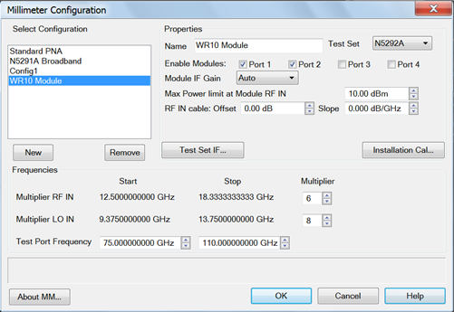

  1. Assign a name to the configuration. In this example we use “WR10 Module”.
  2. Assign the ports on the N5292A to which the Frequency extenders will be connected.
  3. Set the RF and LO Multipliers, 6 and 8 in this example.
  4. Assign Test Set to be a N5292A and the ports for the modules to be connected.
  5. Click the Installation Cal... button. The Banded Installation Menu dialog appears.

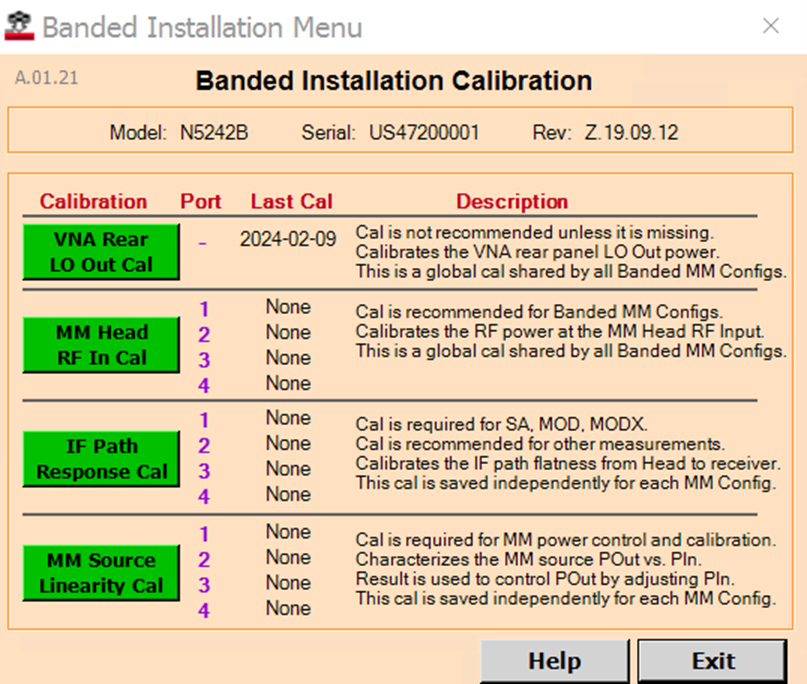

The 4 Cals should run in the order shown: LO first, RF second, IF third, MM
source linearity fourth. (Calibrations described below.)

#### LO Calibration

Before starting the LO calibration, disconnect the (Test Set to PNA) rear
panel LO cable from the PNA. The Banded LO Cal requires a 3.5 mm Power Sensor
to be connected to the PNA rear panel LO connector.

  1. In the Banded Installation CAL window, click Begin LO. The following dialog box will appear.

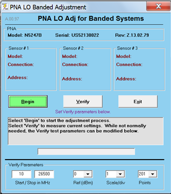

  2. Leave the system default settings and complete the LO calibration.
  3. Zero and Calibrate the Power Sensor.
  4. Connect the Power Sensor to the PNA Rear Panel LO as shown below.  
  
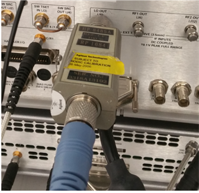

  5. Click Begin to run the LO Calibration. It will complete in less than a minute. When done, disconnect the Power Sensor from the PNA rear panel and reconnect the Test Set LO Cable.

  6. Optionally, you can run the LO CAL Verify by clicking on the Verify button.  
.  
The first (bottom) trace shows LO Power without the Cal applied.  
  
The second (top) trace shows LO power after the Cal is applied.  
  
Overlap is normal for frequencies less than 8 GHz and greater than 22 GHz.  
  
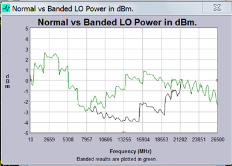

#### RF Calibration

  1. In the Banded Installation CAL window, click Begin RF. The following dialog box will appear.  
  
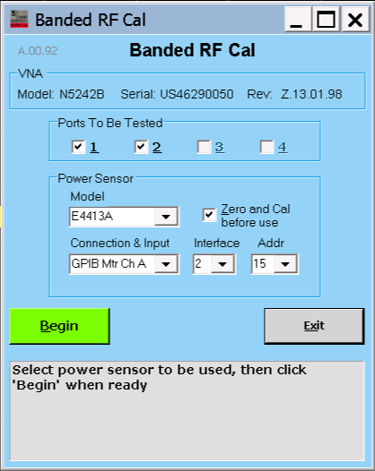

  2. Select the Power meter and complete the calibration by connecting the power sensor to the end of the N5290A304 adapter cable RF cable as shown below.  
  
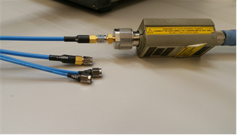

  3. Click Exit when done with the RF Cal.

#### IF Calibration

  1. Turn off the N5292A controller and connect up all the banded modules.
  2. Turn on the controller and leave all ports open.
  3. Connect all the LO and RF cables to the modules.
  4. In the Banded Installation CAL window, click Begin IF. The following dialog box will appear.  
  
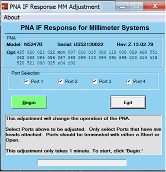

  5. Once complete the system will be optimized for the best settings to be used by the banded system configured.

#### MM Source Linearity Cal

The MM Source Linearity Cal is a 2D source calibration (frequency and power).
It uses a new dynamic source calibration algorithm that determines the
frequencies and powers to sample on the fly. By comparing measured powers in
the reference receiver to the provided saturated output powers of the head, a
mixer calibration is also performed.

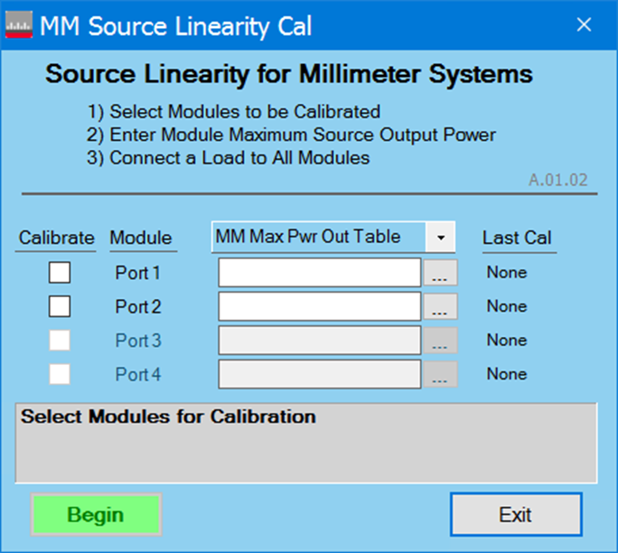

Calibrate: These checkboxes determine which ports will be calibrated.

MM Max Pwr Out Table: Load a PMax table for each port that is selected for
calibration. PMax tables contain saturated output powers at different
frequencies. (Note: format for file shown below.)

Last Cal: Shows the timestamp of the last calibration acquired for each port.

Begin: Disabled until at least one port is selected and a MM Max Pwr Out Table
is provided for each selected port.

MM Max Pwr Out Table file format: The file is a standard PRN file as exported
from the PNA, but it includes one extra line at the beginning specifying the
mm head input power used to generate the table. Here is a sample:

"InputPower:10dBm"  
"PowerSensor,1 Log Mag"  
"Freq (Hz)","dBm",  
110000000000, 4.719963e+00,  
110300000000, 4.734131e+00,  
110600000000, 5.153255e+00,  
110900000000, 5.307924e+00,  
111200000000, 5.506047e+00,  
111500000000, 5.586389e+00,  
111800000000, 5.767347e+00,  
112100000000, 5.911865e+00,  
112400000000, 6.110046e+00,  
112700000000, 6.194704e+00,  
113000000000, 6.357737e+00,  
113300000000, 6.423913e+00,  
113600000000, 6.425033e+00,  
113900000000, 6.452572e+00,

In place of a power table, the calibration can also be performed using a fixed
power level. This uses the same saturated output power for all frequencies.

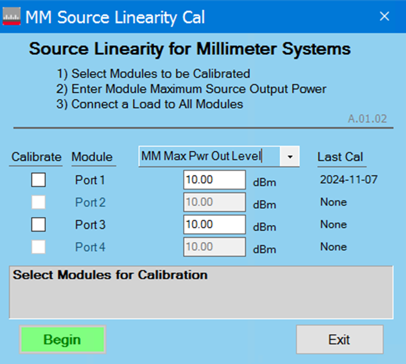

MM Max Pwr Out Level: The saturated output power of the head.

