# Installation Cal

This topic describes how to perform an Installation Cal for standard systems
(N5290A/N5291A) or for systems above 120 GHz (N5291A170/N5291A220), which
should be done each time a change is made to the configuration.

  1. Installation Source Calibration 

     1. This process allows us to characterize the raw source power of each module by varying the power to the module and measuring the response over frequency using the reference receiver.

     2. During this process we create a 2-D power table that would be used when we want to set the power at the port of the module.

  2. User Source Power Calibration

     1. This is only done prior to making a measurement that requires an accurate power at the measurement port, which could be the module test port or the end of a cable or adapter.

     2. Generally is a single sweep measurement at the required power, and uses the Installation power calibration to adjust the power for different power levels.

  3. IF Flatness calibration

     1. For this process we require that the module do not have anything attached

     2. In this case we adjust the IF loss from the receiver in the module to the IF input at the rear of the PNA-X

     3. It also matches the IF to that of the internal DAC range.

Note: The Installation Cal must be performed before the [Smart
Cal](Calibration.htm#Cal_All_Procedure_PXI) procedure.

In this topic:

  * Installation Cal - N5290A/N5291A
  * Installation Cal - N5291A170/N5291A220

## Installation Cal \- N5290A/N5291A

  * If power level control is required, perform Installation Calibration.

  * The Installation Calibration should be done each time a change is made to the physical configuration, i.e. a cable change, a change in millimeter head, or a PXI module change.

  * The Installation Calibration characterizes the input/output power relationship for each millimeter module.

  * The Installation Calibration results in a +/- 5 dB source power calibration.

  * The Installation Calibration does NOT provide any calibration of the VNA receivers.

  * The Installation Calibration is applied system wide. It can be enabled and disabled, but only on a system wide basis. It cannot be enabled or disabled on a channel by channel basis.

The following example is for a banded system. The sequence will be different
for different port counts.

  1. Press Setup > External Hardware > Millimeter Config. The Millimeter Configuration dialog is displayed.

  2. Select an existing millimeter configuration from the list under Select Configuration. For information on creating a millimeter configuration, refer to the [Millimeter Configuration Dialog](Millimeter_Configuration.md) help.

  3. Click on OK to enable the configuration.

  4. Press **Setup** > **_External Hardware_** > **Millimeter Config** to get back to the Millimeter Configuration Dialog.

  5. Click on the Installation Cal... button to launch the calibration. The following dialog is displayed. This dialog displays the calibration date for each port if calibration was previously performed. Otherwise, "Not Available" will be shown in the Cal Date column. Also, “Not Available” will be shown for the Model number, as the supported Frequency Extenders do not provide their Model numbers electronically.

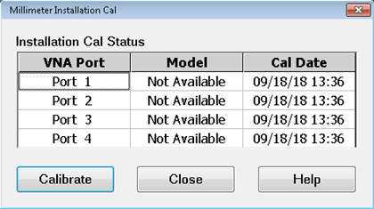

  6. Click on the Calibrate button to begin the calibration.

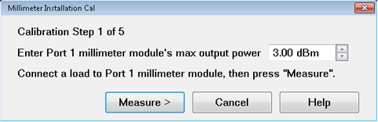

  7. In the USB drive supplied with the millimeter wave module is a file containing maximum output power data. Open this file to find the maximum output power for the module and enter this value in the Enter Port 1 millimeter module's max output power field. _It is important to enter the correct maximum power to get a good Installation Calibration._ The following is an example of a section of this file.

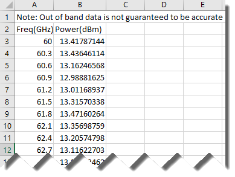

  8. Connect a waveguide load to Port 1 _._

  9. Click the Measure button. The following dialog is displayed.

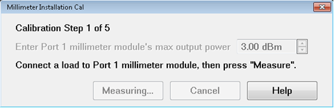

  10. Follow the prompts to calibrate each port. Remember to enter the correct maximum power for each module.

  11. When finished, the following dialog is displayed. Click the Finish button.

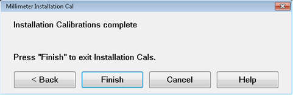

  12. When finished, Enable Installation Cal in the Millimeter Configuration dialog should be checked and the calibration date/time displayed.

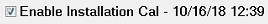

## Installation Cal - N5291A170/N5291A220

The following example is for a 2-port N5291A170/N5291A220 broadband system.

  1. Press Setup > External Hardware > Millimeter Config. The Millimeter Configuration dialog is displayed.

  2. Select an existing millimeter configuration from the list under Select Configuration (for example N5291A220 - 220 GHz Broadband). For information on creating a millimeter configuration, refer to the [Millimeter Configuration Dialog](Millimeter_Configuration.md) help.

  3. Click on the Installation Cal... button to launch the calibration. The following dialog is displayed. This dialog is used to load the correction files for both ports. The Next > button will be enabled when all files have been loaded.  
  
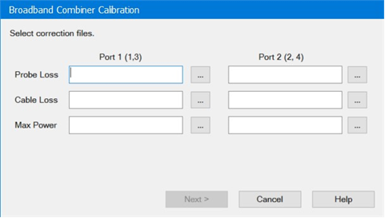  
  
Port 1 (1,3) – Refers to the System Port 1 which is combined in the probe
using the N5292A Port 1 connected to a N5295AX module and the N5292A Port 3
connected to a N5262BW05 (EB0/EB01) or N5262BW06 Module.  
  
Port 2 (2,4) \- Refers to the System Port 2 which is combined in the probe
using the N5292A Port 2 connected to a N5295AX module and the N5292A Port 4
connected to a N5262BW05 (EB0/EB01) or N5262BW06 Module.  
  
Probe Loss – Refers to the loss data file as supplied by FormFactor©, for each
of the combiner probes connected to either port 1 or port 2. Ensure that the
correct file is selected for each of the ports.  
  
Cable loss – Refers to a loss measurement of the 1.0 mm cable that is
connected to the combiner probe. This data file can be measured or obtained
from FormFactor©.  
  
Max Power – This is a max power table as supplied by VDI© and is available on
the USB stick. Note each USB stick has a serial number that matches the module
that is connected to the Port on the N5292A controller.

Note: It is critical that the files selected match the hardware being used.
Any changes to hardware requires a new Installation Calibration.

Note: As a best practice, save all required files prior to initiating the
installation process into a Port 1 Data Files directory and Port 2 Data Files
directory. This makes it easy to point to the required files in the above
dialog.

  4. Click on the Next > button. If the files loaded in the previous step are invalid or corrupt, the following message will be displayed indicating which files need to be re-loaded:  
  
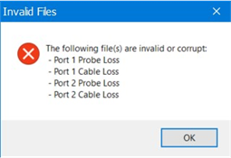

  5. Disconnect the heads from the combiners and probes as indicated in the following dialog then click on the Measure button. During this step of the Installation Calibration, the ports of all four modules must be open. This step allows for the accurate calibration of the system receivers.  
  
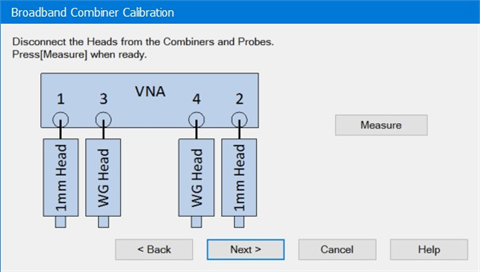

  6. Connect the WG (wave guide) heads together (can be connected without an adaptor) and connect the 1 mm heads together using the Keysight 11500I test cable (p/n 11500-60001)then click on the Measure button. During the final step all modules must be connected as a flush through. For the 1.0 mm modules, a short cable or adapter may be used.  
  
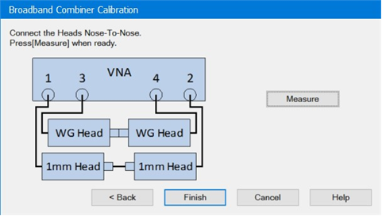

  7. When completed, click on the Finish button.

  8. Clicking on the Finish button before completing all measurements results in the following warning:  
  
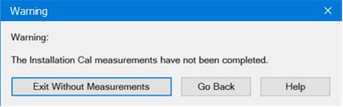  
The Go Back button returns to the previous dialog.  
The Exit Without Measurements button forces the process to complete without
all measurement data.

Note: Exit Without Measurements can be used when you only want to update the
probe files without running the installation calibration.

