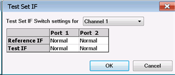
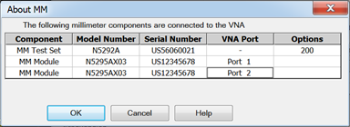
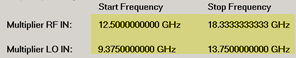
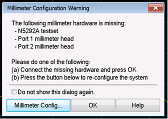
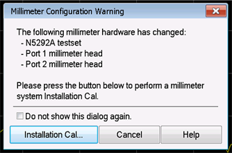

# Millimeter Configuration

This topic describes the Millimeter Configuration dialog functions used to
configure the N5290A/91A for
[broadband](Broadband_System_Measurement_Example.md) or
[banded](Banded_System_Measurement_Example.md) measurements.

In this topic:

  * Accessing Millimeter Configuration Dialog
  * Broadband Millimeter Configuration Dialog
  * Banded Millimeter Configuration Dialog
  * Warning Messages

### See Also

  * [N5290A/91A (N5292-90002) Millimeter Wave System Installation Guide](http://literature.cdn.keysight.com/litweb/pdf/N5292-90002.pdf) (requires internet connection) for information about front and rear panel interconnections.

  * [N5290A/91A (N5292-90026) Millimeter System Service Guide](http://literature.cdn.keysight.com/litweb/pdf/N5292-90026.pdf) (requires internet connection)

  * [Broadband System Measurement Setup](Broadband_System_Measurement_Example.md)

  * [Banded System Measurement Setup](Banded_System_Measurement_Example.md)

## Accessing Millimeter Configuration Dialog

  * Press Setup > External Hardware > Millimeter Config.

## Broadband Millimeter Configuration Dialog

Broadband Millimeter Configuration dialog box help |    
---|---  
 Select
Configuration Lists the Standard VNA configuration, N529xA configuration, and
other configurations that you have created.

  * Click New to create a new Millimeter Module configuration. A name is automatically selected. Edit the Selected Configuration field to change the configuration name.
  * Click Remove to delete the selected Millimeter Module Configuration.
  * Select N5290A Broadband or N5291A Broadband
  * For banded, define a frequency band.
  * Select Standard PNA to exit the Millimeter mode to use the analyzer as a standard VNA.

### Properties

Name Shows the currently selected configuration. Edit this field to change the
configuration name. Type a unique name using only alphanumeric and underscore
characters. Test Set When N5290A Broadband or N5291A Broadband is the selected
configuration, the N5292A test set is automatically selected. No other test
set can be selected for the Broadband configuration. Enable Modules Enable or
disable modules (frequency extenders) for the corresponding ports.  Test Set
IF... button  Test Set IF
Switch settings for Channel N Route the Reference or Test IF to the front
panel (Front) or rear panel (Normal) of the test set. The Normal setting sets
the IF bandwidth to 40 MHz. The Front setting sets the IF bandwidth to 2 GHz.
Each port has a Reference IF and a Test IF switch. Each IF switch is
independent per port and per channel. At preset, the default is Normal. IF
switch settings are saved with the instrument state.

### Installation Cal... The installation calibration adjusts the source power
at the output of the N5293A or N5295A Frequency Extender. It also adjusts for
IF path loss variation. These can change each time a frequency extender is
moved from one port to another, or from one system to another. This
calibration should be done each time a change is made to the configuration.
For a procedure, refer to [Installation Cal](Installation_Cal.md).

### Frequencies

Port This is the port number of the VNA when in Standard PNA mode or the port
number of the N5292A test set when in N529xA Broadband mode. Type The port
type is set to Module when a frequency extender (N5293A or N5295A) is detected
at the port. The Enable Modules checkbox will be checked for the port. When a
frequency extender is not detected at the port, or the Enable Modules for the
port is deselected, VNA is displayed to specify the standard VNA operation at
the port. Start/Stop Displays the Start and Stop frequency of the frequency
extenders (N5293A or N5295A) connected to each port and/or any VNA port in
standard mode. Start/stop frequencies can be set by pressing Freq > Main >
Start or Stop then entering the frequency. Cancel Closes dialog box without
saving changes. OK Saves the configuration and the VNA is Preset before making
the appropriate settings. About MM... Displays information about the current
hardware configuration.   
  
## Banded Millimeter Configuration Dialog

Banded Millimeter Module Configuration dialog box help |    
---|---  
 Select Configuration Lists
the Standard VNA configuration and other configurations that you have created.

  * Click New for first-time use.
  * For the N529xA, select N529xA Broadband.
  * For banded, define a frequency band.
  * Select Standard PNA to exit the Millimeter Configuration dialog.

Name Shows the currently selected configuration. Edit this field to change the
configuration name. Type a unique name using only alphanumeric characters and
underscore. New Click to create a new Millimeter configuration. A name is
automatically selected. Edit the Name field to change the configuration name.
Remove Deletes a Millimeter Configuration.

### Properties

Test Set Select a test set to use in the current configuration. The firmware
verifies that the selected test set is connected. If the selection does not
match the connected test set, an error message is displayed. However, you are
not prevented from continuing. Enable Modules Enable or disable modules
(frequency extenders) for the corresponding ports.  Module IF Gain When Auto
is selected, the IF gain is automatically adjusted depending on the frequency
of operation to avoid overdriving the receivers. In addition, you can manually
select 0 dB, 2 dB, 4 dB, 6 dB, 8 dB, 10 dB, 11 dB, 13 dB, or 15 dB. Max Power
Limit at Module RF IN The maximum mmWave module RF input is limited to this
value when Test Set RF ALC is OFF. When you exit this dialog box using OK, set
the power out of the VNA using the [Power and Attenuator
dialog.](../../S1_Settings/Power_Level.htm#Advanced) Offset Sets the loss of
the cables. The mmWave module RF input is adjusted by this amount. Positive
offset increases the power. Slope Helps compensate for cable and test fixture
power losses at increased frequency. The mmWave module RF input power
increases as the sweep frequency increases in dB/GHz. The slope is defined
relative to the mmWave module RF input frequency. The slope starts at 0 Hz and
a positive slope will increase the power level. Range is +/- 2 dB/GHz. 2-Tone
Head Connected to P1 and P3, w/ P1 = Rcvr This checkbox is only available when
using an N5292A test set and when Port 1 and Port 3 are checked in "Enable
Modules." Test Set IF... button
 Test Set IF Switch
settings for Channel N Route the Reference or Test IF to the front panel
(Front) or rear panel (Normal) of the test set. The Normal setting sets the IF
bandwidth to 40 MHz. The Front setting sets the IF bandwidth to 2 GHz. Each
port has a Reference IF and a Test IF switch. Each IF switch is independent
per port and per channel. At preset, the default is Normal. IF switch settings
are saved with the instrument state. Installation Cal... The installation
calibration adjusts the source power at the output of the N5293A or N5295A
Frequency Extender. It also adjusts for IF path loss variation. These can
change each time a frequency extender is moved from one port to another, or
from one system to another. This calibration should be done each time a change
is made to the configuration. For a procedure, refer to [Banded Installation
Menu Calibration](Calibration.htm#Banded_RF_Cal).

### Frequency Settings

Multiplier RF IN RF Frequency Range (displayed in grey fields) multiplied by
the multiplier value equals test port frequency range. Multiplier LO IN LO
Frequency Range (displayed in grey field) multiplied by this value equals the
test port frequency. The IF frequency is:

  * PNA-X models = 7.438 MHz

Test Port Frequency Set the Start and Stop frequencies of the selected configuration at the test ports. This becomes the displayed Start and Stop frequency of the VNA. |  Important Notes

  * To set Test Port Frequency, first set the appropriate Multiplier values that are specified in your mmWave module documentation.
  * Ensure that the RF and LO Frequencies (highlighted below) are within the frequency range of the sources. The VNA offers no warning if they are NOT.

  
---  
  
### Source

Click a button to launch the [External Devices
dialog](../../System/Configure_an_External_Device.htm) where you can select an
internal or external source to be used for the VNA LO source or VNA RF source.

Cancel Closes dialog box without saving changes.

OK Saves the configuration and the VNA is Preset before making the appropriate
settings.

About MM... Displays information about the current hardware configuration.

  
  
## Warning Messages

The following dialog indicates that an N529xA Broadband configuration is
active but some hardware is missing. It will only list the hardware that was
not detected. In this case the test set and two selected heads were not found.
The Do not show this dialog again check will suppress this dialog until the
firmware is restarted.

This following dialog indicates that an N529xA Broadband configuration is
active but some hardware is uncalibrated. It will only list the hardware that
is uncalibrated but a full calibration should be executed if anything has
changed. The Do not show this dialog again check will suppress this dialog
until the firmware is restarted. For a calibration procedure, refer to
Installation Cal.

