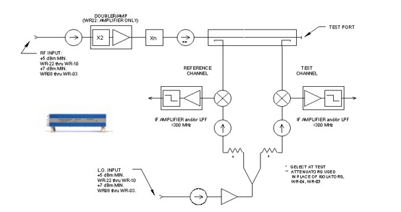
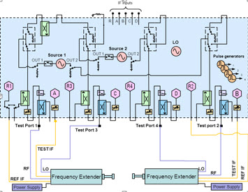
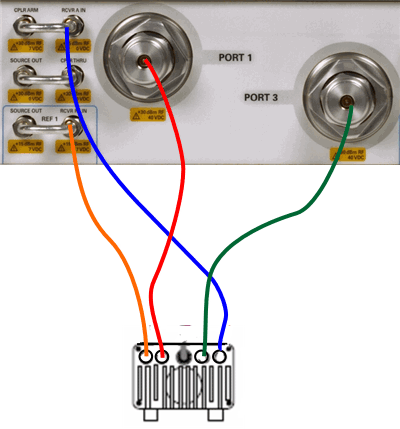
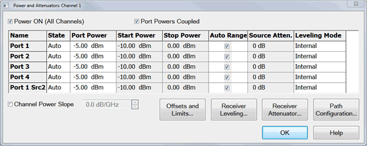
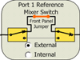
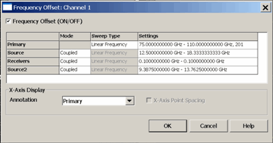
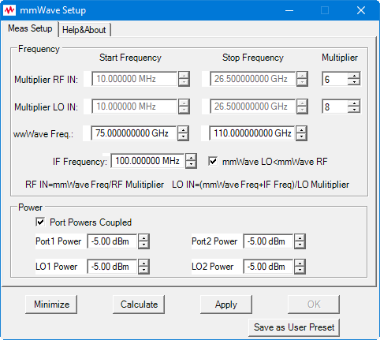

# mmWave Measurements without a Test Set

* * *

This topic describes the basic configuration needed to connect a waveguide
transmission reflection frequency extender directly to a PNA-X (without a
N526x test set). This configuration will allow you to create an integrated
2-port banded waveguide S-Parameter measurement solution. In particular, it
will focus on the options and configurations of the PNA-X as well as the
settings required to make a complete measurement.

  * [Requirements and Limitations](mmWave_Measurement_w_No_Test_Set.md#Requirements)

  * [Hardware Connections](mmWave_Measurement_w_No_Test_Set.md#Hardware)

  * [VNA Settings](mmWave_Measurement_w_No_Test_Set.md#PNAsettings)

### See Also

[mmWave Configuration with a N526x Test
Set](External_Test_Head_Configuration.htm)

## Requirements

  * 4-port PNA-X, or 2-port / 2-source PNA-X

  * Option S93080A FOM. [Learn more about FOM](../FreqOffset/Frequency_Offset_Mode.md).

  * Firmware A.09.00 or greater

  * mmWave Modules

  * DC Power Supply for mmWave Modules

  * mmWave Cal Kit

  * The frequency extenders being used should have the following basic architecture. This is an example of the OML modules, although other frequency extenders maybe used.

  * The key parameters to be aware of are:

  *     * Ensure that the PNA-X being used has sufficient drive power for the RF and LO signals. Since most frequency extenders typically operate in a saturated mode the PNA-X has sufficient RF port power to drive the OML, VDI, and Farran frequency extenders.

    * The IF output of the frequency extenders to the receiver input is less than the compression level of the PNA-X.

## Limitations

  * This configuration is limited to S-Parameters only.

  * Log Sweep is not allowed.

## Hardware Connections

The following list of components applies to the example shown above:

  * Dual Source PNA-X N5242 with option 400 include option S93080A FOM
  * Quantity 2 of 75-110 GHz Transmission Reflection Modules N5256A.
  * DC Power Supply 12V at least 3 Amp to drive 2 Frequency Extenders E3632A.
  * Special Module cables N5260AK48 quantity 2, these include all the RF, LO, IF and special DC cable for the OML module used.

Connect the frequency extenders to the VNA as shown below:

  * This shows how one mmWave module is configured. When used with a 2-port PNA-X, the internal second source is used instead of port 3.

  * This same principal is used to configure the second mmWave module using ports 2 and 4.

Legend

Remove the jumper cables, then connect to the Receiver IN connectors.

Color | VNA to 1st Module (VNA to 2nd Module) | mmWave Module  
---|---|---  
Orange | Rcvr Ref 1 IN (Rcvr Ref 2 IN) | Ref IF Out  
Blue | Rcvr A IN (Rcvr B IN) | Test IF Out  
Red | Port 1 (Port 2) | RF In  
Green | Port 3 (Port 4) | LO In  
  
## VNA Settings

Note: A macro is available that makes the following VNA settings
automatically. [Learn
more](mmWave_Measurement_w_No_Test_Set.htm#Using_the_Macro).

  1. In [Power and Attenuators](../S1_Settings/Power_Level.md#Advanced) dialog:  

     1. Set the Port 3 and Port 4 power to ON. (This allows LO power to always be ON).

     2. Adjust the port power to adequately drive the mmWave module (12 dBm is this example).

     3. Clear the Port Powers Coupled checkbox if the LO and RF power requirements are different.

  2. In [Path Configuration dialog](../S1_Settings/Path_Configurator.md), Set Port 1 Ref Switch to External. This is NOT necessary for rear-panel connections and on a second mmWave module connected to ports 2 and 4.  

  3. In [FOM dialog](../FreqOffset/Frequency_Offset_Mode.md):

Note: The following procedure shows mmWave frequencies from 75 GHz to 110 GHz.

To make the following Multiplier, Divisor, and Frequency settings, click in
the Settings field for the corresponding Source or Receiver, then click Edit.

  1.      1. Source (RF): Set Divisor to 6.
     2. Receivers: Set Offset to 100 MHz and Multiplier to 0.
     3. Source 2 (LO): Set Offset to 12.5 MHz and Divisor to 8.
     4. Set all modes to Coupled.
     5. Check Frequency Offset: ON
     6. Set Primary: Start 75 GHz - Stop 110 GHz
     7. Set X-Axis Display Annotation to Primary.

4\. In [Calibration Preferences](../System/Preferences.md) dialog: To
calibrate at the mmWave frequencies check the Use FOM Primary Frequency.

### Using the Macro

Using the macro will eliminate all of the steps involved in setting up the
power and the attenuators as well as the Frequency settings.

Load the macro and enter the values for setting up the measurement.

* * *

