# Setup Commands - TDR Measurement Class

Click [here](CF_Setup_Commands.md) to view links to Setup commands for all
Measurement Classes.

[SYST:TDR:PRESet](GP-IB_Command_Finder/TDR_System.md#SYSTem:TDR:PRESet)
launches TDR application without VNA-TDR GUI.

Tool Bar

Setup Pane

TDR/TDT Pane

Eye/Mask Pane

Tool Bar Commands  
---  
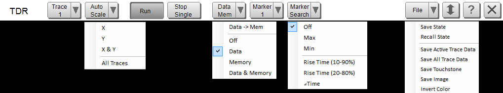  
Softkey | Sub-item | Description | SCPI  
Trace  |  | Select active trace | [CALC:PAR:MNUM:SELect](GP-IB_Command_Finder/Calculate/Parameter.md#MnumSel)  
Auto Scale |  | Scale menu |   
X | Do horizontal auto scale | [DISP:TDR:MEAS:X:SCAL:AUTO](GP-IB_Command_Finder/TDR_Display.md#DISPlay:TDR:MEASure:X:SCALe:AUTO)  
Y | Do vertical auto scale | [DISP:MEAS:Y:SCAL:AUTO](GP-IB_Command_Finder/Display.md#MeasYAuto)  
X & Y | Do horizontal and vertical auto scale | [DISP:TDR:MEAS:X:SCAL:AUTO](GP-IB_Command_Finder/TDR_Display.md#DISPlay:TDR:MEASure:X:SCALe:AUTO) [DISP:MEAS:Y:SCAL:AUTO](GP-IB_Command_Finder/Display.md#MeasYAuto)  
All Traces | Do horizontal and vertical auto scale for all traces | [DISP:TDR:MEAS:X:SCAL:AUTO](GP-IB_Command_Finder/TDR_Display.md#DISPlay:TDR:MEASure:X:SCALe:AUTO) [DISP:MEAS:Y:SCAL:AUTO](GP-IB_Command_Finder/Display.md#MeasYAuto)  
Run |  | Trigger continuous | [SENS:TDR:SWE:MODE RUN](GP-IB_Command_Finder/Sense/TDR.md#SENSe:TDR:SWEep:MODE)  
Stop / Single |  | Trigger hold (when continuous) | [SENS:TDR:SWE:MODE HOLD](GP-IB_Command_Finder/Sense/TDR.md#SENSe:TDR:SWEep:MODE)  
| Trigger single (when hold) | [SENS:TDR:SWE:MODE SINGle](GP-IB_Command_Finder/Sense/TDR.md#SENSe:TDR:SWEep:MODE)  
Data / Mem |  | Data and Memory menu |   
Data -> Mem | Save data trace to memory | [CALC:MEAS:MATH:MEMorize](GP-IB_Command_Finder/Calculate/Measure.md#CALCulate:MEASure:MATH:MEMorize)  
Off | Display off | [DISP:TDR:MEAS:DMEM:TYPE OFF](GP-IB_Command_Finder/TDR_Display.md#DISPlay:TDR:MEASure:DMEMory:TYPE)  
Data | Display data trace only | [DISP:TDR:MEAS:DMEM:TYPE DATA](GP-IB_Command_Finder/TDR_Display.md#DISPlay:TDR:MEASure:DMEMory:TYPE)  
Memory | Display memory trace only | [DISP:TDR:MEAS:DMEM:TYPE MEMory](GP-IB_Command_Finder/TDR_Display.md#DISPlay:TDR:MEASure:DMEMory:TYPE)  
Data & Memory | Display data and memory traces | [DISP:TDR:MEAS:DMEM:TYPE DMEMory](GP-IB_Command_Finder/TDR_Display.md#DISPlay:TDR:MEASure:DMEMory:TYPE)  
Marker |  | Select active marker | [CALC:TDR:MEAS:MARK:STAT](GP-IB_Command_Finder/Calculate/TDR.md#CALCulate:TDR:MEASure:MARKerSTATe)  
Marker Search |  | Marker search menu |   
Off | Marker search Off | [CALC:MEAS:MARK:FUNC:TRACk OFF](GP-IB_Command_Finder/Calculate/MeasureMARKer.md#CALCulate:MEASure:MARKer:FUNCtion:TRACking)  
Max | Set max marker search On | [CALC:MEAS:MARK:FUNC:SELect MAX; TRACk ON](GP-IB_Command_Finder/Calculate/MeasureMARKer.md#CALCulate:MEASure:MARKer:FUNCtion:SELect)  
Min | Set min marker search On | [CALC:MEAS:MARK:FUNC:SELect MIN; TRACk ON](GP-IB_Command_Finder/Calculate/MeasureMARKer.md#CALCulate:MEASure:MARKer:FUNCtion:SELect)  
Rise Time (10%-90%) | Select time threshold to 10-90% | [CALC:TDR:MEAS:TTIM:THReshold T1_9](GP-IB_Command_Finder/Calculate/TDR.md#CALCulate:TDR:MEASure:TTIMe:THReshold)  
Rise Time (20%-80%) | Select time threshold to 20-80% | [CALC:TDR:MEAS:TTIM:THReshold T2_8](GP-IB_Command_Finder/Calculate/TDR.md#CALCulate:TDR:MEASure:TTIMe:THReshold)  
ΔTime | Open ΔTime dialog | None  
File |  | File menu |   
Save State | Save TDR state file | [MMEM:TDR:STOR:STATe](GP-IB_Command_Finder/TDR_Memory.md#MMEMory:TDR:STORe:STATe)  
Recall State | Recall TDR state file | [MMEM:TDR:LOAD:STATe](GP-IB_Command_Finder/TDR_Memory.md#MMEMory:TDR:LOAD:STATe)  
Save Actieve Trace Data | Save the active trace data to csv file | [MMEM:TDR:STOR:FDATa](GP-IB_Command_Finder/TDR_Memory.md#MMEMory:TDR:STORe:FDATa)  
Save All Trace Data | Save all trace data to csv file | [MMEM:TDR:STOR:FDAT:ALL](GP-IB_Command_Finder/TDR_Memory.md#MMEMoryTDRSTOReFDATaALL)  
Save Touchstone | Save trace data to touchstone file | [MMEM:TDR:STOR:SNP](GP-IB_Command_Finder/TDR_Memory.md#MMEMory:TDR:STORe:SNP)  
Save Image | Save display image to file | [HCOP:FILE](GP-IB_Command_Finder/Hardcopy.md#file)  
Invert Color | Set invert color state | [DISP:TDR:IMAGe](GP-IB_Command_Finder/TDR_Display.md#DISPlay:TDR:IMAGe)  
Minimize (Up/Down Arrow) |  | Minimize TDR GUI | [DISP:TDR:MINimize](GP-IB_Command_Finder/TDR_Display.md#DISPlay:TDR:MINimize:STATe)  
Help (?) |  | Open TDR help | None  
Close (X) |  | Exit TDR application | [:SYST:PRESet](GP-IB_Command_Finder/System.md#pre)  
Setup Pane Commands  
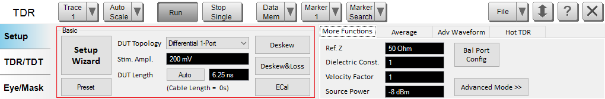  
Softkey | Sub-item | Description | SCPI  
Setup Wizard |  | Launch Setup Wizard |   
Preset |  | Preset TDR state  | [SYST:TDR:PRESet](GP-IB_Command_Finder/TDR_System.md#SYSTem:TDR:PRESet)  
DUT Topology |  | Select DUT topology | [CALC:TDR:DEVice](GP-IB_Command_Finder/Calculate/TDR.md#CALCulate:TDR:DEVice)  
Stim. Ampl. |  | Set stimulus amplitude level | [CALC:TDR:TIME:STEP:AMPLitude](GP-IB_Command_Finder/Calculate/TDR.md#CALCulate:TDR:TIME:STEP:AMPLitude)  
DUT Length (Auto) |  | Automatically estimate DUT length | [SENS:TDR:DLEN:AUTO:IMMediate](GP-IB_Command_Finder/Sense/TDR.md#SENSe:TDR:DLENgth:AUTO:IMMediate)  
DUT Length (Numeric Edit) |  | Set DUT length | [SENS:TDR:DLEN:DATA](GP-IB_Command_Finder/Sense/TDR.md#SENSe:TDR:DLENgth:DATA)  
Deskew |  | Open Deskew dialog | [SENSe:CORRection:TDR:EXTension:AUTO:IMMediate](GP-IB_Command_Finder/Sense/TDR_Correction.md#SENSe:CORRection:TDR:EXTension:AUTO:IMMediate)  
Deskew&Loss |  | Open Deskew & Loss Compensation dialog | [SENSe:CORRection:TDR:COLLection:DLComp:LOAD](GP-IB_Command_Finder/Sense/TDR_Correction.md#SENSe:CORRection:TDR:COLLection:DLComp:LOAD) [SENSe:CORRection:TDR:COLLection:DLComp:OPEN](GP-IB_Command_Finder/Sense/TDR_Correction.md#SENSe:CORRection:TDR:COLLection:DLComp:OPEN) [SENSe:CORRection:TDR:COLLection:DLComp:THRU](GP-IB_Command_Finder/Sense/TDR_Correction.md#SENSe:CORRection:TDR:COLLection:DLComp:THRU) [SENSe:CORRection:TDR:COLLection:DLComp:SAVE](GP-IB_Command_Finder/Sense/TDR_Correction.md#SENSe:CORRection:TDR:COLLection:DLComp:SAVE)  
ECal |  | Open Full Calibration (ECal) dialog | [SENSe:CORRection:TDR:COLLection::ECAL:IMMediate](GP-IB_Command_Finder/Sense/TDR_Correction.md#SENSe:CORRection:TDR:COLLection:ECAL:IMMediate) [SENSe:CORRection:TDR:COLLection:ECAL:FCOMp:IMMediate](GP-IB_Command_Finder/Sense/TDR_Correction.md#SENSe:CORRection:TDR:COLLection:ECAL:FCOMp:IMMediate) [SENSe:CORRection:EXT:AUTO:LOSS](GP-IB_Command_Finder/Sense/CorrExtension.md#AutoLoss) [SENSe:CORRection:EXT:AUTO:STARt](GP-IB_Command_Finder/Sense/CorrExtension.md#autoStart) [SENSe:CORRection:EXT:AUTO:STOP](GP-IB_Command_Finder/Sense/CorrExtension.md#autoStop)  
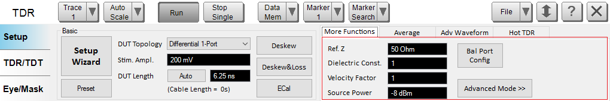  
Softkey | Sub-item | Description | SCPI  
Ref. Z |  | Set reference impedance value | [SENS:CORR:TDR:RIMPedance](GP-IB_Command_Finder/Sense/TDR_Correction.md#SENSe:CORRection:TDR:RIMPedance)  
Dielectric Const. |  | Set dielectric constant value | [SENS:CORR:TDR:DCONstant](GP-IB_Command_Finder/Sense/TDR_Correction.md#SENSe:CORRection:TDR:DCONstant)  
Velocity Factor |  | Set velocity factor (= 1/sqrt(dielectric const))  | [SENS:CORR:TDR:DCONstant](GP-IB_Command_Finder/Sense/TDR_Correction.md#SENSe:CORRection:TDR:DCONstant)  
Source Power |  | Set source power level | [SOUR:TDR:POWer:LEV:IMM:AMPLitude](GP-IB_Command_Finder/TDR_Source.md#SOURce:TDR:POWer:LEVel:IMMediate:AMPLitude)  
Bal Port Config |  | Open Balanced Source setting dialog | None  
Freq Limits Config |  | Open Frequency Limits dialog to set start and stop frequency limits | None  
Advanced Mode |  | Move to advanced mode | None  
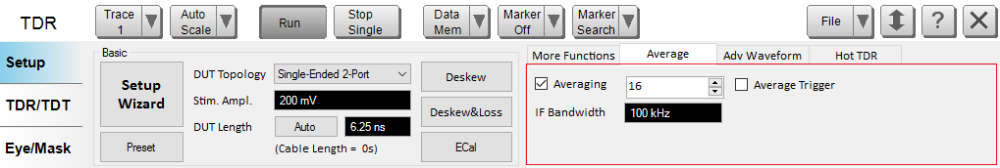  
Softkey | Sub-item | Description | SCPI  
Averaging (Check Box) |  | Set averaging state | [SENS:AVER:STATe](GP-IB_Command_Finder/Sense/Average_SCPI.md#cas)  
Averaging (Spin Control) |  | Set averaging count | [SENS:AVER:COUNt](GP-IB_Command_Finder/Sense/Average_SCPI.md#cac)  
Average Trigger |  | Set average trigger state | [SENS:TDR:SWE:AVERage](GP-IB_Command_Finder/Sense/TDR.md#SENSe:TDR:SWEep:AVERage)  
IF Bandwidth |  | Set resolution bandwidth | [SENS:TDR:BWIDth:RESolution](GP-IB_Command_Finder/Sense/TDR.md#SENSe:TDR:BWIDth:RESolution)  
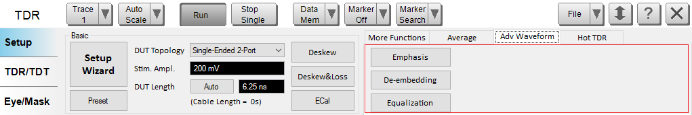  
Softkey | Sub-item | Description | SCPI  
Emphasis |  | Open Advanced Waveform Emphasis dialog | None  
De-embedding |  | Open Advanced Waveform De-embedding dialog | Enable de-embedding [CALC:TDR:DEEM:STATe](GP-IB_Command_Finder/Calculate/TDR.md#CALCulateTDRDEEMSTATe) Enable the SNP file de-embedding for the selected port. [CALC:TDR:DEEM:PORT:STAT](GP-IB_Command_Finder/Calculate/TDR.md#CALCulateTDRDEEMPORTSTATe) (for single end) [CALC:TDR:DEEM:BPOR:STAT](GP-IB_Command_Finder/Calculate/TDR.md#CALCulateTDRDEEMBPORSTAT) (for balance) Specify the SNP file de-embedding for the selected port. [CALC:TDR:DEEM:PORT:FILename](GP-IB_Command_Finder/Calculate/TDR.md#CALCulateTDRDEEMPORTFILename) (for single end) [CALC:TDR:DEEM:BPOR:FILename](GP-IB_Command_Finder/Calculate/TDR.md#CALCulateTDRDEEMBPORFILename) (for balance)  
Equalization |  | Open Advanced Waveform Equalization dialog | None  
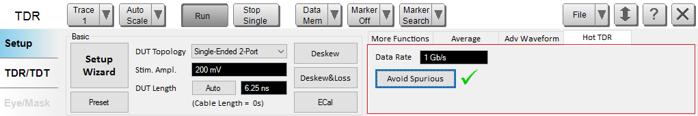  
Softkey | Sub-item | Description | SCPI  
Data Rate |  | Set spurious data rate | [SENS:TDR:SPUR:INP:DRATe](GP-IB_Command_Finder/Sense/TDR.md#SENSe:TDR:SPURious:INPut:DRATe)  
Avoid Spurious |  | Execute avoid spurious | [SENS:TDR:SPURious:AVO:IMMediate](GP-IB_Command_Finder/Sense/TDR.md#SENSe:TDR:SPURious:AVOid:IMMediate)  
Avoid Spurious (Check Mark) |  | Show avoid spurious state | [SENS:TDR:SPURious:AVO:STATe?](GP-IB_Command_Finder/Sense/TDR.md#SENSe:TDR:SPURious:AVOid:STATe)  
  
Softkey | Sub-item | Description | SCPI  
Add Switch Matrix |  | Add Switch Matrix or add new switch matrix | Refer to [External Device SCPI](CF_Setup_Commands_-_Standard.md#External_Hardware_Commands)  
Characterize... |  | Open Characterize External Switch Matrix Wizard. | [SENSe<cnum>:SWITch:L8990M:CHAR:INIT ‘deviceName’, ‘tier1CalSetName’](GP-IB_Command_Finder/Sense/SWITch.md#L8990MCharInit) [SENSe<cnum>:SWITch:L8990M:CHAR:STEP:COUNt? ‘deviceName’](GP-IB_Command_Finder/Sense/SWITch.md#L8990MCharStepCoun) [SENSe<cnum>:SWITch:L8990M:CHAR:STEP<num>:DESC? ‘deviceName’](GP-IB_Command_Finder/Sense/SWITch.md#L8990MCharStepDesc) [SENSe<cnum>:SWITch:L8990M:CHAR:STEP<num>:ACQ ‘deviceName’](GP-IB_Command_Finder/Sense/SWITch.md#L8900MCharStepAcq) [SENSe<cnum>:SWITch:L8990M:CHAR:SAVE ‘deviceName’](GP-IB_Command_Finder/Sense/SWITch.md#L8990MCharSave) [SENSe<cnum>:SWITch:L8990M:CHAR:ABORt ‘deviceName’](GP-IB_Command_Finder/Sense/SWITch.md#L8990MCharAbor)  
Test Port/Switch/Switch Path  |  | Switch path based on selected test ports. | [SENSe<cnum>:SWITch:L8990M:PATH ‘deviceName’,<num>,[<num>,<num>,<num>]](GP-IB_Command_Finder/Sense/SWITch.md#L8990MPath) [SENSe<cnum>:SWITch:L8990M:PATH:DEEMbed:CALSet:NAME ‘deviceName’, ‘Tier1CalSetName’](GP-IB_Command_Finder/Sense/SWITch.md#L8990MPathDeemCalsName) [SENSe<cnum>:SWITch:L8990M:PATH:DEEMbed:CALSet:STIMulus:STATe ‘deviceName’,<ON|OFF>](GP-IB_Command_Finder/Sense/SWITch.md#L8990MPathDeemCalsStimStat) [SENSe<cnum>:SWITch:L8990M:PATH:DEEMbed:CALSet:STATe ‘deviceName’,<ON|OFF> ](GP-IB_Command_Finder/Sense/SWITch.md#L8990MPathDeemCalsStat)  
By Test Port Label |  | Set labels to ports. | [SENSe<cnum>:SWITch:L8990M:PORT<pnum>:LABel ‘deviceName’,’portLabel’ ](GP-IB_Command_Finder/Sense/SWITch.md#L8990MPortLab)  
TDR/TDT Pane Commands  
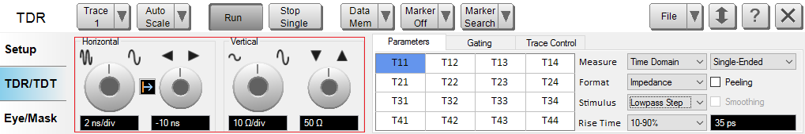  
Softkey | Sub-item | Description | SCPI  
Horizontal \- Left Knob |  | Set horizontal scale/div | [DISP:TDR:MEAS:X:SCAL:PDIVision](GP-IB_Command_Finder/TDR_Display.md#DISPlay:TDR:MEASure:X:SCALe:PDIVision)  
Horizontal \- Right Knob |  | Set horizontal reference level | [DISP:TDR:MEAS:X:SCAL:RLEVel](GP-IB_Command_Finder/TDR_Display.md#DISPlay:TDR:MEASure:X:SCALe:RLEVel)  
Horizontal \- Center Button |  | Select horizontal reference position | [DISP:TDR:X:SCAL:RPOSition](GP-IB_Command_Finder/TDR_Display.md#DISPlay:TDR:SCALe:RPOSition)  
Vertical \- Left Knob |  | Set vertical scale/div | [DISP:MEAS:Y:SCAL:PDIVision](GP-IB_Command_Finder/Display.md#MeasYPdiv)  
Vertical \- Right Knob |  | Set vertical reference level | [DISP:MEAS:Y:SCAL:RLEVel](GP-IB_Command_Finder/Display.md#MeasYRlev)  
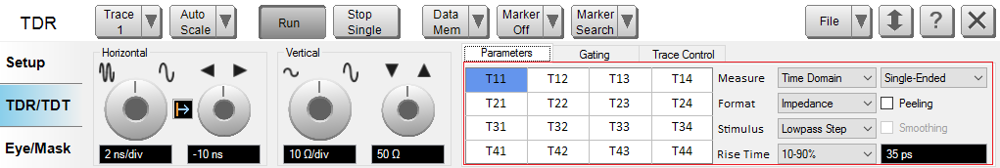  
Softkey | Sub-item | Description | SCPI  
Parameter Selector Table |  | Select measurement parameter | [CALC:TDR:MEAS:PARameter](GP-IB_Command_Finder/Calculate/TDR.md#CALCulate:TDR:MEASure:PARameter)  
Measure |  | Change selections of parameter table | [CALC:TDR:MEAS:PARameter](GP-IB_Command_Finder/Calculate/TDR.md#CALCulate:TDR:MEASure:PARameter)  
Format |  | Select measurement format | [CALC:TDR:MEAS:FORMat](GP-IB_Command_Finder/Calculate/TDR.md#CALCulate:TDR:MEASure:FORMat)  
Stimulus |  | Select time stimulus type | [CALC:TDR:MEAS:TIME:TYPE](GP-IB_Command_Finder/Calculate/TDR.md#CALCulate:TDR:MEASure:TIME:TYPE)  
Rise Time (Dropdown List) |  | Select step rise time threshold | [CALC:TDR:MEAS:TIME:STEP:RTIM:THReshold](GP-IB_Command_Finder/Calculate/TDR.md#CALCulate:TDR:MEASure:TIME:STEP:RTIMe:THReshold)  
Rise Time (Numeric Edit) |  | Set step rise time value | [CALC:TDR:MEAS:TIME:STEP:RTIM](GP-IB_Command_Finder/Calculate/TDR.md#CALCulate:TDR:MEASure:TIME:STEP:RTIMe:DATA)  
Peeling |  | Set peeling state | [CALC:TDR:MEAS:PEEL:STATe](GP-IB_Command_Finder/Calculate/TDR.md#CALCulate:TDR:MEASure:PEELing:STATe)  
Smoothing |  | Set smoothing state | [CALC:TDR:MEAS:SMO:STATe](GP-IB_Command_Finder/Calculate/TDR.md#CALCulate:TDR:MEASure:SMOothing:STATe)  
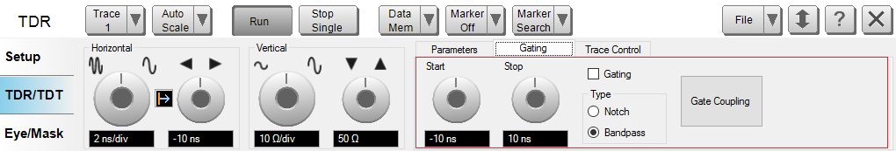  
Softkey | Sub-item | Description | SCPI  
Start |  | Set gate start time | [CALC:MEAS:FILT:GATE:TIME:STARt](GP-IB_Command_Finder/Calculate/MeasureFILter.md#CALCulate:MEASure:FILTer:GATE:TIME:STARt)  
Stop |  | Set gate stop time | [CALC:MEAS:FILT:GATE:TIME:STOP](GP-IB_Command_Finder/Calculate/MeasureFILter.md#CALCulate:MEASure:FILTer:GATE:TIME:STOP)  
Gating |  | Set gating state | [CALC:MEAS:FILT:GATE:TIME:STATe](GP-IB_Command_Finder/Calculate/MeasureFILter.md#CALCulate:MEASure:FILTer:GATE:TIME:STATe)  
Type |  | Select gating type | [CALC:MEAS:FILT:GATE:TIME:TYPE](GP-IB_Command_Finder/Calculate/MeasureFILter.md#CALCulate:MEASure:FILTer:GATE:TIME:TYPE)  
Gate Coupling |  | Open Gate Coupling dialog | None  
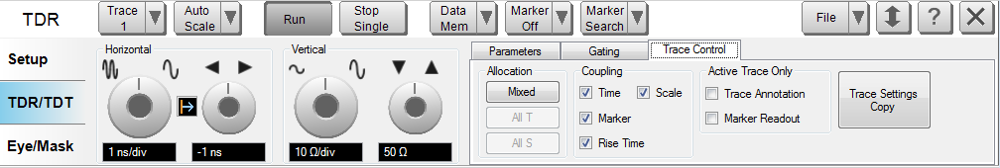  
Softkey | Sub-item | Description | SCPI  
Allocation \- Mixed |  | Allocate measurements to mixed T/S-parameters | [CALC:TDR:ALLoc MIX](GP-IB_Command_Finder/Calculate/TDR.md#CALCulate:TDR:ALLocate)  
Allocation \- All T |  | Allocate measurements to all T-parameters | [CALC:TDR:ALLoc TPAR](GP-IB_Command_Finder/Calculate/TDR.md#CALCulate:TDR:ALLocate)  
Allocation \- All S |  | Allocate measurements to all S-parameters | [CALC:TDR:ALLoc SPAR](GP-IB_Command_Finder/Calculate/TDR.md#CALCulate:TDR:ALLocate)  
Coupling \- Time |  | Set time couple state | [CALC:TDR:TIME:COUPle](GP-IB_Command_Finder/Calculate/TDR.md#CALCulate:TDR:TIME:COUPle)  
Coupling \- Marker |  | Set marker couple state | [CALC:MARK:COUP:STATe](GP-IB_Command_Finder/Calculate/Marker.md#couple)  
Coupling \- Rise Time |  | Set rise time couple state  | [CALC:TDR:MEAS:TIME:STEP:COUPle](GP-IB_Command_Finder/Calculate/TDR.md#CALCulateTDRMEASureTIMESTEPCOUPle)  
Coupling \- Rise Time |  | Set scale time couple state  | [DISP:WIND:TRAC:Y:SCAL:COUP:METH](GP-IB_Command_Finder/Display.md#scaleCouplMethod)  
Trace Annotation  |  | Show the trace annotation on the active trace only | [DISP:WIND:ANN:TRAC:SCOPe](GP-IB_Command_Finder/Display.md#DISPlay:WINDow:ANNotation:TRACe:SCOPe)  
Marker Readout |  | Show the marker readout on the active trace only | [DISP:WIND:ANN:MARK:VISIble](GP-IB_Command_Finder/Display.md#DISPlayWINDowANNotationMARKerVISible)  
Trace Settings Copy |  | Open Trace Settings Copy dialog | None  
Eye/Mask Pane Commands  
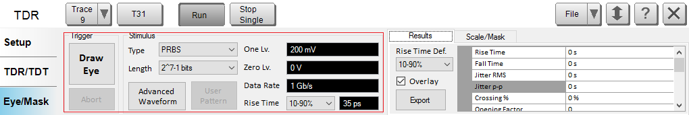  
Softkey | Sub-item | Description | SCPI  
Draw Eye |  | Measure and draw eye diagram | [CALC:TDR:EYE:EXECute](GP-IB_Command_Finder/Calculate/TDR.md#CALCulate:TDR:EYE:EXECute)  
Abort |  | Abort eye drawing | None  
Type |  | Select eye input bit pattern | [CALC:TDR:EYE:INP:BPAT:TYPE](GP-IB_Command_Finder/Calculate/TDR.md#CALCulate:TDR:EYE:INPut:BPATtern:TYPE)  
Length |  | Select eye input bit length | [CALC:TDR:EYE:INP:BPAT:LENTth](GP-IB_Command_Finder/Calculate/TDR.md#CALCulate:TDR:EYE:INPut:BPATtern:LENGth)  
Advanced Waveform |  | Open Advanced Waveform Jitter dialog | None  
User Pattern |  | Open Bit Pattern Editor dialog | None  
One Lv. |  | Set eye input one level | [CALC:TDR:EYE:INP:OLEVel](GP-IB_Command_Finder/Calculate/TDR.md#CALCulate:TDR:EYE:INPut:OLEVel)  
Zero Lv. |  | Set eye input zero level | [CALC:TDR:EYE:INP:ZLEVel](GP-IB_Command_Finder/Calculate/TDR.md#CALCulate:TDR:EYE:INPut:ZLEVel)  
Data Rate |  | Set eye input data rate | [CALC:TDR:EYE:INP:DRATe](GP-IB_Command_Finder/Calculate/TDR.md#CALCulate:TDR:EYE:INPut:DRATe)  
Rise Time (Pulldown) |  | Select eye input rise time threshold | [CALC:TDR:EYE:INP:RTIM:THReshold](GP-IB_Command_Finder/Calculate/TDR.md#CALCulate:TDR:EYE:INPut:RTIMe:THReshold)  
Rise Time (Numeric Edit) |  | Set eye input rise time value | [CALC:TDR:EYE:IMP:RTIM:DATA](GP-IB_Command_Finder/Calculate/TDR.md#CALCulate:TDR:EYE:INPut:RTIMe:DATA)  
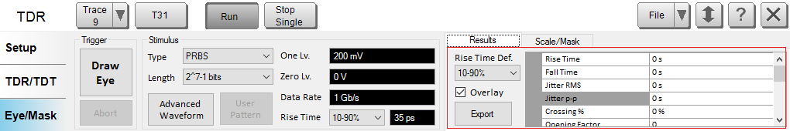  
Softkey | Sub-item | Description | SCPI  
Rise Time Def. |  | Select eye results rise time threshold | [CALC:TDR:EYE:RES:THReshold](GP-IB_Command_Finder/Calculate/TDR.md#CALCulate:TDR:EYE:RESults:THReshold)  
Overlay |  | Set eye results display state | [CALC:TDR:EYE:RES:DISP:STATe](GP-IB_Command_Finder/Calculate/TDR.md#CALCulate:TDR:EYE:RESults:DISPlay:STATe)  
Export |  | Export eye results to CSV file | None  
Results Table |  | Show eye results | [CALC:TDR:EYE:RES:DATA?](GP-IB_Command_Finder/Calculate/TDR.md#CALCulate:TDR:EYE:RESults:DATA)  
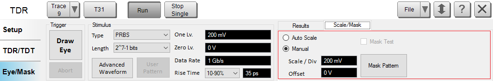  
Softkey | Sub-item | Description | SCPI  
Auto Scale |  | Set eye auto scale state On | [DISP:TDR:EYE:Y:SCAL:AUTO:STAT ON](GP-IB_Command_Finder/TDR_Display.md#DISPlay:TDR:EYE:Y:SCALe:AUTO:STATe)  
Manual |  | Set eye auto scale state Off | [DISP:TDR:EYE:Y:SCAL:AUTO:STAT OFF](GP-IB_Command_Finder/TDR_Display.md#DISPlay:TDR:EYE:Y:SCALe:AUTO:STATe)  
Scale / Div |  | Set eye vertical scale/div | [DISP:TDR:EYE:Y:SCAL:PDIV](GP-IB_Command_Finder/TDR_Display.md#DISPlay:TDR:EYE:Y:SCALe:PDIVision)  
Offset |  | Set eye vertical reference level | [DISP:TDR:EYE:Y:SCAL:RLEVel](GP-IB_Command_Finder/TDR_Display.md#DISPlay:TDR:EYE:Y:SCALe:RLEVel)  
Mask Test |  | Set eye mask test state | [CALC:TDR:EYE:MASK:STATe](GP-IB_Command_Finder/Calculate/TDR.md#CALCulate:TDR:EYE:MASK:STATe)  
Mask Pattern |  | Open Mask Pattern dialog | None

