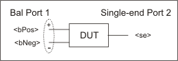

##### Write-only

|

##### [About Balanced
Measurements](../../../S1_Settings/Balanced_Measurements.htm)  
  
---|---  
  
## SetBSPorts Method

* * *

#### Description

|  For a Balanced-Single-ended device type, maps the VNA ports to the DUT
ports. Set the Balanced-Single-ended device type using the [DUTTopology
Property](../Properties/DUTTopology_Property.htm)  
---|---  
  
####  VB Syntax

|  balTopology.SetBSPorts bPos, bNeg, se  
  
#### Variable

|

#### [(Type)](../../Learning_about_COM/COM_Data_Types.md) \- Description  
  
balTopology |  A [BalancedTopology](../Objects/BalancedTopology_Object.md) (object)  
bPos, bNeg, se |  VNA port number that connects to each of the following DUT ports:   
  
#### Return Type

|  Not applicable - To read port mappings, use the
[BalancedTopology](../Objects/BalancedTopology_Object.md) properties.  
  
#### Default

|  Not Applicable  
  
#### Examples

|  balTop.SetBSPorts 1,2,3  
  
#### [C++](../../Learning_about_COM/c%2b%2b_and_the_com_interface.md) Syntax

|  HRESULT SetBSPorts (long bPos, long bNeg, long se)  
  
#### Interface

|  IBalancedTopology2  
  
* * *

