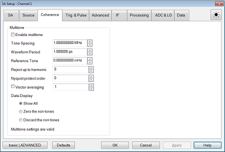
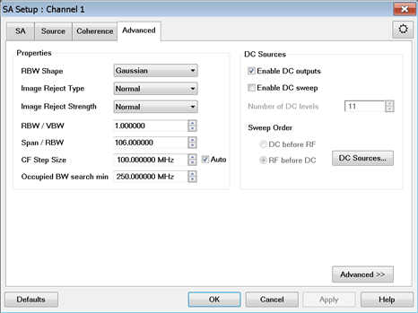
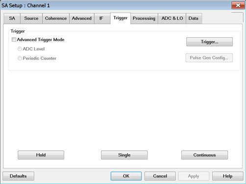
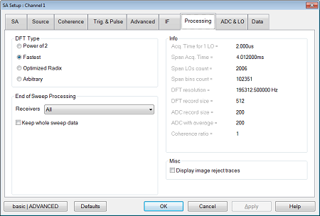
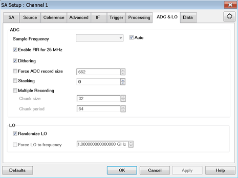
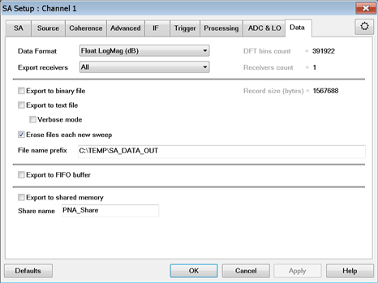

# SpectrumAnalyzer Object

* * *

### Description

Controls the Spectrum Analyzer Application settings.

### Accessing the SpectrumAnalyzer object

Dim app as AgilentPNA835x.Application Set app =
CreateObject("AgilentPNA835x.Application")
app.[CreateCustomMeasurementEx](../Methods/CreateCustomMeasurementEx_Method.md)(1,
"SpectrumAnalyzer", "A", 1) Dim SA Set SA =
app.ActiveChannel.[CustomChannelConfiguration](../Properties/CustomChannelConfiguration_Property.md)  
---  
  
#### SA Application \- SA Setup tab  
  
---  
 | [ResBWList](../Properties/ResBWList_\(Spectrum_Analyzer\)_Property.md)  
[ResolutionBW](../Properties/ResolutionBW_\(SA\)_Property.md)  
[ResolutionBWMode](../Properties/ResolutionBWMode_Property.md)  
[ResolutionBWMin](../Properties/ResolutionBWMin.md)  
[ResolutionBWMax](../Properties/ResolutionBWMax.md)  
[VideoBW](../Properties/VideoBW_Property.md)  
[VideoBWMode](../Properties/VideoBWMode_Property.md)  
[VideoBWMin](../Properties/VideoBWMin.md)  
[VideoBWMax](../Properties/VideoBWMax.md)  
[DetectorFunction](../Properties/DetectorFunction_Property.md)  
[EnableDetectorBypass](../Properties/DetectorBypassState_Property.md)  
[VideoAveragingType](../Properties/VideoAveragingType_Property.md)  
[VideoAveragingCount](../Properties/VideoAveragingCount_Property.md)  
  
#### Source Setup tab  
  
---  
 | [SourceSweepType](../Properties/SourceSweepType_Property.md) [SourceSweepType2](../Properties/SourceSweepType2_Property.md)  
[SourceStartFrequency](../Properties/SourceStartFrequency_Property.md)  
[SourceStopFrequency](../Properties/SourceStopFrequency_Property.md)  
[SourceCWFrequency](../Properties/SourceCWFrequency_Property.md)  
[SourcePowerPointCount](../Properties/SourcePowerPointCount_Property.md)  
[SourcePowerRepeatCount](../Properties/SourcePowerRepeatCount_Property.md)  
[SourceStartPower](../Properties/SourceStartPower_Property.md)  
[SourceStopPower](../Properties/SourceStopPower_Property.md)  
[SourcePower](../Properties/SourcePower_Property.md)  
[SourceSweepFirstDimension](../Properties/SourceSweepFirstDimension_Property.md)  
[SourcePointCount](../Properties/SourcePointCount_Property.md)  
[SourceRepeatCount](../Properties/SASweepRepeatCount_Property.md)  
  
Coherence Setup tab  
---  
 | [Coherence](SpectrumAnalyzerCoherence.md) (Provides access to  [SpectrumAnalyzerCoherence](SpectrumAnalyzerCoherence.md) Object)  
[MultiToneImageRejectEnable](../Properties/MultiToneImageRejectEnable_Property.md)
(Part of [SpectrumAnalyzerCoherence](SpectrumAnalyzerCoherence.md) Object)  
[MultiToneImageRejectDataDisplay](../Properties/MultiToneImageRejectDataDisplay_Property.md)
(Part of [SpectrumAnalyzerCoherence](SpectrumAnalyzerCoherence.md) Object)  
[MultiToneImageRejectSpacing](../Properties/MultiToneImageRejectSpacing_Property.md)
(Part of [SpectrumAnalyzerCoherence](SpectrumAnalyzerCoherence.md) Object)  
[MultiToneImageRejectPeriod](../Properties/MultiToneImageRejectPeriod_Property.md)
(Part of [SpectrumAnalyzerCoherence](SpectrumAnalyzerCoherence.md) Object)  
[MultiToneImageRejectReference](../Properties/MultiToneImageRejectReference_Property.md)
(Part of [SpectrumAnalyzerCoherence](SpectrumAnalyzerCoherence.md) Object)  
[MultiToneImageRejectHarmonic](../Properties/MultiToneImageRejectHarmonic_Property.md)
(Part of [SpectrumAnalyzerCoherence](SpectrumAnalyzerCoherence.md) Object)  
[VectorAverageEnable](../Properties/VectorAverageEnable_Property.md) (Part of
[SpectrumAnalyzerCoherence](SpectrumAnalyzerCoherence.md) Object)  
[VectorAverageMax](../Properties/VectorAverageMax.md) (Part of
[SpectrumAnalyzerCoherence](SpectrumAnalyzerCoherence.md) Object)  
[VectorAverageValue](../Properties/VectorAverageValue_Property.md) (Part of
[SpectrumAnalyzerCoherence](SpectrumAnalyzerCoherence.md) Object)  
  
#### Advanced Setup tab  
  
---  
 | [BandwidthShape](../Properties/BandwidthShape_\(SA\)_Property.md)  
[ImageRejectMethod](../Properties/ImageReject_Property.md)  
[ImageRejectStrength](../Properties/ImageRejectStrength_Property.md)  
[ResolutionBWVideoBWRatio](../Properties/ResolutionBWVideoBWRatio_Property.md)  
[SpanResolutionBWRatio](../Properties/SpanResolutionBWRatio_Property.md)  
[SearchOccupiedBWMinFreq](../Properties/SearchOccupiedBWMinFreq_Property.md)  
[DCSourceSweepState](../Properties/DCSourceSweepState.md)  
[DCSourcePointCount](../Properties/DCSourcePointCount_Property.md)  
[DCSourceSweepFirstDimension](../Properties/DCSourceSweepFirstDimension_Property.md)  
[FrequencyAutoTune](../Methods/FrequencyAutoTune_Method.md)  
  
#### IF Setup tab  
  
---  
 | [DFT](SpectrumAnalyzerDFT_Object.md) (Provides access to [SpectrumAnalyzerDFT](SpectrumAnalyzerDFT_Object.md) Object)  
[ADCFilter](../Properties/FFTWidthMode_Property.md)  
[EnableADCFilterAuto](../Properties/ADCFilterAuto.md)  
[AutoBandwidth](../Properties/AutoBandwidth_Property.md) (Part of
[SpectrumAnalyzerDFT](SpectrumAnalyzerDFT_Object.md) Object)  
[BandwidthNarrowMin](../Properties/BandwidthNarrowMin_Property.md) (Part of
[SpectrumAnalyzerDFT](SpectrumAnalyzerDFT_Object.md) Object)  
[BandwidthNarrowMax](../Properties/BandwidthNarrowMax_Property.md) (Part of
[SpectrumAnalyzerDFT](SpectrumAnalyzerDFT_Object.md) Object)  
[BandwidthWideMin](../Properties/BandwidthWideMin_Property.md) (Part of
[SpectrumAnalyzerDFT](SpectrumAnalyzerDFT_Object.md) Object)  
[BandwidthWideMax](../Properties/BandwidthWideMax_Property.md) (Part of
[SpectrumAnalyzerDFT](SpectrumAnalyzerDFT_Object.md) Object)  
  
#### Trigger Setup tab  
  
---  
 | [TriggerADCLevelState](../Properties/TriggerADCLevelState_Property.md)  
[TriggerADCLevelValue](../Properties/TriggerADCLevelValue_Property.md)  
[TriggerPeriodicCounterState](../Properties/TriggerPeriodicCounterState_Property.md)  
[TriggerPeriodicCounterValue](../Properties/TriggerPeriodicCounterValue_Property.md)  
  
#### Processing Setup tab  
  
---  
 | [Type](../Properties/Type_Property.md) (Part of [SpectrumAnalyzerDFT](SpectrumAnalyzerDFT_Object.md) Object)  
[EnableImageRejectTraces](../Properties/ImageRejectTracesState_Property.md)  
[AcquisitionTime](../Properties/AcquisitionTime.md)  
[LOCount](../Properties/LONumber_Property.md)  
[SpanBinsCount](../Properties/SpanBinsCount_Property.md)  
[Resolution](../Properties/Resolution_Property.md) (Part of
[SpectrumAnalyzerDFT](SpectrumAnalyzerDFT_Object.md) Object)  
[RecordSize](../Properties/RecordSize_Property.md) (Part of
[SpectrumAnalyzerDFT](SpectrumAnalyzerDFT_Object.md) Object)  
[ForceADCRecordSize](../Properties/ForceADCRecordSize_Property.md)  
  
#### ADC & LO Setup tab  
  
---  
 | [ADCSampleRate](../Properties/ADCSampleRate_Property.md)  
[EnableADCSampleRateAuto](../Properties/ADCSampleRateAuto_Property.md)  
[ADCEnableFIRFor25Mhz](../Properties/ADCEnableFIRFor25Mhz_Property.md)  
[EnableADCDither](../Properties/ADC_Dithering_Property.md)  
[ForceADCRecordSize](../Properties/ForceADCRecordSize_Property.md)  
[ADCRecordSizeMax](../Properties/ADCRecordSizeMax_Property.md)  
[ADCRecordSizeMin](../Properties/ADCRecordSizeMin_Property.md)  
[ADCRecordSize](../Properties/ADCRecordSize_Property.md)  
[EnableForceADCRecordSize](../Properties/EnableForceADCRecordSize_Property.md)  
[ADCStacking](../Properties/ADCStackingValue_Property.md)  
[ADCStackingMax](../Properties/ADCStackingMax_Property.md)  
[ADCStackingState](../Properties/ADCStackingState.md)  
[ADCMultRecSize](../Properties/ADCMultRecSize_Property.md)  
[ADCMultRecPeriod](../Properties/ADCMultRecPeriod_Property.md)  
[ADCMultRecState](../Properties/ADCMultRecState_Property.md)  
[EnableRandomizedLO](../Properties/RandomizedLO_Property.md)  
[EnableForce
LOToFrequency](../Properties/EnableForceFFTToFrequency_Property.htm)  
[ForceLOToFrequency](../Properties/ForceFFTToFrequency_Property.md)  
  
#### Data Setup tab  
  
---  
 | [DataFormat](../Properties/DataFormat_Property.md)  
[DataFirstRFBin](../Properties/DataFirstRFBin_Property.md)  
[ExportReceiverList](../Properties/ExportReceiverList_Property.md)  
[ExportReceiverSetList](../Properties/ExportReceiverSetList_Property.md)  
[ExportReceiverCount](../Properties/ExportReceiverCount_Property.md)  
[DataBinCount](../Properties/DataBinCount_Property.md)  
[DataByteSize](../Properties/DataByteSize_Property.md)  
[DataBytesPerBin](../Properties/DataBytesPerBin_Property.md)  
[DataByteSizeLSB](../Properties/DataByteSizeLSB_Property.md)  
[DataByteSizeMSB](../Properties/DataByteSizeMSB_Property.md)  
[BinaryFileEnabled](../Properties/BinaryFileEnabled_Property.md)  
[DataExportMarkersEnabled](../Properties/DataExportMarkersEnabled_Property.md)
(Part of [SpectrumAnalyzerDFT](SpectrumAnalyzerDFT_Object.md) Object)  
[DataExportWindowingFactor](../Properties/DataExportWindowingFactor_Property.md)
(Part of [SpectrumAnalyzerDFT](SpectrumAnalyzerDFT_Object.md) Object)  
[TextFileEnabled](../Properties/TextFileEnabled_Property.md)  
[FileVerboseEnabled](../Properties/FileVerboseEnabled_Property.md)  
[FileEraseEachSweep](../Properties/FileEraseEachSweep_Property.md)  
[FilePrefix](../Properties/FilePrefix_Property.md)  
[FIFOEnabled](../Properties/FIFOEnabled_Property.md)  
[MemShareEnabled](../Properties/MemShareEnabled_Property.md)  
[MemShareName](../Properties/MemShareName_Property.md)  
[DataLevelThreshold](../Properties/DataLevelTreshold_Property.md) (Part of
[SpectrumAnalyzerDFT](SpectrumAnalyzerDFT_Object.md) Object)  
[DataLevelThresholdEnabled](../Properties/DataLevelTresholdEnabled_Property.md)
(Part of [SpectrumAnalyzerDFT](SpectrumAnalyzerDFT_Object.md) Object)  
  
### See Also:

  * Example Program: [Create a Spectrum Analyzer measurement](../../COM_Example_Programs/Spectrum_Analyzer.md)

  * [About the Spectrum Analyzer Application](../../../Applications/Spectrum_Analyzer.md)

  * [VNA Automation Interfaces](../../Learning_about_COM/PNA_Automation_Interfaces.md)

  * [The VNA Object Model](The_Analyzer_Object_Model.md)

### Other SA commands

Setup tab  
---  
 | [chan.StartFrequency](../Properties/Start_Frequency_Property.md)  
[chan.StopFrequency](../Properties/Stop_Frequency_Property.md)  
[chan.CenterFrequency](../Properties/CenterFreq_Property.md)  
[chan.FrequencySpan](../Properties/Frequency_Span_Property.md)  
[FrequencySpanFull](../Methods/FrequencySpanFull_Method.md)  
[CenterFrequencyStepSize](../Properties/CenterFrequencyStepSize_Property.md)  
[CenterFrequencyStepSizeMode](../Properties/CenterFrequencyStepSizeMode_Property.md)  
[chan.CWFrequency](../Properties/CW_Frequency_Property.md)  
[chan.NumberOfPoints](../Properties/Number_of__Points_Property.md)  
[Receiver Attenuator](../Properties/Receiver_Attenuator_Property.md)  
[Element](../Properties/Element_Property.md)  
  
SA Marker Settings  
---  
Sets and reads the bandwidth of the band density marker. | [BandDensityBW](../Properties/BandDensityBW_Property.md)  
Returns the band density level in dBm/Hz from the band density marker. | [BandDensityValue](../Properties/BandDensityValue_Property.md)  
Marker to SA | [toSA](../Methods/toSA_Method.md)  
Read Band Power | [BandpowerData](../Methods/BandpowerData_Method.md)  
Read/Set Band Power Span | [BandpowerSpan](../Properties/BandpowerSpan_Property.md)  
Read/Set Band Power State | [BandpowerState](../Properties/BandpowerState_Property.md)  
Sets and reads the state of the band density noise marker.  | [BandDensityNoiseState](../Properties/BandDensityNoiseState_Property.md)  
Sets and reads the bandwidth of the band power density marker. | [BandDensityPowerBW](../Properties/BandDensityPowerBW_Property.md)  
Sets and reads the state of the band power density marker.  | [BandDensityPowerState](../Properties/BandDensityPowerState_Property.md)  
Sets and reads the bandwidth of the band tone density marker. | [BandDensityToneBW](../Properties/BandDensityToneBW_Property.md)  
Sets and reads the state of the band tone density marker. | [BandDensityToneState](../Properties/BandDensityToneState_Property.md)  
Sets and reads the spacing of the band tone density marker. | [BandDensityToneSpacing](../Properties/BandDensityToneSpacing_Property.md)  
Sets and reads the frequency span used by Power Density to normalize the power. | [BandDensityEQSPan](../Properties/BandDensityEQSPan_Property.md)  
Read occupied bandwidth center frequency | [OccupiedBandCenter](../Properties/OccupiedBandCenter_Property.md)  
Set and read occupied bandwidth percentage of span | [OccupiedBandPercent](../Properties/OccupiedBandPercent_Property.md)  
Read the occupied bandwidth power. | [OccupiedBandPowerdBm](../Properties/OccupiedBandPowerdBm_Property.md)  
Read occupied bandwidth span | [OccupiedBandSpan](../Properties/OccupiedBandSpan_Property.md)  
Set occupied bandwidth state | [OccupiedBandState](../Properties/OccupiedBandState_Property.md)

