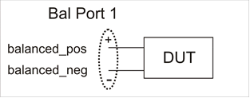

##### Read-only

|

##### [About Balanced
Measurements](../../../S1_Settings/Balanced_Measurements.htm)  
  
---|---  
  
# B_BalPortPositive Method

* * *

#### Description

|  Returns the positive balanced port number in the balanced DUT topology. Use
[SetBPort Method](../Methods/SetBPort_Method.md) to set the single balanced
port DUT topology.   
---|---  
  
####  VB Syntax

|  var = balTopology.B_BalPortPositive  
  
#### Variable

|

#### [(Type)](../../Learning_about_COM/COM_Data_Types.md) \- Description  
  
balTopology |  A [BalancedTopology](../Objects/BalancedTopology_Object.md) (object)  
var |  (Long Integer) Variable to store the returned value.  
  
#### Return Type

|  Long Integer  
  
#### Default

|  Not Applicable  
  
#### Examples

|  variable = balTopology.B_BalPortPositive 'Read  
  
#### [C++](../../Learning_about_COM/c%2b%2b_and_the_com_interface.md) Syntax

|  HRESULT get_B_BalPortPositive(long *PosPort)  
  
#### Interface

|  IBalancedTopology3

