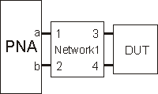
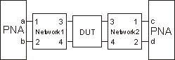

##### Write-only

|

##### About Fixturing  
  
---|---  
  
## Embed4PortList Property

* * *

#### Description

|  Specifies the VNA port connections for ALL topologies. The port assignment
is dependent on the DUT topology. All four port numbers are required. However,
for:

  * Topology A, only the first two arguments are valid,
  * Topology B, only the first three arguments are valid,
  * Topology C, ALL arguments are valid.

Specify topology using [Embed4PortTopology
Property](Embed4PortTopology_Property.htm). Read the port assignments using
the following commands. A, B, C, and D, refer to the port; NOT the topology.

  * [Embed4PortA Property](Embed4PortA_Property.md)
  * [Embed4PortB Property](Embed4PortB_Property.md)
  * [Embed4PortC Property](Embed4PortC_Property.md)
  * [Embed4PortD Property](Embed4PortD_Property.md)

|  Topology A  
---  
  
 Topology B  
---  
  
 Topology C  
---  
  
####  VB Syntax

|  fixture.Embed4PortList (p1, p2, p3) = p4  
  
#### Variable

|

#### [(Type)](../../Learning_about_COM/COM_Data_Types.md) \- Description  
  
fixture |  A [Fixturing](../Objects/Fixturing_Object.md) (object)  
p1 |  VNA Port number assigned to a in above graphic.  
p2 |  VNA Port number assigned to b in above graphic.  
p3 |  VNA Port number assigned to c in above graphic.  
p4 |  VNA Port number assigned to d in above graphic.  
  
#### Default

|  1,2,3,4  
  
#### Examples

|  Port 1, 2, 3, 4 configuration:  
fixture.Embed4PortList (1,2,3) = 4 'Write  
  
Port 4, 3, 2, 1 configuration:  
fixture.Embed4PortList (4,3,2) = 1 'Write  
  
Port 2, 4, 1, 3 configuration:  
fixture.Embed4PortList (2,4,1) = 3 'Write  
  
#### [C++](../../Learning_about_COM/c++_and_the_com_interface.md) Syntax

|  HRESULT put_Embed4PortList(short pPortA, short pPortB, short pPortC, short
pPortD);  
  
#### Interface

|  IFixturing2

