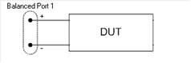
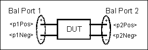
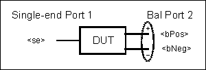
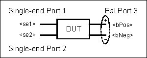

# Calculate:FSimulator:Balun Commands

* * *

CALCulate:FSIMulator:BALun: BPORt | OFFSet | [PHASe](FSimulatorBalun.md#BPortOffsetPhase) | [POWer](FSimulatorBalun.md#BPortOffsPower) | STIMulus | TRUe | STATe | SWEep | PHASe | [STARt](FSimulatorBalun.md#bPortPhaseStart) | [STOP](FSimulatorBalun.md#bPortPhaseStop) CZConversion | BPOrt | [IMAG](FSimulatorBalun.md#CzcImag) | [REAL](FSimulatorBalun.md#czcReal) | Z0 | [R](FSimulatorBalun.md#CzcR) | [STATe](FSimulatorBalun.md#czcState) | LPOrt | [IMAG](FSimulatorBalun.md#CzcImagLport) | [REAL](FSimulatorBalun.md#czcRealLport) | Z0 | [R](FSimulatorBalun.md#CzcRLport) [DEVice](FSimulatorBalun.md#DevType) DMCircuit | BPOrt | PARameters | [C](FSimulatorBalun.md#dmcParC) | [G](FSimulatorBalun.md#dmcParG) | [L](FSimulatorBalun.md#dmcParL) | [R](FSimulatorBalun.md#dmcParR) | [TYPE](FSimulatorBalun.md#dmcType) | USER | [FILename](FSimulatorBalun.md#dmcFilename) | LPOrt | PARameters | [C](FSimulatorBalun.md#dmcParCLport) | [G](FSimulatorBalun.md#dmcParGLport) | [L](FSimulatorBalun.md#dmcParLLport) | [R](FSimulatorBalun.md#dmcParRLport) | [TYPE](FSimulatorBalun.md#dmcTypeLport) | USER | [FILename](FSimulatorBalun.md#dmcFilenameLport) | STATe DZConversion | BPOrt | [IMAG](FSimulatorBalun.md#dzcImag) | [REAL](FSimulatorBalun.md#dzcReal) | Z0 | [R](FSimulatorBalun.md#dzcR) | [STATe](FSimulatorBalun.md#dzcState) | LPOrt | [IMAG](FSimulatorBalun.md#dzcImagLport) | [REAL](FSimulatorBalun.md#dzcRealLport) | Z0 | [R](FSimulatorBalun.md#dzcRLport) FIXTure | OFFSet | [PHASe](FSimulatorBalun.md#trueOffsetPhase) | [POWer](FSimulatorBalun.md#trueOffsetPower) | [PHASe](FSimulatorBalun.md#FixtSweepPhase) LPORt | OFFSet | PHASe | POWer | SWEep | PHASe | STARt | STOP PARameter | BALanced | [:DEFine] | BALSended | [[:DEFine](FSimulatorBalun.md#parBALS)] | BBALanced | [[:DEFine](FSimulatorBalun.md#parBBAL)] | BSSended | [DEFine] | CATalog? | CUSTom | [:DEFine] | SBALanced | [[:DEFine](FSimulatorBalun.md#parSBAL)] | SSBalanced | [[:DEFine](FSimulatorBalun.md#parSSB)] | [:STATe] PHASe | SWEep | PORT | [STATe](FSimulatorBalun.md#phaseSweepState) STIMulus | [MODE](FSimulatorBalun.md#StimMode) TOPology | BALanced | [:PPORts] | BALSended | [[:PPORts](FSimulatorBalun.md#topBALS)] | BBALanced | [[:PPORts]](FSimulatorBalun.md#topBBAL) | BSSended | [:PPORts] | SBALanced | [[:PPORts](FSimulatorBalun.md#topSBAL)] | SSBalanced | [[:PPORts](FSimulatorBalun.md#topSSB)]  
---  
  
Click on a keyword to view the command details.

See Also

  * [Example Programs](../../GPIB_Example_Programs/SCPI_Example_Programs.md)

  * [Learn about Balanced Measurements](../../../S1_Settings/Balanced_Measurements.md)

  * [Learn about iTMSA](../../../Applications/iTMSA.md)

  * [Synchronizing the Analyzer and Controller](../../Learning_about_GPIB/Understanding_Command_Synchronization.md)

  * [SCPI Command Tree](../SCPI_Command_Tree.md)

Notes:

Critical Note: CALCulate commands act on the selected measurement. You can
select one measurement for each channel using
[Calc:Par:MNUM](Parameter.md#MnumSel) or
[Calc:Par:Select](Parameter.md#cps). [Learn
more](../../Learning_about_GPIB/Referring_to_Traces_Measurements_Channels_Windows_Using_SCPI.htm).

  * [CALC:PAR:CAT?](Parameter.md#cpc) alone can NOT be used to return a balanced measurement parameter. If a balanced measurement transform is being performed, then additional querying of the CALC:FSIM system is required to determine the balanced parameter type. [See an example.](../../GPIB_Example_Programs/Create_a_Balanced_Measurement_using_SCPI.md)

  * BPORt versus LPORt commands \- For each command in this subsystem that includes a BPORt keyword, there is an LPORt equivalent. The commands are identical except for the way in which the balanced / logical port numbers are specified:

  *     * The BPORt commands refer to the Balanced port number. There can only be up to two balanced ports. This method is compatible with the ENA network analyzer.

    * The LPORt commands refer to the Logical port number. A balanced port can appear as either logical port 1, 2, or 3. These are the references as they appear in the front-panel user interface.

Topology | Logical Port | Balanced Port  
---|---|---  
Single-Bal | 1 | N/A  
2 | 1  
Single-Single-Bal | 1 | N/A  
2 | N/A  
3 | 1  
Bal-Bal | 1 | 1  
2 | 2  
  
[Learn more about logical
ports.](../../../S1_Settings/Balanced_Measurements.htm#mapping)

* * *

CALCulate<cnum>:FSIMulator:BALun:BPORt<pnum>:OFFSet:PHASe <value>

Applicable Models: All (Read-Write) Sets the phase offset between the two
balanced stimulus ports. This command only applies when
[CALC:FSIM:BAL:STIM:MOD](FSimulatorBalun.md#StimMode) is set to a True Mode -
Not Single-Ended. Requires Opt S93460A/B. [Learn more about iTMSA Power and
Phase offset.](../../../Applications/iTMSA.htm) See Critical Note  
---  
Parameters |   
<cnum> | Channel number of the measurement. There must be a selected measurement on that channel. If unspecified, <cnum> is set to 1.  
<pnum> | Balanced port number. Choose from 1 to 999.  
<value> | Phase offset value in degrees.  
Examples | CALC:FSIM:BAL:BPOR:OFFS:PHAS 10  
calculate2:fsimulator:balun:bport:offset:phase 300 [See example iTMSA
program](../../GPIB_Example_Programs/Create_an_iTMSA_Measurement.htm)  
Query Syntax | CALCulate<cnum>:FSIMulator:BALun:BPORt<pnum>:OFFSet:PHASe?  
Return Type | Numeric  
[Default](JavaScript:hhctrl.TextPopup\(DefSCPI,'Arial,8',10,10,00000000,0xc0ffff\)) | 0  
  
* * *

CALCulate<cnum>:FSIMulator:BALun:BPORt<pnum>:OFFSet:POWer <value>

Applicable Models: All (Read-Write) Sets the power offset between the two
balanced stimulus ports. This command only applies when
[CALC:FSIM:BAL:STIM:MOD](FSimulatorBalun.md#StimMode) is set to a True Mode -
Not Single-Ended. Requires Opt S93460A/B. [Learn more about iTMSA Power and
Phase offset.](../../../Applications/iTMSA.htm) See Critical Note  
---  
Parameters |   
<cnum> | Channel number of the measurement. There must be a selected measurement on that channel. If unspecified, <cnum> is set to 1.  
<pnum> | Balanced port number. Choose from 1 to 999.  
<value> | Power offset value in dB.  
Examples | CALC:FSIM:BAL:BPOR:OFFS:POW 2  
calculate2:fsimulator:balun:bport:offset:power .2 [See example iTMSA
program](../../GPIB_Example_Programs/Create_an_iTMSA_Measurement.htm)  
Query Syntax | CALCulate<cnum>:FSIMulator:BALun:BPORt<pnum>:OFFSet:POWer?  
Return Type | Numeric  
[Default](JavaScript:hhctrl.TextPopup\(DefSCPI,'Arial,8',10,10,00000000,0xc0ffff\)) | 0  
  
* * *

CALCulate<cnum>:FSIMulator:BALun:BPORt<pnum>:STIMulus:TRUe:STATe <bool>

Applicable Models: All (Read-Write) Sets and reads the True Mode state for a
specified balanced port. See Critical Note  
---  
Parameters |   
<cnum> | Channel number of the measurement. There must be a selected measurement on that channel. If unspecified, <cnum> is set to 1.  
<pnum> | Balanced port number. Choose from 1 to 999.  
<bool> | Choose from: OFF (or 0) Turns True Mode OFF ON (or 1) Turns True Mode ON  
Examples | CALC:FSIM:BAL:BPOR2:STIM:TRU:STAT 1  
calculate2:fsimulator:balun:bport2:stimulus:state off  
Query Syntax | CALCulate<cnum>:FSIMulator:BALun:BPORt<pnum>:STIMulus:TRUe:STATe?  
Return Type | Boolean  
[Default](JavaScript:hhctrl.TextPopup\(DefSCPI,'Arial,8',10,10,00000000,0xc0ffff\)) | Off  
  
* * *

CALCulate<cnum>:FSIMulator:BALun:BPORt<pnum>:SWEep:PHASe:STARt <value>

Applicable Models: All (Read-Write) Sets the start value for a phase sweep.
[Learn more about Phase Sweep.](../../../Applications/iTMSA.md) See Critical
Note  
---  
Parameters |   
<cnum> | Channel number of the measurement. There must be a selected measurement on that channel. If unspecified, <cnum> is set to 1.  
<pnum> | Balanced port number. Choose any VNA port (1 to 999). Only one port can have phase sweep.  
<value> | Phase sweep start value in degrees. Choose a value between -360 and 360.  
Examples | CALC:FSIM:BAL:BPOR:SWE:PHAS:STAR 10 calculate2:fsimulator:balun:bport:sweep:phase:start 5  
Query Syntax | CALCulate<cnum>:FSIMulator:BALun:BPORt<pnum>:SWEep:PHASe:STARt?  
Return Type | Numeric  
[Default](JavaScript:hhctrl.TextPopup\(DefSCPI,'Arial,8',10,10,00000000,0xc0ffff\)) | 0  
  
* * *

CALCulate<cnum>:FSIMulator:BALun:BPORt<pnum>:SWEep:PHASe:STOP <value>

Applicable Models: All (Read-Write) Sets the stop value for a phase sweep.
[Learn more about Phase Sweep.](../../../Applications/iTMSA.md) See Critical
Note  
---  
Parameters |   
<cnum> | Channel number of the measurement. There must be a selected measurement on that channel. If unspecified, <cnum> is set to 1.  
<pnum> | Balanced port number. Choose any VNA port (1 to 999). Only one port can have phase sweep.  
<value> | Phase sweep stop value in degrees. Choose a value between -360 and 360.  
Examples | CALC:FSIM:BAL:BPOR:SWE:PHAS:STOP 10 calculate2:fsimulator:balun:bport:sweep:phase:stop 5  
Query Syntax | CALCulate<cnum>:FSIMulator:BALun:BPORt<pnum>:SWEep:PHASe:STOP?  
Return Type | Numeric  
[Default](JavaScript:hhctrl.TextPopup\(DefSCPI,'Arial,8',10,10,00000000,0xc0ffff\)) | 360  
  
* * *

CALCulate<cnum>:FSIMulator:BALun:CZConversion:BPORt<pnum>:IMAG <value>
Superseded

Applicable Models: All The command set of[
CALCulate:FSIMulator:BALun:CZConversion:XXXX](FSimulatorBalun.htm) is changed
to the set of
[CALCulate:FSIMulator:DRAFt:ZCONversion:COMMonmode:YYYY](FSimulatorDraft.md)
and [CALCulate:FSIMulator:ZCONversion:COMMonmode:YYYY?](FSimulatorActive.md)
Learn about [Using Fixture Simulator](../../Using_Fixture_Simulator.md).
(Read-Write) Sets the imaginary part of the impedance value for the common
port impedance conversion function. See Critical Note  
---  
Parameters |   
<cnum> | Channel number of the measurement. There must be a selected measurement on that channel. If unspecified, <cnum> is set to 1.  
<pnum> | Balanced port number. Choose from 1 to 999. Note: The numbering of logical ports is different from balanced ports. This command works the same as the ENA network analyzer. If there is only one balanced port, it is Balanced Port 1, regardless of the port mapping assignment. [Learn more.](FSimulatorBalun.md#BPORt Lport)  
<value> | Imaginary part of the Impedance value in Units. Choose a number between 0 and 1E18.  
Examples | CALC:FSIM:BAL:CZC:BPOR:IMAG 0  
calculate2:fsimulator:balun:czconversion:bport:imag 300  
Query Syntax | CALCulate<cnum>:FSIMulator:BALun:CZConversion:BPORt<pnum>:IMAG?  
Return Type | Numeric  
[Default](JavaScript:hhctrl.TextPopup\(DefSCPI,'Arial,8',10,10,00000000,0xc0ffff\)) | 0  
  
* * *

CALCulate<cnum>:FSIMulator:BALun:CZConversion:BPORt<pnum>:REAL <value>
Superseded

Applicable Models: All The command set of[
CALCulate:FSIMulator:BALun:CZConversion:XXXX](FSimulatorBalun.htm) is changed
to the set of
[CALCulate:FSIMulator:DRAFt:ZCONversion:COMMonmode:YYYY](FSimulatorDraft.md)
and [CALCulate:FSIMulator:ZCONversion:COMMonmode:YYYY?](FSimulatorActive.md)
Learn about [Using Fixture Simulator](../../Using_Fixture_Simulator.md).
(Read-Write) Sets the real part of the impedance value for the common port
impedance conversion function. See Critical Note  
---  
Parameters |   
<cnum> | Channel number of the measurement. There must be a selected measurement on that channel. If unspecified, <cnum> is set to 1.  
<pnum> | Balanced port number. Choose from 1 to 999. Note: The numbering of logical ports is different from balanced ports. This command works the same as the ENA network analyzer. If there is only one balanced port, it is Balanced Port 1, regardless of the port mapping assignment. [Learn more.](FSimulatorBalun.md#BPORt Lport)  
<value> | Real part of the Impedance value in Units. Choose a number between 0 and 1E18.  
Examples | CALC:FSIM:BAL:CZC:BPOR:REAL 25  
calculate2:fsimulator:balun:czconversion:bport:real 50  
Query Syntax | CALCulate<cnum>:FSIMulator:BALun:CZConversion:BPORt<pnum>:REAL?  
Return Type | Numeric  
[Default](JavaScript:hhctrl.TextPopup\(DefSCPI,'Arial,8',10,10,00000000,0xc0ffff\)) | See Common Mode Port Z Conversion Default  
  
* * *

CALCulate<cnum>:FSIMulator:BALun:CZConversion:BPORt<pnum>:Z0[:R] <value>
Superseded

Applicable Models: All The command set of[
CALCulate:FSIMulator:BALun:CZConversion:XXXX](FSimulatorBalun.htm) is changed
to the set of
[CALCulate:FSIMulator:DRAFt:ZCONversion:COMMonmode:YYYY](FSimulatorDraft.md)
and [CALCulate:FSIMulator:ZCONversion:COMMonmode:YYYY?](FSimulatorActive.md)
Learn about [Using Fixture Simulator](../../Using_Fixture_Simulator.md).
(Read-Write) Sets the real part of the impedance value for the common port
impedance conversion function. Set either this single value or set the
[real](FSimulatorBalun.md#czcReal) and
[imaginary](FSimulatorBalun.md#CzcImag) parts separately. The imaginary part
is set to 0.0 using this command. See Critical Note  
---  
Parameters |   
<cnum> | Channel number of the measurement. There must be a selected measurement on that channel. If unspecified, <cnum> is set to 1.  
<pnum> | The number of balanced ports. For example, if the device topology was SE-BAL-SE-BAL-SE-BAL, then this configuration would have 6 logical ports and 3 balanced ports. [Learn more about logical and balanced ports.](../../../S1_Settings/Balanced_Measurements.md#mapping)  
<value> | Impedance value in ohms. Choose a number between 0 to 1E7.  
Examples | CALC:FSIM:BAL:CZC:BPOR:Z0 50  
calculate2:fsimulator:balun:czconversion:bport:z0:r 75  
Query Syntax | CALCulate<cnum>:FSIMulator:BALun:CZConversion:BPORt<pnum>:Z0[:R]?  
Return Type | Numeric  
[Default](JavaScript:hhctrl.TextPopup\(DefSCPI,'Arial,8',10,10,00000000,0xc0ffff\)) | See Common Mode Port Z Conversion Default  
  
* * *

CALCulate<cnum>:FSIMulator:BALun:CZConversion:STATe <bool> Superseded

Applicable Models: All This command is changed to [CALCulate:FSIMulator:DRAFt:SECTion:ZCONversion:ENABle <ON | OFF>](FSimulatorDraft.md#SecZconEnab) and [CALCulate:FSIMulator:SECTion:ZCONversion:ENABle?](FSimulatorActive.md#SectZconEnab) Learn about [Using Fixture Simulator](../../Using_Fixture_Simulator.md). (Read-Write) Sets the common port impedance conversion function ON/OFF. Must also set the fixture simulator function to ON using [CALC:FSIM:STAT.](FSimulator.md#FSimState) See Critical Note  
---  
Parameters |   
<cnum> | Channel number of the measurement. There must be a selected measurement on that channel. If unspecified, <cnum> is set to 1.  
<bool> | State of common port impedance conversion function. Choose from OFF (or 0) Conversion OFF ON (or 1) Conversion ON  
Examples | CALC:FSIM:BAL:CZC:STAT 1  
calculate2:fsimulator:balun:czconversion:state off  
Query Syntax | CALCulate<cnum>:FSIMulator:BALun:CZConversion:STATe?  
Return Type | Boolean  
[Default](JavaScript:hhctrl.TextPopup\(DefSCPI,'Arial,8',10,10,00000000,0xc0ffff\)) | Off  
  
* * *

CALCulate<cnum>:FSIMulator:BALun:CZConversion:LPORt<pnum>:IMAG <value>
Superseded

Applicable Models: All The command set of[
CALCulate:FSIMulator:BALun:CZConversion:XXXX](FSimulatorBalun.htm) is changed
to the set of
[CALCulate:FSIMulator:DRAFt:ZCONversion:COMMonmode:YYYY](FSimulatorDraft.md)
and [CALCulate:FSIMulator:ZCONversion:COMMonmode:YYYY?](FSimulatorActive.md)
Learn about [Using Fixture Simulator](../../Using_Fixture_Simulator.md).
(Read-Write) Sets the imaginary part of the impedance value for the common
port impedance conversion function. See Critical Note  
---  
Parameters |   
<cnum> | Channel number of the measurement. There must be a selected measurement on that channel. If unspecified, <cnum> is set to 1.  
<pnum> | Logical port number. Choose from 1 to 999. Note: See [Balanced port versus Logical port](FSimulatorBalun.md#BPORt Lport).  
<value> | Imaginary part of the Impedance value in Units. Choose a number between 0 and 1E18.  
Examples | CALC:FSIM:BAL:CZC:LPOR:IMAG 0  
calculate2:fsimulator:balun:czconversion:lport:imag 300  
Query Syntax | CALCulate<cnum>:FSIMulator:BALun:CZConversion:LPORt<pnum>:IMAG?  
Return Type | Numeric  
[Default](JavaScript:hhctrl.TextPopup\(DefSCPI,'Arial,8',10,10,00000000,0xc0ffff\)) | 0  
  
* * *

CALCulate<cnum>:FSIMulator:BALun:CZConversion:LPORt<pnum>:REAL <value>
Superseded

Applicable Models: All The command set of[
CALCulate:FSIMulator:BALun:CZConversion:XXXX](FSimulatorBalun.htm) is changed
to the set of
[CALCulate:FSIMulator:DRAFt:ZCONversion:COMMonmode:YYYY](FSimulatorDraft.md)
and [CALCulate:FSIMulator:ZCONversion:COMMonmode:YYYY?](FSimulatorActive.md)
Learn about [Using Fixture Simulator](../../Using_Fixture_Simulator.md).
(Read-Write) Sets the real part of the impedance value for the common port
impedance conversion function. See Critical Note  
---  
Parameters |   
<cnum> | Channel number of the measurement. There must be a selected measurement on that channel. If unspecified, <cnum> is set to 1.  
<pnum> | Logical port number. Choose from 1 to 999. Note: See [Balanced port versus Logical port](FSimulatorBalun.md#BPORt Lport).  
<value> | Real part of the Impedance value in Units. Choose a number between 0 and 1E18.  
Examples | CALC:FSIM:BAL:CZC:LPOR:REAL 25  
calculate2:fsimulator:balun:czconversion:lport:real 50  
Query Syntax | CALCulate<cnum>:FSIMulator:BALun:CZConversion:LPORt<pnum>:REAL?  
Return Type | Numeric  
[Default](JavaScript:hhctrl.TextPopup\(DefSCPI,'Arial,8',10,10,00000000,0xc0ffff\)) | See Common Mode Port Z Conversion Default  
  
* * *

CALCulate<cnum>:FSIMulator:BALun:CZConversion:LPORt<pnum>:Z0[:R] <value>
Superseded

Applicable Models: All The command set of[
CALCulate:FSIMulator:BALun:CZConversion:XXXX](FSimulatorBalun.htm) is changed
to the set of
[CALCulate:FSIMulator:DRAFt:ZCONversion:COMMonmode:YYYY](FSimulatorDraft.md)
and [CALCulate:FSIMulator:ZCONversion:COMMonmode:YYYY?](FSimulatorActive.md)
Learn about [Using Fixture Simulator](../../Using_Fixture_Simulator.md).
(Read-Write) Sets the real part of the impedance value for the common port
impedance conversion function. Set either this single value or set the
[real](FSimulatorBalun.md#czcReal) and
[imaginary](FSimulatorBalun.md#CzcImag) parts separately. The imaginary part
is set to 0.0 using this command. See Critical Note  
---  
Parameters |   
<cnum> | Channel number of the measurement. There must be a selected measurement on that channel. If unspecified, <cnum> is set to 1.  
<pnum> | Logical port number. Choose from 1 to 999. Note: See [Balanced port versus Logical port](FSimulatorBalun.md#BPORt Lport).  
<value> | Impedance value in ohms. Choose a number between 0 to 1E7.  
Examples | CALC:FSIM:BAL:CZC:LPOR:Z0 50  
calculate2:fsimulator:balun:czconversion:lport:z0:r 75  
Query Syntax | CALCulate<cnum>:FSIMulator:BALun:CZConversion:LPORt<pnum>:Z0[:R]?  
Return Type | Numeric  
[Default](JavaScript:hhctrl.TextPopup\(DefSCPI,'Arial,8',10,10,00000000,0xc0ffff\)) | See Common Mode Port Z Conversion Default  
  
* * *

CALCulate<cnum>:FSIMulator:BALun:DEVice <char>

Applicable Models: All (Read-Write) Selects the device type for the balanced
measurement. To map the device type logical ports to the VNA physical ports,
use the [CALCulate:DTOPology](Calculate_DTOPology_Command.md) ,
CALC:FSIM:BAL:TOP:XXXXX command. See Critical Note  
---  
Parameters |   
<cnum> | Channel number of the measurement. There must be a selected measurement on that channel. If unspecified, <cnum> is set to 1.  
<char> | BALanced \- 1 port balanced device (2 ports) BBALanced \- Balanced - Balanced device (4 ports). BALSended \- Balanced - Single-ended device (3 ports). SBALanced \- Single-ended - Balanced device (3 ports). SSBalanced \- Single-ended - Single-ended - Balanced device (4 ports). BSSended \- Balanced - Single-ended - Single-ended device (4 ports). CUST \- Define custom device type for systems with greater than 4 ports.  
Examples | CALC:FSIM:BAL:DEV SSB  
calculate2:fsimulator:balun:device bbal  
Query Syntax | CALCulate<cnum>:FSIMulator:BALun:DEVice?  
Return Type | Character  
[Default](JavaScript:hhctrl.TextPopup\(DefSCPI,'Arial,8',10,10,00000000,0xc0ffff\)) | SBALanced  
  
* * *

CALCulate<cnum>:FSIMulator:BALun:DMCircuit:BPORt<pnum>:PARameters:C <value>
Superseded

Applicable Models: All The command set of
[CALCulate:FSIMulator:BALun:DMCircuit:XXXX](FSimulatorBalun.md) is changed to
[CALCulate:FSIMulator:DRAFt:CIRCuit:YYYY](FSimulatorDraft.md) and
[CALCulate<cnum>:FSIMulator::CIRCuit:YYYY?](FSimulatorActive.md) Learn about
[Using Fixture Simulator](../../Using_Fixture_Simulator.md). (Read-Write)
Sets the Capacitance value of the differential matching circuit. See Critical
Note  
---  
Parameters |   
<cnum> | Channel number of the measurement. There must be a selected measurement on that channel. If unspecified, <cnum> is set to 1.  
<pnum> | Balanced port number. Choose from 1 to 999. Note: The numbering of logical ports is different from balanced ports. This command works the same as the ENA network analyzer. If there is only one balanced port, it is Balanced Port 1, regardless of the port mapping assignment. [Learn more.](FSimulatorBalun.md#BPORt Lport)  
<value> | Capacitance value in farads. Choose a number between -1E18 to 1E18  
Examples | CALC:FSIM:BAL:DMC:BPOR:PARameters:C 10E-6  
calculate2:fsimulator:balun:dmcircuit:bport:parameters:c 1E-9  
Query Syntax | CALCulate<cnum>:FSIMulator:BALun:DMCircuit:BPORt<pnum>:PARameters:C?  
Return Type | Numeric  
[Default](JavaScript:hhctrl.TextPopup\(DefSCPI,'Arial,8',10,10,00000000,0xc0ffff\)) | 0  
  
* * *

CALCulate<cnum>:FSIMulator:BALun:DMCircuit:BPORt<pnum>:PARameters:G <value>
Superseded

Applicable Models: All The command set of
[CALCulate:FSIMulator:BALun:DMCircuit:XXXX](FSimulatorBalun.md) is changed to
[CALCulate:FSIMulator:DRAFt:CIRCuit:YYYY](FSimulatorDraft.md) and
[CALCulate<cnum>:FSIMulator::CIRCuit:YYYY?](FSimulatorActive.md) Learn about
[Using Fixture Simulator](../../Using_Fixture_Simulator.md). (Read-Write)
Sets the Conductance value of the differential matching circuit. See Critical
Note  
---  
Parameters |   
<cnum> | Channel number of the measurement. There must be a selected measurement on that channel. If unspecified, <cnum> is set to 1.  
<pnum> | Balanced port number. Choose from 1 to 999. Note: The numbering of logical ports is different from balanced ports. This command works the same as the ENA network analyzer. If there is only one balanced port, it is Balanced Port 1, regardless of the port mapping assignment. [Learn more.](FSimulatorBalun.md#BPORt Lport)  
<value> | Conductance value in siemens. Choose a number between -1E18 to 1E18.  
Examples | CALC:FSIM:BAL:DMC:BPOR:PARameters:G 1E3  
calculate2:fsimulator:balun:dmcircuit:bport:parameters:g 1E-3  
Query Syntax | CALCulate<cnum>:FSIMulator:BALun:DMCircuit:BPORt<pnum>:PARameters:G?  
Return Type | Numeric  
[Default](JavaScript:hhctrl.TextPopup\(DefSCPI,'Arial,8',10,10,00000000,0xc0ffff\)) | 0  
  
* * *

CALCulate<cnum>:FSIMulator:BALun:DMCircuit:BPORt<pnum>:PARameters:L <value>
Superseded

Applicable Models: All The command set of
[CALCulate:FSIMulator:BALun:DMCircuit:XXXX](FSimulatorBalun.md) is changed to
[CALCulate:FSIMulator:DRAFt:CIRCuit:YYYY](FSimulatorDraft.md) and
[CALCulate<cnum>:FSIMulator::CIRCuit:YYYY?](FSimulatorActive.md) Learn about
[Using Fixture Simulator](../../Using_Fixture_Simulator.md). (Read-Write)
Sets the Inductance value of the differential matching circuit. See Critical
Note  
---  
Parameters |   
<cnum> | Channel number of the measurement. There must be a selected measurement on that channel. If unspecified, <cnum> is set to 1.  
<pnum> | Balanced port number. Choose from 1 to 999. Note: The numbering of logical ports is different from balanced ports. This command works the same as the ENA network analyzer. If there is only one balanced port, it is Balanced Port 1, regardless of the port mapping assignment. [Learn more.](FSimulatorBalun.md#BPORt Lport)  
<value> | Inductance value in henries. Choose a number between -1E18 to 1E18.  
Examples | CALC:FSIM:BAL:DMC:BPOR:PARameters:L 3E-3  
calculate2:fsimulator:balun:dmcircuit:bport:parameters:lE-10  
Query Syntax | CALCulate<cnum>:FSIMulator:BALun:DMCircuit:BPORt<pnum>:PARameters:L?  
Return Type | Numeric  
[Default](JavaScript:hhctrl.TextPopup\(DefSCPI,'Arial,8',10,10,00000000,0xc0ffff\)) | 0  
  
* * *

CALCulate<cnum>:FSIMulator:BALun:DMCircuit:BPORt<pnum>:PARameters:R <value>
Superseded

Applicable Models: All The command set of
[CALCulate:FSIMulator:BALun:DMCircuit:XXXX](FSimulatorBalun.md) is changed to
[CALCulate:FSIMulator:DRAFt:CIRCuit:YYYY](FSimulatorDraft.md) and
[CALCulate<cnum>:FSIMulator::CIRCuit:YYYY?](FSimulatorActive.md) Learn about
[Using Fixture Simulator](../../Using_Fixture_Simulator.md). (Read-Write)
Sets the Resistance value of the differential matching circuit. See Critical
Note  
---  
Parameters |   
<cnum> | Channel number of the measurement. There must be a selected measurement on that channel. If unspecified, <cnum> is set to 1.  
<pnum> | Balanced port number. Choose from 1 to 999. Note: The numbering of logical ports is different from balanced ports. This command works the same as the ENA network analyzer. If there is only one balanced port, it is Balanced Port 1, regardless of the port mapping assignment. [Learn more.](FSimulatorBalun.md#BPORt Lport)  
<value> | Resistance value in ohms. Choose a number between -1E18 to 1E18.  
Examples | CALC:FSIM:BAL:DMC:BPOR:PARameters:R 100  
calculate2:fsimulator:balun:dmcircuit:bport:parameters:r 4E3  
Query Syntax | CALCulate<cnum>:FSIMulator:BALun:DMCircuit:BPORt<pnum>:PARameters:R?  
Return Type | Numeric  
[Default](JavaScript:hhctrl.TextPopup\(DefSCPI,'Arial,8',10,10,00000000,0xc0ffff\)) | 0  
  
* * *

CALCulate<cnum>:FSIMulator:BALun:DMCircuit:BPORt<pnum>[:TYPE] <char>
Superseded

Applicable Models: All The command set of
[CALCulate:FSIMulator:BALun:DMCircuit:XXXX](FSimulatorBalun.md) is changed to
[CALCulate:FSIMulator:DRAFt:CIRCuit:YYYY](FSimulatorDraft.md) and
[CALCulate<cnum>:FSIMulator::CIRCuit:YYYY?](FSimulatorActive.md) Learn about
[Using Fixture Simulator](../../Using_Fixture_Simulator.md). (Read-Write)
Sets the differential matching circuit type. To select a user-defined circuit,
specify IN ADVANCE the 2-port touchstone filename with
[CALC:FSIM:BAL:DMC:BPOR:USER:FILename.](FSimulatorBalun.md#dmcFilename) If
you do not specify the appropriate file and you select USER, an error occurs
and NONE is automatically selected. See Critical Note  
---  
Parameters |   
<cnum> | Channel number of the measurement. There must be a selected measurement on that channel. If unspecified, <cnum> is set to 1.  
<pnum> | Balanced port number. Choose from 1 to 999. Note: The numbering of logical ports is different from balanced ports. This command works the same as the ENA network analyzer. If there is only one balanced port, it is Balanced Port 1, regardless of the port mapping assignment. [Learn more.](FSimulatorBalun.md#BPORt Lport)  
<char> | Circuit type. Choose from: NONE \- Specifies no-circuit. PLPC \- Specifies the circuit that consists of shunt L and shunt C. USER - Specifies the user-defined circuit.  
Examples | CALC:FSIM:BAL:DMC:BPOR2 PLPC  
calculate2:fsimulator:balun:dmcircuit:bport1:type none  
Query Syntax | CALCulate<cnum>:FSIMulator:BALun:DMCircuit:BPORt<pnum>:TYPE?  
Return Type | Character  
[Default](JavaScript:hhctrl.TextPopup\(DefSCPI,'Arial,8',10,10,00000000,0xc0ffff\)) | PLPC  
  
* * *

CALCulate<cnum>:FSIMulator:BALun:DMCircuit:BPORt<pnum>:USER:FILename <string>
Superseded

Applicable Models: All The command set of
[CALCulate:FSIMulator:BALun:DMCircuit:XXXX](FSimulatorBalun.md) is changed to
[CALCulate:FSIMulator:DRAFt:CIRCuit:YYYY](FSimulatorDraft.md) and
[CALCulate<cnum>:FSIMulator::CIRCuit:YYYY?](FSimulatorActive.md) Learn about
[Using Fixture Simulator](../../Using_Fixture_Simulator.md). (Read-Write)
Specifies the 2-port touchstone file in which the information on the user-
defined differential matching circuit is saved. Following this command, send
[CALC:FSIM:BAL:DMC:BPOR2 USER](FSimulatorBalun.md#dmcType). If the specified
file does not exist, an error occurs when you set the type of differential
matching circuit to USER. See Critical Note  
---  
Parameters |   
<cnum> | Channel number of the measurement. There must be a selected measurement on that channel. If unspecified, <cnum> is set to 1.  
<pnum> | Balanced port number. Choose from 1 to 999. Note: The numbering of logical ports is different from balanced ports. This command works the same as the ENA network analyzer. If there is only one balanced port, it is Balanced Port 1, regardless of the port mapping assignment. [Learn more.](FSimulatorBalun.md#BPORt Lport)  
<string> | File name and extension (.s2P) of the differential matching circuit. Files are stored in the default folder "D:\". To recall from a different folder, specify the full path name.  
Examples | CALC:FSIM:BAL:DMC:BPOR:USER:FIL 'myfile.s2p'  
calculate2:fsimulator:balun:dmcircuit:bport:user:filename "D:\myFile.s2P"  
Query Syntax | CALCulate<cnum>:FSIMulator:BALun:DMCircuit:BPORt<pnum>:USER:FILename?  
Return Type | String  
[Default](JavaScript:hhctrl.TextPopup\(DefSCPI,'Arial,8',10,10,00000000,0xc0ffff\)) | Not Applicable  
  
* * *

CALCulate<cnum>:FSIMulator:BALun:DMCircuit:STATe <bool> Superseded

Applicable Models: All This command is changed to [CALCulate:FSIMulator:DRAFt:SECTion:CIRCuit:ENABle <ON | OFF>](FSimulatorDraft.md#SectCircEnab) and [CALCulate:FSIMulator:SECTion:CIRCuit:ENABle?](FSimulatorActive.md#SectCircEnab) Learn about [Using Fixture Simulator](../../Using_Fixture_Simulator.md). (Read-Write) Sets the differential matching circuit embedding function ON/OFF. Must also set the fixture simulator function to ON using [CALC:FSIM:STAT.](FSimulator.md#FSimState) See Critical Note  
---  
Parameters |   
<cnum> | Channel number of the measurement. There must be a selected measurement on that channel. If unspecified, <cnum> is set to 1.  
<bool> | State of differential matching circuit embedding function. Choose from OFF (or 0) Matching circuit OFF ON (or 1) Matching circuit ON  
Examples | CALC:FSIM:BAL:DMC:STAT 1  
calculate2:fsimulator:balun:dmcircuit:state off  
Query Syntax | CALCulate<cnum>:FSIMulator:BALun:DMCircuit:STATe?  
Return Type | Boolean  
[Default](JavaScript:hhctrl.TextPopup\(DefSCPI,'Arial,8',10,10,00000000,0xc0ffff\)) | Off  
  
* * *

CALCulate<cnum>:FSIMulator:BALun:DMCircuit:LPORt<pnum>:PARameters:C <value>
Superseded

Applicable Models: All The command set of
[CALCulate:FSIMulator:BALun:DMCircuit:XXXX](FSimulatorBalun.md) is changed to
[CALCulate:FSIMulator:DRAFt:CIRCuit:YYYY](FSimulatorDraft.md) and
[CALCulate<cnum>:FSIMulator::CIRCuit:YYYY?](FSimulatorActive.md) Learn about
[Using Fixture Simulator](../../Using_Fixture_Simulator.md). (Read-Write)
Sets the Capacitance value of the differential matching circuit. See Critical
Note  
---  
Parameters |   
<cnum> | Channel number of the measurement. There must be a selected measurement on that channel. If unspecified, <cnum> is set to 1.  
<pnum> | Logical port number. Choose from 1 to 999. Note: See [Balanced port versus Logical port](FSimulatorBalun.md#BPORt Lport).  
<value> | Capacitance value in farads. Choose a number between -1E18 to 1E18  
Examples | CALC:FSIM:BAL:DMC:LPOR:PARameters:C 10E-6  
calculate2:fsimulator:balun:dmcircuit:lport:parameters:c 1E-9  
Query Syntax | CALCulate<cnum>:FSIMulator:BALun:DMCircuit:LPORt<pnum>:PARameters:C?  
Return Type | Numeric  
[Default](JavaScript:hhctrl.TextPopup\(DefSCPI,'Arial,8',10,10,00000000,0xc0ffff\)) | 0  
  
* * *

CALCulate<cnum>:FSIMulator:BALun:DMCircuit:LPORt<pnum>:PARameters:G <value>
Superseded

Applicable Models: All The command set of
[CALCulate:FSIMulator:BALun:DMCircuit:XXXX](FSimulatorBalun.md) is changed to
[CALCulate:FSIMulator:DRAFt:CIRCuit:YYYY](FSimulatorDraft.md) and
[CALCulate<cnum>:FSIMulator::CIRCuit:YYYY?](FSimulatorActive.md) Learn about
[Using Fixture Simulator](../../Using_Fixture_Simulator.md). (Read-Write)
Sets the Conductance value of the differential matching circuit. See Critical
Note  
---  
Parameters |   
<cnum> | Channel number of the measurement. There must be a selected measurement on that channel. If unspecified, <cnum> is set to 1.  
<pnum> | Logical port number. Choose from logical 1 to 999. Note: See [Balanced port versus Logical port](FSimulatorBalun.md#BPORt Lport).  
<value> | Conductance value in siemens. Choose a number between -1E18 to 1E18.  
Examples | CALC:FSIM:BAL:DMC:LPOR:PARameters:G 1E3  
calculate2:fsimulator:balun:dmcircuit:lport:parameters:g 1E-3  
Query Syntax | CALCulate<cnum>:FSIMulator:BALun:DMCircuit:LPORt<pnum>:PARameters:G?  
Return Type | Numeric  
[Default](JavaScript:hhctrl.TextPopup\(DefSCPI,'Arial,8',10,10,00000000,0xc0ffff\)) | 0  
  
* * *

CALCulate<cnum>:FSIMulator:BALun:DMCircuit:LPORt<pnum>:PARameters:L <value>
Superseded

Applicable Models: All The command set of
[CALCulate:FSIMulator:BALun:DMCircuit:XXXX](FSimulatorBalun.md) is changed to
[CALCulate:FSIMulator:DRAFt:CIRCuit:YYYY](FSimulatorDraft.md) and
[CALCulate<cnum>:FSIMulator::CIRCuit:YYYY?](FSimulatorActive.md) Learn about
[Using Fixture Simulator](../../Using_Fixture_Simulator.md). (Read-Write)
Sets the Inductance value of the differential matching circuit. See Critical
Note  
---  
Parameters |   
<cnum> | Channel number of the measurement. There must be a selected measurement on that channel. If unspecified, <cnum> is set to 1.  
<pnum> | Logical port number. Choose from 1 to 999. Note: See [Balanced port versus Logical port](FSimulatorBalun.md#BPORt Lport).  
<value> | Inductance value in henries. Choose a number between -1E18 to 1E18.  
Examples | CALC:FSIM:BAL:DMC:LPOR:PARameters:L 3E-3  
calculate2:fsimulator:balun:dmcircuit:lport:parameters:lE-10  
Query Syntax | CALCulate<cnum>:FSIMulator:BALun:DMCircuit:LPORt<pnum>:PARameters:L?  
Return Type | Numeric  
[Default](JavaScript:hhctrl.TextPopup\(DefSCPI,'Arial,8',10,10,00000000,0xc0ffff\)) | 0  
  
* * *

CALCulate<cnum>:FSIMulator:BALun:DMCircuit:LPORt<pnum>:PARameters:R <value>
Superseded

Applicable Models: All The command set of
[CALCulate:FSIMulator:BALun:DMCircuit:XXXX](FSimulatorBalun.md) is changed to
[CALCulate:FSIMulator:DRAFt:CIRCuit:YYYY](FSimulatorDraft.md) and
[CALCulate<cnum>:FSIMulator::CIRCuit:YYYY?](FSimulatorActive.md) Learn about
[Using Fixture Simulator](../../Using_Fixture_Simulator.md). (Read-Write)
Sets the Resistance value of the differential matching circuit. See Critical
Note  
---  
Parameters |   
<cnum> | Channel number of the measurement. There must be a selected measurement on that channel. If unspecified, <cnum> is set to 1.  
<pnum> | Logical port number. Choose from 1 to 999. Note: See [Balanced port versus Logical port](FSimulatorBalun.md#BPORt Lport).  
<value> | Resistance value in ohms. Choose a number between -1E18 to 1E18.  
Examples | CALC:FSIM:BAL:DMC:LPOR:PARameters:R 100  
calculate2:fsimulator:balun:dmcircuit:lport:parameters:r 4E3  
Query Syntax | CALCulate<cnum>:FSIMulator:BALun:DMCircuit:LPORt<pnum>:PARameters:R?  
Return Type | Numeric  
[Default](JavaScript:hhctrl.TextPopup\(DefSCPI,'Arial,8',10,10,00000000,0xc0ffff\)) | 0  
  
* * *

CALCulate<cnum>:FSIMulator:BALun:DMCircuit:LPORt<pnum>[:TYPE] <char>
Superseded

Applicable Models: All The command set of
[CALCulate:FSIMulator:BALun:DMCircuit:XXXX](FSimulatorBalun.md) is changed to
[CALCulate:FSIMulator:DRAFt:CIRCuit:YYYY](FSimulatorDraft.md) and
[CALCulate<cnum>:FSIMulator::CIRCuit:YYYY?](FSimulatorActive.md) Learn about
[Using Fixture Simulator](../../Using_Fixture_Simulator.md). (Read-Write)
Sets the differential matching circuit type. To select a user-defined circuit,
specify IN ADVANCE the 2-port touchstone filename with
CALC:FSIM:BAL:DMC:LPOR:USER:FILename. If you do not specify the appropriate
file and you select USER, an error occurs and NONE is automatically selected.
See Critical Note  
---  
Parameters |   
<cnum> | Channel number of the measurement. There must be a selected measurement on that channel. If unspecified, <cnum> is set to 1.  
<pnum> | Logical port number. Choose from 1 to 999. Note: See [Balanced port versus Logical port](FSimulatorBalun.md#BPORt Lport).  
<char> | Circuit type. Choose from: NONE \- Specifies no-circuit. PLPC \- Specifies the circuit that consists of shunt L and shunt C. USER - Specifies the user-defined circuit.  
Examples | CALC:FSIM:BAL:DMC:LPOR2 PLPC  
calculate2:fsimulator:balun:dmcircuit:lport1:type none  
Query Syntax | CALCulate<cnum>:FSIMulator:BALun:DMCircuit:LPORt<pnum>:TYPE?  
Return Type | Character  
[Default](JavaScript:hhctrl.TextPopup\(DefSCPI,'Arial,8',10,10,00000000,0xc0ffff\)) | PLPC  
  
* * *

CALCulate<cnum>:FSIMulator:BALun:DMCircuit:LPORt<pnum>:USER:FILename <string>
Superseded

Applicable Models: All The command set of
[CALCulate:FSIMulator:BALun:DMCircuit:XXXX](FSimulatorBalun.md) is changed to
[CALCulate:FSIMulator:DRAFt:CIRCuit:YYYY](FSimulatorDraft.md) and
[CALCulate<cnum>:FSIMulator::CIRCuit:YYYY?](FSimulatorActive.md) Learn about
[Using Fixture Simulator](../../Using_Fixture_Simulator.md). (Read-Write)
Specifies the 2-port touchstone file in which the information on the user-
defined differential matching circuit is saved. Following this command, send
[CALC:FSIM:BAL:DMC:BPOR2 USER](FSimulatorBalun.md#dmcType). If the specified
file does not exist, an error occurs when you set the type of differential
matching circuit to USER. See Critical Note  
---  
Parameters |   
<cnum> | Channel number of the measurement. There must be a selected measurement on that channel. If unspecified, <cnum> is set to 1.  
<pnum> | Logical port number. Choose from 1 to 999. Note: See [Balanced port versus Logical port](FSimulatorBalun.md#BPORt Lport).  
<string> | File name and extension (.s2P) of the differential matching circuit. The default location where files are stored is "D:\". To recall from a different folder, specify the full path name.  
Examples | CALC:FSIM:BAL:DMC:LPOR:USER:FIL 'myfile.s2p'  
calculate2:fsimulator:balun:dmcircuit:lport:user:filename "D:\myFile.s2P"  
Query Syntax | CALCulate<cnum>:FSIMulator:BALun:DMCircuit:LPORt<pnum>:USER:FILename?  
Return Type | String  
[Default](JavaScript:hhctrl.TextPopup\(DefSCPI,'Arial,8',10,10,00000000,0xc0ffff\)) | Not Applicable  
  
* * *

CALCulate<cnum>:FSIMulator:BALun:DZConversion:BPORt<pnum>:IMAG <value>
Superseded

Applicable Models: All This command set of
[CALCulate:FSIMulator:BALun:DZConversion:XXXX](FSimulatorBalun.md) is changed
to the set of
[CALCulate:FSIMulator:DRAFt:ZCONversion:DIFFerential:YYYY](FSimulatorDraft.md)
and
[CALCulate:FSIMulator:ZCONversion:DIFFerential:YYYY?](FSimulatorActive.md)
Learn about [Using Fixture Simulator](../../Using_Fixture_Simulator.md).
(Read-Write) Sets the imaginary part of the impedance value for the
differential port impedance conversion function. See Critical Note  
---  
Parameters |   
<cnum> | Channel number of the measurement. There must be a selected measurement on that channel. If unspecified, <cnum> is set to 1.  
<pnum> | Balanced port number. Choose from 1 to 999. Note: The numbering of logical ports is different from balanced ports. This command works the same as the ENA network analyzer. If there is only one balanced port, it is Balanced Port 1, regardless of the port mapping assignment. [Learn more.](FSimulatorBalun.md#BPORt Lport)  
<value> | Imaginary part of the Impedance value in Units. Choose a number between 0 and 1E18.  
Examples | CALC:FSIM:BAL:DZC:BPOR:IMAG 0  
calculate2:fsimulator:balun:dczconversion:bport:imag 300  
Query Syntax | CALCulate<cnum>:FSIMulator:BALun:DZConversion:BPORt<pnum>:IMAG?  
Return Type | Numeric  
[Default](JavaScript:hhctrl.TextPopup\(DefSCPI,'Arial,8',10,10,00000000,0xc0ffff\)) | 0  
  
* * *

CALCulate<cnum>:FSIMulator:BALun:DZConversion:BPORt<pnum>:REAL <value>
Superseded

Applicable Models: All This command set of
[CALCulate:FSIMulator:BALun:DZConversion:XXXX](FSimulatorBalun.md) is changed
to the set of
[CALCulate:FSIMulator:DRAFt:ZCONversion:DIFFerential:YYYY](FSimulatorDraft.md)
and
[CALCulate:FSIMulator:ZCONversion:DIFFerential:YYYY?](FSimulatorActive.md)
Learn about [Using Fixture Simulator](../../Using_Fixture_Simulator.md).
(Read-Write) Sets the real part of the impedance value for the differential
port impedance conversion function. See Critical Note  
---  
Parameters |   
<cnum> | Channel number of the measurement. There must be a selected measurement on that channel. If unspecified, <cnum> is set to 1.  
<pnum> | Balanced port number. Choose from 1 to 999. Note: The numbering of logical ports is different from balanced ports. This command works the same as the ENA network analyzer. If there is only one balanced port, it is Balanced Port 1, regardless of the port mapping assignment. [Learn more.](FSimulatorBalun.md#BPORt Lport)  
<value> | Real part of the Impedance value in Units. Choose a number between 0 and 1E18  
Examples | CALC:FSIM:BAL:DZC:BPOR:REAL 50  
calculate2:fsimulator:balun:dzconversion:bport:real 75  
Query Syntax | CALCulate<cnum>:FSIMulator:BALun:DZConversion:BPORt<pnum>:REAL?  
Return Type | Numeric  
[Default](JavaScript:hhctrl.TextPopup\(DefSCPI,'Arial,8',10,10,00000000,0xc0ffff\)) | See Differential Port Z Conversion Default  
  
* * *

CALCulate<cnum>:FSIMulator:BALun:DZConversion:BPORt<pnum>:Z0[:R] <value>
Superseded

Applicable Models: All This command set of
[CALCulate:FSIMulator:BALun:DZConversion:XXXX](FSimulatorBalun.md) is changed
to the set of
[CALCulate:FSIMulator:DRAFt:ZCONversion:DIFFerential:YYYY](FSimulatorDraft.md)
and
[CALCulate:FSIMulator:ZCONversion:DIFFerential:YYYY?](FSimulatorActive.md)
Learn about [Using Fixture Simulator](../../Using_Fixture_Simulator.md).
(Read-Write) Sets the impedance value for the differential port impedance
conversion function. Set either this single value or set the real and
imaginary parts separately. The imaginary part is set to 0.0 using this
command. See Critical Note  
---  
Parameters |   
<cnum> | Channel number of the measurement. There must be a selected measurement on that channel. If unspecified, <cnum> is set to 1.  
<pnum> | Balanced port number. Choose from 1 to 999. Note: The numbering of logical ports is different from balanced ports. This command works the same as the ENA network analyzer. If there is only one balanced port, it is Balanced Port 1, regardless of the port mapping assignment. [Learn more.](FSimulatorBalun.md#BPORt Lport)  
<value> | Impedance value in ohms. Choose a number between 0 to 1E7  
Examples | CALC:FSIM:BAL:DZC:BPOR:Z0 50  
calculate2:fsimulator:balun:dzconversion:bport:z0:r 75  
Query Syntax | CALCulate<cnum>:FSIMulator:BALun:DZConversion:BPORt<pnum>:Z0[:R]?  
Return Type | Numeric  
[Default](JavaScript:hhctrl.TextPopup\(DefSCPI,'Arial,8',10,10,00000000,0xc0ffff\)) | See Differential Port Z Conversion Default  
  
* * *

CALCulate<cnum>:FSIMulator:BALun:DZConversion:STATe <bool> Superseded

Applicable Models: All This command is changed to [CALCulate:FSIMulator:DRAFt:SECTion:ZCONversion:ENABle <ON | OFF>](FSimulatorDraft.md#SecZconEnab) [and CALCulate:FSIMulator:SECTion:ZCONversion:ENABle?](FSimulatorActive.md#SectZconEnab) Learn about [Using Fixture Simulator](../../Using_Fixture_Simulator.md). (Read-Write) Sets the differential port impedance conversion function ON/OFF. Must also set the fixture simulator function to ON using [CALC:FSIM:STAT.](FSimulator.md#FSimState) See Critical Note  
---  
Parameters |   
<cnum> | Channel number of the measurement. There must be a selected measurement on that channel. If unspecified, <cnum> is set to 1.  
<bool> | State of the differential port impedance conversion function. Choose from OFF (or 0) Differential port impedance conversion OFF ON (or 1) Differential port impedance conversion ON  
Examples | CALC:FSIM:BAL:DZC:STAT 1  
calculate2:fsimulator:balun:dzconversion:state off  
Query Syntax | CALCulate<cnum>:FSIMulator:BALun:DZConversion:STATe?  
Return Type | Boolean  
[Default](JavaScript:hhctrl.TextPopup\(DefSCPI,'Arial,8',10,10,00000000,0xc0ffff\)) | Off  
  
* * *

CALCulate<cnum>:FSIMulator:BALun:DZConversion:LPORt<pnum>:IMAG <value>
Superseded

Applicable Models: All This command set of
[CALCulate:FSIMulator:BALun:DZConversion:XXXX](FSimulatorBalun.md) is changed
to the set of
[CALCulate:FSIMulator:DRAFt:ZCONversion:DIFFerential:YYYY](FSimulatorDraft.md)
and
[CALCulate:FSIMulator:ZCONversion:DIFFerential:YYYY?](FSimulatorActive.md)
Learn about [Using Fixture Simulator](../../Using_Fixture_Simulator.md).
(Read-Write) Sets the imaginary part of the impedance value for the
differential port impedance conversion function. See Critical Note  
---  
Parameters |   
<cnum> | Channel number of the measurement. There must be a selected measurement on that channel. If unspecified, <cnum> is set to 1.  
<pnum> | Logical port number. Choose from 1 to 999. Note: See [Balanced port versus Logical port](FSimulatorBalun.md#BPORt Lport).  
<value> | Imaginary part of the Impedance value in Units. Choose a number between 0 and 1E18.  
Examples | CALC:FSIM:BAL:DZC:LPOR:IMAG 0  
calculate2:fsimulator:balun:dczconversion:lport:imag 300  
Query Syntax | CALCulate<cnum>:FSIMulator:BALun:DZConversion:LPORt<pnum>:IMAG?  
Return Type | Numeric  
[Default](JavaScript:hhctrl.TextPopup\(DefSCPI,'Arial,8',10,10,00000000,0xc0ffff\)) | 0  
  
* * *

CALCulate<cnum>:FSIMulator:BALun:DZConversion:LPORt<pnum>:REAL <value>
Superseded

Applicable Models: All This command set of
[CALCulate:FSIMulator:BALun:DZConversion:XXXX](FSimulatorBalun.md) is changed
to the set of
[CALCulate:FSIMulator:DRAFt:ZCONversion:DIFFerential:YYYY](FSimulatorDraft.md)
and
[CALCulate:FSIMulator:ZCONversion:DIFFerential:YYYY?](FSimulatorActive.md)
Learn about [Using Fixture Simulator](../../Using_Fixture_Simulator.md).
(Read-Write) Sets the real part of the impedance value for the differential
port impedance conversion function. See Critical Note  
---  
Parameters |   
<cnum> | Channel number of the measurement. There must be a selected measurement on that channel. If unspecified, <cnum> is set to 1.  
<pnum> | Logical port number. Choose from 1 to 999. Note: See [Balanced port versus Logical port](FSimulatorBalun.md#BPORt Lport).  
<value> | Real part of the Impedance value in Units. Choose a number between 0 and 1E18  
Examples | CALC:FSIM:BAL:DZC:LPOR:REAL 50  
calculate2:fsimulator:balun:dzconversion:lport:real 75  
Query Syntax | CALCulate<cnum>:FSIMulator:BALun:DZConversion:LPORt<pnum>:REAL?  
Return Type | Numeric  
[Default](JavaScript:hhctrl.TextPopup\(DefSCPI,'Arial,8',10,10,00000000,0xc0ffff\)) | See Differential Port Z Conversion Default  
  
* * *

CALCulate<cnum>:FSIMulator:BALun:DZConversion:LPORt<pnum>:Z0[:R] <value>
Superseded

Applicable Models: All This command set of
[CALCulate:FSIMulator:BALun:DZConversion:XXXX](FSimulatorBalun.md) is changed
to the set of
[CALCulate:FSIMulator:DRAFt:ZCONversion:DIFFerential:YYYY](FSimulatorDraft.md)
and
[CALCulate:FSIMulator:ZCONversion:DIFFerential:YYYY?](FSimulatorActive.md)
Learn about [Using Fixture Simulator](../../Using_Fixture_Simulator.md).
(Read-Write) Sets the impedance value for the differential port impedance
conversion function. Set either this single value or set the real and
imaginary parts separately. The imaginary part is set to 0.0 using this
command. See Critical Note  
---  
Parameters |   
<cnum> | Channel number of the measurement. There must be a selected measurement on that channel. If unspecified, <cnum> is set to 1.  
<pnum> | Logical port number. Choose from 1 to 999. Note: See [Balanced port versus Logical port](FSimulatorBalun.md#BPORt Lport).  
<value> | Impedance value in ohms. Choose a number between 0 to 1E7  
Examples | CALC:FSIM:BAL:DZC:LPOR:Z0 50  
calculate2:fsimulator:balun:dzconversion:lport:z0:r 75  
Query Syntax | CALCulate<cnum>:FSIMulator:BALun:DZConversion:LPORt<pnum>:Z0[:R]?  
Return Type | Numeric  
[Default](JavaScript:hhctrl.TextPopup\(DefSCPI,'Arial,8',10,10,00000000,0xc0ffff\)) | See Differential Port Z Conversion Default  
  
* * *

CALCulate<cnum>:FSIMulator:BALun:FIXTure:OFFSet:PHASe <bool>

Applicable Models: All  (Read-Write) Sets and reads the state of "Phase Offset
- Offset as Fixture" with True Mode balanced measurements. [Learn more about
iTMSA phase and power offset.](../../../Applications/iTMSA.htm#Offset) See
Critical Note  
---  
Parameters |   
<cnum> | Channel number of the measurement. There must be a selected true mode balanced measurement on that channel. If unspecified, <cnum> is set to 1.  
<bool> | State of phase Offset as Fixture. OFF (or 0) Offset is applied but is NOT included as a fixture in the output calculations. ON (or 1) Offset is applied and included as a fixture in the output calculations.  
Examples | CALC:FSIM:BAL:FIXT:OFFS:PHAS 0  
calculate2:fsimulator:balun:fixture:offset:phase on [See example iTMSA
program](../../GPIB_Example_Programs/Create_an_iTMSA_Measurement.htm)  
Query Syntax | CALCulate<cnum>:FSIMulator:BALun:FIXTureOFFSet:PHASe?  
Return Type | Boolean  
[Default](JavaScript:hhctrl.TextPopup\(DefSCPI,'Arial,8',10,10,00000000,0xc0ffff\)) | ON  
  
* * *

CALCulate<cnum>:FSIMulator:BALun:FIXTure:OFFSet:POWer <bool>

Applicable Models: All (Read-Write) Sets and reads the state of "Power Offset
- Offset as Fixture" with True Mode balanced measurements. [Learn more about
iTMSA phase and power offset.](../../../Applications/iTMSA.htm#Offset) See
Critical Note  
---  
Parameters |   
<cnum> | Channel number of the measurement. There must be a selected true mode balanced measurement on that channel. If unspecified, <cnum> is set to 1.  
<bool> | State of power Offset as Fixture. OFF (or 0) Offset is applied but is NOT included as a fixture in the output calculations. ON (or 1) Offset is applied and included as a fixture in the output calculations.  
Examples | CALC:FSIM:BAL:FIXT:OFFS:POW 0  
calculate2:fsimulator:balun:fixture:offset:power on [See example iTMSA
program](../../GPIB_Example_Programs/Create_an_iTMSA_Measurement.htm)  
Query Syntax | CALCulate<cnum>:FSIMulator:BALun:FIXTureOFFSet:POWer?  
Return Type | Boolean  
[Default](JavaScript:hhctrl.TextPopup\(DefSCPI,'Arial,8',10,10,00000000,0xc0ffff\)) | Off  
  
* * *

CALCulate<cnum>:FSIMulator:BALun:FIXTure:PHASe <bool>

Applicable Models: All (Read-Write) Sets and reads the state of "Phase Sweep -
Offset as Fixture" (labeling on GUI). Note: The CALC:FSIM:BAL:PHAS:SWE:STAT
command must be set to ON for this command to take effect. [Learn more about
iTMSA Phase Sweep](../../../Applications/iTMSA.htm#Offset). See Critical Note  
---  
Parameters |   
<cnum> | Channel number of the measurement. There must be a selected true mode balanced measurement on that channel. If unspecified, <cnum> is set to 1.  
<bool> | State of phase sweep offset as a fixture: OFF (or 0) Phase Sweep offset disabled. ON (or 1) Phase Sweep offset enabled.  
Examples | CALC:FSIM:BAL:FIXT:PHAS 0 calculate2:fsimulator:balun:fixture:phase on  
Query Syntax | CALCulate<cnum>:FSIMulator:BALun:FIXTure:PHASe?  
Return Type | Boolean  
[Default](JavaScript:hhctrl.TextPopup\(DefSCPI,'Arial,8',10,10,00000000,0xc0ffff\)) | Off  
  
* * *

CALCulate<cnum>:FSIMulator:BALun:LPORt<pnum>:OFFSet:PHASe <value>

Applicable Models: All (Read-Write) Sets the phase offset between the two
balanced stimulus ports. This command only applies when
[CALC:FSIM:BAL:STIM:MOD](FSimulatorBalun.md#StimMode) is set to a True Mode -
Not Single-Ended. Requires Opt S93460A/B. [Learn more about iTMSA Power and
Phase offset.](../../../Applications/iTMSA.htm) See Critical Note  
---  
Parameters |   
<cnum> | Channel number of the measurement. There must be a selected measurement on that channel. If unspecified, <cnum> is set to 1.  
<pnum> | Logical port number. Choose from 1 to 999.  
<value> | Phase offset value in degrees.  
Examples | CALC:FSIM:BAL:LPOR:OFFS:PHAS 10  
calculate2:fsimulator:balun:lport:offset:phase 300 [See example iTMSA
program](../../GPIB_Example_Programs/Create_an_iTMSA_Measurement.htm)  
Query Syntax | CALCulate<cnum>:FSIMulator:BALun:LPORt<pnum>:OFFSet:PHASe?  
Return Type | Numeric  
[Default](JavaScript:hhctrl.TextPopup\(DefSCPI,'Arial,8',10,10,00000000,0xc0ffff\)) | 0  
  
* * *

CALCulate<cnum>:FSIMulator:BALun:LPORt<pnum>:OFFSet:POWer <value>

Applicable Models: All (Read-Write) Sets the power offset between the two
balanced stimulus ports. This command only applies when
[CALC:FSIM:BAL:STIM:MOD](FSimulatorBalun.md#StimMode) is set to a True Mode -
Not Single-Ended. Requires Opt S93460A/B. [Learn more about iTMSA Power and
Phase offset.](../../../Applications/iTMSA.htm) See Critical Note  
---  
Parameters |   
<cnum> | Channel number of the measurement. There must be a selected measurement on that channel. If unspecified, <cnum> is set to 1.  
<pnum> | Logical port number. Choose from 1 to 999.  
<value> | Power offset value in dB.  
Examples | CALC:FSIM:BAL:LPOR:OFFS:POW 2  
calculate2:fsimulator:balun:lport:offset:power .2 [See example iTMSA
program](../../GPIB_Example_Programs/Create_an_iTMSA_Measurement.htm)  
Query Syntax | CALCulate<cnum>:FSIMulator:BALun:LPORt<pnum>:OFFSet:POWer?  
Return Type | Numeric  
[Default](JavaScript:hhctrl.TextPopup\(DefSCPI,'Arial,8',10,10,00000000,0xc0ffff\)) | 0  
  
* * *

CALCulate<cnum>:FSIMulator:BALun:LPORt<pnum>:SWEep:PHASe:STARt <value>

Applicable Models: All (Read-Write) Sets the start value for a phase sweep.
[Learn more about Phase Sweep.](../../../Applications/iTMSA.md) See Critical
Note  
---  
Parameters |   
<cnum> | Channel number of the measurement. There must be a selected measurement on that channel. If unspecified, <cnum> is set to 1.  
<pnum> | Logical port number. Choose any VNA port (1 to 999). Only one port can have phase sweep.  
<value> | Phase sweep start value in degrees. Choose a value between -360 and 360.  
Examples | CALC:FSIM:BAL:LPOR:SWE:PHAS:STAR 10 calculate2:fsimulator:balun:lport:sweep:phase:start 5  
Query Syntax | CALCulate<cnum>:FSIMulator:BALun:LPORt<pnum>:SWEep:PHASe:STARt?  
Return Type | Numeric  
[Default](JavaScript:hhctrl.TextPopup\(DefSCPI,'Arial,8',10,10,00000000,0xc0ffff\)) | 0  
  
* * *

CALCulate<cnum>:FSIMulator:BALun:LPORt<pnum>:SWEep:PHASe:STOP <value>

Applicable Models: All (Read-Write) Sets the stop value for a phase sweep.
[Learn more about Phase Sweep.](../../../Applications/iTMSA.md) See Critical
Note  
---  
Parameters |   
<cnum> | Channel number of the measurement. There must be a selected measurement on that channel. If unspecified, <cnum> is set to 1.  
<pnum> | Logical port number. Choose any VNA port (1 to 999). Only one port can have phase sweep.  
<value> | Phase sweep stop value in degrees. Choose a value between -360 and 360.  
Examples | CALC:FSIM:BAL:LPOR:SWE:PHAS:STOP 10 calculate2:fsimulator:balun:lport:sweep:phase:stop 5  
Query Syntax | CALCulate<cnum>:FSIMulator:BALun:LPORt<pnum>:SWEep:PHASe:STOP?  
Return Type | Numeric  
[Default](JavaScript:hhctrl.TextPopup\(DefSCPI,'Arial,8',10,10,00000000,0xc0ffff\)) | 360  
  
* * *

CALCulate<cnum>:FSIMulator:BALun:PARameter<n>:BALSended[:DEFine] <char>

Applicable Models: All (Read-Write) For a Balanced-Single-ended device type,
selects the measurement parameter for the specified trace. Set device type
using [CALC:FSIM:BAL:DEV](FSimulatorBalun.md#DevType) See Critical Note  
---  
Parameters |   
<cnum> | Channel number of the measurement. There must be a selected measurement on that channel. If unspecified, <cnum> is set to 1.  
<n> | Trace number on the specified channel <cnum>  
<char> | Balanced - Single-ended Measurement parameter. Choose from: | Sdd11 | Sdc11 | Sds12  
---|---|---  
Scd11 | Scc11 | Scs12  
Ssd21 | Ssc21 | Sss22  
Imb | CMRR1  
(Ssd21/Ssc21) | CMRR2  
(Sds12/Scs12)  
  
Examples | CALC:FSIM:BAL:PAR:BALS SDC11 calculate1:fsimulator:balun:parameter2:balsended:define imb  
Query Syntax | CALCulate<cnum>:FSIMulator:BALun:PARameter<n>:BALSended[:DEFine]?  
Return Type | Character  
[Default](JavaScript:hhctrl.TextPopup\(DefSCPI,'Arial,8',10,10,00000000,0xc0ffff\)) | Sdd11  
  
* * *

CALCulate<cnum>:FSIMulator:BALun:PARameter<n>:BALanced[:DEFine] <char>

Applicable Models: All (Read-Write) For a Balanced device type, selects the
measurement parameter for the specified trace. Set device type using
[CALC:FSIM:BAL:DEV](FSimulatorBalun.md#DevType) See Critical Note  
---  
Parameters |   
<cnum> | Channel number of the measurement. There must be a selected measurement on that channel. If unspecified, <cnum> is set to 1.  
<n> | Trace number on the specified channel <cnum>  
<char> | Balanced Measurement parameter. Choose from: SDD11 \- Specifies Sdd11. SCD11 \- Specifies Scd11. SDC11 \- Specifies Sdc11. SCC11 \- Specifies Scc11.  
Examples | CALC:FSIM:BAL:PAR:BAL SDD11 calculate1:fsimulator:balun: parameter2:balanced:define scc11  
Query Syntax | CALCulate<cnum>:FSIMulator:BALun:PARameter<n>:BALanced[:DEFine]?  
Return Type | String  
[Default](JavaScript:hhctrl.TextPopup\(DefSCPI,'Arial,8',10,10,00000000,0xc0ffff\)) | Sdd11  
  
* * *

CALCulate<cnum>:FSIMulator:BALun:PARameter<n>:BBALanced[:DEFine] <char>

Applicable Models: All (Read-Write) For a Balanced - Balanced device type,
selects the measurement parameter for the specified trace. Set device type
using [CALC:FSIM:BAL:DEV](FSimulatorBalun.md#DevType) See Critical Note  
---  
Parameters |   
<cnum> | Channel number of the measurement. There must be a selected measurement on that channel. If unspecified, <cnum> is set to 1.  
<n> | Trace number on the specified channel <cnum>  
<char> | Balanced- Balanced Measurement parameter. Choose from: | Sdd11 | Sdd12 | Sdc11 | Sdc12  
---|---|---|---  
Sdd21 | Sdd22 | Sdc21 | Sdc22  
Scd11 | Scd12 | Scc11 | Scc12  
Scd21 | Scd22 | Scc21 | Scc22  
Imb1 | Imb2 | CMRR -(Sdd21/Scc21)  
Examples | CALC:FSIM:BAL:PAR:BBAL SDD12 calculate1:fsimulator:balun: parameter2:bbalanced:define cmrr  
Query Syntax | CALCulate<cnum>:FSIMulator:BALun:PARameter<n>:BBALanced[:DEFine]?  
Return Type | Character  
[Default](JavaScript:hhctrl.TextPopup\(DefSCPI,'Arial,8',10,10,00000000,0xc0ffff\)) | Sdd11  
  
* * *

CALCulate<cnum>:FSIMulator:BALun:PARameter<n>:BSSended[:DEFine] <char>

Applicable Models: All (Read-Write) For a Balanced - Single-ended - Single-
ended type, selects the measurement parameter for the specified trace. Set
device type using [CALC:FSIM:BAL:DEV](FSimulatorBalun.md#DevType) See
Critical Note  
---  
Parameters |   
<cnum> | Channel number of the measurement. There must be a selected measurement on that channel. If unspecified, <cnum> is set to 1.  
<n> | Trace number on the specified channel <cnum>  
<char> | Balanced - Single-ended - Single-ended Measurement parameter. Choose from: | Sdd11 | Sdc11 | Sds12 | Scs12  
---|---|---|---  
Scd11 | Scc11 | Sds13 | Scs13  
Ssd21 | Ssd31 | Sss22 | Sss23  
Ssc21 | Ssc31 | Sss32 | Sss33  
Imb1 | Imb2 | CMRR1 (Sds12/Scs12) | CMRR2 (Sds13/Scs13)  
Examples | CALC:FSIM:BAL:PAR:BSS CMRR2 calculate1:fsimulator:balun: parameter2:bssended:define SSC31  
Query Syntax | CALCulate<cnum>:FSIMulator:BALun:PARameter<n>:BSSended[:DEFine]?  
Return Type | Character  
[Default](JavaScript:hhctrl.TextPopup\(DefSCPI,'Arial,8',10,10,00000000,0xc0ffff\)) | Sdd11  
  
* * *

CALCulate<cnum>:FSIMulator:BALun:PARameter:CATalog?

Applicable Models: All (Read-only) This query returns the list of measurement
parameters available for the currently selected device type and topology.
Balanced parameters are defined by specifying a topology: selecting which
ports are balanced ports and which ports are single ended. Once a topology has
been specified, that topology will yield a set of available measurement
parameters. Set the topology using CALC:FSIM:BAL:DEVice.  
---  
Parameters |   
<cnum> | Channel number.  
Example | CALC:FSIM:BAL:TOP:SBAL:PPORts 2,3,4  
CALC:FSIM:BAL:DEV SBAL  
CALC:FSIM:BAL:PAR:CAT?
"SSS11,SDS21,SSD12,SCS21,SSC12,SDD22,SCD22,SDC22,SCC22,IMB,CMRR1,CMRR2"  
Return Type | Comma separated string  
[Default](JavaScript:hhctrl.TextPopup\(DefSCPI,'Arial,8',10,10,00000000,0xc0ffff\)) | Not Applicable  
  
* * *

CALCulate<cnum>:FSIMulator:BALun:PARameter:CUSTom[:DEFine] <string>

Applicable Models: Multi-port systems with > 4 ports (Read-Write) Defines a
balanced measurement parameter corresponding to a custom topology for systems
where the port count is expandable beyond 4 ports. The device type parameter
must be set to CUST using the CALC:FSIM:BAL:DEV command to use this command.
See Also: CALC:FSIM:BAL:PAR:CAT? \- returns the list of parameters available
for the currently selected device type and topology.
[CALC:DTOPology](Calculate_DTOPology_Command.md) \- maps device type logical
ports to VNA physical ports. See Critical Note  
---  
Parameters |   
<cnum> | Channel number.  
<string> | Balanced measurement parameter name. The parameter selections depend on the currently selected topology.  
Examples | CALC:PAR:COUN 1  
CALC:FSIM:BAL:DEV CUST  
CALC:FSIM:BAL:PAR:STATE ON  
CALC:DTOPology "SSBSS",1,2,4,5,3,6  
CALC:FSIM:BAL:PAR:CUST:DEF "SDD22"  
Query Syntax | CALCulate<cnum>:FSIMulator:BALun:PARameter:CUSTom[:DEFine]?  
Return Type | String  
[Default](JavaScript:hhctrl.TextPopup\(DefSCPI,'Arial,8',10,10,00000000,0xc0ffff\)) | Not Applicable  
  
* * *

CALCulate<cnum>:FSIMulator:BALun:PARameter<n>:SBALanced[:DEFine] <char>

Applicable Models: All (Read-Write) For a Single-ended - Balanced device type,
selects the measurement parameter for the specified trace. Set device type
using [CALC:FSIM:BAL:DEV](FSimulatorBalun.md#DevType) See Critical Note  
---  
Parameters |   
<cnum> | Channel number of the measurement. There must be a selected measurement on that channel. If unspecified, <cnum> is set to 1.  
<n> | Trace number on the specified channel <cnum>  
<char> | Single-ended - Balanced Measurement parameter. Choose from: | Sss11 | Ssd12 | Ssc12  
---|---|---  
Sds21 | Sdd22 | Sdc22  
Scs21 | Scd22 | Scc22  
Imb | CMRR1 (Sds21/Scs21) | CMRR2 (Ssd12/Ssc12)  
Examples | CALC:FSIM:BAL:PAR:SBAL SSD12 calculate1:fsimulator:balun: parameter2:sbalanced:define imb  
Query Syntax | CALCulate<cnum>:FSIMulator:BALun:PARameter<n>:SBALanced[:DEFine]?  
Return Type | Character  
[Default](JavaScript:hhctrl.TextPopup\(DefSCPI,'Arial,8',10,10,00000000,0xc0ffff\)) | Sss11  
  
* * *

CALCulate<cnum>:FSIMulator:BALun:PARameter<n>:SSBalanced[:DEFine] <char>

Applicable Models: All (Read-Write) For a Single-ended - Single-ended -
Balanced device type, selects the measurement parameter for the specified
trace. Set device type using [CALC:FSIM:BAL:DEV](FSimulatorBalun.md#DevType)
See Critical Note  
---  
Parameters |   
<cnum> | Channel number of the measurement. There must be a selected measurement on that channel. If unspecified, <cnum> is set to 1.  
<n> | Trace number on the specified channel <cnum>  
<char> | Single-ended - Single-ended - Balanced Measurement parameter. Choose from: | Sss11 | Sss12 | Ssd13 | Ssc13  
---|---|---|---  
Sss21 | Sss22 | Ssd23 | Ssc23  
Sds31 | Sds32 | Sdd33 | Sdc33  
Scs31 | Scs32 | Scd33 | Scc33  
Imb1 | Imb2 | CMRR1 (Sds31/Scs31) | CMRR2 (Sds32/Scs32)  
Examples | CALC:FSIM:BAL:PAR:SSB SSD23 calculate1:fsimulator:balun: parameter2:ssbalanced:define imb1  
Query Syntax | CALCulate<cnum>:FSIMulator:BALun:PARameter<n>:SSBalanced[:DEFine]?  
Return Type | Character  
[Default](JavaScript:hhctrl.TextPopup\(DefSCPI,'Arial,8',10,10,00000000,0xc0ffff\)) | Sss11  
  
* * *

CALCulate<cnum>:FSIMulator:BALun:PARameter:STATe <bool>

Applicable Models: All (Read-Write) Turns balanced transform ON and OFF. See
Critical Note  
---  
Parameters |   
<cnum> | Channel number of the measurement. There must be a selected measurement on that channel. If unspecified, <cnum> is set to 1.  
<bool> | State of balanced transform. Choose from OFF (or 0) Balanced Transform OFF ON (or 1) Balanced Transform ON  
Examples | CALC:FSIM:BAL:PAR:STAT 1 calculate1:fsimulator:balun:parameter:state off  
Query Syntax | CALCulate<cnum>:FSIMulator:BALun:PARameter:STATe?  
Return Type | Boolean  
[Default](JavaScript:hhctrl.TextPopup\(DefSCPI,'Arial,8',10,10,00000000,0xc0ffff\)) | OFF  
  
* * *

CALCulate<cnum>:FSIMulator:BALun:PHASe:SWEep:PORT <intValue>

Applicable Models: All (Read-Write) For a Balanced device type, specifies
which balanced port the phase will be swept if CALC:FSIM:BAL:PHAS:SWE:STAT is
set to ON. See Critical Note  
---  
Parameters |   
<cnum> | Channel number of the measurement. There must be a selected measurement on that channel. If unspecified, <cnum> is set to 1.  
<intValue> | Balanced port. Enter 1 or 2. Up to 2 True Mode balanced ports are possible.  
Examples | CALC:FSIM:BAL:PHAS:SWE:PORT 2 calculate1:fsimulator:balun:phase:sweep:port 2  
Query Syntax | CALCulate<cnum>:FSIMulator:BALun:PHASe:SWEep:PORT?  
Return Type | Numeric  
[Default](JavaScript:hhctrl.TextPopup\(DefSCPI,'Arial,8',10,10,00000000,0xc0ffff\)) | Not Applicable  
  
* * *

CALCulate<cnum>:FSIMulator:BALun:PHASe:SWEep:STATe <bool>

Applicable Models: N522xB, N523xB, N524xB (Read-Write) Sets and reads the
state of phase sweep. [Learn more about iTMSA Phase
Sweep](../../../Applications/iTMSA.htm#Offset). See Critical Note  
---  
Parameters |   
<cnum> | Channel number of the measurement. There must be a selected true mode balanced measurement on that channel. If unspecified, <cnum> is set to 1.  
<bool> | State of phase sweep: OFF (or 0) Phase Sweep disabled. ON (or 1) Phase Sweep enabled.  
Examples | CALC:FSIM:BAL:PHAS:SWE:STAT 0 calculate2:fsimulator:balun:phase:sweep:state on  
Query Syntax | CALCulate<cnum>:FSIMulator:BALun:PHASe:SWEep:STATe?  
Return Type | Boolean  
[Default](JavaScript:hhctrl.TextPopup\(DefSCPI,'Arial,8',10,10,00000000,0xc0ffff\)) | Off  
  
* * *

CALCulate<cnum>:FSIMulator:BALun:STIMulus:MODE <value>

Applicable Models: M98xxA, P50xxA/B, E5080B, E5081A, M983xA (Read-Write) Sets
the stimulus mode of the VNA source. True Mode settings requires [Opt
S9x460A/B](../../../Support/Configurations.htm#XOptions). [Learn more about
iTMSA.](../../../Applications/iTMSA.htm) See Critical Note  
---  
Parameters |   
<cnum> | Channel number of the measurement. There must be a selected measurement on that channel. If unspecified, <cnum> is set to 1.  
<value> | Stimulus mode. When a True-Mode is selected, the Balanced port powers are automatically uncoupled. Choose from: SE \- Single-Ended stimulus TM \- True-Mode stimulus FTM \- Forward only True-Mode stimulus RTM \- Reverse only True-Mode stimulus STM \- Source only True-Mode stimulus  
Examples | CALC:FSIM:BAL:STIM:MODE SE  
calculate2:fsimulator:balun:stimulus:mode rtm [See example
program](../../GPIB_Example_Programs/Create_an_iTMSA_Measurement.htm)  
Query Syntax | CALCulate<cnum>:FSIMulator:BALun:STIMulus:MODE?  
Return Type | Character  
[Default](JavaScript:hhctrl.TextPopup\(DefSCPI,'Arial,8',10,10,00000000,0xc0ffff\)) | SE  
  
* * *

CALCulate<cnum>:FSIMulator:BALun:TOPology:BALSended[:PPORts]
<bPos>,<bNeg>,<se>

Applicable Models: All (Read-Write) For a Balanced - Single-ended device type,
maps the VNA ports to the DUT ports. Set the Balanced - Single-ended device
type using [CALC:FSIM:BAL:DEV](FSimulatorBalun.md#DevType) See Critical Note  
---  
Parameters |   
<cnum> | Channel number of the measurement. There must be a selected measurement on that channel. If unspecified, <cnum> is set to 1.  
<bPos> <bNeg> <se> | VNA port number that connects to each of the following DUT ports:   
Examples | CALC:FSIM:BAL:TOP:BALS 1,2,3 calculate1:fsimulator:balun:topology:balsended:pports 4,3,2  
Query Syntax | CALCulate<cnum>:FSIMulator:BALun:TOPology:BALSended[:PPORts]?  
Return Type | Numeric \- Returns three numbers separated by commas.  
[Default](JavaScript:hhctrl.TextPopup\(DefSCPI,'Arial,8',10,10,00000000,0xc0ffff\)) | Not Applicable  
  
* * *

CALCulate<cnum>:FSIMulator:BALun:TOPology:BALanced[:PPORts] <p1Pos>,<p1Neg>

Applicable Models: All (Read-Write) For a Balanced device type, maps the VNA
ports to the DUT ports. Set the Balanced - Balanced device type using
[CALC:FSIM:BAL:DEV](FSimulatorBalun.md#DevType) See Critical Note  
---  
Parameters |   
<cnum> | Channel number of the measurement. There must be a selected measurement on that channel. If unspecified, <cnum> is set to 1.  
<p1Pos> <p1Neg> | VNA port number that connects to each of the following DUT ports:   
Examples | CALC:FSIM:BAL:TOP:BAL 1,2 calculate1:fsimulator:balun: topology:balanced:pports 1,2  
Query Syntax | CALCulate<cnum>:FSIMulator:BALun:TOPology:BALanced[:PPORts]?  
Return Type | Numeric \- Returns two numbers separated by commas.  
[Default](JavaScript:hhctrl.TextPopup\(DefSCPI,'Arial,8',10,10,00000000,0xc0ffff\)) | Not Applicable  
  
* * *

CALCulate<cnum>:FSIMulator:BALun:TOPology:BBALanced[:PPORts]
<p1Pos>,<p1Neg>,<p2Pos>,<p2Neg>

Applicable Models: All (Read-Write) For a Balanced - Balanced device type,
maps the VNA ports to the DUT ports. Set the Balanced - Balanced device type
using [CALC:FSIM:BAL:DEV](FSimulatorBalun.md#DevType) See Critical Note  
---  
Parameters |   
<cnum> | Channel number of the measurement. There must be a selected measurement on that channel. If unspecified, <cnum> is set to 1.  
<p1Pos> <p1Neg> <p2Pos> <p2Neg> | VNA port number that connects to each of the following DUT ports:   
Examples | CALC:FSIM:BAL:TOP:BBAL 1,2,3,4 calculate1:fsimulator:balun: topology:bbalanced:pports 4,3,2,1  
Query Syntax | CALCulate<cnum>:FSIMulator:BALun:TOPology:BBALanced[:PPORts]?  
Return Type | Numeric \- Returns four numbers separated by commas.  
[Default](JavaScript:hhctrl.TextPopup\(DefSCPI,'Arial,8',10,10,00000000,0xc0ffff\)) | Not Applicable  
  
* * *

CALCulate<cnum>:FSIMulator:BALun:TOPology:BSSended[:PPORts]
<bPos>,<bNeg>,<se1>,<se2>

Applicable Models: All (Read-Write) Balanced-Single-ended - Single-ended
device type, maps the VNA ports to the DUT ports. Set the Balanced - Balanced
device type using [CALC:FSIM:BAL:DEV](FSimulatorBalun.md#DevType) See
Critical Note  
---  
Parameters |   
<cnum> | Channel number of the measurement. There must be a selected measurement on that channel. If unspecified, <cnum> is set to 1.  
<bPos> <bNeg> <se1> <se2> | VNA port number that connects to each of the DUT ports:  
Examples | CALC:FSIM:BAL:TOP:BSS 1,2,3,4 calculate1:fsimulator:balun: topology:bssended:pports 4,3,2,1  
Query Syntax | CALCulate<cnum>:FSIMulator:BALun:TOPology:BSSended[:PPORts]?  
Return Type | Numeric \- Returns four numbers separated by commas.  
[Default](JavaScript:hhctrl.TextPopup\(DefSCPI,'Arial,8',10,10,00000000,0xc0ffff\)) | Not Applicable  
  
* * *

CALCulate<cnum>:FSIMulator:BALun:TOPology:SBALanced[:PPORts]
<se>,<bPos>,<bNeg>

Applicable Models: All (Read-Write) For a Single-ended - Balanced device type,
maps the VNA ports to the DUT ports. Set the Single-ended - Balanced device
type using [CALC:FSIM:BAL:DEV](FSimulatorBalun.md#DevType) See Critical Note  
---  
Parameters |   
<cnum> | Channel number of the measurement. There must be a selected measurement on that channel. If unspecified, <cnum> is set to 1.  
<se> <bPos> <bNeg> | VNA port number that connects to each of the following DUT ports:   
Examples | CALC:FSIM:BAL:TOP:SBAL 1,2,3 calculate1:fsimulator:balun: topology:sbalanced:pports 4,3,2  
Query Syntax | CALCulate<cnum>:FSIMulator:BALun:TOPology:SBALanced[:PPORts]?  
Return Type | Numeric \- Returns three numbers separated by commas.  
[Default](JavaScript:hhctrl.TextPopup\(DefSCPI,'Arial,8',10,10,00000000,0xc0ffff\)) | Not Applicable  
  
* * *

CALCulate<cnum>:FSIMulator:BALun:TOPology:SSBalanced[:PPORts]
<se1>,<se2>,<bPos>,<bNeg>

Applicable Models: All (Read-Write) For a Single-ended - Single-ended -
Balanced device type, maps the VNA ports to the DUT ports. Set the Single-
ended - Single-ended \- Balanced device type using
[CALC:FSIM:BAL:DEV](FSimulatorBalun.md#DevType) See Critical  
---  
Parameters |   
<cnum> | Channel number of the measurement. There must be a selected measurement on that channel. If unspecified, <cnum> is set to 1.  
<se1> <se2> <bPos> <bNeg> | VNA port number that connects to each of the following DUT ports:   
Examples | CALC:FSIM:BAL:TOP:SSB 1,2,3,4 calculate1:fsimulator:balun:topology:ssbalanced:pports 4,3,2,1  
Query Syntax | CALCulate<cnum>:FSIMulator:BALun:TOPology:SSBalanced[:PPORts]?  
Return Type | Numeric \- Returns four numbers separated by commas.  
[Default](JavaScript:hhctrl.TextPopup\(DefSCPI,'Arial,8',10,10,00000000,0xc0ffff\)) | Not Applicable  
  
* * *

