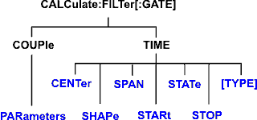

# Calculate:Filter Commands

* * *

Controls the gating function used in time domain measurements. The gated range
is specified with either (start / stop) or (center / span) commands.

These commands are Superseded by the
[CALCulate:MEASure:FILTer](MeasureFILter.md) commands.

Click on a keyword to view the command details.

See Also

  * [Example Programs](../../GPIB_Example_Programs/SCPI_Example_Programs.md)

  * [Learn about Gating](../../../Time/TimeDomain.md#Gating)

  * [Synchronizing the Analyzer and Controller](../../Learning_about_GPIB/Understanding_Command_Synchronization.md)

  * [SCPI Command Tree](../SCPI_Command_Tree.md)

Critical Note: CALCulate commands act on the selected measurement. You can
select one measurement for each channel using
[Calc:Par:MNUM](Parameter.md#MnumSel) or
[Calc:Par:Select](Parameter.md#cps). [Learn
more](../../Learning_about_GPIB/Referring_to_Traces_Measurements_Channels_Windows_Using_SCPI.htm).

* * *

## CALCulate<cnum>:FILTer[:GATE]:COUPle:PARameters <num>

Applicable Models: N522xB, N523xB, N524xB, M937xA, P937xA (Read-Write)
Specifies the time domain gating parameters to be coupled. The settings for
those parameters will be copied from the selected measurement to all other
measurements on the channel.

  * To enable Trace Coupling, use [SENS:COUP:PAR](../Sense/Couple.md#Trans)
  * To specify Transform parameters to couple, use [CALC:TRAN:COUP:PAR](Transform_Calc.md#couple)

Learn more about [Time Domain Trace
Coupling](../../../Time/TimeDomain.htm#Coupling) See Critical Note  
---  
Parameters |   
<cnum> | Channel number of the measurement. There must be a selected measurement on that channel. If unspecified, <cnum> is set to 1.  
<num> | (Numeric) Parameters to couple. To specify more than one parameter, add the numbers. 1 \- Gating Stimulus (Start, Stop, Center, and Span TIME settings.) 2 \- Gating State (ON / OFF) 4 \- Gating Shape (Minimum, Normal, Wide, and Maximum) 8 \- Gating Type (Bandpass and Notch)  
Examples | 'To couple all parameters: CALC:FILT:COUP:PAR 15 'To couple Stimulus and Type:  
calculate2:filter:gate:couple:parameters 9  
Query Syntax | CALCulate<cnum>:FILTer:GATE:COUPle:PARameters?  
Return Type | Numeric  
[Default](JavaScript:hhctrl.TextPopup\(DefSCPI,'Arial,8',10,10,00000000,0xc0ffff\)) | 13 (All parameters except 2 \- Gating State)  
  
* * *

## CALCulate<cnum>:FILTer[:GATE]:TIME:CENTer <num>

Applicable Models: N522xB, N523xB, N524xB, M937xA, P937xA (Read-Write) Sets
the gate filter center time. See Critical Note  
---  
Parameters |   
<cnum> | Channel number of the measurement. There must be a selected measurement on that channel. If unspecified, <cnum> is set to 1.  
<num> | Center time in seconds; Choose any number between:  
± (number of points-1) / frequency span Note: This command will accept MIN or
MAX instead of a numeric parameter. See [SCPI
Syntax](../../Learning_about_GPIB/The_Rules_and_Syntax_of_SCPI_Commands.htm#min)
for more information.  
Examples | CALC:FILT:GATE:TIME:CENT -5 ns  
calculate2:filter:time:center maximum  
Query Syntax | CALCulate<cnum>:FILTer[:GATE]:TIME:CENTer?  
Return Type | Numeric  
[Default](JavaScript:hhctrl.TextPopup\(DefSCPI,'Arial,8',10,10,00000000,0xc0ffff\)) | 0  
  
* * *

## CALCulate<cnum>:FILTer[:GATE]:TIME:SHAPe <char>

Applicable Models: N522xB, N523xB, N524xB, M937xA, P937xA (Read-Write) Sets
the gating filter shape when in time domain. See Critical Note  
---  
Parameters |   
<cnum> | Channel number of the measurement. There must be a selected measurement on that channel. If unspecified, <cnum> is set to 1.  
<char> | Choose from  
MAXimum - the widest gate filter available  
WIDE -  
NORMal -  
MINimum - the narrowest gate filter available  
Examples | CALC:FILT:GATE:TIME:SHAP MAX  
calculate2:filter:time:shape normal  
Query Syntax | CALCulate<cnum>:FILTer[:GATE]:TIME:SHAPe?  
Return Type | Character  
[Default](JavaScript:hhctrl.TextPopup\(DefSCPI,'Arial,8',10,10,00000000,0xc0ffff\)) | NORMal  
  
* * *

## CALCulate<cnum>:FILTer[:GATE]:TIME:SPAN <num>

Applicable Models: N522xB, N523xB, N524xB, M937xA, P937xA (Read-Write) Sets
the gate filter span time. See Critical Note  
---  
Parameters |   
<cnum> | Channel number of the measurement. There must be a selected measurement on that channel. If unspecified, <cnum> is set to 1.  
<num> | Time span in seconds; Choose any number between:  
0 and 2* [(number of points-1) / frequency span] Note: This command will
accept MIN or MAX instead of a numeric parameter. See [SCPI
Syntax](../../Learning_about_GPIB/The_Rules_and_Syntax_of_SCPI_Commands.htm#min)
for more information.  
Examples | CALC:FILT:GATE:TIME:SPAN 5 ns  
calculate2:filter:time:span maximum  
Query Syntax | CALCulate<cnum>:FILTer[:GATE]:TIME:SPAN?  
Return Type | Numeric  
[Default](JavaScript:hhctrl.TextPopup\(DefSCPI,'Arial,8',10,10,00000000,0xc0ffff\)) | 20 ns  
  
* * *

## CALCulate<cnum>:FILTer[:GATE]:TIME:STATe <boolean>

Applicable Models: N522xB, N523xB, N524xB, M937xA, P937xA (Read-Write) Turns
gating state ON or OFF. See Critical Note Note: Sweep type must be set to
LInear Frequency in order to use Transform Gating.  
---  
Parameters |   
<cnum> | Channel number of the measurement. There must be a selected measurement on that channel. If unspecified, <cnum> is set to 1.  
<boolean> | ON (or 1) - turns gating ON.  
OFF (or 0) - turns gating OFF.  
Examples | CALC:FILT:TIME:STAT ON  
calculate2:filter:gate:time:state off  
Query Syntax | CALCulate<cnum>:FILTer[:GATE]:TIME:STATe?  
Return Type | Boolean (1 = ON, 0 = OFF)  
[Default](JavaScript:hhctrl.TextPopup\(DefSCPI,'Arial,8',10,10,00000000,0xc0ffff\)) | OFF  
  
* * *

## CALCulate<cnum>:FILTer[:GATE]:TIME:STARt <num>

Applicable Models: N522xB, N523xB, N524xB, M937xA, P937xA (Read-Write) Sets
the gate filter start time. See Critical Note  
---  
Parameters |   
<cnum> | Channel number of the measurement. There must be a selected measurement on that channel. If unspecified, <cnum> is set to 1.  
<num> | Start time in seconds; any number between:  
± (number of points-1) / frequency span Note: This command will accept MIN or
MAX instead of a numeric parameter. See [SCPI
Syntax](../../Learning_about_GPIB/The_Rules_and_Syntax_of_SCPI_Commands.htm#min)
for more information.  
Examples | CALC:FILT:TIME:STAR 1e-8  
calculate2:filter:gate:time:start minimum  
Query Syntax | CALCulate<cnum>:FILTer[:GATE]:TIME:STARt?  
Return Type | Numeric  
[Default](JavaScript:hhctrl.TextPopup\(DefSCPI,'Arial,8',10,10,00000000,0xc0ffff\)) | 10 ns  
  
* * *

## CALCulate<cnum>:FILTer[:GATE]:TIME:STOP <num>

Applicable Models: N522xB, N523xB, N524xB, M937xA, P937xA (Read-Write) Sets
the gate filter stop time. See Critical Note  
---  
Parameters |   
<cnum> | Channel number of the measurement. There must be a selected measurement on that channel. If unspecified, <cnum> is set to 1.  
<num> | Stop time in seconds; any number between:  
± (number of points-1) / frequency span Note: This command will accept MIN or
MAX instead of a numeric parameter. See [SCPI
Syntax](../../Learning_about_GPIB/The_Rules_and_Syntax_of_SCPI_Commands.htm#min)
for more information.  
Examples | CALC:FILT:TIME:STOP -1 ns  
calculate2:filter:gate:time:stop maximum  
Query Syntax | CALCulate<cnum>:FILTer[:GATE]:TIME:STOP?  
Return Type | Numeric  
[Default](JavaScript:hhctrl.TextPopup\(DefSCPI,'Arial,8',10,10,00000000,0xc0ffff\)) | 10 ns  
  
* * *

## CALCulate<cnum>:FILTer[:GATE]:TIME[:TYPE] <char>

Applicable Models: N522xB, N523xB, N524xB, M937xA, P937xA (Read-Write) Sets
the type of gate filter used. See Critical Note  
---  
Parameters |   
<cnum> | Channel number of the measurement. There must be a selected measurement on that channel. If unspecified, <cnum> is set to 1.  
<char> | Choose from:  
BPASs - Includes (passes) the range between the start and stop times.  
NOTCh \- Excludes (attenuates) the range between the start and stop times.  
Examples | CALC:FILT:TIME BPAS  
calculate2:filter:gate:time:type notch  
Query Syntax | CALCulate<cnum>:FILTer[:GATE]:TIME[:TYPE]?  
Return Type | Character  
[Default](JavaScript:hhctrl.TextPopup\(DefSCPI,'Arial,8',10,10,00000000,0xc0ffff\)) | BPAS  
  
* * *

