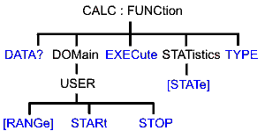

# Calculate:Function Commands

These commands are Superseded by the
[CALCulate:MEASure:FUNCtion](MeasureFUNCtion.md) commands.

* * *

Click on a keyword to view the command details.

See Also

  * [Example Programs](../../GPIB_Example_Programs/SCPI_Example_Programs.md)

  * [Learn about Trace Statistics](../../../S4_Collect/Math_Operations.md#statistics)

  * [Synchronizing the Analyzer and Controller](../../Learning_about_GPIB/Understanding_Command_Synchronization.md)

  * [SCPI Command Tree](../SCPI_Command_Tree.md)

Critical Note: CALCulate commands act on the selected measurement. You can
select one measurement for each channel using
[Calc:Par:MNUM](Parameter.md#MnumSel) or
[Calc:Par:Select](Parameter.md#cps). [Learn
more](../../Learning_about_GPIB/Referring_to_Traces_Measurements_Channels_Windows_Using_SCPI.htm).

* * *

## CALCulate<cnum>:FUNCtion:DATA?

Applicable Models: N522xB, N523xB, N524xB, M937xA, P937xA (Read-only) Returns
the trace statistic data for the selected statistic type for the specified
channel. Select the type of statistic with
[CALC:FUNC:TYPE](Function.md#type). See Critical Note  
---  
Parameters |   
<cnum> | Channel number of the measurement. There must be a selected measurement on that channel. If unspecified, <cnum> is set to 1.  
Return Type | Depends on [FORM:DATA](../Format_SCPI.md#fd)  
Example | 

    CALCulate2:FUNCtion:DATA?  
[Default](JavaScript:hhctrl.TextPopup\(DefSCPI,'Arial,8',10,10,00000000,0xc0ffff\)) | Not applicable  
  
* * *

## CALCulate<cnum>:FUNCtion:DOMain:USER[:RANGe] <range>

Applicable Models: N522xB, N523xB, N524xB, M937xA, P937xA (Read-Write) Sets
the range used to calculate trace statistics. Each channel has 16 user ranges.
The x-axis range is specified with the
[CALC:FUNC:DOM:USER:START](Function.md#start) and [STOP](Function.md#stop)
commands. See Critical Note  
---  
Parameters |   
<cnum> | Channel number of the measurement. There must be a selected measurement on that channel. If unspecified, <cnum> is set to 1.  
<range> | Range number. Choose from: 0 to 16 0 is Full Span of the current x-axis range 1 to 16 are user-specified ranges  
Examples | CALC:FUNC:DOM:USER 4  
calculate2:function:domain:user:range 0  
Query Syntax | CALCulate<cnum>:FUNCtion:DOMain:USER[:RANGe]?  
Return Type | Numeric  
[Default](JavaScript:hhctrl.TextPopup\(DefSCPI,'Arial,8',10,10,00000000,0xc0ffff\)) | 0 \- Full Span  
  
* * *

## CALCulate<cnum>:FUNCtion:DOMain:USER:STARt <range>, <start>

Applicable Models: N522xB, N523xB, N524xB, M937xA, P937xA (Read-Write) Sets
the start of the specified user-domain range. To apply this range, use
[CALC:FUNC:DOM:USER](Function.md#range) To set the stop of the range, use
[CALC:FUNC:DOM:USER:STOP](Function.md#stop). See Critical Note Note: This
command does the same as [CALC:MARK:FUNC:DOM:USER:STAR](Marker.md#ustart)  
---  
Parameters |   
<cnum> | Channel number of the measurement. There must be a selected measurement on that channel. If unspecified, <cnum> is set to 1.  
<range> | Range number that will receive the start value. Choose an integer between 1 and 16  
<start> | Start value of the specified range. Choose a real number between:  
the analyzer's Minimum and Maximum x-axis value.  
Examples | CALC:FUNC:DOM:USER:STAR 1,1e9  
calculate2:function:domain:user:start 2,2e9  
Query Syntax | CALCulate<cnum>:FUNCtion:DOMain:USER:STARt? <range>  
Return Type | Numeric  
[Default](JavaScript:hhctrl.TextPopup\(DefSCPI,'Arial,8',10,10,00000000,0xc0ffff\)) | The analyzer's Minimum x-axis value  
  
* * *

## CALCulate<cnum>:FUNCtion:DOMain:USER:STOP <range>, <stop>

Applicable Models: N522xB, N523xB, N524xB, M937xA, P937xA (Read-Write) Sets
the stop value of the specified user-domain range. To apply this range, use
[CALC:FUNC:DOM:USER](Function.md#range). To set the start of the range, use
[CALC:FUNC:DOM:USER:START](Function.md#start) See Critical Note Note: This
command does the same as [CALC:MARK:FUNC:DOM:USER:STOP](Marker.md#ustop)  
---  
Parameters |   
<cnum> | Channel number of the measurement. There must be a selected measurement on that channel. If unspecified, <cnum> is set to 1.  
<range> | Range number that will receive the stop value. Choose an integer between 1 and 16  
<stop> | Stop value of the specified range. Choose a real number between:  
the analyzer's Minimum and Maximum x-axis value.  
Examples | CALC:FUNC:DOM:USER:STOP 4,5e9  
calculate2:function:domain:user:stop 3,8e9  
Query Syntax | CALCulate<cnum>:FUNCtion:DOMain:USER:STOP? <range>  
Return Type | Numeric  
[Default](JavaScript:hhctrl.TextPopup\(DefSCPI,'Arial,8',10,10,00000000,0xc0ffff\)) | The analyzer's Maximum x-axis value  
  
* * *

## CALCulate<cnum>:FUNCtion:EXECute

Applicable Models: N522xB, N523xB, N524xB, M937xA, P937xA (Write-only) For the
active trace of specified channel, executes the statistical analysis specified
by the [CALC:FUNC:TYPE](Function.md#type) command. See Critical Note  
---  
Parameters |   
<cnum> | Channel number of the measurement. There must be a selected measurement on that channel. If unspecified, <cnum> is set to 1.  
Examples | CALC:FUNC:EXEC  
calculate2:function:execute  
Query Syntax | Not Applicable  
[Default](JavaScript:hhctrl.TextPopup\(DefSCPI,'Arial,8',10,10,00000000,0xc0ffff\)) | Not Applicable  
  
* * *

## CALCulate<cnum>:FUNCtion:STATistics[:STATe] <ON|OFF>

Applicable Models: N522xB, N523xB, N524xB, M937xA, P937xA (Read-Write)
Displays and hides the trace statistics (peak-to-peak, mean, standard
deviation) on the screen. The analyzer will display either measurement
statistics or Filter Bandwidth statistics; not both. See Critical Note  
---  
Parameters |   
<cnum> | Channel number of the measurement. There must be a selected measurement on that channel. If unspecified, <cnum> is set to 1.  
<ON|OFF> | ON - Displays trace statistics OFF - Hides trace statistics  
Examples | CALC:FUNC:STAT ON  
calculate2:function:statistics:state off  
Query Syntax | CALCulate<cnum>:FUNCtion:STATistics[:STATe]?  
Return Type | Boolean (1 = ON, 0 = OFF)  
[Default](JavaScript:hhctrl.TextPopup\(DefSCPI,'Arial,8',10,10,00000000,0xc0ffff\)) | OFF (0)  
  
* * *

## CALCulate<cnum>:FUNCtion:TYPE <char>

Applicable Models: N522xB, N523xB, N524xB, M937xA, P937xA (Read-Write) Sets
statistic TYPE that you can then query using
[CALC:FUNCtion:DATA?](Function.md#data). Note: This command affects only the
selected measurement on the specified channel. See Critical Note  
---  
Parameters |   
<cnum> | Channel number of the measurement. There must be a selected measurement on that channel. If unspecified, <cnum> is set to 1.  
<char> | Choose from: PTPeak \- the difference between the max and min data points on the trace. STDEV \- standard deviation of all data points on the trace MEAN - mean (average) of all data points on the trace MIN \- lowest data point on the trace MAX \- highest data point on the trace  
Examples | CALC:FUNC:TYPE PTP  
calculate2:function:type stdev  
Query Syntax | CALCulate<cnum>:FUNCtion:TYPE?  
Return Type | Character  
[Default](JavaScript:hhctrl.TextPopup\(DefSCPI,'Arial,8',10,10,00000000,0xc0ffff\)) | PTPeak  
  
* * *

