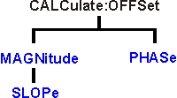

# Calculate:Offset Commands

* * *

Allows the data trace magnitude and phase to be offset.

These commands are Superseded by the
[CALCulate:MEASure:OFFSet](MeasureOFFSet.md) commands.

Click on a keyword to view the command details.

See Also

  * [Example Programs](../../GPIB_Example_Programs/SCPI_Example_Programs.md)

  * [Learn about Magnitude Offset](../../../S1_Settings/Scale.md#Magnitude)

  * [Learn about Phase Offset](../../../S2_Opt/Phase_Accy.md#PhaseDiag)

  * [Synchronizing the Analyzer and Controller](../../Learning_about_GPIB/Understanding_Command_Synchronization.md)

  * [SCPI Command Tree](../SCPI_Command_Tree.md)

Critical Note: CALCulate commands act on the selected measurement. You can
select one measurement for each channel using
[Calc:Par:MNUM](Parameter.md#MnumSel) or
[Calc:Par:Select](Parameter.md#cps). [Learn
more](../../Learning_about_GPIB/Referring_to_Traces_Measurements_Channels_Windows_Using_SCPI.htm).

* * *

## CALCulate<cnum>:OFFSet:MAGNitude <num> Superseded

Applicable Models: All (Read-Write) Offsets the data trace magnitude by the
specified value. To offset the data trace magnitude to a slope value that
changes with frequency, use CALC:OFFS:MAGN:SLOP See Critical Note  
---  
Parameters |   
<cnum> | Channel number of the measurement. There must be a selected measurement on that channel. If unspecified, <cnum> is set to 1.  
<num> | Offset value in dB.  
Examples | CALC:OFFS:MAGN 4  
calculate1:offset:magnitude -2  
Query Syntax | CALCulate<cnum>:OFFSet:MAGNitude?  
Return Type | Numeric  
[Default](JavaScript:hhctrl.TextPopup\(DefSCPI,'Arial,8',10,10,00000000,0xc0ffff\)) | 0  
  
* * *

## CALCulate<cnum>:OFFSet:MAGNitude:SLOPe <num> Superseded

Applicable Models: All (Read-Write) Offsets the data trace magnitude to a
value that changes linearly with frequency. The offset slope begins at 0 Hz.
See Critical Note  
---  
Parameters |   
<cnum> | Channel number of the measurement. There must be a selected measurement on that channel. If unspecified, <cnum> is set to 1.  
<num> | Offset slope value in dB/ 1GHz.  
Examples | CALC:OFFS:MAGN:SLOP 1 'Offset slope set to 1dB/GHz  
calculate1:offset:magnitude:slope -2 'Offset slope set to -2dB/GHz  
Query Syntax | CALCulate<cnum>:OFFSet:MAGNitude:SLOPe?  
Return Type | Numeric  
[Default](JavaScript:hhctrl.TextPopup\(DefSCPI,'Arial,8',10,10,00000000,0xc0ffff\)) | 0  
  
* * *

## CALCulate<cnum>:OFFSet:PHASe <num>[<char>] Superseded

Applicable Models: All (Read-Write) Sets the phase offset for the selected
measurement. See Critical Note  
---  
Parameters |   
<cnum> | Channel number of the measurement. There must be a selected measurement on that channel. If unspecified, <cnum> is set to 1.  
<num> | Offset phase value. Choose any number between:  
-360 and 360  
<char> | Units for phase. OPTIONAL. Choose either:  
DEG \- Degrees (default)  
RAD \- Radians  
Examples | CALC:OFFS:PHAS 10  
calculate:offset:phase 20rad  
Query Syntax | CALCulate:OFFSet:PHASe?  
Return Type | Numeric, returned value always in degrees  
[Default](JavaScript:hhctrl.TextPopup\(DefSCPI,'Arial,8',10,10,00000000,0xc0ffff\)) | 0 degrees  
  
* * *

