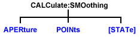

# Calculate:Smoothing Commands

* * *

Controls point-to-point smoothing. Smoothing is a noise reduction technique
that averages adjacent data points in a measurement trace. Choose the amount
of smoothing by specifying either the number of points or the aperture.
Smoothing is not the same as CALC:AVERage which averages each data point over
a number of sweeps.

These commands are Superseded by the
[CALCulate:MEASure:SMOothing](MeasureSMOothing.md) commands.

Click on a keyword to view the command details.

See Also

  * [Example Programs](../../GPIB_Example_Programs/SCPI_Example_Programs.md)

  * [Learn about Smoothing](../../../S2_Opt/Trce_Noise.md#Smoothing)

  * [Synchronizing the Analyzer and Controller](../../Learning_about_GPIB/Understanding_Command_Synchronization.md)

  * [SCPI Command Tree](../SCPI_Command_Tree.md)

Critical Note: CALCulate commands act on the selected measurement. You can
select one measurement for each channel using
[Calc:Par:MNUM](Parameter.md#MnumSel) or
[Calc:Par:Select](Parameter.md#cps). [Learn
more](../../Learning_about_GPIB/Referring_to_Traces_Measurements_Channels_Windows_Using_SCPI.htm).

* * *

## CALCulate<cnum>:SMOothing:APERture <num>

Applicable Models: N522xB, N523xB, N524xB, M937xA, P937xA (Read-Write) Sets
the amount of smoothing as a percentage of the number of data points in the
channel. See Critical Note  
---  
Parameters |   
<cnum> | Channel number of the measurement. There must be a selected measurement on that channel. If unspecified, <cnum> is set to 1.  
<num> | Percentage value. Choose any number between:  
1 and 25  
Examples | CALC:SMO:APER 2 calculate2:smoothing:aperture 20.7  
Query Syntax | CALCulate<cnum>:SMOothing:APERture?  
Return Type | Numeric  
[Default](JavaScript:hhctrl.TextPopup\(DefSCPI,'Arial,8',10,10,00000000,0xc0ffff\)) | 1.5  
  
* * *

## CALCulate<cnum>:SMOothing:POINts <num>

Applicable Models: N522xB, N523xB, N524xB, M937xA, P937xA (Read-Write) Sets
the number of adjacent data points to average. See Critical Note  
---  
Parameters |   
<cnum> | Channel number of the measurement. There must be a selected measurement on that channel. If unspecified, <cnum> is set to 1.  
<num> | Number of points from 1 point to maximum of 25% of data points in the channel. For example: if number of points in a data trace = 401, the maximum value for points = 100. The points value is always rounded to the closest odd number.  
Examples | CALC:SMO:POIN 50 calculate2:smoothing:points 21  
Query Syntax | CALCulate<cnum>:SMOothing:POINts?  
Return Type | Numeric  
[Default](JavaScript:hhctrl.TextPopup\(DefSCPI,'Arial,8',10,10,00000000,0xc0ffff\)) | 3  
  
* * *

## CALCulate<cnum>:SMOothing[:STATe] <ON | OFF>

Applicable Models: N522xB, N523xB, N524xB, M937xA, P937xA (Read-Write) Turns
data smoothing ON or OFF. See Critical Note  
---  
Parameters |   
<cnum> | Channel number of the measurement. There must be a selected measurement on that channel. If unspecified, <cnum> is set to 1.  
<ON | OFF> | ON (or 1) - turns smoothing ON.  
OFF (or 0) - turns smoothing OFF.  
Examples | CALC:SMO ON calculate2:smoothing:state off  
Query Syntax | CALCulate<cnum>:SMOothing[:STATe]?  
Return Type | Boolean (1 = ON, 0 = OFF)  
[Default](JavaScript:hhctrl.TextPopup\(DefSCPI,'Arial,8',10,10,00000000,0xc0ffff\)) | OFF

