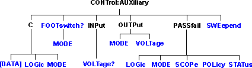

# Control Auxiliary Commands

* * *

Specifies the settings to remotely control the Auxilliary IO connector.

Note: The PNA-X, N522xA and N523xA models do NOT have this connector. However,
the following commands are used to control ADC voltages on the [Power I/O
connector](../../Rear_Panel/XPwrIO.htm):
[CONT:AUX:OUTP:VOLT](ControlAux.md#output) and
[CONT:AUX:INPut:VOLT?](ControlAux.md#input). Sending other Control:AUX
commands may result in unusual behavior.

Click on a blue keyword to view the command details.

See Also

  * [Example Programs](../GPIB_Example_Programs/SCPI_Example_Programs.md)

  * [Synchronizing the Analyzer and Controller](../Learning_about_GPIB/Understanding_Command_Synchronization.md)

  * [SCPI Command Tree](SCPI_Command_Tree.md)

  * See a pinout and detailed description of the [Power I/O Connector](../../Rear_Panel/XPwrIO.md)

* * *

## CONTrol:AUXiliary:C[:DATA] <num>

Applicable Models: N522xB, N523xB, N524xB (Read-Write) Reads and writes a
4-bit value to Port C on the Aux I/O connector. This port is connected
internally to the Handler IO connector. Therefore this command will also
affect the state of Port C on the Handler IO  
---  
Parameters |   
<num> | Data value. Choose any number 0 to 15.  
Examples | CONTrol:AUXiliary:C:DATA 15 For Positive Logic Port C lines C0, C1, C2, C3 go High or if in Negative Logic they go Low. CONTrol:AUXiliary:C:DATA? A returned value of 15 when in Positive Logic indicates Port C lines C0, C1, C2, C3 are High, or if in Negative Logic they are Low.  
Query Syntax | CONTrol:AUXiliary:C:DATA?  
Return Type | Numeric  
[Default](JavaScript:hhctrl.TextPopup\(DefSCPI,'Arial,8',10,10,00000000,0xc0ffff\)) | 0  
  
* * *

## CONTrol:AUXiliary:C:LOGic <char>

Applicable Models: N522xB, N523xB, N524xB (Read-Write) Reads and writes the
logic mode of Port C on the AUX IO. This port is connected to Port C of the
Handler IO connector. Therefore, it will have the same logic setting.  
---  
Parameters |   
<char> | Logic of Port C. Choose from: POSitive \- when a value of one is written the associate line goes High. NEGative \- when a value of one is written the associate line goes Low. When Port C is in Output/Write mode, a change in logic causes the output lines to change state immediately. For example, Low levels change to High levels. When Port C is in Input/Read mode, a change in logic does NOT cause the lines to change, but data read from Port C will reflect the change in logic.  
Examples | CONT:AUX:C:LOG POS 'Positive logic is applied to Port C data.  
Query Syntax | CONTrol:AUXiliary:C:LOGic?  
Return Type | Character  
[Default](JavaScript:hhctrl.TextPopup\(DefSCPI,'Arial,8',10,10,00000000,0xc0ffff\)) | NEGative  
  
* * *

## CONTrol:AUXiliary:C:MODE <char>

Applicable Models: N522xB, N523xB, N524xB (Read-Write) Sets Port C to read or
write mode. This port is connected to Port C of the Handler IO connector.
Therefore, it will have the same mode setting. NOTE: When Port C is set to
INPut mode, data writes are NOT applied to the lines. MODE must be set to
OUTPut mode before writing.  
---  
Parameters |   
<char> | INPut \- set the port for reading OUTPut \- set the port for writing  
Examples | CONT:AUX:C:MOD INP 'set Port C to Input Mode for reading. CONTrol:AUXiliary:C:MODE? 'queries the input/output mode that the port set to.  
Query Syntax | CONTrol:AUXiliary:C:MODE?  
Return Type | Character  
[Default](JavaScript:hhctrl.TextPopup\(DefSCPI,'Arial,8',10,10,00000000,0xc0ffff\)) | INPut  
  
* * *

## CONTrol:AUXiliary:FOOTswitch[:STATe]?

Applicable Models: N522xB, N523xB, N524xB (Read only) Reads the Auxiliary
connector Footswitch Input.  
---  
Examples | CONT:AUX:FOOT?  
control:auxiliary:footswitch:state?  
Return Type | Boolean ON (or 1) = pressed OFF (or 0) = released  
[Default](JavaScript:hhctrl.TextPopup\(DefSCPI,'Arial,8',10,10,00000000,0xc0ffff\)) | OFF (0) - Released  
  
* * *

## CONTrol:AUXiliary:FOOTswitch:MODe <char>

Applicable Models: N522xB, N523xB, N524xB (Read-Write) This command sets the
mode of the "FootSwitch In" line on the Auxiliary IO. These mode settings
determine what occurs when the footswitch is pressed. Examine your results
carefully when using these command modes.  
---  
Parameters |   
<char> | IGNore \- While in this mode any Footswitch presses are ignored. SWEep \- While in this mode a Footswitch press will trigger the sweep.  NOTE: The instrument must be in Manual Trigger Mode. RECall \- While in this mode a Footswitch press will recall an instrument state. When more than one state is available each footswitch press recalls the next state, then starts over from the beginning.  MACRo \- While in this mode a Footswitch press will load and run a macro. When more than one macro are available each successive footswitch press loads and runs the next macro, then starts over from the beginning.   
Examples | CONT:AUX:FOOT:MODe MACRo This sets the footswitch mode to MACRo causing a macro to be loaded and run with a footswitch press. CONTrol:AUXiliary:FOOTswitch:MODe? This query returns the footswitch mode setting.  
Query Syntax | CONTrol:AUXiliary:FOOTswitch:MODE?  
Return Type | Character  
[Default](JavaScript:hhctrl.TextPopup\(DefSCPI,'Arial,8',10,10,00000000,0xc0ffff\)) | IGNore  
  
* * *

## CONTrol:AUXiliary:INPut<n>:VOLTage?

Applicable Models: N522xB, N523xB, N524xB (Read-Only) Reads voltage on the
[Power I/O connector](../../Rear_Panel/XPwrIO.md). From the Control:Aux
commands, ONLY this and [CONT:AUX:OUTP:VOLT](ControlAux.md#output) can be
used on the PNA-X.  
---  
Parameters |   
<n> | Port number. If unspecified, value is set to 1. Choose from

  * 1 Reads voltage on the AUX I/O connector (pin 14) or on the Power I/O connector Analog In 1 port (pin 7).
  * 2 Reads voltage on the Power I/O connector Analog In 2 port (pin 8).
  * 3 Reads voltage on Power I/O connector GndSens (pin 6) PNA-X only.

  
Examples | CONT:AUX:INPut2:VOLT?  
control:auxiliary:input:voltage?  
Return Type | Numeric  
[Default](JavaScript:hhctrl.TextPopup\(DefSCPI,'Arial,8',10,10,00000000,0xc0ffff\)) | Not Applicable  
  
* * *

## CONTrol:AUXiliary:OUTPut<n>:MODe <char>

Applicable Models: N522xB, N523xB, N524xB (Read-Write) This command sets the
mode of the selected "Analog Out" line on the [Power I/O
connector](../../Rear_Panel/XPwrIO.htm). The modes give the user the option to
have the requested voltage applied immediately or not until the sweep is done.  
---  
Parameters |   
<n> | Port number. If unspecified, value is set to 1.  
<char> | WAIT \- While in this mode any voltage changes sent to the selected analog out will only get applied to the output between sweeps. NOWait \- While in this mode any voltage changes sent to the selected analog out will occur right away without waiting until the end of a sweep.  
Examples | CONT:AUX:OUTP1:MOD WAIT This sets the mode so that voltages sent to "Analog Out 1" are only applied at the end of a sweep. CONT:AUX:OUTP2:MOD? This query returns the current mode for "Analog Out 2".  
Query Syntax | CONTrol:AUXiliary:OUTPut2:MODe? 'Reads the output mode  
Return Type | Character  
[Default](JavaScript:hhctrl.TextPopup\(DefSCPI,'Arial,8',10,10,00000000,0xc0ffff\)) | WAIT  
  
* * *

## CONTrol:AUXiliary:OUTPut<out>:VOLTage <num>

Applicable Models: N522xB, N523xB, N524xB, E5080B, E5081A (Read-Write) Sets
and reads voltage on the [Power I/O connector](../../Rear_Panel/XPwrIO.md)
AnalogOut1|2 (PNA), AUX Out 1|2 (E5080B, E5081A). (PNA) From the Control:Aux
commands, ONLY this and [CONT:AUX:INPut:VOLT?](ControlAux.md#input) can be
used. Note: The 9-pin PWR I/O (Power I/O) D connector on the rear-panel
replaces much of the functionality of the AUX I/O connector on older VNA
models. The Power I/O voltages can be set using the following methods:  
  
\- CONTrol:AUXiliary:OUTPut:VOLTage or [put_OutputVoltage
Method](../COM_Reference/Methods/put_OutputVoltage_Method.htm) (no GUI
equivalent, global scoped, and settings not saved as part of the instrument
state)  
\- [SOURce:DC:START](SourceDC.md#start) and
[SOURce:DC:STOP](SourceDC.md#stop) ([DC Source
dialog](../../S1_Settings/DC_Control.htm#DCControl) is the GUI equivalent,
channel scoped, and settings saved as part of the instrument state)  
\- [Interface Control dialog](../../System/Interface_Control.md#Aux) (no
remote equivalent, channel scoped, and settings saved as part of the
instrument state)  
  
To avoid unexpected behavior, choose one method only to set the Power I/O
voltages.  
---  
Parameters |   
<out> | DAC output number. Choose from: 1 \- PNA: Output 1 (Aux I/O pin 3) and (Power I/O pin 3), E5080B AUX Out 1 2 \- PNA: Output 2 (Aux I/O pin 2) and (Power I/O pin 4), E5080B AUX Out 2  
<num> | Output Voltage. Choose a voltage value between -10 and +10 volts  
Examples | CONT:AUX:OUTP1:VOLT 5  
control:auxiliary:output2:voltage 5  
Query Syntax | CONTrol:AUXiliary:OUTPut<out>:VOLTage? 'Reads the output DAC voltage  
Return Type | Numeric  
[Default](JavaScript:hhctrl.TextPopup\(DefSCPI,'Arial,8',10,10,00000000,0xc0ffff\)) | 0  
  
* * *

## CONTrol:AUXiliary:PASSfail:LOGic <char>

Applicable Models: N522xB, N523xB, N524xB (Read-Write) Sets the logic of the
PassFail line (pin 12) on the Material Handler IO (pin 33).  
---  
Parameters |   
<char> | Choose from:  
POSitive \- Causes the PassFail line to have positive logic (high = pass, low
= fail). NEGative \- Causes the PassFail line to have negative logic (high =
fail, low = pass).  
Examples | CONT:AUX:PASS:LOG POS  
control:auxiliary:passfail:logic negative  
Query Syntax | CONTrol:AUXiliary:PASSfail:LOGic?  
Return Type | Character  
[Default](JavaScript:hhctrl.TextPopup\(DefSCPI,'Arial,8',10,10,00000000,0xc0ffff\)) | POSitive  
  
* * *

## CONTrol:AUXiliary:PASSfail:MODe <char>

Applicable Models: N522xB, N523xB, N524xB (Read-Write) Sets and reads the
default logical pass/fail state. This is the state the pass/fail line stays in
until a failure occurs (if the mode is NOWait), or until an end-of-sweep
condition occurs (if the modes is PASS or FAIL). The end-of-sweep condition is
determined by the [CONTrol:AUXiliary:PASSfail:SCOPe](ControlAux.md#scope)
command.  
---  
Parameters |   
<char> | Choose from:  
PASS \- the line stays in PASS state until the end-of-sweep condition occurs,
at which time the pass/fail line is set, and the pass/fail strobe (line 36) is
activated. FAIL \- the line stays in FAIL state until the end-of-sweep
condition occurs, at which time the pass/fail line is set, and the pass/fail
strobe (line 36) is activated. NOWait \- the pass/fail line is set, and the
pass/fail strobe (line 36) is activated as soon as a failure condition occurs.  
Examples | CONT:AUX:PASS:MODE NOW  
control:auxiliary:passfail:mode fail  
Query Syntax | CONTrol:AUXiliary:PASSfail:MODE?  
Return Type | Character  
[Default](JavaScript:hhctrl.TextPopup\(DefSCPI,'Arial,8',10,10,00000000,0xc0ffff\)) | NOWait  
  
* * *

## CONTrol:AUXiliary:PASSfail:SCOPe <char>

Applicable Models: N522xB, N523xB, N524xB (Read-Write) Sets and reads the
scope of pass/fail testing. The pass/fail line can report the status of all
measurements on each channel, or all measurements on all channels. This
command selects which option to use.  
---  
Parameters |   
<char> | Choose from: CHANnel \- A pass/fail result is computed and written to the output pins at the end of all sweeps on a channel. GLOBal \- A pass/fail result is computed and written to the output pins at the end of all sweeps on a channel. If the pass/fail mode is NOWait (as set by [CONTrol:AUXiliary:PASSfail:MODe](ControlAux.md#mode)), the status and strobe pins are written immediately. Otherwise the pins are written as indicated above. Regardless of the mode value, the pass/fail line is returned to its default state (as set by the MODE command) at the end of channel or group of channels.  
Examples | CONT:AUX:PASS:SCOP CHAN  
control:auxiliary:passfail:scope sweep  
Query Syntax | CONTrol:AUXiliary:PASSfail:SCOPe?  
Return Type | Character  
[Default](JavaScript:hhctrl.TextPopup\(DefSCPI,'Arial,8',10,10,00000000,0xc0ffff\)) | GLOBal  
  
* * *

## CONTrol:AUXiliary:PASSfail:POLicy <char>

Applicable Models: N522xB, N523xB, N524xB (Read-Write) Sets the policy used to
determine how global pass/fail is computed.  
---  
Parameters |   
<char> | Name of the policy to use. Choose from: ALLTests \- [Pass/Fail Status](ControlHandler.md#status) returns PASS if all tests on all measurements pass. ALLMeas \- [Pass/Fail Status](ControlHandler.md#status) returns PASS if all measurements have associated tests, and all tests pass. FAIL is returned if even one measurement has no associated limit test. Only those measurements which are not in HOLD mode contribute to the pass/fail result.  
Examples | CONT:AUX:PASS:POL ALLM  
control:auxiliary:passfail:policy alltests  
Query Syntax | CONTrol:AUXiliary:PASSfail:POLicy?  
Return Type | Character  
[Default](JavaScript:hhctrl.TextPopup\(DefSCPI,'Arial,8',10,10,00000000,0xc0ffff\)) | ALLTests  
  
* * *

## CONTrol:AUXiliary:PASSfail:STATus?

Applicable Models: N522xB, N523xB, N524xB (Read-Only) Returns the most recent
pass/fail status value. Use this command as follows:

  1. Set the VNA [trigger scope](Trigger_SCPI.md#tssc) to ALL
  2. Set the VNA [trigger source](Trigger_SCPI.md#tss) to MANUAL or EXTERNAL.
  3. Trigger the VNA.
  4. Use the [*OPC?](Common_Commands.md#opcq) command to determine when the sweep is complete.
  5. Use the CONT:AUX:PASS:STAT? query to obtain the global pass/fail result.

  
---  
Return Type | Character - One of the following is returned: PASS \- all measurements not in HOLD mode have been swept, and all associated limit tests have passed. FAIL \- all measurements not in HOLD mode have been swept, and one or more limit tests failed according to the specified Pass/Fail policy. NONE \- status cannot be determined because measurements are in progress.  
[Default](JavaScript:hhctrl.TextPopup\(DefSCPI,'Arial,8',10,10,00000000,0xc0ffff\)) | Not Applicable  
  
* * *

## CONTrol:AUXiliary:SWEepend <char>

Applicable Models: N522xB, N523xB, N524xB (Read-Write) Specifies the event
that will cause the Sweep End line pin 11) to go to a low (false) state of the
Material Handler IO. The line will return to a high state after the
appropriate calculations are complete.  
---  
Parameters |   
<char> | Choose from:  
SWEep - the line goes low when each sweep is complete. CHANnel \- The line
goes low when all of the sweeps for each channel is complete. GLOBal \- The
line goes low when all the sweeps for all channels are complete.  
Examples | CONT:AUX:SWE SWE  
control:auxiliary:sweepend channel  
Query Syntax | CONTrol:AUXiliary:SWEepend?  
Return Type | Character  
[Default](JavaScript:hhctrl.TextPopup\(DefSCPI,'Arial,8',10,10,00000000,0xc0ffff\)) | SWEep  
  
* * *

