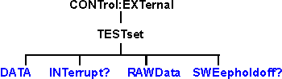

# Control External Test Set Commands

* * *

Specifies the settings to remotely control the External Test Set IO connector.

Click on a blue keyword to view the command details.

See Also

  * [Example Programs](../GPIB_Example_Programs/SCPI_Example_Programs.md)

  * [Synchronizing the Analyzer and Controller](../Learning_about_GPIB/Understanding_Command_Synchronization.md)

  * [SCPI Command Tree](SCPI_Command_Tree.md)

  * See a pinout and detailed description of the [External Test Set IO connector](../TestSetIO_Connector.md)

* * *

## CONTrol:EXTernal:TESTset:DATa <addr>,<data>

Applicable Models: N522xB, N523xB, N524xB (Read-Write) Reads and writes 13
bits of data to the specified address using the [AD0 through
AD12](../TestSetIO_Connector.htm#AD0-AD12) lines of the external test set
connector. The instrument generates the appropriate timing signals (strobes
the address, then the data) to control an external test set.  
---  
Parameters |   
<addr> |  Decimal equivalent of the 13 bit binary address.  
<data> |  Decimal equivalent of the 13 bit binary data  
Examples |  CONT:EXT:TEST:DATA 12,3  
CONTrol:external:testset:data 12,3  
Query Syntax |  CONTrol:EXTernal:TESTset:DATA? <addr> 'Reads the decimal equivalent of the binary data from the specified address  
Return Type |  Numeric  
[Default](JavaScript:hhctrl.TextPopup\(DefSCPI,'Arial,8',10,10,00000000,0xc0ffff\)) |  Not Applicable  
  
* * *

## CONTrol:EXTernal:TESTset:INTerrupt?

Applicable Models: N522xB, N523xB, N524xB (Read-Only) Reads the boolean state
of the Interrupt In line ([pin 13](../TestSetIO_Connector.md#Interrupt)) on
the external test set connector.  
---  
Examples |  CONT:EXT:TEST:INT?  
control:external:testset:interrupt?  
Return Type |  Boolean False (0) - the line is being held at a TTL High. True (1) - the line is being held at a TTL Low.  
[Default](JavaScript:hhctrl.TextPopup\(DefSCPI,'Arial,8',10,10,00000000,0xc0ffff\)) |  Not Applicable  
  
* * *

## CONTrol:EXTernal:TESTset:RAWData <data>

Applicable Models: N522xB, N523xB, N524xB

(Read-Write) Reads and writes 16 bits of data through the [AD0 through
AD12](../TestSetIO_Connector.htm#AD0-AD12) and three timing lines of the
external test set connector. Does NOT generate appropriate timing signals.

Use of this command requires detailed knowledge of all 16 bits. Refer to the
Data format table.

Note: During a WRITE, Bit 13 must always be low. Otherwise Bit 0-12 will
tristate

### Parameters

<data> |  Decimal equivalent of the binary data. Format of data WRITTEN with RAWData:  
---|---  
|  Pin |  Bit |  Signal name  
---|---|---|---  
|  22 |  0 |  AD0*  
|  23 |  1 |  AD1*  
|  11 |  2 |  AD2*  
|  10 |  3 |  AD3*  
|  9 |  4 |  AD4*  
|  21 |  5 |  AD5*  
|  20 |  6 |  AD6*  
|  19 |  7 |  AD7*  
|  6 |  8 |  AD8*  
|  5 |  9 |  AD9*  
|  4 |  10 |  AD10*  
|  17 |  11 |  AD11*  
|  3 |  12 |  AD12*  
|  25 |  13 |  RLW  
|  24 |  14 |  LDS  
|  8 |  15 |  LAS  
  
* This Output will float if RLW (bit-13) is set high

Examples |  CONT:EXT:TEST:RAWD 8001  
CONTrol:external:testset:rawdata 1234  
---|---  
Query Syntax |  CONTrol:EXTernal:TESTset:RAWData?  
Return Format |  Format of data READ with RAWData?  
|  Pin |  Bit |  Signal name  
---|---|---|---  
|  22 |  0 |  AD0*  
|  23 |  1 |  AD1*  
|  11 |  2 |  AD2*  
|  10 |  3 |  AD3*  
|  9 |  4 |  AD4*  
|  21 |  5 |  AD5*  
|  20 |  6 |  AD6*  
|  19 |  7 |  AD7*  
|  6 |  8 |  AD8*  
|  5 |  9 |  AD9*  
|  4 |  10 |  AD10*  
|  17 |  11 |  AD11*  
|  3 |  12 |  AD12*  
|  2 |  13 |  Sweep Holdoff In  
|  13 |  14 |  Interrupt In (inverted internally)  
|  na |  15 |  Always Zero, grounded internally  
|  *These lines are dependent on the state of RLW (pin25).  
Writing a 0(low) to RLW will set lines AD0-AD12 to write mode.  
Writing a 1(high) to RLW will set lines AD0-AD12 to read mode.  
---|---  
[Default](JavaScript:hhctrl.TextPopup\(DefSCPI,'Arial,8',10,10,00000000,0xc0ffff\)) |  Not Applicable  
  
* * *

## CONTrol:EXTernal:TESTset:SWEepholdoff?

Applicable Models: N522xB, N523xB, N524xB (Read-Only) Reads the Sweep Holdoff
Iine ([pin 2](../TestSetIO_Connector.md#Sweep)) on the external test set
connector.  
---  
Examples |  CONT:EXT:TEST:SWE?  
control:external:testset:sweepholdoff?  
Return Type |  Boolean TRUE (1) \- the pin is set to a TTL High FALSE (0) \- the pin is set to TTL Low  
[Default](JavaScript:hhctrl.TextPopup\(DefSCPI,'Arial,8',10,10,00000000,0xc0ffff\)) |  Not Applicable  
  
* * *

