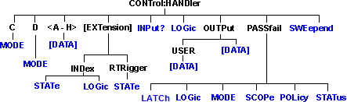

# Control Handler Commands

* * *

Specifies the settings to remotely control the Material Handler IO connector.

Click on a blue keyword to view the command details.

See Also

  * [Example Programs](../GPIB_Example_Programs/SCPI_Example_Programs.md)

  * [Synchronizing the Analyzer and Controller](../Learning_about_GPIB/Understanding_Command_Synchronization.md)

  * [SCPI Command Tree](SCPI_Command_Tree.md)

  * Learn about the [Material Handler IO port](../HandlerIO_Connector.md).

* * *

## CONTrol:HANDler:C:MODE <char>

Applicable Models: N522xB, N523xB, N524xB, E5080A/B, E5081A, All PXIe VNAs
with M9341A/B (Read-Write) Sets and reads the direction of data flow for Port
C.  
---  
Parameters |   
<char> |  Direction of flow. Choose from: INPut - Port C is used to input data OUTPut - Port C is used to output data  
Examples |  CONT:HAND:C:MODE INP  
control:handler:c:mode output  
Query Syntax |  CONTrol:HANDler:C:MODE?  
Return Type |  Character  
[ Default ](JavaScript:hhctrl.TextPopup\(DefSCPI,'Arial,8',10,10,00000000,0xc0ffff\)) |  INPut  
  
* * *

## CONTrol:HANDler:D:MODE <char>

Applicable Models: N522xB, N523xB, N524xB, E5080A/B, E5081A, All PXIe VNAs
with M9341A/B (Read-Write) Sets and reads the direction of data flow for Port
D.  
---  
Parameters |   
<char> |  Direction of flow. Choose from: INPut - Port D is used to input data OUTPut - Port D is used to output data  
Examples |  CONT:HAND:D:MODE INP  
control:handler:d:mode output  
Query Syntax |  CONTrol:HANDler:D:MODE?  
Return Type |  Character  
[ Default ](JavaScript:hhctrl.TextPopup\(DefSCPI,'Arial,8',10,10,00000000,0xc0ffff\)) |  Input  
  
* * *

## CONTrol:HANDler:<port>[:DATa] <num>

Applicable Models: N522xB, N523xB, N524xB, E5080A/B, E5081A, All PXIe VNAs
with M9341A/B (Read-Write) Writes and reads data on the specified port.  
---  
Parameters |   
<port> |  Port identifier to set bits for. Choose from: A,B,C,D,E,F,G,H  
<num> |  The number of the data bits to set. Refer to the following table for the maximum number for each port. The minimum number for each port is 0.  
|  Port |  Max allowable <num> |  MSB...........................................LSB  
23...................................................0 |   
---|---|---|---|---  
|  A |  255 |  A7...A0 |  Write-only  
|  B |  255 |  B7...B0 |  Write-only  
|  C |  15 |  C3...C0 |  Read-Write  
|  D |  15 |  D3...D0 |  Read-Write  
|  E |  255 |  D3...D0 + C3...C0 |  Read-Write  
|  F |  65535 |  B7...B0 + A7...A0 |  Write-only  
|  G |  1048575 |  C3...C0 + B7...B0 + A7...A0 |  Write-only  
|  H |  16777215 |  D3...D0 + C3...C0 + B7...B0 + A7...A0 |  Write-only  
|  Note: When writing to port G, port C must be set to output mode  
When writing to port H, both port C and port D must be set to output mode. Use
[CONT:HAND:C:MODE OUTP](ControlHandler.md#cMode) and [CONT:HAND:D:MODE
OUTP](ControlHandler.htm#dMode)  
---|---  
Examples |  CONT:HAND:A 254  
control:handler:c:data 12  
Query Syntax |  CONTrol:HANDler:<port>:DATA?  
Return Type |  Numeric  
[ Default ](JavaScript:hhctrl.TextPopup\(DefSCPI,'Arial,8',10,10,00000000,0xc0ffff\)) |  Not Applicable  
  
* * *

## CONTrol:HANDler[:EXTension]:INDex:LOGic <char>

Applicable Models: E5080B, E5081A, All PXIe VNAs with M9341A/B, M937xA,
P937xA, M980xA/P50xxA with I/O Adapter (Read-Write) Sets the logic of the
index line. There is no soft front-panel element for this feature.  (M937xA)
Index is on "Trig Out" port on the last PXIe module  
---  
Parameters |   
<charl> |  Choose from: POSitive \- Causes the Index line to have positive logic (Low signal indicates that the measurement is complete) NEGative \- Causes the Index lines to have negative logic (High signal indicates that the measurement is complete).  
Examples |  CONT:HAND:IND:LOG NEG  
control:handler:extension:index:logic negaive  
Query Syntax |  CONTrol:HANDler[:EXTension]:INDex:LOGIC?  
Return Type |  Character  
[ Default ](JavaScript:hhctrl.TextPopup\(DefSCPI,'Arial,8',10,10,00000000,0xc0ffff\)) |  POSitive  
  
* * *

## CONTrol:HANDler[:EXTension]:INDex[:STATe] <bool>

Applicable Models: N522xB, N523xB, N524xB, E5080A/B, E5081A, All PXIe VNAs
with M9341A/B (Read-Write) Determines the control of [Material Handler
connector](../HandlerIO_Connector.htm) Pin 20. A "Mnemonic not implemented"
error is returned if the VNA does NOT have this capability.  
---  
Parameters |   
<bool> |  Choose from: ON (1) - Pin 20 is controlled by the Index signal OFF (0) - Pin 20 is controlled by Output Port B6  
Examples |  CONT:HAND:IND 1  
control:handler:extension:index:state off  
Query Syntax |  CONTrol:HANDler[:EXTension]:INDex[:STATe]?  
Return Type |  Boolean  
[ Default ](JavaScript:hhctrl.TextPopup\(DefSCPI,'Arial,8',10,10,00000000,0xc0ffff\)) |  OFF  
  
* * *

## CONTrol:HANDler[:EXTension]:RTRigger[:STATe] <bool>

Applicable Models: N522xB, N523xB, N524xB, E5080A/B, E5081A, All PXIe VNAs
with M9341A/B (Read-Write) Determines the control of [Material Handler
connector](../HandlerIO_Connector.htm) Pin 21. A "Mnemonic not implemented"
error is returned if the VNA does NOT have this capability.  
---  
Parameters |   
<bool> |  Choose from: ON (1) - Pin 21 is controlled by the Ready for Trigger signal OFF (0) - Pin 21 is controlled by Output Port B7  
Examples |  CONT:HAND:RTR 1  
control:handler:extension:rtrigger:state off  
Query Syntax |  CONTrol:HANDler[:EXTension]:RTRigger[:STATe]?  
Return Type |  Boolean  
[ Default ](JavaScript:hhctrl.TextPopup\(DefSCPI,'Arial,8',10,10,00000000,0xc0ffff\)) |  OFF  
  
* * *

## CONTrol:HANDler:INPut?

Applicable Models: N522xB, N523xB, N524xB, E5080A/B, E5081A, M9485A, All PXIe
VNAs with M9341A/B (Read-Only) Reads a hardware latch that captures high to
low transitions on Input1 of the Material Handler IO. Reading the latch causes
it to reset and is ready for the next transition. The hardware latch is only
capable of capturing one transition per query. Additional transitions are
ignored until after the next query.  Momentarily driving Input1 high, then
low, will cause a transition to be detected and latched.  
---  
Examples |  CONT:HAND:INP?  
control:handler:input?  
Return Type |  Integer - Returns a value of zero or one.  0 \- No transition detected since last query. 1 \- Transition detected.  
[ Default ](JavaScript:hhctrl.TextPopup\(DefSCPI,'Arial,8',10,10,00000000,0xc0ffff\)) |  Not Applicable  
  
* * *

## CONTrol:HANDler:LOGic <char>

Applicable Models: N522xB, N523xB, N524xB, E5080A/B, E5081A (Read-Write) Sets
the logic of the Data ports A-H on the Handler connector. Some of these lines
are connected internally to the AuxIO.  
---  
Parameters |   
<char> |  Choose from:  
POSitive\- Causes the Port lines to have positive logic (high = 1, low = 0).
NEGative\- Causes the Port lines to have negative logic (high = 0, low = 1).
For ports that are in output (write) mode, a change in logic causes the output
lines to change state immediately. For example, Low levels change immediately
to High levels. For ports that are in input (read) mode (C,D,E only), a change
in logic will be reflected when data is read from that port. For example, if a
line read 0, the next read after a logic change will read 1.  
Examples |  CONT:HAND:LOG POS  
control:handler:logic negative  
Query Syntax |  CONTrol:HANDler:LOGic?  
Return Type |  Character  
[ Default ](JavaScript:hhctrl.TextPopup\(DefSCPI,'Arial,8',10,10,00000000,0xc0ffff\)) |  NEGative  
  
* * *

## CONTrol:HANDler:OUTPut<port>[:DATa] <num>

Applicable Models: N522xB, N523xB, N524xB, E5080A/B, E5081A,All PXIe VNAs with
M9341A/B (Read-Write) Sets or reads the specified output line. [Type 1 and
Type 2 configurations](../HandlerIO_Connector.htm#PinAssignments): Returns the
last value written to the selected output pin. [Type 3
configuration](../HandlerIO_Connector.htm#PinAssignments): Returns the current
state of the selected output pin. If an Input1 trigger occurs, the state may
not be the same value as was written.  
---  
Parameters |   
<port> |  Output port. Choose from: 1 - output 1(default) 2 - output 2 (M9341 does not support this)  
<num> |  0 - Low 1 - High  
Examples |  CONT:HAND:OUTPut1 1  
control:handler:output2:data 0  
Query Syntax |  CONTrol:HANDler:OUTPut<num>:DATA?  
Return Type |  Boolean  
[ Default ](JavaScript:hhctrl.TextPopup\(DefSCPI,'Arial,8',10,10,00000000,0xc0ffff\)) |  0 - Low  
  
* * *

## CONTrol:HANDler:OUTPut<port>:USER[:DATa] <num>

Applicable Models: N522xB, N523xB, N524xB, E5080A/B, E5081A, All PXIe VNAs
with M9341A/B (Read-Write) Sets or reads the specified USER output line.
[Type 1 and Type2 configurations](../HandlerIO_Connector.md#PinAssignments):
Returns the last value written to the selected output pin. [Type3
configuration](../HandlerIO_Connector.htm#PinAssignments): Returns the current
state of the selected output pin. If an Input1 trigger occurs, the state may
not be the same value as was written. [Learn about User
Output.](../HandlerIO_Connector.htm#OUTPUT1)  
---  
Parameters |   
<port> |  USER Output port. Choose from: 1 - User output 1(default) 2 - User output port. (M9341 does not support this)  
<num> |  0 - Low 1 - High  
Examples |  CONT:HAND:OUTPut1:USER 1  
control:handler:output2:user:data 0  
Query Syntax |  CONTrol:HANDler:OUTPut<num>:USER:DATA?  
Return Type |  Boolean  
[ Default ](JavaScript:hhctrl.TextPopup\(DefSCPI,'Arial,8',10,10,00000000,0xc0ffff\)) |  0 - Low  
  
* * *

## CONTrol:HANDler:PASSfail:LATCh <bool>

Applicable Models: E5080A/B, E5081A,  (Read-Write) Enable the compatible mode
with the E5071C for pass/fail status. If this is enabled, the pass/fail result
of the Material Handler IO (pin33) is kept until next measurement . The
default pass/fail state set is defined by CONTrol:HANDler:PASSfail:MODe
<char>, and this function woks independently from the command
“CONTrol:HANDler:PASSfail:MODe <char>”. This mode does not provide full
compatibility with the E5071C in the timing chart perspective.  
---  
Parameters |   
<char> |  Choose from:  
OFF (0)\- Off. ON (1)\- Enable Pass/Fail line latch mode. E5071C compatible.  
Examples |  CONT:HAND:PASS:LATC 1  
control:handler:passfail:latch on  
Query Syntax |  CONTrol:HANDler:PASSfail:LATCh?  
Return Type |  Boolean  
[ Default ](JavaScript:hhctrl.TextPopup\(DefSCPI,'Arial,8',10,10,00000000,0xc0ffff\)) |  OFF (0)  
  
* * *

## CONTrol:HANDler:PASSfail:LOGic <char>

Applicable Models: N522xB, N523xB, N524xB, E5080A/B, E5081A, All PXIe VNAs
with M9341A/B (Read-Write) Sets the logic of the PassFail line of the Material
Handler IO (pin 33).  
---  
Parameters |   
<char> |  Choose from:  
POSitive\- Causes the PassFail line to have positive logic (high = pass, low =
fail). NEGative\- Causes the PassFail line to have negative logic (high =
fail, low = pass).  
Examples |  CONT:HAND:PASS:LOG POS  
control:handler:passfail:logic negative  
Query Syntax |  CONTrol:HANDler:PASSfail:LOGic?  
Return Type |  Character  
[ Default ](JavaScript:hhctrl.TextPopup\(DefSCPI,'Arial,8',10,10,00000000,0xc0ffff\)) |  POSitive  
  
* * *

## CONTrol:HANDler:PASSfail:MODe <char>

Applicable Models: N522xB, N523xB, N524xB, E5080A/B, E5081A, All PXIe VNAs
with M9341A/B (Read-Write) Sets and reads the default logical pass/fail state.
This is the state the pass/fail line stays in until a failure occurs (if the
mode is NOWait), or until an end-of-sweep condition occurs (if the mode is
PASS or FAIL).  The end-of-sweep condition is determined by the
[CONTrol:HANDler:PASSfail:SCOPe](ControlHandler.md#HandPassFailScope)
command.  
---  
Parameters |   
<char> |  Choose from: PASS\- the line stays in PASS state until the end-of-sweep condition occurs, at which time the pass/fail line is set, and the pass/fail strobe (line 36) is activated. FAIL\- the line stays in FAIL state until the end-of-sweep condition occurs, at which time the pass/fail line is set, and the pass/fail strobe (line 36) is activated. NOWait\- the pass/fail line is set, and the pass/fail strobe (line 36) is activated as soon as a failure condition occurs.  
Examples |  CONT:HAND:PASS:MODE NOW  
control:handler:passfail:mode fail  
Query Syntax |  CONTrol:HANDler:PASSfail:MODE?  
Return Type |  Character  
[ Default ](JavaScript:hhctrl.TextPopup\(DefSCPI,'Arial,8',10,10,00000000,0xc0ffff\)) |  NOWait  
  
* * *

## CONTrol:HANDler:PASSfail:SCOPe <char>

Applicable Models: N522xB, N523xB, N524xB, E5080A/B, E5081A, All PXIe VNAs
with M9341A/B (Read-Write) Sets and reads the scope of pass/fail testing. The
pass/fail line on the material handler port can report the status of all
measurements on each channel, or all measurements on all channels. This
command selects which option to use.  
---  
Parameters |   
<char> |  Choose from: CHANnel \- A pass/fail result is computed and written to the output pins at the end of all sweeps on a channel. GLOBal - A pass/fail result is computed and written to the output pins at the end of all sweeps on a channel. If the pass/fail mode is NOWait (as set by [CONTrol:HANDler:PASSfail:MODe](ControlHandler.md#HandPassFailMode)), the status and strobe pins are written immediately. Otherwise the pins are written as indicated above. Regardless of the mode value, the pass/fail line is returned to its default state (as set by the MODE command) at the end of channel or group of channels.  
Examples |  CONT:HAND:PASS:SCOP CHAN  
control:handler:passfail:scope sweep  
Query Syntax |  CONTrol:HANDler:PASSfail:SCOPe?  
Return Type |  Character  
[ Default ](JavaScript:hhctrl.TextPopup\(DefSCPI,'Arial,8',10,10,00000000,0xc0ffff\)) |  GLOBal  
  
* * *

## CONTrol:HANDler:PASSfail:POLicy <char>

Applicable Models: N522xB, N523xB, N524xB, E5080A/B, E5081A, All PXIe VNAs
with M9341A/B (Read-Write) Sets the policy used to determine how global
pass/fail is computed.  
---  
Parameters |   
<char> |  Name of the policy to use. Choose from: ALLTests \- [Pass/Fail Status](ControlHandler.md#status) returns PASS if all tests on all measurements pass. ALLMeas \- [Pass/Fail Status](ControlHandler.md#status) returns PASS if all measurements have associated tests, and all tests pass. FAIL is returned if even one measurement has no associated limit test. Only those measurements which are not in HOLD mode contribute to the pass/fail result.  
Examples |  CONT:HAND:PASS:POL  
control:handler:passfail:policy  
Query Syntax |  CONTrol:HANDler:PASSfail:POLicy?  
Return Type |  Character  
[ Default ](JavaScript:hhctrl.TextPopup\(DefSCPI,'Arial,8',10,10,00000000,0xc0ffff\)) |  ALLTests  
  
* * *

## CONTrol:HANDler:PASSfail:STATus?

Applicable Models: N522xB, N523xB, N524xB, E5080A/B, E5081A, M9485A, All PXIe
VNAs with M9341A/B (Read-Only) Returns the most recent pass/fail status value.
Use this command as follows:

  1. Set the VNA trigger scope to GLOBAL
  2. Set the VNA trigger source to MANUAL or EXTERNAL.
  3. Configure and enable [Limit Testing](Calculate/Limit.md).
  4. Trigger the VNA.
  5. Use the *OPC? command to determine when the sweep is complete.
  6. Use the CONT:HAND:PASS:STAT? query to obtain the global pass/fail result.

  
---  
Return Type |  Character - One of the following is returned: PASS \- all measurements not in HOLD mode have been swept, and all associated limit tests have passed. FAIL \- all measurements not in HOLD mode have been swept, and one or more limit tests failed according to the specified Pass/Fail policy. NONE \- status cannot be determined because measurements are in progress.  
[ Default ](JavaScript:hhctrl.TextPopup\(DefSCPI,'Arial,8',10,10,00000000,0xc0ffff\)) |  Not Applicable  
  
* * *

## CONTrol:HANDler:SWEepend <char>

Applicable Models: N522xB, N523xB, N524xB, E5080A/B, E5081A, All PXIe VNAs
with M9341A/B (Read-Write) Specifies the event that will cause the Handler
Sweep End line to strobe. The strobe is at least 10ms in duration, and is
activated when all calculations for the associated measurement are complete.
This line is connected internally to the Sweep End line of the AUX IO
connector.  
---  
Parameters |   
<char> |  Choose from:  
SWEep \- the line goes low when each sweep is complete CHANnel \- the line
goes low when all the sweeps for each channel is complete. GLOBal - the line
goes low when all sweeps for all channels are complete. The default state of
the passFail line (before a measurement occurs) and after a failure occurs is
set by [CONTrol:HANDler:PASSfail:MODe](ControlHandler.md#HandPassFailMode)  
Examples |  CONT:HAND:SWE SWE  
control:handler:sweepend channel  
Query Syntax |  CONTrol:HANDler:SWEepend?  
Return Type |  Character  
[ Default ](JavaScript:hhctrl.TextPopup\(DefSCPI,'Arial,8',10,10,00000000,0xc0ffff\)) |  GLOBal  
  
* * *

