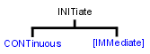

# Initiate Commands

* * *

Controls triggering signals

Click on a red keyword to view the command details.

See Also

  * Example [Triggering the VNA](../GPIB_Example_Programs/Triggering_the_PNA_using_SCPI.md)

  * [Learn about Triggering](../../S1_Settings/Trigger.md)

  * [Synchronizing the Analyzer and Controller](../Learning_about_GPIB/Understanding_Command_Synchronization.md)

  * [SCPI Command Tree](SCPI_Command_Tree.md)

* * *

## INITiate:CONTinuous <boolean>

Applicable Models: All (Read-Write) Specifies whether the VNA trigger source
is set to Internal (continuous) or Manual.

  * For SIMPLE, single-triggering of a single channel, use [Sens:Sweep:Mode SINGle](Sense/Sweep_SCPI.md#ssm) which sets the number of trigger signals each channel will ACCEPT (Continuous, Groups, Single, or HOLD - none.)
  * This command is a subset of [TRIG:SEQ:SOURce](Trigger_SCPI.md#tss), which can also set the trigger source to External.
  * See a [map of user interface to SCPI triggering commands](../XStimulusTopic.md#Trigger).
  * For more information on triggering, see the [VNA Trigger Model](../../S1_Settings/TrigModel.md).
  * See the Example program: [Triggering the VNA using SCPI](../GPIB_Example_Programs/Triggering_the_PNA_using_SCPI.md).

  
---  
Parameters |   
<boolean> |  ON (or 1) - Internal (continuous) trigger. OFF (or 0) - Manual sweep. Use [INIT:IMMediate](Initiate.md#immed) to send a trigger signal  
Examples |  INIT:CONT ON  
initiate:continuous off  
Query Syntax |  INITiate:CONTinuous?  
Return Type |  Boolean (1 = ON, 0 = OFF)  
[Default](JavaScript:hhctrl.TextPopup\(DefSCPI,'Arial,8',10,10,00000000,0xc0ffff\)) |  ON  
  
* * *

## INITiate<cnum>[:IMMediate]

Applicable Models: All (Write-only) Stops the current sweeps and immediately
sends a trigger. (Same as
[Trigger!](../../S1_Settings/Trigger.md#state_single) on the VNA front
panel).

  * This command requires [Trigger:Source](Trigger_SCPI.md#tss) to be set to Manual. This causes ONE trigger signal to be SENT each time INIT:IMM is issued.
  * For SIMPLE, single-triggering of a single channel, use [Sens:Sweep:Mode SINGle](Sense/Sweep_SCPI.md#ssm) which sets the number of trigger signals each channel will ACCEPT (Continuous, Groups, Single, or HOLD - none.)

See the Example program: [Triggering the VNA using
SCPI](../GPIB_Example_Programs/Triggering_the_PNA_using_SCPI.htm) Note: An SMC
Fixed Output measurement cannot be triggered using this command. For more
information, see the [example
program](../GPIB_Example_Programs/Create_an_SMC_Fixed_Output_SCPI_Meas.htm).

### To trigger ALL channels in turn:

Set ALL channels to Sens<ch>:Sweep:Mode Continuous. The <ch> argument in
INIT<ch>:IMM is ignored. Then

  * TRIG:SCOP ALL triggers ALL channels (in sequence) each time Init:Imm is sent.
  * TRIG:SCOP CURRent triggers ONLY the NEXT channel each time Init:Imm is sent.

### To trigger ONLY a specified channel:

  1. Set ALL channels to Sens<ch>:Sweep:Mode HOLD
  2. Send TRIG:SCOP CURRent
  3. Send Init<ch>:Imm where <ch> is the channel to be triggered.

Advanced Situations that require some channels to be in CONT and others in
HOLD are rare. The following describes the behavior of the Init:Imm command in
these situations: When [Trigger:Scope](../../S1_Settings/Trigger.md#scope) =
Global:

  * If the SPECIFIED <cnum> channel is in hold mode, it is put in single trigger (accepts 1 trigger signal) and goes to the end of the queue of channels to be triggered. The other 'non-hold' channels are triggered. The next Init:Imm triggers the specified channel first.

For example: ch1 is in Hold, ch2 and ch3 are in CONT and we send INIT1:IMM

  1.      * On the first INIT:IMM, ch2 and ch3 is triggered.
     * next INIT:IMM, ch1, ch2, ch3 is triggered.
     * next INIT:IMM, ch2 and ch3 is triggered.
     * next INIT:IMM, ch1, ch2, ch3 is triggered, and so forth.

When Trigger:Scope = Channel

  * Only ONE channel is triggered for each issued INIT<ch>:IMM command.
  * If the specified channel is in hold, it is put in single trigger (accepts 1 trigger signal) and goes the end of the queue of channels to be triggered as in the 'Global' example.

This is one of the VNA overlapped commands. [Learn
more.](../Learning_about_GPIB/Understanding_Command_Synchronization.htm)  
---  
Parameters |   
<cnum> |  Any existing channel number. If unspecified, value is set to 1  
Examples |  INIT  
initiate2:immediate  
Query Syntax |  Not applicable  
[Default](JavaScript:hhctrl.TextPopup\(DefSCPI,'Arial,8',10,10,00000000,0xc0ffff\)) |  Not applicable  
  
* * *

