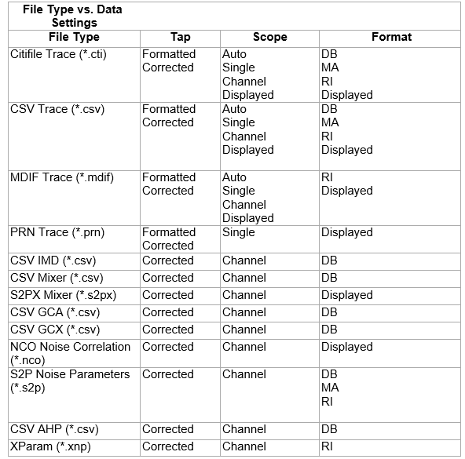

# Memory Commands

* * *

The memory commands control saving and loading instrument states and
measurement trace data to the hard drive. To read and write trace data in GPIB
format, see [CALC:MEAS:DATA](Calculate/MeasureDATA.md).

MMEMory: [CATalog?](Memory.md#cat) [CDIRectory](Memory.md#chgdir) [COPY](Memory.md#copy) [DATE?](Memory.md#Date) [DELete](Memory.md#del) [LOAD](Memory.md#recall) | ASCFactor | BSCFactor | CORRection | CSARchive | ENR | [:FILE] | LIMit | PLOSs | PN | SPURious | OSSPur | THReshold | RLIMit | SEGMent | STATe [MDIRectory](Memory.md#mkdir) [MOVE](Memory.md#move) [RDIRectory](Memory.md#remvedir) [STORe](Memory.md#save) | ASCFactor | BSCFactor | CORRection | CSARchive | CSTate | CITI | [DATA](Memory.md#CitiData) | [FORMat](Memory.md#citiFormat) | CSV:FORMat | [DATA](Memory.md#StoreData) | CATalog | EXTended | SNP | TAP | [ENR](Memory.md#StoreENR) | [:FILE] | LIMit | PLOSs | RLIMit | SEGMent | SSCReen | STATe | TRACe | TRACe | CONTents | [CITIfile](Memory.md#contents) | FORMat | [CITIfile](Memory.md#FORMATciti) | [SNP](Memory.md#snp) [TDR More Commands](TDR_Memory.md) [TIME?](Memory.md#Time) [TRANsfer](Memory.md#Transfer)  
---  
  
Click on a keyword to view the command details.

Blue commands are [superseded.](../Replacement_Commands.md)

See Also

  * [Example Programs](../GPIB_Example_Programs/SCPI_Example_Programs.md)

  * [Learn about Save / Recall and File Types](../../S5_Output/SaveRecall.md)

  * [Synchronizing the Analyzer and Controller](../Learning_about_GPIB/Understanding_Command_Synchronization.md)

  * [SCPI Command Tree](SCPI_Command_Tree.md)

### Specifying Path Names

The MMEM commands use the following rules to specify path names:

  * The default folder is "D:\". [Learn more](../../S0_Start/Windows_File_Locations.md).

  * You can change the active directory using [MMEMory:CDIRectory](Memory.md#chgdir).

  * Specify only the file name if using the active directory.

  * You can also use an absolute path name to specify the folder and file.

* * *

## MMEMory:CATalog[:<char>]? [<folder>]

Applicable Models: All (Read-only) Returns a comma-separated string of file
names that are in the specified folder. If there are no files of the specified
type, "NO CATALOG" is returned. [Learn about File
Types](../../S5_Output/SaveRecall.htm#FileTypes).  Note: If [Enable Remote
Drive
Access](../Learning_about_GPIB/How_to_Configure_for_GPIB_SCPI_and_SICL.htm#Security)
is unchecked in the Remote Interface dialog, this command will return an
error.  
---  
Parameters |   
<char> |  The type of files to list. Choose from:

  * STATe \- Instrument states (.sta)
  * CORRection \- Calibration Data (.cal)
  * CSARchive \- Instrument state and calibration data (.csa)
  * CSTate \- Instrument state and link to Calibration data (.cst)
  * [:File]

If unspecified then ALL file types (even unknown types) are listed.  
<folder> |  String - Any existing folder name. See [Specifying Path Names](Memory.md#Specifying)  
Examples |  MMEM:CAT? 'lists all files from the current folder  
mmemory:catalog:correction? 'D:\' 'lists .cal files from the specified folder  
[ Default ](JavaScript:hhctrl.TextPopup\(DefSCPI,'Arial,8',10,10,00000000,0xc0ffff\)) |  Not applicable  
  
* * *

## MMEMory:CDIRectory <folder>

Applicable Models: All (Read-Write) Changes the folder name.  Note: If [Enable
Remote Drive
Access](../Learning_about_GPIB/How_to_Configure_for_GPIB_SCPI_and_SICL.htm#Security)
is unchecked in the Remote Interface dialog, this command will return an
error.  
---  
Parameters |   
<folder> |  Any drive and folder name that already exists. If the same level as the default path, then no punctuation is required. MMEM:CDIR Service If the new folder is at a different level than the default, use a slash (/) before the folder name and enclose in quotes. mmemory:cdirectory '/automation' 'changes default directory up one level. You can use an absolute path to specify the new folder. mmemory:cdirectory 'C:/automation/service'  
Query Syntax |  MMEMory:CDIRectory? 'Returns the current folder name  
Return Type |  String  
[ Default ](JavaScript:hhctrl.TextPopup\(DefSCPI,'Arial,8',10,10,00000000,0xc0ffff\)) |  See [Specifying Path Names](Memory.md#Specifying)  
  
* * *

## MMEMory:COPY <file1>,<file2>

Applicable Models: All (Write-only) Copies file1 to file2. Extensions must be
specified.  Note: If [Enable Remote Drive
Access](../Learning_about_GPIB/How_to_Configure_for_GPIB_SCPI_and_SICL.htm#Security)
is unchecked in the Remote Interface dialog, this command will return an
error.  
---  
Parameters |   
<file1> |  String - Name of the file to be copied. See [Specifying Path Names](Memory.md#Specifying)  
<file2> |  String - Name of the file to be created from file1.  
Examples |  MMEM:COPY 'MyFile.cst','YourFile.cst'  
Query Syntax |  Not applicable  
[ Default ](JavaScript:hhctrl.TextPopup\(DefSCPI,'Arial,8',10,10,00000000,0xc0ffff\)) |  Not applicable  
  
* * *

## MMEMory:DATE? <fileName>

Applicable Models: All (Read-only) Returns the (year, month, day) that the
specified file was last saved.  To query the last date and time a cal set was
modified, use [CSET DATE?](CSET.md#Date) and [CSET:TIME?](CSET.md#time)

### See Also

[MMEM:TIME?](Memory.md#Time)  
---  
Parameters |   
<fileName> |  String - File name. See [Specifying Path Names](Memory.md#Specifying)  
Example |  MMEM:DATE? "myFile.txt" 'Returns +2013,+4,+12 mmemory:date? "D:\Calset_18.pcs" 'Returns +2013,+4,+12  
Return Type |  Comma-separated integers  
[ Default ](JavaScript:hhctrl.TextPopup\(DefSCPI,'Arial,8',10,10,00000000,0xc0ffff\)) |  Not applicable  
  
* * *

## MMEMory:DELete <file>

Applicable Models: All (Write-only) Deletes file. Extensions must be
specified.  Note: If [Enable Remote Drive
Access](../Learning_about_GPIB/How_to_Configure_for_GPIB_SCPI_and_SICL.htm#Security)
is unchecked in the Remote Interface dialog, this command will return an
error.  
---  
Parameters |   
<file> |  String - Name of the file to be deleted. See [Specifying Path Names](Memory.md#Specifying)  
Examples |  MMEM:DEL 'MyFile.cst'  
Query Syntax |  Not applicable  
[ Default ](JavaScript:hhctrl.TextPopup\(DefSCPI,'Arial,8',10,10,00000000,0xc0ffff\)) |  Not applicable  
  
* * *

## MMEMory:LOAD[:<char>] <file>

Applicable Models: All (Write-only) Loads the specified file. [ Learn about
File Types ](../../S5_Output/SaveRecall.htm#FileTypes)  
---  
Parameters |   
<char> |  The type of file to load. Choose from:

  * ASCFactor
  * BSCFactor
  * STATe \- Instrument states (.sta)
  * CORRection \- Calibration Data (.cal)
  * CSARchive \- Instrument state and calibration data (.csa)
  * CSTate \- Instrument state and link to Calibration data (.cst)
  * ENR \- Excess Noise Source data ([Noise Figure App only](../../Applications/Noise_Figure.md))\
  * SEGMent
  * [:File]
  * PLOSs
  * When <char> is ENR, then include CAL, - See example below.
  * *.sNp files CAN be recalled to the VNA although no <char> is used. See example below.

If <char> is unspecified, the extension must be included in the filename. If
an extension is specified in <file> that does not agree with <char> then no
action is taken.  
<file> |  String - Name of the file to be loaded. See [Specifying Path Names](Memory.md#Specifying)  
Examples |  MMEM:LOAD 'MyFile.cst'  
mmemory:load:state 'MyInstState' MMEM:LOAD:ENR CAL,
"D:/data/calset/346C_16500.enr" MMEM:LOAD "MyFile.s2p"  
Query Syntax |  Not applicable  
[ Default ](JavaScript:hhctrl.TextPopup\(DefSCPI,'Arial,8',10,10,00000000,0xc0ffff\)) |  Not applicable  
  
* * *

## MMEMory:LOAD:LIMit <file>

Applicable Models: All (Write-only) Load limit test data of the active trace
of the active channel from a CSV file.  
---  
Parameters |   
<file> |  A file path by string format. The CSV file shall have header lines and a title row as follows. "# E5080 Limit Test" "# Revision: 1.00" TYPE,BEGIN STIMULUS,END STIMULUS,BEGIN RESPONSE,END RESPONSE  
Examples |  MMEM:LOAD:LIM 'MyFile.csv'  
Query Syntax |  Not applicable  
[ Default ](JavaScript:hhctrl.TextPopup\(DefSCPI,'Arial,8',10,10,00000000,0xc0ffff\)) |  Not applicable  
  
* * *

## MMEMory:LOAD:PN:SPURious:OSSPur <file>

Applicable Models: N522xB, N524xB with Phase Noise Option S93031xB (Write-
only) Load user specified spurious frequency list of the active trace of the
active channel.  
---  
Parameters |   
<file> |  String - Name of the user specified spurious frequency list. See [Specifying Path Names](Memory.md#Specifying)  
Examples |  MMEM:LOAD:PN:SPUR:OSSP 'MyFile.csv' mmemory:load:pn:spurious:osspur 'D:/MyFile.csv'  
Query Syntax |  Not applicable  
[ Default ](JavaScript:hhctrl.TextPopup\(DefSCPI,'Arial,8',10,10,00000000,0xc0ffff\)) |  Not applicable  
  
* * *

## MMEMory:LOAD:PN:SPURious:THReshold <file>

Applicable Models: N522xB, N524xB with Phase Noise Option S93031xB (Write-
only) Load the threshold table of the active trace of the active channel.  
---  
Parameters |   
<file> |  String - Name of the threshold table. See [Specifying Path Names](Memory.md#Specifying)  
Examples |  MMEM:LOAD:PN:SPUR:THR 'MyFile.csv' mmemory:load:pn:spurious:threshold 'D:/MyFile.csv'  
Query Syntax |  Not applicable  
[ Default ](JavaScript:hhctrl.TextPopup\(DefSCPI,'Arial,8',10,10,00000000,0xc0ffff\)) |  Not applicable  
  
* * *

## MMEMory:LOAD:RLIMit <file>

Applicable Models: All (Write-only) Load ripple limit test data of the active
trace of the active channel from a CSV file.  
---  
Parameters |   
<file> |  A file path by string format. The CSV file shall have header lines and a title row as follows. "# E5080 Ripple Limit Test" "# Revision: 1.00" TYPE,BEGIN STIMULUS,END STIMULUS,MAX RIPPLE  
Examples |  MMEM:LOAD:RLIM 'MyFile.csv'  
Query Syntax |  Not Applicable  
[ Default ](JavaScript:hhctrl.TextPopup\(DefSCPI,'Arial,8',10,10,00000000,0xc0ffff\)) |  Not Applicable  
  
* * *

## MMEMory:MDIRectory <folder>

Applicable Models: All (Write-only) Makes a folder.  Note: If [Enable Remote
Drive
Access](../Learning_about_GPIB/How_to_Configure_for_GPIB_SCPI_and_SICL.htm#Security)
is unchecked in the Remote Interface dialog, this command will return an
error.  
---  
Parameters |   
<folder> |  String - Name of the folder to make. See [Specifying Path Names](Memory.md#Specifying)  
Examples |  MMEM:MDIR 'MyFolder' mmemory:mdirectory 'D:/NewFolder'  
Query Syntax |  Not applicable  
[ Default ](JavaScript:hhctrl.TextPopup\(DefSCPI,'Arial,8',10,10,00000000,0xc0ffff\)) |  Not applicable  
  
* * *

## MMEMory:MOVE <file1>,<file2>

Applicable Models: All (Write-only) Renames <file1> to <file2>. File
extensions must be specified.  
---  
Parameters |   
<file1> |  String - Name of the file to be renamed. See [Specifying Path Names](Memory.md#Specifying)  
<file2> |  String - Name of the new file.  
Examples |  MMEM:MOVE 'MyFile.cst','YourFile.cst'  
Query Syntax |  Not applicable  
[ Default ](JavaScript:hhctrl.TextPopup\(DefSCPI,'Arial,8',10,10,00000000,0xc0ffff\)) |  Not applicable  
  
* * *

## MMEMory:RDIRectory <folder>

Applicable Models: All (Write-only) Removes the specified folder.  Note: If
[Enable Remote Drive
Access](../Learning_about_GPIB/How_to_Configure_for_GPIB_SCPI_and_SICL.htm#Security)
is unchecked in the Remote Interface dialog, this command will return an
error.  
---  
Parameters |   
<folder> |  String - Name of the folder to remove. See [Specifying Path Names](Memory.md#Specifying)  
Examples |  MMEM:RDIR 'MyFolder'  
Query Syntax |  Not applicable  
[ Default ](JavaScript:hhctrl.TextPopup\(DefSCPI,'Arial,8',10,10,00000000,0xc0ffff\)) |  Not applicable  
  
* * *

## MMEMory:STORe[:<char>] <file>

Applicable Models: All (Write-only) Stores the specified file (.sta, .cal,
.cst, .csa, .snp, s2px).  Learn about [saving SNP files on the
VNA](../../S5_Output/SaveRecall.htm#sNp). Learn about [saving S2Px files on
the VNA](../../S5_Output/SaveRecall.htm#S2PX). To save other data files, use
[MMEM:STOR:DATA](Memory.md#StoreData). To save ENR files, use
[MMEMory:STORe:ENR](Memory.md#StoreENR)  
---  
Parameters |   
<char> |  Optional argument. The type of file to store. Choose from:

  * ASCFactor
  * BSCFactor
  * CORRection \- Calibration Data (.cal)
  * CSARchive \- Instrument state and calibration data (.csa)
  * CSTate \- Instrument state and link to Calibration data (.cst)
  * CSV:FORMat
  * ENR
  * [:File]
  * PLOSs
  * SEGMent
  * STATe \- Instrument states (.sta)
  * STATe:TRACe
  * TRACe

No <char> is specified for s1p, s2p, s2px and so forth. Include either <char>
or the file extension. If both <char> and the extension are specified, they
must agree or an error is returned and no action is taken. See examples below.
[Learn about File Types](../../S5_Output/SaveRecall.md#FileTypes)  
<file> |  String - Name of any valid file that does not already exist. See [Specifying Path Names](Memory.md#Specifying)  
Examples |  MMEM:STOR:STAT 'myState' mmemory:store 'c:/bin/myState.sta' MMEM:STOR 'MyData.S2P'  
Query Syntax |  Not applicable  
[ Default ](JavaScript:hhctrl.TextPopup\(DefSCPI,'Arial,8',10,10,00000000,0xc0ffff\)) |  Not applicable  
  
* * *

## MEMory:STORe:CATalog? <legacy>

Applicable Models: All (Read only) Returns a list of all available file types
for the current measurement class. Legacy file type names are used in the
MMEM:STOR:DATA command. New file type names are used in the
MMEM:STOR:DATA:EXTended command.  
---  
Parameters |   
<legacy> |  (Integer) Choose from:  
0 – Returns list of new file type names  
1 – Returns list of legacy file type names  
Examples |  MMEM:STORE:DATA:CAT? 0 Returns “CSV Trace (*.csv);Citifile Trace (*.cti);MDIF Trace (*.mdf);PRN Trace (*.prn);S1P Network (*.s1p);S2P Network (*.s2p);S3P Network (*.s3p);S4P Network (*.s4p)”   
MMEM: STORE:DATA:CAT? 1 Returns “PRN Trace Data (*.prn);Citifile Data Data
(Real,Imag) (*.cti);Citifile Formatted Data (*.cti);CSV Formatted Data
(*.csv);MDIF Data (*.mdf);Trace (*.s1p);Trace (*.s2p);Trace (*.s3p);Trace
(*.s4p)”  
[ Default ](JavaScript:hhctrl.TextPopup\(DefSCPI,'Arial,8',10,10,00000000,0xc0ffff\)) |  Not applicable  
  
* * *

## MMEMory:STORe:CITifile:DATA <filename> \- Superseded

Applicable Models: All This command is replaced with
[MMEMory:STORe:DATA](Memory.md#StoreData). (Write only) Saves UNFORMATTED
trace data to .cti file. [Learn more.](../../S5_Output/SaveRecall.md#cti)  
---  
Parameters |   
<filename> |  Any path that already exists with filename. If the same level as the default, then no path is required. MMEM:STOR:CIT:DATA 'MYFile.cti' Of you can specify an absolute path and filename: mmemory:store:citifile:data "D:\myFile.cti'  
Query Syntax |  Not Applicable  
[ Default ](JavaScript:hhctrl.TextPopup\(DefSCPI,'Arial,8',10,10,00000000,0xc0ffff\)) |  See [Specifying Path Names](Memory.md#Specifying)  
  
* * *

## MMEMory:STORe:CITifile:FORMat <filename> \- Superseded

Applicable Models: All This command is replaced with
[MMEMory:STORe:DATA](Memory.md#StoreData). (Write only) Saves FORMATTED trace
data to .cti file. [Learn more.](../../S5_Output/SaveRecall.md#cti)  
---  
Parameters |   
<filename> |  Any path that already exists with filename. If the same level, then no path is required MMEM:STOR:CIT:FORM 'MYFile.cti' Of you can specify an absolute path and filename: mmemory:store:citifile:format "D:\myFile.cti'  
Query Syntax |  Not Applicable  
[ Default ](JavaScript:hhctrl.TextPopup\(DefSCPI,'Arial,8',10,10,00000000,0xc0ffff\)) |  See [Specifying Path Names](Memory.md#Specifying)  
  
* * *

## MMEMory:STORe:DATA <filename>,<type>,<scope>,<format>,<selector> \-
Superseded

This command is replaced with MMEMory:STORe:DATA:EXTended. Applicable Models:
All (Write-only) Stores trace data to the following file types: *.prn, *.cti,
*.csv, *.mdf. Not all choices are valid with other arguments. See [Valid
parameter combinations](Memory.htm#valid) below.

* * *

Notes: To save snp files for standard channels (only), use
[CALC:MEAS:Data:SNP:PORTs:SAVE](Calculate/MeasureDATA.md#CALCulate:MEASure:DATA:SNP:PORTs:SAVE)
To save state and calibration files, use [MMEM:STORe](Memory.md#save) This
command replaces the following:

  * [MMEMory:STORe:CITifile:DATA](Memory.md#CitiData)
  * [MMEMory:STORe:CITifile:FORMat](Memory.md#citiFormat)
  * [MMEMory:STORe:TRACe:FORMat:CITifile](Memory.md#FORMATciti)
  * [MMEMory:STORe:TRACe:CONTent:CITifile](Memory.md#contents)

* * *  
  
---  
Parameters |   
<filename> |  (String) Name and extension of the file to which data will be saved. If the extension does not agree with the file type, an error is NOT returned but the data may NOT be what you expect. [See rules for specifying a filename.](Memory.md#Specifying)  
<type> |  (String) File type to save. Choose from: "PRN Trace Data" \- *.prn data. [Learn more.](../../S5_Output/SaveRecall.md#prn) "Citifile Data Data" \- unformatted *.cti data. [Learn more](../../S5_Output/SaveRecall.md#cti). "Citifile Formatted Data" \- formatted *.cti data. "CSV Formatted Data" \- formatted *.csv data. [Learn more](../../S5_Output/SaveRecall.md#csv). "MDIF Data" \- *.mdf data. [Learn more](../../S5_Output/SaveRecall.md#MDIF). "GCA Sweep Data" \- Gain compression data. [Learn more](../../Applications/Gain_Compression_Application.md#Saving). "GCX Sweep Data" \- Gain compression data. [Learn more](../../Applications/Gain_Compression_for_Converters.md#Saving). "IMD Sweep Data" \- Swept IMD data. [Learn more](../../Applications/Swept_IMD.md#Saving).  
<scope> |  (String) How much data to save. Choose from: "Trace" \- only the specified measurement number is saved. "Displayed" \- all displayed measurements are saved. "Channel" \- all measurements that are in the channel in which the selected measurement reside are saved. "Auto" For all Standard Meas Class (S-parameter) channels:

  * When correction is OFF, the specified trace is saved.
  * When correction is ON, all corrected parameters associated with the calibrated ports in the Cal Set are saved.

For all other channels:

  * When correction is OFF or ON, the specified trace is saved.

  
<format> |  The format in which data is saved. Choose from: "Displayed" \- the format is the same as that in which it is displayed on the VNA screen. "RI" \- Real / Imaginary "MA" \- Magnitude / Angle "DB" \- LogMag / Degrees  
<selector> |  (Integer) Choose from: -1 Use when <scope> = "Displayed" (does NOT require a selected trace). <measurement number> Use for all other <scope> selections. Use [Calc:Par:MNUM?](Calculate/Parameter.md#MnumSel) to read the measurement number of the selected trace.  
  
The following are valid parameter combinations for ALL measurement classes:

Parameters  
---  
<type>  
(String) |  <scope>  
(String) |  <format>  
(String) |  <selector>  
(Numeric)  
"PRN Trace Data" |  "Trace" |  "Displayed" |  Measurement number  
Example: MMEMory:STORe:DATA "myData.prn","PRN Trace
Data","Trace","Displayed",2  
"Citifile Data Data" |  "Trace" or "Auto" or "Channel" |  "RI" |  Measurement number  
"Displayed" |  "RI" |  -1  
Example: MMEMory:STORe:DATA "myData.cti","Citifile Data Data","AUTO","RI",3  
"Citifile Formatted Data" |  "Trace" or "Auto" |  "RI" or "MA" or "DB" |  Measurement number  
"Channel" |  "RI" or "MA" or "DB" or "Displayed" |  Measurement number  
"Displayed" |  "RI" or "MA" or "DB" or "Displayed" |  -1  
Example: MMEMory:STORe:DATA "myData.cti","Citifile Formatted
Data","AUTO","MA",3  
"CSV Formatted Data" |  "Trace" or "Auto" or "Channel" |  "RI" or "MA" or "DB" or "Displayed" |  Measurement number  
"Displayed" |  "RI" or "MA" or "DB" |  -1  
Example: MMEMory:STORe:DATA "myData.csv","CSV Formatted
Data","displayed","RI",-1  
"MDIF Data" |  "Trace" or "Auto" |  "RI" or "Displayed" or "Channel" |  Measurement number  
"Displayed" |  "RI" or "Displayed" |  -1  
Example: MMEMory:STORe:DATA "myData.mdf","MDIF
Data","displayed","displayed",-1  
The following parameter combinations save *.csv files in specific formats for
GCA, GCX, and Swept IMD classes:  
Parameters  
<type>  
(String) |  <scope>  
(String) |  <format>  
(String) |  <selector>  
(Numeric)  
"GCA Sweep Data" |  "Auto" |  "DB" |  GCA channel number  
Example: MMEMory:STORe:DATA "myData.csv","gca sweep
data","displayed","displayed",-1  
"GCX Sweep Data" |  "Auto" |  "DB" |  GCX channel number  
Example: MMEMory:STORe:DATA "myData.csv","gcx sweep
data","displayed","displayed",-1  
"IMD Sweep Data" |  "Auto" |  "DB" |  Swept IMD channel number  
Example: MMEMory:STORe:DATA "myData.mdf","MDIF
Data","displayed","displayed",-1  
Query Syntax |  Not applicable  
---|---  
[ Default ](JavaScript:hhctrl.TextPopup\(DefSCPI,'Arial,8',10,10,00000000,0xc0ffff\)) |  Not applicable  
  
* * *

## MMEMory:STORe:DATA:EXTended <filename>,<type>,<scope>,<format>,<selector>

Applicable Models: All (Write-only) Stores trace data to the following file
types: PRN Trace, Citifile Trace, CSV Trace, MDIF Trace. in addition to
application specific file types.  
The processing stage of the data can be selected with MMEMory:STORe:TAP.
Application specific file types will not be affected by the processing stage
selection and can only save “Corrected” data.  
---  
Parameters |   
<filename> |  (String) Name and extension of the file to which data will be saved. If the extension does not agree with the file type, an error is NOT returned but the data may NOT be what you expect. See rules for specifying a filename.  
<type> |  (String) File type to save. Choose from: "PRN Trace" \- *.prn data. [Learn more.](../../S5_Output/SaveRecall.md#prn) "Citifile Trace" \- unformatted *.cti data. [Learn more](../../S5_Output/SaveRecall.md#cti). "CSV Trace" \- formatted *.csv data. [Learn more](../../S5_Output/SaveRecall.md#csv). "MDIF Trace" \- *.mdf data. [Learn more](../../S5_Output/SaveRecall.md#MDIF). Application "CSV AHP" "CSV GCA" \- Gain compression data. [Learn more](../../Applications/Gain_Compression_Application.md#Saving). "CSV GCX" \- Gain compression data. [Learn more](../../Applications/Gain_Compression_for_Converters.md#Saving). "CSV IMD" \- Swept IMD data. [Learn more](../../Applications/Swept_IMD.md#Saving). “CSV Mixer” - SMC/VMC data  
“NCO Noise Correlation” – Noise Correlation data  
“S2P Noise Parameters” – Noise parameter data  
“S2PX Mixer” – SMC/VMC data  
“XParam” – Active Hot Parameter data  
<scope> |  (String) How much data to save. Choose from: "Single" \- only the specified measurement number is saved. "Displayed" \- all displayed measurements are saved. "Channel" \- all measurements that are in the channel in which the selected measurement reside are saved. "Auto" For all Standard Meas Class (S-parameter) channels:

  * When correction is OFF, the specified trace is saved.
  * When correction is ON, all corrected parameters associated with the calibrated ports in the Cal Set are saved.

For all other channels:

  * When correction is OFF or ON, the specified trace is saved.

  
<format> |  The format in which data is saved. Choose from: "Displayed" \- the format is the same as that in which it is displayed on the VNA screen. "RI" \- Real / Imaginary "MA" \- Magnitude / Angle "DB" \- LogMag / Degrees  
<selector> |  (Integer) Choose from: -1 Use when <scope> = "Displayed" (does NOT require a selected trace). <measurement number> Use for all other <scope> selections. Use [Calc:Par:MNUM?](Calculate/Parameter.md#MnumSel) to read the measurement number of the selected trace.  
Examples |  MMEM:STORE:DATA:TAP “Corrected”  
MMEM:STORE:DATA:EXT “myData.cti”, “citifile trace”, “single”, “db”, 1"  
Query Syntax |  Not applicable  
Return Type |  Depends on MMEM:STORE:DATA:TAP  
[ Default ](JavaScript:hhctrl.TextPopup\(DefSCPI,'Arial,8',10,10,00000000,0xc0ffff\)) |  Not applicable  
  
* * *

## MMEMory:STORe:DATA:SNP <filename>,<ports>,<format>,<touchstoneversion>

Applicable Models: All (Write-only) Saves S-Parameter data for the specified
ports.

  * The processing stage of the data can be selected with MMEMory:STORe:TAP. 
  * Saves balanced S-Parameters if the selected measurement is balanced ([Mixed Mode](../../S1_Settings/Measurement_Parameters.md#topology)). Otherwise, saves normal S-Parameters. 
  * [Supports reordering of ports](../../S5_Output/SaveRecall.md#ChoosePorts). 
  * Uses the FAST SnP save routine if the following conditions are met: 
    * A valid correction is applied
    * Current tap is “Corrected”
    * [SENS:CORR:CACH:MODE](Sense/Sense_Correction.md#CacMode) is on
  * Automatically downgrades correction for FAST SnP file saves when provided port list is a subset of calibrated ports. Learn more about [SNP data](../../S5_Output/SaveRecall.md#SaveDataAs22).
  * Data that is not available is zero-filled.
  * For sweeps with a large number of data points, always follow this command with *OPC? Learn more.
  * Supersedes [CALCulate:MEASure:DATA:SNP:PORTs:SAVE](Calculate/MeasureDATA.md#SnPPortSave). 

  
---  
Parameters |   
<filename> |  (String) Name and extension of the file to which data will be saved. If the extension does not agree with the file type, an error is NOT returned but the data may NOT be what you expect. See rules for specifying a filename.  
<port> |  (String) Comma delimited list of port numbers. Supports port reordering.  
<format> |  The format in which data is saved. Choose from: "AUTO" \- Auto. "RI" \- Real / Imaginary "MA" \- Magnitude / Angle "DB" \- LogMag / Degrees  
<touchstone version> |  (Integer) Only supports 1.1 as of now.  
Examples |  MMEM:STORE:DATA:TAP “Formatted”   
MMEM:STOR:DATA:SNP “myData.s2p”, “2,1”, “ri”, 1.1  
Query Syntax |  Not applicable  
Return Type |  Not applicable  
[ Default ](JavaScript:hhctrl.TextPopup\(DefSCPI,'Arial,8',10,10,00000000,0xc0ffff\)) |  Not applicable  
  
* * *

## MMEMory:STORe:DATA:TAP <tap>

Applicable Models: All (Read and Write) Specifies where in the data access map
the data is saved from. To be used in conjunction with
MMEM:STORE:DATA:EXTended. This command only applies to the following file
types: PRN Trace, Citifile Trace, CSV Trace, MDIF Trace, and SnP Network, but
not application specific file types.[ Learn
more.](../../S5_Output/SaveRecall.htm) NOTE: The tap setting associated with
this command is also shared with the GUI in the system registry. For example,
if you set the tap using this command but proceed to use the GUI and save a
file as a different tap, the shared tap setting will be changed. Users may use
the query syntax of this command to see what the current tap is. When a tap is
selected and a file is saved using the SCPI save command, it will validate the
tap to see if it’s valid for the specified file type. If it’s not valid, a
valid tap is chosen for the save. For example, if a user chooses “Revision
2023” and saves a non-snp file, the file saved may be “Corrected” or
“Formatted” because non-snp SnP files do not have the option of “Revision
2023”.  
---  
Parameters |   
<tap> |  (String) Choose from:  
“Corrected” – Saves from Tap 1  
“Formatted” – Saves from Tap 2 (if <format> = “RI”, then data will NOT include
smoothing)  
“Revision 2023” – Special legacy SnP tap. This operation preserves legacy
operation from code shipping in 2023 for customers requiring backwards
compatibility.  
Examples |  MMEM:STORE:DATA:TAP “Formatted”  
Query Syntax |  MMEM:STORE:DATA:TAP?  
Return Type |  String  
[ Default ](JavaScript:hhctrl.TextPopup\(DefSCPI,'Arial,8',10,10,00000000,0xc0ffff\)) |  Not applicable  
  
* * *

## MMEMory:STORe:ENR CAL, <file>

Applicable Models: All (Write-only) Stores an ENR (Excess Noise Source) data.
([Noise Figure App only](../../Applications/Noise_Figure.md))  To set and
read ENR data, use
[SENS:CORR:ENR:CAL:TABLE:DATA](Sense/Sense_Correction.md#ENRData).  
---  
Parameters |   
<file> |  String - Name of any valid file that is not already in existence. See [Specifying Path Names](Memory.md#Specifying)  
Examples |  MMEM:STOR:ENR CAL, "C:/data/calset/346C_16500.enr"  
Query Syntax |  Not applicable  
[ Default ](JavaScript:hhctrl.TextPopup\(DefSCPI,'Arial,8',10,10,00000000,0xc0ffff\)) |  Not applicable  
  
* * *

## MMEMory:STORe:LIMit <file>

Applicable Models: All (Write-only) Saves limit test data of the active trace
of the active channel into a CSV file.  
---  
Parameters |   
<file> |  A file path by string format. The CSV file shall have header lines and a title row as follows. "# VNA Limit Test" "# Revision: 1.00" TYPE,BEGIN STIMULUS,END STIMULUS,BEGIN RESPONSE,END RESPONSE  
Examples |  MMEM:STOR:LIM 'MyFile.csv'  
Query Syntax |  Not Applicable  
[ Default ](JavaScript:hhctrl.TextPopup\(DefSCPI,'Arial,8',10,10,00000000,0xc0ffff\)) |  Not Applicable  
  
* * *

## MMEMory:STORe:RLIMit <file>

Applicable Models: All (Write-only) Saves ripple limit test data of the active
trace of the active channel into a CSV file.  
---  
Parameters |   
<file> |  A file path by string format. The CSV file shall have header lines and a title row as follows. "# VNA Ripple Limit Test" "# Revision: 1.00" TYPE,BEGIN STIMULUS,END STIMULUS,MAX RIPPLE  
Examples |  MMEM:STOR:RLIM 'MyFile.csv'  
Query Syntax |  Not Applicable  
[ Default ](JavaScript:hhctrl.TextPopup\(DefSCPI,'Arial,8',10,10,00000000,0xc0ffff\)) |  Not Applicable  
  
* * *

## MMEMory:STORe:SSCReen <file>

Applicable Models: All (Write-only) Stores the specified file as a bitmap file
(.bmp).  
---  
Parameters |   
<file> |  String - Name of any valid file that does not already exist. See [Specifying Path Names](Memory.md#Specifying)  
Examples |  MMEM:STOR:SSCR 'myState' mmemory:store:sscreen 'c:/bin/myState.bmp'  
Query Syntax |  Not applicable  
[ Default ](JavaScript:hhctrl.TextPopup\(DefSCPI,'Arial,8',10,10,00000000,0xc0ffff\)) |  Not applicable  
  
* * *

## MMEMory:STORe:TRACe:FORMat:CITifile <char> \- Superseded

Applicable Models: All This command is replaced with
[MMEMory:STORe:DATA](Memory.md#StoreData). (Read-Write) Specifies the format
of subsequent citifile save statements.  
---  
Parameters |   
<char> |  Format in which the citifile will be saved with subsequent [MMEMory:STORe:CIT:FORMat](Memory.md#citiFormat) statements. Choose from: MA \- Linear Magnitude / degrees DB \- Log Magnitude / degrees RI \- Real / Imaginary AUTO \- Format in which the trace is already displayed. If other than Log Mag, Linear Magnitude, or Real/Imag, then the format will be in Real/Imag. DISP \- Displayed format.  
Examples |  MMEM:STOR:TRAC:FORM:CIT MA  
Query Syntax |  MMEMory:STORe:TRACe:FORMat:CITifile?  
Return Type |  Character  
[ Default ](JavaScript:hhctrl.TextPopup\(DefSCPI,'Arial,8',10,10,00000000,0xc0ffff\)) |  Auto  
  
* * *

## MMEMory:STORe:TRACe:CONTents:CITifile <char> \- Superseded

Applicable Models: All This command is replaced with
[MMEMory:STORe:DATA](Memory.md#StoreData). (Read-Write) Specifies the
contents of subsequent citifile save statements. (See [Data Define
Saves](../../S5_Output/SaveRecall.htm#FilePref))  
---  
Parameters |   
<char> |  Choose from: SING \- Single trace DISP \- All displayed traces AUTO \- All displayed traces  
Examples |  MMEM:STOR:TRAC:CONT:CIT SING  
Query Syntax |  MMEMory:STORe:TRACe:CONTents?  
Return Type |  Character  
[ Default ](JavaScript:hhctrl.TextPopup\(DefSCPI,'Arial,8',10,10,00000000,0xc0ffff\)) |  Auto  
  
* * *

## MMEMory:STORe:TRACe:FORMat:SNP <char>

Applicable Models: All (Read-Write) Specifies the format of subsequent .s1p,
.s2p, .s3p; s4p save statements. [Learn
more](../../S5_Output/SaveRecall.htm#FilePref).  To save SNP data, use
[CALC:MEAS:DATA:SNP:PORTs:SAVE](Calculate/MeasureDATA.md#CALCulate:MEASure:DATA:SNP:PORTs:SAVE)  
---  
Parameters |   
<char> |  Choose from: MA \- Linear Magnitude / degrees DB \- Log Magnitude / degrees RI \- Real / Imaginary AUTO \- data is output in currently selected trace format. If other than LogMag, LinMag, or Real/Imag, then output is in Real/Imag.  
Examples |  MMEM:STOR:TRAC:FORM:SNP MA  
Query Syntax |  MMEMory:STORe:TRACe:FORMat:SNP?  
Return Type |  Character  
[ Default ](JavaScript:hhctrl.TextPopup\(DefSCPI,'Arial,8',10,10,00000000,0xc0ffff\)) |  Auto'  
  
* * *

## MMEMory:TIME? <fileName>

Applicable Models: All (Read-only) Returns the (hour, minute, second) that the
specified file was last saved. The time is returned in local time as setup in
the VNA operating system.  To query the last date and time a cal set was
modified, use [CSET DATE?](CSET.md#Date) and [CSET:TIME?](CSET.md#time)

### See Also

[MMEM:DATE?](Memory.md#Date)  
---  
Parameters |   
<fileName> |  String - File name. See [Specifying Path Names](Memory.md#Specifying)  
Example |  MMEM:TIME? "myFile.txt" 'returns +12,+34,+12 mmemory:time? "D:\Calset_18.pcs" 'returns +12,+34,+12  
Return Type |  Comma-separated integers  
[ Default ](JavaScript:hhctrl.TextPopup\(DefSCPI,'Arial,8',10,10,00000000,0xc0ffff\)) |  Not applicable  
  
* * *

## MMEMory:TRANsfer <fileName>,<dataBlock>

Applicable Models: All (Read-Write) Transfers data between the VNA and an
external controller. Other MMEM commands transfer data between the VNA
application and the VNA hard drive. If <fileName> already exists, it will be
overwritten.  To read trace data from the VNA in block format, use
[CALC:MEAS:DATA](Calculate/MeasureDATA.md). Note: If [Enable Remote Drive
Access](../Learning_about_GPIB/How_to_Configure_for_GPIB_SCPI_and_SICL.htm#Security)
is unchecked in the Remote Interface dialog, this command will return an
error.  
---  
Parameters |   
<fileName> |  String - File name. See [Specifying Path Names](Memory.md#Specifying)  
<dataBlock> |  [Block Data](../Learning_about_GPIB/Getting_Data_from_the_Analyzer.md#block) \- The contents of the file. The data block is a block of binary data. Use the following syntax: #<num digits><byte count><data bytes><NL><END> where: <num_digits> specifies how many digits are contained in <byte_count> <byte_count> specifies how many data bytes will follow in <data bytes> Example: #210ABCDE+WXYZ<nl><end> Where: # - always sent before definite block data 2 \- specifies that the byte count is two digits (2) 10 \- specifies the number of data bytes that will follow, not counting <NL><END> ABCDE+WXYZ \- 10 digits of data <NL><END> \- always sent at the end of block data  
Example |  [See example program](../GPIB_Example_Programs/Transfer_Data_using_GPIB.md)  
Query Syntax |  MMEMory:TRANsfer? <fileName> Reads block data from the specified file location.  
[ Default ](JavaScript:hhctrl.TextPopup\(DefSCPI,'Arial,8',10,10,00000000,0xc0ffff\)) |  Not applicable  
  
* * *

