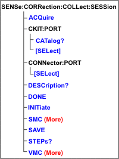

# Sense:Correction:Collect:Session Commands - Superseded

* * *

Note: These commands are replaced with [Sense:Corr:Guided](CorrGuided.md)
commands.

The commands in this topic are common to perform both SMC and VMC
calibrations.

A calibration session is a term used to describe an instance of a SMC or VMC
calibration. The session number is chosen in the
[SENS:CORR:COLL:SESS:INITiate](CorrCollSess.md#INIT) command. All other
commands refer to that session number. For more commands, see
[SESS:SMC](CorrCollSessSMC.md) and [SESS:VMC](CorrCollSessVMC.md).

Commands to read ([STEP?](CorrCollSess.md#Steps)) and describe
([DESC?](CorrCollSess.md#Desc)) each step are provided to facilitate a remote
user interface.

Click on a red keyword to view the command details.

See Also

  * Learn about [SMC](../../../FreqOffset/SMC_Measurements.md#CalOverview) and [VMC](../../../FreqOffset/VMC_Measurements.md#CalWizard) calibrations

  * [Synchronizing the Analyzer and Controller](../../Learning_about_GPIB/Understanding_Command_Synchronization.md)

  * [SCPI Command Tree](../SCPI_Command_Tree.md)

* * *

## SENSe<ch>:CORRection:COLLect:SESSion<n>:ACQuire <step>[,sync]

Applicable Models: N522xB, N524xB (Write only) Acquire a calibration
measurement.  
---  
Parameters |   
<ch> |  Any existing channel number. If unspecified, value is set to 1.  
<n> |  Session number of the calibration. [Learn about Cal sessions.](CorrCollSess.md)  
<step> |  Step number to acquire. Use [SENS:CORR:COLL:SESS:STEPS?](CorrCollSess.md#Steps) to find the number of steps required for the calibration.  
[sync] |  Optional argument. Choose from: SYNChronous \- blocks SCPI commands during standard measurement (default behavior). ASYNchronous \- does NOT block SCPI commands during standard measurement. [Learn more about this argument](../../Learning_about_GPIB/Understanding_Command_Synchronization.md#Synch)  
Examples |  SENSe2:CORR:COLL:SESS6:ACQ 5,ASYN;*OPC?  
Query Syntax |  Not Applicable  
[Default](JavaScript:hhctrl.TextPopup\(DefSCPI,'Arial,8',10,10,00000000,0xc0ffff\)) |  Not Applicable  
  
* * *

## SENSe<ch>:CORRection:COLLect:SESSion<n>:CKIT:PORT
:CATalog?

Applicable Models: N522xB, N524xB (Read only) Returns a list of cal kits that
are compatible with the connector on port 
. The port connector type is set
with [SENS:CORR:COLL:SESS:CONN:PORT](CorrCollSess.md#ConnPortSel)  
---  
Parameters |   
<ch> |  Any existing channel number. If unspecified, value is set to 1.  
<n> |  Session number of the calibration. [Learn about Cal sessions.](CorrCollSess.md)  

 |  VNA port number connector to query for compatible cal kits. For VMC, output port of the calibration mixer, specify 3 unless already used for the output of the mixer. Otherwise, specify 4.  
Examples |  SENS2:CORR:COLL:SESS6:CKIT:PORT2:CAT?  
Return Type |  Comma separated string values  
[Default](JavaScript:hhctrl.TextPopup\(DefSCPI,'Arial,8',10,10,00000000,0xc0ffff\)) |  Not Applicable  
  
* * *

## SENSe<ch>:CORRection:COLLect:SESSion<n>:CKIT:PORT
[:SELect] <calkit>

Applicable Models: N522xB, N524xB (Read-Write) Set or return the Cal Kit for
the specified port. Use
[SENS:CORR:COLL:SESS:CKIT:PORT:CAT?](CorrCollSess.md#CkitPortCat) to list
compatible Cal Kits.  
---  
Parameters |   
<ch> |  Any existing channel number. If unspecified, value is set to 1  
<n> |  Session number of the calibration. [Learn about Cal sessions.](CorrCollSess.md)  

 |  VNA port number connector for which a cal kit is to be specified. For VMC, output port of the calibration mixer, specify 3 unless already used for the output of the mixer. Otherwise, specify 4.  
<calkit> |  Cal Kit Name  
Examples |  SENS:CORR:COLL:SESS:CKIT:PORT:SEL 85091A  
SENS2:CORR:COLL:SESS6:CKIT:PORT2:SEL?  
Query Syntax |  SENS<ch>:CORR:COLL:SESS<n>:CKIT:PORT
[:SEL] ?  
Return Type |  String  
[Default](JavaScript:hhctrl.TextPopup\(DefSCPI,'Arial,8',10,10,00000000,0xc0ffff\)) |  Not Applicable  
  
* * *

## SENSe<ch>:CORRection:COLLect:SESSion<n>:CONNector:PORT
[:SELect] <conn>

Applicable Models: N522xB, N524xB (Read-Write) Set the connector type and sex
for the specified port number. Catalog valid connector types using
[SENS:CORR:COLL:GUID:CONN:CAT?](CorrGuided.md#gConnCat)  
---  
Parameters |   
<ch> |  Any existing channel number. If unspecified, value is set to 1  
<n> |  Session number of the calibration. [Learn about Cal sessions.](CorrCollSess.md)  

 |  VNA port number connector for which to specify a connector type.  
<conn> |  Name of the connector type  
Examples |  SENS2:CORR:COLL:SESS6:CONN:PORT1:SEL "N Type"  
Query Syntax |  SENSe<ch>:CORR:COLL:SESS<n>:CONN:PORT
[:SELect]?  
Return Type |  String  
[Default](JavaScript:hhctrl.TextPopup\(DefSCPI,'Arial,8',10,10,00000000,0xc0ffff\)) |  Not Applicable  
  
* * *

## SENSe<ch>:CORRection:COLLect:SESSion<n>:DESCription? <step>

Applicable Models: N522xB, N524xB (Read-only) Returns the connection prompt
for the step. List the number of steps in the calibration using
[SENS:CORR:COLL:SESS:STEPS?](CorrCollSess.md#Steps).  
---  
Parameters |   
<ch> |  Any existing channel number. If unspecified, value is set to 1  
<n> |  Session number of the calibration. [Learn about Cal sessions.](CorrCollSess.md)  
<step> |  Step number  
Examples |  SENS1:CORR:COLL:SESS6:DESC?3  
Return Type |  Numeric  
[Default](JavaScript:hhctrl.TextPopup\(DefSCPI,'Arial,8',10,10,00000000,0xc0ffff\)) |  Not Applicable  
  
* * *

## SENSe<ch>:CORRection:COLLect:SESSion<n>:DONE

Applicable Models: N522xB, N524xB (Write only) Ends the calibration session.
First use SAVE? to calculate error terms and save the CalSet.  
---  
Parameters |   
<ch> |  Any existing channel number. If unspecified, value is set to 1  
<n> |  Session number of the calibration. [Learn about Cal sessions.](CorrCollSess.md)  
Examples |  SENS1:CORR:COLL:SESS6:SAVE? SENS1:CORR:COLL:SESS6:DONE  
Query Syntax |  Not Applicable  
[Default](JavaScript:hhctrl.TextPopup\(DefSCPI,'Arial,8',10,10,00000000,0xc0ffff\)) |  Not Applicable  
  
* * *

## SENSe<ch>:CORRection:COLLect:SESSion<n>:INITiate <string>

Applicable Models: N522xB, N524xB (Write only) Initiates an SMC or VMC
calibration session. Use the session number for subsequent SMC or VMC
commands.  
---  
Parameters |   
<ch> |  Any existing channel number. If unspecified, value is set to 1  
<n> |  Session number. Choose from 1 to the [max number of channels](../../../S0_Start/Traces_Channels_and_Windows.md#channel).. If the session number already exists it will be terminated and a new session initiated.  
<string> |  Name of the calibration. Choose from: "VMC" or "VectorMixerCal.VMCType" "SMC" or "ScalarMixerCal.SMCType"  
Examples |  SENS1:CORR:COLL:SESS6:INITiate "VectorMixerCal.VMCType"  
Query Syntax |  Not Applicable  
[Default](JavaScript:hhctrl.TextPopup\(DefSCPI,'Arial,8',10,10,00000000,0xc0ffff\)) |  Not Applicable  
  
* * *

## SENSe<ch>:CORRection:COLLect:SESSion<n>:SAVE?

Applicable Models: N522xB, N524xB (Read only) Finish the SMC or VMC
calibration, compute error terms, populate and save the Cal Set, and return
the GUID of the Cal Set. Note: The destination (Cal Register or User Cal Set)
is determined by the setting of the
[SENS:CORR:PREFerence:CSET:SAVE](Sense_Correction.md#CsetSave) command.  
---  
Parameters |   
<ch> |  Any existing channel number. If unspecified, value is set to 1  
<n> |  Session number of the calibration. [Learn about Cal sessions.](CorrCollSess.md)  
Examples |  SENS1:CORR:COLL:SESS6:SAVE?  
Return Type |  String specifying the GUID of the Cal Set produced by this session.  
[Default](JavaScript:hhctrl.TextPopup\(DefSCPI,'Arial,8',10,10,00000000,0xc0ffff\)) |  Not Applicable  
  
* * *

## SENSe<ch>:CORRection:COLLect:SESSion<n>:STEPs?

Applicable Models: N522xB, N524xB (Write-Read) Returns the number of steps
required by the Calibration. To ensure this query always completes
successfully, first send the write command: SENS:CORR:COLL:SESS:STEP without
the <n> argument, then send the query.  
---  
Parameters |   
<ch> |  Any existing channel number. If unspecified, value is set to 1  
<n> |  Session number of the calibration. [Learn about Cal sessions.](CorrCollSess.md)  
Examples |  SENS1:CORR:COLL:SESS6:STEPs?  
Return Type |  Numeric  
[Default](JavaScript:hhctrl.TextPopup\(DefSCPI,'Arial,8',10,10,00000000,0xc0ffff\)) |  Not Applicable  
  
* * *

