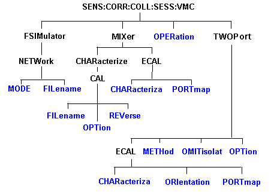

# Sense:Correction:Collect:Session:VMC Commands - Superseded

* * *

Note: These commands (commonly known as "Session" commands) were replaced with
[Sens:Corr:Coll:Guid:VMC](CorrCollGuidVMC.md) commands .

Performs a vector (VMC) calibration on a frequency converting device.

Click on a red keyword to view the command details.

See Also

  * [Example Programs](../../GPIB_Example_Programs/SCPI_Example_Programs.md)

  * [Learn about VMC Calibration](../../../FreqOffset/VMC_Measurements.md#VMCcalOverview)

  * [Synchronizing the Analyzer and Controller](../../Learning_about_GPIB/Understanding_Command_Synchronization.md)

* * *

## SENSe<ch>:CORRection:COLLect:SESSion<n> :VMC:FSIMulator:NETWork<x>:MODE
<char>

Applicable Models: N522xB, N524xB (Read-Write) Allows you to embed (add) or
de-embed (remove) circuit network effects on the input and output of your
mixer measurement. [Learn
more.](../../../FreqOffset/VMC_Measurements.htm#Waveguide)  
---  
Parameters |   
<ch> |  Any existing channel number. If unspecified, value is set to 1  
<n> |  Session number of the calibration. [Learn about Cal sessions.](CorrCollSess.md)  
<x> |  Apply network to input or output of mixer. Choose from: 1 - Input of mixer 2 - Output of mixer  
<char> |  Choose from: NONE \- Do nothing with effects of S2P file. EMBed \- Add effects of S2P file from the measurement results. DEEMbed \- Remove effects of S2P file from the measurement results.  
Examples |  SENS:CORR:COLL:SESS:VMC:FSIM:NETW1:MODE EMB  
Query Syntax |  SENS<ch>:CORRection:COLLect:SESSion<n> :VMC:FSIMulator:NETWork<x>:MODE?  
Return Type |  Character  
[Default](JavaScript:hhctrl.TextPopup\(DefSCPI,'Arial,8',10,10,00000000,0xc0ffff\)) |  NONE  
  
* * *

## SENSe<ch>:CORRection:COLLect:SESSion<n> :VMC:FSIMulator:NETWork<x>:FILename
<string>

Applicable Models: N522xB, N524xB (Read-Write) Specifies the S2P filename to
embed or de-embed on the input or output of your mixer measurement. [Learn
more.](../../../FreqOffset/VMC_Measurements.htm#Waveguide)  
---  
Parameters |   
<ch> |  Any existing channel number. If unspecified, value is set to 1  
<n> |  Session number of the calibration. [Learn about Cal sessions.](CorrCollSess.md)  
<x> |  Apply network to input or output of mixer. Choose from: 1 - Input of mixer 2 - Output of mixer  
<string> |  Filename of the S2P used for embedding or de-embedding. Use the full path name, file name, and .S2P suffix, enclosed in quotes.  
Examples |  SENS:CORR:COLL:SESS:VMC:FSIM:NETW1:FIL "D:\WaveguideAdapt.S2P"  
Query Syntax |  SENS<ch>:CORRection:COLLect:SESSion<n> :VMC:FSIMulator:NETWork<x>:FILename?  
Return Type |  String  
[Default](JavaScript:hhctrl.TextPopup\(DefSCPI,'Arial,8',10,10,00000000,0xc0ffff\)) |  Not Applicable  
  
* * *

## SENSe<ch>:CORRection:COLLect:SESSion<n>
:VMC:MIXer:CHARacterize:CAL:FILename <string>

Applicable Models: N522xB, N524xB (Read-Write) Specifies the .S2P filename
used for mixer characterization. Use the [VMC:MIXer:CHARacterize:CAL:
OPTion](CorrCollSessVMC.htm#MIX_CHAR_CAL_OPT) command to load the file for
mixer characterization. Once loaded, use this command to query the current
filename or set a new filename.  
---  
Parameters |   
<ch> |  Any existing channel number. If unspecified, value is set to 1  
<n> |  Session number of the calibration. [Learn about Cal sessions.](CorrCollSess.md)  
<string> |  Filename of the S2P used for mixer characterization. Use the full path name, file name, and .S2P suffix, enclosed in quotes.  
Examples |  SENS2:CORR:COLL:SESS4:VMC:MIXer:CHAR:CAL:FIL "D:\MyMixer.S2P"  
Query Syntax |  SENS:CORR:COLL:SESS:VMC:MIX:CHAR:CAL:FIL?  
Return Type |  String  
[Default](JavaScript:hhctrl.TextPopup\(DefSCPI,'Arial,8',10,10,00000000,0xc0ffff\)) |  D:\default.s2p  
  
* * *

## SENSe<ch>:CORRection:COLLect:SESSion<n> :VMC:MIXer:CHARacterize:CAL: OPTion
<char>

Applicable Models: N522xB, N524xB (Read-Write) Sets the mixer characterization
method to ECal, Mechanical, or read from a file.  
---  
Parameters |   
<ch> |  Any existing channel number. If unspecified, value is set to 1  
<n> |  Session number of the calibration. [Learn about Cal sessions.](CorrCollSess.md)  
<char> |  ECAL - Electronic Calibration Module MECH - Mechanical Calibration Kit FILE, <filename> - Retrieve a mixer characterization file. Also specify the filename of the S2P used for mixer characterization. Use the full path name, file name, and .S2P suffix. Use the [VMC:CHARacterize:CAL:FILename](CorrCollSessVMC.md#filename) command to query the filename..  
Examples |  SENS:CORR:COLL:SESS:VMC:MIX:CHAR:CAL:OPT ECAL 'or SENS:CORR:COLL:SESS6:VMC:MIX:CHAR:CAL:OPT FILE,'c:\users\public\network analyzer\documents/Mixer001.s2p' file = "SENS:CORR:COLL:SESS6:VMC:MIXer:CHAR:CAL:FIL?" 'Read back the filename  
Query Syntax |  SENS:CORR:COLL:SESS:VMC:MIX:CHAR:CAL:OPT?  
Return Type |  String  
[Default](JavaScript:hhctrl.TextPopup\(DefSCPI,'Arial,8',10,10,00000000,0xc0ffff\)) |  MECH  
  
* * *

## SENSe<ch>:CORRection:COLLect:SESSion<n> :VMC:MIXer:CHARacterize:CAL:
REVerse <bool>

Applicable Models: N522xB, N524xB (Read-Write) Specifies the direction in
which to characterize the calibration mixer. [Learn more about the calibration
mixer.](../../../FreqOffset/VMC_Measurements.htm#Measurement_direction)  
---  
Parameters |   
<ch> |  Any existing channel number. If unspecified, value is set to 1  
<n> |  Session number of the calibration. [Learn about Cal sessions.](CorrCollSess.md)  
<bool> |  OFF (0) \- Characterize the calibration mixer in the SAME direction as that specified in the mixer setup. ON (1) \- Characterize the calibration mixer in the REVERSE direction as that specified in the mixer setup.  
Examples |  SENS:CORR:COLL:SESS:VMC:MIX:CHAR:CAL:REV 1  
Query Syntax |  SENS:CORR:COLL:SESS:VMC:MIX:CHAR:CAL:REV?  
Return Type |  Boolean  
[Default](JavaScript:hhctrl.TextPopup\(DefSCPI,'Arial,8',10,10,00000000,0xc0ffff\)) |  OFF  
  
* * *

## SENSe<ch>:CORRection:COLLect:SESSion<n > :VMC:MIXer:ECAL:CHARacteriza <mod>
,<char>

Applicable Models: N522xB, N524xB (Read-Write) Specifies the ECal module and
characterization to be used for the mixer characterization portion of the
calibration.  
---  
Parameters |   
<ch> |  Any existing channel number. If unspecified, value is set to 1  
<n> |  Session number of the calibration. [Learn about Cal sessions.](CorrCollSess.md)  
<mod> |  1 \- Electronic Calibration Module  
<char> |  Characterization number in the specified ECAL module. Choose from: 0 Factory characterization (data that was stored in the ECal module by Keysight). Default if not specified. 1 User characterization #1 2 User characterization #2 3 User characterization #3 4 User characterization #4 5 User characterization #5  
Examples |  SENS:CORR:COLL:SESS:VMC:MIX:ECAL:CHAR 1,0  
Query Syntax |  SENS:CORR:COLL:SESS:VMC:MIX:ECAL:CHAR?  
Return Type |  Numeric  
[Default](JavaScript:hhctrl.TextPopup\(DefSCPI,'Arial,8',10,10,00000000,0xc0ffff\)) |  1,0  
  
* * *

## SENSe<ch>:CORRection:COLLect:SESSion<n> :VMC:MIXer:ECAL:PORTmap <mod>,
<string>

Applicable Models: N522xB, N524xB (Read-Write) Sets the port mapping for the
mixer characterization with ECal. This command is required if
[SENS:CORR:COLL:SESS:VMC:MIX:CHAR:CAL:OPT
ECAL](CorrCollSessVMC.htm#MIX_CHAR_CAL_OPT) is specified.  
---  
Parameters |   
<ch> |  Any existing channel number. If unspecified, value is set to 1  
<n> |  Session number of the calibration. [Learn about Cal sessions.](CorrCollSess.md)  
<mod> |  1 \- Electronic Calibration Module  
<string> |  Choose from: "A1" \- ECAL module port A is connected to VNA port 1 "B1" \- ECAL module port B is connected to VNA port 1  
Examples |  SENS:CORR:COLL:SESS:VMC:MIX:ECAL:PORT?  
SENS2:CORR:COLL:SESS:VMC:MIXer:ECAL:PORTmap 1,"A1"  
Query Syntax |  SENS:CORR:COLL:SESS:VMC:MIX:ECAL:PORTmap?  
Return Type |  String  
[Default](JavaScript:hhctrl.TextPopup\(DefSCPI,'Arial,8',10,10,00000000,0xc0ffff\)) |  "A1"  
  
* * *

## SENSe<ch>:CORRection:COLLect:SESSion<n>:VMC:OPERation <string>

Applicable Models: N522xB, N524xB (Read-Write) Perform either full VMC
calibration or mixer characterization only.  
---  
Parameters |   
<ch> |  Any existing channel number. If unspecified, value is set to 1  
<n> |  Session number of the calibration. [Learn about Cal sessions.](CorrCollSess.md)  
<char> |  'CAL' \- full calibration and mixer characterization 'CHAR' \- mixer characterization only (no reference mixer required) - Saves an .S2P file with the filename specified in [SENS<ch>:CORR:COLL:SESSion<n >:VMC:CHARacterize:CAL:FILename <filename>](CorrCollSessVMC.md#filename) . If none is specified, a filename is automatically generated and can be queried using the filename command.  
Examples |  SENS:CORR:COLL:SESS:VMC:OPER 'CAL'  
Query Syntax |  SENS:CORR:COLL:SESS:VMC:OPER?  
Return Type |  String  
[Default](JavaScript:hhctrl.TextPopup\(DefSCPI,'Arial,8',10,10,00000000,0xc0ffff\)) |  CAL  
  
* * *

## SENSe<ch>:CORRection:COLLect:SESSion<n> :VMC:TWOPort:ECAL:CHARacteriza
<mod> ,<char>

Applicable Models: N522xB, N524xB (Read-Write) Specifies the ECal module and
characterization to be used for the VMC calibration.  
---  
Parameters |   
<ch> |  Any existing channel number. If unspecified, value is set to 1  
<n> |  Session number of the calibration. [Learn about Cal sessions.](CorrCollSess.md)  
<mod> |  1 \- Electronic Calibration Module  
<char> |  Characterization number in the specified ECAL module. Choose from: 0 Factory characterization (data that was stored in the ECal module by Keysight). Default if not specified. 1 User characterization #1 2 User characterization #2 3 User characterization #3 4 User characterization #4 5 User characterization #5  
Examples |  SENS:CORR:COLL:SESS:VMC:TWOP:ECAL:CHAR 1,1  
Query Syntax |  SENS:CORR:COLL:SESS:VMC:TWOP:ECAL:CHAR?  
Return Type |  Integer  
[Default](JavaScript:hhctrl.TextPopup\(DefSCPI,'Arial,8',10,10,00000000,0xc0ffff\)) |  1,0  
  
* * *

##
SENSe<ch>:CORRection:COLLect:SESSion<n>:VMC:TWOPort:ECAL:ORIentation[:STATe]
<bool>

Applicable Models: N522xB, N524xB (Read-Write) Sets ECAL orientation for the
VMC ECal.  
---  
Parameters |   
<ch> |  Any existing channel number. If unspecified, value is set to 1  
<n> |  Session number of the calibration. [Learn about Cal sessions.](CorrCollSess.md)  
<bool> |  ON or 1 \- Perform orientation OFF or 0 \- Do NOT perform orientation  
Examples |  SENS:CORR:COLL:SESS:VMC:TWOP:ECAL:ORI 1  
Query Syntax |  SENS:CORR:COLL:SESSion:VMC:TWOPort:ECAL:ORIentation[:STATe]?  
Return Type |  Integer  
[Default](JavaScript:hhctrl.TextPopup\(DefSCPI,'Arial,8',10,10,00000000,0xc0ffff\)) |  ON  
  
* * *

## SENSe<ch>:CORRection:COLLect:SESSion<n> :VMC:TWOPort:ECAL:PORTmap <mod>,
<string>

Applicable Models: N522xB, N524xB (Read-Write) Specifies the manual
orientation (which ports of the module are connected to which ports of the
VNA) when orientation is turned off.  
---  
Parameters |   
<ch> |  Any existing channel number. If unspecified, value is set to 1  
<n> |  Session number of the calibration. [Learn about Cal sessions.](CorrCollSess.md)  
<mod> |  1 \- Electronic Calibration Module  
<string> |  Port Map, formatted in the following manner: Aw,Bx,Cy,Dz where:

  * A, B, C, and D are literal ports on the ECAL module.
  * w,x,y, z are substituted for VNA port numbers to which the ECAL module port is connected.
  * Ports of the module which are not used are omitted from the string.

For example, on a 4-port ECal module with:

  * port A connected to VNA port 2
  * port B connected to VNA port 3
  * port C not connected
  * port D connected to VNA port 1

the string would be: A2,B3,D1 If either the receive port or source port (or
load port for 2-port cal) of the measurement is not in this string and
orientation is OFF, an attempt to perform an ECal will fail.  
Examples |  SENS:CORR:COLL:SESS:VMC:TWOP:ECAL:PORTmap 1,"A2,B1"  
Query Syntax |  SENS:CORR:COLL:SESS:VMC:TWOP:ECAL:PORTmap?  
Return Type |  string  
[Default](JavaScript:hhctrl.TextPopup\(DefSCPI,'Arial,8',10,10,00000000,0xc0ffff\)) |  "A1,B2"  
  
* * *

## SENSe<ch>:CORRection:COLLect:SESSion<n> :VMC:TWOPort:METHod <string>

Applicable Models: N522xB, N524xB (Read-Write) Specifies the guided ECal
method for performing the thru portion of the calibration.  
---  
Parameters |   
<ch> |  Any existing channel number. If unspecified, value is set to 1  
<n> |  Session number of the calibration. [Learn about Cal sessions.](CorrCollSess.md)  
<char> |  'DEFAULT' \- Default 'ADAP' \- Adapter removal 'FLUSH' \- Flush Through 'UNKN' - Unknown Thru  
Examples |  SENS:CORR:COLL:SESS:VMC:TWOP:METH 'ADAP'  
SENSe2:CORR:COLL:SESSion6:VMC:TWOPort:METHod 'FLUSH'  
Query Syntax |  SENS:CORR:COLL:SESS:VMC:TWOP:METH?  
Return Type |  String  
[Default](JavaScript:hhctrl.TextPopup\(DefSCPI,'Arial,8',10,10,00000000,0xc0ffff\)) |  DEFAULT  
  
* * *

## SENSe<ch>:CORRection:COLLect:SESSion<n> :VMC:TWOPort:OMITisolat <bool>

Applicable Models: N522xB, N524xB (Read-Write) Select to omit or perform the
isolation portion of the ECAL.  
---  
Parameters |   
<ch> |  Any existing channel number. If unspecified, value is set to 1  
<n> |  Session number of the calibration. [Learn about Cal sessions.](CorrCollSess.md)  
<bool> |  ON or 1 - omit isolation OFF or 0 - perform isolation  
Examples |  SENS:CORR:COLL:SESS:VMC:TWOP:OMIT 1  
Query Syntax |  SENS:CORR:COLL:SESS:VMC:TWOP:OMIT?  
Return Type |  Boolean  
[Default](JavaScript:hhctrl.TextPopup\(DefSCPI,'Arial,8',10,10,00000000,0xc0ffff\)) |  ON  
  
* * *

## SENSe<ch>:CORRection:COLLect:SESSion<n> :VMC:TWOPort:OPTion <string>

Applicable Models: N522xB, N524xB (Read-Write) Sets the 2-port calibration
option to ECAL or MECHanical  
---  
Parameters |   
<ch> |  Any existing channel number. If unspecified, value is set to 1  
<n> |  Session number of the calibration. [Learn about Cal sessions.](CorrCollSess.md)  
<char> |  Choose from: 'ECAL' Electronic Calibration Module 'MECH' Mechanical Calibration Kit  
Examples |  SENS:CORR:COLL:SESS:VMC:TWOP:OPT 'MECH'  
SENSe2:CORR:COLL:SESSion6:VMC:TWOPort:OPTion 'ECAL'  
Query Syntax |  SENS:CORR:COLL:SESS:VMC:TWOP:OPT?  
Return Type |  String  
[Default](JavaScript:hhctrl.TextPopup\(DefSCPI,'Arial,8',10,10,00000000,0xc0ffff\)) |  "MECH"  
  
* * *

