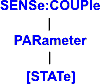

# Sense:Couple Commands

* * *

Click on a keyword to view the command details.

See Also

  * [Example Programs](../../GPIB_Example_Programs/SCPI_Example_Programs.md)

  * [Synchronizing the Analyzer and Controller](../../Learning_about_GPIB/Understanding_Command_Synchronization.md)

  * [SCPI Command Tree](../SCPI_Command_Tree.md)

* * *

## SENSe<cnum>:COUPle <ALL | NONE> OBSOLETE

This command is not necessary, and its use is not recommended. Setting the
sweep mode to NONE does not improve the quality of the measurement.
Applicable Models: All (Read-Write) Sets the sweep mode as Chopped or
Alternate. [Learn about Alternate Sweep](../../../S2_Opt/Crosstalk.md#Swp)  
---  
Parameters |   
<cnum> | Any existing channel number; if unspecified, value is set to 1.  
<ALL | NONE> | ALL \- Sweep mode set to Chopped - reflection and transmission measured on the same sweep. NONE \- Sweep mode set to Alternate \- reflection and transmission measured on separate sweeps. Increases sweep time  
Examples | SENS:COUP ALL  
sense2:couple none  
Query Syntax | SENSe<cnum>:COUPle?  
Return Type | Character  
[Default](JavaScript:hhctrl.TextPopup\(DefSCPI,'Arial,8',10,10,00000000,0xc0ffff\)) | ALL  
  
* * *

## SENSe<cnum>:COUPle:PARameter[:STATe] <bool>

Applicable Models: All (Read-Write) Turns ON and OFF Time Domain Trace
Coupling. All of the measurements in the specified channel are coupled.

  * To select Transform parameters to couple, use [CALC:MEAS:TRAN:COUP:PAR](../Calculate/MeasureTRANsform.md#CALCulate:MEASure:TRANsform:COUPle:PARameters)
  * To select Gating parameters to couple, use [CALC:MEAS:FILT:COUP:PAR](../Calculate/MeasureFILter.md#CALCulate:MEASure:FILTer:GATE:COUPle:PARameters)

Learn more about [Time Domain Trace
Coupling.](../../../Time/TimeDomain.htm#Coupling)  
---  
Parameters |   
<cnum> | Any existing channel number; if unspecified, value is set to 1.  
<bool> | ON (or 1) - Turns ON Time Domain Trace Coupling. OFF (or 0) - Turns OFF Time Domain Trace Coupling.  
Examples | SENS:COUP:PAR 0  
sense2:couple:parameter:state on  
Query Syntax | SENSe<cnum>:COUPle:PARameter[:STATe]?  
Return Type | Boolean  
[Default](JavaScript:hhctrl.TextPopup\(DefSCPI,'Arial,8',10,10,00000000,0xc0ffff\)) | ON (or 1)

