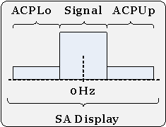
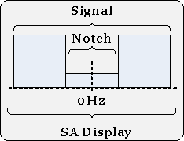

# Modulation Distortion Measurement

* * *

Defines the modulation distortion settings including measurement, RF path,
modulation source name, and sweep frequency and power.

SENSe: DISTortion | ADC | FILTer | TYPE | CORRection | COLLect | IF | ACQuire | EVM | NORMalize | FREQuency | TUNE | IMMediate | MEASure | BAND | ACP | LOWer | IBW | OFFSet | UPPer | IBW | OFFSet | ADD | AUTofill | CARRier | IBW | OFFSet | COUNt? | DELete | INITialize | NAME | NOTCh | IBW | OFFSet | TYPE | CORRelation | APERture | AUTO | [:STATe] | FILTer | ALPHa | SRATe | AUTO | [:STATe] | MODulate | SOURce | PATH | DUT | INPut | NOMinal | GAIN | NF | INCLude | OUTPut | SOURce | ATTenuation | INCLude | NOMinal | AMPLifier | PHASe | STITching | TYPE | PULSe | RECeiver | AUTO | SWEep | CARRier | FREQuency | DWELl | POWer | CARRier | LEVel | PORT | TYPE | LIST | ADD | DELete | LEVel | LOAD | NBW | MODE | POINts | RECeiver | ATTenuation | MODE | SAVE | SOURce | ATTenuation | MODE | RAMP | LEVel | STARt | STOP | NBW | AUTO | POINts | SPARam | LEVel | RETRace | POWer | SPARam | BWIDth | REUSe | [:STATe] | STEP | TYPE | TYPE | TABLe | CATalog? | DATA | CATalog? | CATalog:RELevant:MEASure | VALue | DISPlay | CATalog? | DELete | FEED | FONT | SAVE | SORT SA | BANDwidth | NOISe | AUTO  
---  
  
Click on a keyword to view the command details.

### See Also

  * [Learn about Modulation Distortion](../../../Applications/Modulation_Distortion/Overview.md)

  * [Synchronizing the Analyzer and Controller](../../Learning_about_GPIB/Understanding_Command_Synchronization.md)

  * [SCPI Command Tree](../SCPI_Command_Tree.md)

* * *

## SENSe<cnum>:DISTortion:ADC:FILTer:TYPE <enum>

Applicable Models: All with Option S93070xB or S95070A/B (Read-Write) Selects
between a narrow and wide IF filter anti-aliasing path.  
---  
Parameters |   
<cnum> |  Any existing Modulation Distortion channel. If unspecified, value is set to 1.  
<enum> |  Choose from: NARRow - Selects the ADC 11 MHz IF filter path.  WIDE - Selects the ADC 38 MHz IF filter path. AUTO - Automatically set the ADC Filter setting based on the ADC Sampling Frequency.  
Examples |  SENS:DIST:ADC:FILT:TYPE WIDE  
Query Syntax |  SENSe<cnum>:DISTortion:ADC:FILTer:TYPE?  
Return Type |  Enumeration  
Default |  AUTO  
  
* * *

## SENSe<cnum>:DISTortion:CORRection:COLLect:IF:ACQuire [SYNChronous | ASYNchronous]

Applicable Models: All with Option S93070xB or S95070A/B (Write-only) This
command launches the [Receiver IF
Cal](../../../Applications/Modulation_Distortion/Delta_IF_Cal.htm). The
optional argument allows the user to run the command with asynchronous
behavior.  
---  
Parameters |   
<cnum> |  Any existing Modulation Distortion channel. If unspecified, value is set to 1.  
[SYNChronous | ASYNchronous] |  Optional argument. Choose from: SYNChronous \- Blocks SCPI commands during standard measurement (default behavior). ASYNchronous \- Does NOT block SCPI commands during standard measurement. [Learn more about this argument](../../Learning_about_GPIB/Understanding_Command_Synchronization.md#Synch)  
Examples |  SENS:DIST:CORR:COLL:IF:ACQ ASYN  
Return Type |  Not applicable  
Default |  SYNC  
  
* * *

## SENSe<cnum>:DISTortion:EVM:NORMalize <num>

Applicable Models: All with Option S93070xB or S95070A/B (Read-Write) Sets and
returns the scaling factor applied to the EVM measurements. Enter a value
between 0.1 and 1.0.  
---  
Parameters |   
<cnum> |  Any existing Modulation Distortion channel. If unspecified, value is set to 1.  
<num> |  Scaling factor number between 0.1 and 1.0.  
Examples |  SENS:DIST:EVM:NORM 1  
Query Syntax |  SENSe<cnum>:DISTortion:EVM:NORMalize?  
Return Type |  Numeric  
Default |  1.0  
  
* * *

## SENSe<cnum>:DISTortion:FREQuency:TUNE:IMMediate

Applicable Models: All with Option S93070xB or S95070A/B (Write-only) Auto
tunes all measurement bands for the modulation distortion channel.  
---  
Parameters |   
<cnum> |  Any existing Modulation Distortion channel. If unspecified, value is set to 1.  
Examples |  SENS:DIST:FREQ:TUNE:IMM  
Return Type |  Not applicable  
Default |  Not applicable  
  
* * *

## SENSe<cnum>:DISTortion:MEASure:BAND<bnum>:ACP:LOWer:IBW <num>

Applicable Models: All with Option S93070xB or S95070A/B (Read-Write) Sets and
returns the integration bandwidth (IBW) of the lower ACP measurement (ACPLo).
The IBW is used to determine total signal power within a specified frequency
span. For example, to calculate the total power of a signal composed of 100
tones spaced 1 MHz apart over a 100 MHz span, the signal power would be
integrated over an IBW of 100 MHz.
  
---  
Parameters |   
<cnum> |  Any existing Modulation Distortion channel. If unspecified, value is set to 1.  
<bnum> |  Band number from 1 - 100. If unspecified, value is set to 1.  
<num> |  Lower ACP integration bandwidth.  
Examples |  SENS:DIST:MEAS:BAND:ACP:LOW:IBW 100 MHz  
Query Syntax |  SENSe<cnum>:DISTortion:MEASure:BAND<bnum>:ACP:LOWer:IBW?  
Return Type |  Numeric  
Default |  100 MHz  
  
* * *

## SENSe<cnum>:DISTortion:MEASure:BAND<bnum>:ACP:LOWer:OFFSet <num>

Applicable Models: All with Option S93070xB or S95070A/B (Read-Write) Sets and
returns the lower ACP measurement offset (ACPLo). Offsets the lower ACP
integration bandwidth relative to the LO used to generate the modulated
signal.   
---  
Parameters |   
<cnum> |  Any existing Modulation Distortion channel. If unspecified, value is set to 1.  
<bnum> |  Band number from 1 - 100. If unspecified, value is set to 1.  
<num> |  Lower ACP offset.  
Examples |  SENS:DIST:MEAS:BAND:ACP:LOW:OFFS -100 MHz  
Query Syntax |  SENSe<cnum>:DISTortion:MEASure:BAND<bnum>:ACP:LOWer:OFFSet?  
Return Type |  Numeric  
Default |  -100 MHz  
  
* * *

## SENSe<cnum>:DISTortion:MEASure:BAND<bnum>:ACP:UPPer:IBW <num>

Applicable Models: All with Option S93070xB or S95070A/B (Read-Write) Sets and
returns the integration bandwidth (IBW) of the upper ACP measurement (ACPUp).
The IBW is used to determine total signal power within a specified frequency
span. For example, to calculate the total power of a signal composed of 100
tones spaced 1 MHz apart over a 100 MHz span, the signal power would be
integrated over an IBW of 100 MHz.
  
---  
Parameters |   
<cnum> |  Any existing Modulation Distortion channel. If unspecified, value is set to 1.  
<bnum> |  Band number from 1 - 100. If unspecified, value is set to 1.  
<num> |  Upper ACP integration bandwidth.  
Examples |  SENS:DIST:MEAS:BAND:ACP:UPP:IBW 100 MHz  
Query Syntax |  SENSe<cnum>:DISTortion:MEASure:BAND<bnum>:ACP:UPPer:IBW?  
Return Type |  Numeric  
Default |  100 MHz  
  
* * *

## SENSe<cnum>:DISTortion:MEASure:BAND<bnum>:ACP:UPPer:OFFSet <num>

Applicable Models: All with Option S93070xB or S95070A/B (Read-Write) Sets and
returns the upper ACP measurement offset (ACPUp). Offsets the upper ACP
integration bandwidth relative to the LO used to generate the modulated
signal.   
---  
Parameters |   
<cnum> |  Any existing Modulation Distortion channel. If unspecified, value is set to 1.  
<bnum> |  Band number from 1 - 100. If unspecified, value is set to 1.  
<num> |  Upper ACP offset.  
Examples |  SENS:DIST:MEAS:BAND:ACP:UPP:OFFS 100 MHz  
Query Syntax |  SENSe<cnum>:DISTortion:MEASure:BAND<bnum>:ACP:UPPer:OFFSet?  
Return Type |  Numeric  
Default |  100 MHz  
  
* * *

## SENSe<cnum>:DISTortion:MEASure:BAND<bnum>:ADD

Applicable Models: All with Option S93070xB or S95070A/B (Write-only) Adds a
new distortion measurement band.  
---  
Parameters |   
<cnum> |  Any existing modulation distortion channel. If unspecified, value is set to 1  
<bnum> |  Band number from 1 - 100. If unspecified, value is set to 1.  
Examples |  SENS:DIST:MEAS:BAND:ADD  
Query Syntax |  Not applicable  
Default |  Not Applicable  
  
* * *

## SENSe<cnum>:DISTortion:MEASure:BAND<bnum>:AUTofill

Applicable Models: All with Option S93070xB or S95070A/B (Write-only)
Automatically fills in the measurement settings for all bands from the
currently active modulation file loaded in the source. [Learn
more](../../../Applications/Modulation_Distortion/Modulation_Distortion_Settings.htm#Autofill).  
---  
Parameters |   
<cnum> |  Any existing modulation distortion channel. If unspecified, value is set to 1  
<bnum> |  Band number from 1 - 100. If unspecified, value is set to 1.  
Examples |  SENS:DIST:MEAS:BAND:AUT  
Query Syntax |  Not applicable  
Default |  Not Applicable  
  
* * *

## SENSe<cnum>:DISTortion:MEASure:BAND<bnum>:CARRier:IBW <num>

Applicable Models: All with Option S93070xB or S95070A/B (Read-Write) Sets and
returns the carrier (Signal) integration bandwidth (IBW) for the distortion
measurement. The IBW is used to determine total signal power within a
specified frequency span. For example, to calculate the total power of a
signal composed of 100 tones spaced 1 MHz apart over a 100 MHz span, the
signal power would be integrated over an IBW of 100 MHz.
  
---  
Parameters |   
<cnum> |  Any existing Modulation Distortion channel. If unspecified, value is set to 1.  
<bnum> |  Band number from 1 - 100. If unspecified, value is set to 1.  
<num> |  Carrier integration bandwidth.  
Examples |  SENS:DIST:MEAS:BAND:CARR:IBW 100 MHz  
Query Syntax |  SENSe<cnum>:DISTortion:MEASure:BAND<bnum>:CARRier:IBW?  
Return Type |  Numeric  
Default |  100 MHz  
  
* * *

## SENSe<cnum>:DISTortion:MEASure:BAND<bnum>:CARRier:OFFSet <num>

Applicable Models: All with Option S93070xB or S95070A/B (Read-Write) Sets and
returns the carrier offset (Signal). Offsets the Carrier integration bandwidth
relative to the Carrier LO used to generate the modulation signal.
  
---  
Parameters |   
<cnum> |  Any existing Modulation Distortion channel. If unspecified, value is set to 1.  
<bnum> |  Band number from 1 - 100. If unspecified, value is set to 1.  
<num> |  Carrier offset.  
Examples |  SENS:DIST:MEAS:BAND:CARR:OFFS 0  
Query Syntax |  SENSe<cnum>:DISTortion:MEASure:BAND<bnum>:CARRier:OFFSet?  
Return Type |  Numeric  
Default |  0  
  
* * *

## SENSe<cnum>:DISTortion:MEASure:BAND<bnum>:COUNt?

Applicable Models: All with Option S93070xB or S95070A/B (Read-only) Queries
the total number of distortion measurement bands.  
---  
Parameters |   
<cnum> |  Any existing channel number. If unspecified, value is set to 1  
<bnum> |  Band number from 1 - 100. If unspecified, value is set to 1.  
Examples |  SENS:DIST:MEAS:BAND:COUN?  
Return Type |  Numeric  
Default |  Not Applicable  
  
* * *

## SENSe<cnum>:DISTortion:MEASure:BAND<bnum>:DELete

Applicable Models: All with Option S93070xB or S95070A/B (Write-only) Deletes
the specified distortion measurement band.  
---  
Parameters |   
<cnum> |  Any existing modulation distortion channel. If unspecified, value is set to 1  
<bnum> |  Band number from 1 - 100. If unspecified, value is set to 1.  
Examples |  SENS:DIST:MEAS:BAND:DEL 2  
Query Syntax |  Not applicable  
Default |  Not Applicable  
  
* * *

## SENSe<cnum>:DISTortion:MEASure:BAND<bnum>:INITialize

Applicable Models: All with Option S93070xB or S95070A/B (Write-only) This
command ignores any specified band number and deletes all existing bands and
adds a single default band back into the Measurement Band Table.  
---  
Parameters |   
<cnum> |  Any existing modulation distortion channel. If unspecified, value is set to 1  
<bnum> |  Band number from 1 - 100. If unspecified, value is set to 1.  
Examples |  SENS:DIST:MEAS:BAND:INIT 2  
Query Syntax |  Not applicable  
Default |  Not Applicable  
  
* * *

## SENSe<cnum>:DISTortion:MEASure:BAND<bnum>:NAME <string>

Applicable Models: All with Option S93070xB or S95070A/B (Read-Write) Assigns
a name to the specified distortion measurement band.  
---  
Parameters |   
<cnum> |  Any existing modulation distortion channel. If unspecified, value is set to 1  
<bnum> |  Band number from 1 - 100. If unspecified, value is set to 1.  
<string> |  String. Distortion measurement band name.  
Examples |  SENS:DIST:MEAS:BAND:NAME "New_Band"  
Query Syntax |  SENSe<cnum>:DISTortion:MEASure:BAND<bnum>:NAME?  
Return Type |  String  
Default |  "New Band"  
  
* * *

## SENSe<cnum>:DISTortion:MEASure:BAND<bnum>:NOTCh:IBW <num>

Applicable Models: All with Option S93070xB or S95070A/B (Read-Write) Sets and
returns the notch integration bandwidth (IBW) for an NPR Notch modulation
measurement. The IBW is used to determine total signal power within a
specified frequency span. For example, to calculate the total power of a notch
composed of 1000 tones spaced 100 kHz apart over a 100 MHz span, the notch
power would be integrated over an IBW of 100 MHz.
  
---  
Parameters |   
<cnum> |  Any existing Modulation Distortion channel. If unspecified, value is set to 1.  
<bnum> |  Band number from 1 - 100. If unspecified, value is set to 1.  
<num> |  Notch integration bandwidth.  
Examples |  SENS:DIST:MEAS:BAND:NOTC:IBW 10 MHz  
Query Syntax |  SENSe<cnum>:DISTortion:MEASure:BAND<bnum>:NOTCh:IBW?  
Return Type |  Numeric  
Default |  10 MHz  
  
* * *

## SENSe<cnum>:DISTortion:MEASure:BAND<bnum>:NOTCh:OFFSet <num>

Applicable Models: All with Option S93070xB or S95070A/B (Read-Write) Sets and
returns the notch offset for an NPR Notch modulation measurement. The offset
settings are relative to the carrier center frequency (0 Hz).
  
---  
Parameters |   
<cnum> |  Any existing Modulation Distortion channel. If unspecified, value is set to 1.  
<bnum> |  Band number from 1 - 100. If unspecified, value is set to 1.  
<num> |  Notch offset.  
Examples |  SENS:DIST:MEAS:BAND:NOTC:OFFS 0  
Query Syntax |  SENSe<cnum>:DISTortion:MEASure:BAND<bnum>:NOTCh:OFFSet?  
Return Type |  Numeric  
Default |  0  
  
* * *

## SENSe<cnum>:DISTortion:MEASure:BAND<bnum>:TYPE <enum>

Applicable Models: All with Option S93070xB or S95070A/B (Read-Write) Set and
read the modulation distortion type.  
---  
Parameters |   
<cnum> |  Any existing Modulation Distortion channel. If unspecified, value is set to 1.  
<bnum> |  Band number from 1 - 100. If unspecified, value is set to 1.  
<enum> |  Choose from: ACPEVM ACP BPWR EVM NPR [Learn about these settings.](../../../Applications/Modulation_Distortion/Modulation_Distortion_Settings.md#Measurement_Type)  
Examples |  SENS:DIST:MEAS:BAND:TYPE ACPEVM  
Query Syntax |  SENSe<cnum>:DISTortion:MEASure:BAND<bnum>:TYPE?  
Return Type |  Enumeration  
Default |  ACPEVM  
  
* * *

## SENSe<cnum>:DISTortion:MEASure:CORRelation:APERture <num>

Applicable Models: All with Option S93070xB or S95070A/B (Read-Write) Sets and
returns the frequency span window used for modeling the DUT's gain and
distortion.  
---  
Parameters |   
<cnum> |  Any existing Modulation Distortion channel. If unspecified, value is set to 1.  
<num> |  Distortion measurement DUT analysis bandwidth in Hz.  
Examples |  SENS:DIST:MEAS:CORR:APER 500000 Hz  
Query Syntax |  SENSe<cnum>:DISTortion:MEASure:CORRelation:APERture?  
Return Type |  Numeric  
Default |  500000  
  
* * *

## SENSe<cnum>:DISTortion:MEASure:CORRelation:APERture:AUTO[:STATe] <bool>

Applicable Models: All with Option S93070xB or S95070A/B (Read-Write) Enable
or disable automatic calculation of the frequency span window used for
modeling the DUT's gain and distortion.  
---  
Parameters |   
<cnum> |  Any existing modulation distortion channel. If unspecified, value is set to 1.  
<bool> |  Choose from: 0 - OFF \- Disable DUT analysis bandwidth settings. 1 - ON \- Enable DUT analysis bandwidth settings.  
Examples |  SENS:DIST:MEAS:CORR:APER :AUTO 1  
Query Syntax |  SENSe<cnum>:DISTortion:MEASure:CORRelation:APERture:AUTO[:STATe]?  
Return Type |  Boolean  
Default |  0  
  
* * *

## SENSe<cnum>:DISTortion:MEASure:FILTer <enum>

Applicable Models: All with Option S93070xB or S95070A/B (Read-Write) Sets the
measurement filter to either None (default) or RRC (root-raised-cosine filter)
for EVM and ACP measurements only.  
---  
Parameters |   
<cnum> |  Any existing Modulation Distortion channel. If unspecified, value is set to 1.  
<enum> |  Choose from: NONE - Do not use the measurement filter. RRC - Select the RRC measurement filter.  
Examples |  SENS:DIST:MEASure:FILT RRC  
Query Syntax |  SENSe<cnum>:DISTortion:MEASure:FILTer?  
Return Type |  Enumeration  
Default |  NONE  
  
* * *

## SENSe<cnum>:DISTortion:MEASure:FILTer:ALPHa <num>

Applicable Models: All with Option S93070xB or S95070A/B (Read-Write) Sets and
returns the Alpha factor of the measurement filter.  
---  
Parameters |   
<cnum> |  Any existing Modulation Distortion channel. If unspecified, value is set to 1.  
<num> |  Alpha factor of the measurement filter (0 to 1).  
Examples |  SENS:DIST:MEAS:FILT:ALPH 1  
Query Syntax |  SENSe<cnum>:DISTortion:MEASure:FILTer:ALPHa?  
Return Type |  Numeric  
Default |  0  
  
* * *

## SENSe<cnum>:DISTortion:MEASure:FILTer:SRATe <num>

Applicable Models: All with Option S93070xB or S95070A/B (Read-Write) Sets and
returns the Symbol Rate of the filter. If
SENSe:DISTortion:MEASure:FILTer:SRATe:AUTO[:STATe] is ON, the symbol rate from
the file is used. If no Symbol Rate is indicated in the file, then the Symbol
Rate will be approximated from the bandwidth of the signal.  
---  
Parameters |   
<cnum> |  Any existing Modulation Distortion channel. If unspecified, value is set to 1.  
<num> |  Symbol rate of the measurement filter (10 MHz to 50 GHz).  
Examples |  SENS:DIST:MEAS:FILT:SRAT 10E6  
Query Syntax |  SENSe<cnum>:DISTortion:MEASure:FILTer:ALPHa?  
Return Type |  Numeric  
Default |  0  
  
* * *

## SENSe<cnum>:DISTortion:MEASure:FILTer:SRATe:AUTO[:STATe] <bool>

Applicable Models: All with Option S93070xB or S95070A/B (Read-Write) Enables
or disables using the symbol rate from the file. If no Symbol Rate is
indicated in the file when this command is set to ON, then the Symbol Rate
will be approximated from the bandwidth of the signal.  
---  
Parameters |   
<cnum> |  Any existing modulation distortion channel. If unspecified, value is set to 1.  
<bool> |  Choose from: 0 - OFF -Do not use Symbol Rate from file. 1 - ON \- Use Symbol Rate from file.  
Examples |  SENS:DIST:MEAS:FILT:SRAT:AUTO 1  
Query Syntax |  SENSe<cnum>:DISTortion:MEASure:FILTer:SRATe:AUTO[:STATe]?  
Return Type |  Boolean  
Default |  1  
  
* * *

## SENSe<cnum>:DISTortion:MODulate:SOURce <string>

Applicable Models: All with Option S93070xB or S95070A/B (Read-Write) Sets and
returns the distortion modulation source name.  
---  
Parameters |   
<cnum> |  Any existing modulation distortion channel. If unspecified, value is set to 1  
<string> |  String. Distortion modulation source name.  
Examples |  SENS:DIST:MOD:SOUR "MyModSource"  
Query Syntax |  SENSe<cnum>:DISTortion:MODulate:SOURce?  
Return Type |  String  
Default |  Not Applicable  
  
* * *

## SENSe<cnum>:DISTortion:PATH:DUT:INPut <num>

Applicable Models: All with Option S93070xB or S95070A/B (Read-Write) Sets and
returns the VNA port number connected to the DUT input.  
---  
Parameters |   
<cnum> |  Any existing Modulation Distortion channel. If unspecified, value is set to 1.  
<num> |  VNA port number connected to the DUT input.  
Examples |  SENS:DIST:PATH:DUT:INP 1  
Query Syntax |  SENSe<cnum>:DISTortion:PATH:DUT:INPut?  
Return Type |  Numeric  
Default |  1  
  
* * *

## SENSe<cnum>:DISTortion:PATH:DUT:NOMinal:GAIN <num>

Applicable Models: All with Option S93070xB or S95070A/B (Read-Write) Sets and
returns the nominal DUT gain.  
---  
Parameters |   
<cnum> |  Any existing Modulation Distortion channel. If unspecified, value is set to 1.  
<num> |  Nominal DUT gain in dB.  
Examples |  SENS:DIST:PATH:DUT:NOM:GAIN 0  
Query Syntax |  SENSe<cnum>:DISTortion:PATH:DUT:NOMinal:GAIN?  
Return Type |  Numeric  
Default |  0  
  
* * *

## SENSe<cnum>:DISTortion:PATH:DUT:NOMinal:NF <num>

Applicable Models: All with Option S93070xB or S95070A/B (Read-Write) Sets and
returns the nominal DUT noise figure. This value is used by the EVM
measurement. This setting adds noise to the measurement for more realistic
results. Setting the noise figure to a low value (-200 dB) will make EVM
measurements without the effects of noise.  
---  
Parameters |   
<cnum> |  Any existing Modulation Distortion channel. If unspecified, value is set to 1.  
<num> |  Nominal DUT noise figure in dB.  
Examples |  SENS:DIST:PATH:DUT:NOM:NF 0  
Query Syntax |  SENSe<cnum>:DISTortion:PATH:DUT:NOMinal:NF?  
Return Type |  Numeric  
Default |  0  
  
* * *

## SENSe<cnum>:DISTortion:PATH:DUT:NOMinal:NF:INCLlude <bool>

Applicable Models: All with Option S93070xB or S95070A/B (Read-Write) Include
or exclude the nominal DUT noise figure value.  
---  
Parameters |   
<cnum> |  Any existing Modulation Distortion channel. If unspecified, value is set to 1.  
<num> |  Choose from: **0 - OFF** -Exclude Nominal DUT noise figure value. **1 - ON** \- Include Nominal DUT noise figure value.  
Examples |  SENS:DIST:PATH:DUT:NOM:NF:INCL ON  
Query Syntax |  SENSe<cnum>:DISTortion:PATH:DUT:NOMinal:NF:INCLude?  
Return Type |  Numeric  
Default |  0  
  
* * *

## SENSe<cnum>:DISTortion:PATH:DUT:OUTPut <num>

Applicable Models: All with Option S93070xB or S95070A/B (Read-Write) Sets and
returns the VNA port number connected to the DUT output.  
---  
Parameters |   
<cnum> |  Any existing Modulation Distortion channel. If unspecified, value is set to 1.  
<num> |  VNA port number connected to the DUT output.  
Examples |  SENS:DIST:PATH:DUT:OUTP 2  
Query Syntax |  SENSe<cnum>:DISTortion:PATH:DUT:OUTPut?  
Return Type |  Numeric  
Default |  2  
  
* * *

## SENSe<cnum>:DISTortion:PATH:SOURce:ATTenuation:INCLude <bool>

Applicable Models: All with Option S93070xB or S95070A/B (Read-Write) Enables
or disables the external modulated source to pass through the attenuator of
the specified PNA source and the attenuator setting is used to calculate the
power levels.  
---  
Parameters |   
<cnum> |  Any existing modulation distortion channel. If unspecified, value is set to 1.  
<bool> |  Choose from: 0 - OFF -Do not include attenuator. 1 - ON \- Include attenuator.  
Examples |  SENS:DIST:PATH:SOUR:ATT:INCL 1  
Query Syntax |  SENSe<cnum>:DISTortion:PATH:SOURce:ATTenuation:INCLude?  
Return Type |  Boolean  
Default |  1  
  
* * *

## SENSe<cnum>:DISTortion:PATH:SOURce:NOMinal:AMPLifier <num>

Applicable Models: All with Option S93070xB or S95070A/B (Read-Write) Sets and
returns the nominal gain of an external source amplifier. This value is used
by the Set Power At function, receiver leveling, and calibration.  
---  
Parameters |   
<cnum> |  Any existing Modulation Distortion channel. If unspecified, value is set to 1.  
<num> |  Nominal source amplifier gain in dB.  
Examples |  SENS:DIST:PATH:SOUR:NOM:AMPL 0  
Query Syntax |  SENSe<cnum>:DISTortion:PATH:SOURce:NOMinal:AMPLifier?  
Return Type |  Numeric  
Default |  0  
  
* * *

## SENSe<cnum>:DISTortion:PHASe:STITching:TYPE <enum>

Applicable Models: All with Option S93070xB or S95070A/B (Read-Write) Sets and
returns the phase stitching type.  
---  
Parameters |   
<cnum> |  Any existing Modulation Distortion channel. If unspecified, value is set to 1.  
<enum> |  Choose from: **AUTO -** Automatically selects between None, Overlap and Timestamp. **NONE -** In this mode there is amplitude stitching, but no phase stitching.  **OVERlap -** This measures 50% overlapping segments of frequency-domain data to determine the phase between measured segments. **TIMestamp -** This moves the LO coherently to determine the phase between measured frequency segments.   
Examples |  SENS:DIST:PHAS:STIT:TYPE TIM  
Query Syntax |  SENSe<cnum>:DISTortion:PHASe:STITching:TYPE?  
Return Type |  Enumeration  
Default |  AUTO  
  
* * *

## SENSe<cnum>:DISTortion:PULSe:RECeiver:AUTO <bool>

Applicable Models: All with Option S93070xB or S95070A/B (Read-Write) Enables
or disables receiver timing auto generation from the source pulse timing.  
---  
Parameters |   
<cnum> |  Any existing modulation distortion channel. If unspecified, value is set to 1.  
<bool> |  Choose from: 0 - OFF -Do not auto generate receiver timing. 1 - ON \- Auto generate receiver timing.  
Examples |  SENS:DIST:PULS:REC:AUTO 1  
Query Syntax |  SENSe<cnum>:DISTortion:PULSe:RECeiver:AUTO?  
Return Type |  Boolean  
Default |  1  
  
* * *

## SENSe<cnum>:DISTortion:SWEep:CARRier:FREQuency <num>

Applicable Models: All with Option S93070xB or S95070A/B (Read-Write) Sets and
returns the carrier center frequency.  
---  
Parameters |   
<cnum> |  Any existing Modulation Distortion channel. If unspecified, value is set to 1.  
<num> |  Carrier center frequency.  
Examples |  SENS:DIST:SWE:CARR:FREQ 1.5 GHz  
Query Syntax |  SENSe<cnum>:DISTortion:SWEep:CARRier:FREQuency?  
Return Type |  Numeric  
Default |  1.5 GHz  
  
* * *

## SENSe<cnum>:DISTortion:SWEep:DWELl <num>

Applicable Models: All with Option S93070xB or S95070A/B (Read-Write) Sets and
returns the delay in seconds before the test signal to allow the RF source to
settle.  
---  
Parameters |   
<cnum> |  Any existing Modulation Distortion channel. If unspecified, value is set to 1.  
<num> |  Delay time in seconds.  
Examples |  SENS:DIST:SWE:DWEL .1  
Query Syntax |  SENSe<cnum>:DISTortion:SWEep:LEVel?  
Return Type |  Numeric  
Default |  0  
  
* * *

## SENSe<cnum>:DISTortion:SWEep:POWer:CARRier:LEVel <num>

Applicable Models: All with Option S93070xB or S95070A/B (Read-Write) Sets and
returns the carrier power level used for the distortion test at either the
input or output of the DUT.  
---  
Parameters |   
<cnum> |  Any existing Modulation Distortion channel. If unspecified, value is set to 1.  
<num> |  Power level.  
Examples |  SENS:DIST:SWE:POW:CARR:LEV -10  
Query Syntax |  SENSe<cnum>:DISTortion:SWEep:POWer:CARRier:LEVel?  
Return Type |  Numeric  
Default |  -10 dBm  
  
* * *

## SENSe<cnum>:DISTortion:SWEep:POWer:CARRier:LEVel:PORT <enum>

Applicable Models: All with Option S93070xB or S95070A/B (Read-Write) Set and
read where to apply power to the DUT (input or output).  
---  
Parameters |   
<cnum> |  Any existing Modulation Distortion channel. If unspecified, value is set to 1.  
<enum> |  Choose from: DIN1 \- DUT input. DOUT2 \- DUT output.  
Examples |  SENS:DIST:SWE:POW:CARR:LEV:PORT DIN1  
Query Syntax |  SENSe<cnum>:DISTortion:SWEep:POWer:CARRier:LEVel:PORT?  
Return Type |  Enumeration  
Default |  DIN1  
  
* * *

## SENSe<cnum>:DISTortion:SWEep:POWer:CARRier:LEVel<index>:TYPE <enum>

Applicable Models: All with Option S93070xB or S95070A/B (Read-Write) Selects
between a ramp type power sweep or a list of power values to define a power
sweep.  
---  
Parameters |   
<cnum> |  Any existing Modulation Distortion channel. If unspecified, value is set to 1.  
<index> |  Power sweep row number. If unspecified, value is set to 1.  
<enum> |  Choose from: RAMP \- Selects a ramp type power sweep. LIST \- Selects a list of power values to define a power sweep.  
Examples |  SENS:DIST:SWE:POW:CARR:LEV1:TYPE RAMP  
Query Syntax |  SENSe<cnum>:DISTortion:SWEep:POWer:CARRier:LEVel<index>:TYPE?  
Return Type |  Enumeration  
Default |  RAMP  
  
* * *

## SENSe<cnum>:DISTortion:SWEep:POWer:CARRier:LIST<index>:ADD

Applicable Models: All with Option S93070xB or S95070A/B (Write-only) Adds a
new row to the power sweep list table.  
---  
Parameters |   
<cnum> |  Any existing Modulation Distortion channel. If unspecified, value is set to 1  
<index> |  Power sweep row number. If unspecified, value is set to 1.  
Examples |  SENS:DIST:SWE:POW:CARR:LIST1:ADD  
Query Syntax |  Not applicable  
Default |  Not Applicable  
  
* * *

## SENSe<cnum>:DISTortion:SWEep:POWer:CARRier:LIST<index>:DELete

Applicable Models: All with Option S93070xB or S95070A/B (Write-only) Deletes
the specified row from the power sweep list table.  
---  
Parameters |   
<cnum> |  Any existing Modulation Distortion channel. If unspecified, value is set to 1  
<index> |  Power sweep row number. If unspecified, value is set to 1.  
Examples |  SENS:DIST:SWE:POW:CARR:LIST1:DEL  
Query Syntax |  Not applicable  
Default |  Not Applicable  
  
* * *

## SENSe<cnum>:DISTortion:SWEep:POWer:CARRier:LIST<index>:LEVel <num>

Applicable Models: All with Option S93070xB or S95070A/B (Read-Write) Sets and
returns the power level used for the specified row in the power sweep list
table.  
---  
Parameters |   
<cnum> |  Any existing Modulation Distortion channel. If unspecified, value is set to 1.  
<index> |  Power sweep row number. If unspecified, value is set to 1.  
<num> |  Power level.  
Examples |  SENS:DIST:SWE:POW:CARR:LIST1:LEV -20  
Query Syntax |  SENSe<cnum>:DISTortion:SWEep:POWer:CARRier:LIST<index>:LEVel?  
Return Type |  Numeric  
Default |  -10 dBm  
  
* * *

## SENSe<cnum>:DISTortion:SWEep:POWer:CARRier:LIST<index>:LOAD <fileName>

Applicable Models: All with Option S93070xB or S95070A/B (Write-only)
Specifies the file path to recall a previous power sweep list file.  
---  
Parameters |   
<cnum> |  Any existing Modulation Distortion channel. If unspecified, value is set to 1.  
<index> |  Power sweep row number. If unspecified, value is set to 1.  
<fileName> |  (String) Power sweep file name (*.csv).  
Examples |  SENS:DIST:SWE:POW:CARR:LIST1:LOAD "C:/myPowerSweepList.csv"  
Query Syntax |  Not applicable  
Default |  Not applicable  
  
* * *

## SENSe<cnum>:DISTortion:SWEep:POWer:CARRier:LIST<index>:NBW <num>

Applicable Models: All with Option S93070xB or S95070A/B (Read-Write) Sets and
returns the noise bandwidth setting used for the specified row in the power
sweep list table.  
---  
Parameters |   
<cnum> |  Any existing Modulation Distortion channel. If unspecified, value is set to 1.  
<index> |  Power sweep row number. If unspecified, value is set to 1.  
<num> |  Noise bandwidth value.  
Examples |  SENS:DIST:SWE:POW:CARR:LIST1:NBW 100 Hz  
Query Syntax |  SENSe<cnum>:DISTortion:SWEep:POWer:CARRier:LIST<index>:NBW?  
Return Type |  Numeric  
Default |  100 Hz  
  
* * *

## SENSe<cnum>:DISTortion:SWEep:POWer:CARRier:LIST<index>:NBW:MODE <enum>

Applicable Models: All with Option S93070xB or S95070A/B (Read-Write) Selects
the noise bandwidth mode in the power sweep list table.  
---  
Parameters |   
<cnum> |  Any existing Modulation Distortion channel. If unspecified, value is set to 1.  
<index> |  Power sweep row number. If unspecified, value is set to 1.  
<enum> |  Choose from: FIXed \- Sets all noise bandwidth values in the power sweep list table to the same value. CUSTom \- Each noise bandwidth setting in the power sweep list table may be different. AUTO \- The Noise BW setting will be used for the minimum power level. As the power level increases, the Noise BW will increase automatically. This results in faster measurements and ensures that the noise error is approximately the same for each power level.  
Examples |  SENS:DIST:SWE:POW:CARR:LIST1:NBW:MODE FIX  
Query Syntax |  SENSe<cnum>:DISTortion:SWEep:POWer:CARRier:LIST<index>:NBW:MODE?  
Return Type |  Enumeration  
Default |  FIXed  
  
* * *

## SENSe<cnum>:DISTortion:SWEep:POWer:CARRier:LIST<index>:POINts <num>

Applicable Models: All with Option S93070xB or S95070A/B (Read-Write) Sets and
returns the number of power points to measure for the power sweep list
measurement.  
---  
Parameters |   
<cnum> |  Any existing Modulation Distortion channel. If unspecified, value is set to 1.  
<index> |  Power sweep row number. If unspecified, value is set to 1.  
<num> |  Number of power points to measure.  
Examples |  SENS:DIST:SWE:POW:CARR:LIST1:POIN 10  
Query Syntax |  SENSe<cnum>:DISTortion:SWEep:POWer:CARRier:LIST<index>:POINts?  
Return Type |  Numeric  
Default |  11  
  
* * *

## SENSe<cnum>:DISTortion:SWEep:POWer:CARRier:LIST<index>:RECeiver:ATTenuation
<num>

Applicable Models: All with Option S93070xB or S95070A/B (Read-Write) Sets and
returns the receiver attenuation for the specified row in the power sweep list
table.  
---  
Parameters |   
<cnum> |  Any existing Modulation Distortion channel. If unspecified, value is set to 1.  
<index> |  Power sweep row number. If unspecified, value is set to 1.  
<num> |  Receiver attenuation value.  
Examples |  SENS:DIST:SWE:POW:CARR:LIST1:REC:ATT 0  
Query Syntax |  SENSe<cnum>:DISTortion:SWEep:POWer:CARRier:LIST<index>:RECeiver:ATTenuation?  
Return Type |  Numeric  
Default |  0 dB  
  
* * *

##
SENSe<cnum>:DISTortion:SWEep:POWer:CARRier:LIST<index>:RECeiver:ATTenuation:MODE
<enum>

Applicable Models: All with Option S93070xB or S95070A/B (Read-Write) Selects
the receiver attenuation mode in the power sweep list table.  
---  
Parameters |   
<cnum> |  Any existing Modulation Distortion channel. If unspecified, value is set to 1.  
<index> |  Power sweep row number. If unspecified, value is set to 1.  
<enum> |  Choose from: FIXed \- Sets all receiver attenuation values in the power sweep list table to the same value. CUSTom \- Each receiver attenuation setting in the power sweep list table may be different.  
Examples |  SENS:DIST:SWE:POW:CARR:LIST1:REC:ATT:MODE FIX  
Query Syntax |  SENSe<cnum>:DISTortion:SWEep:POWer:CARRier:LIST<index>:RECeiver:ATTenuation:MODE?  
Return Type |  Enumeration  
Default |  FIXed  
  
* * *

## SENSe<cnum>:DISTortion:SWEep:POWer:CARRier:LIST<index>:SAVE <fileName>

Applicable Models: All with Option S93070xB or S95070A/B (Write-only)
Specifies the file path to save a power sweep list file.  
---  
Parameters |   
<cnum> |  Any existing Modulation Distortion channel. If unspecified, value is set to 1.  
<index> |  Power sweep row number. If unspecified, value is set to 1.  
<fileName> |  (String) Power sweep file name (*.csv).  
Examples |  SENS:DIST:SWE:POW:CARR:LIST1:SAVE "C:/myPowerSweepList.csv"  
Query Syntax |  Not applicable  
Default |  Not applicable  
  
* * *

## SENSe<cnum>:DISTortion:SWEep:POWer:CARRier:LIST<index>:SOURce:ATTenuation
<num>

Applicable Models: All with Option S93070xB or S95070A/B (Read-Write) Sets and
returns the source attenuation for the specified row in the power sweep list
table.  
---  
Parameters |   
<cnum> |  Any existing Modulation Distortion channel. If unspecified, value is set to 1.  
<index> |  Power sweep row number. If unspecified, value is set to 1.  
<num> |  Source attenuation value.  
Examples |  SENS:DIST:SWE:POW:CARR:LIST1:SOUR:ATT 0  
Query Syntax |  SENSe<cnum>:DISTortion:SWEep:POWer:CARRier:LIST<index>:SOURce:ATTenuation?  
Return Type |  Numeric  
Default |  0 dB  
  
* * *

##
SENSe<cnum>:DISTortion:SWEep:POWer:CARRier:LEVel<index>:SOURce:ATTenuation:MODE
<enum>

Applicable Models: All with Option S93070xB or S95070A/B (Read-Write) Selects
the source attenuation mode in the power sweep list table.  
---  
Parameters |   
<cnum> |  Any existing Modulation Distortion channel. If unspecified, value is set to 1.  
<index> |  Power sweep row number. If unspecified, value is set to 1.  
<enum> |  Choose from: FIXed \- Sets all source attenuation values in the power sweep list table to the same value. CUSTom \- Each source attenuation setting in the power sweep list table may be different.  
Examples |  SENS:DIST:SWE:POW:CARR:LIST1:SOUR:ATT:MODE FIX  
Query Syntax |  SENSe<cnum>:DISTortion:SWEep:POWer:CARRier:LIST<index>:SOURce:ATTenuation:MODE?  
Return Type |  Enumeration  
Default |  FIXed  
  
* * *

## SENSe<cnum>:DISTortion:SWEep:POWer:CARRier:RAMP:LEVel<index>:STARt <num>

Applicable Models: All with Option S93070xB or S95070A/B (Read-Write) Sets and
returns the starting power level for the power sweep ramp measurement.  
---  
Parameters |   
<cnum> |  Any existing Modulation Distortion channel. If unspecified, value is set to 1.  
<index> |  Power sweep row number. If unspecified, value is set to 1.  
<num> |  Starting power level.  
Examples |  SENS:DIST:SWE:POW:CARR:RAMP:LEV:STAR -20  
Query Syntax |  SENSe<cnum>:DISTortion:SWEep:POWer:CARRier:RAMP:LEVel<index>:STARt?  
Return Type |  Numeric  
Default |  -20 dBm  
  
* * *

## SENSe<cnum>:DISTortion:SWEep:POWer:CARRier:RAMP:LEVel<index>:STOP <num>

Applicable Models: All with Option S93070xB or S95070A/B (Read-Write) Sets and
returns the stop power level for the power sweep ramp measurement.  
---  
Parameters |   
<cnum> |  Any existing Modulation Distortion channel. If unspecified, value is set to 1.  
<index> |  Power sweep row number. If unspecified, value is set to 1.  
<num> |  Stop power level.  
Examples |  SENS:DIST:SWE:POW:CARR:RAMP:LEV:STOP -10  
Query Syntax |  SENSe<cnum>:DISTortion:SWEep:POWer:CARRier:RAMP:LEVel<index>:STOP?  
Return Type |  Numeric  
Default |  -10 dBm  
  
* * *

## SENSe<cnum>:DISTortion:SWEep:POWer:CARRier:RAMP:NBW:AUTO <bool>

Applicable Models: All with Option S93070xB or S95070A/B (Read-Write) Enable
or disable increasing noise bandwidth at high powers automatically for faster
measurements.  
---  
Parameters |   
<cnum> |  Any existing modulation distortion channel. If unspecified, value is set to 1.  
<bool> |  Choose from: 0 - OFF \- Disable auto-increase NBW at high powers. 1 - ON \- Enable auto-increase NBW at high powers.  
Examples |  SENS:DIST:SWE:POW:CARR:RAMP:NBW:AUTO 1  
Query Syntax |  SENSe<cnum>:DISTortion:SWEep:POWer:CARRier:RAMP:NBW:AUTO?  
Return Type |  Boolean  
Default |  0  
  
* * *

## SENSe<cnum>:DISTortion:SWEep:POWer:CARRier:RAMP:POINts <num>

Applicable Models: All with Option S93070xB or S95070A/B (Read-Write) Sets and
returns the number of power points to measure for the power sweep ramp
measurement.  
---  
Parameters |   
<cnum> |  Any existing Modulation Distortion channel. If unspecified, value is set to 1.  
<num> |  Number of power points to measure.  
Examples |  SENS:DIST:SWE:POW:CARR:RAMP:POIN 10  
Query Syntax |  SENSe<cnum>:DISTortion:SWEep:POWer:CARRier:RAMP:POINts?  
Return Type |  Numeric  
Default |  11  
  
* * *

## SENSe<cnum>:DISTortion:SWEep:POWer:SPARam:LEVel <num>

Applicable Models: All with Option S93070xB or S95070A/B (Read-Write) Sets and
returns the power level used to measure the DUT S-parameters when operating in
its linear region. These S-parameters are used to calculate distortion.  
---  
Parameters |   
<cnum> |  Any existing Modulation Distortion channel. If unspecified, value is set to 1.  
<num> |  Power level.  
Examples |  SENS:DIST:SWE:POW:SPAR:LEV -30  
Query Syntax |  SENSe<cnum>:DISTortion:SWEep:POWer:SPARam:LEVel?  
Return Type |  Numeric  
Default |  -30 dBm  
  
* * *

## SENSe<cnum>:DISTortion:SWEep:RETRace:POWer <enum>

Applicable Models: All with Option S93070xB or S95070A/B (Read-Write) Keeps RF
power ON at the End of Sweep.  
---  
Parameters |   
<cnum> |  Any existing Modulation Distortion channel. If unspecified, value is set to 1.  
<enum> |  Choose from: AUTO-  RF Power is not forced off at the end of a sweep. OFF\- RF Power will turn off at the end of a sweep.  
Examples |  SENS:DIST:SWE:RETR:POW  
Query Syntax |  SENSe<cnum>:DISTortion:SWEep:RETRace:POWer?  
Return Type |  Enumeration  
Default |  AUTO  
  
* * *

## SENSe<cnum>:DISTortion:SWEep:SPARam:BWIDth <num>

Applicable Models: All with Option S93070xB or S95070A/B (Read-Write) Sets and
returns the IF bandwidth for the linear S21 sweep.  
---  
Parameters |   
<cnum> |  Any existing Modulation Distortion channel. If unspecified, value is set to 1.  
<num> |  IF bandwidth.  
Examples |  SENS:DIST:SWE:SPAR:BWID 1 kHz  
Query Syntax |  SENSe<cnum>:DISTortion:SWEep:SPARam:BWIDth?  
Return Type |  Numeric  
Default |  1 kHz  
  
* * *

## SENSe<cnum>:DISTortion:SWEep:SPARam:REUSe <bool>

Applicable Models: All with Option S93070xB or S95070A/B (Read-Write) Enable
or disable the re-use of the previous linear S-parameter measurements if
available and skip sweep.  
---  
Parameters |   
<cnum> |  Any existing modulation distortion channel. If unspecified, value is set to 1.  
<bool> |  Choose from: 0 - OFF \- Disable linear power sweep. 1 - ON \- Enable linear power sweep.  
Examples |  SENS:DIST:SWE:SPAR:REUS 1  
Query Syntax |  SENSe<cnum>:DISTortion:SWEep:SPARam:RESUe?  
Return Type |  Boolean  
Default |  0  
  
* * *

## SENSe<cnum>:DISTortion:SWEep:SPARam[:STATe] <bool>

Applicable Models: All with Option S93070xB or S95070A/B (Read-Write) Enable
or disable S-parameter sweep. If disabled, curve fitting (smoothing) is used
instead of the S-parameter sweep. Curve fitting can be adjusted by varying the
window aperture using the SENSe:DISTortion:MEASure:CORRelation:APERture
command.  
---  
Parameters |   
<cnum> |  Any existing modulation distortion channel. If unspecified, value is set to 1.  
<bool> |  Choose from: 0 - OFF \- Disable S-parameter sweep and use curve fitting. 1 - ON \- Enable S-parameter sweep.  
Examples |  SENS:DIST:SWE:SPAR 1  
Query Syntax |  SENSe<cnum>:DISTortion:SWEep:SPARam[:STATe]?  
Return Type |  Boolean  
Default |  0  
  
* * *

## SENSe<cnum>:DISTortion:SWEep:SPARam:STEP <num>

Applicable Models: All with Option S93070xB or S95070A/B (Read-Write) Sets and
returns the step size for the linear S21 sweep.  
---  
Parameters |   
<cnum> |  Any existing Modulation Distortion channel. If unspecified, value is set to 1.  
<num> |  Linear S21 step size.  
Examples |  SENS:DIST:SWE:SPAR:STEP 1 MHz  
Query Syntax |  SENSe<cnum>:DISTortion:SWEep:SPARam:STEP?  
Return Type |  Numeric  
Default |  1 MHz  
  
* * *

## SENSe<cnum>:DISTortion:SWEep:SPARam:TYPE <enum>

Applicable Models: All with Option S93070xB or S95070A/B (Read-Write) Selects
a chirp signal from the external signal generator.  
---  
Parameters |   
<cnum> |  Any existing Modulation Distortion channel. If unspecified, value is set to 1.  
<enum> |  Choose from: ECHirp - Selects a chirp signal.   
Examples |  SENS:DIST:SWE:SPAR:TYPE ECH  
Query Syntax |  SENSe<cnum>:DISTortion:SWEep:SPARam:TYPE?  
Return Type |  Enumeration  
Default |  ECHirp  
  
* * *

## SENSe<cnum>:DISTortion:SWEep:TYPE <enum>

Applicable Models: All with Option S93070xB or S95070A/B (Read-Write) Selects
between a fixed or power sweep type of sweep.  
---  
Parameters |   
<cnum> |  Any existing Modulation Distortion channel. If unspecified, value is set to 1.  
<enum> |  Choose from: FIXed - Measures a modulated signal with a fixed carrier LO frequency and power level. POWer - Sweeps the total power of the modulated signal. This power may be defined at the input or output of the DUT.  
Examples |  SENS:DIST:SWE:TYPE POW  
Query Syntax |  SENSe<cnum>:DISTortion:SWEep:TYPE?  
Return Type |  Enumeration  
Default |  FIXed  
  
* * *

## SENSe<cnum>:DISTortion:TABLe:CATalog?

Applicable Models: All with Option S93070xB or S95070A/B (Read-only) Returns a
list of existing band names from the Measurement Band Table.  
---  
Parameters |   
<cnum> |  Any existing Modulation Distortion channel. If unspecified, value is set to 1.  
Examples |  SENS:DIST:TABL:CAT? sense2:distortion:table:catalog?  
Return Type |  String  
Default |  Not applicable  
  
* * *

## SENSe<cnum>:DISTortion:TABLe:DATA:CATalog?

Applicable Models: All with Option S93070xB or S95070A/B (Read-only) Returns a
list of data parameter names corresponding to the currently specified
Measurement Type using the SENSe:DISTortion:MEASure:BAND:TYPE command..  
---  
Parameters |   
<cnum> |  Any existing Modulation Distortion channel. If unspecified, value is set to 1.  
Examples |  SENS:DIST:MEAS:BAND:TYPE ACP SENS:DIST:TABL:DATA:CAT? "ACP LoOut2 dBc,ACP LoOut2 dBm,ACP LoOut2 dBm/Hz,ACP LoDist21 dBc,ACP LoIBW,ACP LoOffsFreq,ACP UpIn1 dBc,ACP UpIn1 dBm,ACP UpIn1 dBm/Hz,ACP UpOut2 dBc,ACP UpOut2 dBm,ACP UpOut2 dBm/Hz,ACP UpDist21 dBc,ACP UpIBW,ACP UpOffsFreq"  
Return Type |  String  
Default |  Not applicable  
  
* * *

## SENSe<cnum>:DISTortion:TABLe:DATA:CATalog:RELevant:MEASure<mnum>?

Applicable Models: All with Option S93070xB or S95070A/B (Read-only) Returns
the distortion table items (the column names) relevant to Distortion trace N.
For example, if tr1 is "EvmDistUn41", it returns "EVM DistEq41 dBc,EVM
DistEq41 %"; Note that, if trN is not a Distortion trace, it returns an empty
string..  
---  
Parameters |   
<cnum> |  Any existing Modulation Distortion channel. If unspecified, value is set to 1.  
<mnum> |  Measurement number for each measurement. There must be a selected measurement on the trace. If unspecified, <mnum> is set to 1.  
Examples |  SENS:DIST:TABL:DATA:CAT:REL:MEAS?  
Return Type |  String  
Default |  Not applicable  
  
* * *

## SENSe<cnum>:DISTortion:TABLe:DATA:VALue? <bandid>,<paramName>

Applicable Models: All with Option S93070xB or S95070A/B (Read-only) Returns a
list of data values from the Distortion Table for the specified band and
parameter name.  
---  
Parameters |   
<cnum> |  Any existing Modulation Distortion channel. If unspecified, value is set to 1.  
<bandid> |  Band number.  
<paramName> |  Parameter name. For example, "ACP LoOut2 dBc".  
Examples |  SENS:DIST:TABL:DATA:VAL? 1,"ACP LoOut2 dBc" sense2:distortion:table:data:value? 1,"ACP LoOut2 dBc"  
Return Type |  Numeric  
Default |  Not applicable  
  
* * *

## SENSe<cnum>:DISTortion:TABLe:DISPlay:CATalog?

Applicable Models: All with Option S93070xB or S95070A/B (Read-only) Returns
the currently displayed [Distortion
Table](../../../Applications/Modulation_Distortion/Displaying_Distortion_Parameters.htm#Distortion_Table_dialog_help)
parameters.  
---  
Parameters |   
<cnum> |  Any existing Modulation Distortion channel. If unspecified, value is set to 1.  
Return Type |  String of Character values, separated by commas  
Example |  SENS:DIST:TABL:DISP:CAT?:  
"Carrier Out2 dBm,Carrier IBW,EVM DistEq21 dBc,ACP LoOut2 dBc,ACP UpOut2 dBc"  
Default |  Not applicable  
  
* * *

## SENSe<cnum>:DISTortion:TABLe:DISPlay:DELete <paramName>

Applicable Models: All with Option S93070xB or S95070A/B (Write-only) Deletes
the specified parameter from the [Distortion
Table](../../../Applications/Modulation_Distortion/Displaying_Distortion_Parameters.htm#Distortion_Table_dialog_help).  
---  
Parameters |   
<cnum> |  Any existing Modulation Distortion channel. If unspecified, value is set to 1.  
<paramName> |  Distortion Table parameter name.  
Example |  SENS:DIST:TABL:DISP:DEL "Carrier IBW"  
Return Type |  String  
Default |  Not applicable  
  
* * *

## SENSe<cnum>:DISTortion:TABLe:DISPlay:FEED <paramName>

Applicable Models: All with Option S93070xB or S95070A/B (Write-only) Adds the
specified parameter to the [Distortion
Table](../../../Applications/Modulation_Distortion/Displaying_Distortion_Parameters.htm#Distortion_Table_dialog_help).  
---  
Parameters |   
<cnum> |  Any existing Modulation Distortion channel. If unspecified, value is set to 1.  
<paramName> |  Distortion Table parameter name.  
Example |  SENS:DIST:TABL:DISP:FEED "Carrier IBW"  
Return Type |  String  
Default |  Not applicable  
  
* * *

## SENSe<cnum>:DISTortion:TABLe:DISPlay:FONT <enum>

Applicable Models: All with Option S93070xB or S95070A/B (Read-Write) Selects
between a small- and medium-sized font displayed below the trace area of the
display.  
---  
Parameters |   
<cnum> |  Any existing Modulation Distortion channel. If unspecified, value is set to 1.  
<enum> |  Choose from: SMALl \- Sets the font size to small. MEDium \- Sets the font size to medium.  
Examples |  SENS:DIST:TABL:DISP:FONT SMAL  
Query Syntax |  SENSe<cnum>:DISTortion:TABLe:DISPlay:FONT?  
Return Type |  Enumeration  
Default |  SMALl  
  
* * *

## SENSe<cnum>:DISTortion:TABLe:DISPlay:SAVE <filepath>

Applicable Models: All with Option S93070xB or S95070A/B (Write-only)
Specifies the file path to save a modulation distortion table file.  
---  
Parameters |   
<cnum> |  Any existing Modulation Distortion channel. If unspecified, value is set to 1.  
<filepath> |  (String) Modulation distortion table path and file name (*.csv).  
Examples |  SENS:DIST:TABLe:DISPlay:SAVE "C:/myModDistortionTable.csv"  
Query Syntax |  Not applicable  
Default |  Not applicable  
  
* * *

## SENSe<cnum>:DISTortion:TABLe:DISPlay:SORT <enum>

Applicable Models: All with Option S93070xB or S95070A/B (Read-Write) Selects
between sorting the modulation distortion table by band or by power.  
---  
Parameters |   
<cnum> |  Any existing Modulation Distortion channel. If unspecified, value is set to 1.  
<enum> |  Choose from: BAND - Sort modulation distortion table by band. POWer \- Sort modulation distortion table by power.  
Examples |  SENS:DIST:TABL:DISP:SORT POW  
Query Syntax |  SENSe<cnum>:DISTortion:TABLe:DISPlay:SORT?  
Return Type |  Enumeration  
Default |  BAND  
  
* * *

## SENSe<cnum>:SA:BANDwidth:NOISe <num>

Applicable Models: All with Option S93070xB or S95070A/B (Read-Write) Sets and
returns the noise bandwidth. The Noise Bandwidth is equal to the Resolution BW
divided by the Vector Average factor. You cannot directly set the Resolution
BW or Vector Average in a Modulation Distortion channel. Resolution BW is
always set to its maximum value for the given signal chosen. Vector Average is
automatically set depending on the noise bandwidth setting.  
---  
Parameters |   
<cnum> |  Any existing Modulation Distortion channel. If unspecified, value is set to 1.  
<num> |  Noise bandwidth value.  
Examples |  SENS:SA:BAND:NOIS 100  
Query Syntax |  SENSe<cnum>:SA:BANDwidth:NOISe?  
Return Type |  Numeric  
Default |  100  
  
* * *

## SENSe<cnum>:SA:BANDwidth:NOISe:AUTO <bool>

Applicable Models: All with Option S93070xB or S95070A/B (Read-Write) Enable
or disable setting the noise bandwidth to its maximum possible value. This
results in the fastest possible sweep but increases the noise floor. If Auto
is enabled, then the Vector Average is set to 1, resulting in the widest noise
bandwidth.  
---  
Parameters |   
<cnum> |  Any existing modulation distortion channel. If unspecified, value is set to 1.  
<bool> |  Choose from: 0 - OFF \- Disable auto noise bandwidth settings. 1 - ON \- Enable auto noise bandwidth settings.  
Examples |  SENS:SA:BAND:NOIS:AUTO 1  
Query Syntax |  SENSe<cnum>:SA:BANDwidth:NOISe:AUTO?  
Return Type |  Boolean  
Default |  0  
  
* * *

