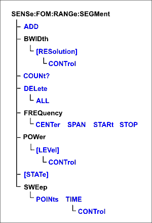

# Sense:FOM:Range:Segment Commands

* * *

Constructs a segment table for a specified [UNCOUPLED](FOM.md#coupled) FOM
range.

Note: Do NOT use [Sens:Segment](Segment.md) commands for FOM segment sweep.

Click on a red keyword to view the command details.

See Also

  * [Other SENSe:FOM Commands](FOM.md)

  * [Example Programs](../../GPIB_Example_Programs/SCPI_Example_Programs.md)

  * [Synchronizing the Analyzer and Controller](../../Learning_about_GPIB/Understanding_Command_Synchronization.md)

  * [SCPI Command Tree](../SCPI_Command_Tree.md)

* * *

## SENSe<cnum>:FOM:RANGe<n>:SEGMent<s>:ADD

Applicable Models: All with FOM Options (S9x080A/B, S9x082A/B, S9x083A/B)
(Write-only) Adds a segment.  
---  
Parameters |   
<cnum> | Any existing channel number; if unspecified, value is set to 1.  
<n> | Range number. If unspecified, value is set to 1.  
<s> | Segment number to add. If unspecified, value is set to 1. Segment numbers must be sequential. If a new number is added where one currently exists, the existing segment and those following are incremented by one.  
Examples | Two Segments exist (1 and 2). The following command will add a new segment (1). The existing (1 and 2) will become (2 and 3) respectively. sense2:fom:range2:segment:add  
Query Syntax | Not Applicable  
[Default](JavaScript:hhctrl.TextPopup\(DefSCPI,'Arial,8',10,10,00000000,0xc0ffff\)) | Not Applicable  
  
* * *

## SENSe<cnum>:FOM:RANGe<n>:SEGMent<s>:BWIDth[:RESolution] <num>

Applicable Models: All with FOM Options (S9x080A/B, S9x082A/B, S9x083A/B)
(Read-Write) Sets the IF Bandwidth for the specified segment. First set
[SENS:FOM:RANGe:SEGM:BWIDth:CONTrol ON](FOMSegm.md#IFBWControl). All
subsequent segments that are added assume the new IF Bandwidth value. Valid
either for Receiver range or for Primary range when coupled to Receiver.  
---  
Parameters |   
<cnum> | Any existing channel number; if unspecified, value is set to 1.  
<n> | Range number. If unspecified, value is set to 1.  
<s> | Segment number for which to set independent IF Bandwidth.  
<num> | IF Bandwidth in Hz. The list of valid IF Bandwidths is different depending on the VNA model. [See the list of valid IFBW values](../../../S2_Opt/Trce_Noise.md#IFDiag). If an invalid number is specified, the analyzer will round up to the closest valid number.  
Examples | SENS:FOM:RANG:SEGM:BWIDth 100 sense2:fom:range2:segment4:bwidth:resolution 1e3  
Query Syntax | SENSe<cnum>:FOM:RANGe<n>:SEGMent<s>:BWIDth[:RESolution]?  
Return Type | Numeric  
[Default](JavaScript:hhctrl.TextPopup\(DefSCPI,'Arial,8',10,10,00000000,0xc0ffff\)) | Varies with model.  
  
* * *

## SENSe<cnum>:FOM:RANGe<n>:SEGMent:BWIDth[:RESolution]:CONTrol <bool>

Applicable Models: All with FOM Options (S9x080A/B, S9x082A/B, S9x083A/B)
(Read-Write) Specifies whether the IF Bandwidth resolution can be set
independently for each segment. When set, each segment added after this will
be set to ON automatically. Valid either for Receiver range or for Primary
range. Primary range value is ignored unless Receiver is coupled to Primary.  
---  
Parameters |   
<cnum> | Any existing channel number; if unspecified, value is set to 1.  
<n> | Range number. If unspecified, value is set to 1.  
<bool> | ON (or 1) - turns Bandwidth control ON. Bandwidth can be set for each segment OFF (or 0) - turns Bandwidth control OFF. Use the channel IF bandwidth setting instead.  
Examples | SENS:FOM:RANG:SEGM:BWIDth:CONT 0 sense2:fom:range2:segment:bwidth:resolution:control 1  
Query Syntax | SENSe<cnum>:FOM:RANGe<n>:SEGMent:BWIDth[:RESolution]:CONTrol?  
Return Type | Boolean  
[Default](JavaScript:hhctrl.TextPopup\(DefSCPI,'Arial,8',10,10,00000000,0xc0ffff\)) | OFF  
  
* * *

## SENSe<cnum>:FOM:RANGe<n>:SEGMent:COUNt?

Applicable Models: All with FOM Options (S9x080A/B, S9x082A/B, S9x083A/B)
(Read-only) Returns the number of segments that exist for the specified range.  
---  
Parameters |   
<cnum> | Any existing channel number; if unspecified, value is set to 1.  
<n> | Range number. If unspecified, value is set to 1.  
Examples | SENS:FOM:RANG:SEGM:COUN? sense2:fom:range2:segment:count?  
Return Type | Numeric  
[Default](JavaScript:hhctrl.TextPopup\(DefSCPI,'Arial,8',10,10,00000000,0xc0ffff\)) | Not Applicable  
  
* * *

## SENSe<cnum>:FOM:RANGe<n>:SEGMent<s>:DELete

Applicable Models: All with FOM Options (S9x080A/B, S9x082A/B, S9x083A/B)
(Write-only) Deletes the specified sweep segment.  
---  
Parameters |   
<cnum> | Any existing channel number; if unspecified, value is set to 1.  
<n> | Range number. If unspecified, value is set to 1.  
<s> | Number of the segment to delete. If unspecified, value is set to 1.  
Examples | SENS:FOM:RANG:SEGM3:DEL sense2:fom:range2:segment4:delete  
Query Syntax | Not Applicable  
[Default](JavaScript:hhctrl.TextPopup\(DefSCPI,'Arial,8',10,10,00000000,0xc0ffff\)) | Not Applicable  
  
* * *

## SENSe<cnum>:FOM:RANGe<n>:SEGMent:DELete:ALL

Applicable Models: All with FOM Options (S9x080A/B, S9x082A/B, S9x083A/B)
(Write-only) Deletes all sweep segments in the specified range.  
---  
Parameters |   
<cnum> | Any existing channel number; if unspecified, value is set to 1.  
<n> | Range number. If unspecified, value is set to 1.  
Examples | SENS:FOM:RANG:SEGM:DEL:ALL sense2:fom:range2:segment:delete:all  
Query Syntax | Not Applicable  
[Default](JavaScript:hhctrl.TextPopup\(DefSCPI,'Arial,8',10,10,00000000,0xc0ffff\)) | Not Applicable  
  
* * *

## SENSe<cnum>:FOM:RANGe<n>:SEGMent<s>:FREQuency:CENTer <num>

Applicable Models: All with FOM Options (S9x080A/B, S9x082A/B, S9x083A/B)
(Read-Write) Sets and returns the center frequency for the specified sweep
segment. Also specify segment frequency span.  
---  
Parameters |   
<cnum> | Any existing channel number; if unspecified, value is set to 1.  
<n> | Range number. If unspecified, value is set to 1.  
<s> | Segment number to modify. Choose any existing segment number.  
<num> | Center Frequency in Hz. Choose any number between the minimum and maximum frequency of the analyzer.  
Examples | SENS:FOM:RANG:SEGM:FREQ:CENT 1GHz sense2:fom:range2:segment4:frequency:center 1e9  
Query Syntax | SENSe<cnum>:FOM:RANGe<n>:SEGMent<s>:FREQuency:CENTer?  
Return Type | Numeric  
[Default](JavaScript:hhctrl.TextPopup\(DefSCPI,'Arial,8',10,10,00000000,0xc0ffff\)) | Stop Frequency of the previous segment. If first segment, start frequency of the analyzer.  
  
* * *

## SENSe<cnum>:FOM:RANGe<n>:SEGMent<s>:FREQuency:SPAN <num>

Applicable Models: All with FOM Options (S9x080A/B, S9x082A/B, S9x083A/B)
(Read-Write) Sets and returns the span frequency for the specified sweep
segment. Also specify segment center frequency.  
---  
Parameters |   
<cnum> | Any existing channel number; if unspecified, value is set to 1.  
<n> | Range number. If unspecified, value is set to 1.  
<s> | Segment number to modify. Choose any existing segment number.  
<num> | Frequency span in Hz. Choose any number between the minimum and maximum frequency of the analyzer.  
Examples | SENS:FOM:RANG:SEGM:FREQ:SPAN 1GHz sense2:fom:range2:segment4:frequency:span 1e9  
Query Syntax | SENSe<cnum>:FOM:RANGe<n>:SEGMent<s>:FREQuency:SPAN?  
Return Type | Numeric  
[Default](JavaScript:hhctrl.TextPopup\(DefSCPI,'Arial,8',10,10,00000000,0xc0ffff\)) | If first segment, frequency span of the analyzer. Otherwise 0.  
  
* * *

## SENSe<cnum>:FOM:RANGe<n>:SEGMent<s>:FREQuency:STARt <num>

Applicable Models: All with FOM Options (S9x080A/B, S9x082A/B, S9x083A/B)
(Read-Write) Sets and returns the start frequency for the specified sweep
segment. Also specify segment stop frequency. All other segment Start and Stop
Frequency values that are larger than this frequency are changed to this
frequency.  
---  
Parameters |   
<cnum> | Any existing channel number; if unspecified, value is set to 1.  
<n> | Range number. If unspecified, value is set to 1.  
<s> | Segment number to modify. Choose any existing segment number.  
<num> | Start frequency in Hz. Choose any number between the minimum and maximum frequency of the analyzer.  
Examples | SENS:FOM:RANG:SEGM:FREQ:STAR 1GHz sense2:fom:range2:segment4:frequency:start 1e9  
Query Syntax | SENSe<cnum>:FOM:RANGe<n>:SEGMent<s>:FREQuency:STARt?  
Return Type | Numeric  
[Default](JavaScript:hhctrl.TextPopup\(DefSCPI,'Arial,8',10,10,00000000,0xc0ffff\)) | Stop Frequency of the previous segment. If first segment, start frequency of the analyzer.  
  
* * *

## SENSe<cnum>:FOM:RANGe<n>:SEGMent<s>:FREQuency:STOP <num>

Applicable Models: All with FOM Options (S9x080A/B, S9x082A/B, S9x083A/B)
(Read-Write) Sets and returns the stop frequency for the specified sweep
segment. Also specify segment start frequency. All other segment Start and
Stop Frequency values that are larger than this frequency are changed to this
frequency.  
---  
Parameters |   
<cnum> | Any existing channel number; if unspecified, value is set to 1.  
<n> | Range number. If unspecified, value is set to 1.  
<s> | Segment number to modify. Choose any existing segment number.  
<num> | Stop frequency in Hz. Choose any number between the minimum and maximum frequency of the analyzer.  
Examples | SENS:FOM:RANG:SEGM:FREQ:STOP 1GHz sense2:fom:range2:segment4:frequency:stop 1e9  
Query Syntax | SENSe<cnum>:FOM:RANGe<n>:SEGMent<s>:FREQuency:STOP?  
Return Type | Numeric  
[Default](JavaScript:hhctrl.TextPopup\(DefSCPI,'Arial,8',10,10,00000000,0xc0ffff\)) | Stop Frequency of the previous segment. If first segment, start frequency of the analyzer.  
  
* * *

## SENSe<cnum>:FOM:RANGe<n>:SEGMent<s>:POWer
[:LEVel] <num>

Applicable Models: All with FOM Options (S9x080A/B, S9x082A/B, S9x083A/B)
(Read-Write) Sets the Port Power level for the specified sweep segment. First
set SENS:FOM:RANG:SEGM:POW:CONTrol ON. When [port power is
Coupled](../source.htm#cplON), setting port power for one port will apply port
power for all source ports. All subsequent segments that are added assume the
new Power Level value. Valid either for Source ranges or for Primary range
when [coupled](FOM.md#coupled) to the source.  
---  
Parameters |   
<cnum> | Any existing channel number; if unspecified, value is set to 1.  
<n> | Range number. If unspecified, value is set to 1.  
<s> | Segment number to modify. Choose any existing segment number.  

 | Port number of the source. If unspecified, value is set to 1.  
<num> | Power level in dBm. Note: The range of settable power values depends on the VNA model and if source attenuators are installed. To determine the range of values, send SOUR:POW? MAX and SOUR:POW? MIN. ([SOUR:POW:ATT:AUTO](../source.md#attauto) must be set to ON). Actual achievable leveled power depends on frequency.  
Examples | SENS:FOM:RANG:SEGM:POW -5 sense2:fom:range2:segment4:power2:level 5  
Query Syntax | SENSe<cnum>:FOM:RANGe<n>:SEGMent<s>:POWer
[:LEVel]?  
Return Type | Numeric  
[Default](JavaScript:hhctrl.TextPopup\(DefSCPI,'Arial,8',10,10,00000000,0xc0ffff\)) | 0  
  
* * *

## SENSe<cnum>:FOM:RANGe<n>:SEGMent:POWer[:LEVel]:CONTrol <bool>

Applicable Models: All with FOM Options (S9x080A/B, S9x082A/B, S9x083A/B)
(Read-Write) Specifies whether Power Level is to be set independently for each
segment. Valid either for Source ranges or for Primary range. Primary range
value is ignored unless Source is [coupled](FOM.md#coupled) to Primary.  
---  
Parameters |   
<cnum> | Any existing channel number; if unspecified, value is set to 1.  
<n> | Range number. If unspecified, value is set to 1.  
<bool> | ON (or 1) - Power level will be set for each segment. OFF (or 0) - Use the channel power level setting.  
Examples | SENS:FOM:RANG:SEGM:POW:CONT 0 sense2:fom:range2:segment:power:control on  
Query Syntax | SENSe<cnum>:FOM:RANGe<n>:SEGMent:POWer[:LEVel]:CONTrol?  
Return Type | Boolean  
[Default](JavaScript:hhctrl.TextPopup\(DefSCPI,'Arial,8',10,10,00000000,0xc0ffff\)) | OFF (or 0)  
  
* * *

## SENSe<cnum>:FOM:RANGe<n>:SEGMent<s>[:STATe] <bool>

Applicable Models: All with FOM Options (S9x080A/B, S9x082A/B, S9x083A/B)
(Read-Write) Turns the specified sweep segment ON or OFF.  
---  
Parameters |   
<cnum> | Any existing channel number; if unspecified, value is set to 1.  
<n> | Range number. If unspecified, value is set to 1.  
<s> | Segment number to be turned ON or OFF. Choose any existing segment number.  
<bool> | ON (or 1) - turns segment ON. OFF (or 0) - turns segment OFF.  
Examples | SENS:FOM:RANG:SEGM 0 sense2:fom:range2:segment4:state on  
Query Syntax | SENSe<cnum>:FOM:RANGe<n>:SEGMent<s>[STATe]?  
Return Type | Boolean  
[Default](JavaScript:hhctrl.TextPopup\(DefSCPI,'Arial,8',10,10,00000000,0xc0ffff\)) | OFF (or 0)  
  
* * *

## SENSe<cnum>:FOM:RANGe<n>:SEGMent<s>:SWEep:POINts <num>

Applicable Models: All with FOM Options (S9x080A/B, S9x082A/B, S9x083A/B)
(Read-Write) Sets the number of data points for the specified sweep segment.  
---  
Parameters |   
<cnum> | Any existing channel number; if unspecified, value is set to 1.  
<n> | Range number. If unspecified, value is set to 1.  
<s> | Segment number to modify. Choose any existing segment number.  
<num> | Number of points in the segment. The total number of points in all segments cannot exceed 20001. A segment can have as few as 1 point.  
Examples | SENS:FOM:RANG:SEGM:SWE:POIN 101 sense2:fom:range2:segment4:sweep:points 201  
Query Syntax | SENSe<cnum>:FOM:RANGe<n>:SEGMent<s>:SWEep:POINts?  
Return Type | Numeric  
[Default](JavaScript:hhctrl.TextPopup\(DefSCPI,'Arial,8',10,10,00000000,0xc0ffff\)) | 21  
  
* * *

## SENSe<cnum>:FOM:RANGe<n>:SEGMent<s>:SWEep:TIME <num>

Applicable Models: All with FOM Options (S9x080A/B, S9x082A/B, S9x083A/B)
(Read-Write) Sets the time the VNA takes to sweep the specified segment. Valid
ONLY for receiver ranges.  
---  
Parameters |   
<cnum> | Any existing channel number; if unspecified, value is set to 1.  
<n> | Range number. If unspecified, value is set to 1.  
<s> | Segment number for which to set sweep time.  
<num> | Sweep time in seconds. Choose a number between 0 and 100  
Examples | SENS:FOM:RANG:SEGM:SWE:TIME 1 sense2:fom:range2:segment3:sweep:time .1  
Query Syntax | SENSe<cnum>:FOM:RANGe<n>:SEGMent<s>:SWEep:TIME?  
Return Type | Numeric  
[Default](JavaScript:hhctrl.TextPopup\(DefSCPI,'Arial,8',10,10,00000000,0xc0ffff\)) | Not Applicable  
  
* * *

## SENSe<cnum>:FOM:RANGe<n>:SEGMent:SWEep:TIME:CONTrol <bool>

Applicable Models: All with FOM Options (S9x080A/B, S9x082A/B, S9x083A/B)
(Read-Write) Specifies whether Sweep Time can be set independently for each
sweep segment. Valid either for Receiver ranges or for Primary range. Primary
range value is ignored unless Receiver is [coupled](FOM.md#coupled) to
Primary.  
---  
Parameters |   
<cnum> | Any existing channel number; if unspecified, value is set to 1.  
<n> | Range number. If unspecified, value is set to 1.  
<bool> | ON (or 1) - Sweep time will be set for each segment. OFF (or 0) - Use the channel sweep time setting.  
Examples | SENS:FOM:RANG:SEGM:SWE:TIME:CONT 1 sense2:fom:range2:segment:sweep:time:control off  
Query Syntax | SENSe<cnum>:FOM:RANGe<n>:SEGMent:SWEep:TIME:CONTrol?  
Return Type | Boolean  
[Default](JavaScript:hhctrl.TextPopup\(DefSCPI,'Arial,8',10,10,00000000,0xc0ffff\)) | OFF  
  
* * *

