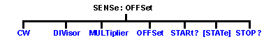

# Sense:Offset Commands Superseded

* * *

Note: These commands are replaced by the [Sense:FOM](FOM.md) commands which
include the features of the new FOM dialog. Although these old commands will
continue to work, they can NOT be mixed with the new commands.

Sets the offset frequency functions, causing the stimulus and response
frequencies to be different.

Click on a keyword to view the command details.

See Also

  * [Example Programs](../../GPIB_Example_Programs/SCPI_Example_Programs.md)

  * [Learn about Frequency Offset](../../../FreqOffset/Frequency_Offset_Mode.md)

  * [Synchronizing the Analyzer and Controller](../../Learning_about_GPIB/Understanding_Command_Synchronization.md)

  * [SCPI Command Tree](../SCPI_Command_Tree.md)

* * *

## SENSe<cnum>:OFFSet:CW <bool>

Applicable Models: N522xB, N523xB, N524xB (Read-Write) Turns stimulus CW
Override mode ON or OFF. Use this setting to establish a fixed (CW) stimulus
frequency while measuring the Response over a swept frequency range.  
---  
Parameters |   
<cnum> |  Any existing channel number. If unspecified, value is set to 1  
<bool> |  ON (or 1) - turns CW override ON. OFF (or 0) - turns CW overide OFF.  
Examples |  SENS:OFFS:CW ON  
sense2:offset:cw off  
Query Syntax |  SENSe<cnum>:OFFSet:CW?  
Return Type |  Boolean  
[Default](JavaScript:hhctrl.TextPopup\(DefSCPI,'Arial,8',10,10,00000000,0xc0ffff\)) |  OFF  
  
* * *

## SENSe<cnum>:OFFSet:DIVisor <num>

Applicable Models: N522xB, N523xB, N524xB (Read-Write) Specifies (along with
the multiplier) the value to multiply by the stimulus.  
---  
Parameters |   
<cnum> |  Any existing channel number. If unspecified, value is set to 1  
<num> |  Divisor value. Range is 1 to 1000   
Examples |  SENS:OFFS:DIV 3  
sense2:offset:divisor 2  
Query Syntax |  SENSe<cnum>:OFFSet:DIVisor?  
Return Type |  Numeric  
[Default](JavaScript:hhctrl.TextPopup\(DefSCPI,'Arial,8',10,10,00000000,0xc0ffff\)) |  1  
  
* * *

## SENSe<cnum>:OFFSet:MULTiplier <num>

Applicable Models: N522xB, N523xB, N524xB (Read-Write) Specifies (along with
the divisor) the value to multiply by the stimulus.  
---  
Parameters |   
<cnum> |  Any existing channel number. If unspecified, value is set to 1  
<num> |  Multiplier value. Range is +/- 1000. Negative multipliers cause the stimulus to sweep in decreasing direction. For mixer measurements, this would be for setups requiring the RF frequency to be less than LO frequency  
Examples |  SENS:OFFS:MULT 2  
sense2:offset:multiplier 4  
Query Syntax |  SENSe<cnum>:OFFSet:MULTplier?  
Return Type |  Numeric  
[Default](JavaScript:hhctrl.TextPopup\(DefSCPI,'Arial,8',10,10,00000000,0xc0ffff\)) |  1  
  
* * *

## SENSe<cnum>:OFFSet:OFFSet <num>

Applicable Models: N522xB, N523xB, N524xB (Read-Write) Specifies an absolute
offset frequency in Hz. For mixer measurements, this would be the LO
frequency.  
---  
Parameters |   
<cnum> |  Any existing channel number. If unspecified, value is set to 1  
<num> |  Offset frequency. Range is +/- 1000 GHz. Offsets can be positive or negative  
Examples |  SENS:OFFS:OFFS 1GHz  
sense2:offset:offset 1e9  
Query Syntax |  SENSe<cnum>:OFFSet:OFFSet?  
Return Type |  Numeric  
[Default](JavaScript:hhctrl.TextPopup\(DefSCPI,'Arial,8',10,10,00000000,0xc0ffff\)) |  0 Hz  
  
* * *

## SENSe<cnum>:OFFSet:STARt?

Applicable Models: N522xB, N523xB, N524xB (Read-Only) Returns the response
start frequency  
---  
Parameters |   
<cnum> |  Any existing channel number. If unspecified, value is set to 1  
Examples |  SENS:OFFS:STAR?  
sense2:offset:start?  
Return Type |  Numeric  
[Default](JavaScript:hhctrl.TextPopup\(DefSCPI,'Arial,8',10,10,00000000,0xc0ffff\)) |  Not applicable  
  
* * *

## SENSe<cnum>:OFFSet:[STATe] <bool>

Applicable Models: N522xB, N523xB, N524xB (Read-Write) Enables Frequency
Offset Mode on ALL measurements that are present on the active channel. This
immediately causes the source and receiver to tune to separate frequencies.
The receiver frequencies are specified with the other SENS:OFFSet commands. To
make the stimulus settings use the [SENS:FREQ](Frequency.md) commands. Tip:
To avoid unnecessary errors, first make other offset frequency settings, then
set Frequency Offset ON.  
---  
Parameters |   
<cnum> |  Any existing channel number. If unspecified, value is set to 1  
<bool> |  ON (or 1) - turns Frequency Offset ON. OFF (or 0) - turns Frequency Offset OFF.  
Examples |  SENS:OFFS ON  
sense2:offset:state off  
Query Syntax |  SENSe<cnum>:OFFSet:[STATe]?  
Return Type |  Boolean  
[Default](JavaScript:hhctrl.TextPopup\(DefSCPI,'Arial,8',10,10,00000000,0xc0ffff\)) |  OFF (0)  
  
* * *

## SENSe<cnum>:OFFSet:STOP?

Applicable Models: N522xB, N523xB, N524xB (Read-Only) Returns the response
stop frequency.  
---  
Parameters |   
<cnum> |  Any existing channel number. If unspecified, value is set to 1  
Examples |  SENS:OFFS:STOP  
sense2:offset:stop  
Return Type |  Numeric  
[Default](JavaScript:hhctrl.TextPopup\(DefSCPI,'Arial,8',10,10,00000000,0xc0ffff\)) |  Not applicable  
  
* * *

