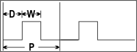
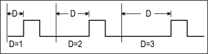
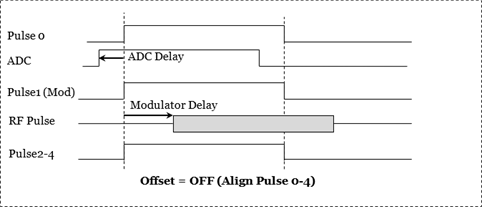
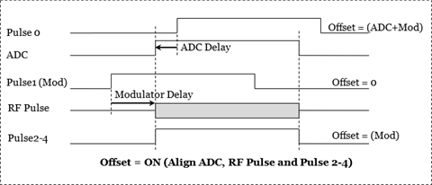

# Sense:Pulse Commands

* * *

Configures the 5 pulse generators in the PNA-X.

Beginning with A.09.50, these commands can also be used to control an external
Pulse Generator. [Learn
more](../../../System/Configure_an_External_Pulse_Generator.htm).

SENSe:PULSe | [CATalog?](Pulse.md#catalog) | [DELay](Pulse.md#delay) | [DINCrement](Pulse.md#dincrement) | HDELay | ADC? | MODulator | [:STATe] | [INVert](Pulse.md#invert) | MTIMing | DEVice | PULSe4: | MODE | OPTion | [PERiod](Pulse.md#period) | [STATe](Pulse.md#state) | [SUBPointtrig](Pulse.md#subPoint) | [TPOLarity](Pulse.md#TPolarity) | [TTYPe](Pulse.md#TType) | [WIDTh](Pulse.md#width)  
---  
  
Click on a keyword to view the command details.

To make other Pulse settings, such as enabling the internal pulse modulators,
use this command:

  * [SENSe<ch>:PATH:CONFig:ELEMent[:STATe] <elem>, <setting>](Path.md#state)
  * At that command help topic, click the IF Configuration elements and values link to see the Pulse element and setting (in the middle box ) to configure.

  
---  
  
### See Also

  * [SENS:SWEep:PULSE](SweepPulse.md) \- configures the channel for pulse measurements

  * [External Pulse Generator configuration commands](../SystConfigExtPulseGen.md)

  * [SENS:IF configuration commands](XSensIF.md)

  * [Example Programs](../../GPIB_Example_Programs/SCPI_Example_Programs.md)

  * Integrated Pulse Application

  * [Synchronizing the Analyzer and Controller](../../Learning_about_GPIB/Understanding_Command_Synchronization.md)

  * [SCPI Command Tree](../SCPI_Command_Tree.md)

### Pulse Definitions

  * D = Delay; the time before each pulse begins
  * W = Width; the time the pulse is ON
  * P = Period; one complete pulse cycle
  * Duty Cycle = W/P

Important: If D + W is greater than P, then undefined VNA behavior results.
There is NO error message or warning.  
---  
  
* * *

## SENSe:PULSe:CATalog?

Applicable Models: All with Pulsed RF Measurement Option (Read-only) Returns
the string names of internal and configured external pulse generators.  
---  
Parameters |  None  
Examples |  SENS:PULS:CAT?  
Default |  Not Applicable  
  
* * *

## SENSe<ch>:PULSe<n>:DELay <value>[,<name>]

Applicable Models: All with Pulsed RF Measurement Option (Read-Write) Sets the
pulse delay. The amount of time before a new pulse begins.  [See Pulse
Definition diagram.](Pulse.htm#definition)  
---  
Parameters |   
<ch> |  Any existing channel number; if unspecified, value is set to 1.  
<n> |  Internal pulse generator number. Choose from 0 to 4. 0 is the generator that pulses the ADC.  
<value> |  Delay value in seconds. Choose a value from about 33ns to about 70 seconds.  
<name> |  Optional. String name of the pulse generator. Required for use with [external pulse generators](../SystConfigExtPulseGen.md). Use [SENSe:PULSe:CAT?](Pulse.md#catalog) to return the names of configured pulse generators. If specified, <n> is ignored. If unspecified, <n> is required for internal pulse generators.  
Examples |  SENS:PULS1:DEL .5 SENS:PULS:DEL .5, "My81110"  
Query Syntax |  SENSe<ch>:PULSe<n>:DELay? [<name>]  
Return Type |  Numeric  
Default |  0  
  
* * *

## SENSe<ch>:PULSe<n>:DINCrement <value>[,<name>]

Applicable Models: All with Pulsed RF Measurement Option (Except M98xxA,
P50xxA/B, E5080B, E5081A) (Read-Write) Sets the pulse delay increment. The
delay increments with each pulse by the <value> amount.  For example, in this
diagram the delay starts as 1. On the second pulse, delay=2. On the third
pulse, delay=3. Important: If D + W is greater than P, then undefined VNA
behavior results. There is NO error message or warning. Delay includes the
incremented value. This is useful for pulse profiling.
 [See Pulse Definition
diagram.](Pulse.htm#definition)  
---  
Parameters |   
<ch> |  Any existing channel number; if unspecified, value is set to 1.  
<n> |  Pulse generator number. Choose from 0 to 4. 0 is the generator that pulses the ADC.  
<value> |  Delay increment value in seconds.  
<name> |  Optional. String name of the pulse generator. Required for use with [external pulse generators](../SystConfigExtPulseGen.md). Use [SENSe:PULSe:CAT?](Pulse.md#catalog) to return the names of configured pulse generators. If specified, <n> is ignored. If unspecified, <n> is required for internal pulse generators.  
Examples |  SENS:PULS1:DINC .5 SENS:PULS:DINC .5, "My81110"  
Query Syntax |  SENSe<ch>:PULSe<n>:DINCrement? [<name>]  
Return Type |  Numeric  
Default |  0  
  
* * *

## SENSe:PULSe<n>:HDELay:ADC?

Applicable Models: All with Pulsed RF Measurement Option (Read-only) Returns
the ADC delay for pulse measurements.  
---  
Parameters |   
<n> |  Internal pulse generator number. Choose from 1 to 4. 0 is the generator that pulses the ADC.  
Examples |  SENS:PULS:HDEL:ADC?  
[ Default ](javascript:hhctrl.TextPopup\(DefSCPI,'Arial,8',10,10,00000000,0xc0ffff\)) |  Not Applicable  
  
* * *

## SENSe<ch>:PULSe<n>:HDELay:MODulator <value>

Applicable Models: All with Pulsed RF Measurement Option (Read-Write) Sets the
time lag between the pulse drive signal and the actual RF output.  The
following diagram shows Pulse1 used as the pulse drive signal.

  
---  
Parameters |   
<ch> |  Any existing channel number; if unspecified, value is set to 1.  
<n> |  Internal pulse generator number. Choose from 1 to 4. 0 is the generator that pulses the ADC.  
<value> |  Delay value in seconds.  
Examples |  SENS:PULS1:HDEL:MOD 50ns  
Query Syntax |  SENSe<ch>:PULSe<n>:HDELay:MODulator?  
Return Type |  Numeric  
Default |  50 ns  
  
* * *

## SENSe<ch>:PULSe<n>:HDELay[:STATe] <value>

Applicable Models: All with Pulsed RF Measurement Option (Read-Write)
Enables/disables modulator and ADC delays for pulse measurements.  
---  
Parameters |   
<ch> |  Any existing channel number; if unspecified, value is set to 1.  
<n> |  Pulse generator number. Choose from 0 to 4. 0 is the generator that pulses the ADC.  
<value> |  Boolean ON (or 1) - turns delays ON. OFF (or 0) - turns delays OFF.  
Examples |  SENS:PULS1:HDEL 1  
Query Syntax |  SENSe<ch>:PULSe:HDELay[:STATe]? [<name>]  
Return Type |  Boolean  
Default |  OFF  
  
* * *

## SENSe<ch>:PULSe<n>:INVert <value>[,<name>]

Applicable Models: All with Pulsed RF Measurement Option (Read-Write) Sets
whether to invert the polarity of the pulse.  
---  
Parameters |   
<ch> |  Any existing channel number; if unspecified, value is set to 1.  
<n> |  Pulse generator number. Choose from 0 to 4. 0 is the generator that pulses the ADC.  
<value> |  Boolean ON (or 1) - Invert the pulse generator polarity. This causes the pulse ON time to be active low and OFF be active high. OFF (or 0) - Do NOT Invert the pulse generator polarity.  
<name> |  Optional. String name of the pulse generator. Required for use with [external pulse generators](../SystConfigExtPulseGen.md). Use [SENSe:PULSe:CAT?](Pulse.md#catalog) to return the names of configured pulse generators. If specified, <n> is ignored. If unspecified, <n> is required for internal pulse generators.  
Examples |  SENS:PULS1:INV 1 SENS:PULS:INV 1, "My81110"  
Query Syntax |  SENSe<ch>:PULSe:INVert? [<name>]  
Return Type |  Boolean  
Default |  OFF (0)  
  
* * *

## SENSe<ch>:PULSe<n>:MTIMing:DEVice <device>[,<name>]

Applicable Models: All with Pulsed RF Measurement Option and Modulation
Distortion Option (Except E5080B, E5081A, M98xxA, P50xxA/B) (Read-Write) Sets
and reads the device being controlled by the pulse generator output.  
---  
Parameters |   
<ch> |  Any existing channel number; if unspecified, value is set to 1.  
<n> |  Pulse generator number. Choose from 1 to 4. 0 is the generator that pulses the ADC.  
<device> |  Pulse Device. Choose from: ADCTrigger - (Pulse0 only) Pulse 0 is used to trigger the ADC. RFMOdul \- Iindicates that the pulse signal is used to drive the RF modulator. Only one pulse generator output can be used to drive an RF source. If you try to set more than one pulse generator output to RFMOdul, then the other one will be set to UserN (where "N" is the pulse generator number). ADCActivity \- (Pulse4 only) Pulse4 can also be set to monitor ADC activity. This selection outputs a signal on Pulse4 when the ADC is active. This is the same as SENSe:PULSe4:OPTion. USR1 through USR4 \- Labels for user convenience. These labels do not connect the pulse generator to any specific hardware. These selections may be used to control a DUT, DC biases, or other signals.  
<name> |  Optional. String name of the pulse generator. Required for use with [external pulse generators](../SystConfigExtPulseGen.md). Use SENSe:PULSe:CAT? to return the names of configured pulse generators. If specified, <n> is ignored. If unspecified, <n> is required for internal pulse generators.  
Examples |  SENS:PULS:MTIM:DEV RFMOdul  
Query Syntax |  SENSe<ch>:PULSe:MTIMing:DEVice?  
Return Type |  Character  
Default |  RFMOdul  
  
* * *

## SENSe<ch>:PULSe4:MODE <char>

Applicable Models: N522xB, N524xB (Read-Write) Sets the specific PULSe4
behavior to either “ALL" ADC ACTivity or "TRACe" ADC Activity, WHEN Pulse4 has
been set to display ADC activity using the SENSe:PULse4:OPTion command. “ALL”
ADC Activity enables PULSe4 to indicate all ADC activity, even ADC
measurements that are not displayed as final trace data. An example are
background measurements used for receiver leveling, but that are never
displayed on a trace. “TRACe” ADC Activity enables PULSe4 to indicate only the
ADC activity that ends up displayed in a VNA trace.  
---  
Parameters |   
<ch> |  Any existing channel number; if unspecified, value is set to 1.  
<char> |  ADC activity. Choose from: ALL - Pulse 4 output pin indicates all ADC activity. TRACe - Pulse 4 output pin indicates ADC being used for final measurements.  
Examples |  SENS:PULS4:MODE TRACe  
Query Syntax |  SENSe<ch>:PULSe4:MODE?  
Return Type |  Character  
Default |  ALL  
  
* * *

## SENSe<ch>:PULSe4:OPTion <bool>

Applicable Models: N522xB, N524xB (Read-Write) Turns pulse4 output ON and OFF.
Enable pulse4 to use an oscilloscope connected to pin 13 of the [PULSE I/O
connector](../../../Rear_Panel/XPulseIO.htm) on the rear panel of the VNA to
display when the ADC is making measurements.  Note: The pulse output must be
on using SENSe:PULSe4[:STATE] ON to view ADC activity.  
---  
Parameters |   
<ch> |  Any existing channel number; if unspecified, value is set to 1.  
<bool> |  Choose from: ON (or 1) - Pulse 4 output pin indicates ADC activity. OFF (or 0) - Pulse 4 output pin indicates legacy behavior (pulse generator number 4 output).  
Examples |  SENS:PULS4:OPT 1  
Query Syntax |  SENSe<ch>:PULSe4:OPTion?  
Return Type |  Boolean  
Default |  OFF  
  
* * *

## SENSe<ch>:PULSe:PERiod <value>[,<name>]

Applicable Models: All with Pulsed RF Measurement Option (Read-Write) Sets the
pulse-period (1/PRF) for ALL pulse generators.  The resolution of the period
is: DSP version: 4.0 = 16.667nS. DSP version: 5.0 = 10nS [Learn
more](../../../S0_Start/HelpAbout.htm) about DSP version. [See Pulse
Definition diagram.](Pulse.htm#definition)  
---  
Parameters |   
<ch> |  Any existing channel number; if unspecified, value is set to 1.  
<value> |  Pulse period in seconds. Choose a value from about 33ns to about 70 seconds.  
<name> |  Required for use with an [external pulse generator](../SystConfigExtPulseGen.md). String name of the external pulse generator. If unspecified, the period for the internal pulse generators are set. Use [SENSe:PULSe:CAT?](Pulse.md#catalog) to return the names of configured pulse generators.  
Examples |  SENS:PULS:PERiod .05 SENS:PULS:PER .01, "My81110"  
Query Syntax |  SENSe<ch>:PULSe:PERiod? [<name>]  
Return Type |  Numeric  
Default |  1e-3 sec  
  
* * *

## SENSe<ch>:PULSe<n>[:STATe] <value>[,<name>]

Applicable Models: All with Pulsed RF Measurement Option (Read-Write) Turns
the pulse output ON and OFF.  
---  
Parameters |   
<ch> |  Any existing channel number; if unspecified, value is set to 1.  
<n> |  Pulse generator number. Choose from 0 to 4. 0 is the generator that pulses the ADC.  
<value> |  Boolean ON (or 1) - turns pulse output ON. OFF (or 0) - turns pulse output OFF.  
<name> |  Optional. String name of the pulse generator. Required for use with [external pulse generators](../SystConfigExtPulseGen.md). Use [SENSe:PULSe:CAT?](Pulse.md#catalog) to return the names of configured pulse generators. If specified, <n> is ignored. If unspecified, <n> is required for internal pulse generators.  
Examples |  SENS:PULS1 1 SENS:PULS 1, "My81110"  
Query Syntax |  SENSe<ch>:PULSe[:STATe]? [<name>]  
Return Type |  Boolean  
Default |  OFF  
  
* * *

## SENSe<ch>:PULSe<n>:SUBPointtrig <bool>

Applicable Models: All with Pulsed RF Measurement Option (Except M98xxA,
P50xxA/B, E5080B, E5081A) (Read-Write) Enables / Disables subpoint triggering.
When enabled and performing [Point
Averaging](../../../S2_Opt/Trce_Noise.htm#averaging), Each rising edge of P0
triggers a subpoint (one of N acquisitions in an N point average). Must also
enable the P0 generator using [SENS:PULS0:STAT](Pulse.md#state).  [Learn more
about the PNA-X pulse
generators.](../../../IFAccess/IF_Path_Configuration.htm#PulseGens)  
---  
Parameters |   
<ch> |  Any existing channel number; if unspecified, value is set to 1.  
<n> |  Pulse generator number. Must be 0 as this is the generator that triggers the ADC.  
<bool> |  ON (or 1) - turns subpoint triggering ON. OFF (or 0) - turns subpoint triggering OFF.  
Examples |  SENS:PULS0:SUBP 1  
Query Syntax |  SENSe<ch>:PULSe0:SUBPointtrig?  
Return Type |  Boolean  
Default |  OFF  
  
* * *

## SENSe<ch>:PULSe:TPOLarity <char>

Applicable Models: All with Pulsed RF Measurement Option (Read-Write) Sets the
polarity of the trigger signal to which the internal pulse generators will
respond when being externally triggered at the PulseSyncIn pin.  Note: This
feature requires DSP version: 4.0 FPGA: 34 or higher. [Learn
more](../../../S0_Start/HelpAbout.htm). [Learn more about the PNA-X pulse
generators.](../../../IFAccess/IF_Path_Configuration.htm#PulseGens)  
---  
Parameters |   
<ch> |  Any existing channel number; if unspecified, value is set to 1.  
<char> |  Pulse polarity. Choose from: POSitive - VNA responds to rising edge or HIGH level NEGative - VNA responds to falling edge or LOW level. Set Edge or Level triggering using [SENS:PULS:TTYPe](Pulse.md#TType).  
Examples |  SENS:PULS:TPOL NEG  
Query Syntax |  SENSe<ch>:PULSe:TPOLarity?  
Return Type |  Character  
Default |  POSitive - Also the polarity used when the PNA-X does not have the required DSP hardware.  
  
* * *

## SENSe<ch>:PULSe<n>:TTYPe <char>

Applicable Models: All with Pulsed RF Measurement Option (Except M98xxA,
P50xxA/B, E5080B, E5081A) (Read-Write) Sets the type of trigger signal to
which the internal pulse generators will respond when being externally
triggered at the PulseSyncIn pin.  Note: This feature requires DSP version:
4.0 FPGA: 34 or higher. [Learn more](../../../S0_Start/HelpAbout.md). [Learn
more about the PNA-X pulse
generators.](../../../IFAccess/IF_Path_Configuration.htm#PulseGens)  
---  
Parameters |   
<ch> |  Any existing channel number; if unspecified, value is set to 1.  
<char> |  Trigger type. Choose from: EDGE - VNA responds to the edge (rising or falling) of a signal LEVel - VNA responds to the level (HIGH or LOW) of a signal Set polarity using [SENS:PULS:TPOL](Pulse.md#TPolarity)  
Examples |  SENS:PULS:TTYP EDGE  
Query Syntax |  SENSe<ch>:PULSe:TTYPe?  
Return Type |  Character  
Default |  LEVel - Also the type used when the PNA-X does not have the required DSP hardware.  
  
* * *

## SENSe<ch>:PULSe<n>:WIDTh <value>[,<name>]

Applicable Models: All with Pulsed RF Measurement Option (Read-Write) Sets the
pulse width. The amount of time that the pulse is ON.  [See Pulse Definition
diagram.](Pulse.htm#definition)  
---  
Parameters |   
<ch> |  Any existing channel number; if unspecified, value is set to 1.  
<n> |  Pulse generator number. Choose from 0 to 4. 0 is the generator that pulses the ADC.  
<value> |  Pulse width in seconds. Choose a value from about 33ns to about 70 seconds.  
<name> |  Optional. String name of the pulse generator. Required for use with [external pulse generators](../SystConfigExtPulseGen.md). Use [SENSe:PULSe:CAT?](Pulse.md#catalog) to return the names of configured pulse generators. If specified, <n> is ignored. If unspecified, <n> is required for internal pulse generators.  
Examples |  SENS:PULS:WIDT .5 SENS:PULS:WIDT .5, "My81110"  
Query Syntax |  SENSe<ch>:PULSe<n>:WIDTh? [<name>]  
Return Type |  Numeric  
Default |  1e-4 sec  
  
* * *

