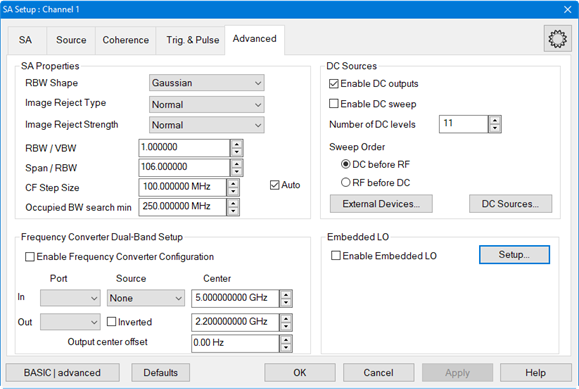

# Spectrum Analyzer Commands

Controls the Spectrum Analyzer Application.

SA Application \- SA Setup tab  
---  
 | SENSe:SA:BANDwidth:RESolution:CATalog?  
[SENSe:SA:BANDwidth:[RESolution]](SA.md#BandRes)  
[SENSe:SA:BANDwidth:[RESolution]:AUTO](SA.md#bandResAuto)  
[SENSe:SA:BANDwidth:RESolution MIN](SA.md#SENSe:SA:BANDwidth:RESolution)  
[SENSe:SA:BANDwidth:RESolution MAX](SA.md#SENSe:SA:BANDwidth:RESolution)  
[SENSe:SA:BANDwidth:VIDeo](SA.md#video)  
[SENSe:SA:BANDwidth:VIDeo:AUTO](SA.md#videoAuto)  
[SENSe:SA:BANDwidth:VIDeo MIN](SA.md#SENSe:SA:BANDwidth:VIDeo)  
[SENSe:SA:BANDwidth:VIDeo MAX](SA.md#SENSe:SA:BANDwidth:VIDeo)  
[SENSe:SA:DETector:FUNCtion](SA.md#detFunction)  
[SENSe:SA:DETector:BYPass:[STATe]](SA.md#detBypassState)  
[SENSe:SA:BANDwidth:VIDEO:AVERage:TYPE](SA.md#vidAverType)  
[SENSe:SA:BANDwidth:VIDEO:AVERage:COUNt?](SA.md#vidAverCount)  
  
Source Setup tab  
---  
 | [SOURce:POWer:MODE](../source.md#Mode)  
[SENSe:SA:SOURce:SWEep:TYPE](SA.md#sourSweepType)  
[SENSe:SA:SOURce:FREQuency:STARt](SA.md#SourFreqStart)  
[SENSe:SA:SOURce:FREQuency:STOP](SA.md#sourFreqStop)  
[SENSe:SA:SOURce:FREQuency:CW](SA.md#sourFreqCW)  
[SENSe:SA:SOURce:POW:SWEep:POINt:COUNt](SA.md#SENSe:SA:SOURce:POW:SWEep:POINt:COUNt)  
[SENSe:SA:SOURce:POW:SWEep:REPeat:COUNt](SA.md#SENSe:SA:SOURce:POW:SWEep:REPeat:COUNt)  
[SENSe:SA:SOURce:POWer:STARt](SA.md#SENSe:SA:SOURce:POWer:STARt)  
[SENSe:SA:SOURce:POWer:STOP](SA.md#SENSe:SA:SOURce:POWer:STOP)  
[SENSe:SA:SOURce:POWer[:VALue]](SA.md#SENSe:SA:SOURce:POWer_:VALue)  
[SOURce:PHASe:ITERation](../SourcePhase.md#iteration)  
[SOURce:PHASe:STARt](../SourcePhase.md#start)  
[SOURce:PHASe:STOP](../SourcePhase.md#stop)  
[SOURce:PHASe[:FIXed]](../SourcePhase.md#fixed)  
[SENSe:SA:SOURce:SWEep:FIRst[:DIMension]](SA.md#SENSe:SA:SOURce:SWEep:FIRst)  
[SENSe:SA:SOURce:SWEep:POINt:COUNt](SA.md#sweepPointCount)  
[SENSe:SA:SOURce:SWEep:REPeat:COUNt](SA.md#sweepRepeatCount)  
  
Coherence Setup tab (Not applicable for M98x0A, P50xxA)  
---  
 | SENSe:SA:COHerence:MULTitone[:STATe]  
SENSe:SA:COHerence:MULTitone:DATA  
SENSe:SA:COHerence:MULTitone:SPACing  
SENSe:SA:COHerence:MULTitone:PERiod  
SENSe:SA:COHerence:MULTitone:REFerence  
SENSe:SA:COHerence:MULTitone:HREJect  
SENSe:SA:COHerence:MULTitone:NYQReject  
SENSe:SA:COHerence:VECTor:AVERage[:STATe]  
SENSe:SA:COHerence:VECTor:AVERage:VALue  
SENSe:SA:COHerence:MULTitone:VALid  
SENSe:SA:COHerence:PHASe:DISPlay:LEVel  
SENSe:SA:COHerence:DISTortion:FREQuency:TUNE:IMMediate  
SENSe:SA:COHerence:PHASe[:STATe]  
SENSe:SA:COHerence:PHASe:STITching:COMmon[:STATe]  
[SENSe:SA:COHerence:PHASe:STITching:HWTStamp[:STATe]](SA.md#SENSe:SA:COHerence:PHASe:STITching:HWTStamp)  
SENSe:SA:COHerence:PHASe:STITching:LEVel  
SENSe:SA:COHerence:PHASe:STITching:RECeiver:AUTO[:STATe]  
SENSe:SA:COHerence:PHASe:STITching:RECeiver:NAME  
SENSe:SA:COHerence:PHASe:STITching[:STATe]  
SENSe:SA:DATA:IQ:ALIgned[:STATe]  
SENSe:SA:DATA:IQ[:STATe]  
SENSe:SA:DATA:IQ:AUTofill  
SENSe:VSA:DATA:SA:RECievers  
[(see VSA Setup commands)](VSA.md)  
SENSe:SA:COHerence:PULSe:SEARch:COUNt  
SENSe:SA:COHerence:PULSe:SEARch:DUTY:TOLerance  
SENSe:SA:COHerence:PULSe:SEARch:EXECute  
SENSe:SA:COHerence:PULSe:SEARch:INITialize  
SENSe:SA:COHerence:PULSe:SEARch:ITEM:COUNt?  
SENSe:SA:COHerence:PULSe:SEARch:ITEM:PERiod?  
SENSe:SA:COHerence:PULSe:SEARch:ITEM:SELect  
SENSe:SA:COHerence:PULSe:SEARch:ITEM:WIDTh?  
SENSe:SA:COHerence:PULSe:SEARch:PERiod:TOLerance  
SENSe:SA:COHerence:PULSe:SEARch:PERiod[:VALue]  
SENSe:SA:COHerence:PULSe:SEARch:PRIority  
SENSe:SA:COHerence:PULSe:SEARch:WIDTh:TOLerance  
SENSe:SA:COHerence:PULSe:SEARch:WIDTh[:VALue]  
  
Advanced Setup tab  
---  
 | [SENSe:SA:BANDwidth:SHAPe](SA.md#bandShape)  
[SENSe:SA:IMAGe:REJect](SA.md#imagRej)  
[SENSe:SA:IMAGe:STRength](SA.md#SENSe:SA:IMAGe:STRENgth)  
[SENSe:SA:BANDwidth:VIDeo:RATio](SA.md#bandVidRatio)  
[SENSe:SA:FREQuency:SPAN:BANDwidth[:RESolution]:RATio](SA.md#freqSpanBWRat)  
SENSe:SA:BANDwidth:SEARch:OCCupied:MIN  
[SENSe:SA:SOURce:DC:SWEep[:STATe]](SA.md#DC:SWEep:STATe)  
[SENSe:SA:SOURce:DC:SWEep:POINt](SA.md#DC:SWEep:POINt)  
SENSe:SA:FREQuency:TUNE:IMMediate  
[SENSe:SA:SOURce:DC:SWEep:FIRst[:DIMension]](SA.md#DC:SWEep:FIRst:DIMension)  
SENSe:SA:FREQuency:CONVerter[:STATe]  
SENSe:SA:FREQuency:CONVerter:INPut:SOURce  
SENSe:SA:FREQuency:CONVerter:INPut:PORT  
SENSe:SA:FREQuency:CONVerter:INPut:CENTer  
SENSe:SA:FREQuency:CONVerter:OUTPut:INVerted  
SENSe:SA:FREQuency:CONVerter:OUTPut:PORT  
SENSe:SA:FREQuency:CONVerter:OUTPut:CENTer  
SENSe:SA:FREQuency:CONVerter:OUTPut:OFFSet  
[(see Embedded LO setup commands)](MixrEmbedLO.md)  
  
IF Setup tab  
---  
 | [SENSe:SA:ADC:FILTer](SA.md#FFT_Width)  
[SENSe:SA:ADC:FILTer:AUTO](SA.md#ADC_FILTer_AUTO)  
[SENSe:SA:DFT:BANDwidth:AUTO](SA.md#SENSe:SA:DFT:BANDwidth:AUTO)  
[SENSe:SA:DFT:BANDwidth:NARRow:MIN](SA.md#SENSe:SA:DFT:BANDwidth:NARRow:MIN)  
[SENSe:SA:DFT:BANDwidth:NARRow:MAX](SA.md#SENSe:SA:DFT:BANDwidth:NARRow:MAX)  
[SENSe:SA:DFT:BANDwidth:WIDE:MIN](SA.md#SENSe:SA:DFT:BANDwidth:WIDE:MIN)  
[SENSe:SA:DFT:BANDwidth:WIDE:MAX](SA.md#SENSe:SA:DFT:BANDwidth:WIDE:MAX)  
  
Trigger Setup tab  
---  
 | [SENSe:SA:TRIGer:LEVel[:STATe]](SA.md#SENSe:SA:TRIGer:LEVel:STATe)  
[SENSe:SA:TRIGer:LEVel:VALue](SA.md#SENSe:SA:TRIGer:LEVel:VALue)  
[SENSe:SA:TRIGer:PERCounter[:STATe]](SA.md#SENSe:SA:TRIGer:PERCounter:STATe)  
[SENSe:SA:TRIGer:PERCounter:VALue](SA.md#SENSe:SA:TRIGer:PERCounter:VALue)  
  
Processing Setup tab  
---  
 | [SENSe:SA:DFT:TYPE](SA.md#SENSe:SA:DFT:TYPE)  
SENSe:SA:DATA:KEEP:FREQuencies:COUNt? (see End of Sweep Processing)  
SENSe:SA:DATA:KEEP:RECeivers:COUNt? (see End of Sweep Processing)  
SENSe:SA:DATA:KEEP:RECeivers[:CURRent] (see End of Sweep Processing)  
SENSe:SA:DATA:KEEP:RECeivers:LIST (see End of Sweep Processing)  
SENSe:SA:DATA:KEEP:SCALar:GET? (see End of Sweep Processing)  
SENSe:SA:DATA:KEEP[:STATe] (see End of Sweep Processing)  
SENSe:SA:DATA:KEEP:VECTor:GET? (see End of Sweep Processing)  
[SENSe:SA:TRACe:IMAGe[:STATe]](SA.md#Image_Reject_State)  
SENSe:SA:DATA:IQ:CARRier:FREQuency  
SENSe:SA:DATA:IQ:DURation?  
SENSe:SA:DATA:IQ:ERRor[:CODE]?  
SENSe:SA:DATA:IQ:ERRor:TEXT?  
SENSe:SA:DATA:IQ:GET?  
SENSe:SA:DATA:IQ:SAMPle:COUNt  
SENSe:SA:DATA:IQ:SAMPle:RATE  
SENSe:SA:DATA:KEEP:RECeivers:LIST  
[SENSe:SA:ADC:ACQTime?](SA.md#SENSe:SA:ADC:ACQTime)  
[SENSe:SA:LO:COUNt?](SA.md#SENSe:SA:LO:NUMBer)  
[SENSe:SA:SPAN:BINS:COUNt?](SA.md#SENSe:SA:SPAN:BINS:COUNt)  
[SENSe:SA:DFT:RESolution?](SA.md#SENSe:SA:DFT:RESolution)  
[SENSe:SA:DFT:RECord:SIZE?](SA.md#SENSe:SA:DFT:RECord:SIZE)  
[SENSe:SA:ADC:RECord:SIZE:VALue?](SA.md#FFT_ADC_Record_Size_Value)  
  
ADC & LO Setup tab  
---  
 | SENSe:SA:ADC:OVERload:COUNt?  
SENSe:SA:ADC:OVERload:LIST?  
SENSe:SA:ADC:OVERload:PERCent  
SENSe:SA:ADC:RANGe:PERCent[:MAXimum]?  
SENSe:SA:ADC:RANGe:PERCent:MINimum?  
SENSe:SA:ADC:RANGe:PERCent:RECeiver?  
[SENSe:SA:ADC:SAMPle:RATE](SA.md#ADCSampleRate)  
[SENSe:SA:ADC:SAMPle:RATE:AUTO](SA.md#ADC_Sample_Rate_Auto)  
[SENSe:SA:ADC:SAMPle:DECimation:FIR](SA.md#SENSe:SA:ADC:SAMPle:DECimation:FIR)  
[SENSe:SA:ADC:DITHer:[STATe]](SA.md#ADC:DITHer)  
[SENSe:SA:ADC:RECord:SIZE:VALue?](SA.md#FFT_ADC_Record_Size_Value)  
SENSe:SA:ADC:RECord:SIZE:MAX?  
SENSe:SA:ADC:RECord:SIZE:MIN?  
[SENSe:SA:ADC:RECord:SIZE:FORCe[:STATe]](SA.md#FFT_ADC_Record_Size)  
SENSe:SA:ADC:RECord:SIZE:FORCe:VALue  
[SENSe:SA:ADC:STACking:VALue](SA.md#ADC_Stacking)  
[SENSe:SA:ADC:STACking:STATe](SA.md#SENSe:SA:ADC:STACking:STATe)  
[SENSe:SA:ADC:MREC:SIZE](SA.md#SENSe:SA:ADC:MREC:SIZE)  
[SENSe:SA:ADC:MREC:PERiod](SA.md#SENSe:SA:ADC:MREC:PERiod)  
[SENSe:SA:ADC:MREC[:STATe]](SA.md#SENSe:SA:ADC:MREC:STATe)  
[SENSe:SA:LO:RANDom[:STATe]](SA.md#LoRandState)  
SENSe:SA:LO:BASeband[:STATe]  
[SENSe:SA:LO:FREQ:FORCe](SA.md#FFTFreqMode) (obsolete)  
[SENSe:SA:LO:FREQ:VALue](SA.md#FFT_FREQ_VALue) (obsolete)  
SENSe:SA:LO:FORCe:FREQuency  
SENSe:SA:LO:FORCe[:STATe]  
SENSe:SA:LO:FORCe:OFFSet:DIVider  
SENSe:SA:LO:FORCe:OFFSet:MULtiplier  
SENSe:SA:LO:FORCe:OFFSet:SOURce  
  
Data tab  
---  
 | SENSe:SA:DATA:TYPE  
SENSe:SA:DATA:STARt?  
SENSe:SA:DATA:RECeivers?  
SENSe:SA:DATA:RECeivers:LIST  
SENSe:SA:DATA:RECeivers:COUNt?  
SENSe:SA:DATA:BINs:COUNt?  
SENSe:SA:DATA:SIZE?  
SENSe:SA:DATA:SIZE:BIN?  
SENSe:SA:DATA:SIZE:LOW?  
SENSe:SA:DATA:SIZE:HIGH?  
SENSe:SA:DATA:FILE:BINary[:STATe]  
SENSe:SA:DATA:FILE:TEXT:MARKers[:STATe]  
SENSe:SA:DATA:FILE:TEXT:MARKers:ALL[:STATe]  
SENSe:SA:DATA:FILE:TEXT[:STATe]  
SENSe:SA:DATA:FILE:TEXT:VERBose[:STATe]  
SENSe:SA:DATA:FILE:ERASe[:STATe]  
SENSe:SA:DATA:FILE:PREFix  
SENSe:SA:DATA:FIFO[:STATe]  
SENSe:SA:DATA:SHARed[:STATe]  
SENSe:SA:DATA:SHARed:NAME  
SENSe:SA:DATA:THReshold[:STATe]  
SENSe:SA:DATA:THReshold:VALue  
SENSe:SA:DATA:WFACtor  
SENSe:SA:DATA:IQ:FILE:BINary[:STATe]  
SENSe:SA:DATA:IQ:FILE:TEXT[:STATe]  
  
### Other SA SCPI commands

SA Application - Setup tab  
---  
 | [SENS:FREQ:STAR](Frequency.md#start)  
[SENS:FREQ:STOP](Frequency.md#stop)  
[SENS:FREQ:CENT](Frequency.md#cent)  
[SENS:FREQ:SPAN](Frequency.md#span)  
[SENS:FREQ:SPAN:FULL](Frequency.md#SpanFull)  
[SENS:FREQ:CENT:STEP:SIZE](Frequency.md#StepSize)  
[SENS:FREQ:CENT:STEP:AUTO](Frequency.md#STEPAUTO)  
[SENS:FREQ:CW](Frequency.md#cw)  
[SENS:SWE:POIN](Sweep_SCPI.md#ssp)  
[SENS:POWer:ATT](Power.md)  
  
#### IF Gain Settings

| [SENS:PATH:CONFig:ELEM](Path.md#state)  
  
---  
  
SA Marker Settings  
---  
Sets and reads the bandwidth of the band density marker. | [CALCulate:MEASure:SA:MARKer:BDENsity:BW](../Calculate/MeasureSA.md#CALCulate:MEASure:SA:MARKer:BDENsity:BW) [CALCulate:SA:MARKer:BDENsity:BW](../Calculate/SA.md#CALCulate:SA:MARKer:BDENsity:BW)  
Returns the band density level in dBm/Hz from the band density marker. | [CALCulate:MEASure:SA:MARKer:BDENsity:DATA?](../Calculate/MeasureSA.md#CALCulate:MEASure:SA:MARKer:BDENsity:DATA) [CALCulate:SA:MARKer:BDENsity:DATA?](../Calculate/SA.md#CALCulate:SA:MARKer:BDENsity:DATA)  
Marker to SA | [CALC:MEAS:MARKer:SET SA](../Calculate/MeasureMARKer.md#CALCulate:MEASure:MARKer:SET)  
Read Band Power | [CALC:MEAS:SA:MARK:BPOWer:DATA?](../Calculate/MeasureSA.md#CALCulate:MEASure:SA:MARKer:BPOWer:DATA)  
Set and read Band Power Span | [CALC:MEAS:SA:MARK:BPOWer:SPAN](../Calculate/MeasureSA.md#CALCulate:MEASure:SA:MARKer:BPOWer:SPAN)  
Set Band Power State | [CALC:MEAS:SA:MARK:BPOWer[:STATe]](../Calculate/MeasureSA.md#CALCulate:MEASure:SA:MARKer:BPOWer:STATe)  
Read occupied bandwidth center frequency | [CALC:MEAS:SA:MARK:OCCBand:CENTer?](../Calculate/MeasureSA.md#CALCulate:SA:MARKer:OCCBand:CENTer)  
Set and read occupied bandwidth percentage of span | [CALC:MEAS:SA:MARK:OCCBand:PERCent](../Calculate/MeasureSA.md#CALCulate:SA:MARKer:OCCBand:PERCent)  
Read the occupied bandwidth power. | [CALC:MEAS:SA:MARK:OCCBand:POWer?](../Calculate/MeasureSA.md#CALCulate:SA:MARKer:OCCBand:POWer)  
Read occupied bandwidth span | [CALC:MEAS:SA:MARK:OCCBand:SPAN?](../Calculate/MeasureSA.md#CALCulate:SA:MARKer:OCCBand:SPAN)  
Set occupied bandwidth state | [CALC:MEAS:SA:MARK:OCCBand[:STATe]](../Calculate/MeasureSA.md#CALCulate:SA:MARKer:OCCBand:STATe)  
Sets and reads the state of the band density noise marker.  | [CALCulate:MEASure:SA:MARKer:BDENsity:NOISe[:STATe]](../Calculate/MeasureSA.md#CALCulate:SA:MARKer:BDENsity:NOISe:STATe) [CALCulate:SA:MARKer:BDENsity:NOISe[:STATe]](../Calculate/SA.md#CALCulate:SA:MARKer:BDENsity:NOISe:STATe)  
Sets and reads the bandwidth of the band power density marker. | [CALCulate:MEASure:SA:MARKer:BDENsity:POWer:BW](../Calculate/MeasureSA.md#CALCulate:SA:MARKer:BDENsity:POWer:BW) [CALCulate:SA:MARKer:BDENsity:POWer:BW](../Calculate/SA.md#CALCulate:SA:MARKer:BDENsity:POWer:BW)  
Sets and reads the state of the band power density marker.  | [CALCulate:MEASure:SA:MARKer:BDENsity:POWer[:STATe]](../Calculate/MeasureSA.md#CALCulate:SA:MARKer:BDENsity:POWer:STATe) [CALCulate:SA:MARKer:BDENsity:POWer[:STATe]](../Calculate/SA.md#CALCulate:SA:MARKer:BDENsity:POWer:STATe)  
Sets and reads the bandwidth of the band tone density marker. | [CALCulate:MEASure:SA:MARKer:BDENsity:TONE:BW](../Calculate/MeasureSA.md#CALCulate:SA:MARKer:BDENsity:TONE:BW) [CALCulate:SA:MARKer:BDENsity:TONE:BW](../Calculate/SA.md#CALCulate:SA:MARKer:BDENsity:TONE:BW)  
Sets and reads the state of the band tone density marker. | [CALCulate:MEASure:SA:MARKer:BDENsity:TONE[:STATe]](../Calculate/MeasureSA.md#CALCulate:SA:MARKer:BDENsity:TONE:STATe) [CALCulate:SA:MARKer:BDENsity:TONE[:STATe]](../Calculate/SA.md#CALCulate:SA:MARKer:BDENsity:TONE:STATe)  
Sets and reads the spacing of the band tone density marker. | [CALCulate:MEASure:SA:MARKer:BDENsity:TONE:TSPacing](../Calculate/MeasureSA.md#CALCulate:SA:MARKer:BDENsity:TONE:TSPacing) [CALCulate:SA:MARKer:BDENsity:TONE:TSPacing](../Calculate/SA.md#CALCulate:SA:MARKer:BDENsity:TONE:TSPacing)  
Sets and reads the frequency span used by Power Density to normalize the power. | [CALCulate:MEASure:SA:MARKer:BDENsity:EQSPan](../Calculate/MeasureSA.md#CALCulate:SA:MARKer:BDENsity:EQSPan) [CALCulate:SA:MARKer:BDENsity:EQSPan](../Calculate/SA.md#CALCulate:SA:MARKer:BDENsity:EQSPan)  
  
####

#### Other SA commands

  * [CALCulate:MEASure:DEFine](../Calculate/Measure.md#CALCulate:MEASure:DEFine) \- creates an SA measurement.

  * SA Calibration uses the [Guided Calibration commands](../../COM_Reference/Objects/GuidedCalibration_Object.md).

See Also

  * Example Program: [Create an SA Measurement](../../GPIB_Example_Programs/Spectrum_Analyzer.md)

  * [Learn about SA Application](../../../Applications/Spectrum_Analyzer.md)

  * [Synchronizing the Analyzer and Controller](../../Learning_about_GPIB/Understanding_Command_Synchronization.md)

  * [SCPI Command Tree](../SCPI_Command_Tree.md)

### End of Sweep Processing

The SENS:SA:DATA:KEEP commands keep the memory buffer of the last full sweep
in memory for further processing. This is not done by default because keeping
the whole data in memory requires large amounts of memory and processing (for
example, in the case of wide span or low RBW).

Before the implementation of this function, raw data could be sent to a file
(ascii or binary) or the fifo, as this can be done while sweeping with no need
to keep the whole data in memory. This option is still available.

With each sweep, the data buffers are filled, and are erased if a new speed is
started. In other words, this feature works well in the logic of “Single”
sweeps with a wait for OPC: (operation complete). You must ensure that a full
sweep is in the buffers before pulling out raw data.

The receiver list can be either ALL, or a comma separated list of valid
receivers.

One command defines a list of receivers and another command reads which
receivers are currently kept in memory. Only the receivers currently defined
for measurement traces can be kept in memory.

* * *

## SENSe<ch>:SA:ADC:ACQTime?

Applicable Models: All with Spectrum Analysis Options (S9x09xxA/B, S9x09xA/B)
(Read-only) Returns the LO acquisition time which is the ADC Record Size x ADC
Sampling Frequency (10 nsec or 40 nsec) x (1 + Stacking) x (Video
Average.Coefficient).  
---  
Parameters |   
<ch> | Channel number of the measurement. If unspecified,value is set to 1.  
Examples | SENS:SA:ADC:ACQT? sense2:sa:adc:acqtime?  
Default | Not applicable  
  
* * *

## SENSe<ch>:SA:ADC:DITHer[:STATe] <bool>

Applicable Models: All with Spectrum Analysis Options (Except M98xxA,
P50xxA/B, E5080B)  (Read-Write) Set and read the ON/OFF state of the dither
setting  
---  
Parameters |   
<ch> | Any existing SA channel. If unspecified, value is set to 1.  
<bool> | Choose from: 0 - OFF \- Dither OFF. 1 - ON \- Dither ON. [Learn about these settings](../../../Applications/Spectrum_Analyzer.md#ADC_Dither).  
Examples | SENS:SA:ADC:DITH 1  
Query Syntax | SENSe<ch>:SA:ADC:DITH?  
Return Type | Boolean  
Default | 0  
  
* * *

## SENSe<ch>:SA:ADC:FILTer <num>

Applicable Models: All with Spectrum Analysis Options (Except M98xxA,
P50xxA/B, E5080B)  (Read-Write) Set and read the ADC filter cutoff frequency.
The entered frequency value is rounded to the closest value supported by the
VNA (11 MHz or 38 MHz).  
---  
Parameters |   
<ch> | Any existing SA channel. If unspecified, value is set to 1.  
<num> | Choose 11 MHz or 38 MHz. [Learn about these settings.](../../../Applications/Spectrum_Analyzer.md#FFT_Width)  
Examples | SENS:SA:ADC:FILTer 11MHz  
Query Syntax | SENSe<ch>:SA:ADC:FILTer?  
Return Type | Numeric  
Default | 11 MHz  
  
* * *

## SENSe<ch>:SA:ADC:FILTer:AUTO <bool>

Applicable Models: All with Spectrum Analysis Options (Except M98xxA,
P50xxA/B, E5080B)  (Read-Write) Set and read how the ADC filter is set. When
ON, the ADC filter is set based on the start and stop frequencies and the ADC
sampling frequency.  
---  
Parameters |   
<ch> | Any existing SA channel. If unspecified, value is set to 0.  
<bool> | Choose from: 0 - OFF \- ADC filter is set manually using SENS:SA:ADC:FILT. 1 - ON \- ADC filter is set automatically. [Learn about these settings](../../../Applications/Spectrum_Analyzer.md#ADCFilterAuto).  
Examples | SENS:SA:ADC:FILT:AUTO ON  
Query Syntax | SENSe<ch>:SA:ADC:FILTer:AUTO?  
Return Type | Boolean  
Default | 1  
  
* * *

## SENSe<ch>:SA:ADC:MREC:PERiod <value>

Applicable Models: All with Spectrum Analysis Options (Except M98xxA,
P50xxA/B, E5080B)  (Read-Write) Set and read the period to wait between ADC
record chunks.  
---  
Parameters |   
<ch> | Any existing SA channel. If unspecified, value is set to 1.  
<value> | Choose a value between 64 and 33554432 [Learn about these settings](../../../Applications/Spectrum_Analyzer.md#Chunk_Period).  
Examples | SENS:SA:ADC:MREC:PER 256  
Query Syntax | SENSe<ch>:SA:ADC:MREC:PERiod?  
Return Type | Integer  
Default | 64  
  
* * *

## SENSe<ch>:SA:ADC:MREC:SIZE <value>

Applicable Models: All with Spectrum Analysis Options (Except M98xxA,
P50xxA/B, E5080B)  (Read-Write) Set and read the size of the ADC record
chunks.  
---  
Parameters |   
<ch> | Any existing SA channel. If unspecified, value is set to 1.  
<value> | Choose a value between 1 and (ADC record size / 2). [Learn about these settings](../../../Applications/Spectrum_Analyzer.md#Chunk_Size).  
Examples | SENS:SA:ADC:MREC:SIZE 256  
Query Syntax | SENSe<ch>:SA:ADC:MREC:SIZE?  
Return Type | Integer  
Default | 32  
  
* * *

## SENSe:SA:ADC:MREC[:STATe] <bool>

Applicable Models: All with Spectrum Analysis Options (Except M98xxA,
P50xxA/B, E5080B)  (Read-Write) Set and read the ON/OFF state of the multiple
recording function. Multiple recording allows the ADC Record Size to be
divided and acquired in smaller "chunks" and also to specify a wait period
between these acquisitions.  
---  
Parameters |   
<ch> | Any existing SA channel. If unspecified, value is set to 1.  
<bool> | Choose from: 0 - OFF \- ADC record size "chunking" OFF. 1 - ON \- ADC record size "chunking" ON. [Learn about these settings](../../../Applications/Spectrum_Analyzer.md#Multiple_Recordings).  
Examples | SENS:SA:ADC:MREC 0  
Query Syntax | SENSe<ch>:SA:ADC:MREC[:STATe]?  
Return Type | Boolean  
Default | 0  
  
* * *

## SENSe<ch>:SA:ADC:OVERload:COUNt?

Applicable Models: All with Spectrum Analysis Options (Except M98xxA,
P50xxA/B, E5080B)  (Read-only) Read the count of ADCs/receivers in overload
status for the previous sweep. The count is cleared if a new sweep is started.
Zero indicates no overload.  
---  
Parameters |   
<ch> | Any existing SA channel. If unspecified, value is set to 1.  
Examples | SENS:SA:ADC:OVER:COUN? 0  
Return Type | Integer  
Default | Not applicable  
  
* * *

## SENSe<ch>:SA:ADC:OVERload:LIST?

Applicable Models: All with Spectrum Analysis Options (Except M98xxA,
P50xxA/B, E5080B)  (Read-only) Read the list of measured receivers in overload
status for the previous sweep. The list is cleared if a new sweep is started.  
---  
Parameters |   
<ch> | Any existing SA channel. If unspecified, value is set to 1.  
Examples | SENS:SA:ADC:OVER:LIST? "b2,b4"  
Return Type | String  
Default | Not applicable  
  
* * *

## SENSe<ch>:SA:ADC:OVERload:PERCent <num>

Applicable Models: All with Spectrum Analysis Options (Except M98xxA,
P50xxA/B, E5080B)  (Read-Write) Set and read the ADC overload threshold
percentage.  
---  
Parameters |   
<ch> | Any existing SA channel. If unspecified, value is set to 1.  
<num> | ADC overload threshold percentage.  
Examples | SENS:SA:ADC:OVER:PERC 80  
Query Syntax | SENSe<ch>:SA:ADC:OVERload:PERCent?  
Return Type | Numeric  
Default | 80  
  
* * *

## SENSe<ch>:SA:ADC:RANGe:PERCent[:MAXimum]?

Applicable Models: All with Spectrum Analysis Options (Except M98xxA,
P50xxA/B, E5080B)  (Read-only) Read the maximum ADC percentage range of all
receivers in use. For example, if the ADC range is -8190 to +8190 and the
current min and max ADC values are (for this sweep) -4000 and +4195, then the
percentage range is 50%. An incorrect request will return 0.0 or 100.0
depending on the request.  
---  
Parameters |   
<ch> | Any existing SA channel. If unspecified, value is set to 1.  
Examples | SENS:SA:ADC:RANG:PERC:MAX?   
Return Type | Integer  
Default | Not applicable  
  
* * *

## SENSe<ch>:SA:ADC:RANGe:PERCent:MINimum?

Applicable Models: All with Spectrum Analysis Options (Except M98xxA,
P50xxA/B, E5080B)  (Read-only) Read the minimum ADC percentage range of all
receivers in use. For example, if the ADC range is -8190 to +8190 and the
current min and max ADC values are (for this sweep) -4000 and +4195, then the
percentage range is 50%. An incorrect request will return 0.0 or 100.0
depending on the request.  
---  
Parameters |   
<ch> | Any existing SA channel. If unspecified, value is set to 1.  
Examples | SENS:SA:ADC:RANG:PERC:MIN?   
Return Type | Integer  
Default | Not applicable  
  
* * *

## SENSe<ch>:SA:ADC:RANGe:PERCent:RECeiver? <recName>

Applicable Models: All with Spectrum Analysis Options (Except M98xxA,
P50xxA/B, E5080B)  (Read-only) Read the ADC percentage range for the specified
receiver. For example, if the ADC range is -8190 to +8190 and the current min
and max ADC values are (for this sweep) -4000 and +4195, then the percentage
range is 50%. An incorrect request will return 0.0 or 100.0 depending on the
request.  
---  
Parameters |   
<ch> | Any existing SA channel. If unspecified, value is set to 1.  
<recName> | (String) Receiver name  
Examples | SENS:SA:ADC:RANG:PERC:REC? "b2"  
Return Type | Integer  
Default | Not applicable  
  
* * *

## SENSe<ch>:SA:ADC:RECord:SIZE:FORCe[:STATe] <bool>

Applicable Models: All with Spectrum Analysis Options (S9x09xxA/B, S9x09xA/B)
(Read-Write) Set and read the ADC record size mode.  
---  
Parameters |   
<ch> | Any existing SA channel. If unspecified, value is set to 1.  
<bool> | Choose from: 0 - OFF \- ADC record size set automatically. 1 - ON \- Manually set ADC record to specified size. [Learn about these settings](../../../Applications/Spectrum_Analyzer.md#Force_ADC_Record_Enable).  
Examples | SENS:SA:ADC:REC:SIZE:FORC:STAT 1  
Query Syntax | SENSe<ch>:SA:ADC:REC:SIZE:FORC[:STATe]?  
Return Type | Boolean  
Default | 0  
  
* * *

## SENSe<ch>:SA:ADC:RECord:SIZE:FORCe:VALue <num>

Applicable Models: All with Spectrum Analysis Options (S9x09xxA/B, S9x09xA/B)
(Read-Write) Set and read the integer size value for the force ADC record size
feature.  
---  
Parameters |   
<ch> | Any existing SA channel. If unspecified, value is set to 1.  
<num> | ADC record size. [Learn about these settings](../../../Applications/Spectrum_Analyzer.md#Force_ADC_Record_Size).  
Examples | SENS:SA:ADC:REC:SIZE:FORC:VAL 64  
Query Syntax | SENSe<ch>:SA:ADC:REC:SIZE:FORC:VAL?  
Return Type | Numeric  
Default | Not applicable  
  
* * *

## SENSe<ch>:SA:ADC:RECord:SIZE:MAX?

Applicable Models: All with Spectrum Analysis Options (S9x09xxA/B, S9x09xA/B)
(Read-only) Read the current maximum available ADC record size.  
---  
Parameters |   
<ch> | Any existing SA channel. If unspecified, value is set to 1.  
Examples | SENS:SA:ADC:REC:SIZE:MAX?  
Return Type | Integer  
Default | Not applicable  
  
* * *

## SENSe<ch>:SA:ADC:RECord:SIZE:MIN?

Applicable Models: All with Spectrum Analysis Options (S9x09xxA/B, S9x09xA/B)
(Read-only) Read the current minimum available ADC record size.  
---  
Parameters |   
<ch> | Any existing SA channel. If unspecified, value is set to 1.  
Examples | SENS:SA:ADC:REC:SIZE:MIN?  
Return Type | Integer  
Default | Not applicable  
  
* * *

## SENSe<ch>:SA:ADC:RECord:SIZE:VALue?

Applicable Models: All with Spectrum Analysis Options (S9x09xxA/B, S9x09xA/B)
(Read-only) Read ADC record size value.  
---  
Parameters |   
<ch> | Any existing SA channel. If unspecified, value is set to 1.  
Examples | SENS:SA:ADC:REC:SIZE:VAL? 256  
Return Type | Integer  
Default | Not applicable  
  
* * *

## SENSe<ch>:SA:ADC:SAMPle:DECimation:FIR <bool>

Applicable Models: All with Spectrum Analysis Options (Except M98xxA,
P50xxA/B, E5080B)  (Read-Write) Set and read the FIR filter for 25 MHz
decimation.  
---  
Parameters |   
<ch> | Any existing SA channel. If unspecified, value is set to 1.  
<bool> | Choose from: 0 - OFF -Disable 25 MHz FIR filter. 1 - ON \- Enable 25 MHz FIR filter.  
Examples | SENS:SA:ADC:SAMPle:DECimation:FIR 1  
Query Syntax | SENSe<ch>:SA:ADC:SAMPle:DECimation:FIR?  
Return Type | Boolean  
Default | 0  
  
* * *

## SENSe<ch>:SA:ADC:SAMPle:RATE <num>

Applicable Models: All with Spectrum Analysis Options (Except M98xxA,
P50xxA/B, E5080B)  (Read-Write) Set and read the ADC sampling frequency. The
entered frequency is rounded to the closest value supported by the VNA (25 MHz
or 100 MHz).  
---  
Parameters |   
<ch> | Any existing SA channel.  
<num> | Choose from 100 MHz or 25 MHz. [Learn about these settings.](../../../Applications/Spectrum_Analyzer.md#ADC_Sample_Rate)  
Examples | SENS:SA:ADC:SAMP:RATE 100MHz  
Query Syntax | SENSe<ch>:SA:ADC:SAMP:RATE?  
Return Type | Numeric  
Default | 100 MHz  
  
* * *

## SENSe<ch>:SA:ADC:SAMPle:RATE:AUTO <bool>

Applicable Models: All with Spectrum Analysis Options (Except M98xxA,
P50xxA/B, E5080B)  (Read-Write) Set and read the ADC sample rate mode.  
---  
Parameters |   
<ch> | Any existing SA channel. If unspecified, value is set to 1.  
<bool> | Choose from: 0 - OFF \- Manually set ADC sampling rate using SENSe:SA:ADC:SAMPle:RATE. 1 - ON \- ADC sampling rate set automatically. [Learn about these settings](../../../Applications/Spectrum_Analyzer.md#ADC_Sample_Rate).  
Examples | SENS:SA:ADC:SAMP:RATE:AUTO 1  
Query Syntax | SENSe<ch>:SA:ADC:SAMPle:RATE:AUTO?  
Return Type | Boolean  
Default | 1  
  
* * *

## SENSe:SA:ADC:STACking:STATe <bool>

Applicable Models: All with Spectrum Analysis Options (Except M980xA,
P50xxA/B, E5080B)  (Read-Write) Set and read the ON/OFF state of the ADC
sample stacking.  
---  
Parameters |   
<ch> | Any existing SA channel. If unspecified, value is set to 1.  
<bool> | Choose from: 0 - OFF \- ADC sample stacking OFF. 1 - ON \- ADC sample stacking ON. [Learn about these settings](../../../Applications/Spectrum_Analyzer.md#ADC_Stacking).  
Examples | SENS:SA:ADC:STAC:STAT 0  
Query Syntax | SENSe<ch>:SA:ADC:STACking:STATe?  
Return Type | Boolean  
Default | 0  
  
* * *

## SENSe<ch>:SA:ADC:STACking:VALue [<MAX>,] <value>

Applicable Models: All with Spectrum Analysis Options (Except M980xA,
P50xxA/B, E5080B)  (Read-Write) Set and read the ADC stacking value.  
---  
Parameters |   
<ch> | Any existing SA channel. If unspecified, value is set to 0 (no stacking).  
[<MAX>] | Sets and reads the current maximum available stacking size.  
<value> | Choose a value between 0 and 65535. [Learn about these settings.](../../../Applications/Spectrum_Analyzer.md#ADC_Stacking)  
Examples | SENS:SA:ADC:STAC:VAL 1  
Query Syntax | SENSe<ch>:SA:ADC:STACking:VALue? MAX  
Return Type | Integer  
Default | 0  
  
* * *

## SENSe<ch>:SA:BANDwidth[:RESolution] <num>

Applicable Models: All with Spectrum Analysis Options (S9x09xxA/B, S9x09xA/B)
(Read-Write) Set and read the resolution bandwidth. Also set
[SENS:SA:BAND:AUTO](SA.md#bandResAuto) OFF.  
---  
Parameters |   
<ch> | Any existing SA channel. If unspecified, value is set to 1.  
<num> | Choose a value between 6 Hz and 3 MHz. Attempting to set the bandwidth outside these bounds will force the bandwidth to the nearest bound. [Learn about these settings](../../../Applications/Spectrum_Analyzer.md#Resolution_Bandwidth).  
Examples | SENS:SA:BAND 1e3  
Query Syntax | SENSe<ch>:SA:BANDwidth[:RESolution]?  
Return Type | Numeric  
Default | 100 kHz  
  
* * *

## SENSe<ch>:SA:BANDwidth:RESolution <enum>

Applicable Models: All with Spectrum Analysis Options (S9x09xxA/B, S9x09xA/B)
(Read-Write) Set and read the minimum and maximum resolution bandwidth.  
---  
Parameters |   
<ch> | Any existing SA channel. If unspecified, value is set to 1.  
<enum> | Choose from: MAX MIN  
Examples | SENS:SA:BAND:RES MAX  
Query Syntax | SENSe<ch>:SA:BANDwidth:RESolution? MIN  
Return Type | Double  
Default | N/A  
  
* * *

## SENSe<ch>:SA:BANDwidth[:RESolution]:AUTO <bool>

Applicable Models: All with Spectrum Analysis Options (S9x09xxA/B, S9x09xA/B)
(Read-Write) Set and read how the resolution bandwidth is set. When ON, the
resolution bandwidth is set based on Span/RBW ratio.  
---  
Parameters |   
<ch> | Any existing SA channel. If unspecified, value is set to 1.  
<bool> | Choose from: 0 - OFF \- Res. BW is set manually using [SENS:SA:BAND](SA.md#BandRes). 1 - ON \- Res. BW is set automatically. [Learn about these settings](../../../Applications/Spectrum_Analyzer.md#Resolution_Bandwidth_Auto).  
Examples | SENS:SA:BAND:AUTO 1  
Query Syntax | SENSe<ch>:SA:BANDwidth[:RESolution]:AUTO?  
Return Type | Boolean  
Default | 1  
  
* * *

## SENSe<ch>:SA:BANDwidth:RESolution:CATalog?

Applicable Models: All with Spectrum Analysis Options (S9x09xxA/B, S9x09xA/B)
(Read-only) Read the list of all Resolution Bandwidth values currently
supported with spectrum analyzer current settings.  
---  
Parameters |   
<ch> | Any existing SA channel. If unspecified, value is set to 1.  
Examples | SENS:SA:BAND:RES:CAT?  
Default | Not applicable  
  
* * *

## SENSe<ch>:SA:BANDwidth:SEARch:OCCupied:MIN <num>

Applicable Models: All with Spectrum Analysis Options (S9x09xxA/B, S9x09xA/B)
(Read-Write) Set and read the minimum search frequency to use during an
Occupied BW search measurement. Power below this frequency is ignored.  
---  
Parameters |   
<ch> | Any existing SA channel. If unspecified, value is set to 1.  
<num> | Minimum search frequency value. [Learn about these settings](../../../Applications/Spectrum_Analyzer.md#Occupied_BW_search_min).  
Examples | SENS:SA:BAND:SEAR:OCC:MIN 300e6  
Query Syntax | SENSe<ch>:SA:BANDwidth:SEARch:OCCupied:MIN?  
Return Type | Numeric  
Default | 250 MHz  
  
* * *

## SENSe<ch>:SA:BANDwidth:SHAPe <enum>

Applicable Models: All with Spectrum Analysis Options (S9x09xxA/B, S9x09xA/B)
(Read-Write) Set and read the resolution bandwidth shape.  
---  
Parameters |   
<ch> | Any existing SA channel. If unspecified, value is set to 1.  
<enum> | Choose from: GAUSsian FLATtop KAISer BLACkman NONE [Learn about these settings.](../../../Applications/Spectrum_Analyzer.md#RBW_Shape)  
Examples | SENS:SA:BAND:SHAP GAUS  
Query Syntax | SENSe<ch>:SA:BANDwidth:SHAPe?  
Return Type | Enumeration  
Default | GAUSsian  
  
* * *

## SENSe<ch>:SA:BANDwidth:VIDeo <enum>

Applicable Models: All with Spectrum Analysis Options (S9x09xxA/B, S9x09xA/B)
(Read-Write) Set and read the minimum and maximum video bandwidth.  
---  
Parameters |   
<ch> | Any existing SA channel. If unspecified, value is set to 1.  
<enum> | Choose from: MAX MIN  
Examples | SENS:SA:BAND:VID MAX  
Query Syntax | SENSe<ch>:SA:BANDwidth:VIDeo? MIN  
Return Type | Double  
Default | N/A  
  
* * *

## SENSe<ch>:SA:BANDwidth:VIDeo <num>

Applicable Models: All with Spectrum Analysis Options (S9x09xxA/B, S9x09xA/B)
(Read-Write) Set and read the Video bandwidth. Also set
[SENS:SA:BAND:VID:AUTO](SA.md#videoAuto) OFF.  
---  
Parameters |   
<ch> | Any existing SA channel. If unspecified, value is set to 1.  
<num> | Choose a value between 3 Hz and 3 MHz. Going outside this range places the trace into a hold mode. [Learn about these settings](../../../Applications/Spectrum_Analyzer.md#Video_Bandwidth).  
Examples | SENS:SA:BAND:VID 1e5  
Query Syntax | SENSe<ch>:SA:BANDwidth:VIDeo?  
Return Type | Numeric  
Default | 100 kHz  
  
* * *

## SENSe<ch>:SA:BANDwidth:VIDeo:AUTO <bool>

Applicable Models: All with Spectrum Analysis Options (S9x09xxA/B, S9x09xA/B)
(Read-Write) Set and read how the video bandwidth is set. When ON, video
bandwidth is set based on RBW/VBW ratio.  
---  
Parameters |   
<ch> | Any existing SA channel. If unspecified, value is set to 1.  
<bool> | Choose from: 0 - OFF \- Video BW is set manually using [SENS:SA:BAND](SA.md#BandRes). 1 - ON \- Video BW is set automatically. [Learn about these settings](../../../Applications/Spectrum_Analyzer.md#Video_Bandwidth_Auto).  
Examples | SENS:SA:BAND:VID:AUTO 1  
Query Syntax | SENSe<ch>:SA:BANDwidth:VIDeo:AUTO?  
Return Type | Boolean  
Default | 1  
  
* * *

## SENSe<ch>:SA:BANDwidth:VIDeo:AVERage:COUNt?

Applicable Models: All with Spectrum Analysis Options (S9x09xxA/B, S9x09xA/B)
(Read-only) Reads the number of Video bandwidth sweeps that are averaged
together. This readout is displayed on the [SA
setup](../../../Applications/Spectrum_Analyzer.htm#SetupTab) page.  
---  
Parameters |   
<ch> | Any existing SA channel. If unspecified, value is set to 1.  
Examples | SENS:SA:BAND:VID:AVER:COUNt?  
Query Syntax | SENSe<ch>:SA:BANDwidth:VIDeo:AVER:COUNt?  
Return Type | Numeric  
Default | 1  
  
* * *

## SENSe<ch>:SA:BANDwidth:VIDeo:AVER:TYPE <enum>

Applicable Models: All with Spectrum Analysis Options (S9x09xxA/B, S9x09xA/B)
(Read-Write) Set and read the averaging type.  
---  
Parameters |   
<ch> | Any existing SA channel. If unspecified, value is set to 1.  
<enum> | Choose from: VOLTage POWer LOG VMAX (Voltage Max) VMIN (Voltage Min) [Learn about these settings.](../../../Applications/Spectrum_Analyzer.md#VideoAverType)  
Examples | SENS:SA:BAND:VID:AVER:TYPE VOLT  
Query Syntax | SENSe<ch>:SA:BANDwidth:VIDeo:AVER:TYPE?  
Return Type | Enumeration  
Default | POWer  
  
* * *

## SENSe<ch>:SA:BANDwidth:VIDeo:RATio <num>

Applicable Models: All with Spectrum Analysis Options (S9x09xxA/B, S9x09xA/B)
(Read-Write) Set and read the RBW / VBW ratio.  
---  
Parameters |   
<ch> | Any existing SA channel. If unspecified, value is set to 1.  
<num> | RBW / VBW ratio. [Learn about these settings](../../../Applications/Spectrum_Analyzer.md#RBW_VBW).  
Examples | SENS:SA:BAND:VID:RAT  
Query Syntax | SENSe<ch>:SA:BANDwidth:VIDeo:RATio?  
Return Type | Numeric  
Default | 1.0  
  
* * *

## SENSe<cnum>:SA:COHerence:DISTortion:FREQuency:TUNE:IMMediate

Applicable Models: All with Modulation Distortion (S9x070B) and Spectrum
Analysis (S9x09xxA/B, S9x09xA/B) (Write-only) Auto tunes all measurement bands
for the modulation distortion channel.  
---  
Parameters |   
<cnum> | Any existing Modulation Distortion channel. If unspecified, value is set to 1.  
Examples | SENS:SA:COH:DIST:FREQ:TUNE:IMM  
Return Type | Not applicable  
Default | Not applicable  
  
* * *

## SENSe<ch>:SA:COHerence:LO:FTHRu:MONitor:LAST:FAILed?

Applicable Models: All with Modulation Distortion (S9x070B) and Spectrum
Analysis (S9x09xxA/B, S9x09xA/B, multitone only) (Read Only) Return the last
monitor result of LO feedthru monitor.
[SENS:SA:COH:LO:FTHR:MON:LAST:VAL?](SA.md#SENS_SA_COH_LO_FTHR_MON_LAST_VAL)
returns the measured value.  
---  
Parameters |   
<ch> | Any existing MOD channel. If unspecified, value is set to 1.  
Examples | SENS:SA:COH:LO:FTHR:MON:LAST:FAIL?  
Query Syntax | SENSe<ch>:SA:COHerence:LO:FTHRu:MONitor:LAST:FAILed?  
Return Type | Boolean (1 or 0) A "1" is pass and a "0" is fail.  
Default | Not applicable  
  
* * *

## SENSe<ch>:SA:COHerence:LO:FTHRu:MONitor:LAST:VALue?

Applicable Models: All with Modulation Distortion (S9x070B) and Spectrum
Analysis (S9x09xxA/B, S9x09xA/B, multitone only) (Read Only) Return the last
monitor value of LO feedthru monitor.  
---  
Parameters |   
<ch> | Any existing MOD channel. If unspecified, value is set to 1.  
Examples | SENS:SA:COH:LO:FTHR:MON:LAST:VAL?  
Query Syntax | SENSe<ch>:SA:COHerence:LO:FTHRu:MONitor:LAST:VALue?  
Return Type | real (dBm for ABSolute type, dBcfor BAND or ATONe types)  
Default | Not applicable  
  
* * *

## SENSe<ch>:SA:COHerence:LO:FTHRu:MONitor:RECeiver <string>

Applicable Models: All with Modulation Distortion (S9x070B) and Spectrum
Analysis (S9x09xxA/B, S9x09xA/B, multitone only) (Read-Write) Set and read the
target receiver for LO Feedthru monitor. Select the reference receiver in most
cases.  
---  
Parameters |   
<ch> | Any existing MOD channel. If unspecified, value is set to 1.  
<String> | Specify the receiver port for LO Feedthru monitor.  
Examples | SENS:SA:COH:LO:FTHR:MON:REC "a1"  
Query Syntax | SENSe<ch>:SA:COHerence:LO:FTHRu:MONitor:RECeiver?  
Return Type | String  
Default | "a1"  
  
* * *

## SENSe<ch>:SA:COHerence:LO:FTHRu:MONitor[:STATe] <bool>

Applicable Models: All with Modulation Distortion (S9x070B) and Spectrum
Analysis (S9x09xxA/B, S9x09xA/B, multitone only) (Read-Write) Set and read the
LO feedthru monitoring state. Use
[SENS:SA:COH:LO:FTHR:MON:LAST:FAIL?](SA.md#SENS_SA_COH_LO_FTHR_MON_LAST_FAIL)
to query the result. SYST:ERR? does not include the monitor fail result.  
---  
Parameters |   
<ch> | Any existing MOD channel. If unspecified, value is set to 1.  
<bool> | Choose from: 0 - OFF \- LO feedthru monitor disabled. 1 - ON \- LO feedthru monitor enabled.  
Examples | SENS:SA:COH:LO:FTHR:MON 1  
Query Syntax | SENSe<ch>:SA:COHerence:LO:FTHRu:MONitor[:STATe]?  
Return Type | Boolean  
Default | OFF  
  
* * *

## SENSe<ch>:SA:COHerence:LO:FTHRu:MONitor:TOLerance <real>

Applicable Models: All with Modulation Distortion (S9x070B) and Spectrum
Analysis (S9x09xxA/B, S9x09xA/B, multitone only) (Read-Write) Set and read the
threshold level for warning.
[SENS:SA:COH:LO:FTHR:MON:TYPE](SA.md#SENS_SA_COH_LO_FTHR_MON_TYPE) specifies
the value type.
[SENS:SA:COH:LO:FTHR:MON:LAST:VAL](SA.md#SENS_SA_COH_LO_FTHR_MON_LAST_VAL)
returns the monitored result  
---  
Parameters |   
<ch> | Any existing MOD channel. If unspecified, value is set to 1.  
<num> | Specify the threshold level. For ABSolute type: absolute tone level in dBm. For BAND or ATONe types: relative level in dBc.  
Examples | SENS:SA:COH:LO:FTHR:MON:TOL -30  
Query Syntax | SENSe<ch>:SA:COHerence:LO::FTHRu:MONitor:TOLerance?  
Return Type | real  
Default | -40  
  
* * *

## SENSe<ch>:SA:COHerence:LO:FTHRu:MONitor:TYPE <enum>

Applicable Models: All with Modulation Distortion (S9x070B) and Spectrum
Analysis (S9x09xxA/B, S9x09xA/B, multitone only) (Read-Write) Set and read the
monitoring method for LO feedthru monitor.  
---  
Parameters |   
<ch> | Any existing SA channel. If unspecified, value is set to 1.  
<enum> | Choose from: BAND: relative to total band power ATONe: relative to average tone power ABSolute: absolute tone power  
Examples | SENS:SA:COH:MULT:DATA ALL  
Query Syntax | SENSe<ch>:SA:COHerence:LO:FTHRu:MONitor:TYPE?  
Return Type | Enum  
Default | BAND  
  
* * *

## SENSe<ch>:SA:COHerence:MULTitone:DATA <enum>

Applicable Models: All with Spectrum Analysis Options (Except M98xxA,
P50xxA/B, E5080B, E5081A)  (Read-Write) Set and read the data display mode.  
---  
Parameters |   
<ch> | Any existing SA channel. If unspecified, value is set to 1.  
<enum> | Choose from: ALL: Legacy SA mode - all frequency points are displayed. ZNTones: All the frequencies that are not on the multi-tone coherence grid are set to -200 dBm before being displayed. This setting only has an effect if the coherence multitone mode is enabled. DNTones: Deletes span frequencies that are not on the multitone grid.  
Examples | SENS:SA:COH:MULT:DATA ALL  
Query Syntax | SENSe<ch>:SA:COHerence:MULTitone:DATA?  
Return Type | Enum  
Default | ALL  
  
* * *

## SENSe<ch>:SA:COHerence:MULTitone:HREJect <num>

Applicable Models: All with Spectrum Analysis Options (Except M98xxA,
P50xxA/B, E5080B, E5081A)  (Read-Write) Set and read the number of test signal
harmonics you want to be protected against. This adds constraints to the list
of LOs used to cover the span.  
---  
Parameters |   
<ch> | Any existing SA channel. If unspecified, value is set to 1.  
<num> | Number of test signal harmonics to be protected. The more this number is increased, the more constraints are added on the span LOs setting.  
Examples | SENS:SA:COH:MULT:HREJ 0  
Query Syntax | SENSe<ch>:SA:COHerence:MULTitone:HREJect?  
Return Type | Integer  
Default | 0  
  
* * *

## SENSe<ch>:SA:COHerence:MULTitone:NYQReJect <num>

Applicable Models: All with Spectrum Analysis Options (Except M98xxA,
P50xxA/B, E5080B, E5081A)  (Read-Write) Sets and returns the Nyquist
protection level. Avoids Nyquist images of the IF higher order signal to fall
back on multitone frequencies. This setting can only be set > 1 if the tone
spacing of the multitone is not an integer divider of 100 MHz.  
---  
Parameters |   
<ch> | Any existing SA channel. If unspecified, value is set to 1.  
<num> | Nyquist protection level.  
Examples | SENS:SA:COH:MULT:NYQR 2  
Query Syntax | SENSe<ch>:SA:COHerence:MULTitone:NYQReject?  
Return Type | Integer  
Default | 0  
  
* * *

## SENSe<ch>:SA:COHerence:MULTitone:PERiod <num>

Applicable Models: All with Spectrum Analysis Options (Except M98xxA,
P50xxA/B, E5080B, E5081A)  (Read-Write) Set and read the test signal
repetition rate (in seconds). This value is 1/SA:COH:MULT:SPAC.  
---  
Parameters |   
<ch> | Any existing SA channel. If unspecified, value is set to 1.  
<num> | Test signal repetition rate (in seconds).  
Examples | SENS:SA:COH:MULT:PER 1E6  
Query Syntax | SENSe<ch>:SA:COHerence:MULTitone:PERiod?  
Return Type | Double  
Default | 1E6  
  
* * *

## SENSe<ch>:SA:COHerence:MULTitone:REFerence <num>

Applicable Models: All with Spectrum Analysis Options (Except M98xxA,
P50xxA/B, E5080B, E5081A)  (Read-Write) Set and read the multitone image
rejection offset frequency. If the multitone grid does not start from 0 Hz,
this command is used to set its offset. To make this more convenient, this
command accepts as well the frequency of any tone of the multitone grid (Hz).  
---  
Parameters |   
<ch> | Any existing SA channel. If unspecified, value is set to 1.  
<num> | Offset frequency (in Hz).  
Examples | SENS:SA:COH:MULT:REF 0  
Query Syntax | SENSe<ch>:SA:COHerence:MULTitone:REFerence?  
Return Type | Double  
Default | 0  
  
* * *

## SENSe<ch>:SA:COHerence:MULTitone:SPACing <num>

Applicable Models: All with Spectrum Analysis Options  (Read-Write) Set and
read the tone spacing of the multitone signal (in Hz). This value is
1/SA:COH:MULT:PER.  
---  
Parameters |   
<ch> | Any existing SA channel. If unspecified, value is set to 1.  
<num> | Frequency spacing of multitone signal (in Hz).  
Examples | SENS:SA:COH:MULT:SPAC 1E6  
Query Syntax | SENSe<ch>:SA:COHerence:MULTitone:SPACing?  
Return Type | Double  
Default | 1000000  
  
* * *

## SENSe<ch>:SA:COHerence:MULTitone[:STATe] <bool>

Applicable Models: All with Spectrum Analysis Options  (Read-Write)
Enables/disables multitone image rejection. When enabled, the window type is
set to No Window and the list of RBW possible values is recomputed according
to the multitone spacing. When disabled, the window type is set back to what
it was before enabling and the RBW list is also set to the previous setting.  
---  
Parameters |   
<ch> | Any existing SA channel. If unspecified, value is set to 1.  
<bool> | Choose from: 0 - OFF \- Multitone image rejection disabled. 1 - ON \- Multitone image rejection enabled.  
Examples | SENS:SA:COH:MULT 1  
Query Syntax | SENSe<ch>:SA:COHerence:MULTitone[:STATe]?  
Return Type | Boolean  
Default | OFF  
  
* * *

## SENSe<ch>:SA:COHerence:MULTitone:VALid?

Applicable Models: All with Spectrum Analysis Options  (Read-only) Read the
current multitone settings and determine if they are valid or not.  
---  
Parameters |   
<ch> | Channel number of the measurement. If unspecified,value is set to 1.  
Examples | SENS:SA:COH:MULT:VAL? sense2:sa:coherence:multitone:valid?  
Return Type | Boolean (ON, OFF, 1, 0) A "1" is valid and a "0" is invalid.  
Default | Not applicable  
  
* * *

## SENSe<ch>:SA:COHerence:PHASe:DISPlay:LEVel <num>

Applicable Models: All with Spectrum Analysis Options (Read-Write) Set and
read the phase display minimum level.  
---  
Parameters |   
<ch> | Any existing SA channel. If unspecified, value is set to 1.  
<num> | Phase display minimum level (in dBm). [Learn about these settings](../../../Applications/Spectrum_Analyzer.md#Compute_Phases).  
Examples | SENS:SA:COH:PHAS:DISP:LEV -60 dBm  
Query Syntax | SENSe<ch>:SA:COHerence:PHASe:DISPlay:LEVel?  
Return Type | Double  
Default | -60 dBm  
  
* * *

## SENSe<ch>:SA:COHerence:PHASe[:STATe] <bool>

Applicable Models: All with Spectrum Analysis Options  (Read-Write)
Enables/disables phase computing.  
---  
Parameters |   
<ch> | Any existing SA channel. If unspecified, value is set to 1.  
<bool> | Choose from: 0 - OFF \- Phase computing disabled. 1 - ON \- Phase computing enabled. [Learn about these settings](../../../Applications/Spectrum_Analyzer.md#Compute_Phases).  
Examples | SENS:SA:COH:PHAS:STAT 1  
Query Syntax | SENSe<ch>:SA:COHerence:PHASe[:STATe]?  
Return Type | Boolean  
Default | OFF  
  
* * *

## SENSe<ch>:SA:COHerence:PHASe:STITching:COMmon[:STATe] <bool>

Applicable Models: All with Spectrum Analysis Options (Except M98xxA,
P50xxA/B, E5080B, E5081A)  (Read-Write) Enables/disables selected receiver, or
receiver with highest energy in the overlap area, to drive the phase stitching
for all receivers.  
---  
Parameters |   
<ch> | Any existing SA channel. If unspecified, value is set to 1.  
<bool> | Choose from: 0 - OFF \- Each receiver performs its own independent phase stitching. 1 - ON \- Selected receiver, or receiver with highest energy in the overlap area, drives the phase stitching for all receivers. [Learn about these settings](../../../Applications/Spectrum_Analyzer.md#Compute_Phases).  
Examples | SENS:SA:COH:PHAS:STIT:COM 1  
Query Syntax | SENSe<ch>:SA:COHerence:PHASe:STITching:COMmon[:STATe]?  
Return Type | Boolean  
Default | 0  
  
* * *

## SENSe<ch>:SA:COHerence:PHASe:STITching:HWTStamp[:STATe] <bool>

Applicable Models: All with Spectrum Analysis Options (Except M98xxA,
P50xxA/B, E5080B, E5081A)  (Read-Write) Enables/disables phase stitching using
hardware time stamps to determine the phase of each LO acquisition and stitch
them back together with phase consistency. SENSe:SA:COHerence:PHASe[:STATe]
must be enabled.  
---  
Parameters |   
<ch> | Any existing SA channel. If unspecified, value is set to 1.  
<bool> | Choose from: 0 - OFF \- Do not use hardware time stamp for stitching. 1 - ON \- Use hardware time stamp for stitching. [Learn about these settings](../../../Applications/Spectrum_Analyzer.md#Compute_Phases).  
Examples | SENS:SA:COH:PHAS:STIT:HWTS 1  
Query Syntax | SENSe<ch>:SA:COHerence:PHASe:STITching:HWTStamp[:STATe]?  
Return Type | Boolean  
Default | 0  
  
* * *

## SENSe<ch>:SA:COHerence:PHASe:STITching:LEVel <num>

Applicable Models: All with Spectrum Analysis Options (Except M98xxA,
P50xxA/B, E5080B, E5081A)  (Read-Write) Set and read the minimum tone power
level to perform phase stitching. This ensures that noise is never used for
phase stitching.  
---  
Parameters |   
<ch> | Any existing SA channel. If unspecified, value is set to 1.  
<num> | Phase stitching minimum level (in dBm). [Learn about these settings](../../../Applications/Spectrum_Analyzer.md#Compute_Phases).  
Examples | SENS:SA:COH:PHAS:STIT:LEV -150 dBm  
Query Syntax | SENSe<ch>:SA:COHerence:PHASe:STITching:LEVel?  
Return Type | Double  
Default | -150 dBm  
  
* * *

## SENSe<ch>:SA:COHerence:PHASe:STITching:RECeiver:AUTO[:STATe] <bool>

Applicable Models: All with Spectrum Analysis Options (Except M98xxA,
P50xxA/B, E5080B, E5081A)  (Read-Write) Set and read the receiver for
stitching automatically.  
---  
Parameters |   
<ch> | Any existing SA channel. If unspecified, value is set to 1.  
<bool> | Choose from: 0 - OFF \- Receiver for stitching is set manually using SENSe:SA:COHerence:PHASe:STITching:RECeiver:NAME. 1 - ON \- Reciever for stitching is set automatically. [Learn about these settings](../../../Applications/Spectrum_Analyzer.md#Compute_Phases).  
Examples | SENS:SA:COH:PHAS:STIT:REC:AUTO 1  
Query Syntax | SENSe<ch>:SA:COHerence:PHASe:STITching:RECeiver:AUTO[:STATe]?  
Return Type | Boolean  
Default | 0  
  
* * *

## SENSe<ch>:SA:COHerence:PHASe:STITching:RECeiver:NAME <string>

Applicable Models: All with Spectrum Analysis Options (Except M98xxA,
P50xxA/B, E5080B, E5081A)  (Read-Write) Assigns a specified receiver for phase
stitching.  
---  
Parameters |   
<ch> | Any existing SA channel. If unspecified, value is set to 1.  
<string> | String. Receiver name. [Learn about these settings](../../../Applications/Spectrum_Analyzer.md#Compute_Phases).  
Examples | SENS:SA:COH:PHAS:STIT:REC:NAM "b2"  
Query Syntax | SENSe<ch>:SA:COHerence:PHASe:STITching:RECeiver:NAME?  
Return Type | String  
Default | R1  
  
* * *

## SENSe<ch>:SA:COHerence:PHASe:STITching[:STATe] <bool>

Applicable Models: All with Spectrum Analysis Options (Except M98xxA,
P50xxA/B, E5080B, E5081A)  (Read-Write) Enable or disable phase stitching.  
---  
Parameters |   
<ch> | Any existing SA channel. If unspecified, value is set to 1.  
<bool> | Choose from: 0 - OFF \- Disable phase stitching. 1 - ON \- Enable phase stitching. [Learn about these settings](../../../Applications/Spectrum_Analyzer.md#Compute_Phases).  
Examples | SENS:SA:COH:PHAS:STIT 1  
Query Syntax | SENSe<ch>:SA:COHerence:PHASe:STITching[:STATe]?  
Return Type | Boolean  
Default | 0  
  
* * *

## SENSe<ch>:SA:COHerence:PULSe:SEARch:COUNt <num>

Applicable Models: All with Spectrum Analysis Options (Except M98xxA,
P50xxA/B, E5080B, E5081A)  (Read-Write) Set and read the maximum pulse search
count for the next SENSe:SA:COHerence:PULSe:SEARch:EXECute.  
---  
Parameters |   
<ch> | Any existing SA channel. If unspecified, value is set to 1.  
<num> | Any number between 10 and 500.  
Examples | SENS:SA:COH:PULS:SEAR:COUN 100  
Query Syntax | SENSe<ch>:SA:COHerence:PULSe:SEARch:COUNt?  
Return Type | Integer  
Default | 100  
  
* * *

## SENSe<ch>:SA:COHerence:PULSe:SEARch:DUTY:TOLerance <num>

Applicable Models: All with Spectrum Analysis Options (Except M98xxA,
P50xxA/B, E5080B, E5081A)  (Read-Write) Set and read the duty cycle tolerance.
Only solutions that ensure this tolerance will be accepted when performing
SENSe:SA:COHerence:PULSe:SEARch:EXECute.  
---  
Parameters |   
<ch> | Any existing SA channel. If unspecified, value is set to 1.  
<num> | The tolerance value as a percentage, any number between 2 and 100.  
Examples | SENS:SA:COH:PULS:SEAR:DUTY:TOL 40  
Query Syntax | SENSe<ch>:SA:COHerence:PULSe:SEARch:DUTY:TOLerance?  
Return Type | Double  
Default | 40  
  
* * *

## SENSe<ch>:SA:COHerence:PULSe:SEARch:EXECute

Applicable Models: All with Spectrum Analysis Options (Except M98xxA,
P50xxA/B, E5080B, E5081A)  (Write-only) Executes the pulse search.  
---  
Parameters |   
<ch> | Any existing SA channel. If unspecified, value is set to 1.  
Examples | SENS:SA:COH:PULS:SEAR:EXEC  
Return Type | Not applicable  
Default | Not applicable  
  
* * *

## SENSe<ch>:SA:COHerence:PULSe:SEARch:INITialize

Applicable Models: All with Spectrum Analysis Options (Except M98xxA,
P50xxA/B, E5080B, E5081A)  (Write-only) Sets all the search parameters to
their default values:

  * Count is set to 100.
  * Tolerances for Duty cycle, period, width are all set to 40%.
  * Search mode is set to WIDTh.
  * Pulse period starting search point is set to the current pulse period.
  * Pulse width starting search point is set to the current pulse width.

  
---  
Parameters |   
<ch> | Any existing SA channel. If unspecified, value is set to 1.  
Examples | SENS:SA:COH:PULS:SEAR:INIT  
Return Type | Not applicable  
Default | Not applicable  
  
* * *

## SENSe<ch>:SA:COHerence:PULSe:SEARch:ITEM:COUNt?

Applicable Models: All with Spectrum Analysis Options (Except M98xxA,
P50xxA/B, E5080B, E5081A)  (Read-only) Returns the number of possible pulse
configurations found after a SENSe:SA:COHerence:PULSe:SEARch:EXECute.  
---  
Parameters |   
<ch> | Any existing SA channel. If unspecified, value is set to 1.  
Examples | SENS:SA:COH:PULS:SEAR:ITEM2:COUN?  
Return Type | Integer  
Default | Not applicable  
  
* * *

## SENSe<ch>:SA:COHerence:PULSe:SEARch:ITEM<num>:PERiod?

Applicable Models: All with Spectrum Analysis Options (Except M98xxA,
P50xxA/B, E5080B, E5081A)  (Read-only) Returns the pulse period for found
pulse configuration number num.  
---  
Parameters |   
<ch> | Any existing SA channel. If unspecified, value is set to 1.  
<num> | Item number from 1 to 500. If unspecified, value is set to 1.  
Examples | SENS:SA:COH:PULS:SEAR:ITEM2:PER?  
Return Type | Double  
Default | Not applicable  
  
* * *

## SENSe<ch>:SA:COHerence:PULSe:SEARch:ITEM<num>:SELect

Applicable Models: All with Spectrum Analysis Options (Except M98xxA,
P50xxA/B, E5080B, E5081A)  (Write-only) Selects the found configuration number
num, and applies it to the measurements.  
---  
Parameters |   
<ch> | Any existing SA channel. If unspecified, value is set to 1.  
<num> | Item number from 1 to 500. If unspecified, value is set to 1.  
Examples | SENS:SA:COH:PULS:SEAR:ITEM2:SEL  
Return Type | Not applicable  
Default | Not applicable  
  
* * *

## SENSe<ch>:SA:COHerence:PULSe:SEARch:ITEM<num>:WIDTh?

Applicable Models: All with Spectrum Analysis Options (Except M98xxA,
P50xxA/B, E5080B, E5081A)  (Read-only) Returns the pulse width for found pulse
configuration number num.  
---  
Parameters |   
<ch> | Any existing SA channel. If unspecified, value is set to 1.  
<num> | Item number from 1 to 500. If unspecified, value is set to 1.  
Examples | SENS:SA:COH:PULS:SEAR:ITEM2:PER?  
Return Type | Double  
Default | Not applicable  
  
* * *

## SENSe<ch>:SA:COHerence:PULSe:SEARch:PERiod:TOLerance <num>

Applicable Models: All with Spectrum Analysis Options (Except M98xxA,
P50xxA/B, E5080B, E5081A)  (Read-Write) Set and read the period tolerance.
Only solutions that ensure this tolerance will be accepted when performing
SENSe:SA:COHerence:PULSe:SEARch:EXECute.  
---  
Parameters |   
<ch> | Any existing SA channel. If unspecified, value is set to 1.  
<num> | The tolerance value as a percentage, any number between 2 and 100.  
Examples | SENS:SA:COH:PULS:SEAR:PER:TOL 40  
Query Syntax | SENSe<ch>:SA:COHerence:PULSe:SEARch:PERiod:TOLerance?  
Return Type | Double  
Default | 40  
  
* * *

## SENSe<ch>:SA:COHerence:PULSe:SEARch:PERiod[:VALue] <num>

Applicable Models: All with Spectrum Analysis Options (Except M98xxA,
P50xxA/B, E5080B, E5081A)  (Read-Write) Set and read the period starting point
for the next SENSe:SA:COHerence:PULSe:SEARch:EXECute.  
---  
Parameters |   
<ch> | Any existing SA channel. If unspecified, value is set to 1.  
<num> | Period value (unit seconds).  
Examples | SENS:SA:COH:PULS:SEAR:PER:VAL 0.001  
Query Syntax | SENSe<ch>:SA:COHerence:PULSe:SEARch:PERiod:VALue?  
Return Type | Double  
Default | Not applicable  
  
* * *

## SENSe<ch>:SA:COHerence:PULSe:SEARch:PRIority <enum>

Applicable Models: All with Spectrum Analysis Options (Except M98xxA,
P50xxA/B, E5080B, E5081A)  (Read-Write) Set and read the priority choice for
the search algorithm.  
---  
Parameters |   
<ch> | Any existing SA channel. If unspecified, value is set to 1.  
<enum> | Choose from: PERiod: Set the search priority to period. WIDTh: Set the search priority to width.  
Examples | SENS:SA:COH:PULS:SEAR:PRI PER  
Query Syntax | SENSe<ch>:SA:COHerence:PULSe:SEARch:PRIority?  
Return Type | Enumeration  
Default | WIDTh  
  
* * *

## SENSe<ch>:SA:COHerence:PULSe:SEARch:WIDTh:TOLerance <num>

Applicable Models: All with Spectrum Analysis Options (Except M98xxA,
P50xxA/B, E5080B, E5081A)  (Read-Write) Set and read the width tolerance. Only
solutions that ensure this tolerance will be accepted when performing
SENSe:SA:COHerence:PULSe:SEARch:EXECute.  
---  
Parameters |   
<ch> | Any existing SA channel. If unspecified, value is set to 1.  
<num> | The tolerance value as a percentage, any number between 2 and 100.  
Examples | SENS:SA:COH:PULS:SEAR:WIDT:TOL 40  
Query Syntax | SENSe<ch>:SA:COHerence:PULSe:SEARch:WIDTh:TOLerance?  
Return Type | Double  
Default | 40  
  
* * *

## SENSe<ch>:SA:COHerence:PULSe:SEARch:WIDth[:VALue] <num>

Applicable Models: All with Spectrum Analysis Options (Except M98xxA,
P50xxA/B, E5080B, E5081A)  (Read-Write) Set and read the width starting point
for the next SENSe:SA:COHerence:PULSe:SEARch:EXECute.  
---  
Parameters |   
<ch> | Any existing SA channel. If unspecified, value is set to 1.  
<num> | Width value (unit: second)  
Examples | SENS:SA:COH:PULS:SEAR:WIDT:VAL 1e-6  
Query Syntax | SENSe<ch>:SA:COHerence:PULSe:SEARch:WIDTh:VALue?  
Return Type | Double  
Default | Not applicable  
  
* * *

## SENSe<ch>:SA:COHerence:VECTor:AVERage[:STATe] <bool>

Applicable Models: All with Spectrum Analysis Options  (Read-Write) Set and
read the ON/OFF state of the vector averaging.  
---  
Parameters |   
<ch> | Any existing SA channel. If unspecified, value is set to 1.  
<bool> | Choose from: 0 - OFF \- Vector averaging OFF. 1 - ON \- Vector averaging ON. [Learn about these settings](../../../Applications/Spectrum_Analyzer.md#Vector_Averaging).  
Examples | SENS:SA:COH:VECT:AVER:STAT 1  
Query Syntax | SENSe<ch>:SA:COHerence:VECTor:AVERage:STATe?  
Return Type | Boolean  
Default | 0  
  
* * *

## SENSe<ch>:SA:COHerence:VECTor:AVERage:VALue <value>[,<enum>]

Applicable Models: All with Spectrum Analysis Options  (Read-Write) Set and
read the vector averaging value. In addition, read the minimum and maximum
values using MIN/MAX.  
---  
Parameters |   
<ch> | Any existing SA channel. If unspecified, value is set to 1.  
<value> | Choose a value between 0 and 65536. [Learn about these settings](../../../Applications/Spectrum_Analyzer.md#Vector_Averaging).  
<enum> | MIN \- Read the minimum value. MAX \- Read the maximum value.  
Examples | SENS:SA:COH:VECT:AVER:VAL 1 SENS:SA:COH:VECT:AVER:VAL MAX SENS:SA:COH:VECT:AVER:VAL? MAX  
Query Syntax | SENSe<ch>:SA:COHerence:VECTor:AVERage:VALue?  
Return Type | Integer  
Default | 1 (no averaging)  
  
* * *

## SENSe<ch>:SA:DATA:BINs:COUNt?

Applicable Models: All with Spectrum Analysis Options (S9x09xxA/B, S9x09xA/B)
(Read-only) Read the number of DFT points to be exported across the total RF
span. Note that this number is modified by the
SENSe:SA:COHerence:MULTitone:DATa ZNT setting: If coherent multitone mode is
enabled, only the frequency points that are on the multitone grid are
exported.  
---  
Parameters |   
<ch> | Any existing SA channel. If unspecified, value is set to 1.  
Examples | SENS:SA:DATA:BIN:COUN?  
Return Type | Integer  
Default | Not applicable  
  
* * *

## SENSe<ch>:SA:DATA:FIFO[:STATe] <bool>

Applicable Models: All with Spectrum Analysis Options (S9x09xxA/B, S9x09xA/B)
(Read-Write) Enables/disables exporting data to the [FIFO (First-IN, First-
OUT) data buffer](../../../IFAccess/FIFO_and_other_Antenna_Features.htm#FIFO).
FIFO is a circular buffer that allows very fast Read-Write access.  
---  
Parameters |   
<ch> | Any existing SA channel. If unspecified, value is set to 1.  
<bool> | Choose from: 0 - OFF \- Export data to FIFO disabled. 1 - ON \- Export data to FIFO enabled.  
Examples | SENS:SA:DATA:FIFO 1  
Query Syntax | SENSe<ch>:SA:DATA:FIFO[:STATe]?  
Return Type | Boolean  
Default | 0 Note: FIFO commands are under [SYTSem:FIFO](../SystFIFO.md), and a new set of commands has been added here for binary data.  
  
* * *

## SENSe<ch>:SA:DATA:FILE:BINary[:STATe] <bool>

Applicable Models: All with Spectrum Analysis Options (S9x09xxA/B, S9x09xA/B)
(Read-Write) Enables/disables binary file (*.bin) output. Data is not exported
until the next new sweep occurs.  
---  
Parameters |   
<ch> | Any existing SA channel. If unspecified, value is set to 1.  
<bool> | Choose from: 0 - OFF \- Disable binary file output. 1 - ON \- Enable binary file output.  
Examples | SENS:SA:DATA:FILE:BIN 1  
Query Syntax | SENSe<ch>:SA:DATA:FILE:BINary[:STATe]?  
Return Type | Boolean  
Default | 0  
  
* * *

## SENSe<ch>:SA:DATA:FILE:ERASe[:STATe] <bool>

Applicable Models: All with Spectrum Analysis Options (S9x09xxA/B, S9x09xA/B)
(Read-Write) Enables/disables erasing output data files after each sweep. When
disabled, data is appended to the output file after each sweep which could
lead to very large files sizes (and eventually fill the disk).  
---  
Parameters |   
<ch> | Any existing SA channel. If unspecified, value is set to 1.  
<bool> | Choose from: 0 - OFF \- Erase data files after each sweep disabled. 1 - ON \- Erase data files after each sweep enabled.  
Examples | SENS:SA:DATA:FILE:ERA 1  
Query Syntax | SENSe<ch>:SA:DATA:FILE:ERASe[:STATe]?  
Return Type | Boolean  
Default | 1  
  
* * *

## SENSe<ch>:SA:DATA:FILE:PREFix <string>

Applicable Models: All with Spectrum Analysis Options (S9x09xxA/B, S9x09xA/B)
(Read-Write) Set and return the file name prefix for the data file. The
receivers selected in SENSe:SA:DATA:RECeivers:LIST will be appended to the
specified prefix name with either "_X.txt" if a text file is exported
(SENSe:SA:DATA:FILE:TEXT) or "_X.bin" if a binary file is exported
(SENSe:SA:DATA:FILE:BINary). X is the receiver name.  
---  
Parameters |   
<ch> | Any existing SA channel. If unspecified, value is set to 1.  
<string> | String. Specified prefix.  
Examples | SENS:SA:DATA:FILE:PREF "C:\TEMP\SA_DATA_OUT"  
Query Syntax | SENSe<ch>:SA:DATA:FILE:PREFix?  
Return Type | String  
Default | "C:\TEMP\SA_DATA_OUT"  
  
* * *

## SENSe<ch>:SA:DATA:FILE:TEXT:MARKers:ALL[:STATe] <bool>

Applicable Models: All with Spectrum Analysis Options (S9x09xxA/B, S9x09xA/B)
(Read-Write) Enables/disables adding all marker data to the text file (*.txt)
output.  
---  
Parameters |   
<ch> | Any existing SA channel. If unspecified, value is set to 1.  
<bool> | Choose from: 0 - OFF \- Do not add all marker data to the text file output. 1 - ON \- Add all marker data to the text file output.  
Examples | SENS:SA:DATA:FILE:TEXT:MARK:ALL:STAT 1  
Query Syntax | SENSe<ch>:SA:DATA:FILE:TEXT:MARKers:ALL[:STATe]?  
Return Type | Boolean  
Default | 0  
  
* * *

## SENSe<ch>:SA:DATA:FILE:TEXT:MARKers[:STATe] <bool>

Applicable Models: All with Spectrum Analysis Options (S9x09xxA/B, S9x09xA/B)
(Read-Write) Enables/disables adding marker data to the text file (*.txt)
output.  
---  
Parameters |   
<ch> | Any existing SA channel. If unspecified, value is set to 1.  
<bool> | Choose from: 0 - OFF \- Do not add marker data to the text file output. 1 - ON \- Add marker data to the text file output.  
Examples | SENS:SA:DATA:FILE:TEXT:MARK:STAT 1  
Query Syntax | SENSe<ch>:SA:DATA:FILE:TEXT:MARKers[:STATe]?  
Return Type | Boolean  
Default | 0  
  
* * *

## SENSe<ch>:SA:DATA:FILE:TEXT[:STATe] <bool>

Applicable Models: All with Spectrum Analysis Options (S9x09xxA/B, S9x09xA/B)
(Read-Write) Enables/disables text file (*.txt) output. Data is not exported
until the next new sweep occurs.  
---  
Parameters |   
<ch> | Any existing SA channel. If unspecified, value is set to 1.  
<bool> | Choose from: 0 - OFF \- Disable text file output. 1 - ON \- Enable text file output.  
Examples | SENS:SA:DATA:FILE:TEXT 1  
Query Syntax | SENSe<ch>:SA:DATA:FILE:TEXT[:STATe]?  
Return Type | Boolean  
Default | 0  
  
* * *

## SENSe<ch>:SA:DATA:FILE:TEXT:VERBose[:STATe] <bool>

Applicable Models: All with Spectrum Analysis Options (S9x09xxA/B, S9x09xA/B)
(Read-Write) Enables/disables exporting frequency and data for text files.
Data is not exported until the next new sweep occurs.  
---  
Parameters |   
<ch> | Any existing SA channel. If unspecified, value is set to 1.  
<bool> | Choose from: 0 - OFF \- Disable text file output. 1 - ON \- Enable text file output.  
Examples | SENS:SA:DATA:FILE:TEXT:VERB:STAT 1  
Query Syntax | SENSe<ch>:SA:DATA:FILE:TEXT:VERBose[:STATe]?  
Return Type | Boolean  
Default | 0  
  
* * *

## SENSe<ch>:SA:DATA:IQ:ALIgned[:STATe] <bool>

Applicable Models: All with Modulation Distortion (S9x070B) or Spectrum
Analysis (S9x09xxA/B, S9x09xA/B) (Read-Write) Enable/disable recomputing the
advanced IQ parameters (IQ center, IQ sample rate, IQ number of points)
automatically if a SA sweep parameter change is performed.  
---  
Parameters |   
<ch> | Any existing SA or MOD/MODX channel. If unspecified, value is set to 1.  
<bool> | Choose from: 0 - OFF \- Disable recomputing the advanced IQ parameters. 1 - ON \- Enable recomputing the advanced IQ parameters.  
Examples | SENS:SA:DATA:IQ:ALI 1  
Query Syntax | SENSe<ch>:SA:DATA:IQ:ALIgned[:STATe]?  
Return Type | Boolean  
Default | 1  
  
* * *

## SENSe<ch>:SA:DATA:IQ:AUTofill

Applicable Models: All with Modulation Distortion (S9x070B) or Spectrum
Analysis (S9x09xxA/B, S9x09xA/B) (Write-only) Fill in the IQ settings
automatically. Multitone must be enabled before executing this command. If the
settings are valid, the
[SENSe:SA:DATA:IQ:ERRor:TEXT?](SA.md#SENSe:SA:DATA:IQ:ERRor:TEXT) command
will return "OK". Note: This command can be sent from a MOD/MODX channel, but
is not useful because the MOD/MODX channel performs it by default.  
---  
Parameters |   
<ch> | Any existing SA or MOD/MODX channel. If unspecified, value is set to 1.  
Examples | SENSe:SA:COHerence:MULTitone:STATe 1 'Enable multitone ENSe:SA:DATA:IQ:AUTofill  
Return Type | Not applicable  
Default | Not applicable  
  
* * *

## SENSe<ch>:SA:DATA:IQ:CARRier:FREQuency <num>

Applicable Models: All with Modulation Distortion (S9x070B) or Spectrum
Analysis (S9x09xxA/B, S9x09xA/B) (Read-Write) Set and read the IQ carrier
frequency. Note: If running a dual-band configuration, this setting is
overridden.  
---  
Parameters |   
<ch> | Any existing SA or MOD/MODX channel. If unspecified, value is set to 1.  
<num> | IQ carrier frequency.  
Examples | SENS:SA:DATA:IQ:CARR:FREQ 13.26 GHz  
Query Syntax | SENSe<ch>:SA:DATA:IQ:CARRier:FREQuency?  
Return Type | Numeric  
Default | Not applicable  
  
* * *

## SENSe<ch>:SA:DATA:IQ:DURation?

Applicable Models: All with Modulation Distortion (S9x070B) or Spectrum
Analysis (S9x09xxA/B, S9x09xA/B) (Read-only) Read the IQ record duration.  
---  
Parameters |   
<ch> | Any existing SA or MOD/MODX channel. If unspecified, value is set to 1.  
<num> | IQ record duration.  
Examples | SENS:SA:DATA:IQ:DUR?  
Return Type | Numeric  
Default | Not applicable  
  
* * *

## SENSe<ch>:SA:DATA:IQ:ERRor[:CODE]?

Applicable Models: All with Modulation Distortion (S9x070B) or Spectrum
Analysis (S9x09xxA/B, S9x09xA/B) (Read-only) Read the IQ error code to
indicate whether the IQ settings are valid or not. Multitone, compute phases,
keep whole sweep data, and compute time domain IQ must be enabled before time
domain IQ can be computed. If the settings are valid, the error code is +0.
The returned code value is the sum of the following numbers: 1: Needs Keep
Data 2: Needs Phases 4: Bad Image Reject Mode 8: Needs 1 LO sweep 16: ADC
Radix error 32: Bad Sample count 64: Bad IQ grid 128: Sample rate too high  
---  
Parameters |   
<ch> | Any existing SA or MOD/MODX channel. If unspecified, value is set to 1.  
Examples | SENS:SA:DATA:IQ:ERR? +79  
Return Type | Integer  
Default | Not applicable  
  
* * *

## SENSe<ch>:SA:DATA:IQ:ERRor:TEXT?

Applicable Models: All with Modulation Distortion (S9x070B) or Spectrum
Analysis (S9x09xxA/B, S9x09xA/B) (Read-only) Read the error text to determine
if the IQ settings are valid or not. If the settings are valid, this command
will return "OK".  
---  
Parameters |   
<ch> | Any existing SA or MOD/MODX channel. If unspecified, value is set to 1.  
Examples | SENS:SA:DATA:IQ:ERR:TEXT?  
Return Type | String  
Default | Not applicable  
  
* * *

## SENSe<ch>:SA:DATA:IQ:FILE:BINary[:STATe] <bool>

Applicable Models: All with Spectrum Analysis Options (S9x09xxA/B, S9x09xA/B)
(Read-Write) Enables/disables binary file (*.bin) output. Data is not exported
until the next new sweep occurs.  
---  
Parameters |   
<ch> | Any existing SA channel. If unspecified, value is set to 1.  
<bool> | Choose from: 0 - OFF \- Disable IQ data output to a binary file. 1 - ON \- Enable IQ data output to a binary file.  
Examples | SENS:SA:DATA:IQ:FILE:BIN 1  
Query Syntax | SENSe<ch>:SA:DATA:IQ:FILE:BINary[:STATe]?  
Return Type | Boolean  
Default | 0  
  
* * *

## SENSe<ch>:SA:DATA:IQ:FILE:TEXT[:STATe] <bool>

Applicable Models: All with Spectrum Analysis Options (S9x09xxA/B, S9x09xA/B)
(Read-Write) Enables/disables text file (*.txt) output. Data is not exported
until the next new sweep occurs.  
---  
Parameters |   
<ch> | Any existing SA channel. If unspecified, value is set to 1.  
<bool> | Choose from: 0 - OFF \- Disable IQ data output to a text file. 1 - ON \- Enable IQ data output to a text file.  
Examples | SENS:SA:DATA:IQ:FILE:TEXT 1  
Query Syntax | SENSe<ch>:SA:DATA:IQ:FILE:TEXT[:STATe]?  
Return Type | Boolean  
Default | 0  
  
* * *

## SENSe<ch>:SA:DATA:IQ:GET? <adapter>,[<outBufferPos>],[<outBufferLength>]

Applicable Models: All with Spectrum Analysis Options (S9x09xxA/B, S9x09xA/B)
(Read-only) Gets the raw IQ data as a Visa arbitrary binary block of data.  
---  
Parameters |   
<ch> | Any existing SA channel. If unspecified, value is set to 1.  
<adapter> | String. Receiver name.  
<outBufferPos> | Integer. Starting position.  
<outBufferLength> | Integer. Count.  
Examples | SENS:SA:DATA:IQ:GET? "B",0,5000  
Return Type | VISA arbitrary binary block of data  
Default | Not applicable  
  
* * *

## SENSe<ch>:SA:DATA:IQ:SAMPle:COUNt <num>

Applicable Models: All with Modulation Distortion (S9x070B) or Spectrum
Analysis (S9x09xxA/B, S9x09xA/B) (Read-Write) Set and read the number of IQ
samples.  
---  
Parameters |   
<ch> | Any existing SA or MOD/MODX channel. If unspecified, value is set to 1.  
<num> | IQ sample count.  
Examples | SENS:SA:DATA:IQ:SAMP:COUN 10240  
Query Syntax | SENSe<ch>:SA:DATA:IQ:SAMPle:COUNt?  
Return Type | Integer  
Default | Not applicable  
  
* * *

## SENSe<ch>:SA:DATA:IQ:SAMPle:RATE <num>

Applicable Models:All with Modulation Distortion (S9x070B) or Spectrum
Analysis (S9x09xxA/B, S9x09xA/B) (Read-Write) Set and read the IQ sample rate.  
---  
Parameters |   
<ch> | Any existing SA or MOD/MODX channel. If unspecified, value is set to 1.  
<num> | IQ sample rate.  
Examples | SENS:SA:DATA:IQ:SAMP:RATE 1.28 GHz  
Query Syntax | SENSe<ch>:SA:DATA:IQ:SAMPle:RATE?  
Return Type | Numeric  
Default | Not applicable  
  
* * *

## SENSe<ch>:SA:DATA:IQ[:STATe] <bool>

Applicable Models: All with Modulation Distortion (S9x070B) or Spectrum
Analysis (S9x09xxA/B, S9x09xA/B) (Read-Write) Enable/disable computing time
domain IQ.  
---  
Parameters |   
<ch> | Any existing SA or MOD/MODX channel. If unspecified, value is set to 1.  
<bool> | Choose from: 0 - OFF \- Disable computing time domain IQ. 1 - ON \- Enable computing time domain IQ.  
Examples | SENS:SA:DATA:IQ 1  
Query Syntax | SENSe<ch>:SA:DATA:IQ[:STATe]?  
Return Type | Boolean  
Default | 0  
  
* * *

## SENSe<ch>:SA:DATA:KEEP:FREQuencies:COUNt?

Applicable Models: All with Spectrum Analysis Options (S9x09xxA/B, S9x09xA/B)
(Read-only) Read the number of frequency domain points in memory. This command
should be called only after a Single sweep, and after making sure the sweep is
finished. Learn about these settings.  
---  
Parameters |   
<ch> | Any existing SA channel. If unspecified, value is set to 1.  
Examples | SENS:SA:DATA:KEEP:FREQ:COUN?  
Return Type | Integer  
Default | Not applicable  
  
* * *

## SENSe<ch>:SA:DATA:KEEP:RECeivers:COUNt?

Applicable Models: NAll with Spectrum Analysis Options (S9x09xxA/B, S9x09xA/B)
(Read-only) Read the number of receivers that have been stored in memory.
Learn about these settings.  
---  
Parameters |   
<ch> | Any existing SA channel. If unspecified, value is set to 1.  
Examples | SENS:SA:DATA:KEEP:REC:COUN?  
Return Type | Integer  
Default | Not applicable  
  
* * *

## SENSe<ch>:SA:DATA:KEEP:RECeivers[:CURRent]?

Applicable Models: NAll with Spectrum Analysis Options (S9x09xxA/B, S9x09xA/B)
(Read-only) Read the current list of receivers that have been stored in
memory. Learn about these settings.  
---  
Parameters |   
<ch> | Any existing SA channel. If unspecified, value is set to 1.  
Examples | SENS:SA:DATA:KEEP:REC? "b2,a1"  
Return Type | String  
Default | Not applicable  
  
* * *

## SENSe<ch>:SA:DATA:KEEP:RECeivers:LIST <string>

Applicable Models: All with Modulation Distortion (S9x070B) or Spectrum
Analysis (S9x09xxA/B, S9x09xA/B) (Read-Write) Set and read the list of
receivers that will have their measurement traces kept in memory. The order
set using this command will determine the order in which data will be
exported. Learn about these settings.  
---  
Parameters |   
<ch> | Any existing SA or MOD/MODX channel. If unspecified, value is set to 1.  
<string> | String. Comma separated list of receivers. The “All” option will select all the currently working receivers of the current channel.  
Examples | SENS:SA:DATA:KEEP:REC:LIST "A,B,a1,a2"  
Query Syntax | SENSe<ch>:SA:DATA:KEEP:RECeivers:LIST?  
Return Type | String  
Default | Not applicable Note: This list can contain receivers that are not currently measured in the channel. However, this is not an issue. To get the current list of receivers that export data, query SENS:SA:DATA:KEEP:REC?  
  
* * *

## SENSe<ch>:SA:DATA:KEEP:SCALar:GET? <recName> [,position,Length]

Applicable Models: All with Spectrum Analysis Options (S9x09xxA/B, S9x09xA/B)
(Read-only) Read the scalar data. Scalar data is amplitude only values, when
the Compute phase mode is not turned on. The resulting values are float
numbers, as Volts RMS in a 50 Ohm load. The float number is the number that
can be queried with the SENSe:SA:DATA:KEEP:FREQuencies:COUNt? command. Learn
about these settings.  
---  
Parameters |   
<ch> | Any existing SA channel. If unspecified, value is set to 1.  
<recName> | (String) Receiver name  
[,position,Length] | Starting position of data and quantity. The default is 0, full span (the value is queried using the SENSe:SA:DATA:KEEP:FREQuencies:COUNt? command).  
Examples | SENS:SA:DATA:KEEP:SCAL:GET? "b2"  
Return Type | String  
Default | Not applicable  
  
* * *

## SENSe<ch>:SA:DATA:KEEP[:STATe] <bool>

Applicable Models: All with Spectrum Analysis Options (S9x09xxA/B, S9x09xA/B)
(Read-Write) Set and read the ON/OFF state of the end of sweep processing.
Learn about these settings.  
---  
Parameters |   
<ch> | Any existing SA channel. If unspecified, value is set to 1.  
<bool> | Choose from: 0 - OFF \- End of sweep processing OFF. 1 - ON \- End of sweep processing ON.  
Examples | SENS:SA:DATA:KEEP 1  
Query Syntax | SENSe<ch>:SA:DATA:KEEP[:STATe]?  
Return Type | Boolean  
Default | 0  
  
* * *

## SENSe<ch>:SA:DATA:KEEP:VECTor:GET? <recName> [,position,Length]

Applicable Models: NAll with Spectrum Analysis Options (S9x09xxA/B, S9x09xA/B)
(Read-only) Read the vector data. Vector data is amplitude and phase, when the
Compute phase mode is not turned on. The resulting values are 2 float numbers
per frequency. The float number is the number that can be queried with the
SENSe:SA:DATA:KEEP:FREQuencies:COUNt? command. Learn about these settings.  
---  
Parameters |   
<ch> | Any existing SA channel. If unspecified, value is set to 1.  
<recName> | (String) Receiver name  
[,position,Length] | Starting position of data and quantity. The default is 0, full span (the value is queried using the SENSe:SA:DATA:KEEP:FREQuencies:COUNt? command).  
Examples | SENS:SA:DATA:KEEP:VECT:GET? "B"  
Return Type | String  
Default | Not applicable  
  
* * *

## SENSe<ch>:SA:DATA:RECeivers?

Applicable Models: All with Spectrum Analysis Options (S9x09xxA/B, S9x09xA/B)
(Read-only) Read the list of receivers that will be exported to a data file.  
---  
Parameters |   
<ch> | Any existing SA channel. If unspecified, value is set to 1.  
<list> | String. Comma separated list of receivers.  
Examples | SENS:SA:DATA:RECeivers?  
Return Type | String  
Default | Not applicable Note: The list is set with SENS:SA:DATA:REC:LIST can contain more receivers, this query will only return the ones that are currently measured and that are in the receiver list.  
  
* * *

## SENSe<ch>:SA:DATA:RECeivers:COUNt?

Applicable Models: NAll with Spectrum Analysis Options (S9x09xxA/B, S9x09xA/B)
(Read-only) Read the number of currently exported receivers.  
---  
Parameters |   
<ch> | Any existing SA channel. If unspecified, value is set to 1.  
Examples | SENS:SA:DATA:REC:COUN?  
Return Type | Integer  
Default | Not applicable  
  
* * *

## SENSe<ch>:SA:DATA:RECeivers:LIST <string>

Applicable Models: All with Spectrum Analysis Options (S9x09xxA/B, S9x09xA/B)
(Read-Write) Set and read the list of receivers to export. The order set using
this command will determine the order in which data will be exported to the
FIFO data buffer.  
---  
Parameters |   
<ch> | Any existing SA channel. If unspecified, value is set to 1.  
<string> | String. Comma separated list of receivers. The “All” option will select all the currently working receivers of the current channel. If the user sets an empty list, this is equivalent to sending “ALL”.  
Examples | SENS:SA:DATA:REC:LIST "A,B,a1,a2"  
Query Syntax | SENSe<ch>:SA:DATA:RECeivers:LIST?  
Return Type | String  
Default | Not applicable Note: This list can contain receivers that are not currently measured in the channel. However, this is not an issue. To get the current list of receivers that export data, query SENS:SA:DATA:REC?  
  
* * *

## SENSe<ch>:SA:DATA:SHARed:NAME <string>

Applicable Models: All with Spectrum Analysis Options (S9x09xxA/B, S9x09xA/B)
(Read-Write) Assigns a specified name to the Microsoft Windows shared data
mechanism when SENSe:SA:DATA:SHARed:STATe is enabled.  
---  
Parameters |   
<ch> | Any existing SA channel. If unspecified, value is set to 1.  
<string> | String. Memory file name.  
Examples | SENS:SA:DATA:SHAR:NAM "Mem_Share"  
Query Syntax | SENSe<ch>:SA:DATA:SHARed:NAME?  
Return Type | String  
Default | Not applicable  
  
* * *

## SENSe<ch>:SA:DATA:SHARed[:STATe] <bool>

Applicable Models: All with Spectrum Analysis Options (S9x09xxA/B, S9x09xA/B)
(Read-Write) Enables/disables exporting data to shared memory, which is the
fastest way to transfer data between applications.  
---  
Parameters |   
<ch> | Any existing SA channel. If unspecified, value is set to 1.  
<bool> | Choose from: 0 - OFF \- Disable memory sharing. 1 - ON \- Enable memory sharing.  
Examples | SENS:SA:DATA:SHAR 1  
Query Syntax | SENSe<ch>:SA:DATA:SHARed[:STATe]?  
Return Type | Boolean  
Default | 0  
  
* * *

## SENSe<ch>:SA:DATA:SIZE?

Applicable Models: All with Spectrum Analysis Options (S9x09xxA/B, S9x09xA/B)
(Read-only) Read the byte size of the data to be exported in binary mode.  
---  
Parameters |   
<ch> | Any existing SA channel. If unspecified, value is set to 1.  
Examples | SENS:SA:DATA:SIZE?  
Return Type | Integer  
Default | Not applicable Note: Returned number can exceed the maximum integer number size. In that case, an error will be raised. For that reason, we provide an access to larger numbers with the same query and LSB or MSB suffixes.  
  
* * *

## SENSe<ch>:SA:DATA:SIZE:BIN?

Applicable Models: All with Spectrum Analysis Options (S9x09xxA/B, S9x09xA/B)
(Read-only) Read the byte size of one data bin in binary mode.  
---  
Parameters |   
<ch> | Any existing SA channel. If unspecified, value is set to 1.  
Examples | SENS:SA:DATA:SIZE:BIN?  
Return Type | Integer  
Default | Not applicable  
  
* * *

## SENSe<ch>:SA:DATA:SIZE:HIGH?

Applicable Models: All with Spectrum Analysis Options (S9x09xxA/B, S9x09xA/B)
(Read-only) Read the most significant bytes (MSB) of the byte size of the data
to be exported.  
---  
Parameters |   
<ch> | Any existing SA channel. If unspecified, value is set to 1.  
Examples | SENS:SA:DATA:SIZE:HIGH?  
Return Type | Integer  
Default | Not applicable  
  
* * *

## SENSe<ch>:SA:DATA:SIZE:LOW?

Applicable Models: All with Spectrum Analysis Options (S9x09xxA/B, S9x09xA/B)
(Read-only) Read the least significant bytes (LSB) of the byte size of the
data to be exported.  
---  
Parameters |   
<ch> | Any existing SA channel. If unspecified, value is set to 1.  
Examples | SENS:SA:DATA:SIZE:LOW?  
Return Type | Integer  
Default | Not applicable  
  
* * *

## SENSe<ch>:SA:DATA:STARt?

Applicable Models: All with Spectrum Analysis Options (S9x09xxA/B, S9x09xA/B)
(Read-only) Read the frequency of the first RF bin.  
---  
Parameters |   
<ch> | Any existing SA channel. If unspecified, value is set to 1.  
Examples | SENS:SA:DATA:STAR?  
Return Type | Double  
Default | Not applicable Note: This value can differ slightly from the SA Sweep start frequency, the frequency of the first RF bin is aligned with the current DFT grid.  
  
* * *

## SENSe<ch>:SA:DATA:THReshold[:STATe] <bool>

Applicable Models: All with Spectrum Analysis Options (S9x09xxA/B, S9x09xA/B)
(Read-Write) Enables/disables data level threshold mode. Set the threshold
level using the SENSe:SA:DATA:THReshold:VALue command.  
---  
Parameters |   
<ch> | Any existing SA channel. If unspecified, value is set to 1.  
<bool> | Choose from: 0 - OFF \- Disable threshold mode. 1 - ON \- Enable threshold mode.  
Examples | SENS:SA:DATA:THR:STAT 1  
Query Syntax | SENSe<ch>:SA:DATA:THReshold[:STATe]?  
Return Type | Boolean  
Default | 0  
  
* * *

## SENSe<ch>:SA:DATA:THReshold:VALue <num>

Applicable Models: All with Spectrum Analysis Options (S9x09xxA/B, S9x09xA/B)
(Read-Write) Set and read the threshold value (dBm). For text file output with
verbose mode, only the frequencies with power greater than this threshold
setting will be written to the file. This command can be used as a kind of
simple spurious search.  
---  
Parameters |   
<ch> | Any existing SA channel. If unspecified, value is set to 1.  
<num> | Threshold setting in dBm.  
Examples | SENS:SA:DATA:THR:VAL -5 dBm  
Query Syntax | SENSe<ch>:SA:DATA:THReshold:VALue?  
Return Type | Real  
Default | -60 dBm  
  
* * *

## SENSe<ch>:SA:DATA:TYPE <enum>

Applicable Models: All with Spectrum Analysis Options (S9x09xxA/B, S9x09xA/B)
(Read-Write) Set and read the data format.  
---  
Parameters |   
<ch> | Any existing SA channel. If unspecified, value is set to 1.  
<enum> | Choose from: MAGDb: Set data format to log magnitude in dBm. AMPVolt: Set data format to linear magnitude in volts. PINT: Set data format to Packed Integers: a more compact (2 bytes) numeric representation for dBm. Each set of 2 bytes is a short number s, to get the dBm value compute (s/200.0 -36.165).  
Examples | SENS:SA:DATA:TYPE MAGDB  
Query Syntax | SENSe<ch>:SA:DATA:TYPE?  
Return Type | Enumeration  
Default | MAGDB  
  
* * *

## SENSe<ch>:SA:DATA:WFACtor?

Applicable Models: All with Spectrum Analysis Options (S9x09xxA/B, S9x09xA/B)
(Read-only) Read the windowing factor for band power computation. This factor
is derived from the window type (Gaussian, flat top, etc.). When doing the sum
of linear power over a band, use this factor to compensate the side lobe
effect of windowing to get an accurate band power value.  
---  
Parameters |   
<ch> | Any existing SA channel. If unspecified, value is set to 1.  
Examples | SENS:SA:DATA:WFACtor?  
Return Type | Real  
Default | Not applicable  
  
* * *

## SENSe:SA:DETector:BYPass:[STATe] <bool>

Applicable Models: All with Spectrum Analysis Options (S9x09xxA/B, S9x09xA/B)
(Read-Write) Set and read the ON/OFF state of the detector bypass setting.  
---  
Parameters |   
<ch> | Any existing SA channel. If unspecified, value is set to 1.  
<bool> | Choose from: 0 - OFF \- Detector bypass OFF. 1 - ON \- Detector bypass ON. [Learn about these settings](../../../Applications/Spectrum_Analyzer.md#FFT_Point_Mode).  
Examples | SENS:SA:DET:BYP 0  
Query Syntax | SENSe<ch>:SA:DETector:BYPass:[STATe]?  
Return Type | Boolean  
Default | 0  
  
* * *

## SENSe<ch>:SA:DETector:FUNCtion <enum>

Applicable Models: All with Spectrum Analysis Options (S9x09xxA/B, S9x09xA/B)
(Read-Write) Set and read the detector type.  
---  
Parameters |   
<ch> | Any existing SA channel. If unspecified, value is set to 1.  
<enum> | Choose from: PEAK AVERage SAMPle NORMal NEGPeak PSAMple (Peak Sample) PAVerage (Peak Average) FASPeak (Fast Peak) [Learn about these settings.](../../../Applications/Spectrum_Analyzer.md#Detector_Type)  
Examples | SENS:SA:DET:FUNC AVER  
Query Syntax | SENSe<ch>:SA:DETector:FUNCtion?  
Return Type | Enumeration  
Default | PEAK  
  
* * *

## SENSe<ch>:SA:DFT:BANDwidth:AUTO <bool>

Applicable Models: All with Spectrum Analysis Options (S9x09xxA/B, S9x09xA/B)
(Read-Write) Set and read the default values for DFT bandwidth.  
---  
Parameters |   
<ch> | Any existing SA channel. If unspecified, value is set to 1.  
<bool> | Choose from: 0 - OFF -DFT minimum and maximum values are set manually: Narrow \- 500 kHz to 11 MHz Wide \- 500 kHz to 44 MHz 1 - ON \- DFT minimum and maximum values are set to their default values: Narrow \- 1 MHz to 10 MHz Wide \- 1 MHz to 34 MHz  
Examples | SENS:SA:DFT:BAND:AUTO 0  
Query Syntax | SENSe<ch>:SA:DFT:BANDwidth:AUTO?  
Return Type | Boolean  
Default | 1  
  
* * *

## SENSe<ch>:SA:DFT:BANDwidth:NARRow:MAX <num>

Applicable Models: All with Spectrum Analysis Options (Except M98xxA,
P50xxA/B, E5080B)  (Read-Write) Set and read the maximum value for narrow DFT
bandwidth. The maximum narrow DFT bandwidth setting is 11 MHz. The
SENSe:SA:DFT:BANDwidth:AUTO must be set to OFF to set this value manually.  
---  
Parameters |   
<ch> | Any existing SA channel. If unspecified, value is set to 1.  
<num> | Max narrow DFT bandwidth.  
Examples | SENS:SA:DFT:BAND:NARR:MAX 11e6  
Query Syntax | SENSe<ch>:SA:DFT:BANDwidth:NARRow:MAX?  
Return Type | Double  
Default | 10e6  
  
* * *

## SENSe<ch>:SA:DFT:BANDwidth:NARRow:MIN <num>

Applicable Models: All with Spectrum Analysis Options (Except M98xxA,
P50xxA/B, E5080B)  (Read-Write) Set and read the minimum value for narrow DFT
bandwidth. The minimum narrow DFT bandwidth setting is 500 kHz. The
SENSe:SA:DFT:BANDwidth:AUTO must be set to OFF to set this value manually.  
---  
Parameters |   
<ch> | Any existing SA channel. If unspecified, value is set to 1.  
<num> | Minimum narrow DFT bandwidth.  
Examples | SENS:SA:DFT:BAND:NARR:MIN 5e5  
Query Syntax | SENSe<ch>:SA:DFT:BANDwidth:NARRow:MIN?  
Return Type | Double  
Default | 1e6  
  
* * *

## SENSe<ch>:SA:DFT:BANDwidth:WIDE:MAX <num>

Applicable Models: All with Spectrum Analysis Options (S9x09xxA/B, S9x09xA/B)
(Read-Write) Set and read the maximum value for wide DFT bandwidth. The
maximum wide DFT bandwidth setting is 44 MHz. The SENSe:SA:DFT:BANDwidth:AUTO
must be set to OFF to set this value manually.  
---  
Parameters |   
<ch> | Any existing SA channel. If unspecified, value is set to 1.  
<num> | Max wide DFT bandwidth.  
Examples | SENS:SA:DFT:BAND:WIDE:MAX 44e6  
Query Syntax | SENSe<ch>:SA:DFT:BANDwidth:WIDE:MAX?  
Return Type | Double  
Default | 34e6  
  
* * *

## SENSe<ch>:SA:DFT:BANDwidth:WIDE:MIN <num>

Applicable Models: All with Spectrum Analysis Options (S9x09xxA/B, S9x09xA/B)
(Read-Write) Set and read the minimum value for wide DFT bandwidth. The
minimum wide DFT bandwidth setting is 500 kHz. The SENSe:SA:DFT:BANDwidth:AUTO
must be set to OFF to set this value manually.  
---  
Parameters |   
<ch> | Any existing SA channel. If unspecified, value is set to 1.  
<num> | Minimum wide DFT bandwidth.  
Examples | SENS:SA:DFT:BAND:WIDE:MIN 5e5  
Query Syntax | SENSe<ch>:SA:DFT:BANDwidth:WIDE:MIN?  
Return Type | Double  
Default | 1e6  
  
* * *

## SENSe<ch>:SA:DFT:RECord:SIZE?

Applicable Models: All with Spectrum Analysis Options (S9x09xxA/B, S9x09xA/B)
(Read-only) Read the current DFT record size. This value is based on the
[SENSe:SA:ADC:RECord:SIZE:VALue](SA.md#FFT_ADC_Record_Size_Value) and
SENSe:SA:DFT:TYPE settings.  
---  
Parameters |   
<ch> | Any existing SA channel. If unspecified, value is set to 1.  
Examples | SENS:SA:DFT:REC:SIZE?  
Return Type | Integer  
Default | Not applicable  
  
* * *

## SENSe<ch>:SA:DFT:RESolution?

Applicable Models: All with Spectrum Analysis Options (S9x09xxA/B, S9x09xA/B)
(Read-only) Read the DFT resolution.  
---  
Parameters |   
<ch> | Any existing SA channel. If unspecified, value is set to 1.  
Examples | SENS:SA:DFT:RES?  
Default | Not applicable  
  
* * *

## SENSe<ch>:SA:DFT:TYPE <enum>

Applicable Models: All with Spectrum Analysis Options (S9x09xxA/B, S9x09xA/B)
(Read-Write) Set and return the DFT record size type. The DFT
SENSe:SA:DFT:RECord:SIZE is based on the SENSe:SA:ADC:RECord:SIZE:VALue and
the DFT record size type.  
---  
Parameters |   
<ch> | Any existing SA channel. If unspecified, value is set to 1.  
<enum> | Choose from: POW2 - Sets the DFT record size to the next power of 2 greater than or equal to the current ADC record size. RADix - Sets the DFT to the nearest equal or larger integer that can be decomposed with 2, 3, 5, 7, 11 ,13 radixes. ARBitrary - Sets DFT record size equal to the ADC record size. If the current ADC record size is a large prime number, then the DFT can be very slow. FASTest - Sets the DFT record size as close as possible to the ADC record size (larger or equal) while optimizing processing speed.  
Examples | SENS:SA:DFT:TYPE ARB  
Query Syntax | SENSe<ch>:SA:DFT:TYPE?  
Return Type | Enumeration  
Default | RADix Note: In previous releases the default was POW2.  
  
* * *

## SENSe<ch>:SA:FFT:DITHer[:STATe] <bool>

Applicable Models: All with Spectrum Analysis Options (S9x09xxA/B, S9x09xA/B)
(Read-Write) Set and read the ON/OFF state of the FFT grid dither setting  
---  
Parameters |   
<ch> | Any existing SA channel. If unspecified, value is set to 1.  
<bool> | Choose from: 0 - OFF \- Dither OFF. 1 - ON \- Dither ON.  
Examples | SENS:SA:FFT:DITH ON  
Query Syntax | SENSe<ch>:SA:FFT:DITH?  
Return Type | Boolean  
Default | 0  
  
* * *

## SENSe<ch>:SA:FFT:RESolution?

Applicable Models: All with Spectrum Analysis Options (S9x09xxA/B, S9x09xA/B)
(Read-only) Read the FFT resolution.  
---  
Parameters |   
<ch> | Any existing SA channel. If unspecified, value is set to 1.  
Examples | SENS:SA:FFT:RESolution?  
Default | Not applicable  
  
* * *

## SENSe<ch>:SA:FREQuency:CONVerter:INPut:CENTer <num>

Applicable Models: All with Spectrum Analysis Options (S9x09xxA/B, S9x09xA/B)
(Read-Write) Set and read the frequency converter DUT input center frequency.  
---  
Parameters |   
<ch> | Any existing SA channel. If unspecified, value is set to 1.  
<num> | Input center frequency in Hz. Choose a value within the frequency range of the analyzer.  
Examples | SENS:SA:FREQ:CONV:INP:CENT 5e9 sense2:sa:frequency:converter:input:center 5e9  
Query Syntax | SENSe<ch>:SA:FREQuency:CONVerter:INPut:CENTer?  
Return Type | Numeric  
Default | 5 GHz  
  
* * *

## SENSe<ch>:SA:FREQuency:CONVerter:INPut:PORT <port>

Applicable Models: All with Spectrum Analysis Options (S9x09xxA/B, S9x09xA/B)
(Read-Write) Set and read the port number of the VNA connected to the input of
the frequency converter DUT.  
---  
Parameters |   
<ch> | Any existing SA channel. If unspecified, value is set to 1.  
<port> | Port number of the VNA to be used as the input to the converter. If unspecified, value is set to 1\.   
Examples | SENS:SA:FREQ:CONV:INP:PORT 1 sense2:sa:frequency:converter:input:port 1  
Query Syntax | SENSe<ch>:SA:FREQuency:CONVerter:INPut:PORT?  
Return Type | Numeric  
Default | 0  
  
* * *

## SENSe<ch>:SA:FREQuency:CONVerter:INPut:SOURce <src>

Applicable Models: All with Spectrum Analysis Options (S9x09xxA/B, S9x09xA/B)
(Read-Write) Set and read the source name that generates the modulated signal.
This information is useful to allow proper auto-setting of markers with the
appropriate bandwidth.  
---  
Parameters |   
<ch> | Any existing SA channel. If unspecified, value is set to 1.  
<src> | String. (NOT case sensitive). Source port. Use [SOUR:CAT?](../source.md#Cat) to return a list of valid port names. While this argument can be used to make settings for ALL ports, it is designed to access ports such as an [external source](../../../System/Configure_an_External_Device.md#SelectExtSource), or one of the Source outputs on the 2-port PNA-X model with multiple sources such as "Port 1 Src2".   
Examples | SENS:SA:FREQ:CONV:INP:SOUR "Port 1 Src2" sense2:sa:frequency:converter:input:source "Port 1 Src2"  
Query Syntax | SENSe<ch>:SA:FREQuency:CONVerter:INPut:SOURce?  
Return Type | Numeric  
Default | "None"  
  
* * *

## SENSe<ch>:SA:FREQuency:CONVerter:OUTPut:CENTer <num>

Applicable Models: All with Spectrum Analysis Options (S9x09xxA/B, S9x09xA/B)
(Read-Write) Set and read the frequency converter DUT output center frequency.  
---  
Parameters |   
<ch> | Any existing SA channel. If unspecified, value is set to 1.  
<num> | Output center frequency in Hz. Choose a value within the frequency range of the analyzer.  
Examples | SENS:SA:FREQ:CONV:OUTP:CENT 2.2e9 sense2:sa:frequency:converter:output:center 2.2e9  
Query Syntax | SENSe<ch>:SA:FREQuency:CONVerter:OUTPut:CENTer?  
Return Type | Numeric  
Default | 2.2 GHz  
  
* * *

## SENSe<ch>:SA:FREQuency:CONVerter:OUTPut:INVerted <bool>

Applicable Models: All with Spectrum Analysis Options (S9x09xxA/B, S9x09xA/B)
(Read-Write) Enable or disable inverting the spectrum (or mirror) by the
frequency converter operation. The inverted information allows for proper
setting of markers (band power, NPR, ACPR, etc.).  
---  
Parameters |   
<ch> | Any existing SA channel. If unspecified, value is set to 1.  
<bool> | Choose from: 0 - OFF \- Do not invert spectrum. 1 - ON -Invert spectrum.  
Examples | SENS:SA:FREQ:CONV:OUTP:INV ON  
Query Syntax | SENSe<ch>:SA:FREQuency:CONVerter:OUTPut:INVerted?  
Return Type | Boolean  
Default | 0  
  
* * *

## SENSe<ch>:SA:FREQuency:CONVerter:OUTPut:OFFSet <num>

Applicable Models: All with Spectrum Analysis Options (S9x09xxA/B, S9x09xA/B)
(Read-Write) Set and read the LO offset value.  
---  
Parameters |   
<ch> | Any existing SA channel. If unspecified, value is set to 1.  
<num> | LO offset frequency in Hz.   
Examples | SENS:SA:FREQ:CONV:OUTP:OFFS 0 Hz  sense2:sa:frequency:converter:output:offset 0 Hz  
Query Syntax | SENSe<ch>:SA:FREQuency:CONVerter:OUTPut:OFFSet?  
Return Type | Numeric  
Default | 0  
  
* * *

## SENSe<ch>:SA:FREQuency:CONVerter:OUTPut:PORT <port>

Applicable Models: All with Spectrum Analysis Options (S9x09xxA/B, S9x09xA/B)
(Read-Write) Set and read the port number of the VNA connected to the output
of the frequency converter DUT.  
---  
Parameters |   
<ch> | Any existing SA channel. If unspecified, value is set to 1.  
<port> | Port number of the VNA to be used as the output to the converter. If unspecified, value is set to 1\.   
Examples | SENS:SA:FREQ:CONV:OUTP:PORT 2 sense2:sa:frequency:converter:output:port 2  
Query Syntax | SENSe<ch>:SA:FREQuency:CONVerter:OUTPut:PORT?  
Return Type | Numeric  
Default | 0  
  
* * *

## SENSe<ch>:SA:FREQuency:CONVerter[:STATe] <bool>

Applicable Models: All with Spectrum Analysis Options (S9x09xxA/B, S9x09xA/B)
(Read-Write) Set and read the ON/OFF state of the dual band configuration for
fast setting of the frequency converter DUT.  
---  
Parameters |   
<ch> | Any existing SA channel. If unspecified, value is set to 1.  
<bool> | Choose from: 0 - OFF \- Dual-Band Configuration OFF. 1 - ON \- Dual-Band Configuration ON.  
Examples | SENS:SA:FREQ:CONV ON  
Query Syntax | SENSe<ch>:SA:FREQuency:CONVerter[:STATe]?  
Return Type | Boolean  
Default | 0  
  
* * *

## SENSe<ch>:SA:FREQuency:SPAN:BANDwidth[:RESolution]:RATio <value>

Applicable Models: All with Spectrum Analysis Options (S9x09xxA/B, S9x09xA/B)
(Read-Write) Set and read the Frequency Span / RBW ratio.  
---  
Parameters |   
<ch> | Any existing SA channel. If unspecified, value is set to 1.  
<value> | Frequency Span / RBW ratio. Choose a value between 1 and 200e9. [Learn about these settings](../../../Applications/Spectrum_Analyzer.md#Span_RBW).  
Examples | SENS:SA:FREQ:SPAN:BAND:RAT 100  
Query Syntax | SENSe<ch>:SA:FREQuency:SPAN:BANDwidth[:RESolution]:RATio ?  
Return Type | Integer  
Default | 106  
  
* * *

## SENSe<ch>:SA:FREQuency:TUNE:IMMediate [sync]

Applicable Models: All with Spectrum Analysis Options (S9x09xxA/B, S9x09xA/B)
(Write-only) Auto tunes and zooms in on a signal within a SA sweep.  
---  
Parameters |   
<ch> | Any existing SA channel. If unspecified, value is set to 1.  
[sync] | SYNChronous \- blocks SCPI commands during auto tune process (default behavior). When no sync is specified, sync is set to SYNChronous. Note: The auto tune feature can take seconds to process, so a timeout error is likely to occur when sending other commands/queries before the completion of the auto tune process. ASYNchronous\- does NOT block SCPI commands during auto tune process. Note: The ASYNchronous mode provides a method to check/wait remotely for completion of the auto tune process while allowing other commands/queries to be sent. Note: In ASYNchronous mode, *OPC? will freeze the instrument and should not be used. Instead, use *OPC and *ESR? to check for completion.  
Examples | SENS:SA:FREQ:TUNE:IMM  
Return Type | Not applicable  
Default | SYNChronous  
  
* * *

## SENSe<ch>:SA:IMAGe:REJect <enum>

Applicable Models: All with Spectrum Analysis Options (S9x09xxA/B, S9x09xA/B)
(Read-Write) Set and read the image reject mode.  
---  
Parameters |   
<ch> | Any existing SA channel. If unspecified, value is set to 1.  
<enum> | Choose from: NHIGh NLOW MIN MHIGh MLOW NORMal BETTer MAX [Learn about these settings.](../../../Applications/Spectrum_Analyzer.md#Image_Reject)  
Examples | SENS:SA:IMAG:REJ NLOW  
Query Syntax | SENSe<ch>:SA:IMAGe:REJect?  
Return Type | Enumeration  
Default | NORMal  
  
* * *

## SENSe<ch>:SA:IMAGe:STRength <enum>

Applicable Models: All with Spectrum Analysis Options (S9x09xxA/B, S9x09xA/B)
(Read-Write) Sets and returns the image rejection strength. During the image
rejection process, several LO acquisitions overlap at the same RF frequency.
As a result, different RF signal values can be returned. This command sets the
acceptable power differences between LOs in determining actual signals.  
---  
Parameters |   
<ch> | Any existing SA channel. If unspecified, value is set to 1.  
<enum> | Choose from: WEAK: 3 dB (approximate number, depends on RBW) NORMal: 1 dB (approximate number, depends on RBW) STROng: 0.5 dB (approximate number, depends on RBW)  
Examples | SENS:SA:IMAG:STREN STROng  
Query Syntax | SENSe<ch>:SA:IMAGe:STRength?  
Return Type | Enumeration  
Default | MEDium  
  
* * *

## SENSe<ch>:SA:LO:BASeband[:STATe] <bool>

Applicable Models: All with Spectrum Analysis Options (S9x09xxA/B, S9x09xA/B)
(Read-Write) Enables and disables baseband sweep independent of the LO sweep
to allow signals down to 1 Hz to be analyzed. [Learn
more](../../../Applications/Spectrum_Analyzer.htm#Enable_baseband_X-
axis_mode).  
---  
Parameters |   
<ch> | Any existing SA channel. If unspecified, value is set to 1.  
<bool> | Choose from: 0 - OFF \- Disable SA baseband. 1 - ON \- Enable SA baseband.  
Examples | SENS:SA:LO:BAS ON  
Query Syntax | SENSe<ch>:SA:LO:BASeband[:STATe]?  
Return Type | Boolean  
Default | 0  
  
* * *

## SENSe<ch>:SA:LO:COUNt?

Applicable Models: All with Spectrum Analysis Options (S9x09xxA/B, S9x09xA/B)
(Read-only) Returns the number of LO acquisitions determined by the Image
Reject selection and the span.  
---  
Parameters |   
<ch> | Channel number of the measurement. If unspecified,value is set to 1.  
Examples | SENS:SA:LO:COUN? sense2:sa:lo:count?  
Default | Not applicable  
  
* * *

## SENSe<ch>:SA:LO:FORCe:FREQuency <num>

Applicable Models: All with Spectrum Analysis Options (S9x09xxA/B, S9x09xA/B)
(Read-Write) Set and read enable force LO to the specified frequency.  
---  
Parameters |   
<ch> | Any existing SA channel. If unspecified, value is set to 1.  
<num> | Frequency in Hz. Choose a value within the frequency range of the analyzer. [Learn about these settings](../../../Applications/Spectrum_Analyzer.md#Force_FFT_to_Frequency).  
Examples | SENS:SA:LO:FORC:FREQ 1e9  
Query Syntax | SENSe<ch>:SA:LO:FORCe:FREQuency?  
Return Type | Numeric  
Default | 1 GHz  
  
* * *

## SENSe<ch>:SA:LO:FORCe:OFFSet:DIVider <num>

Applicable Models: All with Spectrum Analysis Options (S9x09xxA/B, S9x09xA/B)
(Read-Write) Set and read the divider in the equation for setting LO
frequency. [Learn
more](../../../Applications/Spectrum_Analyzer.htm#Force_FFT_to_Frequency).  
---  
Parameters |   
<ch> | Any existing SA channel. If unspecified, value is set to 1.  
<num> | Divider in the equation for setting LO frequency.  
Examples | SENS:SA:LO:FORC:OFFS:DIV 1  
Query Syntax | SENSe<ch>:SA:LO:FORCe:OFFSet:DIVider?  
Return Type | Numeric  
Default | 1  
  
* * *

## SENSe<ch>:SA:LO:FORCe:OFFSet:MULtiplier <num>

Applicable Models: All with Spectrum Analysis Options (S9x09xxA/B, S9x09xA/B)
(Read-Write) Set and read the multiplier in the equation for setting LO
frequency. [Learn
more](../../../Applications/Spectrum_Analyzer.htm#Force_FFT_to_Frequency).  
---  
Parameters |   
<ch> | Any existing SA channel. If unspecified, value is set to 1.  
<num> | Multiplier in the equation for setting LO frequency.  
Examples | SENS:SA:LO:FORC:OFFS:MUL 1  
Query Syntax | SENSe<ch>:SA:LO:FORCe:OFFSet:MULtiplier?  
Return Type | Numeric  
Default | 1  
  
* * *

## SENSe<ch>:SA:LO:FORCe:OFFSet:SOURce <srcname>

Applicable Models: All with Spectrum Analysis Options (S9x09xxA/B, S9x09xA/B)
(Read-Write) Set and read the source name in the equation for setting LO
frequency. [Learn
more](../../../Applications/Spectrum_Analyzer.htm#Force_FFT_to_Frequency).  
---  
Parameters |   
<ch> | Any existing SA channel. If unspecified, value is set to 1.  
<srcname> | String. (NOT case sensitive). Source port. Optional. Use [SOUR:CAT?](../source.md#Cat) to return a list of valid port names.  
Examples | SENS:SA:LO:FORC:OFFS:SOUR "Port 1" sense2:sa:lo:force:offset:source "Port 1 Src2"  
Query Syntax | SENSe<ch>:SA:LO:FORCe:OFFSet:SOURce?  
Return Type | String  
Default | Not applicable  
  
* * *

## SENSe<ch>:SA:LO:FORCe[:STATe] <bool>

Applicable Models: All with Spectrum Analysis Options (S9x09xxA/B, S9x09xA/B)
(Read-Write) Set and read enable force LO to frequency mode.  
---  
Parameters |   
<ch> | Any existing SA channel. If unspecified, value is set to 1.  
<bool> | Choose from: 0 - OFF - Force LO to frequency is disabled. 1 - ON \- Manually set LO to specified frequency using SENSe:SA:LO:FORCe:FREQuency. Only applied if Image Reject is set to None, LO High or None, LO Low. [Learn about these settings](../../../Applications/Spectrum_Analyzer.md#Force_LO_Enable).  
Examples | SENS:SA:LO:FORC 1  
Query Syntax | SENSe<ch>:SA:LO:FORCe[:STATe]?  
Return Type | Boolean  
Default | 0  
  
* * *

## SENSe<ch>:SA:LO:FREQ:FORCe <bool> (Obsolete)

Applicable Models: All with Spectrum Analysis Options (S9x09xxA/B, S9x09xA/B)
(Read-Write) Set and read enable force LO to frequency mode. This command is
replaced by SENSe:SA:LO:FORCe[:STATe].  
---  
Parameters |   
<ch> | Any existing SA channel. If unspecified, value is set to 1.  
<bool> | Choose from: 0 - OFF \- Force LO to frequency is disabled. 1 - ON \- Manually set LO to specified frequency using [SENSe:SA:LO:FREQ:VALue](SA.md#FFT_FREQ_VALue). Only applied if Image Reject is set to None, LO High or None, LO Low. [Learn about these settings](../../../Applications/Spectrum_Analyzer.md#Force_LO_Enable).  
Examples | SENS:SA:LO:FREQ:FORC 1  
Query Syntax | SENSe<ch>:SA:LO:FREQ:FORC?  
Return Type | Boolean  
Default | 0  
  
* * *

## SENSe<ch>:SA:LO:FREQ:VALue <num> (Obsolete)

Applicable Models: All with Spectrum Analysis Options (S9x09xxA/B, S9x09xA/B)
(Read-Write) Set and read enable force LO to frequency. This command is
replaced by SENSe:SA:LO:FORCe:FREQuency.  
---  
Parameters |   
<ch> | Any existing SA channel. If unspecified, value is set to 1.  
<num> | Frequency in Hz. Choose a value within the frequency range of the analyzer. [Learn about these settings](../../../Applications/Spectrum_Analyzer.md#Force_FFT_to_Frequency).  
Examples | SENS:SA:LO:FREQ:VAL 1e9  
Query Syntax | SENSe<ch>:SA:LO:FREQ:VAL?  
Return Type | Numeric  
Default | 1 GHz  
  
* * *

## SENSe<ch>:SA:LO:RANDom[:STATe] <bool>

Applicable Models: All with Spectrum Analysis Options (S9x09xxA/B, S9x09xA/B)
(Read-Write) Set and read the LO randomize state.  
---  
Parameters |   
<ch> | Any existing SA channel. If unspecified, value is set to 1.  
<char> | Choose from: 0 - OFF \- LO Randomize is set to OFF. 1 - ON \- LO Randomize is set to ON. [Learn about these settings](../../../Applications/Spectrum_Analyzer.md#Randomized_LO).  
Examples | SENS:SA:LO:RAND 1  
Query Syntax | SENSe<ch>:SA:LO:RANDom[:STATe]?  
Return Type | Boolean  
Default | 1  
  
* * *

## SENSe<ch>:SA:SOURce:DC:SWEep:FIRst[:DIMension] <enum>

Applicable Models: All with Spectrum Analysis Options (S9x09xxA/B, S9x09xA/B)
(Read-Write) Set and read the DC sweep order. The SA may be programmed to loop
through a series of spectrum measurements at multiple RF source frequencies,
multiple RF source powers, and multiple DC voltages. These settings determine
whether the DC sources are swept before the RF power and frequencies are
swept, or whether the DC sources are swept after the RF power and frequencies
are swept.  
---  
Parameters |   
<ch> | Any existing SA channel. If unspecified, value is set to 1.  
<enum> | DC sweep order. Choose from: DC\- Sweep through each DC voltage step first then sweep through the next frequency. RF\- Sweep through each frequency step first then sweep through the next DC voltage. [Learn about these settings](../../../Applications/Spectrum_Analyzer.md#SourceSetupTab)  
Examples | SENS:SA:SOUR:DC:SWE:FIR DC  
Query Syntax | SENSe<ch>:SA:SOUR:DC:SWEep:FIRst?  
Return Type | Enumeration  
Default | DC  
  
* * *

## SENSe<ch>:SA:SOURce:DC:SWEep:POINt <value>

Applicable Models: All with Spectrum Analysis Options (S9x09xxA/B, S9x09xA/B)
(Read-Write) Set and read the number of steps the source will make across the
specified source DC range. This setting is common to all sources.  
---  
Parameters |   
<ch> | Any existing SA channel. If unspecified, value is set to 1.  
<value> | Point count. Choose an integer value of 1 or higher. [Learn about these settings](../../../Applications/Spectrum_Analyzer.md#SourceSetupTab)  
Examples | SENS:SA:SOUR:DC:SWE:POIN 100  
Query Syntax | SENSe<ch>:SA:SOUR:DC:SWEep:POINt?  
Return Type | Integer  
Default | 1  
  
* * *

## SENSe:SA:SOURce:DC:SWEep[:STATe] <bool>

Applicable Models: All with Spectrum Analysis Options (S9x09xxA/B, S9x09xA/B)
(Read-Write) Set and read the ON/OFF state of the DC sources. If ON, the DC
sources sweep between their start and stop voltages. If OFF, the DC sources
are set to their start voltages.  
---  
Parameters |   
<ch> | Any existing SA channel. If unspecified, value is set to 1.  
<bool> | Choose from: 0 - OFF \- DC sweep OFF. 1 - ON \- DC sweep ON. [Learn about these settings](../../../Applications/Spectrum_Analyzer.md#SourceSetupTab).  
Examples | SENS:SA:SOUR:DC:SWE 1  
Query Syntax | SENSe<ch>:SA:SOURce:DC:SWEep[:STATe]?  
Return Type | Boolean  
Default | 0  
  
* * *

## SENSe<ch>:SA:SOURce<port>:FREQuency:CW <num>[,src]

Applicable Models: All with Spectrum Analysis Options (S9x09xxA/B, S9x09xA/B)
(Read-Write) Set and read the source CW frequency.  
---  
Parameters |   
<ch> | Any existing SA channel. If unspecified, value is set to 1.  
<port> | Source port number of the VNA. If unspecified, value is set to 1. To make settings for ports that are not simple numbers, use the [src] argument.  
<num> | CW frequency in Hz. Choose a value within the frequency range of the analyzer.  
[,src] | String. (NOT case sensitive). Source port. Optional. Use [SOUR:CAT?](../source.md#Cat) to return a list of valid port names. While this argument can be used to make settings for ALL ports, it is designed to access ports such as an [external source](../../../System/Configure_an_External_Device.md#SelectExtSource), or one of the Source outputs on the 2-port PNA-X model with multiple sources such as "Port 1 Src2". Otherwise, the <port> argument performs the same function. If both arguments are specified, [src] takes priority.  
Examples | SENS:SA:SOUR:FREQ:CW 1e10 sense2:sa:source:frequency:cw 1e9,"Port 1 Src2"  
Query Syntax | SENSe<ch>:SA:SOURce<port>:FREQuency:CW?  
Return Type | Numeric  
Default | Center frequency of the analyzer.  
  
* * *

## SENSe<ch>:SA:SOURce<port>:FREQuency:STARt <num>[,src]

Applicable Models: All with Spectrum Analysis Options (S9x09xxA/B, S9x09xA/B)
(Read-Write) Set and read the source start frequency.  
---  
Parameters |   
<ch> | Any existing SA channel. If unspecified, value is set to 1.  
<port> | Source port number of the VNA. If unspecified, value is set to 1. To make settings for ports that are not simple numbers, use the [src] argument.  
<num> | Start frequency in Hz. Choose a value within the frequency range of the analyzer.  
[,src] | String. (NOT case sensitive). Source port. Optional. Use [SOUR:CAT?](../source.md#Cat) to return a list of valid port names. While this argument can be used to make settings for ALL ports, it is designed to access ports such as an [external source](../../../System/Configure_an_External_Device.md#SelectExtSource), or one of the Source outputs on the 2-port PNA-X model with multiple sources such as "Port 1 Src2". Otherwise, the <port> argument performs the same function. If both arguments are specified, [src] takes priority.  
Examples | SENS:SA:SOUR:FREQ:STAR 1e9 sense2:sa:source:frequency:start 1e9,"Port 1 Src2"  
Query Syntax | SENSe<ch>:SA:SOURce<port>:FREQuency:STARt?  
Return Type | Numeric  
Default | Start frequency of the analyzer.  
  
* * *

## SENSe<ch>:SA:SOURce<port>:FREQuency:STOP <num>[,src]

Applicable Models: All with Spectrum Analysis Options (S9x09xxA/B, S9x09xA/B)
(Read-Write) Set and read the source stop frequency.  
---  
Parameters |   
<ch> | Any existing SA channel. If unspecified, value is set to 1.  
<port> | Source port number of the VNA. If unspecified, value is set to 1. To make settings for ports that are not simple numbers, use the [src] argument.  
<num> | Stop frequency in Hz. Choose a value within the frequency range of the analyzer.  
[,src] | String. (NOT case sensitive). Source port. Optional. Use [SOUR:CAT?](../source.md#Cat) to return a list of valid port names. While this argument can be used to make settings for ALL ports, it is designed to access ports such as an [external source](../../../System/Configure_an_External_Device.md#SelectExtSource), or one of the Source outputs on the 2-port PNA-X model with multiple sources such as "Port 1 Src2". Otherwise, the <port> argument performs the same function. If both arguments are specified, [src] takes priority.  
Examples | SENS:SA:SOUR:FREQ:STOP 1e10 sense2:sa:source:frequency:stop 1e9,"Port 1 Src2"  
Query Syntax | SENSe<ch>:SA:SOURce<port>:FREQuency:STOP?  
Return Type | Numeric  
Default | Stop frequency of the analyzer.  
  
* * *

## SENSe<ch>:SA:SOURce:POW:SWEep:POINt:COUNt <value>

Applicable Models: All with Spectrum Analysis Options (S9x09xxA/B, S9x09xA/B)
(Read-Write) Set and read the number of steps the source will make across the
specified source power range. This setting is common to all sources.  
---  
Parameters |   
<ch> | Any existing SA channel. If unspecified, value is set to 1.  
<value> | Point count. Choose an integer value of 1 or higher.  
Examples | SENS:SA:SOUR:POW:SWE:POIN:COUN 100  
Query Syntax | SENSe<ch>:SA:SOUR:POW:SWEep:POINt:COUNt?  
Return Type | Integer  
Default | 1  
  
* * *

## SENSe<ch>:SA:SOURce:POW:SWEep:REPeat:COUNt <value>

Applicable Models: All with Spectrum Analysis Options (S9x09xxA/B, S9x09xA/B)
(Read-Write) Set and read the number of SA (receiver) sweeps for each Source
Step. This setting is common to all sources.  
---  
Parameters |   
<ch> | Any existing SA channel. If unspecified, value is set to 1.  
<value> | Repeat count. Choose an integer value of 1 or higher.  
Examples | SENS:SA:SOUR:POW:SWE:REP:COUN 5  
Query Syntax | SENSe<ch>:SA:SOUR:POW:SWEep:REPeat:COUNt?  
Return Type | Integer  
Default | 1  
  
* * *

## SENSe<ch>:SA:SOURce<port>:POWer:STARt <dBm>[,src]

Applicable Models: All with Spectrum Analysis Options (S9x09xxA/B, S9x09xA/B)
(Read-Write) Set and read the source start power level. This command applies
to Power or LFPower sweep types.  
---  
Parameters |   
<ch> | Any existing SA channel. If unspecified, value is set to 1.  
<port> | Source port number of the VNA. If unspecified, value is set to 1. To make settings for ports that are not simple numbers, use the [src] argument.  
<dBm> | Start power level in dBm. Choose a value within the power range of the source.  
[,src] | String. (NOT case sensitive). Source port. Optional. Use [SOUR:CAT?](../source.md#Cat) to return a list of valid port names. While this argument can be used to make settings for ALL ports, it is designed to access ports such as an [external source](../../../System/Configure_an_External_Device.md#SelectExtSource), or one of the Source outputs on the 2-port PNA-X model with multiple sources such as "Port 1 Src2". Otherwise, the <port> argument performs the same function. If both arguments are specified, [src] takes priority.  
Examples | SENS:SA:SOUR:POW:STAR 0  
Query Syntax | SENSe<ch>:SA:SOURce<port>:POWer:STARt?  
Return Type | Numeric  
Default | Default of source  
  
* * *

## SENSe<ch>:SA:SOURce<port>:POWer:STOP <dBm>[,src]

Applicable Models: All with Spectrum Analysis Options (S9x09xxA/B, S9x09xA/B)
(Read-Write) Set and read the source stop power level. This command applies to
Power or LFPower sweep types.  
---  
Parameters |   
<ch> | Any existing SA channel. If unspecified, value is set to 1.  
<port> | Source port number of the VNA. If unspecified, value is set to 1. To make settings for ports that are not simple numbers, use the [src] argument.  
<dBm> | Stop power level in dBm. Choose a value within the power range of the source.  
[,src] | String. (NOT case sensitive). Source port. Optional. Use [SOUR:CAT?](../source.md#Cat) to return a list of valid port names. While this argument can be used to make settings for ALL ports, it is designed to access ports such as an [external source](../../../System/Configure_an_External_Device.md#SelectExtSource), or one of the Source outputs on the 2-port PNA-X model with multiple sources such as "Port 1 Src2". Otherwise, the <port> argument performs the same function. If both arguments are specified, [src] takes priority.  
Examples | SENS:SA:SOUR:POW:STOP -5  
Query Syntax | SENSe<ch>:SA:SOURce<port>:POWer:STOP?  
Return Type | Numeric  
Default | Default of source  
  
* * *

## SENSe<ch>:SA:SOURce<port>:POWer[:VALue] <dBm>[,src]

Applicable Models: All with Spectrum Analysis Options (S9x09xxA/B, S9x09xA/B)
(Read-Write) Set and read the source output power level. This command applies
to CW or LINear sweep types.  
---  
Parameters |   
<ch> | Any existing SA channel. If unspecified, value is set to 1.  
<port> | Source port number of the VNA. If unspecified, value is set to 1. To make settings for ports that are not simple numbers, use the [src] argument.  
<dBm> | Source output power level in dBm. Choose a value within the power range of the source.  
[,src] | String. (NOT case sensitive). Source port. Optional. Use [SOUR:CAT?](../source.md#Cat) to return a list of valid port names. While this argument can be used to make settings for ALL ports, it is designed to access ports such as an [external source](../../../System/Configure_an_External_Device.md#SelectExtSource), or one of the Source outputs on the 2-port PNA-X model with multiple sources such as "Port 1 Src2". Otherwise, the <port> argument performs the same function. If both arguments are specified, [src] takes priority.  
Examples | SENS:SA:SOUR:POW -5  
Query Syntax | SENSe<ch>:SA:SOURce<port>:POWer?  
Return Type | Numeric  
Default | Default of source  
  
* * *

## SENSe<ch>:SA:SOURce:SWEep:FIRst[:DIMension] <enum>

Applicable Models: All with Spectrum Analysis Options (S9x09xxA/B, S9x09xA/B)
(Read-Write) Set and read the sweep order. This command applies whenever
frequency and power are being swept (LFPower sweep type). Otherwise, this
setting is ignored. For example, if all the active sources are set to CW
and/or LINear sweep type, or if all the active sources are set to CW and/or
POWer sweep type, the sweep order is ignored. If any active source is set to
LFPower sweep type, or if an active source is set to LINear sweep type and
another active source is set to POWer sweep type, then the sweep order setting
will be used.  
---  
Parameters |   
<ch> | Any existing SA channel. If unspecified, value is set to 1.  
<enum> | Sweep order. Choose from: FREQ \- Sweep from Start to Stop frequency first followed by a power sweep. POWer\- Sweep power first then sweep from Start to Stop frequency.  
Examples | SENS:SA:SOUR:SWE:FIR POW  
Query Syntax | SENSe<ch>:SA:SOUR:SWEep:FIRst?  
Return Type | Enumeration  
Default | FREQ  
  
* * *

## SENSe<ch>:SA:SOURce<port>:SWEep:POINt:COUNt <value>

Applicable Models: All with Spectrum Analysis Options (S9x09xxA/B, S9x09xA/B)
(Read-Write) Set and read the number of steps the source will make across the
specified source frequency range.  
---  
Parameters |   
<ch> | Any existing SA channel. If unspecified, value is set to 1.  
<port> | Source port number of the VNA. If unspecified, value is set to 1. To make settings for ports that are not simple numbers, use the [src] argument.  
<value> | Point count. Choose a value between 1 and 2e9.  
Examples | SENS:SA:SOUR:SWE:POIN:COUN 100  
Query Syntax | SENSe<ch>:SA:SOUR:SWEep:POINt:COUNt?  
Return Type | Integer  
Default | 1  
  
* * *

## SENSe<ch>:SA:SOURce<port>:SWEep:REPeat:COUNt <value>

Applicable Models: All with Spectrum Analysis Options (S9x09xxA/B, S9x09xA/B)
(Read-Write) Set and read the number of SA (receiver) sweeps for each Source
Step. This setting is common to all sources.  
---  
Parameters |   
<ch> | Any existing SA channel. If unspecified, value is set to 1.  
<port> | Source port number of the VNA. If unspecified, value is set to 1. To make settings for ports that are not simple numbers, use the [src] argument.  
<value> | Repeat count. Choose a value between 1 and 2e9.  
Examples | SENS:SA:SOUR:SWE:REP:COUN 5  
Query Syntax | SENSe<ch>:SA:SOUR:SWEep:REPeat:COUNt?  
Return Type | Integer  
Default | 1  
  
* * *

## SENSe<ch>:SA:SOURce<port>:SWEep:TYPE <enum>[,src]

Applicable Models: All with Spectrum Analysis Options (S9x09xxA/B, S9x09xA/B)
(Read-Write) Set and read the source sweep type.  
---  
Parameters |   
<ch> | Any existing SA channel. If unspecified, value is set to 1.  
<port> | Source port number of the VNA. If unspecified, value is set to 1. To make settings for ports that are not simple numbers, use the [src] argument.  
<enum> | Sweep type. Choose from: CW \- SA source is at a single frequency, set with [SENS:SA:SOUR:FREQ:CW](SA.md#sourFreqCW). LINear \- SA source sweeps from Start to Stop in linear steps. POWer \- SA source is set to a power sweep. LFPower \- SA source is set to sweep from the Start to Stop frequency and power sweep. The order is determined by the SENS:SA:SOUR:SWEep:FIRst command.  
[,src] | String. (NOT case sensitive). Source port. Optional. Use [SOUR:CAT?](../source.md#Cat) to return a list of valid port names. While this argument can be used to make settings for ALL ports, it is designed to access ports such as an [external source](../../../System/Configure_an_External_Device.md#SelectExtSource), or one of the Source outputs on the 2-port PNA-X model with multiple sources such as "Port 1 Src2". Otherwise, the <port> argument performs the same function. If both arguments are specified, [src] takes priority.  
Examples | SENS:SA:SOUR:SWE:TYPE CW sense2:sa:source:sweep:type linear,"Port 1 Src2"  
Query Syntax | SENSe<ch>:SA:SOURce<port>:SWEep:TYPE?  
Return Type | Enumeration  
Default | CW  
  
* * *

## SENSe<ch>:SA:SPAN:BINS:COUNt?

Applicable Models: All with Spectrum Analysis Options (S9x09xxA/B, S9x09xA/B)
(Read-only) Read the current span DFT bin count.  
---  
Parameters |   
<ch> | Any existing SA channel. If unspecified, value is set to 1.  
Examples | SENS:SA:SPAN:BINS:COUN?  
Return Type | Integer  
Default | Not applicable  
  
* * *

## SENSe<ch>:SA:TRACe:IMAGe[:STATe] <bool>

Applicable Models: All with Spectrum Analysis Options (S9x09xxA/B, S9x09xA/B)
(Read-Write) Set and read the show / hide state of the image reject traces in
the measurement parameters dialog.  
---  
Parameters |   
<ch> | Any existing SA channel. If unspecified, value is set to 1.  
<bool> | Choose from: 0 - OFF -Disable image reject traces. 1 - ON \- Enable image reject traces and set mode using SENS:SA:IMAG:REJ. [Learn about these settings](../../../Applications/Spectrum_Analyzer.md#Enable_Image_Reject_Traces).  
Examples | SENS:SA:TRAC:IMAG ON  
Query Syntax | SENSe<ch>:SA:TRACe:IMAGe[:STATe]?  
Return Type | Boolean  
Default | 0  
  
* * *

## SENSe:SA:TRIGer:LEVel[:STATe] <bool>

Applicable Models: All with Spectrum Analysis Options (Except M98xxA,
P50xxA/B, E5080B)  (Read-Write) Set and read the ON/OFF state of a measurement
trigger event that will occur whenever the ADC level is greater than the value
specified using the SENSe:SA:TRIGer:LEVel:VALue command.  
---  
Parameters |   
<ch> | Any existing SA channel. If unspecified, value is set to 1.  
<bool> | Choose from: 0 - OFF \- ADC measurement trigger OFF. 1 - ON \- ADC measurement trigger ON. [Learn about these settings](../../../Applications/Spectrum_Analyzer.md#ADC_Level).  
Examples | SENS:SA:TRIG:LEV 0  
Query Syntax | SENSe<ch>:SA:TRIGer:LEVel[:STATe]?  
Return Type | Boolean  
Default | 0  
  
* * *

## SENSe<ch>:SA:TRIGer:LEVel:VALue <value>

Applicable Models: All with Spectrum Analysis Options (Except M98xxA,
P50xxA/B, E5080B)  (Read-Write) Set and read the ADC trigger level.  
---  
Parameters |   
<ch> | Any existing SA channel. If unspecified, value is set to 1.  
<value> | Choose a value between 0 and 16383. [Learn about these settings](../../../Applications/Spectrum_Analyzer.md#ADC_Level).  
Examples | SENS:SA:TRIG:LEV:VAL 10  
Query Syntax | SENSe<ch>:SA:TRIGer:LEVel:VALue?  
Return Type | Integer  
Default | 100  
  
* * *

## SENSe:SA:TRIGer:PERCounter[:STATe] <bool>

Applicable Models: All with Spectrum Analysis Options (Except M98xxA,
P50xxA/B, E5080B)  (Read-Write) Set and read the ON/OFF state of a measurement
trigger event based on the specified period set using the
SENSe:SA:TRIGer:PERCounter:VALue command.  
---  
Parameters |   
<ch> | Any existing SA channel. If unspecified, value is set to 1.  
<bool> | Choose from: 0 - OFF \- Periodic counter OFF. 1 - ON \- Periodic counter ON. [Learn about these settings](../../../Applications/Spectrum_Analyzer.md#Periodic_Counter).  
Examples | SENS:SA:TRIG:PERC 0  
Query Syntax | SENSe<ch>:SA:TRIGer:PERCounter[:STATe]?  
Return Type | Boolean  
Default | 0  
  
* * *

## SENSe<ch>:SA:TRIGer:PERCounter:VALue <value>

Applicable Models: All with Spectrum Analysis Options (Except M98xxA,
P50xxA/B, E5080B)  (Read-Write) Set and read the periodic counter value. This
command initiates a measurement trigger event based on the specified period.  
---  
Parameters |   
<ch> | Any existing SA channel. If unspecified, value is set to 1.  
<value> | Choose a value between 0 and 2147483647. [Learn about these settings](../../../Applications/Spectrum_Analyzer.md#Periodic_Counter).  
Examples | SENS:SA:TRIG:PERC:VAL 64  
Query Syntax | SENSe<ch>:SA:TRIGer:PERCounter:VALue?  
Return Type | Integer  
Default | 256  
  
* * *

## SENSe<ch>:VSA:DATA:SA:RECeivers <string>

Applicable Models: All with Spectrum Analysis Options (S9x09xxA/B, S9x09xA/B)
(Read-Write) Set and read the receiver data to be transferred to the 89600
VSA. The following conditions must be true before receiver data can be sent to
the 89600 VSA:

  * Data is measured by the SA/MOD sweep
  * Data is in the keep whole sweep data (see End of Sweep Processing)
  * Data is in the list of IQ generated receivers 
  * IQ generation is enabled and the IQ generation parameters are correct
  * Data is enabled at VSA setup receiver selection side
  * VSA is connected and VSA data streaming is turned ON

  
---  
Parameters |   
<ch> | Any existing SA channel. If unspecified, value is set to 1.  
<string> | String. Comma separated list of receivers. The “All” option will select all the currently working receivers of the current channel.   
Examples | SENS:SA:DATA:REC:LIST "A,B,a1,a2"  
Query Syntax | SENSe<ch>:VSA:DATA:SA:RECeivers?  
Return Type | String  
Default | "All"  
  
* * *

