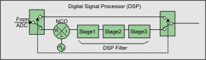

# Sense:IF Commands

* * *

Controls the DSP filters for use with the VNA X.

SENSe:IF | BANDwidth | FILTer | FILTer | AUTO | CMODe | ERRors? | STAGe | COEFicients | COUNt? | FREQuency | CATalog? | PARameter | TYPE | PCATalog? | FREQuency | AUTO | VALue  
---  
  
  * Click on a red keyword to view the command details.

  * [Synchronizing the Analyzer and Controller](../../Learning_about_GPIB/Understanding_Command_Synchronization.md)

  * [SCPI Command Tree](../SCPI_Command_Tree.md)

  * [Pulse commands](SweepPulse.md)

PNA-X DSP Block diagram

All of the Sense:IF commands, except the frequency commands, make settings
related to the DSP section of the IF Path.

See the entire [IF Path
Configuration.](../../../IFAccess/IF_Path_Configuration.htm)

  * For any of the Filter "Stage" parameters to take effect, [SENS:IF:FILT:AUTO](XSensIF.md#auto) must be set to OFF (MANUAL) and mode, and [SENS:IF:FILT:CMOD](XSensIF.md#CaptMode) must be set to OFF.
  * Stage2 settings are ignored when using DSP 5 versions.
  * Programs that control these settings, or state files that are saved, will yield different results when run or recalled on VNAs with DSP 4 versions versus DSP 5 versions. [Learn more about DSP versions.](../../../S0_Start/HelpAbout.md#DSPchanges)
  * Critical Note: These commands act on the selected measurement. You can select one measurement for each channel using [Calc:Par:Select](../Calculate/Parameter.md#cps)

  
---  
  
* * *

## SENSe<cnum>:IF:BANDwidth:FILTer <enum>

Applicable Models: N522xB and N524xB (Read-Write) Sets and returns the IF
bandwidth filter shape. [Learn
more](../../../S2_Opt/Trce_Noise.htm#IFBW_Shape). [Critical
Note](XSensIF.htm#Critical)  
---  
**Parameters** |   
<cnum> |  Existing channel number.  If unspecified, <cnum> is set to 1.  
<enum> |  (String) Filter shape. Chose from:

  * STANdard \- Legacy filter. This filter has a good tradeoff between frequency selectivity and side lobes, which rise to approximately -32 dBc.
  * GAUSsian \- This filter takes longer to acquire a point but has very low side lobes.
  * RECTangular \- This is the fastest filter, but with high side lobes that rise to approximately -13 dBc.

  
**Examples** |  SENS:IF:BAND:FILT GAUS sense2:if:bandwidth:filter standard  
Query Syntax |  SENSe<cnum>:IF:BANDwidth:FILTer?  
**Return Type** |  String  
**[Default](JavaScript:hhctrl.TextPopup\(DefSCPI,'Arial,8',10,10,00000000,0xc0ffff\))** |  STANdard  
  
* * *

## SENSe<cnum>:IF:FILTer:AUTO <bool>

Applicable Models: N522xB and N524xB (Read-Write) Sets and returns whether the
VNA configures the 3-stage digital filter settings or they will be configured
manually. When making manual settings, also send [SENS:IF:FILT:CMOD
OFF](XSensIF.htm#CaptMode) which routes the IF through the 3-stage filter.
[Critical Note](XSensIF.md#Critical)  
---  
**Parameters** |   
<cnum> |  Existing channel number.  If unspecified, <cnum> is set to 1.  
<bool> |  (Boolean) ON (or 1) - Automatic: VNA controls digital filter settings. OFF (or 0) - Manual: You control digital filter settings using other Sens:IF commands.  
**Examples** |  SENS:IF:FILT:AUTO 1  
sense2:if:filter:auto 0  
Query Syntax |  SENSe<cnum>:IF:FILTer:AUTO?  
**Return Type** |  Boolean  
**[Default](JavaScript:hhctrl.TextPopup\(DefSCPI,'Arial,8',10,10,00000000,0xc0ffff\))** |  ON  
  
* * *

## SENSe:IF:FILTer:CMODe <bool>

Applicable Models: N522xB and N524xB  (Read-Write) Sets and returns the ADC
capture mode modeled as a 2-pole switch in the above diagram. The switch
either bypasses or routes the IF through the 3-stage digital filter. [Critical
Note](XSensIF.htm#Critical)  
---  
**Parameters** |   
<bool> |  (Boolean) ON (or 1) - The digital filters are bypassed and the raw ADC readings are taken directly. With DSP 4 versions, a maximum of 4096 data points per sweep can be acquired. With DSP 5 versions, the [VNA maximum data points](../../../S1_Settings/DPoints.md#PointsDiag) per sweep can be acquired. [Learn more about DSP Versions.](../../../S0_Start/HelpAbout.md#DSPchanges) OFF (or 0) - The digital filters are used to process IF information. The filters can be configured automatically or manually using [SENS:IF:FILT:AUTO](XSensIF.md#auto).  
**Examples** |  SENS:IF:FILT:CMOD 1  
sense2:if:filter:cmode 0  
Query Syntax |  SENSe<cnum>:IF:FILTer:CMODe?  
**Return Type** |  Boolean  
**[Default](JavaScript:hhctrl.TextPopup\(DefSCPI,'Arial,8',10,10,00000000,0xc0ffff\))** |  OFF  
  
* * *

## SENSe<cnum>:IF:FILTer:ERRors?

Applicable Models: N522xB and N524xB (Read-only) Returns the error string
associated with the digital filters. The return string has three fields
separated by commas: "stage1 status, stage2 status, stage3 status" Each of
these fields can contain one or more of the following error codes:

  * NO ERROR
  * *NUMBER-OF-COEFFICIENTS \- the number of coefficients is excessive for that filter-stage
  * *COEFFICIENT VALUE \- one or more coefficients are out of range for that filter-stage
  * *SUM-OF-COEFFICIENTS \- the sum of all coefficients is excessive for that filter-stage,
  * *FREQUENCY \- the frequency for Stage 1 is out of range (only applies stage1 field),
  * *PARAMETER \- one or more parameters are out of range (only applies to stage 3 field)

[Critical Note](XSensIF.md#Critical)  
---  
**Parameters** |   
<cnum> |  Existing channel number.  If unspecified, <cnum> is set to 1.  
**Examples** |  SENS:IF:FILT:ERR? 'example return strings" NO ERROR, NO ERROR, NO ERROR  
indicates no errors, *SUM-OF-COEFFICIENTS, NO ERROR, NO ERROR  
indicates that the sum of all filter coefficients exceed the maximum value for
the Stage-1 filter, *COEFFICIENT *SUM-OF-COEFFICIENTS, NO ERROR, *PARAMETER  
indicates a problems with Stage 1 coefficients and a problem with one or more
of the parameters associated with the Stage 3 filter.  
**Return Type** |  String  
**[Default](JavaScript:hhctrl.TextPopup\(DefSCPI,'Arial,8',10,10,00000000,0xc0ffff\))** |  Not Applicable  
  
* * *

## SENSe<cnum>:IF:FILTer:STAGe<n>:COEFficients <coef>

Applicable Models: N522xB and N524xB (Read-Write) Sets and returns the digital
filter coefficients of the specified stage. Note: Stage2 settings are ignored
when using DSP Version 5. [Learn
more.](../../../S0_Start/HelpAbout.htm#DSPchanges) [Critical
Note](XSensIF.htm#Critical)  
---  
**Parameters** |   
<cnum> |  Existing channel number.  If unspecified, <cnum> is set to 1.  
<n> |  Stage number. Choose 1, 2, or 3.  
<coef> |  Filter coefficients. For stages 1 and 2, values can be sent as integers or in floating point format. If floating point, the values are truncated to integers. The valid range is 0 to 131071. For stage 3: An array of floating point values. The valid range is any value within range of a floating point.  
**Examples** |  SENS:IF:FILT:STAG2:COEF 0,0.1,0.7,0.7,0.1 sense2:if:filter:stage3:coefficients +0.0E+000,+6.4E+001,+2.56E+002  
Query Syntax |  SENSe<cnum>:IF:FILTer:STAGe<n>:COEFficients?  
Example |  SENS:IF:FILT:STAG2:COEF?  
**Return Type** |  Floating point values  
**[Default](JavaScript:hhctrl.TextPopup\(DefSCPI,'Arial,8',10,10,00000000,0xc0ffff\))** |  Stage dependent  
  
* * *

## SENSe<cnum>:IF:FILTer:STAGe<n>:COUNt? [char]

Applicable Models: N522xB and N524xB (Read-only) Returns the number of taps in
the digital filter of the specified stage.  The filter sample count setting is
only used when [SENSe:IF:FILTer:AUTO](XSensIF.md#auto) is set to False
(MANUAL). Note: Stage2 settings are ignored when using DSP Version 5. [Learn
more.](../../../S0_Start/HelpAbout.htm#DSPchanges) [Critical
Note](XSensIF.htm#Critical)  
---  
**Parameters** |   
<cnum> |  Existing channel number.  If unspecified, <cnum> is set to 1.  
<n> |  Stage number. Choose 1, 2, or 3  
[char] |  Optional parameter. Choose from: MIN \- returns the minimum number of coefficients for the specified stage. Stage1: 10, Stage2: 1, Stage3: 2 MAX \- returns the maximum number of coefficients for the specified stage. Stage1 & 2: 1024, Stage3: 102400  
**Examples** |  SENS:IF:FILT:STAG2:COUN? sense2:if:filter:stage1:count? max  
**Return Type** |  Numeric  
**[Default](JavaScript:hhctrl.TextPopup\(DefSCPI,'Arial,8',10,10,00000000,0xc0ffff\))** |  Stage dependent  
  
* * *

## SENSe<cnum>:IF:FILTer:STAGe1:FREQuency <value>

Applicable Models: N522xB and N524xB (Read-Write) Sets and returns the
Numerically Controlled Oscillator (NCO) frequency. This command is only used
when [SENSe:IF:FILTer:AUTO](XSensIF.md#auto) is set to False (Manual).
[Critical Note](XSensIF.md#Critical)  
---  
**Parameters** |   
<cnum> |  Existing channel number.  If unspecified, <cnum> is set to 1.  
<value> |  Stage 1 Frequency. Min value= 0 Hz With DSP 4 versions, Max value= 15 MHz. With DSP 5 versions, Max value = 38 MHz. Or programmatically use the Max and Min queries to determine the range of settable values. [Learn more about DSP versions.](../../../S0_Start/HelpAbout.md#DSPchanges)  
**Examples** |  SENS:IF:FILT:STAGe1:FREQ 9e6  
sense2:if:filter:stage1:frequency 9.2e6  
Query Syntax |  SENSe<cnum>:IF:FILTer:STAGe1:FREQuency? 'returns the current parameter value SENSe<cnum>:IF:FILTer:STAGe1:FREQuency? Min 'returns the minimum frequency value. SENSe<cnum>:IF:FILTer:STAGe1:FREQuency? Max 'returns the maximum frequency value.  
**Return Type** |  Numeric  
**[Default](JavaScript:hhctrl.TextPopup\(DefSCPI,'Arial,8',10,10,00000000,0xc0ffff\))** |  Nominal IF Frequency. [Learn more](../../../IFAccess/IF_Path_Configuration.md#IFFrquencies)  
  
* * *

## SENSe<cnum>:IF:FILTer:STAGe3:CATalog?

Applicable Models: N522xB and N524xB (Read-only) Returns a list of strings for
the currently supported filter types that can be used for the stage 3 filter.
This command is only used when [SENSe:IF:FILTer:AUTO](XSensIF.md#auto) is set
to False (Manual). See [SENS:IF:FILT:STAGe3:TYPE](XSensIF.md#stg3Type) for a
list of currently supported filter types. [Critical
Note](XSensIF.htm#Critical)  
---  
**Parameters** |   
<cnum> |  Existing channel number.  If unspecified, <cnum> is set to 1.  
**Examples** |  SENS:IF:FILT:STAGe3:CAT?  
sense2:if:filter:stage3:catalog?  
**Return Type** |  String array  
**[Default](JavaScript:hhctrl.TextPopup\(DefSCPI,'Arial,8',10,10,00000000,0xc0ffff\))** |  Not Applicable  
  
* * *

## SENSe<cnum>:IF:FILTer:STAGe3:PARameter 
, <value>

Applicable Models: N522xB and N524xB (Read-Write) Sets and returns the Stage 3
filter parameters. Must first select the filter type
([SENS:IF:FILT:STAGe3:TYPE](XSensIF.md#stg3Type)) before setting these
parameters Use [SENSe:IF:FILT:STAGe3:PCAT?](XSensIF.md#stg3Pcat) to return a
list of the available parameters for the currently selected filter type.
[Critical Note](XSensIF.md#Critical)  
---  
**Parameters** |   
<cnum> |  Existing channel number.  If unspecified, <cnum> is set to 1.  

 |  (String) Filter parameter. Case Sensitive. Choose from: "C" - Tap count (Tukey, RECT, PWIN) "P" \- Period (PWIN ONLY) "D" \- Delay (PWIN ONLY) "W" \- Width (PWIN ONLY) "R" \- Ramp Count (PWIN ONLY) "M" \- Number of times to repeat the user-supplied array for each data point (COEF ONLY)  
<value> |  (Numeric) Parameter Value for the specified stage 3 parameter. Use the query form to return the minimum and maximum values for the specified parameter.  
**Examples** |  SENS:IF:FILT:STAGe3:PAR "C",64 sense2:if:filter:stage3:parameter "d",0.5E-6  
Query Syntax |  SENSe<cnum>:IF:FILTer:STAGe3:PARameter? 
 returns the current parameter value SENSe<cnum>:IF:FILTer:STAGe3:PARameter? 
,Min returns the minimum parameter value. SENSe<cnum>:IF:FILTer:STAGe3:PARameter? 
,Max returns the maximum parameter value.  
**Examples** |  SENS:IF:FILT:STAGe3:PAR? "C" sense2:if:filter:stage3:parameter? "d",min  
**Return Type** |  Numeric  
**[Default](JavaScript:hhctrl.TextPopup\(DefSCPI,'Arial,8',10,10,00000000,0xc0ffff\))** |  RECT: C = 1 PWIN: C=1E6, P=10ms, D=50us, W=50us, R=7 TUKEY: C=1 COEF: M=1  
  
* * *

## SENSe<cnum>:IF:FILTer:STAGe3:PCATalog?

Applicable Models: N522xB and N524xB (Read-only) Returns a list of the
available parameters for the currently selected filter type. [Critical
Note](XSensIF.htm#Critical)  
---  
**Parameters** |   
<cnum> |  Existing channel number.  If unspecified, <cnum> is set to 1.  
**Examples** |  SENS:IF:FILT:STAGe3:PCAT?  
sense2:if:filter:stage3:pcatalog?  
**Return Type** |  String  
**[Default](JavaScript:hhctrl.TextPopup\(DefSCPI,'Arial,8',10,10,00000000,0xc0ffff\))** |  Not Applicable  
  
* * *

## SENSe<cnum>:IF:FILTer:STAGe3:TYPE <value>

Applicable Models: N522xB and N524xB (Read-Write) Sets and returns the Stage 3
filter type. This command is only used when
[SENSe:IF:FILTer:AUTO](XSensIF.md#auto) is set to False (Manual). [Critical
Note](XSensIF.htm#Critical)  
---  
**Parameters** |   
<cnum> |  Existing channel number.  If unspecified, <cnum> is set to 1.  
<value> |  (String) Filter type. Chose from:

  * "RECT" Rectangular Window Filter
  * "TUKEY" Tukey Filter
  * "PWIN" Pulse Window Filter
  * "COEF" User-supplied array

  
**Examples** |  SENS:IF:FILT:STAGe3:TYPE RECT sense2:if:filter:stage3:type pwin  
Query Syntax |  SENSe<cnum>:IF:FILTer:STAGe3:TYPE?  
**Return Type** |  String  
**[Default](JavaScript:hhctrl.TextPopup\(DefSCPI,'Arial,8',10,10,00000000,0xc0ffff\))** |  "TUKEY"  
  
* * *

## SENSe<cnum>:IF:FREQuency:AUTO <bool>

Applicable Models: N522xB and N524xB (Read-Write) Sets and returns the method
for specifying the way the IF Frequency is determined. [Critical
Note](XSensIF.htm#Critical)  
---  
**Parameters** |   
<cnum> |  Existing channel number.  If unspecified, <cnum> is set to 1.  
<bool> |  (Boolean) ON (or 1) - Automatic. VNA determines the setting for the IF frequency. The IF frequency is based on many VNA settings, including measurement frequency. Therefore, it is NOT possible to read the IF frequency that is being used. OFF (or 0) - Manual. Use [SENS:IF:FREQ](XSensIF.md#freqValue) to set the frequency.  
**Examples** |  SENS:IF:FREQ:AUTO 1  
sense2:if:frequency:auto 0  
Query Syntax |  SENSe<cnum>:IF:FREQuency:AUTO?  
**Return Type** |  Boolean  
**[Default](JavaScript:hhctrl.TextPopup\(DefSCPI,'Arial,8',10,10,00000000,0xc0ffff\))** |  ON  
  
* * *

## SENSe<cnum>:IF:FREQuency[:VALue] <value>

Applicable Models: N522xB, N524xB (Read-Write) Sets and returns the IF
frequency for ALL receiver paths being used for the specified channel. To set
this frequency, [SENS:IF:FREQ:AUTO](XSensIF.md#FreqAuto) must be set to OFF
(Manual). Also returns the maximum and minimum allowable frequency settings.
[Learn more.](../../../IFAccess/IF_Path_Configuration.md#IFFrquencies)
[Critical Note](XSensIF.md#Critical)  
---  
**Parameters** |   
<cnum> |  Existing channel number.  If unspecified, <cnum> is set to 1.  
<value> |  (Numeric) Frequency value. For N522xB and N524xB models, the settable range is -38 MHz to +38 MHz. Setting a negative IF frequency: The LO frequency cannot go below 10 MHz. RF and IF frequencies determine the instrument LO frequency (LO = RF + IF). Therefore both the RF and IF frequency settings must be considered to ensure this. Example 1: If RF is 10 MHz and LO cannot go below 10 MHz, then IF cannot go below 0 Hz (10 MHz = 10 MHz + 0 Hz). Example 2: If RF is 100 MHz and LO cannot go below 10 MHz, then IF cannot go below -90 MHz (10 MHz = 100 MHz + -90 MHz). Use the Max and Min Queries to determine the range of this setting. (SENS:IF:FREQ? Max)  
**Examples** |  SENS:IF:FREQ 9.1e6  
sense2:if:frequency:value 8.9e6  
Query Syntax |  SENSe<cnum>:IF:FREQuency? 'returns the current frequency setting SENSe<cnum>:IF:FREQuency? Max 'returns the maximum allowable frequency setting SENSe<cnum>:IF:FREQuency? Min 'returns the minimum allowable frequency setting  
**Return Type** |  Numeric  
**[Default](JavaScript:hhctrl.TextPopup\(DefSCPI,'Arial,8',10,10,00000000,0xc0ffff\))** |  9 MHz  
  
* * *

