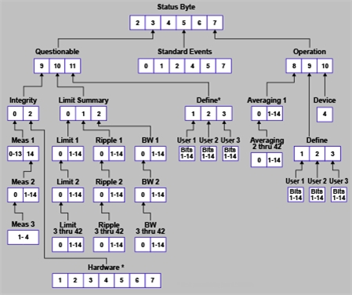

# Status Register Commands

* * *

The status registers enable you to query the state of selected events that
occur in the analyzer.

Note: This documentation requires familiarity with the "Standard Status Data
Structure - Register Model" as defined in IEEE Std 488.2-1992. Also, first
read [Learn about Status
Registers](../Learning_about_GPIB/Reading_the_Analyzers_Status_Registers.htm)

See also this Keysight support article: [IEEE 488.2 REGISTERS ON VNA AND HOW
TO USE THEM FOR SYNCHRONIZATION WITH *OPC AND
PYTHON](https://support.keysight.com/KeysightdCX/s/knowledge-article-
detail?language=en_US&keyid=IEEE-488-2-Registers-on-VNA-and-how-to-use-them-
for-Synchronization-with-OPC-and-Python)

STATus: OPERation | AVERaging | DEFine | USER | DEVice PRESet QUEStionable | DEFine | USER | INTegrity | HARDware | MEASurement | LIMit | LSUMmary | BLIMit | LIMit | RLIMit Standard Events Status Byte  
---  
  
Click on a red keyword to view the command details.

See Also

  * [Example Programs](../GPIB_Example_Programs/SCPI_Example_Programs.md)

  * [Learn about Status Registers](../Learning_about_GPIB/Reading_the_Analyzers_Status_Registers.md)

  * [Synchronizing the Analyzer and Controller](../Learning_about_GPIB/Understanding_Command_Synchronization.md)

  * [SCPI Command Tree](SCPI_Command_Tree.md)

Notes:

  * Any bit not shown in the registers is not used but may be reserved for future use.

  * The [SCPIStringParser](../COM_Reference/Objects/SCPIStringParser_Object.md) can NOT be used with SCPI Status Reporting. However, the *OPC? will work.

## STATus:OPERation<keyword>  
  
---  
Applicable Models: All Summarizes conditions in the Averaging and
Operation:Define:User<1|2|3> event registers.  
<[keyword](Status_Keywords.md)> | 

#### Example  
  
:CONDition? | STAT:OPER:COND?  
:ENABle <bits> | STAT:OPER:ENAB 1024  
[:EVENt]? | STAT:OPER?  
:NTRansition <bits> | STAT:OPER:NTR 1024  
:PTRansition <bits> | STAT:OPER:PTR 0  
  
* * *

Bit | Weight | Description | Bit is set to 1 when the following conditions exist:  
---|---|---|---  
8 | 256 | Averaging summary | either enabled bit in the Averaging summary event register is set to 1  
9 | 512 | User Defined summary |   
10 | 1024 | Device summary | either enabled bit in the Device summary event register is set to 1  
  
* * *

## STATus:OPERation:AVERaging<n> <keyword>  
  
---  
Applicable Models: All Monitors and summarizes the status of Averaging on
traces 1 to 580. When averaging for a trace is complete, the representative
bit is set to 1. Bit 0 is used to summarize the status in the registers that
follow. For example, Average Register 3, bit 0, summarizes the status from
registers 4 through 42. All enable bits are set to 1 by default. To find the
measurement number, use [Calc:Par:Mnum](Calculate/Parameter.md#MnumSel).  
<n> | Averaging Register. Choose from 1 to 42  
<[keyword](Status_Keywords.md)> | 

#### Example  
  
:CONDition? | STAT:OPER:AVER1:COND?  
:ENABle <bits> | STAT:OPER:AVER1:ENAB 1024  
[:EVENt]? | STAT:OPER:AVER1?  
:NTRansition <bits> | STAT:OPER:AVER1:NTR 1024  
:PTRansition <bits> | STAT:OPER:AVER1:PTR 0  
  
* * *

|  | Averaging Register <n> |   
---|---|---|---  
Bit | Weight | 1 | 2 | 3 | 4 | 5 | 6 | 7 | 8 | ... | 41 | 42 | Bit is set to 1 when the following conditions exist:  
0 | 1 | 2-42 | 3-42 | 4-42 | 5-42 | 6-42 | 7-42 | 8-42 | 9-42 | ... | 42 | \-- | Summary Bit - If any bit from that register fails, it propagates to the previous register, bit 0.  
|  | Trace Numbers |   
1 | 2 | 1 | 15 | 29 | 43 | 57 | 71 | 85 | 99 | ... | 561 | 575 | Averaging on this trace is complete  
2 | 4 | 2 | 16 | 30 | 44 | 58 | 72 | 86 | 100 | ... | 562 | 576 | Averaging on this trace is complete  
3 | 8 | 3 | 17 | 31 | 45 | 59 | 73 | 87 | 101 | ... | 563 | 577 | Averaging on this trace is complete  
4 | 16 | 4 | 18 | 32 | 46 | 60 | 74 | 88 | 102 | ... | 564 | 578 | Averaging on this trace is complete  
5 | 32 | 5 | 19 | 33 | 47 | 61 | 75 | 89 | 103 | ... | 565 | 579 | Averaging on this trace is complete  
6 | 64 | 6 | 20 | 34 | 48 | 62 | 76 | 90 | 104 | ... | 566 | 580 | Averaging on this trace is complete  
7 | 128 | 7 | 21 | 35 | 49 | 63 | 77 | 91 | 105 | ... | 567 | \-- | Averaging on this trace is complete  
8 | 256 | 8 | 22 | 36 | 50 | 64 | 78 | 92 | 106 | ... | 568 | \-- | Averaging on this trace is complete  
9 | 512 | 9 | 23 | 37 | 51 | 65 | 79 | 93 | 107 | ... | 569 | \-- | Averaging on this trace is complete  
10 | 1024 | 10 | 24 | 38 | 52 | 66 | 80 | 94 | 108 | ... | 570 | \-- | Averaging on this trace is complete  
11 | 2048 | 11 | 25 | 39 | 53 | 67 | 81 | 95 | 109 | ... | 571 | \-- | Averaging on this trace is complete  
12 | 4096 | 12 | 26 | 40 | 54 | 68 | 82 | 96 | 110 | ... | 572 | \-- | Averaging on this trace is complete  
13 | 8192 | 13 | 27 | 41 | 55 | 69 | 83 | 97 | 111 | ... | 573 | \-- | Averaging on this trace is complete  
14 | 16384 | 14 | 28 | 42 | 56 | 70 | 84 | 98 | 112 | ... | 574 | \-- | Averaging on this trace is complete  
  
To determine Register, Bit number, and Weight for trace numbers between 113
and 560 (not shown in the above table) use the following calculations.

The averaging status for trace numbers higher than 580 can NOT be tracked.

The following example calculates the Register, Bit number, and Bit Weight for
trace # 400:

  * To determine Register number, use ((Trace # - 1) / 14) + 1.

  * To determine Bit Number, use the remainder +1 of the above calculation.

  * ((400-1)/14) + 1 = Register# r+1Bit

  *     * 399/14 = 28 r7

    * 28+1= Register 29

    * 7+1= Bit number 8

  * To determine Bit Weight: Use above table. For example: Bit 8 = 256

* * *

## STATus:OPERation:DEFine<keyword>  
  
---  
Applicable Models: All Summarizes conditions in the
OPERation:Define:User<1|2|3> event registers.  
<[keyword](Status_Keywords.md)> | 

#### Example  
  
:CONDition? | STAT:OPER:DEF:COND?  
:ENABle <bits> | STAT:OPER:DEF:ENAB 12  
[:EVENt]? | STAT:OPER:DEF?  
:NTRansition <bits> | STAT:OPER:DEF:NTR 12  
:PTRansition <bits> | STAT:OPER:DEF:PTR 0  
  
* * *

Bit | Weight | Description | Bit is set to 1 when the following conditions exist:  
---|---|---|---  
1 | 2 | USER1 | any bit in the USER1 event register is set to 1  
2 | 4 | USER2 | any bit in the USER2 event register is set to 1  
3 | 8 | USER3 | any bit in the USER3 event register is set to 1  
  
* * *

## STATus:OPERation:DEFine:USER<1|2|3><keyword>  
  
---  
Applicable Models: All Monitors conditions that you define and map in any of
the three OPER:DEF:USER event registers.  
<[keyword](Status_Keywords.md)> | 

#### Example  
  
:CONDition? | STAT:OPER:DEF:USER1:COND?  
:ENABle <bits> | STAT:OPER:DEF:USER1:ENAB 1024  
[:EVENt]? | STAT:OPER:DEF:USER1?  
:MAP <bit>,<error> | STAT:OPER:DEF:USER1:MAP 0,-113 'when error -113 occurs, bit 0 in USER1 will set to 1.  
:NTRansition <bits> | STAT:OPER:DEF:USER1:NTR 12  
:PTRansition <bits> | STAT:OPER:DEF:PTR 0  
  
* * *

Bit | Weight | Description | Bit is set to 1 when the following conditions exist:  
---|---|---|---  
0 | 1 | for user | user defined  
1 | 2 | for user | user defined  
2 | 4 | for user | user defined  
3 | 8 | for user | user defined  
4 | 16 | for user | user defined  
5 | 32 | for user | user defined  
6 | 64 | for user | user defined  
7 | 128 | for user | user defined  
8 | 256 | for user | user defined  
9 | 512 | for user | user defined  
10 | 1024 | for user | user defined  
11 | 2048 | for user | user defined  
12 | 4096 | for user | user defined  
13 | 8192 | for user | user defined  
14 | 16384 | for user | user defined  
  
* * *

## STATus:OPERation:DEVice<keyword>  
  
---  
Applicable Models: All Summarizes conditions in the OPERation:DEVice event
registers.  
<[keyword](Status_Keywords.md)> | 

#### Example  
  
:CONDition? | STAT:OPER:DEV:COND?  
:ENABle <bits> | STAT:OPER:DEV:ENAB 16  
[:EVENt]? | STAT:OPER:DEV?  
:NTRansition <bits> | STAT:OPER:DEV:NTR 16  
:PTRansition <bits> | STAT:OPER:DEV:PTR 0  
  
* * *

Bit | Weight | Description | Bit is set to 1 when the following conditions exist:  
---|---|---|---  
0 | 1 | Unused |   
1 | 2 | Unused |   
2 | 4 | Unused |   
3 | 8 | Unused |   
4 | 16 | Sweep Completed | When sweep is complete  
5 | 32 | Unused |   
6 | 64 | Unused |   
7 | 128 | Unused |   
8 | 256 | Unused |   
9 | 512 | Unused |   
10 | 1024 | Unused |   
11 | 2048 | Unused |   
12 | 4096 | Unused |   
13 | 8192 | Unused |   
14 | 16384 | Unused |   
  
* * *

## STATus:PRESet

Applicable Models: All (Write-only) Initializes all the status registers.  
---  
Example | STAT:PRES  
  
* * *

## STATus:QUEStionable:<keyword>  
  
---  
Applicable Models: All Summarizes conditions that monitor the quality of
measurement data.  
<[keyword](Status_Keywords.md)> | 

#### Example  
  
:CONDition? | STAT:QUES:COND?  
:ENABle <bits> | STAT:QUES:ENAB 1024  
[:EVENt]? | STAT:QUES?  
:NTRansition <bits> | STAT:QUES:NTR 1024  
:PTRansition <bits> | STAT:QUES:PTR 0  
  
* * *

Bit | Weight | Description | Bit is set to 1 when the following conditions exist:  
---|---|---|---  
9 | 512 | Integrity Reg summary | any enabled bit in the Integrity event register is set to 1  
10 | 1024 | Limit Registers summary | any enabled bit in the Limit event registers is set to 1  
11 | 2048 | Define Registers summary | any enabled bit in the Define event registers is set to 1  
  
* * *

## STATus:QUEStionable:DEFine<keyword>  
  
---  
Applicable Models: All Summarizes conditions in the
Questionable:Define:User<1|2|3> event registers.  
<[keyword](Status_Keywords.md)> | 

#### Example  
  
:CONDition? | STAT:QUES:DEF:COND?  
:ENABle <bits> | STAT:QUES:DEF:ENAB 1024  
[:EVENt]? | STAT:QUES:DEF?  
:NTRansition <bits> | STAT:QUES:DEF:NTR 1024  
:PTRansition <bits> | STAT:QUES:DEF:PTR 0  
  
* * *

Bit | Weight | Description | Bit is set to 1 when the following conditions exist:  
---|---|---|---  
1 | 2 | USER1 | any bit in the USER1 event register is set to 1  
2 | 4 | USER2 | any bit in the USER2 event register is set to 1  
3 | 8 | USER3 | any bit in the USER3 event register is set to 1  
  
* * *

## STATus:QUEStionable:DEFine:USER<1|2|3><keyword>  
  
---  
Applicable Models: All Monitors conditions that you define and map in any of
the three QUES:DEF:USER event registers.  
<[keyword](Status_Keywords.md)> | 

#### Example  
  
:CONDition? | STAT:QUES:DEF:USER1:COND?  
:ENABle <bits> | STAT:QUES:DEF:USER1:ENABle 1024  
[:EVENt]? | STAT:QUES:DEF:USER1?  
:MAP <bit>,<error> | STAT:QUES:DEF:USER1:MAP 0,-113 'when error -113 occurs, bit 0 in USER1 will set to 1.  
:NTRansition <bits> | STAT:QUES:DEF:USER1:NTR 1024  
:PTRansition <bits> | STAT:QUES:DEF:USER1:PTR 0  
  
* * *

Bit | Weight | Description | Bit is set to 1 when the following conditions exist:  
---|---|---|---  
0 | 1 | for user | user defined  
1 | 2 | for user | user defined  
2 | 4 | for user | user defined  
3 | 8 | for user | user defined  
4 | 16 | for user | user defined  
5 | 32 | for user | user defined  
6 | 64 | for user | user defined  
7 | 128 | for user | user defined  
8 | 256 | for user | user defined  
9 | 512 | for user | user defined  
10 | 1024 | for user | user defined  
11 | 2048 | for user | user defined  
12 | 4096 | for user | user defined  
13 | 8192 | for user | user defined  
14 | 16384 | for user | user defined  
  
* * *

## STATus:QUEStionable:INTegrity <keyword>  
  
---  
Applicable Models: All Summarizes conditions in the Measurement Integrity
register.  
<[keyword](Status_Keywords.md)> | 

#### Example  
  
:CONDition? | STAT:QUES:INT:COND?  
:ENABle <bits> | STAT:QUES:INT:ENAB 1024  
[:EVENt]? | STAT:QUES:INT?  
:NTRansition <bits> | STAT:QUES:INT:NTR 1024  
:PTRansition <bits> | STAT:QUES:INT:PTR 0  
  
* * *

Bit | Weight | Description | Bit is set to 1 when the following conditions exist:  
---|---|---|---  
0 | 1 | Measurement Summary | any bit in the Measurement Integrity event register is set to 1  
2 | 4 | Hardware Summary | any bit in the Hardware event register is set to 1  
  
* * *

## STATus:QUEStionable:INTegrity:HARDware<keyword>  
  
---  
Applicable Models: All Monitors the status of hardware failures.  
<[keyword](Status_Keywords.md)> | 

#### Example  
  
:CONDition? | STAT:QUES:INT:HARD:COND?  
:ENABle <bits> | STAT:QUES:INT:HARD:ENAB 1024  
[:EVENt]? | STAT:QUES:INT:HARD?  
:NTRansition <bits> | STAT:QUES:INT:HARD:NTR 1024  
:PTRansition <bits> | STAT:QUES:INT:HARD:PTR 0  
  
* * *

Bit | Weight | Description | Bit is set to 1 when the following conditions exist:  
---|---|---|---  
1 | 2 | Phase Unlock | the source has lost phaselock, possibly caused by a reference channel open or a hardware failure.  
2 | 4 | Unleveled | the source power is unleveled. This could be caused by a source set for more power than it can deliver at the tuned frequency. Or it could be caused by a hardware failure.  
3 | 8 | Not used | N/A  
4 | 16 | EE Write Failed | an attempted write to the EEPROM has failed, possibly caused by a hardware failure. (N522xB, N523xB, N524xB, M937xA, P937xA only)  
5 | 32 | Not used | N/A  
6 | 64 | Ramp Cal Failed | the analyzer was unable to calibrate the analog ramp generator due to a possible hardware failure.  
7 | 128 | Not used | N/A  
  
* * *

## STATus:QUEStionable:INTegrity:MEASurement<n> <keyword>  
  
---  
Applicable Models: All Note: This register can be used ONLY with standard
S-parameter measurements. Monitors the lag between changing a channel setting
and when the data is ready to query. When you change the channel state
(start/stop freq, bandwidth, and so forth), then the questionable bit for that
channel is set. This indicates that your desired channel state does not yet
match the data you would get if querying a data trace. When the next sweep is
complete (without aborting in the middle), and the data trace matches the
channel state that produced it, the bit is cleared for that channel.  
<n> | Measurement register number. Choose from 1 to 3  
<[keyword](Status_Keywords.md)> | 

#### Example  
  
:CONDition? | STAT:QUES:INT:MEAS1:COND?  
:ENABle <bits> | STAT:QUES:INT:MEAS2:ENAB 1024  
[:EVENt]? | STAT:QUES:INT:MEAS3?  
:NTRansition <bits> | STAT:QUES:INT:MEAS2:NTR 1024  
:PTRansition <bits> | STAT:QUES:INT:MEAS1:PTR 0  
  
* * *

|  | Measurement Register <n> |   
---|---|---|---  
Bit | Weight | 1 | 2 | 3 | Bit is set to 1 when the following conditions exist:  
0 | 1 | 1 | Summary from Meas Reg 3 |  | a setting change on this channel has occurred and the data does not yet reflect that change.  
1 | 2 | 2 | 15 | 29 | a setting change on this channel has occurred and the data does not yet reflect that change.  
2 | 4 | 3 | 16 | 30 | a setting change on this channel has occurred and the data does not yet reflect that change.  
3 | 8 | 4 | 17 | 31 | a setting change on this channel has occurred and the data does not yet reflect that change.  
4 | 16 | 5 | 18 | 32 | a setting change on this channel has occurred and the data does not yet reflect that change.  
5 | 32 | 6 | 19 |  | a setting change on this channel has occurred and the data does not yet reflect that change.  
6 | 64 | 7 | 20 |  | a setting change on this channel has occurred and the data does not yet reflect that change.  
7 | 128 | 8 | 21 |  | a setting change on this channel has occurred and the data does not yet reflect that change.  
8 | 256 | 9 | 22 |  | a setting change on this channel has occurred and the data does not yet reflect that change.  
9 | 512 | 10 | 23 |  | a setting change on this channel has occurred and the data does not yet reflect that change.  
10 | 1024 | 11 | 24 |  | a setting change on this channel has occurred and the data does not yet reflect that change.  
11 | 2048 | 12 | 25 |  | a setting change on this channel has occurred and the data does not yet reflect that change.  
12 | 4096 | 13 | 26 |  | a setting change on this channel has occurred and the data does not yet reflect that change.  
13 | 8192 | 14 | 27 |  | a setting change on this channel has occurred and the data does not yet reflect that change.  
14 | 16384 | Summary from Meas Reg 2 | 28 |  | a setting change on this channel has occurred and the data does not yet reflect that change.  
  
* * *

## STATus:QUEStionable:LIMit<n> <keyword>  
  
---  
Applicable Models: All Monitors and summarizes the status of limit line
failures. When a trace fails, the representative bit is set to 1. Bit 0 is
used to summarize failures in the registers that follow. For example, Limit
Register 3, bit 0, summarizes the failures from registers 4 through 42. All
enable bits are set to 1 by default. To find the measurement number, use
[Calc:Par:Mnum](Calculate/Parameter.md#MnumSel)  
<n> | Limit register: Choose from 1 to 42.  
<[keyword](Status_Keywords.md)> | 

#### Example  
  
:CONDition? | STAT:QUES:LIM4:COND?  
:ENABle <bits> | STAT:QUES:LIM1:ENAB 1024  
[:EVENt]? | STAT:QUES:LIM3?  
:NTRansition <bits> | STAT:QUES:LIM2:NTR 1024  
:NTRansition? | STAT:QUES:LIM1:NTR?  
:PTRansition <bits> | STAT:QUES:LIM5:PTR 0  
:PTRansition? | STAT:QUES:LIM1:PTR?  
  
* * *

|  | Limit Register <n> |   
---|---|---|---  
Bit | Weight | 1 | 2 | 3 | 4 | 5 | 6 | 7 | 8 | ... | 41 | 42 | Bit is set to 1 when the following conditions exist:  
0 | 1 | 2-42 | 3-42 | 4-42 | 5-42 | 6-42 | 7-42 | 8-42 | 9-42 | ... | 42 | \-- | Summary Bit - If any bit from that register fails, it propagates to the previous register, bit 0.  
|  | Trace Numbers |   
1 | 2 | 1 | 15 | 29 | 43 | 57 | 71 | 85 | 99 | ... | 561 | 575 | any point on trace fails the limit test  
2 | 4 | 2 | 16 | 30 | 44 | 58 | 72 | 86 | 100 | ... | 562 | 576 | any point on trace fails the limit test  
3 | 8 | 3 | 17 | 31 | 45 | 59 | 73 | 87 | 101 | ... | 563 | 577 | any point on trace fails the limit test  
4 | 16 | 4 | 18 | 32 | 46 | 60 | 74 | 88 | 102 | ... | 564 | 578 | any point on trace fails the limit test  
5 | 32 | 5 | 19 | 33 | 47 | 61 | 75 | 89 | 103 | ... | 565 | 579 | any point on trace fails the limit test  
6 | 64 | 6 | 20 | 34 | 48 | 62 | 76 | 90 | 104 | ... | 566 | 580 | any point on trace fails the limit test  
7 | 128 | 7 | 21 | 35 | 49 | 63 | 77 | 91 | 105 | ... | 567 | \-- | any point on trace fails the limit test  
8 | 256 | 8 | 22 | 36 | 50 | 64 | 78 | 92 | 106 | ... | 568 | \-- | any point on trace fails the limit test  
9 | 512 | 9 | 23 | 37 | 51 | 65 | 79 | 93 | 107 | ... | 569 | \-- | any point on trace fails the limit test  
10 | 1024 | 10 | 24 | 38 | 52 | 66 | 80 | 94 | 108 | ... | 570 | \-- | any point on trace fails the limit test  
11 | 2048 | 11 | 25 | 39 | 53 | 67 | 81 | 95 | 109 | ... | 571 | \-- | any point on trace fails the limit test  
12 | 4096 | 12 | 26 | 40 | 54 | 68 | 82 | 96 | 110 | ... | 572 | \-- | any point on trace fails the limit test  
13 | 8192 | 13 | 27 | 41 | 55 | 69 | 83 | 97 | 111 | ... | 573 | \-- | any point on trace fails the limit test  
14 | 16384 | 14 | 28 | 42 | 56 | 70 | 84 | 98 | 112 | ... | 574 | \-- | any point on trace fails the limit test  
  
To determine Register, Bit number, and Weight for trace numbers between 113
and 560 (not shown in the above table) use the following calculations.

The limit status for trace numbers higher than 580 can NOT be tracked.

The following example calculates the Register, Bit number, and Bit Weight for
trace # 400:

  * To determine Limit Register number, use ((Trace # - 1) / 14) + 1.

  * To determine Limit Bit Number, use the remainder +1 of the above calculation.

  * ((400-1)/14) + 1 = Register# r+1Bit

  *     * 399/14 = 28 r7

    * 28+1= Register 29

    * 7+1= Bit number 8

  * To determine Limit Bit Weight: Use above table. For example: Bit 8 = 256

* * *

## STATus:QUEStionable:LSUMmary:<keyword>  
  
---  
Applicable Models: All Summary register of limit test, ripple test and
bandwidth test. bit 0: summary bit for the limit test. bit 1: summary bit for
the ripple limit test. bit 2: summary bit for the bandwidth limit test.  
<[keyword](status_keywords.md)> | 

#### Example  
  
:CONDition? | STAT:QUES:LSUM:COND?  
:ENABle <bits> | STAT:QUES:LSUM:ENAB 8  
[:EVENt]? | STAT:QUES:LSUM?  
:NTRansition <bits> | STAT:QUES:LSUM:NTR 8  
:PTRansition <bits> | STAT:QUES:LSUM:PTR 0  
  
* * *

## STATus:QUEStionable:LSUMmary:BLIMit <n>:<keyword>  
  
---  
Applicable Models: All Monitors and summarizes the status of bandwidth limit
line failures. When a trace fails, the representative bit is set to 1. Bit 0
is used to summarize failures in the registers that follow. Refer the
STATus:QUEStionable:LSUMmary:LIMit for the trace number information. All
enable bits are set to 1 by default. To find the measurement number, use
[Calc:Par:Mnum](calculate/parameter.md#MnumSel)  
<n> | Bandwidth Limit register. Choose from 1 to 42..  
<[keyword](status_keywords.md)> | 

#### Example  
  
:CONDition? | STAT:QUES:LSUM:BLIM:COND?  
:ENABle <bits> | STAT:QUES:LSUM:BLIM:ENAB 1024  
[:EVENt]? | STAT:QUES:LSUM:BLIM?  
:NTRansition <bits> | STAT:QUES:LSUM:BLIM:NTR 1024  
:PTRansition <bits> | STAT:QUES:LSUM:BLIM:PTR 0  
  
* * *

## STATus:QUEStionable:LSUMmary:LIMit<n>: <keyword>  
  
---  
Applicable Models: All Monitors and summarizes the status of limit line
failures. When a trace fails, the representative bit is set to 1. Bit 0 is
used to summarize failures in the registers that follow. For example, Limit
Register 3, bit 0, summarizes the failures from registers 4 through 42. All
enable bits are set to 1 by default. To find the measurement number, use
[Calc:Par:Mnum](calculate/parameter.md#MnumSel)  
<n> | Limit register. Choose from 1 to 42.  
<[keyword](status_keywords.md)> | 

#### Example  
  
:CONDition? | STAT:QUES:LSUM:LIM4:COND?  
:ENABle <bits> | STAT:QUES:LSUM:LIM1:ENAB 1024  
[:EVENt]? | STAT:QUES:LSUM:LIM3?  
:NTRansition <bits> | STAT:QUES:LSUM:LIM2:NTR 1024  
:NTRansition? | STAT:QUES:LSUM:LIM1:NTR?  
:PTRansition <bits> | STAT:QUES:LSUM:LIM5:PTR 0  
:PTRansition? | STAT:QUES:LSUM:LIM1:PTR?  
  
* * *

|  | Limit Register <n> |   
---|---|---|---  
Bit | Weight | 1 | 2 | 3 | 4 | 5 | 6 | 7 | 8 | ... | 41 | 42 | Bit is set to 1 when the following conditions exist:  
0 | 1 | 2-42 | 3-42 | 4-42 | 5-42 | 6-42 | 7-42 | 8-42 | 9-42 | ... | 42 | \-- | Summary Bit - If any bit from that register fails, it propagates to the previous register, bit 0.  
|  | Trace Numbers |   
1 | 2 | 1 | 15 | 29 | 43 | 57 | 71 | 85 | 99 | ... | 561 | 575 | any point on trace fails the limit test  
2 | 4 | 2 | 16 | 30 | 44 | 58 | 72 | 86 | 100 | ... | 562 | 576 | any point on trace fails the limit test  
3 | 8 | 3 | 17 | 31 | 45 | 59 | 73 | 87 | 101 | ... | 563 | 577 | any point on trace fails the limit test  
4 | 16 | 4 | 18 | 32 | 46 | 60 | 74 | 88 | 102 | ... | 564 | 578 | any point on trace fails the limit test  
5 | 32 | 5 | 19 | 33 | 47 | 61 | 75 | 89 | 103 | ... | 565 | 579 | any point on trace fails the limit test  
6 | 64 | 6 | 20 | 34 | 48 | 62 | 76 | 90 | 104 | ... | 566 | 580 | any point on trace fails the limit test  
7 | 128 | 7 | 21 | 35 | 49 | 63 | 77 | 91 | 105 | ... | 567 | \-- | any point on trace fails the limit test  
8 | 256 | 8 | 22 | 36 | 50 | 64 | 78 | 92 | 106 | ... | 568 | \-- | any point on trace fails the limit test  
9 | 512 | 9 | 23 | 37 | 51 | 65 | 79 | 93 | 107 | ... | 569 | \-- | any point on trace fails the limit test  
10 | 1024 | 10 | 24 | 38 | 52 | 66 | 80 | 94 | 108 | ... | 570 | \-- | any point on trace fails the limit test  
11 | 2048 | 11 | 25 | 39 | 53 | 67 | 81 | 95 | 109 | ... | 571 | \-- | any point on trace fails the limit test  
12 | 4096 | 12 | 26 | 40 | 54 | 68 | 82 | 96 | 110 | ... | 572 | \-- | any point on trace fails the limit test  
13 | 8192 | 13 | 27 | 41 | 55 | 69 | 83 | 97 | 111 | ... | 573 | \-- | any point on trace fails the limit test  
14 | 16384 | 14 | 28 | 42 | 56 | 70 | 84 | 98 | 112 | ... | 574 | \-- | any point on trace fails the limit test  
  
To determine Register, Bit number, and Weight for trace numbers between 113
and 560 (not shown in the above table) use the following calculations.

The limit status for trace numbers higher than 580 can NOT be tracked.

The following example calculates the Register, Bit number, and Bit Weight for
trace # 400:

  * To determine Limit Register number, use ((Trace # - 1) / 14) + 1.

  * To determine Limit Bit Number, use the remainder +1 of the above calculation.

  * ((400-1)/14) + 1 = Register# r+1Bit

  *     * 399/14 = 28 r7

    * 28+1= Register 29

    * 7+1= Bit number 8

  * To determine Limit Bit Weight: Use above table. For example: Bit 8 = 256

* * *

## STATus:QUEStionable:LSUMmary:RLIMit <cnum>:<keyword>  
  
---  
Applicable Models: All Monitors and summarizes the status of ripple limit line
failures. When a trace fails, the representative bit is set to 1. Bit 0 is
used to summarize failures in the registers that follow. Refer the
STATus:QUEStionable:LSUMmary:LIMit for the trace number information. All
enable bits are set to 1 by default. To find the measurement number, use
[Calc:Par:Mnum](calculate/parameter.md#MnumSel)  
<n> | Ripple limit channel status register. Choose from 1 to 42.  
<[keyword](status_keywords.md)> | 

#### Example  
  
:CONDition? | STAT:QUES:LSUM:RLIM:COND?  
:ENABle <bits> | STAT:QUES:LSUM:RLIM:ENAB 1024  
[:EVENt]? | STAT:QUES:LSUM:RLIM?  
:NTRansition <bits> | STAT:QUES:LSUM:RLIM:NTR 1024  
:PTRansition <bits> | STAT:QUES:LSUM:RLIM:PTR 0  
  
* * *

## Standard Event Status Register  
  
---  
Applicable Models: All Monitors "standard" events that occur in the analyzer.
This register can only be cleared by:

  * a Clear Command (*CLS).
  * reading the Standard Event Status Register (*ESR?).
  * a power-on transition. The analyzer clears the register and then records any transitions that occur, including setting the Power On bit (7).

  
  
    

#### Commands

|

#### Description  
  
    *ESE?
| Reads the settings of the standard event ENABLE register.  
  
    *ESE <bits>
| Sets bits in the standard event ENABLE register. The current setting is
saved in non-volatile memory. <bits> The sum of weighted bits in the register.
Use *ESE 0 to clear the enable register.  
  
    *ESR?
| Reads and clears the EVENT settings in the Standard Event Status register.  
*OPC | Sets bit 0 when the overlapped command is complete. (see Understanding Command Synchronization / OPC).  
  
* * *

Bit | Weight | Description | Bit is set to 1 when the following conditions exist:  
---|---|---|---  
0 | 1 | Operation Complete | the two following events occur in order:

  1. the *OPC command is sent to the analyzer
  2. the analyzer completes all pending overlapped commands

  
1 | NA | Request Control | Not Supported \- the analyzer application is not configured to control GPIB operation  
2 | 4 | Query Error | a query error is detected indicating:  
\- an attempt to read data from the output queue when no data was present OR  
\- data in the output queue was lost, as in an overflow  
3 | 8 | Instrument Dependent Error | Set to "1" when an error has occurred and the error is not a command, query, or execution error.  
4 | 16 | Execution Error | an execution error is detected indicating:  
\- a <PROGRAM DATA> element was outside the legal range or inconsistent with
the operation of the analyzer OR  
- the analyzer could not execute a valid command due to some internal condition  
5 | 32 | Command Error | a command error is detected indicating that the analyzer received a command that:

  * did not follow proper syntax
  * was misspelled
  * was an optional command it does not implement

  
6 | 64 | Not used | Always 0  
7 | 128 | Power ON | Power to the analyzer has been turned OFF and then ON since the last time this register was read.  
  
* * *

## Status Byte Register  
  
---  
Applicable Models: All Summarizes the states of the other registers and
monitors the VNA output queue. It also generates service requests. The Enable
register is called the Service Request Enable Register.  
  
#### Commands

|

#### Description  
  
*CLS | Clears ALL "event" registers and the SCPI Error / Event queue. The corresponding ENABLE registers are unaffected.  
*STB? | Reads the value of the analyzer's status byte. The byte remains after being read.  
*SRE? | Reads the current state of the Service Request Enable Register.  
*SRE <num> | Sets bits in the Service Request Enable register. The current setting of the SRE register is stored in non-volatile memory. Use *SRE 0 to clear the enable. <num> Combined value of the weights for bits to be set.  
  
* * *

Bit | Weight | Description | Bit is set to 1 when the following conditions exist:  
---|---|---|---  
2 |  4 | Error / Event queue Summary (EAV) | the Error / Event queue is not empty. To read the error message, use [SYST:ERR?](System.md#error)  
3 | 8 | Questionable Register Summary | any enabled bit in the questionable event status register is set to 1  
4 | 16 | Message Available | the output queue is not empty  
5 | 32 | Standard Event Register Summary | any enabled bit in the standard event status register is set to 1  
6 | 64 | Request Service | any of the other bits in the status byte register is set to 1 (used to alert the controller of a service request within the analyzer). This bit cannot be disabled.  
7 | 128 | Operation Register Summary | any enabled bit in the standard operation event status register is set to 1  
  
* * *

