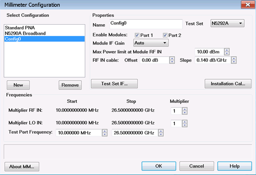
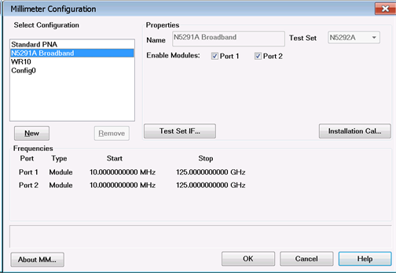

# SYSTem:CONFigure:MWAVe Commands

Controls and queries settings that affect Millimeter Wave measurements.

#### Millimeter Module Configuration

|  
---|---  
Banded Configuration Dialog  Broadband Configuration Dialog  | SYSTem:CONFigure:MWAVe:CONF:ACTive  
SYSTem:CONFigure:MWAVe:CONF:ADD  
SYSTem:CONFigure:MWAVe:CONF:CATalog?  
SYSTem:CONFigure:MWAVe:CONF:REMove  
SYSTem:CONFigure:MWAVe:FREQuency:LO:MULTiplier  
SYSTem:CONFigure:MWAVe:FREQuency:LO:SOURce  
SYSTem:CONFigure:MWAVe:FREQuency:LO:STARt?  
SYSTem:CONFigure:MWAVe:FREQuency:LO:STOP?  
SYSTem:CONFigure:MWAVe:FREQuency:RF:MULTiplier  
SYSTem:CONFigure:MWAVe:FREQuency:RF:SOURce  
SYSTem:CONFigure:MWAVe:FREQuency:RF:STARt?  
SYSTem:CONFigure:MWAVe:FREQuency:RF:STOP?  
SYSTem:CONFigure:MWAVe:FREQuency:STARt  
SYSTem:CONFigure:MWAVe:FREQuency:STOP  
SYSTem:CONFigure:MWAVe:TSET:ALC  
SYSTem:CONFigure:MWAVe:TSET:CATalog?  
SYSTem:CONFigure:MWAVe:TSET:MIXer  
SYSTem:CONFigure:MWAVe:TSET:NAME  
SYSTem:CONFigure:MWAVe:TSET:PORT  
SYSTem:CONFigure:MWAVe:TSET:PORT:COUNt?  
SYSTem:CONFigure:MWAVe:TSET:POWer:LIMit  
SYSTem:CONFigure:MWAVe:TSET:POWer:OFFSet  
SYSTem:CONFigure:MWAVe:TSET:POWer:SLOPe  
SYSTem:CONFigure:MWAVe:TSET:RPANel  
SYSTem:CONFigure:MWAVe:CONF:ACTive:CALibration:DATE  
SYSTem:CONFigure:MWAVe:CONF:ACTive:CALibration:TIME  
SYSTem:CONFigure:MWAVe:CONF:ACTive:MODel?  
SYSTem:CONFigure:MWAVe:CONF:ACTive:OPTion?  
SYSTem:CONFigure:MWAVe:CONF:ACTive:SERial?  
SYSTem:CONFigure:MWAVe:CONF:ACTive:PORT{1:4}:CALibration:DATE  
SYSTem:CONFigure:MWAVe:CONF:ACTive:PORT{1:4}:CALibration:TIME  
SYSTem:CONFigure:MWAVe:CONF:ACTive:PORT{1:4}:MODel?  
SYSTem:CONFigure:MWAVe:CONF:ACTive:PORT{1:4}:OPTion?  
SYSTem:CONFigure:MWAVe:CONF:ACTive:PORT{1:4}:SERial?  
SYSTem:CONFigure:MWAVe:SERial?  
  
See Also

  * [N5251A Millimeter Module Configuration](../../IFAccess/External_Test_Head_Configuration.md#MillimeterDiagHelp)

  * [N5290A/N5291A Millimeter Module Configuration](../../IFAccess/N5290A-91A_mmWave_Configuration/Millimeter_Configuration.md)

## SYSTem:CONFigure:MWAVe:CONF:ACTive <string>

Applicable Models: N5261A, N5262A, N5252A, N5292A (Read-Write) Set and return
the active configuration. Note: Any changes to configuration settings are not
active until the SYSTem:CONFigure:MWAVe:CONF:ACTive command is executed.  
---  
Parameters |   
<string> | The name of the mmWave configuration to activate.  
Examples | SYST:CONF:MWAV:CONF:ACT "N5291A Broadband" 'Set to broadband configuration SYST:CONF:MWAV:CONF:ACT "WR10" 'Set to banded configuration system:configure:mwave:conf:active "Standard PNA" 'Set to standard PNA configuration  
Query Syntax | SYSTem:CONFigure:MWAVe:CONF:ACTive?  
Return Type | String  
Default | Not applicable  
  
* * *

## SYSTem:CONFigure:MWAVe:CONF:ACTive:CALibration:DATE?

Applicable Models: N5293A, N5295A (Read-only) Return the calibration date of
the active configuration's test set. Three integers are returned
(year,month,day). All three integers will be 0 if there is no calibration data
for the active test set.  
---  
Parameters | None  
Examples | SYST:CONF:MWAV:CONF:ACT:CAL:DATE? system:configure:mwave:conf:active:calibration:date?  
Return Type | Integer  
Default | Not applicable  
  
* * *

## SYSTem:CONFigure:MWAVe:CONF:ACTive:CALibration:TIME?

Applicable Models: N5293A, N5295A (Read-only) Return the calibration time of
the active configuration's test set. Three integers are returned
(hour,minute,second). All three integers will be 0 if there is no calibration
data for the active test set.  
---  
Parameters | None  
Examples | SYST:CONF:MWAV:CONF:ACT:CAL:TIME? system:configure:mwave:conf:active:calibration:time?  
Return Type | Integer  
Default | Not applicable  
  
* * *

## SYSTem:CONFigure:MWAVe:CONF:ACTive:MODel?

Applicable Models: N5293A, N5295A (Read-only) Return the model number of the
active test set.  
---  
Parameters | None  
Examples | SYST:CONF:MWAV:CONF:ACT:MOD? system:configure:mwave:conf:active:model?  
Return Type | String  
Default | Not applicable  
  
* * *

## SYSTem:CONFigure:MWAVe:CONF:ACTive:OPTion?

Applicable Models: N5293A, N5295A (Read-only) Return the option number of the
active test set.  
---  
Parameters | None  
Examples | SYST:CONF:MWAV:CONF:ACT:OPT? system:configure:mwave:conf:active:option?  
Return Type | String  
Default | Not applicable  
  
* * *

## SYSTem:CONFigure:MWAVe:CONF:ACTive:PORT{1:4}:CALibration:DATE?

Applicable Models: N5293A, N5295A (Read-only) Return the calibration date of
the active configuration's port. Three integers are returned (year,month,day).
All three integers will be 0 if there is no calibration data for the active
port.  
---  
Parameters | None  
Examples | SYST:CONF:MWAV:CONF:ACT:PORT1:CAL:DATE? system:configure:mwave:conf:active:port1:calibration:date?  
Return Type | Integer  
Default | Not applicable  
  
* * *

## SYSTem:CONFigure:MWAVe:CONF:ACTive:PORT{1:4}:CALibration:TIME?

Applicable Models: N5293A, N5295A (Read-only) Return the calibration time of
the active configuration's port. Three integers are returned
(hour,minute,second). All three integers will be 0 if there is no calibration
data for the active port.  
---  
Parameters | None  
Examples | SYST:CONF:MWAV:CONF:ACT:PORT1:CAL:TIME? system:configure:mwave:conf:active:port1:calibration:time?  
Return Type | Integer  
Default | Not applicable  
  
* * *

## SYSTem:CONFigure:MWAVe:CONF:ACTive:PORT{1:4}:MODel?

Applicable Models: N5293A, N5295A (Read-only) Return the model number of the
frequency extender module connected to the specified port number.  
---  
Parameters | None  
Examples | SYST:CONF:MWAV:CONF:ACT:PORT1:MOD? system:configure:mwave:conf:active:port1:model?  
Return Type | String  
Default | Not applicable  
  
* * *

## SYSTem:CONFigure:MWAVe:CONF:ACTive:PORT{1:4}:OPTion?

Applicable Models: N5293A, N5295A (Read-only) Return the option number of the
frequency extender module connected to the specified port number.  
---  
Parameters | None  
Examples | SYST:CONF:MWAV:CONF:ACT:PORT1:OPT? system:configure:mwave:conf:active:port1:option?  
Return Type | String  
Default | Not applicable  
  
* * *

## SYSTem:CONFigure:MWAVe:CONF:ACTive:PORT{1:4}:SERial?

Applicable Models: N5293A, N5295A (Read-only) Return the serial number of the
frequency extender module connected to the specified port number.  
---  
Parameters | None  
Examples | SYST:CONF:MWAV:CONF:ACT:PORT1:SER? system:configure:mwave:conf:active:port1:serial?  
Return Type | String  
Default | Not applicable  
  
* * *

## SYSTem:CONFigure:MWAVe:CONF:ACTive:SERial?

Applicable Models: N5292A (Read-only) Return the serial number of the test
set.  
---  
Parameters | None  
Examples | SYST:CONF:MWAV:CONF:ACT:SER? system:configure:mwave:conf:active:serial?  
Return Type | String  
Default | Not applicable  
  
* * *

## SYSTem:CONFigure:MWAVe:CONF:ADD <string>

Applicable Models: N5261A, N5262A, N5252A, N5292A (Read-Write) Add a banded
mmWave configuration.  
---  
Parameters |   
<string> | The name of the mmWave configuration to add.  
Examples | SYST:CONF:MWAV:CONF:ADD "WR10" system:configure:mwave:conf:add "wr10"  
Query Syntax | SYSTem:CONFigure:MWAVe:CONF:ADD?  
Return Type | String  
Default | Not applicable  
  
* * *

## SYSTem:CONFigure:MWAVe:CONF:CATalog?

Applicable Models: N5261A, N5262A, N5252A, N5292A (Read-only) Returns the list
of mmWave configurations.  
---  
Parameters |   
Examples | SYST:CONF:MWAV:CONF:CAT? system:configure:mwave:conf:catalog?  
Return Type | Comma-delimited string.  
Default | Not applicable  
  
* * *

## SYSTem:CONFigure:MWAVe:CONF:REMove <string>

Applicable Models: N5261A, N5262A, N5252A, N5292A (Write-only) Remove a mmWave
configuration.  
---  
Parameters |   
<string> | The name of the mmWave configuration to remove.  
Examples | SYST:CONF:MWAV:CONF:REM "WR10" system:configure:mwave:conf:remove "wr10"  
Return Type | Not applicable  
Default | Not applicable  
  
* * *

## SYSTem:CONFigure:MWAVe:FREQuency:LO:MULTiplier <string>,<value>

Applicable Models: N5261A, N5262A, N5252A, N5292A (Read-Write) Set and read
the LO multiplier value for the specified configuration. The LO Frequency
Range multiplied by this value equals the test port frequency. Learn more
about [frequency
settings](../../IFAccess/External_Test_Head_Configuration.htm#Frequency_Settings).
Note: Any changes to configuration settings are not active until the
SYSTem:CONFigure:MWAVe:CONF:ACTive command is executed.  
---  
Parameters |   
<string> | The name of the mmWave configuration.  
<value> | Choose a value within the range of the analyzer.  
Examples | SYST:CONF:MWAV:FREQ:LO:MULT "WR10",8 system:configure:mwave:frequency:lo:multiplier "WR10",8  
Query Syntax | SYSTem:CONFigure:MWAVe:FREQuency:LO:MULTiplier? "WR10"  
Return Type | Integer  
Default | 1  
  
* * *

## SYSTem:CONFigure:MWAVe:FREQuency:LO:SOURce <string>,<source>

Applicable Models: N5261A, N5262A, N5292A (Read-Write) Set and read the LO
source for the specified configuration. [Learn
more](../../IFAccess/External_Test_Head_Configuration.htm#Source). Note: Any
changes to configuration settings are not active until the
SYSTem:CONFigure:MWAVe:CONF:ACTive command is executed.  
---  
Parameters |   
<string> | The name of the mmWave configuration.  
<source> | The name of the LO source.  
Examples | SYST:CONF:MWAV:FREQ:LO:SOUR "WR10","LO_Source" system:configure:mwave:frequency:lo:source "WR10","LO_Source"  
Query Syntax | SYSTem:CONFigure:MWAVe:FREQuency:LO:SOURce? "WR10"  
Return Type | String  
Default | Internal LO source  
  
* * *

## SYSTem:CONFigure:MWAVe:FREQuency:LO:STARt? <string>

Applicable Models: N5261A, N5262A, N5252A, N5292A (Read-only) Return the
calculated LO start frequency using the LO multiplier for the specified
configuration. Learn more about [frequency
settings](../../IFAccess/External_Test_Head_Configuration.htm#Frequency_Settings).  
---  
Parameters |   
<string> | The name of the mmWave configuration.  
Examples | SYST:CONF:MWAV:FREQ:LO:STAR? "WR10" system:configure:mwave:frequency:lo:start? "WR10"  
Return Type | Double  
Default | Dependent on the range of the analyzer  
  
* * *

## SYSTem:CONFigure:MWAVe:FREQuency:LO:STOP? <string>

Applicable Models: N5261A, N5262A, N5252A, N5292A (Read-only) Return the
calculated LO stop frequency using the LO multiplier for the specified
configuration. Learn more about [frequency
settings](../../IFAccess/External_Test_Head_Configuration.htm#Frequency_Settings).  
---  
Parameters |   
<string> | The name of the mmWave configuration.  
Examples | SYST:CONF:MWAV:FREQ:LO:STOP? "WR10" system:configure:mwave:frequency:lo:stop? "WR10"  
Return Type | Double  
Default | Dependent on the range of the analyzer  
  
* * *

## SYSTem:CONFigure:MWAVe:FREQuency:RF:MULTiplier <string>,<value>

Applicable Models: N5261A, N5262A, N5252A, N5292A (Read-Write) Set and read
the RF multiplier value for the specified configuration. The RF Frequency
Range multiplied by this value equals the test port frequency range. Learn
more about [frequency
settings](../../IFAccess/External_Test_Head_Configuration.htm#Frequency_Settings).
Note: Any changes to configuration settings are not active until the
SYSTem:CONFigure:MWAVe:CONF:ACTive command is executed.  
---  
Parameters |   
<string> | The name of the mmWave configuration.  
<value> | Choose a value within the range of the analyzer.  
Examples | SYST:CONF:MWAV:FREQ:RF:MULT "WR10",6 system:configure:mwave:frequency:rf:multiplier "WR10",6  
Query Syntax | SYSTem:CONFigure:MWAVe:FREQuency:RF:MULTiplier? "WR10"  
Return Type | Integer  
Default | 1  
  
* * *

## SYSTem:CONFigure:MWAVe:FREQuency:RF:SOURce <string>,<source>

Applicable Models: N5261A, N5262A, N5292A (Read-Write) Set and read the RF
source for the specified configuration. [Learn
more](../../IFAccess/External_Test_Head_Configuration.htm#Source). Note: Any
changes to configuration settings are not active until the
SYSTem:CONFigure:MWAVe:CONF:ACTive command is executed.  
---  
Parameters |   
<string> | The name of the mmWave configuration.  
<source> | The name of the RF source.  
Examples | SYST:CONF:MWAV:FREQ:RF:SOUR "WR10","RF_Source" system:configure:mwave:frequency:rf:source "WR10","RF_Source"  
Query Syntax | SYSTem:CONFigure:MWAVe:FREQuency:RF:SOURce? "WR10"  
Return Type | String  
Default | Internal RF source  
  
* * *

## SYSTem:CONFigure:MWAVe:FREQuency:RF:STARt? <string>

Applicable Models: N5261A, N5262A, N5252A, N5292A (Read-only) Return the
calculated RF start frequency using the RF multiplier for the specified
configuration. Learn more about [frequency
settings](../../IFAccess/External_Test_Head_Configuration.htm#Frequency_Settings).  
---  
Parameters |   
<string> | The name of the mmWave configuration.  
Examples | SYST:CONF:MWAV:FREQ:RF:STAR? "WR10" system:configure:mwave:frequency:rf:start? "WR10"  
Return Type | Double  
Default | Dependent on the range of the analyzer  
  
* * *

## SYSTem:CONFigure:MWAVe:FREQuency:RF:STOP? <string>

Applicable Models: N5261A, N5262A, N5252A, N5292A (Read-only) Return the
calculated RF stop frequency using the RF multiplier for the specified
configuration. Learn more about [frequency
settings](../../IFAccess/External_Test_Head_Configuration.htm#Frequency_Settings).  
---  
Parameters |   
<string> | The name of the mmWave configuration.  
Examples | SYST:CONF:MWAV:FREQ:RF:STOP? "WR10" system:configure:mwave:frequency:rf:stop? "WR10"  
Return Type | Double  
Default | Dependent on the range of the analyzer  
  
* * *

## SYSTem:CONFigure:MWAVe:FREQuency:STARt <string>,<value>

Applicable Models: N5261A, N5262A, N5252A, N5292A (Read-Write) Set and read
the start frequency for the specified configuration. Learn more about
[frequency
settings](../../IFAccess/External_Test_Head_Configuration.htm#Frequency_Settings).
Note: Any changes to configuration settings are not active until the
SYSTem:CONFigure:MWAVe:CONF:ACTive command is executed.  
---  
Parameters |   
<string> | The name of the mmWave configuration.  
<value> | The start frequency.  
Examples | SYST:CONF:MWAV:FREQ:STAR "WR10",75e9 system:configure:mwave:frequency:start "WR10",75e9  
Query Syntax | SYSTem:CONFigure:MWAVe:FREQuency:STAR? "WR10"  
Return Type | Double  
Default | Dependent on the range of the analyzer  
  
* * *

## SYSTem:CONFigure:MWAVe:FREQuency:STOP <string>,<value>

Applicable Models: N5261A, N5262A, N5252A, N5292A (Read-Write) Set and read
the stop frequency for the specified configuration. Learn more about
[frequency
settings](../../IFAccess/External_Test_Head_Configuration.htm#Frequency_Settings).
Note: Any changes to configuration settings are not active until the
SYSTem:CONFigure:MWAVe:CONF:ACTive command is executed.  
---  
Parameters |   
<string> | The name of the mmWave configuration.  
<value> | The stop frequency.  
Examples | SYST:CONF:MWAV:FREQ:STOP "WR10",110e9 system:configure:mwave:frequency:stop "WR10",110e9  
Query Syntax | SYSTem:CONFigure:MWAVe:FREQuency:STOP? "WR10"  
Return Type | Double  
Default | Dependent on the range of the analyzer  
  
* * *

## SYSTem:CONFigure:MWAVe:SERial?

Applicable Models: N5290A, N5291A (Read-only) Return the serial number of the
mmWave system.  
---  
Parameters | None  
Examples | SYST:CONF:MWAV:SER? system:configure:mwave:serial? "M42147691962"  
Return Type | String  
Default | Not applicable  
  
* * *

## SYSTem:CONFigure:MWAVe:TSET:ALC <string>,<bool>

Applicable Models: N5261A, N5262A (Read-Write) Enable or disable automatic
power leveling for the specified configuration. Learn more about [test set
properties](../../IFAccess/External_Test_Head_Configuration.htm#Test_Set_Properties).
Note: Any changes to configuration settings are not active until the
SYSTem:CONFigure:MWAVe:CONF:ACTive command is executed.  
---  
Parameters |   
<string> | The name of the mmWave configuration.  
<bool> | Choose from: 0 - OFF \- Disable automatic power leveling control. 1 - ON \- Enable automatic power leveling control.  
Examples | SYST:CONF:MWAV:TSET:ALC "WR10",1 system:configure:mwave:tset:alc "WR10",1  
Query Syntax | SYSTem:CONFigure:MWAVe:TSET:ALC? "WR10"  
Return Type | Boolean  
Default | 1  
  
* * *

## SYSTem:CONFigure:MWAVe:TSET:CATalog?

Applicable Models: N5261A, N5262A, N5292A (Read-only) Returns the list of
available test set names.  
---  
Parameters |   
Examples | SYST:CONF:MWAV:TSET:CAT? system:configure:mwave:tset:catalog?  
Return Type | Comma-delimited string.  
Default | Not applicable  
  
* * *

## SYSTem:CONFigure:MWAVe:TSET:MIXer <string>,<bool>

Applicable Models: N5261A, N5262A, N5292A (Read-Write) Enable or disable
mmWave mixer mode to allow mixer testing using the specified configuration.
Learn more about [test set
properties](../../IFAccess/External_Test_Head_Configuration.htm#Test_Set_Properties).
Note: Any changes to configuration settings are not active until the
SYSTem:CONFigure:MWAVe:CONF:ACTive command is executed.  
---  
Parameters |   
<string> | The name of the mmWave configuration.  
<bool> | Choose from: 0 - OFF \- Disable mmWave mixer mode. 1 - ON \- Enable mmWave mixer mode.  
Examples | SYST:CONF:MWAV:TSET:MIXer "WR10",0 system:configure:mwave:tset:mixer "WR10",0  
Query Syntax | SYSTem:CONFigure:MWAVe:TSET:MIXer? "WR10"  
Return Type | Boolean  
Default | 0  
  
* * *

## SYSTem:CONFigure:MWAVe:TSET:NAME <string>,<name>

Applicable Models: N5261A, N5262A, N5292A (Read-Write) Set and read the test
set name for the specified configuration. Note: Any changes to configuration
settings are not active until the SYSTem:CONFigure:MWAVe:CONF:ACTive command
is executed. Setting the test set name may reset the test set properties to
default values, which includes the following:

  * Enabled Modules
  * Mixer Mode
  * IF Gain
  * Route to Rear Panel
  * ALC Enabled
  * Power Limit
  * Power Offset
  * Power Slope

  
---  
Parameters |   
<string> | The name of the mmWave configuration.  
<name> | The name of the test set.  
Examples | SYST:CONF:MWAV:TSET:NAME "WR10","N5262A" system:configure:mwave:tset:name "WR10","N5262A"  
Query Syntax | SYSTem:CONFigure:MWAVe:TSET:NAME? "WR10"  
Return Type | String  
Default | Not applicable  
  
* * *

## SYSTem:CONFigure:MWAVe:TSET:PORT<port> <configuration>,<val>

Applicable Models: N5261A, N5262A, N5292A (Read-Write) This command enables or
disables modules for individual ports on a particular configuration. If an
N5292A test set is attached it will detect if a module is physically present
and only allow this command on those ports. Note: Any changes to configuration
settings are not active until the SYSTem:CONFigure:MWAVe:CONF:ACTive command
is executed.  
---  
Parameters |   
<port> | Test set port number.  
<configuration> | The name of the mmWave configuration. Use SYSTem:CONFigure:MWAVe:CONF:CATalog? for a list of configuration names.  
<val> | Enable/disable test set port. Choose from: 0 - OFF \- Disable test set port. 1 - ON \- Enable test set port.  
Examples | SYST:CONF:MWAV:TSET:PORT1 "WR10",1 system:configure:mwave:tset:port1 "WR10",1  
Query Syntax | SYSTem:CONFigure:MWAVe:TSET:PORT1? "N5291A Broadband"  
Return Type | Boolean  
Default | 0  
  
* * *

## SYSTem:CONFigure:MWAVe:TSET:PORT:COUNt? <string>

Applicable Models: N5261A, N5262A, N5292A (Read-only) Return the number of
ports on a test set. Only the test set ports having frequency extenders
attached are detected.  
---  
Parameters |   
<string> | The name of the mmWave configuration.  
Examples | SYST:CONF:MWAV:TSET:PORT:COUNt? "N5291A Broadband" system:configure:mwave:tset:port:count? "N5291A Broadband"  
Return Type | Integer  
Default | Not applicable  
  
* * *

## SYSTem:CONFigure:MWAVe:TSET:POWer:LIMit <string>,<value>

Applicable Models: N5261A, N5262A, N5252A, N5292A (Read-Write) Set and read
the test set power limit for the specified configuration. Learn more about
[test set
properties](../../IFAccess/External_Test_Head_Configuration.htm#Test_Set_Properties).
Note: Any changes to configuration settings are not active until the
SYSTem:CONFigure:MWAVe:CONF:ACTive command is executed.  
---  
Parameters |   
<string> | The name of the mmWave configuration.  
<value> | The power limit. Choose a value between -90 and +13 dBm.  
Examples | SYST:CONF:MWAV:TSET:POW:LIM "WR10",11 system:configure:mwave:tset:power:limit "WR10",11  
Query Syntax | SYSTem:CONFigure:MWAVe:TSET:POWer:LIMit? "WR10"  
Return Type | Double  
Default | 11 dBm  
  
* * *

## SYSTem:CONFigure:MWAVe:TSET:POWer:OFFSet <string>,<value>

Applicable Models: N5261A, N5262A, N5252A, N5292A (Read-Write) Set and read
the test set power offset for the specified configuration. Learn more about
[test set
properties](../../IFAccess/External_Test_Head_Configuration.htm#Test_Set_Properties).
Note: Any changes to configuration settings are not active until the
SYSTem:CONFigure:MWAVe:CONF:ACTive command is executed.  
---  
Parameters |   
<string> | The name of the mmWave configuration.  
<value> | The power offset. Choose a value between -30 and +30 dB.  
Examples | SYST:CONF:MWAV:TSET:POW:OFFS "WR10",0 system:configure:mwave:tset:power:offset "WR10",0  
Query Syntax | SYSTem:CONFigure:MWAVe:TSET:POWer:OFFSet? "WR10"  
Return Type | Double  
Default | 0 dB  
  
* * *

## SYSTem:CONFigure:MWAVe:TSET:POWer:SLOPe <string>,<value>

Applicable Models: N5261A, N5262A, N5252A, N5292A (Read-Write) Set and read
the test set power slope for the specified configuration. Learn more about
[test set
properties](../../IFAccess/External_Test_Head_Configuration.htm#Test_Set_Properties).
Note: Any changes to configuration settings are not active until the
SYSTem:CONFigure:MWAVe:CONF:ACTive command is executed.  
---  
Parameters |   
<string> | The name of the mmWave configuration.  
<value> | The power slope. Choose a value between -2 dB/GHz and +2 dB/GHz.  
Examples | SYST:CONF:MWAV:TSET:POW:SLOP "WR10",.113 system:configure:mwave:tset:power:slope "WR10",.113  
Query Syntax | SYSTem:CONFigure:MWAVe:TSET:POWer:SLOpe? "WR10"  
Return Type | Double  
Default | 0.113 dB/GHz  
  
* * *

## SYSTem:CONFigure:MWAVe:TSET:RPANel <string>,<bool>

Applicable Models: N5261A, N5262A (Read-Write) Set and read the status of the
RF power routing to the rear panel "SW SRC OUT" connector for the specified
configuration. Note: Any changes to configuration settings are not active
until the SYSTem:CONFigure:MWAVe:CONF:ACTive command is executed.  
---  
Parameters |   
<string> | The name of the mmWave configuration.  
<bool> | Choose from: 0 - OFF \- Disable RF power routing to rear panel. 1 - ON \- Enable RF power routing to rear panel "SW SRC OUT" connector.  
Examples | SYST:CONF:MWAV:TSET:RPAN "WR10",1 system:configure:mwave:tset:rpanel "WR10",1  
Query Syntax | SYSTem:CONFigure:MWAVe:TSET:RPANel? "WR10"  
Return Type | Boolean  
Default | 1  
  
* * *

