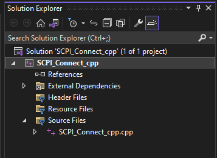
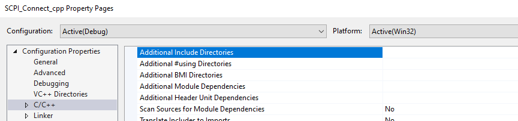
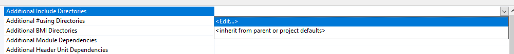
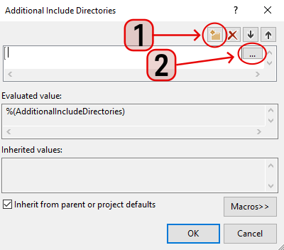

# Controlling the VNA Using C++

## Summary

Many practical applications of VNAs require automation and remote control of
the instrument. C++ is heavily used in industry for lower-level control, with
increased capability for speed, flexibility, and portability. Although the
SCPI-based automation implementation in this language is a little more
advanced than with other languages like Python or C#, there are many
appropriate use cases for it given C++'s widespread use.

## Prerequisites

This example was created in Microsoft Visual Studio 2022.

Before the example code will run, the folder containing the library
GlobMgr.dll must be added as an "include directory". To do this, right-click
on the project (not the source file) in the Solution Explorer and choose
Properties:

In the Property Pages, find the C/C++ configuration group and locate
"Additional Include Directories":

Clicking the dropdown arrow on the right side and selecting "<Edit...>" will
open the editor for this field.

Click the New Line button, then the ellipsis button to browse for a folder:

Browse to C:\Program Files\IVI Foundation\VISA\VisaCom64 and click Select
Folder, then OK. The folder will be added to the list. Click OK on the
Property Pages window.

Note: If these steps are not followed properly, you will see a red underline
on the #import line and Visual Studio will not be able to find the dll.

The IVI Foundation folder and containing files are installed alongside
Keysight IO Libraries.

## Example

* * *

`#include <iostream>`

`#include <stdio.h>`

`#import "C:\Program Files\IVI Foundation\VISA\VisaCom64\GlobMgr.dll"
no_namespace`

`using` `namespace` `std;`

`int` `main()`

`{`

` ``IResourceManagerPtr rmPtr;`

` ``IMessagePtr msgPtr;`

` ``IFormattedIO488Ptr fmioPtr;`

` ``HRESULT` `_ = CoInitialize(NULL);`

` ``_bstr_t dev_addr = ``"TCPIP0::localhost::hislip0::INSTR"``; ``// Edit this
to your address`

` ``try`

` ``{`

` ``// Instantiate the Global Resource Manager and Formatted IO class`

` ``rmPtr.CreateInstance(__uuidof(ResourceManager));`

` ``fmioPtr.CreateInstance(__uuidof(FormattedIO488));`

` ``// Open session with the default values for the Lock (None), Timeout(N/A),
OptionString ("")`

` ``msgPtr = rmPtr->Open(dev_addr, NO_LOCK, 0, ``""``);`

` ``_bstr_t idnstr;`

` ``long` `count = 100, written;`

` ``msgPtr->Clear();`

` ``written = msgPtr->WriteString(``"*IDN?\n"``);`

` ``idnstr = msgPtr->ReadString(count);`

` ``cout << idnstr;`

` ``}`

` ``catch` `(_com_error& err)`

` ``{`

` ``if` `(msgPtr != NULL)`

` ``{`

` ``msgPtr->Close();`

` ``msgPtr = NULL;`

` ``}`

` ``rmPtr = NULL;`

` ``fmioPtr = NULL;`

` `

` ``cout<< err.Description();`

` ``return` `1;`

` ``}`

` ``// Session must be closed before calling CoUninitialize() to avoid memory
reference issues`

` ``msgPtr->Close();`

` ``msgPtr = NULL;`

` ``rmPtr = NULL;`

` ``fmioPtr = NULL;`

` ``CoUninitialize();`

` ``return` `0;`

`}`

* * *

This example uses the library GlobMgr.dll to access the methods needed to
communicate with the instrument. When adding your own commands to this
example, use msgPtr->WriteString() and msgPtr->ReadString() to write commands
and read responses to queries, respectively.

