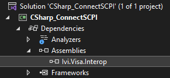

# Controlling the VNA Using C#

## Summary

Many practical applications of VNAs require automation and remote control of
the instrument. C# is well suited for this as it is a powerful and easy-to-use
language with a large developer community. Using C# to control a VNA can be
beneficial for users who want to customize their network analysis workflow,
automate tasks, and integrate the network analyzer into their own applications
or systems.

## Prerequisites

This example was created in Microsoft Visual Studio 2022 and .NET 6.0 LTS.

Before the example code will run, the library Ivi.Visa.Interop.dll must be
added as a project reference. By default this library is located here:

C:\Program Files\IVI Foundation\VISA\VisaCom64\Primary Interop Assemblies

The IVI Foundation folder and containing files are installed alongside
Keysight IO Libraries.

After adding the reference, it will appear in the Solution Explorer under
Assemblies:

## Example

This example shows the most basic way to connect to an instrument using HiSLIP
and C#. To add functionality based on your specific application, add SCPI
commands using fio.WriteString(string data) and fio.ReadString() within the
try...catch block. Find more SCPI commands from the [SCPI Command Tree](../GP-
IB_Command_Finder/SCPI_Command_Tree.htm). This code uses a try...catch block
to print error messages to the console instead of crashing the program.

* * *

`using` `System;`

`using` `Ivi.Visa.Interop;`

`namespace` `CSharp_ConnectSCPI`

`{`

` ``internal` `class` `Program`

` ``{`

` ``static` `void` `Main(``string``[] args)`

` ``{`

` ``// Create the Visa Interop objects so we can use their API`

` ``ResourceManager rm = ``new` `ResourceManager();`

` ``FormattedIO488 fio = ``new` `FormattedIO488();`

` ``// Connect to a VISA address`

` ``string` `VISA_ADDRESS = ``"TCPIP0::localhost::hislip0::INSTR"``;`

` ``fio.IO = (IMessage)rm.Open(VISA_ADDRESS);`

` ``// Send identification request to instrument`

` ``fio.WriteString(``"*IDN?"``);`

` `

` ``// Try to read the instrument's response`

` ``try`

` ``{`

` ``string` `response = fio.ReadString();`

` ``Console.WriteLine(response);`

` ``PrintErrors(fio);`

` ``}`

` ``catch` `(Exception ex)`

` ``{`

` ``// If error, write to console instead of crashing program`

` ``Console.WriteLine(ex.Message);`

` ``}`

` `

` ``// Close connection to instrument`

` ``fio.IO.Close();`

` ``} `

` `

` ``private` `static` `void` `PrintErrors(FormattedIO488 fio)`

` ``{`

` ``// Check how many errors are in the queue`

` ``fio.WriteString(``"SYST:ERR:COUN?"``);`

` ``int` `errorCount = ``int``.Parse(fio.ReadString());`

` ``if` `(errorCount == 0)`

` ``return``; ``// no errors`

` ``else`

` ``{`

` ``string` `errorMessage;`

` ``// Print each error message to console`

` ``for` `(``int` `i = 0; i < errorCount; i++)`

` ``{`

` ``fio.WriteString(``"SYST:ERR?"``);`

` ``errorMessage = fio.ReadString();`

` ``Console.WriteLine(errorMessage);`

` ``}`

` ``}`

` ``}`

` ``}`

`}`

* * *

