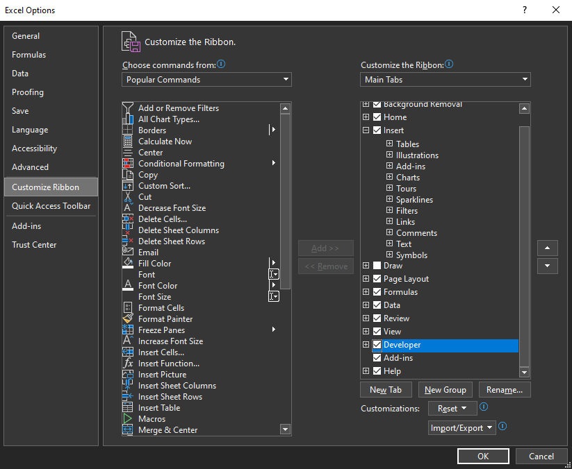
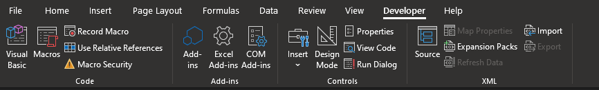
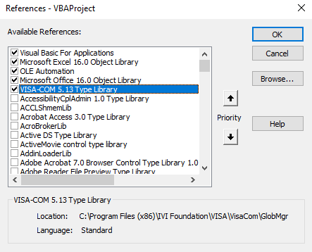

# Controlling the VNA Using Microsoft Excel

## Summary

It is useful to have automated VNA control straight from Microsoft Excel,
where measurement data returned from the instrument can be analyzed and
displayed visually without having to write a lot of code. In this article, we
will see an example of how to do this using VBA (Visual Basic for
Applications), all within Excel.

## Prerequisites

This example was created using Keysight IO Libraries 18.2.28229.2 which
includes the necessary IVI drivers.

In order to access developer tools and VBA programming capability within
Excel, the Developer tab on the ribbon must be enabled. This can be done in
Excel Options > Customize Ribbon by checking the Developer checkbox under
"Customize the Ribbon".

This checkbox is not checked by default.

This enables a new tab with advanced functionality within Excel:

Open the VBA development environment by clicking the Visual Basic button on
the left side of the ribbon panel.

In order to connect to the instrument and use the IVI-COM API, add a reference
to the IVI-COM 5.13 Type Library which is found in the IVI Foundation folder:

This dialog can be found under Tools > References...

Code can be written inside the Sheet file listed under Microsoft Excel Objects
in the Project Explorer window, or a new module can be created via Insert >
Module.

## Examples

Below is an example of the VBA code required to connect to an instrument and
send a *IDN? command. The returned string will be shown in a message dialog
box.

* * *

`Sub` `IDNTest()`

` `

` ``Dim` `rm ``As` `New` `ResourceManager`

` ``Dim` `inst ``As` `New` `FormattedIO488`

` ``Dim` `VISAAddress ``As` `String`

` `

` ``VISAAddress = ``"TCPIP0::localhost::hislip0"`

` `

` ``Set` `inst.IO = rm.Open(VISAAddress)`

` `

` ``inst.WriteString (``"*IDN?"``)`

` ``returnedString = inst.ReadString()`

` `

` ``MsgBox(returnedString)`

` `

`End` `Sub`

* * *

To integrate more closely into a worksheet, here is an example which allows
grabbing a VISA address from a specific cell, and showing the return from SCPI
queries on another cell.

* * *

`Sub` `sendSCPI()`

` ``Dim` `rm ``As` `New` `ResourceManager`

` ``Dim` `inst ``As` `New` `FormattedIO488`

` ``Dim` `VISAAddress ``As` `String`

` ``Dim` `command ``As` `String`

` `

` ``VISAAddress = Range(``"C3"``).Value`

` `

` ``'Connect to the hislip VISA address of the instrument`

` ``Set` `inst.IO = rm.Open(VISAAddress)`

` `

` ``command = Range(``"C5"``).Value`

` ``inst.WriteString (command)`

` ``returnedString = inst.ReadString()`

` `

` ``Range(``"C10"``).Value = returnedString`

` `

`End` `Sub`

* * *

## Attachments

Below is an example macro-enabled Excel spreadsheet with buttons for testing
an *IDN? query, checking for system errors, and sending an arbitrary SCPI
command via cell C5.

[SCPIParserExcel.xlsm](SCPIParserExcel.xlsm)

* * *

