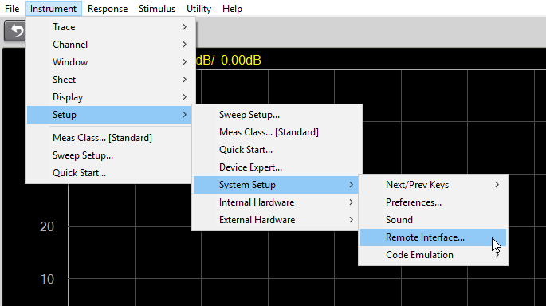
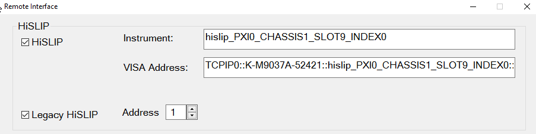

# Controlling the VNA Using Python

## Summary

Many practical applications of VNAs require automation and remote control of
the instrument. Python, a widely available and easy-to-use programming
language, is desirable especially for scientific and proof-of-concept
endeavors. After a quick setup procedure, remotely controlling your VNA
through Python is easy. This example will show how to accomplish this using
the SCPI (Standard Commands for Programmable Instruments) through HiSLIP
(High-Speed LAN Instrument Protocol).

If you need to be able to control your VNA without opening the soft front
panel application, see [Controlling the VNA with Python and IVI-
COM](Controlling_the_VNA_Using_Python_and_IVI-COM.htm).

## Prerequisites

This example was created using the following software:

  * Keysight IO Libraries version 18.2.28014.7

  * Python 3.11.0 with pip 22.3

  * [PyVISA](https://pyvisa.readthedocs.io/en/latest/), a third-party Python library, to connect to the instrument

Check which version of Python and pip are installed by opening a command line
interface (such as Command Prompt) and entering these lines:

py --version

pip --version

pip normally comes packaged with Python, so if you see an error when checking
the pip version, try reinstalling Python from
[Python.org](https://www.python.org/).

Note: If you see an error such as ModuleNotFoundError: No module named
'pyvisa' after running the example script, this means you do not have PyVISA
installed on your system.

PyVISA can be installed with the command py -m pip install pyvisa

To enable HiSLIP, navigate in the SFP to Instrument > Setup > System Setup >
Remote Interface... and check the box for HiSLIP and/or Legacy HiSLIP.

When using non-legacy HiSLIP, the VISA address for the instrument will be
exactly the one shown in this dialog. This string is more verbose than the
legacy version to avoid conflicts between instruments.

When using Legacy HiSLIP, the VISA string will look like
TCPIP0::localhost::hislip1, if connecting from the host PC and using HiSLIP
address 1. The HiSLIP address can be changed in the Remote Interface dialog to
avoid conflicts between multiple instruments using this protocol
simultaneously.

## Example

In this example, we import the PyVISA library, connect to the instrument with
a new ResourceManager object instance, then print the return of the SCPI
command *IDN? which queries the instrument for its identification information.

The line setting a timeout value to 20000 ms is not strictly required, but it
is important to have control over this value in case communication issues
occur.

If the script were not running on the same PC as the host of the VNA
instrument, localhost would likely be replaced with an IP address.

* * *

`import` `pyvisa`

`rm ``=` `pyvisa.ResourceManager()`

`inst ``=` `rm.open_resource(``'TCPIP0::localhost::hislip0::INSTR'``)`

`inst.timeout ``=` `20000`

`print``(inst.query(``"*IDN?"``))`

* * *

