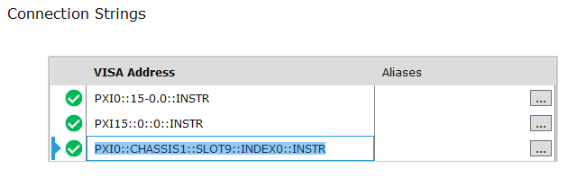

# Controlling the VNA Using Python and IVI-COM

## Summary

Some applications require the use of IVI-COM to control hardware so that the
software SFP does not need to be running in the background.

IVI-COM is the Component Object Model library, maintained by the IVI
foundation. Instead of controlling the instrument purely through SCPI
commands, IVI-COM behaves more like objects in a .NET environment where dot
syntax is used to "navigate" to the desired member function or variable in a
hierarchical path.

This solution uses Python and a third-party Python library called Comtypes
(see the Comtypes documentation [here](https://pythonhosted.org/comtypes/)).

## Prerequisites

This example was tested working in Python 3.9.6 64-bit and Comtypes library
version 1.1.11, 1.1.14 ([Comtypes
homepage](https://pypi.org/project/comtypes/)).

IVI drivers are also required, which come with [Keysight's IO
Libraries](http://www.keysight.com/find/iolib). This example uses version
18.2.28014.7.

Installing Comtypes requires pip, which is often installed alongside Python
itself. If pip is not installed on your system, see [installing
pip](https://pip.pypa.io/en/stable/installation/).

Note: Install the Comtypes library by opening a command prompt and execute:

py -m pip install comtypes

For this example to work with your instrument, you must first change the
string variable "VISA_ADDRESS" to match the connection string which refers to
your VNA. You can find this string in Keysight Connection Expert:

Any of these three VISA Addresses should work, but the last one is recommended
as it is the most human-readable.

Note: If your instrument uses more than one module for the same unit, such as
with the P5028A, add both connection strings from Connection Expert to the
VISA_ADDRESS string, separated by a semicolon (;).

An example of this is shown in the code block below.

## Example

* * *

`# VNA IVI-COM with Python example code`

`#`

`# Python version 3.9.6 64-bit`

`# Comtypes version 1.1.11 (<https://pypi.org/project/comtypes/)>`

`# ===============================================================`

`from` `comtypes.client ``import` `GetModule`

`from` `comtypes.client ``import` `CreateObject`

`GetModule(``"C:\\Program Files\\IVI Foundation\\IVI\\Bin\\AgNA_64.dll"``)`

`from` `comtypes.gen ``import` `AgNALib`

`def` `initialize():`

` ``print``(``"Connecting to VNA. Serial Number will be displayed when
connection is complete."``)`

` `

` ``# Change the VISA_ADDRESS string here to match your instrument.`

` ``# Find this address in Keysight Connection Expert.`

` ``VISA_ADDRESS ``=`
`'PXI10::CHASSIS2::SLOT1::FUNC0::INSTR;PXI10::CHASSIS2::SLOT2::FUNC0::INSTR'`

` ``initOptions ``=` `"QueryInstrStatus=true, Simulate=false, my_VNASetup=
Trace=false"`

` ``# Syntax: Initialize(VISA_ADDRESS (str), idquery (bool), reset (bool),
initOptions (str))`

` ``my_VNA.Initialize(VISA_ADDRESS, ``False``, ``False``, initOptions)`

`def` `readSerialNumber():`

` ``mySerialNumber ``=` `my_VNA.System.SerialNumber`

` ``print``(``"\n\nReference SN: "``, mySerialNumber)`

` ``input``(``"---> Press enter after reviewing serial number."``)`

`my_VNA ``=` `CreateObject(``'AgNA.AgNA'``, interface``=``AgNALib.IAgNA)`

`initialize()`

`readSerialNumber()`

`# Close connection to VNA reference`

`print``(``"\n\nClosing connection to VNA."``)`

`my_VNA.Close()`

`print``(``"\nConnection to VNA closed."``)`

* * *

