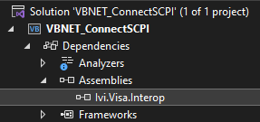

# Controlling the VNA Using VB.NET

## Summary

Many practical applications of VNAs require automation and remote control of
the instrument. VB.NET, while an older language, is still used in many
production environments. It may be important to add instrument control in
VB.NET for continuity with an existing codebase.

## Prerequisites

This example was created in Microsoft Visual Studio 2022 and .NET 6.0 LTS.

Before the example code will run, the library Ivi.Visa.Interop.dll must be
added as a project reference. By default this library is located here:

C:\Program Files\IVI Foundation\VISA\VisaCom64\Primary Interop Assemblies

The IVI Foundation folder and containing files are installed alongside
Keysight IO Libraries.

After adding the reference, you will see it in the Solution Explorer under
Assemblies:

## Example

This example shows the most basic way to connect to an instrument using HiSLIP
and VB.NET. To add functionality based on your specific application, add more
SCPI commands using fio.WriteString(string data) and fio.ReadString() within
the Try...Catch block. Find more SCPI commands from the [SCPI Command
Tree](../GP-IB_Command_Finder/SCPI_Command_Tree.htm).

This example should run regardless of errors which may occur due to connection
issues with the instrument or incorrect SCPI commands. The Try...Catch block
will prevent the program from halting if, for instance, a timeout error occurs
(meaning the instrument took too long to respond) and instead it will print
the error to the console.

* * *

`Imports` `System`

`Imports` `Ivi.Visa.Interop`

`Module` `Program`

` ``Sub` `Main(args ``As` `String``())`

` ``'Create the Visa Interop objects so we can use their API`

` ``Dim` `rm = ``New` `ResourceManager()`

` ``Dim` `fio = ``New` `FormattedIO488()`

` ``'Connect to a VISA Address`

` ``Dim` `VISA_ADDRESS ``As` `String`

` ``VISA_ADDRESS = ``"TCPIP0::localhost::hislip0::INSTR"`

` ``fio.IO = rm.Open(VISA_ADDRESS)`

` ``' Send identification request to instrument`

` ``fio.WriteString(``"*IDN?"``)`

` ``' Try reading the instrument's response`

` ``Try`

` ``Dim` `returnedString = fio.ReadString()`

` ``Console.WriteLine(returnedString)`

` ``Catch` `ex ``As` `Exception`

` ``' If there's an error, print it to the console`

` ``Console.WriteLine(ex.Message)`

` ``End` `Try`

` ``PrintErrors(fio)`

` ``fio.IO.Close()`

` ``End` `Sub`

` ``Sub` `PrintErrors(``ByVal` `fio ``As` `FormattedIO488)`

` ``' Check how many errors are in the queue`

` ``fio.WriteString(``"SYST:ERR:COUN?"``)`

` ``Dim` `errorCount ``As` `Integer`

` ``errorCount = ``CInt``(fio.ReadString())`

` ``If` `(errorCount = 0) ``Then`

` ``Exit` `Sub` `' No errors`

` ``Else`

` ``Dim` `errorMessage ``As` `String`

` ``' Print each error message to console`

` ``For` `index ``As` `Integer` `= 0 ``To` `errorCount`

` ``fio.WriteString(``"SYST:ERR?"``)`

` ``errorMessage = fio.ReadString()`

` ``Console.WriteLine(errorMessage)`

` ``Next`

` ``End` `If`

` ``End` `Sub`

`End` `Module`

* * *

