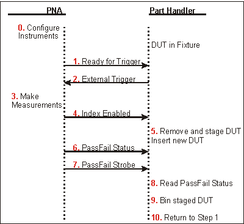
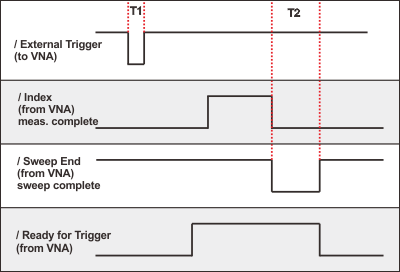
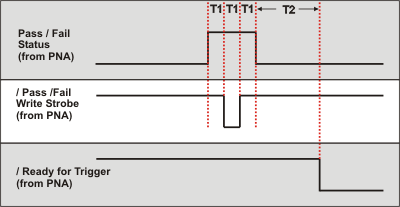
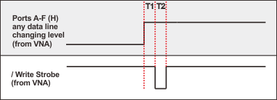
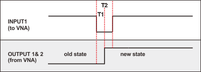

# Material Handler I/O Connector

* * *

This [rectangular 36-pin female connector](../Rear_Panel/XRtour.md#Material)
provides communication signals between the VNA and a material parts handler.
You can change the settings on the Material Handler IO connector using
[SCPI](GP-IB_Command_Finder/ControlHandler.md) and
[COM](COM_Reference/Methods/put_Output_Method.md) commands. The settings are
NOT accessible through the front-panel keys or display menu.

  * **[Overview - Controlling a Material Handler](HandlerIO_Connector.md#Overview)**

  * [Pin Assignments](HandlerIO_Connector.md#PinAssignments)

  * [Pin Descriptions](HandlerIO_Connector.md#Pindescriptions)

  * [Timing Diagrams](HandlerIO_Connector.md#Timing)

  * [Input Output Electrical Characteristics](HandlerIO_Connector.md#ElectChar)

**N** ote: On early VNAs this connector is labeled "GPIO". It is covered to
indicate that the connector is not functional.

**Overview - Controlling a Material Handler**

The VNA is capable of interacting with an external material handler or part
handler. This allows the VNA to be used in an automated test environment,
where devices to be tested are inserted into a test fixture by a part handler,
and sorted into pass/fail bins by the handler after testing is complete. By
connecting the part handler to the VNA Auxiliary or Material Handler I/O
ports, the VNA and part handler can synchronize their activities in a way that
makes automated testing possible.

### VNA and Part Handler Preparation

  1. [Define the measurements](../S1_Settings/Measurement_Parameters.md) you want to make.

  2. [Define limits](../S4_Collect/Use_Limits_to_Test_Devices.md) for each of the measurements.

  3. Configure the VNAs Material Handler port so that it is compatible with your part handler. This usually involves setting the [handler logic](HandlerIO_Connector.md#inOut), [pass/fail logic](HandlerIO_Connector.md#PassFail), [pass/fail scope](HandlerIO_Connector.md#PassFail), and [pass/fail mode](HandlerIO_Connector.md#PassFail). These settings are made remotely using [SCPI](GP-IB_Command_Finder/ControlHandler.md) or [COM](COM_Reference/Objects/HWMaterialHandlerIO_Object.md) commands.

  4. Use a cable to connect the VNA to your part handler.

  5. Put the VNA in [External Trigger](../S1_Settings/External_Triggering.md) mode.

  6. Load parts in handler per manufacturer instructions.

Note: The Material Handler configuration settings REMAIN after an [Instrument
Preset](../S1_Settings/Preset_the_Analyzer.htm). The settings will revert to
their default settings ONLY after the VNA is restarted, or until they are
changed by you. Material Handler settings are [saved and recalled with
Instrument State](../S5_Output/SaveRecall.htm#FileTypes).

### Flow Diagram

The following diagram and descriptions summarizes the events that occur during
automated testing. 'DUT' refers to Device Under Test.

Text Descriptions

  0. (Optional). The VNA sends values out the Material Handler to configure external instruments. The A,B,C, and D ports of the Material Handler can be used to control devices used in testing, such as step attenuators, part handlers, or even the DUT itself. Also, the DAC1 and DAC2 lines on the [Power I/O connector](../Rear_Panel/XPwrIO.md) can be used to provide bias voltages for devices and instruments. If you wish to use the Material Handler for testing, you will need to write a program to send values out the various lines and ports, as there is no activity on these lines by default.

  1. The part handler receives a [Ready for Trigger](HandlerIO_Connector.md#ReadyForTrigger) signal from the VNA. This indicates that the VNA is properly configured and ready to take a measurement.

  2. The part handler sends an [External Trigger](HandlerIO_Connector.md#ExternalTrigger) signal to the VNA. This signals that the part handler has settled, and allows the VNA to begin taking measurements.

  3. The VNA takes measurements on all triggerable channels.

  4. The [Index line](HandlerIO_Connector.md#Index) on the material handler goes to a Low state (default), which means that all required data has been collected by the VNA.

  5. The part handler removes the DUT from the test fixture, and inserts a new DUT into the fixture. This operation is often referred to as part handler indexing. The device just tested is staged (removed from the fixture and prepared for binning), and the next part to be tested is put into the fixture. The removed DUT cannot be assigned to a Pass/Fail bin yet, as the Pass/Fail status is not available.

  6. The VNA sends the [Pass/Fail Status](HandlerIO_Connector.md#PassFail).

  7. The VNA sends the [Pass/Fail Strobe](HandlerIO_Connector.md#Pass/FailStrobe) meaning that the Pass/Fail status has been determined.

  8. The part handler reads the Pass/Fail Status line.

  9. The part handler bins the staged part based on the Pass/Fail Status.

  10. The test process repeats at step 1, waiting for Ready for Trigger from the VNA.

**Material Handler IO Pin Assignments**

**Pin** |  Description  
---|---  
1 |  Ground  
2 |  / [INPUT1](HandlerIO_Connector.md#INPUT1)  
3 |  / [OUTPUT1](HandlerIO_Connector.md#OUTPUT1)  
4 |  / [OUTPUT2](HandlerIO_Connector.md#OUTPUT1)  
5 |  / [Output port A0](HandlerIO_Connector.md#Output)  
6 |  / [Output port A1](HandlerIO_Connector.md#Output)  
7 |  / [Output port A2](HandlerIO_Connector.md#Output)  
8 |  / [Output port A3](HandlerIO_Connector.md#Output)  
9 |  / [Output port A4](HandlerIO_Connector.md#Output)  
10 |  / [Output port A5](HandlerIO_Connector.md#Output)  
11 |  / [Output port A6](HandlerIO_Connector.md#Output)  
12 |  / [Output port A7](HandlerIO_Connector.md#Output)  
13 |  / [Output port B0](HandlerIO_Connector.md#Output)  
14 |  / [Output port B1](HandlerIO_Connector.md#Output)  
15 |  / [Output port B2](HandlerIO_Connector.md#Output)  
16 |  / [Output port B3](HandlerIO_Connector.md#Output)  
17 |  / [Output port B4](HandlerIO_Connector.md#Output)  
18 |  / [Ext. Trigger](HandlerIO_Connector.md#ExternalTrigger)  
19 |  / [Output port B5](HandlerIO_Connector.md#Output)  
20 |  / [Output port B6](HandlerIO_Connector.md#Output) -or  
[/ Index Signal](HandlerIO_Connector.md#Index) (select by [command](GP-
IB_Command_Finder/ControlHandler.htm#Index))  
21 |  / [Output port B7](HandlerIO_Connector.md#Output) or  
[/ Ready for Trigger](HandlerIO_Connector.md#ReadyForTrigger) (select by
[command](GP-IB_Command_Finder/ControlHandler.md#RTRigger) or [dialog
box](../S1_Settings/External_Triggering.htm#ReadyforTriggerIndicator))  
22 |  / [In/Out port C0](HandlerIO_Connector.md#inOut)  
23 |  / [In/Out port C1](HandlerIO_Connector.md#inOut)  
24 |  / [In/Out port C2](HandlerIO_Connector.md#inOut)  
25 |  / [In/Out port C3](HandlerIO_Connector.md#inOut)  
26 |  / [In/Out port D0](HandlerIO_Connector.md#inOut)  
27 |  / [In/Out port D1](HandlerIO_Connector.md#inOut)  
28 |  / [In/Out port D2](HandlerIO_Connector.md#inOut)  
29 |  / [In/Out port D3](HandlerIO_Connector.md#inOut)  
30 |  [Port C Status](HandlerIO_Connector.md#Port)  
31 |  [Port D Status](HandlerIO_Connector.md#Port)  
32 |  / [Output Port Write Strobe](HandlerIO_Connector.md#Output2)  
33 |  / [Pass/Fail](HandlerIO_Connector.md#PassFail)  
34 |  / [Sweep End](HandlerIO_Connector.md#Sweep)  
35 |  [+5V](HandlerIO_Connector.md#5V)  
36 |  / Pass/Fail Write Strobe  
  
**Pin Descriptions**

### **Input1**

When this Input line receives a Low pulse from the material handler, data is
latched on the OUTPUT1 and OUTPUT2 lines. See [OUTPUT1|2 Data Output Write
Timing](HandlerIO_Connector.htm#OUTPUT1|2Timing)  
---  
The Input Line activity can be read:  
SCPI |  COM  
[CONTrol:HANDler:INPut?](GP-IB_Command_Finder/ControlHandler.md#handinp) |  [get_Input1 Method](COM_Reference/Methods/get_Input1_Method.md)  
  
### **Output1, Output2**

See [OUTPUT1|2 Data Output Write
Timing](HandlerIO_Connector.htm#OUTPUT1|2Timing) The current state of these
latched TTL outputs may be set High or Low (Default setting) using the (non-
user) [SCPI](GP-IB_Command_Finder/ControlHandler.md#handoutdata) [put_Output
(COM)](COM_Reference/Methods/put_Output_Method.htm) commands. The next state
(following a negative edge on the INPUT1 line) may be pre-loaded to High or
Low (Default setting) using the user commands. For example, on the next
negative pulse on the INPUT1 line, you want the OUTPUT1 line to go from 0 to
1. To do this: [CONT:HAND:OUTP1:DATA 0](GP-
IB_Command_Finder/ControlHandler.htm#handoutdata) 'Force the OUTPUT1 line to 0  
[CONT:HAND:OUTP1:USER 1](GP-IB_Command_Finder/ControlHandler.md#handoutuser)
'Set the OUTPUT1:USER buffer to 1, indicating the next state  
---  
|  SCPI |  COM  
Write User Data |  [CONT:HAND:OUTP<pin>:USER](GP-IB_Command_Finder/ControlHandler.md#handoutuser) |  [put_Output Method](COM_Reference/Methods/put_Output_Method.md)  
Read last value written |  [CONT:HAND:OUTP<pin>:USER](GP-IB_Command_Finder/ControlHandler.md#handoutuser) |  [get_Output](COM_Reference/Methods/get_Output_Method.md) [Method.](COM_Reference/Methods/put_Output_Method.md)  
Write non-user data |  [CONT:HAND:OUTP<pin>:DATA](GP-IB_Command_Finder/ControlHandler.md#handoutdata) |  [put_Output Method](COM_Reference/Methods/put_Output_Method.md)  
Read last value written |  [CONT:HAND:OUTP<pin>:DATA](GP-IB_Command_Finder/ControlHandler.md#handoutdata) |  [get_Output](COM_Reference/Methods/get_Output_Method.md) [Method](COM_Reference/Methods/put_Output_Method.md)  
  
### **Output Ports A and B**

These two general purpose, 8-bit output ports are used to write data to the
material handler. When any line changes state, all output lines are latched to
the I/O connector as the [Output Write
Strobe](HandlerIO_Connector.htm#Output2) goes Low. The default state for data
is Low. [See Data Output Write Timing
Diagram](HandlerIO_Connector.htm#DataPortTiming)  
---  
Set Port Logic: The logic for the data lines can be set to either: Positive (1
= High) or Negative (1 = Low). This setting affects all data ports. They
cannot be set independently.  
SCPI |  COM  
[CONTrol:HANDler:LOGic](GP-IB_Command_Finder/ControlHandler.md#handlogic) |  [PortLogic Property](COM_Reference/Properties/PortLogic_Property.md)  
Combine to read or write data to Port F: Ports A and B can be virtually
combined to write data to one 16-bit I/O port F.  
SCPI |  COM  
[CONTrol:HANDler:F <num>](GP-IB_Command_Finder/ControlHandler.md#handdata) |  [put Port (F)](COM_Reference/Methods/put_Port_Method.md)  
  
### Input/Output Ports C and D

These two general purpose 4-bit Input/Output ports are used to write data
(Output) or read data (Input). These lines could be used to write to an
external device such as a step attenuator. When any line changes state, all
output lines are latched to the I/O connector as the [Output Write
Strobe](HandlerIO_Connector.htm#Output2) goes Low. [See Data Output Write
Timing](HandlerIO_Connector.htm#DataPortTiming).  
---  
Set Input | Output Mode: Each port may be independently defined as Output or Input.  
SCPI |  COM  
[CONTrol:HANDler:C:MODE](GP-IB_Command_Finder/ControlHandler.md#cMode) |  [PortMode Property](COM_Reference/Properties/PortMode_Property.md)  
[CONTrol:HANDler:D:MODE](GP-IB_Command_Finder/ControlHandler.md#dMode) |   
Set Port Logic: The logic for the data lines can be set to either: Positive (1
= High) or Negative (1 = Low). This setting affects all data ports. They
cannot be set independently.  
SCPI |  COM  
[CONTrol:HANDler:LOGic](GP-IB_Command_Finder/ControlHandler.md#handlogic) |  [PortLogic Property](COM_Reference/Properties/PortLogic_Property.md)  
Read or write data: Ports C and D can be virtually combined to read or write
data to one 8-bit I/O port E. When combined, both C and D ports must be set to
either INPUT or OUTPUT mode.  
SCPI |  COM  
[CONTrol:HANDler:<port>[:DATa]>](GP-IB_Command_Finder/ControlHandler.md#handdata) |  [get_Port(x)](COM_Reference/Methods/get_Port_Method.md) [put Port (x)](COM_Reference/Methods/put_Port_Method.md)  
  
### **Port C Status, Port D Status**

These two output lines indicate the Read / Write mode of the C and D ports.

  * A Low level indicates that the associated port is in INPUT mode (read only).
  * A High level indicates that the associated port is in **OUTPUT** mode (write only).

These logic of these status outputs cannot be changed. See [Input/Output Ports
C and D](HandlerIO_Connector.htm#inOut) to learn how to set I/O Mode [See Data
Output Write Timing](HandlerIO_Connector.htm#DataPortTiming)  
---  
  
### **Output Port Write Strobe**

This Output line goes Low to write data from [Ports A and
B](HandlerIO_Connector.htm#Output) and [Ports C and
D](HandlerIO_Connector.htm#inOut) when a change is detected on any of the data
lines. These logic of this strobe output cannot be changed. [See Data Output
Write Timing](HandlerIO_Connector.htm#DataPortTiming)  
---  
  
### ****External Trigger

When trigger source is set to external, this Input line accepts a trigger
signal from the material handler. This usually means that a part is in place
and ready to be tested. [See Trigger Timing
Diagram](HandlerIO_Connector.htm#TriggerTiming)  
---  
  
### Index

A Low signal (default) on this Output line indicates to the material handler
that the measurement is complete. This usually means that the handler can
connect the next device. However, measurement data is not available until data
is calculated. [See Trigger Timing
Diagram](HandlerIO_Connector.htm#TriggerTiming).  
---  
Set Function: This line also serves as a data line. Set the function using the
following commands:  
SCPI |  COM  
[CONTrol:HANDler:INDex:STATe](GP-IB_Command_Finder/ControlHandler.md#Index) |  [IndexState](COM_Reference/Properties/IndexState_Property.md)  
  
### Ready for Trigger

When this output line goes low (default) , it indicates to the material
handler that the VNA is ready for a trigger signal. [See Trigger Timing
Diagram](HandlerIO_Connector.htm#TriggerTiming) [See Pass/Fail Timing
Diagram](HandlerIO_Connector.htm#PassTiming)  
---  
Set Function: This line also serves as a data line. Set the function using the
following commands:  
SCPI |  COM  
[CONTrol:HANDler:RTRigger:STATe](GP-IB_Command_Finder/ControlHandler.md#RTRigger) |  [ReadyForTriggerState](COM_Reference/Properties/ReadyForTriggerState_Property.md)  
  
### **Pass/Fail State**

This Output line indicates to the handler whether the limit test has passed or
failed. Pass/Fail state is valid only when the [limit
test](../S4_Collect/Use_Limits_to_Test_Devices.htm#limit_testing) function is
ON and while [Pass/Fail strobe](HandlerIO_Connector.md#Pass/FailStrobe) line
is Low. [See Pass/Fail Timing Diagram](HandlerIO_Connector.md#PassTiming)  
---  
Set Pass / Fail Logic:

  * Positive Logic: High=Pass, Low=Fail. (Default setting)
  * Negative Logic: High=Fail, Low=Pass.

  
SCPI |  COM  
[CONTrol:HANDler:PASSfail:LOGic](GP-IB_Command_Finder/ControlHandler.md#HandPassFailLogic) |  [PassFailLogic Property](COM_Reference/Properties/PassFailLogic_Property.md)  
Set Default Conditions:

  * PASS\- the line stays in PASS state. When a device fails, then the line goes to fail after the Sweep End line is asserted.
  * FAIL\- the line stays in FAIL state. When a device passes, then the line goes to PASS state after the Sweep End line is asserted.
  * No Wait- the line stays in PASS state. When a device fails, then the line goes to fail IMMEDIATELY. (Default setting)

  
SCPI |  COM  
[CONTrol:HANDler:PASSfail:MODE](GP-IB_Command_Finder/ControlHandler.md#HandPassFailMode) |  [PassFailMode Property](COM_Reference/Properties/PassFailMode_Property.md)  
Set Pass / Fail Scope:

  * **Channel scope:** The line resets to the default state after the measurements on a channel have completed.
  * **Global scope:** The line resets to the default state after the measurements on all triggerable channels have completed. (Default setting)

  
SCPI |  COM  
[CONTrol:HANDler:PASSfail:SCOPe](GP-IB_Command_Finder/ControlHandler.md#HandPassFailScope) |  [PassFailScope Property](COM_Reference/Properties/PassFailScope_Property.md)  
  
###

### **Pass/Fail Write Strobe**

A Low pulse indicates that [Pass/Fail](HandlerIO_Connector.md#PassFail) line
is valid and the Pass / Fail State is output to the material handler. The
Pass/Fail Strobe is fixed in duration and timing. However, when the strobe
occurs depends on the Pass/Fail Mode and Pass/Fail Scope (Channel or Global)
settings. [See Pass/Fail State](HandlerIO_Connector.md#PassFail) [See
Pass/Fail Timing Diagram](HandlerIO_Connector.htm#PassTiming)  
---  
  
###

### **+5V**

+5V nominal output (100mA max). Protected by self-healing fuse.  
---  
  
### **Sweep End**

This output line indicates the status of the VNA sweep. The sweep includes
sweeping the source and taking data.

  * Low (falling edge) indicates that the specified sweep event has finished. This does NOT indicate that all calculations have finished.
  * High indicates that the specified sweep event is active.

[See Trigger Timing Diagram](HandlerIO_Connector.md#TriggerTiming)  
---  
Set Sweep Event Mode:

  * Sweep: indicates that a single source sweep has finished.
  * Channel: indicates that a single channel has finished.
  * Global: indicates that all enabled channels have finished. (Default setting)

  
SCPI |  COM  
[CONTrol:HANDler:SWEepend](GP-IB_Command_Finder/ControlHandler.md#handsweepend) |  [SweepEndMode Property](COM_Reference/Properties/SweepEndMode_Property.md)  
  
Timing Diagrams

Trigger Timing  
---  
  
All signals are active low. T1 = 1 ms External Trigger pulse width T2 > 10ms
Sweep End pulse width (both High and Low)  
  
Pass / Fail Timing  
---  
  
T1 = 1 ms Pulse width and response time of Pass / Fail Strobe  
  
Ports A-F(H) Data Output Write Timing  
---  
  
T1 = 1 ms Write Strobe response time T2 = 1 ms Write Strobe pulse width  
  
OUTPUT1|2 Data Output Write Timing  
---  
  
The old state to new state transition can be either low to high (as shown) or
high to low. T1 = ms [Output1|2](HandlerIO_Connector.md#OUTPUT1) response
time T2 = 1 ms [Input1](HandlerIO_Connector.md#INPUT1) Strobe pulse width  
  
Input / Output Electrical Characteristics

All Material Handler I/O Input and Output lines are TTL compatible.

### Input and Input/Output lines

Lines carrying information IN (or bidirectional) to the VNA from the material
handler.

Maximum Input Voltages: |  -0.5 V to 5.5 V  
---|---  
TTL High level: |  2.0 V to 5.0 V  
TTL Low level: |  0 V to 0.5 V  
  
### Output Lines

Lines carrying information OUT of the VNA to the material handler.

Maximum Output Current: |  -10 mA to 10 mA  
---|---  
Output Current |  TTL High level: |  -5 mA  
TTL Low level: |  3 mA  
Output Voltage |  TTL High level: |  2.0 V to 3.3 V  
TTL Low level: |  0 V to 0.8 V  
  
* * *

