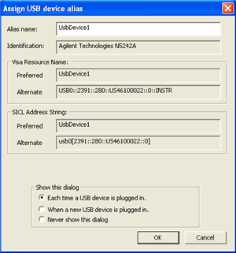

# The VNA as a USB Device

* * *

The VNA can be controlled as a USB Device using SCPI. This is done through the
Keysight I/O Libraries which must be installed on your remote computer.

All data types, especially [Binary block
data](Getting_Data_from_the_Analyzer.htm#block), transfer MUCH faster using
USB as compared to GPIB.

See also, the [Status](../SCPIParserConsole.md#Status) tab of the SCPI Parser
Console, which describes the USB Rescan feature.

### To communicate with the VNA as a USB device

  1. Connect the VNA to the remote computer using the rear-panel [device-side USB connector](../../Rear_Panel/XRtour.md#usbDev).

  2. The 'Found New Hardware' wizard is launched. Follow the prompts to install the VNA driver software.

  3. The Keysight I/O Libraries will recognize the VNA as a Test and Measurement device and show the following dialog.

Note: The VNA is not a USB Mass Storage Device. Therefore, Windows Explorer
does NOT recognize it as a USB device. You can NOT use Windows Explorer to
transfer files to and from the VNA. For file transfer, use the SCPI command
[MMEM:TRANsfer](../GP-IB_Command_Finder/Memory.md#Transfer).

Alias name Change this to a name that is easy to recognize. Once configured,
use the Alias name to communicate with the USB device using applications such
as VISA and SICL:

  * VISA: viOpen (...,"UsbDevice1",...)

  * SICL: iopen ("UsbDevice1")

For more information, see the Connectivity Guide in the Keysight I/O
libraries.

* * *

