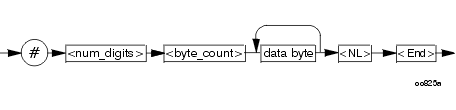
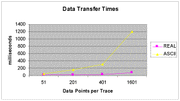

## Getting Data from the Analyzer

* * *

Data is sent from the analyzer in response to program queries. Data can be
short response messages, such as analyzer settings, or large blocks of
measurement data. This topic discusses how to read query responses and
measurement data from the analyzer in the most efficient manner.

  * [Response Message Syntax](Getting_Data_from_the_Analyzer.md#rm)

  * [Clearing the Output Queue](Getting_Data_from_the_Analyzer.md#query)

  * [Response Data Types](Getting_Data_from_the_Analyzer.md#response)

  * [Transferring Measurement Data](Getting_Data_from_the_Analyzer.md#encode)

Note: Some PCs use a modification of the IEEE floating point formats with the
byte order reversed. To reverse the byte order for data transfer into a PC,
use the [FORMat:BORDer](../GP-IB_Command_Finder/Format_SCPI.md#fb) command.

[Other Topics about GPIB Concepts](Learning_about_GPIB.md)

### Response Message Syntax

Responses sent from the analyzer contain data, appropriate punctuation, and
message terminators.

<NL><^END> is always sent as a response message terminator. Most programming
languages handle these terminators transparent to the programmer.

Response messages use commas and semicolons as separators in the following
situations:

  * a comma separates response data items when a single query command returns multiple values

FORM:DATA? 'Query  
ASC, +0 'Analyzer Response

  * a semicolon separates response data when multiple queries are sent within the same messages

SENS:FREQ:STAR?;STOP? --Example Query

+1.23000000000E+008; +7.89000000000E+008<NL><^END> 'Analyzer Response

### Clearing the Output Queue

After receiving a query, the analyzer places the response message in its
output queue. Your program should read the response immediately after the
query is sent. This ensures that the response is not cleared before it is
read. The response is cleared when one of the following conditions occur:

  * When the query is not properly terminated with an ASCII carriage return character or the GPIB <^END> message.

  * When a second program query is sent.

  * When a program message is sent that exceeds the length of the input queue

  * When a response message generates more response data than fits in the output queue.

  * When the analyzer is switched ON.

### Response Data Types

The analyzer sends different response data types depending on the parameter
being queried. You need to know the type of data that will be returned so that
you can declare the appropriate type of variable to accept the data. For more
information on declaring variables see your programming language manual. The
GPIB Command Finder lists every GPIB command and the return format of data in
response to a query. The analyzer returns the following types of data:

  * [Numeric Data](Getting_Data_from_the_Analyzer.md#numeric)

  * [Character Data](Getting_Data_from_the_Analyzer.md#character)

  * [String Data](Getting_Data_from_the_Analyzer.md#string)

  * [Block Data](Getting_Data_from_the_Analyzer.md#block)

### Numeric Data

All numeric data sent over the GPIB is ASCII character data. Your programming environment may convert the character data to numeric data for you. Boolean data (1 | 0 ) is a type of numeric data.

### Character Data

Character data consists of ASCII characters grouped together in mnemonics that
represent specific analyzer settings. The analyzer always returns the short
form of the mnemonic in upper-case alpha characters. Character data looks like
string data. Therefore, refer to the GPIB Command Finder to determine the
return format for every command that can be queried.

Example of Character Data

MLOG

### String Data

String data consists of ASCII characters. String parameters can contain
virtually any set of ASCII characters. When sending string data to the
analyzer, the string must begin with a single quote ( ' ) or a double quote (
" ) and end with the same character (called the delimiter).

Note: The analyzer responds best to all special characters if the string is
enclosed in single quotes. If quotes are not used, the analyzer will convert
the text to uppercase. The analyzer may not respond as you expect.

The analyzer always encloses data in double quotes when it returns string
data.

Example of String Data

GPIB.Write "DISP:WINDow:TITLe:DATA?"  
  
“This is string response data.”

### Block Data

Block data is used to transfer measurement data. Although the analyzer will
accept either definite length blocks or indefinite length blocks, it always
returns definite length block data in response to queries unless the specified
format is ASCII. The following graphic shows the syntax for definite block
data:

<num_digits> specifies how many digits are contained in <byte_count>

<byte_count> specifies how many data bytes will follow in <data bytes>

Example of Definite Block Data

#210ABCDE+WXYZ<nl><end>

Where:

# - always sent before definite block data

2 \- specifies that the byte count is two digits (2)

10 \- specifies the number of data bytes that will follow, not counting
<NL><END>

ABCDE+WXYZ \- 10 digits of data

<NL><END> \- always sent at the end of block data

### Transferring Measurement Data

Measurement data is blocks of numbers that result from an analyzer
measurement. Measurement data is available from various processing arrays
within the analyzer. For more information on the analyzer's data processing
flow, see [Accessing Data Map](../DataMapSet.md). Regardless of which
measurement array is read, transferring measurement data is done the same.

[See an example.](../GPIB_Example_Programs/Transfer_Data_using_GPIB.md)

When transferring measurement data, the [FORMat:DATA](../GP-
IB_Command_Finder/Format_SCPI.htm#fd) command allows you to choose from the
following two data types:

  * REAL

  * ASCII

The following graphic shows the differences in transfer times between the two:

### REAL Data

REAL data (also called floating-point data) types transfer faster. This is
because REAL data is binary and takes about half the space of ASCII data. The
disadvantage of using REAL data is that it requires a header that must be
read. See definite length block data. The binary floating-point formats are
defined in the IEEE 754-1985 standard. The following choices are available in
REAL format:

  * REAL,32 \- IEEE 32-bit format - single precision (not supported by HP BASIC)

  * REAL,64 \- IEEE 64-bit format - double precision

### ASCII Data

The easiest and slowest way to transfer measurement data is to use ASCII data.
ASCII data is sent if the data contains both numbers and characters (the
setting of FORMat:DATA is ignored). ASCII data is separated by commas.

* * *

