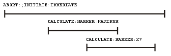
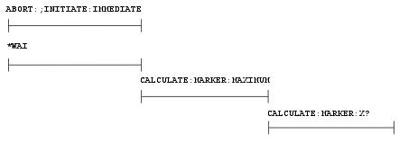

# Synchronizing the VNA and Controller

* * *

Synchronizing the VNA (Vector Network Analyzer) and Controller means to keep
VNA and the controller working at approximately the same pace. In this topic:

  * [The Problem and the Solution](Understanding_Command_Synchronization.md#Prob)

  * [VNA Queues](Understanding_Command_Synchronization.md#queue)

  * [Synchronization Methods](Understanding_Command_Synchronization.md#method)

  * [When To Synchronize the Analyzer and Controller](Understanding_Command_Synchronization.md#when)

  *     * [Completion of a Measurement](Understanding_Command_Synchronization.md#complete)

    * [Measurements with External Trigger](Understanding_Command_Synchronization.md#external)

    * [Averaged Measurements](Understanding_Command_Synchronization.md#average)

    * [During Calibration Acquire](Understanding_Command_Synchronization.md#Synch)

### See Also

  * [Synchronize an External PSG Source](../../Tutorials/Synchronize_an_External_PSG_Source.md)

  * [Triggering the VNA using SCPI](../GPIB_Example_Programs/Triggering_the_PNA_using_SCPI.md)

  * Keysight Support Article: [HOW TO ACQUIRE DATA USING AVERAGES ON A VNA WITH SCPI EXAMPLE IN PYTHON](https://support.keysight.com/KeysightdCX/s/knowledge-article-detail?language=en_US&keyid=How-to-acquire-data-using-averages-on-a-VNA-with-SCPI-example-in-Python)

### The Problem

The controller sends commands to the VNA as fast as the bus will allow. The
VNA stores these commands in the VNA [Input
queue](Understanding_Command_Synchronization.htm#input). However, the VNA
executes those commands at a slower rate than they are accepted. If left
unchecked, the VNA input buffer will contain a long list of commands waiting
to be executed.

At some point, the controller will send a query command which requires a
response from the VNA. The controller will not send more commands until a
response is received. It will wait for a response from the VNA for the amount
of time set by the Timeout setting. If the VNA is working off a long list of
commands in the input buffer, if may not execute and respond to the query
command until the controller has quit waiting, or "timed out".

### The Solution

The easiest way to keep the controller and the VNA "synched" is to send query
commands often. This stops the controller from sending more commands until the
VNA executes and responds to the query. This limits the number of commands
that are waiting in the VNA input queue to be processed.

Although any query will stop the controller from sending more commands, a good
practice is to send [*OPC?](../GP-IB_Command_Finder/Common_Commands.md#opcq)
Most of the time, as soon as this query is executed, the VNA will immediately
reply. The exception to this is the Overlapped command.

  * Sequential commands are executed quickly and in the order in which they are received.

  * Overlapped (also known as Asynchronous) commands take longer to execute. Therefore, they allow the VNA to execute other commands while waiting. However, the programmer may want to prevent the analyzer from processing new commands until the overlapped command has completed. If the VNA is executing an overlapped command when a *OPC? is received, it will wait until the overlapped command is complete before processing new commands.

Note: The analyzer has two overlapped commands:

  * [INITitate:IMMediate](../GP-IB_Command_Finder/Initiate.md#immed)
  * [SENSe:SWEep:MODE GROUPS](../GP-IB_Command_Finder/Sense/Sweep_SCPI.md#ssm) (when INIT:CONT is ON)

Several calibration commands have an optional ASYNcronous argument which
allows them to behave like overlapped commands. [Learn
more.](Understanding_Command_Synchronization.htm#Synch)  
---  
  
### Analyzer Queues

Queues are memory buffers that store messages until they can be processed. The
analyzer has the following queues:

  * [Input Queue](Understanding_Command_Synchronization.md#input)

  * [Output Queue](Understanding_Command_Synchronization.md#output)

  * [Error Queue](Understanding_Command_Synchronization.md#error)

### Input Queue

The controller sends statements to the analyzer without regard to the amount
of time required to execute the statements. The input queue is very large (31k
bytes). It temporarily stores commands and queries from the controller until
they are read by the analyzer's command parser. The input queue is cleared
when the analyzer is switched ON.

### Output Queue

When the analyzer parses a query, the response is placed in the output queue
until the controller reads it. Your program should immediately read the
response or it may be cleared from the output queue. The following conditions
will clear a query response:

  * When a second query is sent before reading the response to the first. This does not apply when multiple queries are sent in the same statement.

  * When a program statement is sent that exceeds the length of the input queue.

  * When a response statement generates more data than fits in the output queue.

  * When the analyzer is switched ON.

### Error Queue

Each time the analyzer detects an error, it places a message in the error
queue. When the SYSTEM:ERROR? query is sent, one message is moved from the
error queue to the output queue so it can be read by the controller. Error
messages are delivered to the output queue in the order they were received.
The error queue is cleared when any of the following conditions occur:

  * When the analyzer is switched ON.

  * When the *CLS command is sent to the analyzer.

  * When all of the errors are read.

If the error queue overflows, the last error is replaced with a "Queue
Overflow" error. The oldest errors remain in the queue and the most recent
error is discarded.

### Synchronization Methods

The following common commands are used to synchronize the analyzer and
controller. Examples are included that illustrate the use of each command in a
program. See the SCPI command details to determine if a command is an
overlapped command.

  * [*WAI](Understanding_Command_Synchronization.md#wai)

  * [*OPC?](Understanding_Command_Synchronization.md#opcq)

  * [*OPC](Understanding_Command_Synchronization.md#opc)

### *WAI

The *WAI command:

  * Stops the analyzer from processing subsequent commands until all overlapped commands are completed.

  * It does NOT stop the controller from sending commands to this and other devices on the bus. This is the easiest method of synchronization.

Example of the *WAI command

"ABORT;:INITIATE:IMMEDIATE" 'Restart the measurement.  
"CALCULATE:MARKER:SEARCH:MAXIMUM" 'Search for max amplitude.  
"CALCULATE:MARKER:X?" 'Which frequency?

The following time line shows how the processing times of the three commands
relate to each other:

INITIATE:IMMEDIATE is an overlapped command. It allows the immediate
processing of the sequential command, CALCULATE:MARKER:SEARCH:MAXIMUM.
However, the INITIATE:IMMEDIATE is not considered complete until the
measurement is complete. Therefore, the marker searches for maximum amplitude
before the measurement completes. The CALCULATE:MARKER:X? query could return
an inaccurate value.

To solve the problem, insert a *WAI command.

"ABORT;:INITIATE:IMMEDIATE" 'Restart the measurement.  
"*WAI" 'Wait until complete.  
"CALCULATE:MARKER:MAXIMUM" 'Search for max amplitude.  
"CALCULATE:MARKER:X?" 'Which frequency

The time line now looks like this:

The *WAI command keeps the MARKER:SEARCH:MAXIMUM from taking place until the
measurement is completed. The CALCULATE:MARKER:X? query returns the correct
value.

Note: Although *WAI stops the analyzer from processing subsequent commands, it
does not stop the controller. The controller could send commands to other
devices on the bus.

### *OPC?

The *OPC? query stops the controller until all pending commands are completed.

In the following example, the Read statement following the *OPC? query will
not complete until the analyzer responds, which will not happen until all
pending commands have finished. Therefore, the analyzer and other devices
receive no subsequent commands. A "1" is placed in the analyzer output queue
when the analyzer completes processing an overlapped command. The "1" in the
output queue satisfies the Read command and the program continues.

Example of the *OPC? query

This program determines which frequency contains the maximum amplitude.

"ABORT; :INITIATE:IMMEDIATE"! Restart the measurement  
"*OPC?" 'Wait until complete  
Meas_done = GPIB.Read 'Read output queue, throw away result  
"CALCULATE:MARKER:MAX" 'Search for max amplitude  
"CALCULATE:MARKER:X?" 'Which frequency?  
Marker_x = GPIB.Read  
PRINT "MARKER at " & Marker_x & " Hz"

### *OPC

The *OPC command allows the analyzer and the controller to process commands
while processing the overlapped command.

When the analyzer completes processing an overlapped command, the *OPC command
sets bit 0 of the standard event register to 1 . This requires polling of
status bytes or use of the service request (SRQ) capabilities of your
controller. See [Reading the Analyzer's Status
Registers](Reading_the_Analyzers_Status_Registers.htm) for more information
about the standard event status register, generating SRQs, and handling
interrupts.

Note: Be careful when sending commands to the analyzer between the time you
send *OPC and the time you receive the interrupt. Some commands could
jeopardize the integrity of your measurement. It also could affect how the
instrument responds to the previously sent *OPC.

[Example](../GPIB_Example_Programs/Status_Reporting.md) of polled bit and SRQ
processes.

When To Synchronize the Analyzer and Controller

The need to synchronize depends upon the situation in which the overlapped
command is executed. The following section describes situations when
synchronization is required to ensure a successful operation.

  * [Completion of a Measurement](Understanding_Command_Synchronization.md#complete)

  * [Measurements with External Trigger](Understanding_Command_Synchronization.md#external)

  * [Averaged Measurements](Understanding_Command_Synchronization.md#average)

### Completion of a Measurement

To synchronize the analyzer and controller to the completion of a measurement,
use the ABORT;INITIATE:IMMEDIATE command sequence to initiate the measurement.

This command sequence forces data collection to start (or restart) under the
current measurement configuration. A restart sequence, such as
ABORT;INITIATE:IMMEDIATE is an overlapped command. It is complete when all
operations initiated by that restart command sequence, including the
measurement, are finished. The *WAI,*OPC? and *OPC commands allow you to
determine when a measurement is complete. This ensures that valid measurement
data is available for further processing.

See also, Python programming example [Poll for Sweep
Complete](../GPIB_Example_Programs/_ESR__Sweep_Complete.htm).

### Measurements with External Trigger

See [Triggering the VNA using
SCPI](../GPIB_Example_Programs/Triggering_the_PNA_using_SCPI.htm).

[External Triggering](../../S1_Settings/External_Triggering.md)

### Averaged Measurements

Averaged measurements are complete when the average count is reached. The
average count is reached when the specified number of individual measurements
is combined into one averaged measurement result. Use synchronization to
determine when the average count has been reached.

If the analyzer continues to measure and average the results after the average
count is reached, use synchronization to determine when each subsequent
measurement is complete.

See also this Keysight support article: [HOW TO ACQUIRE DATA USING AVERAGES ON
A VNA WITH SCPI EXAMPLE IN
PYTHON](https://support.keysight.com/KeysightdCX/s/knowledge-article-
detail?language=en_US&keyid=How-to-acquire-data-using-averages-on-a-VNA-with-
SCPI-example-in-Python)

### During Calibration Acquire

During a calibration with slow sweep speeds, such as when using a narrow IF
bandwidth, you may want to have your program perform other operations, such as
checking for the click event of a Cancel button.

To do this, use the optional ASYNchronous argument with the ACQuire command as
shown in several calibration example programs. The VNA parser returns
immediately while the cal step measurement proceeds. It does NOT block
commands and wait for the measurement step to finish. You can send *ESR? or
*STB? queries to monitor the status register bytes to see when the OPC
(operation complete) bit gets set, which indicates the cal measurement step
has finished. Learn more about [status
registers.](Reading_the_Analyzers_Status_Registers.htm)

Note: Do NOT issue the *OPC? query when using the ASYN argument. Using the
*OPC? query during the ASYN command will cause the program to block
immediately. Instead, use the default SYNC argument.

When using the ASYN argument, set the timeout value in the IO settings to at
least 5 seconds. There are intervals during the cal acquires when the VNA
takes a several seconds to respond to additional commands, such as when the
processor is calculating error terms.

The following commands have this argument:

Command | Example  
---|---  
[SENS:CORR:COLL:GUID:ACQuire](../GP-IB_Command_Finder/Sense/CorrGuided.md#gAcquire) (Guided Cal) | [Guided 2-Port or 4-Port Cal](../GPIB_Example_Programs/Perform_a_Guided_2-Port_or_4-Port_Cal.md)  
[SENS:CORR:COLL:ACQuire](../GP-IB_Command_Finder/Sense/Sense_Correction.md#scca) (Unguided Cal) | [Perform Unguided ECAL](../GPIB_Example_Programs/Perform_Unguided_ECAL.md)  
[SOUR:POW:CORR:COLL:ACQuire](../GP-IB_Command_Finder/SourceCorrection.md#aquire) (Source Power Cal) | [Perform a Source and Receiver Power Cal](../GPIB_Example_Programs/Perform_a_Source_Cal_using_SCPI.md) (shows polling loop)  
  
In addition, the [SENS:CORR:COLL:GUIDed:INITialize](../GP-
IB_Command_Finder/Sense/CorrGuided.htm#gInit) command has this optional
argument for long calibration initialization, such as a
[CalAll](../../S3_Cals/Calibrate_All_Channels.md) calibration.

* * *

