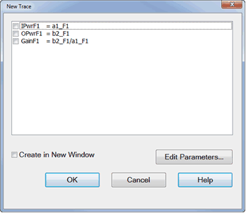
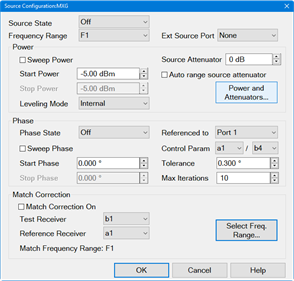
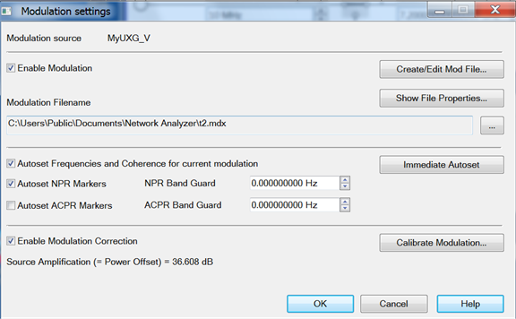

[File](FileTopic.md) | [Instrument](XTraceChanTopic.md) | [Response](XResponseTopic.md) | [Stimulus](XStimulusTopic.md) | [Utility](XUtilityTopic.md) | [Cal](CalTopic.md) | [Apps](MixerTopic.md) | [Remote ONLY](DataTopic.md)

* * *

  * FCA (OptS9x082A / S9x083A/B): Configure | [Calibrate](MixerTopic.md#FCACal) | [Embedded LO](MixerTopic.md#Embedded) | [Segment Sweep](MixerTopic.md#Segment)
  * Noise Figure App (Opt 028, 029, S93029A/B): [Setup](MixerTopic.md#NoiseSetup) | [Cal](MixerTopic.md#NoiseCal) | [SNP](MixerTopic.md#NoiseParamSNP) | [ENR files](MixerTopic.md#NoiseENR) | NFX
  * GCA (Opt S9x086A): [Setup](MixerTopic.md#Gainsetup) | [Cal](MixerTopic.md#GCACal) | [Analysis](MixerTopic.md#GCAnalysis) | [GCX](MixerTopic.md#GCx)
  * Swept IMD (Opt S93087A/B): [Setup](MixerTopic.md#SweptIMD) | [Cal](MixerTopic.md#IMDCal) | [Swept IMDx](MixerTopic.md#SweptIMDX)
  * IMSpectrum (Opt S93087A/B): [ Setup](MixerTopic.md#IMS) | [IMxSpectrum](MixerTopic.md#IMxSpectrum)
  * Diff IQ (Opt S9x089A/B): [Meas](MixerTopic.md#DIQMeas) | [Setup](MixerTopic.md#diqSetup) | [Range Settings](MixerTopic.md#diqRange) | [Parameters](MixerTopic.md#DIQEditParams) | [X-Axis](MixerTopic.md#DIQXaxis)
  * SA (Opt S9x090xA): SA Setup | Source: Setup | Coherence |Advanced Settings | IF Setup |Trig. & Pulse Setup | Processing Setup | ADC & LO Setup | Data | SA Markers | IQMod
  * iTMSA (Opt S93460A/B): [Setup](MixerTopic.md#iTMSA) | [Phase Sweep](MixerTopic.md#Phase)
  * Common [Mixer Setup](MixerTopic.md#MixerSetup) commands
  * Pulse (PNA-X): [Setup](XStimulusTopic.md#Pulse) | [Generators](XStimulusTopic.md#PulseGens) | [Trigger](XStimulusTopic.md#PulseTrigger)
  * [Frequency Offset](XStimulusTopic.md#Offset) (Opt S9x080A)
  * Enhanced Time Domain Analysis [[GUI Command Finder](CF_Setup_Commands_-_TDR.md)] (TDR, Option S9x011A/B)
  * Active (Hot) Parameters (Opt S93110A/B)
  * Modulation Distortion (Opt S9x070xB)
  * Phase Noise (Opt. S93031xB)
  * DPD (Digital Predistortion)

  
---  
  
Description | SCPI | COM  
---|---|---  
FCA Configure Measurements

  * Use [Mixer commands](MixerTopic.md#MixerSetup) to setup the mixer.
  * Use [FCA Segment commands](MixerTopic.md#Segment) to setup segment sweep.
  * Use the following commands to setup and calibrate SMC and VMC measurements.

  
Create an FCA measurement | [CALCulate:MEASure:DEFine](GP-IB_Command_Finder/Calculate/Measure.md#CALCulate:MEASure:DEFine) | [App.CreateCustomMeasurementEx](COM_Reference/Methods/CreateCustomMeasurementEx_Method.md)  
Change an FCA measurement | [CALCulate:MEASure:PARameter](GP-IB_Command_Finder/Calculate/MeasurePARameter.md#CALCulate:MEASure:PARameter) | Meas.[ChangeParameter](COM_Reference/Methods/Change_Parameter_Method.md)  
Sweep type | [SENSe:SWEep:TYPE](GP-IB_Command_Finder/Sense/Sweep_SCPI.md#ssty) | [Sweep Type Property](COM_Reference/Properties/Sweep_Type_Property.md)  
Map DUT ports to PNA ports | [SENSe:MIXer:PMAP](GP-IB_Command_Finder/Sense/MIXerSCPI.md#pmap) | [SetDutPorts](COM_Reference/Methods/SetDutPorts_Method.md)  
Read Input port map | [SENSe:MIXer:PMAP:INPut](GP-IB_Command_Finder/Sense/MIXerSCPI.md#PmapInput) | [DeviceInputPort](COM_Reference/Properties/DeviceInputPort_FCA_Property.md)  
Read Output port map | [SENSe:MIXer:PMAP:OUTPut](GP-IB_Command_Finder/Sense/MIXerSCPI.md#PmapInput) | [DeviceOutputPort](COM_Reference/Properties/DeviceOutputPort_FCA_Property.md)  
Avoid Spurs | [SENSe:MIXer:AVOidspurs](GP-IB_Command_Finder/Sense/MIXerSCPI.md#avoid) | [AvoidSpurs](COM_Reference/Properties/AvoidSpurs_Property.md)  
  
Minimum required FCA (SMC and VMC) Cal commands
[SCPI](GPIB_Example_Programs/SCPI_Example_Programs.md#FCA) and
[COM](COM_Example_Programs/COM_Example_Intro.md#FCA) examples.  
---  
Create Cal object | None | [CreateCustomCal](COM_Reference/Methods/CreateCustomCal_Method.md)  
Begin Cal | [SENSe:CORRection:COLLect:GUIDed:INITiate](GP-IB_Command_Finder/Sense/CorrGuided.md#gInit) | [Initialize](COM_Reference/Methods/Initialize_Method.md)  
Set connector type for each port | [SENSe:CORRection:COLLect:GUIDed:CONNector:PORT:SELect](GP-IB_Command_Finder/Sense/CorrGuided.md#gConSelect) | [ConnectorType](COM_Reference/Properties/ConnectorType_Property.md)  
Set Cal Kit for each port | [SENSe:CORRection:COLLect:GUIDed:CKIT:PORT:SELect](GP-IB_Command_Finder/Sense/CorrGuided.md#gKit) | [CalKitType](COM_Reference/Properties/CalKitType_fca_Property.md)  
Returns the number of steps required by the Calibration | [SENSe:CORRection:COLLect:GUIDed:STEPs?](GP-IB_Command_Finder/Sense/CorrGuided.md#gSteps) | [GenerateSteps](COM_Reference/Methods/GenerateSteps_Method.md)  
Returns the step description. | [SENSe:CORRection:COLLect:GUIDed:DESCription?](GP-IB_Command_Finder/Sense/CorrGuided.md#gDesc) | [GetStepDescription](COM_Reference/Methods/Get_StepDescription_Method.md)  
Measure a standard | [SENSe:CORRection:COLLect:GUIDed:ACQuire](GP-IB_Command_Finder/Sense/CorrGuided.md#gAcquire) | [AcquireStep](COM_Reference/Methods/AcquireStep_Method.md)  
Generate Error Terms | [SENSe:CORRection:COLLect:GUIDed:SAVE](GP-IB_Command_Finder/Sense/CorrGuided.md#gSave) | [GenerateErrorTerms](COM_Reference/Methods/GenerateErrorTerms_Method.md)  
  
Optional FCA (SMC and VMC) commands See [SMC](MixerTopic.md#SMC) and
[VMC](MixerTopic.md#VMC) specific optional commands  
---  
Set THRU method | [SENSe:CORRection:COLLect:GUIDed:PATH:TMEThod](GP-IB_Command_Finder/Sense/CorrGuided.md#PathTMethod) | [PathThruMethod](COM_Reference/Properties/PathThruMethod_Property.md)  
Sets ECAL auto-orientation ON or OFF | [SENSe:CORRection:PREFerence:ECAL:ORIentation](GP-IB_Command_Finder/Sense/Sense_Correction.md#Orie) | [AutoOrient](COM_Reference/Properties/AutoOrient_Property.md)  
Sets ECAL port map when orientation is off. | [SENSe:CORRection:PREFerence:ECAL:PMAP](GP-IB_Command_Finder/Sense/Sense_Correction.md#Pmap) | [EcalOrientation](COM_Reference/Properties/EcalOrientation_Property.md)  
Perform or Omit Isolation | [SENSe:CORRection:COLLect:GUIDed:ISOLation](GP-IB_Command_Finder/Sense/CorrGuided.md#IsolPaths) | [OmitIsolation](COM_Reference/Properties/OmitIsolation_Property.md)  
  
SMC Optional commands  
---  
SMC network embed/deembed | [SENSe:CORRection:COLLect:GUIDed:SMC:FSIMulator:NETWork:MODE](GP-IB_Command_Finder/Sense/CorrCollGuidSMC.md#NetworkMode) | [smc.NetworkMode](COM_Reference/Properties/NetworkMode_Property.md)  
SMC filename | [SENSe:CORRection:COLLect:GUIDed:SMC:FSIMulator:NETWork:FILename](GP-IB_Command_Finder/Sense/CorrCollGuidSMC.md#NetworkFilename) | [smc.NetworkFilename](COM_Reference/Properties/NetworkFilename_Property.md)  
Import existing Phase Ref Cal or Source Power Cal | [SENSe:CORRection:COLLect:GUIDed:SMC:IMPort](GP-IB_Command_Finder/Sense/CorrCollGuidSMC.md#Import) | [ImportDataSet](COM_Reference/Methods/ImportDataSet_Method.md)  
Use Thru or perform separate power cals | [SENSe:CORRection:COLLect:GUIDed:SMC:PWRCal:SEParate](GP-IB_Command_Finder/Sense/CorrCollGuidSMC.md#PwrCalSeparate) | [SeparatePowerCal](COM_Reference/Properties/SeparatePowerCal_Property.md)  
Include Reverse SC12 sweep | [SENSe:MIXer:REVerse](GP-IB_Command_Finder/Sense/MIXerSCPI.md#Reverse) | [IncludeReverseSweep](COM_Reference/Properties/IncludeReverseSweep_Property.md)  
Include input/output match correction | [CALCulate:MEASure:CORRection:TYPE](GP-IB_Command_Finder/Calculate/MeasureCorrection.md#CALCulate:MEASure:CORRection:TYPE) | [meas.CalibrationTypeID](COM_Reference/Properties/CalibrationTypeID_property.md)  
Use Nominal Incident Power | [SENSe:MIXer:INPut:POWer:USENominal](GP-IB_Command_Finder/Sense/MIXerSCPI.md#UseNominal) | [NominalIncidentPowerState](COM_Reference/Properties/NominalIncidentPowerState_Property.md)  
Enable LO Power Cal | [SENSe:CORRection:COLLect:GUIDed:SMC:LO:PCAL](GP-IB_Command_Finder/Sense/CorrCollGuidSMC.md#LOPwrCal) | [EnableLOPowerCal Property](COM_Reference/Properties/EnableLOPowerCal_Property.md)  
Save to s2p and s2px file | [MMEMory:STORe](GP-IB_Command_Finder/Memory.md#save) | None  
Load Power Table (used with mmWave) | [SENSe:CORRection:COLLect:GUIDed:PSENsor:POWTable](GP-IB_Command_Finder/Sense/CorrCollGuidPSens.md#Powtable) | None00  
  
SMC Include Phase  
---  
Enable Phase | [SENSe:MIXer:PHASe](GP-IB_Command_Finder/Sense/MIXerSCPI.md#Phase) | [EnablePhase](COM_Reference/Properties/EnablePhase_Property.md)  
Enable Absolute Phase | [SENSe:MIXer:PHASe:ABSolute[:STATe]](GP-IB_Command_Finder/Sense/MIXerSCPI.md#SENSe:MIXer:PHASe:ABSolute:STATe) | None  
Set normalize point | [SENSe:MIXer:NORMalize:POINt](GP-IB_Command_Finder/Sense/MIXerSCPI.md#Normalize) | [NormalizePoint](COM_Reference/Properties/NormalizePoint_SMC_Property.md)  
Choose known delay or S2P | [SENSe:CORRection:COLLect:GUIDed:SMC:PHASe:METHod](GP-IB_Command_Finder/Sense/CorrCollGuidSMC.md#PhaseMethod) | [DelayCalculationMethod](COM_Reference/Properties/DelayCalculationMethod_Property.md)  
Set known delay | [SENSe:CORRection:COLLect:GUIDed:SMC:PHASe:DELay](GP-IB_Command_Finder/Sense/CorrCollGuidSMC.md#PhaseDelay) | [FixedDelay](COM_Reference/Properties/FixedDelay_Property.md)  
Set Cal Mixer Char S2P filename | [SENSe:CORRection:COLLect:GUIDed:SMC:PHASe:MIXer](GP-IB_Command_Finder/Sense/CorrCollGuidSMC.md#PhaseMixer) | [MixerCharacterizationFile](COM_Reference/Properties/MixerCharacterizationFile_Property.md)  
Use Phase Ref Cal Set | [SENSe:CORRection:COLLect:GUIDed:SMC:IMPort](GP-IB_Command_Finder/Sense/CorrCollGuidSMC.md#Import) | [ImportDataSet](COM_Reference/Methods/ImportDataSet_Method.md)0000  
  
Perform SMC Phase Reference Cal | SCPI | COM  
---|---|---  
Reset | [SYSTem:CALibrate:PHASe:RESet](GP-IB_Command_Finder/SystCalPhase.md#reset) | [Reset](COM_Reference/Methods/Reset_\(PhaseRef\)_Method.md)  
Start Freq | [SYSTem:CALibrate:PHASe:FREQuency:STARt](GP-IB_Command_Finder/SystCalPhase.md#FreqStart) | [StartFrequency](COM_Reference/Properties/StartFrequency_PR_Property.md)  
Stop Freq | [SYSTem:CALibrate:PHASe:FREQuency:STOP](GP-IB_Command_Finder/SystCalPhase.md#FreqStop) | [StopFrequency](COM_Reference/Properties/Stop_Frequency_Property.md)  
Read channel number | [SYSTem:CALibrate:PHASe:](GP-IB_Command_Finder/SystCalPhase.md#reset)[GUIDed:CHANnel?](GP-IB_Command_Finder/SystCalPhase.md#GuidedChan) | N/A  
Read all Phase Reference IDs | [SYSTem:CALibrate:PHASe:REFerence:CATalog?](GP-IB_Command_Finder/SystCalPhase.md#RefCat) | [GetConnectedPhaseReferences](COM_Reference/Methods/GetConnectedPhaseReferences_Method.md)  
Set Phase Reference | [SYSTem:CALibrate:PHASe:REFerence](GP-IB_Command_Finder/SystCalPhase.md#Reference) | [PhaseReference](COM_Reference/Properties/PhaseReference_Property.md)  
Set Source Attenuator | [SYSTem:CALibrate:PHASe:POWer:ATTenuator](GP-IB_Command_Finder/SystCalPhase.md#PowerAtten) | [SourceAttenuator](COM_Reference/Properties/SourceAttenuator_PR_Property.md)  
Set Cal Set name | None | [CalSet](COM_Reference/Properties/CalSet_Property.md)  
Perform Cal | [Guided Cal commands](GP-IB_Command_Finder/Sense/CorrGuided.md) | [Guided Cal commands](COM_Reference/Objects/GuidedCalibration_Object.md)  
Use Phase Ref Cal Set | [SENSe:CORRection:COLLect:GUIDed:SMC:IMPort](GP-IB_Command_Finder/Sense/CorrCollGuidSMC.md#Import) | [ImportDataSet](COM_Reference/Methods/ImportDataSet_Method.md)  
Unknown Mixer calibration state | [SYSTem:CALibrate:PHASe:UNKNown:INCLude](GP-IB_Command_Finder/SystCalPhase.md#UnkInclude) | [IncludeUnknownMixer](COM_Reference/Properties/IncludeUnknownMixer_Property.md)  
---|---|---  
Unknown mixer LO frequency | [SYSTem:CALibrate:PHASe:UNKNown:LO:FREQuency](GP-IB_Command_Finder/SystCalPhase.md#UnkLoFreq) | [UnknownMixerLOFrequency](COM_Reference/Properties/UnknownMixerLOFrequency_Property.md)  
Unknown mixer LO power | [SYSTem:CALibrate:PHASe:UNKNown:LO:POWer](GP-IB_Command_Finder/SystCalPhase.md#UnkLoPower) | [UnknownMixerLOPower](COM_Reference/Properties/UnknownMixerLOPower_Property.md)  
Input power level to the unknown mixer | [SYSTem:CALibrate:PHASe:UNKNown:INPut:POWer](GP-IB_Command_Finder/SystCalPhase.md#UnkInPower) | [UnknownMixerInputPower](COM_Reference/Properties/UnknownMixerInputPower_Property.md)  
Connector type and gender of your Cal Kit. | [SYSTem:CALibrate:PHASe:CONNector](GP-IB_Command_Finder/SystCalPhase.md#connector) | [ConnectorType PhaseRef](COM_Reference/Properties/ConnectorType_Property.md)  
Cal Kit to be used to perform the S-parameter Cal | [SYSTem:CALibrate:PHASe:CKIT](GP-IB_Command_Finder/SystCalPhase.md#ckit) | [CalKitType PhaseRef](COM_Reference/Properties/CalKitType_PhaseRef_Property.md)  
Set the ports to be calibrated. | [SYSTem:CALibrate:PHASe:PORT[X]](GP-IB_Command_Finder/SystCalPhase.md#port) | [IncludePort](COM_Reference/Properties/IncludePort_Property.md)  
Reverse Port2 Coupler | [SYSTem:CALibrate:PHASe:DEEMbed](GP-IB_Command_Finder/SystCalPhase.md#deembed) | [DeembedCoupler](COM_Reference/Properties/DeembedCoupler_Property.md)  
  
VMC Optional commands  
---  
VMC network embed/deembed | [SENSe:CORRection:COLLect:GUIDed:VMC:FSIMulator:NETWork:MODE](GP-IB_Command_Finder/Sense/CorrCollGuidVMC.md#NetworkMode) | [vmc.NetworkMode](COM_Reference/Properties/NetworkMode_Property.md)  
VMC filename | [SENSe:CORRection:COLLect:GUIDed:VMC:FSIMulator:NETWork:FILename](GP-IB_Command_Finder/Sense/CorrCollGuidVMC.md#NetworkFilename) | [vmc.NetworkFilename](COM_Reference/Properties/NetworkFilename_Property.md)  
Enable LO Power Cal | [SENSe:CORRection:COLLect:GUIDed:VMC:LO<n>:PCAL](GP-IB_Command_Finder/Sense/CorrCollGuidVMC.md#LOPwrCal) | [EnableLOPowerCal Property](COM_Reference/Properties/EnableLOPowerCal_Property.md)  
  
Perform VMC Mixer characterization ONLY  
---  
Perform full calibration or mixer characterization only | [SENSe:CORRection:COLLect:GUIDed:VMC:OPERation](GP-IB_Command_Finder/Sense/CorrCollGuidVMC.md#VMC_OPERation) | [CharacterizeMixerOnly](COM_Reference/Properties/CharacterizeMixerOnly_Property.md)  
Specify direction of mixer characterization | [SENSe:CORRection:COLLect:GUIDed:VMC:MIXer:CHARacterize:CAL:REVerse](GP-IB_Command_Finder/Sense/CorrCollGuidVMC.md#Reverse) | [CharMixerReverse](COM_Reference/Properties/CharMixerReverse_Property.md)  
Set and read mixer char filename. | [SENSe:CORRection:COLLect:GUIDed:VMC:MIXer:CHARacterize:CAL:FILename](GP-IB_Command_Finder/Sense/CorrCollGuidVMC.md#filename) | [CharFileName](COM_Reference/Properties/CharFileName_Property.md)  
Sets ECAL auto-orientation ON or OFF | [SENSe:CORRection:PREFerence:ECAL:ORIentation](GP-IB_Command_Finder/Sense/Sense_Correction.md#Orie) | [AutoOrient Property](COM_Reference/Properties/AutoOrient_Property.md)  
Sets the port mapping for the mixer characterization. | [SENSe:CORRection:COLLect:GUIDed:VMC:MIXer:ECAL:PORTmap](GP-IB_Command_Finder/Sense/CorrCollGuidVMC.md#MIX_ECAL_PortMAP) | [EcalOrientation1Port](COM_Reference/Properties/EcalOrientation1Port_Property.md)  
Load Mixer characterization | [SENSe:CORRection:COLLect:GUIDed:VMC:MIXer:CHARacterize:CAL:OPTion](GP-IB_Command_Finder/Sense/CorrCollGuidVMC.md#MIX_CHAR_CAL_OPT) | [LoadCharFromFile](COM_Reference/Properties/LoadCharFromFile_Property.md)  
  
FCA Segment Sweep [SCPI](GPIB_Example_Programs/Setup_an_FCA_Segment_Sweep.md)
and [COM](COM_Example_Programs/Create_a_Segmented_Sweep_for_Mixers.md)
examples.  
---  
Recalculate | [SENSe:MIXer:RECalculate](GP-IB_Command_Finder/Sense/MIXerSCPI.md#Recalc) | [ReCalculate](COM_Reference/Methods/ReCalculate_Method.md)  
Segment Calculate | [SENSe:MIXer:SEGMent:CALCulate](GP-IB_Command_Finder/Sense/MixerSegment.md#calculate) | [SegmentCalculate](COM_Reference/Methods/SegmentCalculate_Method.md)  
Query Count | [SENSe:MIXer:SEGMent:COUNt?](GP-IB_Command_Finder/Sense/MixerSegment.md#count) | [SegmentCount](COM_Reference/Properties/SegmentCount_Property.md)  
Add Segments | [SENSe:MIXer:SEGMent:ADD](GP-IB_Command_Finder/Sense/MixerSegment.md#Add) | [AddSegment](COM_Reference/Methods/AddSegment_Method.md)  
Delete Segments | [SENSe:MIXer:SEGMent:DEL](GP-IB_Command_Finder/Sense/MixerSegment.md#delete) | [DeleteSegment](COM_Reference/Methods/DeleteSegment_Method.md)  
Remove All Segments | [SENSe:MIXer:SEGMent:DELete:ALL](GP-IB_Command_Finder/Sense/MixerSegment.md#DeleteAll) | [DeleteAllSegments](COM_Reference/Methods/DeleteAllSegments_Method.md)  
State | [SENSe:MIXer:SEGMent[:STATe]](GP-IB_Command_Finder/Sense/MixerSegment.md#State) | [SegmentState](COM_Reference/Properties/SegmentState_Property.md)  
Number Of Points | [SENSe:MIXer:SEGMent:POINts](GP-IB_Command_Finder/Sense/MixerSegment.md#Points) | [SegmentPoints](COM_Reference/Properties/SegmentPoints_Property.md)  
IFBW | [SENSe:MIXer:SEGMent:BWIDth](GP-IB_Command_Finder/Sense/MixerSegment.md#bwid) | [SegmentIFBandwidth](COM_Reference/Properties/SegmentIFBandwidth_Property.md)  
Input Fixed Freq | [SENSe:MIXer:SEGMent:INPut:FREQuency:FIXed](GP-IB_Command_Finder/Sense/MixerSegment.md#InputFixed) | [SegmentFixedFrequency](COM_Reference/Properties/SegmentFixedFrequency_Property.md)  
Input Start Freq | [SENSe:MIXer:SEGMent:INP:FREQuency:STARt](GP-IB_Command_Finder/Sense/MixerSegment.md#INPut_START) | [SegmentStartFrequency](COM_Reference/Properties/SegmentStartFrequency_Property.md)  
Input Stop Freq | [SENSe:MIXer:SEGMent:INP:FREQuency:STOP](GP-IB_Command_Finder/Sense/MixerSegment.md#inputStopFreq) | [SegmentStopFrequency](COM_Reference/Properties/SegmentStopFrequency_Property.md)  
Input Fixed/Swept | [SENSe:MIXer:SEGMent:INP:FREQuency:MODE](GP-IB_Command_Finder/Sense/MixerSegment.md#InputMode) | [SegmentRangeMode](COM_Reference/Properties/SegmentRangeMode_Property.md)  
Input Power | [SENSe:MIXer:SEGMent:INPut:POWer](GP-IB_Command_Finder/Sense/MixerSegment.md#InputPower) | [SegmentFixedPower](COM_Reference/Properties/SegmentFixedPower_Property.md)  
Output Fixed Freq | [SENSe:MIXer:SEGMent:OUTP:FREQuency:FIXed](GP-IB_Command_Finder/Sense/MixerSegment.md#OutputFixed) | [SegmentFixedFrequency](COM_Reference/Properties/SegmentFixedFrequency_Property.md)  
Output Start Freq | [SENSe:MIXer:SEGMent:OUTP:FREQuency:STARt](GP-IB_Command_Finder/Sense/MixerSegment.md#OutputFreqStart) | [SegmentStartFrequency](COM_Reference/Properties/SegmentStartFrequency_Property.md)  
Output Stop Freq | [SENSe:MIXer:SEGMent:OUTP:FREQuency:STOP](GP-IB_Command_Finder/Sense/MixerSegment.md#OutputFreqStop) | [SegmentStopFrequency](COM_Reference/Properties/SegmentStopFrequency_Property.md)  
Output Fixed/Swept | [SENSe:MIXer:SEGMent:OUTP:FREQuency:MODE](GP-IB_Command_Finder/Sense/MixerSegment.md#OutputFreqMode) | [SegmentRangeMode](COM_Reference/Properties/SegmentRangeMode_Property.md)  
Output (+/-) | [SENSe:MIXer:SEGMent:OUTP:FREQuency:SIDeband](GP-IB_Command_Finder/Sense/MixerSegment.md#OutputSideband) | [SegmentMixingMode](COM_Reference/Properties/SegmentMixingMode_Property.md)  
Output Power | [SENSe:MIXer:SEGMent:OUTPut:POWer](GP-IB_Command_Finder/Sense/MixerSegment.md#OutputPower) | [SegmentFixedPower](COM_Reference/Properties/SegmentFixedPower_Property.md)  
LO Fixed Freq | [SENSe:MIXer:SEGMent:LO<x>:FREQuency:FIXed](GP-IB_Command_Finder/Sense/MixerSegment.md#LOFixFreq) | [SegmentFixedFrequency](COM_Reference/Properties/SegmentFixedFrequency_Property.md)  
LO Start Freq | [SENSe:MIXer:SEGMent:LO<x>:FREQuency:STARt](GP-IB_Command_Finder/Sense/MixerSegment.md#LOStart) | [SegmentStartFrequency](COM_Reference/Properties/SegmentStartFrequency_Property.md)  
LO Stop Freq | [SENSe:MIXer:SEGMent:LO<x>:FREQuency:STOP](GP-IB_Command_Finder/Sense/MixerSegment.md#LoStop) | [SegmentStopFrequency](COM_Reference/Properties/SegmentStopFrequency_Property.md)  
LO Fixed/Swept | [SENSe:MIXer:SEGMent:LO<x>:FREQuency:MODE](GP-IB_Command_Finder/Sense/MixerSegment.md#LOFreqMode) | [SegmentRangeMode](COM_Reference/Properties/SegmentRangeMode_Property.md)  
Input >LO | [SENSe:MIXer:SEGMent:LO<x>:FREQuency:ILTI](GP-IB_Command_Finder/Sense/MixerSegment.md#loILTI) | [SegmentIsInputGreaterThanLO](COM_Reference/Properties/SegmentIsInputGreaterThanLO_Property.md)  
LO Power | [SENSe:MIXer:SEGMent:LO<x>:POWer](GP-IB_Command_Finder/Sense/MixerSegment.md#LOPower) | [SegmentFixedPower](COM_Reference/Properties/SegmentFixedPower_Property.md)  
IF (+/-) | [SENSe:MIXer:SEGMent:IF:FREQuency:SIDeband](GP-IB_Command_Finder/Sense/MixerSegment.md#IF_SIDE) | [SegmentMixingMode](COM_Reference/Properties/SegmentMixingMode_Property.md)  
  
Embedded LO (used with FCA, NFX, GCX, MODX, and Swept IMDx)  
---  
Embedded LO ON | OFF | [SENSe:MIXer:ELO:STATe](GP-IB_Command_Finder/Sense/MixrEmbedLO.md#state) | [IsOn](COM_Reference/Properties/IsOn_Property.md)  
Select tuning point | [SENSe:MIXer:ELO:NORMalize:POINt](GP-IB_Command_Finder/Sense/MixrEmbedLO.md#point) | [NormalizePoint](COM_Reference/Properties/NormalizePoint_Property.md)  
Set tuning mode | [SENSe:MIXer:ELO:TUNing:MODE](GP-IB_Command_Finder/Sense/MixrEmbedLO.md#mode) | [TuningMode](COM_Reference/Properties/TuningMode_Property.md)  
Set broadband sweep span | [SENSe:MIXer:ELO:TUNing:SPAN](GP-IB_Command_Finder/Sense/MixrEmbedLO.md#span) | [BroadbandTuningSpan](COM_Reference/Properties/BroadbandTuningSpan_Property.md)  
Set precise tuning tolerance | [SENSe:MIXer:ELO:TUNing:TOLerance](GP-IB_Command_Finder/Sense/MixrEmbedLO.md#tolerance) | [PreciseTuningTolerance](COM_Reference/Properties/PreciseTuningTolerance_Property.md)  
Set precise tuning iterations | [SENSe:MIXer:ELO:TUNing:ITERations](GP-IB_Command_Finder/Sense/MixrEmbedLO.md#iteration) | [MaxPreciseTuningIterations](COM_Reference/Properties/MaxPreciseTuningIterations_Property.md)  
LO delta frequency | [SENSe:MIXer:ELO:LO:DELTA](GP-IB_Command_Finder/Sense/MixrEmbedLO.md#delta) | [LOFrequencyDelta](COM_Reference/Properties/LOFrequencyDelta_Property.md)  
Resets tuning parameters | [SENSe:MIXer:ELO:TUNing:RESet](GP-IB_Command_Finder/Sense/MixrEmbedLO.md#tuningReset) | [ResetTuningParameters](COM_Reference/Methods/ResetTuningParameters_Method.md)  
Reset LO Delta frequency | [SENSe:MIXer:ELO:LO:RESET](GP-IB_Command_Finder/Sense/MixrEmbedLO.md#reset) | [ResetLOFrequency](COM_Reference/Methods/ResetLOFrequency_Method.md)  
Resets the LO Frequency Delta and Tuning parameters to their default settings. | [SENSe:MIXer:ELO:RESET](GP-IB_Command_Finder/Sense/MixrEmbedLO.md#SENSe_ch_:MIXer:ELO:RESet) | None  
Sets and returns the Noise Bandwidth for Broadband and Precise tuning sweeps. | [SENSe:MIXer:ELO:TUNing:NBW](GP-IB_Command_Finder/Sense/MixrEmbedLO.md#SENSe:MIXer:ELO:TUNing:NBW) | None  
Embedded LO Diagnostics (Available with Swept IMDx using COM ONLY)  
Clear current diagnostic information | [SENSe:MIXer:ELO:DIAGnostic:CLEAr](GP-IB_Command_Finder/Sense/MixrEmbedLO.md#diagClear) | [Clear](COM_Reference/Methods/Clear_Method.md)  
Get result of the last tuning sweeps. | [SENSe:MIXer:ELO:DIAGnostic:STATus?](GP-IB_Command_Finder/Sense/MixrEmbedLO.md#diagStatus) | [StatusAsString](COM_Reference/Properties/StatusAsString_Property.md)  
Get number of tuning sweeps. | [SENSe:MIXer:ELO:DIAGnostic:SWEep:COUNt?](GP-IB_Command_Finder/Sense/MixrEmbedLO.md#DiagCount) | [NumberOfSweeps](COM_Reference/Properties/NumberOfSweeps_Property.md)  
Was a marker was used for a tuning sweep? | [SENSe:MIXer:ELO:DIAGnostic:SWEep:MARKer:STATe?](GP-IB_Command_Finder/Sense/MixrEmbedLO.md#diagMarkState) | [IsMarkerOn](COM_Reference/Properties/IsMarkerOn_Property.md)  
Get the marker X-axis position. | [SENSe:MIXer:ELO:DIAGnostic:SWEep:MARKer:POSition?](GP-IB_Command_Finder/Sense/MixrEmbedLO.md#diagMarkerPos) | [MarkerPosition](COM_Reference/Properties/MarkerPosition_Property.md)  
Get the marker annotation. | [SENSe:MIXer:ELO:DIAGnostic:SWEep:MARKer:ANNotation?](GP-IB_Command_Finder/Sense/MixrEmbedLO.md#diagMarkAnn) | [MarkerAnnotation](COM_Reference/Properties/MarkerAnnotation_Property.md)  
Get the tuning sweep X axis annotation. | [SENSe:MIXer:ELO:DIAGnostic:SWEep:X:ANNotation?](GP-IB_Command_Finder/Sense/MixrEmbedLO.md#diagXann) | [XAxisAnnotation](COM_Reference/Properties/XAxisAnnotation_Property.md)  
Get the tuning sweep Y axis annotation. | [SENSe:MIXer:ELO:DIAGnostic:SWEep:Y:ANNotation?](GP-IB_Command_Finder/Sense/MixrEmbedLO.md#diagYann) | [YAxisAnnotation](COM_Reference/Properties/YAxisAnnotation_Property.md)  
Get the Start sweep value. | [SENSe:MIXer:ELO:DIAGnostic:SWEep:X:STARt?](GP-IB_Command_Finder/Sense/MixrEmbedLO.md#diagXstart) | [XAxisStart](COM_Reference/Properties/XAxisStart_Property.md)  
Get the Stop sweep value. | [SENSe:MIXer:ELO:DIAGnostic:SWEep:X:STOP?](GP-IB_Command_Finder/Sense/MixrEmbedLO.md#diagXstop) | [XAxisStop](COM_Reference/Properties/XAxisStop_Property.md)  
Returns the tuning sweep parameter name. | [SENSe:MIXer:ELO:DIAGnostic:SWEep:PARameter?](GP-IB_Command_Finder/Sense/MixrEmbedLO.md#diagParam) | [Parameter](COM_Reference/Properties/Parameter_elo_Property.md)  
Returns the tuning sweep title. | [SENSe:MIXer:ELO:DIAGnostic:SWEep:TITLe?](GP-IB_Command_Finder/Sense/MixrEmbedLO.md#diagTitle) | [StepTitle](COM_Reference/Properties/StepTitle_Property.md)  
Returns the LO frequency delta from this tuning sweep | [SENSe:MIXer:ELO:DIAGnostic:SWEep:LO:DELTa?](GP-IB_Command_Finder/Sense/MixrEmbedLO.md#diagLoDelta) | [LODeltaFound](COM_Reference/Properties/LODeltaFound_Property.md)  
  
Gain Compression Setup  
---  
Create a GCA Meas | [CALCulate:MEASure:DEFine](GP-IB_Command_Finder/Calculate/Measure.md#CALCulate:MEASure:DEFine) | [App.CreateCustomMeasurementEx](COM_Reference/Methods/CreateCustomMeasurementEx_Method.md)  
Change a GCA Parameter | [CALCulate:MEASure:PARameter](GP-IB_Command_Finder/Calculate/MeasurePARameter.md#CALCulate:MEASure:PARameter) | Meas.[ChangeParameter](COM_Reference/Methods/Change_Parameter_Method.md)  
Sweep Type | [SENSe:SWEep:TYPE](GP-IB_Command_Finder/Sense/Sweep_SCPI.md#ssty) | [SweepType](COM_Reference/Properties/Sweep_Type_Property.md)  
Number of frequency points | [SENSe:GCSetup:SWEep:FREQuency:POINts](GP-IB_Command_Finder/Sense/Gain_Compression.md#FreqPoints) | [NumberOfFrequencyPoints](COM_Reference/Properties/NumberOfFrequencyPoints_Property.md)  
Number of power points | [SENSe:GCSetup:SWEep:POWer:POINts](GP-IB_Command_Finder/Sense/Gain_Compression.md#powerPoints) | [NumberOfPowerPoints](COM_Reference/Properties/NumberOfPowerPoints_Property.md)  
Maximum number of points | None | [MaximumNumberOfPoints](COM_Reference/Properties/MaximumNumberOfPoints.md)  
Total number of points | None | [TotalNumberOfPoints](COM_Reference/Properties/TotalNumberOfPoints_Property.md)  
Acquisition mode | [SENSe:GCSetup:AMODe](GP-IB_Command_Finder/Sense/Gain_Compression.md#Amode) | [AcquisitionMode](COM_Reference/Properties/AcquisitionMode_Property.md)  
Smart tolerance | [SENSe:GCSetup:SMARt:TOLerance](GP-IB_Command_Finder/Sense/Gain_Compression.md#smartToler) | [SmartSweepTolerance](COM_Reference/Properties/SmartSweepTolerance_Property.md)  
Smart Iterations | [SENSe:GCSetup:SMARt:MITerations](GP-IB_Command_Finder/Sense/Gain_Compression.md#smartMiter) | [SmartSweepMaximumIterations](COM_Reference/Properties/SmartSweepMaximumIterations_Property.md)  
Smart settling time | [SENSe:GCSetup:SMARt:STIMe](GP-IB_Command_Finder/Sense/Gain_Compression.md#Settling) | [SmartSweepSettlingTime](COM_Reference/Properties/SmartSweepSettlingTime_Property.md)  
Smart show iterations | [SENSe:GCSetup:SMARt:SITerations](GP-IB_Command_Finder/Sense/Gain_Compression.md#Siterations) | [SmartSweepShowIterations](COM_Reference/Properties/SmartSweepShowIterations_Property.md)  
Read DC at compression point | [SENSe:GCSetup:SMARt:CDC](GP-IB_Command_Finder/Sense/Gain_Compression.md#SENSe:GCSetup:SMARt:CDC) | [ReadDCAtCompression](COM_Reference/Properties/ReadDCAtCompression_Property.md)  
Read compression failures | [SENSe:GCSetup:SFAilures?](GP-IB_Command_Finder/Sense/Gain_Compression.md#SFA) | [SearchFailures](COM_Reference/Properties/SearchSummary_Property.md)  
Write port map | [SENSe:GCSetup:PMAP](GP-IB_Command_Finder/Sense/Gain_Compression.md#portMap) | [SetPortMap](COM_Reference/Methods/SetPortMap_Method.md)  
Read Port Map (Input) | [SENSe:GCSetup:PMAP:INPut](GP-IB_Command_Finder/Sense/Gain_Compression.md#PortIN) | [DeviceInputPort](COM_Reference/Properties/DeviceInputPort_Property.md)  
Read Port Map (Output) | [SENSe:GCSetup:PMAP:OUTPut](GP-IB_Command_Finder/Sense/Gain_Compression.md#PortOutput) | [DeviceOutputPort](COM_Reference/Properties/DeviceOutputPort_Property.md)  
Remaps the source port to Port 1. | [SENSe:GCSetup:PMAP:SOURce:OVERride](GP-IB_Command_Finder/Sense/Gain_Compression.md#SENSe:GCSetup:PMAP:SOURce:OVERride) | None  
End of Sweep | [SENSe:GCSetup:EOSoperation](GP-IB_Command_Finder/Sense/Gain_Compression.md#eos) | [EndOfSweepOperation](COM_Reference/Properties/EndOfSweepOperation_Property.md)  
Linear input power | [SENSe:GCSetup:POWer:LINear:INPut:LEVel](GP-IB_Command_Finder/Sense/Gain_Compression.md#InpPwer) | [InputLinearPowerLevel](COM_Reference/Properties/InputLinearPowerLevel_Property.md)  
Reverse Power | [SENSe:GCSetup:POWer:REVerse:LEVel](GP-IB_Command_Finder/Sense/Gain_Compression.md#REVpower) | [ReverseLinearPowerLevel](COM_Reference/Properties/ReverseLinearPowerLevel_Property.md)  
Start power | [SENSe:GCSetup:POWer:STARt:LEVel](GP-IB_Command_Finder/Sense/Gain_Compression.md#startPower) | chan.[Start Power](COM_Reference/Properties/Start_Power_Property.md)  
Stop power | [SENSe:GCSetup:POWer:STOP:LEVel](GP-IB_Command_Finder/Sense/Gain_Compression.md#stopPower) | chan.[Stop Power](COM_Reference/Properties/Stop_Power_Property.md)  
Compression algorithm | [SENSe:GCSetup:COMPression:ALGorithm](GP-IB_Command_Finder/Sense/Gain_Compression.md#CompAlgorithm) | [CompressionAlgorithm](COM_Reference/Properties/CompressionAlgorithm_Property.md)  
Compression Level | [SENSe:GCSetup:COMPression:LEVel](GP-IB_Command_Finder/Sense/Gain_Compression.md#compLevel) | [CompressionLevel](COM_Reference/Properties/CompressionLevel_Property.md)  
Backoff Level | [SENSe:GCSetup:COMPression:BACK:LEVel](GP-IB_Command_Finder/Sense/Gain_Compression.md#backoff) | [CompressionBackoff](COM_Reference/Properties/CompressionBackoff_Property.md)  
X Delta | [SENSe:GCSetup:COMPression:DELTa:X](GP-IB_Command_Finder/Sense/Gain_Compression.md#deltaX) | [CompressionDeltaX](COM_Reference/Properties/CompressionDeltaX_Property.md)  
Y Delta | [SENSe:GCSetup:COMPression:DELTa:Y](GP-IB_Command_Finder/Sense/Gain_Compression.md#deltaY) | [CompressionDeltaY](COM_Reference/Properties/CompressionDeltaY_Property.md)  
Saturation level | [SENSe:GCSetup:COMPression:SATuration:LEVel](GP-IB_Command_Finder/Sense/Gain_Compression.md#SatLevel) | [SaturationLevel](COM_Reference/Properties/SaturationLevel_Property.md)  
Interpolation | [SENSe:GCSetup:COMPression:INTerpolate[:STATe]](GP-IB_Command_Finder/Sense/Gain_Compression.md#comInterp) | [CompressionInterpolation](COM_Reference/Properties/CompressionInterpolation_Property.md)  
Set and read the desired phase to measure compression. | [SENSe:GCSetup:COMPression:PHASe:LEVel](GP-IB_Command_Finder/Sense/Gain_Compression.md#SENSe:GCSetup:COMPression:PHASe:LEVel) | None  
Set and read compression format to be either magnitude, phase, or magnitude and phase. | [SENSe:GCSetup:COMPression:PHASe:MODE](GP-IB_Command_Finder/Sense/Gain_Compression.md#SENSe:GCSetup:COMPression:PHASe:MODE) | None  
Safe Sweep enable | [SENSe:GCSetup:SAFE:ENABle](GP-IB_Command_Finder/Sense/Gain_Compression.md#SafeEnable) | [SafeSweepEnable](COM_Reference/Properties/SafeSweepEnable_Property.md)  
Safe Sweep coarse | [SENSe:GCSetup:SAFE:CPADjustment](GP-IB_Command_Finder/Sense/Gain_Compression.md#SafeCourse) | [SafeSweepCoarsePowerAdjustment](COM_Reference/Properties/SafeSweepCoarsePowerAdjustment_Property.md)  
Safe Sweep fine | [SENSe:GCSetup:SAFE:FPADjustment](GP-IB_Command_Finder/Sense/Gain_Compression.md#SafeFine) | [SafeSweepFinePowerAdjustment](COM_Reference/Properties/SafeSweepFinePowerAdjustment_Property.md)  
Safe Sweep threshold | [SENSe:GCSetup:SAFE:FTHReshold](GP-IB_Command_Finder/Sense/Gain_Compression.md#safeThresh) | [SafeSweepFineThreshold](COM_Reference/Properties/SafeSweepFineThreshold_Property.md)  
Safe Sweep max power | [SENSe:GCSetup:SAFE:MLIMit](GP-IB_Command_Finder/Sense/Gain_Compression.md#SaveMaxPwr) | [SafeSweepMaximumLimit](COM_Reference/Properties/SafeSweepMaximumLimit_Property.md)  
Set and read the name of the external DC device. | [SENSe:GCSetup:SAFE:DC:PARameter](GP-IB_Command_Finder/Sense/Gain_Compression.md#SENSe:GCSetup:SAFE:DC:PARameter) | [SafeSweepDCParameter](COM_Reference/Properties/SafeSweepDCParameter_Property.md)  
Set and read the maximum limit of the external DC device. | [SENSe:GCSetup:SAFE:DC:MLimit](GP-IB_Command_Finder/Sense/Gain_Compression.md#SENSe:GCSetup:SAFE:DC:MLimit) | [SafeSweepMaximumDCLimit](COM_Reference/Properties/SafeSweepMaximumDCLimit_Property.md)  
Set and read the DC readings at the compression point in the last iteration of a smart sweep | [SENSe:GCSetup:SMARt:CDC](GP-IB_Command_Finder/Sense/Gain_Compression.md#SENSe:GCSetup:SMARt:CDC) | None  
GCA/GCX Phase Commands  
Set and read the state of the mixer reference. | [SENSe:GCSetup:MIXer:REFerence](GP-IB_Command_Finder/Sense/Gain_Compression.md#SENSe:GCSetup:MIXer:REFerence) | None  
Set and read the aperture to use when computing the linear input power. | [SENSe:GCSetup:POWer:LINear:INPut:COMPute:APERture](GP-IB_Command_Finder/Sense/Gain_Compression.md#SENSe:GCSetup:POWer:LINear:INPut:COMPute:APERture) | None  
Set and read the state of the power smoothing. | [SENSe:GCSetup:SWEep:POWer:SMOoth](GP-IB_Command_Finder/Sense/Gain_Compression.md#SENSe:GCSetup:SWEep:POWer:SMOoth) | None  
Set and read the power smoothing aperture in percent. | [SENSe:GCSetup:SWEep:POWer:SMOoth:APERture](GP-IB_Command_Finder/Sense/Gain_Compression.md#SENSe:GCSetup:SWEep:POWer:SMOoth:APERture) | None  
Read GCA Data  
Read all GCA data | [CALCulate:MEASure:GCData:DATA?](GP-IB_Command_Finder/Calculate/MasureGCData.md) | [GetRaw2DData](COM_Reference/Methods/GetRaw2DData_Method.md)  
Read real GCA data | [CALCulate:MEASure:GCData:REAL?](GP-IB_Command_Finder/Calculate/MasureGCData.md#CALCulate:MEASure:GCData:REAL) | [GetDataRe](COM_Reference/Methods/GetDataRe_Method.md)  
Read imaginary GCA data | [CALCulate:MEASure:GCData:IMAG?](GP-IB_Command_Finder/Calculate/MasureGCData.md#CALCulate:MEASure:GCData:IMAG) | [GetDataIm](COM_Reference/Methods/GetDataIm_Method.md)  
Read number of iterations | [CALCulate:MEASure:GCD:ITERations?](GP-IB_Command_Finder/Calculate/MasureGCData.md#CALCulate:MEASure:GCData:ITERations) | [TotalIterations](COM_Reference/Properties/TotalIterations_Property.md)  
  
Gain Compression Analysis  
---  
Enable a compression analysis trace | [CALCulate:MEASure:GCMeas:ANALysis:ENABle](GP-IB_Command_Finder/Calculate/MeasureGCMeas.md#CALCulate:MEASure:GCMeas:ANALysis:ENABle) | [AnalysisEnable](COM_Reference/Properties/AnalysisEnable_Property.md)  
Set CW frequency | [CALCulate:MEASure:GCMeas:ANALysis:CWFRequency](GP-IB_Command_Finder/Calculate/MeasureGCMeas.md#CALCulate:MEASure:GCMeas:ANALysis:CWFRequency) | [AnalysisCWFreq](COM_Reference/Properties/AnalysisCWFreq_Property.md)  
Set to discrete or interpolated CW frequencies | [CALCulate:MEASure:GCMeas:ANALysis:DISCrete](GP-IB_Command_Finder/Calculate/MeasureGCMeas.md#CALCulate:MEASure:GCMeas:ANALysis:DISCrete:STATe) | [AnalysisIsDiscreteFreq](COM_Reference/Properties/AnalysisIsDiscreteFreq_Property.md)  
Sets X-axis display | [CALCulate:MEASure:GCMeas:ANALysis:XAXis](GP-IB_Command_Finder/Calculate/MeasureGCMeas.md#CALCulate:MEASure:GCMeas:ANALysis:XAXis) | [AnalysisXAxis](COM_Reference/Properties/AnalysisXAxis_Property.md)  
GCA Cal  
---  
Read about GCA Cal | [Gain Compression](GP-IB_Command_Finder/Sense/Gain_Compression.md) Cal | [GainCompressionCal](COM_Reference/Objects/GainCompressionCal_Object.md)  
Set power for source power cal | [SENSe:CORRection:GCSetup:POWer](GP-IB_Command_Finder/Sense/Sense_Correction.md#GCSPower) | [PowerLevel](COM_Reference/Properties/PowerLevel_Property.md)  
Set connector type for power sensor. | [SENSe:CORRection:GCSetup:SENSor:CONNector](GP-IB_Command_Finder/Sense/Sense_Correction.md#GCSConnector) | [PowerSensorConnectorType](COM_Reference/Properties/PowerSensorConnectorType_Property.md)  
Set cal kit for power sensor connector. | [SENSe:CORRection:GCSetup:SENSor:CKIT](GP-IB_Command_Finder/Sense/Sense_Correction.md#GCSCkit) | [PowerSensorCalKitType](COM_Reference/Properties/PowerSensorCalKitType_Property.md)  
Guided Cal commands | [SENSe:CORRection:COLLect:GUIDed](GP-IB_Command_Finder/Sense/CorrGuided.md) | [GuidedCalibration](COM_Reference/Objects/GuidedCalibration_Object.md)  
  
GCx- Gain Compression for Converters Use [Gain Compression
commands](MixerTopic.htm#Gainsetup) to setup the GCA measurement Use [Mixer
commands](MixerTopic.htm#MixerSetup) to setup the mixer. See
[SCPI](GPIB_Example_Programs/Create_and_Cal_a_GCX_Measurement.md) and
[COM](COM_Example_Programs/Create_and_Cal_a_GCX_Measurement.htm.md) examples  
---  
  
Noise Figure Setup  
---  
Create Noise Figure meas | [CALCulate:CUSTom:DEFine](GP-IB_Command_Finder/Calculate/Custom.md#CustDef) | [CreateCustomMeasurementEx](COM_Reference/Methods/CreateCustomMeasurementEx_Method.md)  
Change Noise Figure meas | [CALCulate:CUSTom:MODify](GP-IB_Command_Finder/Calculate/Custom.md#Modify) | meas.[Change Parameter](COM_Reference/Methods/Change_Parameter_Method.md)  
Sets the number of impedance states to use |  [SENSe:NOISe:IMPedance:COUNt](GP-IB_Command_Finder/Sense/Noise.md#ImpCount) | [ImpedanceStates](COM_Reference/Properties/ImpedanceStates_Property.md)  
Select Noise Receiver | [SENSe:NOISe:RECeiver](GP-IB_Command_Finder/Sense/Noise.md#Receiver) | [NoiseReceiver](COM_Reference/Properties/NoiseReceiver_Property.md)  
Noise averaging ON and OFF |  [SENSe:NOISe:AVERage:STATe](GP-IB_Command_Finder/Sense/Noise.md#avgState) | [NoiseAverageState](COM_Reference/Properties/NoiseAverageState_Property.md)  
Set averaging of noise receiver. |  [SENSe:NOISe:AVERage](GP-IB_Command_Finder/Sense/Noise.md#Average) | [NoiseAverageFactor](COM_Reference/Properties/NoiseAverageFactor_Property.md)  
Set narrowband state | [SENSe:NOISe:NARRowband](GP-IB_Command_Finder/Sense/Noise.md#Narrowband) | [NarrowBand](COM_Reference/Properties/NarrowBand_Property.md)  
Set bandwidth of noise receiver. |  [SENSe:NOISe:BWIDth](GP-IB_Command_Finder/Sense/Noise.md#bwid) | [NoiseBandwidth](COM_Reference/Properties/NoiseBandwidth_Property.md)  
Set gain state of noise receiver. |  [SENSe:NOISe:GAIN](GP-IB_Command_Finder/Sense/Noise.md#gain) | [NoiseGain](COM_Reference/Properties/NoiseGain_Property.md)  
Sets the port identifier of the ECal noise tuner that is connected to the PNA Source. |  [SENSe:NOISe:TUNer:INPut](GP-IB_Command_Finder/Sense/Noise.md#TunerInput) | [NoiseTunerIn](COM_Reference/Properties/NoiseTunerIn_Property.md)  
Sets the port identifier of the ECal noise tuner that is connected to the DUT. |  [SENSe:NOISe:TUNer:OUTPut](GP-IB_Command_Finder/Sense/Noise.md#tunerOutput) | [NoiseTunerOut](COM_Reference/Properties/NoiseTunerOut_Property.md)  
Set and read a custom noise tuner file to be used instead of the one generated automatically based on the state. | [SENSe:NOISe:TUNer:FILE:NAME](GP-IB_Command_Finder/Sense/Noise.md#SENSe:NOISe:TUNer:FILE:NAME) | None  
Sets the state of the custom noise tuner file. | [SENSe:NOISe:TUNer:FILE[:STATe]](GP-IB_Command_Finder/Sense/Noise.md#SENSe:NOISe:TUNer:FILE:STATe) | None  
Set the excess noise source ON or OFF. |  [CONTrol:NOISe:SOURce](GP-IB_Command_Finder/Control.md#NoiseSourceState) or [OUTPut:MANual:NOISe[:STATe]](GP-IB_Command_Finder/Output.md#NoiseState) | [NoiseSourceState](COM_Reference/Properties/NoiseSourceState_Property.md)  
Set mechanical switches | [SENSe:PATH:CONFig:ELEMent](GP-IB_Command_Finder/Sense/Path.md#state) | [PathConfiguration Object](COM_Reference/Objects/PathConfiguration_Object.md)  
  
Port Mapping - Noise Figure Opt 028  
---  
Write port mapping | [SENSe:NOISe:PMAP](GP-IB_Command_Finder/Sense/Noise.md#pmapSet) | [SetPortMap](COM_Reference/Methods/SetPortMap_Method.md)  
Read input port mapping | [SENSe:NOISe:PMAP:INPut?](GP-IB_Command_Finder/Sense/Noise.md#PortIN) | [DeviceInputPort](COM_Reference/Properties/DeviceInputPort_Property.md)  
Read output port mapping | [SENSe:NOISe:PMAP:OUTPut?](GP-IB_Command_Finder/Sense/Noise.md#PortOutput) | [DeviceOutputPort](COM_Reference/Properties/DeviceOutputPort_Property.md)  
  
Noise Figure Cal - all other cal settings use standard commands.  
---  
Create Noise Cal object | N/A | [CreateCustomCalEx](COM_Reference/Methods/CreateCustomCalEx_Method.md)  
Set Noise Calibration method |  [SENSe:NOISe:CALibration:METHod](GP-IB_Command_Finder/Sense/Noise.md#CalMethod) | [CalMethod](COM_Reference/Properties/CalMethod_Property.md)  
Set Noise Tuner identifier | [SENSe:NOISe:TUNer:ID](GP-IB_Command_Finder/Sense/Noise.md#tunerID) | [NoiseTuner](COM_Reference/Properties/NoiseTuner_Property.md)  
Set Noise Recvr Method | [SENSe:NOISe:CALibration:RMEThod](GP-IB_Command_Finder/Sense/Noise.md#RMethod) | [RcvCharMethod](COM_Reference/Properties/RcvCharMethod_Property.md)  
Noise source ENR filename |  [SENSe:NOISe:ENR:FILename](GP-IB_Command_Finder/Sense/Noise.md#ENRFilename) | [ENRFile](COM_Reference/Properties/ENRFile_Property.md)  
Set noise source Cal Kit type |  [SENSe:NOISe:SOURce:CKIT](GP-IB_Command_Finder/Sense/Noise.md#sourceCKIT) | [NoiseSourceCalKitType](COM_Reference/Properties/NoiseSourceCalKitType_Property.md)  
Set ambient temperature |  [SENSe:NOISe:TEMPerature:AMBient](GP-IB_Command_Finder/Sense/Noise.md#TempAmb) | [AmbientTemperature](COM_Reference/Properties/AmbientTemperature_Property.md)  
Enables/disables the use of 302K as the ambient temperature. | [SENSe:NOISe:TEMPerature:AMBient:AUTO](GP-IB_Command_Finder/Sense/Noise.md#SENSe:NOISe:TEMPerature:AMBient:AUTO) | None  
Sets the temperature at which the current noise measurement is occurring. | [SENSe:NOISe:TEMPerature:SOURce[:VALue]](GP-IB_Command_Finder/Sense/Noise.md#SENSe:NOISe:TEMPerature:SOURce) | None  
Enables/disables the use of 302K as the source temperature. | [SENSe:NOISe:TEMPerature:SOURce:AUTO](GP-IB_Command_Finder/Sense/Noise.md#SENSe:NOISe:TEMPerature:SOURce:AUTO) | None  
Sets noise source connector type |  [SENSe:NOISe:SOURce:CONNector](GP-IB_Command_Finder/Sense/Noise.md#sourceConn) | [NoiseSourceConnectorType](COM_Reference/Properties/NoiseSourceConnectorType_Property.md)  
Set noise source connector temp | [SENSe:CORRection:TCOLd:USER:VALue](GP-IB_Command_Finder/Sense/Sense_Correction.md#tcold) | [NoiseSourceCold](COM_Reference/Properties/NoiseSourceCold_Property.md)  
  
Get/Save Noise Parameters SNP Data | SCPI | COM  
---|---|---  
Read noise parameter SNP data | [SENSe:NOISe:SNP?](GP-IB_Command_Finder/Sense/Noise.md#snp) | [GetSnPData](COM_Reference/Methods/GetSnpData_Method.md)  
Write noise parameters to SNP file | [SENSe:NOISe:SNP:SAVE](GP-IB_Command_Finder/Sense/Noise.md#snpSave) | [WriteSnPData](COM_Reference/Methods/WriteSnPData_Method.md)  
  
NFX - Noise Figure on Mixers/Converters Use [Noise Figure
commands](MixerTopic.htm#NoiseSetup) to setup Noise Figure measurement Use
[Mixer commands](MixerTopic.md#MixerSetup) to setup the mixer. Use the
following commands to calibrate. See
[SCPI](GPIB_Example_Programs/Create_and_Cal_an_NFX_Measurement.md) and
[COM](COM_Example_Programs/Create_and_Cal_an_NFX_Measurement.md) examples  
---  
Sets the power sensor connector | [SENSe:CORRection:COLLect:GUIDed:PSENsor:CONNector](GP-IB_Command_Finder/Sense/CorrCollGuidPSens.md#PsensorConn) | [PowerSensorConnectorType](COM_Reference/Properties/PowerSensorConnectorType_Guided_Property.md)  
Sets the power sensor calkit | [SENSe:CORRection:COLLect:GUIDed:PSENsor:CKIT](GP-IB_Command_Finder/Sense/CorrCollGuidPSens.md#PsenCKIT) | [PowerSensorCalKitType](COM_Reference/Properties/PowerSensorCalKitType_Guided%20Property.md)  
Sets power level for source power cal | [SENSe:CORRection:COLLect:GUIDed:PSENsor:POWer:LEVel](GP-IB_Command_Finder/Sense/CorrCollGuidPSens.md#PsenPowLevel) | [PowerCalibrationLevel](COM_Reference/Properties/PowerCalibrationPowerLevel_Property.md)  
Sets auto orientation state for noise tuner | [SENSe:NOISe:TUNer:ORIent](GP-IB_Command_Finder/Sense/Noise.md#tunerOrient) | [AutoOrientTuner](COM_Reference/Properties/AutoOrientTuner_Property.md)  
Sets LO power calibration state | [SENSe:CORRection:COLLect:NOISe:LO:PCAL:STATe](GP-IB_Command_Finder/Sense/Sense_Correction.md#NoiseLOPCAl) | [EnableLOPowerCal](COM_Reference/Properties/EnableLOPowerCal_Property.md)  
Sets the source pull technique to compute DUT S-parameters | [SENSe:NOISe:PULL](GP-IB_Command_Finder/Sense/Noise.md#Pull) | [SourcePullForSParameters](COM_Reference/Properties/SourcePullForSParameters_Property.md)  
Sets the state of ENR adapter de-embedding. | [SENSe:CORRection:COLLect:NOISe:ENR:ADAP:DEEMbed](GP-IB_Command_Finder/Sense/Sense_Correction.md#NoiseENRDeemb) | [ForceDeEmbedENRAdapter](COM_Reference/Properties/ForceDeEmbedENRAdapter_Property.md)  
Set and read the state of the thru adapter de-embedding. | [SENSe:CORRection:COLLect:NOISe:THRU:ADAPter:DEEMbed[:STATe]](GP-IB_Command_Finder/Sense/Sense_Correction.md#SENSe:CORRection:COLLect:NOISe:THRU:ADAPter:DEEMbed:STATe) | None  
Sets the state of Power Sensor adapter de-embedding. | [SENSe:CORRection:COLLect:NOISe:PSEN:ADAP:DEEMbed](GP-IB_Command_Finder/Sense/Sense_Correction.md#NoiseENRDeemb) | [ForceDeEmbedSensorAdapter](COM_Reference/Properties/ForceDeEmbedSensorAdapter_Property.md)  
  
Noise Figure ENR File Data Management  
---  
Set ENR calibration data. | [SENSe:CORRection:ENR:CALibration:TABLe:DATA](GP-IB_Command_Finder/Sense/Sense_Correction.md#ENRData) | [PutENRData](COM_Reference/Methods/PutENRData_Method.md)  
Read ENR calibration data. | [SENSe:CORRection:ENR:CALibration:TABLe:DATA?](GP-IB_Command_Finder/Sense/Sense_Correction.md#ENRData) | [GetENRData](COM_Reference/Methods/GetENRData_Method.md)  
Get/set ID of ENR table. | [SENSe:CORRection:ENR:CALibration:TABLe:ID:DATA](GP-IB_Command_Finder/Sense/Sense_Correction.md#EnrID) | [ENRID](COM_Reference/Properties/ENRID_Property.md)  
Get/set serial number of noise source. | [SENSe:CORRection:ENR:CALibration:TABLe:SERial:DATA](GP-IB_Command_Finder/Sense/Sense_Correction.md#EnrSerial) | [ENRSN](COM_Reference/Properties/ENRSN_Property.md)  
Sets/Returns the value of the temperature in the ENR file in Kelvin. | [SENSe:CORRection:ENR:CALibration:TABLe:TEMPerature:DATA](GP-IB_Command_Finder/Sense/Sense_Correction.md#EnrTEMPerature) | [NoiseCalTemperature](COM_Reference/Properties/NoiseCalTemperature_Property.md)  
Load ENR table from file. | [MMEMory:LOAD:ENR](GP-IB_Command_Finder/Memory.md#recall) | [LoadENRFile](COM_Reference/Methods/LoadENRFile_Method.md)  
Save ENR table to file. | [MMEMory:STORe:ENR](GP-IB_Command_Finder/Memory.md#save) | [SaveENRFile](COM_Reference/Methods/SaveENRFile_Method.md)  
  
Swept IMD  
---  
Create a measurement | [CALCulate:CUSTom:DEFine](GP-IB_Command_Finder/Calculate/Custom.md#CustDef) | [CreateCustomMeasurementEx](COM_Reference/Methods/CreateCustomMeasurementEx_Method.md)  
Change a measurement | [CALCulate:CUSTom:MODify](GP-IB_Command_Finder/Calculate/Custom.md#Modify) | meas.[Change Parameter](COM_Reference/Methods/Change_Parameter_Method.md)  
Frequency Tab  
Set sweep type | [SENSe:IMD:SWEep:TYPE](GP-IB_Command_Finder/Sense/IMD.md#SweepType) | [SweepType](COM_Reference/Properties/SweepType_imd_Property.md)  
Set DeltaF | [SENSe:IMD:FREQuency:DFRequency](GP-IB_Command_Finder/Sense/IMD.md#DFRCW) | [DeltaFrequency](COM_Reference/Properties/DeltaFrequency_Property.md)  
Set center freq | [SENSe:IMD:FREQuency:FCENter](GP-IB_Command_Finder/Sense/IMD.md#FCentCW) | [FrequencyCenter](COM_Reference/Properties/FrequencyCenter_Property.md)  
Start for center freq sweep | [SENSe:IMD:FREQuency:FCENter:STARt](GP-IB_Command_Finder/Sense/IMD.md#FCentStart) | [FrequencyCenterStart](COM_Reference/Properties/FrequencyCenterStart_Property.md)  
Stop for center freq sweep | [SENSe:IMD:FREQuency:FCENter:STOP](GP-IB_Command_Finder/Sense/IMD.md#FCentStop) | [FrequencyCenterStop](COM_Reference/Properties/FrequencyCenterStop_Property.md)  
Center for center freq sweep | [SENSe:IMD:FREQuency:FCENter:CENTer](GP-IB_Command_Finder/Sense/IMD.md#FcentCenter) | [FrequencyCenterCenter](COM_Reference/Properties/FrequencyCenterCenter_Property.md)  
Span for center freq sweep | [SENSe:IMD:FREQuency:FCENter:SPAN](GP-IB_Command_Finder/Sense/IMD.md#FCentSpan) | [FrequencyCenterSpan](COM_Reference/Properties/FrequencyCenterspan_Property.md)  
Start for DeltaF sweep | [SENSe:IMD:FREQuency:DFRequency:STARt](GP-IB_Command_Finder/Sense/IMD.md#DFRStart) | [DeltaFrequencyStart](COM_Reference/Properties/DeltaFrequencyStart_Property.md)  
Stop for DeltaF sweep | [SENSe:IMD:FREQuency:DFRequency:STOP](GP-IB_Command_Finder/Sense/IMD.md#DFRStop) | [DeltaFrequencyStop](COM_Reference/Properties/DeltaFrequencyStop_Property.md)  
Set F1 for CW and Power sweep | [SENSe:IMD:FREQuency:F1](GP-IB_Command_Finder/Sense/IMD.md#FreqF1) | [F1Frequency](COM_Reference/Properties/F1Frequency_Property.md)  
Set F2 for CW and Power sweep | [SENSe:IMD:FREQuency:F2](GP-IB_Command_Finder/Sense/IMD.md#FreqF2) | [F2Frequency](COM_Reference/Properties/F2Frequency_Property.md)  
Set main tone IFBW | [SENSe:IMD:IFBWidth:MAIN](GP-IB_Command_Finder/Sense/IMD.md#ifbwMain) | [MainToneIFBandwidth](COM_Reference/Properties/MainToneIFBandwidth_Property.md)  
Set product tones IFBW | [SENSe:IMD:IFBWidth:IMTone](GP-IB_Command_Finder/Sense/IMD.md#ifbwTone) | [IMToneIFBandwidth](COM_Reference/Properties/IMToneIFBandwidth_Property.md)  
Power Tab  
Enables power coupling for F1 and F2 | [SENSe:IMD:TPOWer:COUP](GP-IB_Command_Finder/Sense/IMD.md#TPowCoupState) | [CoupleTonePower](COM_Reference/Properties/CoupleTonePower_Property.md)  
Set power level for F1 tone | [SENSe:IMD:TPOWer:F1](GP-IB_Command_Finder/Sense/IMD.md#TPowf1) | [TonePower](COM_Reference/Properties/TonePower_Property.md)  
Set power level for F2 tone | [SENSe:IMD:TPOWer:F2](GP-IB_Command_Finder/Sense/IMD.md#TPowF2) | [TonePower](COM_Reference/Properties/TonePower_Property.md)  
F1 start for power sweep | [SENSe:IMD:TPOWer:F1:STARt](GP-IB_Command_Finder/Sense/IMD.md#TpowF1Start) | [TonePowerStart](COM_Reference/Properties/TonePowerStart_Property.md)  
F1 stop for power sweep | [SENSe:IMD:TPOWer:F1:STOP](GP-IB_Command_Finder/Sense/IMD.md#TpowF1Stop) | [TonePowerStop](COM_Reference/Properties/TonePowerStop_Property.md)  
F2 start for power sweep | [SENSe:IMD:TPOWer:F2:STARt](GP-IB_Command_Finder/Sense/IMD.md#TpowF2Start) | [TonePowerStart](COM_Reference/Properties/TonePowerStart_Property.md)  
F2 stop for power sweep | [SENSe:IMD:TPOWer:F2:STOP](GP-IB_Command_Finder/Sense/IMD.md#TpowF2Stop) | [TonePowerStop](COM_Reference/Properties/TonePowerStop_Property.md)  
Set power leveling mode | [SENSe:IMD:TPOWer:LEV](GP-IB_Command_Finder/Sense/IMD.md#tpowLev) | [LevelingMethod](COM_Reference/Properties/LevelingMethod_Property.md)  
Set source attenuation | [SOURce:POWer:ATTenuation](GP-IB_Command_Finder/source.md#attval) | [Attenuator](COM_Reference/Properties/Attenuator_Property.md)  
Set receiver attenuation | [SENSe:POWer:ATTenuator](GP-IB_Command_Finder/Sense/Power.md) | [ReceiverAttenuator](COM_Reference/Properties/Receiver_Attenuator_Property.md)  
Configure Tab  
Sets and returns the receiver configuration. | [SENSe:IMD:RECeiver:CONFig:COMBiner:PATH](GP-IB_Command_Finder/Sense/IMD.md#SENSe:IMD:RECeiver:CONFig:COMBiner:PATH) | None  
Sets and returns the number of receivers to use in the receiver configuration. | [SENSe:IMD:RECeiver:CONFig:REFerence COUNt](GP-IB_Command_Finder/Sense/IMD.md#SENSe:IMD:RECeiver:CONFig:REFerence:COUNt) | None  
Set external source for f2 | [SENSe:ROLE:DEVice “RF2”](GP-IB_Command_Finder/Sense/Role.md#Device) | [RoleDevice “RF2”](COM_Reference/Properties/RoleDevice_Property.md)  
For CTB, CSO, and XMod parameters  
Normalization Mode | [SENSe:IMD:NORMalized:MODE](GP-IB_Command_Finder/Sense/IMD.md#NormMode) | [CompositeNormalizationMode](COM_Reference/Properties/CompositeNormalizationMode_Property.md)  
Normalized CSO power | [SENSe:IMD:CSO:NORMalized:POWer](GP-IB_Command_Finder/Sense/IMD.md#CSONormPower) | [CompositeNormalizedCSOPower](COM_Reference/Properties/CompositeNormalizedCSOPower_Property.md)  
CSO Offset | [SENSe:IMD:CSO:OFFSet](GP-IB_Command_Finder/Sense/IMD.md#csoOffset) | [CSOOffset](COM_Reference/Properties/CSOOffset_Property.md)  
CSO Number of Distortion products | [SENSe:IMD:CSO:NDPRoducts](GP-IB_Command_Finder/Sense/IMD.md#CSONumProducts) | [CSONumDistortionProducts](COM_Reference/Properties/CSONumDistortionProducts_Property.md)  
Normalized CTB power | [SENSe:IMD:CTB:NORMalized:POWer](GP-IB_Command_Finder/Sense/IMD.md#CTBNormPower) | [CompositeNormalizedCTBPower](COM_Reference/Properties/CompositeNormalizedCTBPower_Property.md)  
CTB and XMod Number of carriers | [SENSe:IMD:CTB:NCARriers](GP-IB_Command_Finder/Sense/IMD.md#CTBNumCarriers) | [CTBXMODNumCarriers](COM_Reference/Properties/CTBXMODNumCarriers.md)  
CTB Offset | [SENSe:IMD:CTB:OFFSet](GP-IB_Command_Finder/Sense/IMD.md#ctbOffset) | [CTBOffset](COM_Reference/Properties/CTBOffset_Property.md)  
  
Swept IMD Calibration  
---  
Set Cal Mode | [SENSe:CORRection:IMD:CALibration:METHod](GP-IB_Command_Finder/Sense/Corr_IMD.md#calMethod) | [CalMethod](COM_Reference/Properties/CalMethod_Property.md)  
Set Cal frequencies | [SENSe:CORRection:IMD:CALibration:FREQuencies](GP-IB_Command_Finder/Sense/Corr_IMD.md#calFreq) | [CalibrationFrequencies](COM_Reference/Properties/CalibrationFrequencies_Property.md)  
Max Products | [SENSe:CORRection:IMD:MPRoduct](GP-IB_Command_Finder/Sense/Corr_IMD.md#Mproduct) | [MaxProduct](COM_Reference/Properties/MaxProduct_Property.md)  
Set power | [SENSe:CORRection:IMD:POWer](GP-IB_Command_Finder/Sense/Corr_IMD.md#Power) | [PowerLevel](COM_Reference/Properties/PowerLevel_Property.md)  
Sensor Cal Kit | [SENSe:CORRection:IMD:SENSor:CKIT](GP-IB_Command_Finder/Sense/Corr_IMD.md#sensCKIT) | [PowerSensorCalKitType](COM_Reference/Properties/PowerSensorCalKitType_Property.md)  
Sensor connector | [SENSe:CORRection:IMD:SENSor:CONNector](GP-IB_Command_Finder/Sense/Corr_IMD.md#sensCONN) | [PowerSensorConnectorType](COM_Reference/Properties/PowerSensorConnectorType_Property.md)  
Include 2nd order | [SENSe:CORRection:IMD:SORDer:INCLude](GP-IB_Command_Finder/Sense/Corr_IMD.md#SordInclude) | [Include2ndOrderProduct](COM_Reference/Properties/Include2ndOrderProduct_Property.md)  
IMD ECal Extrapolate | [SYSTem:PREFerences:ITEM:EEXTrapolate](GP-IB_Command_Finder/System_Preferences.md#EcalExtrap) | [IMDECalExtrapolation](COM_Reference/Properties/IMDECalExtrapolation_Property.md)  
IMDx Cal  
Enable LO Power Cal | [SENSe:CORRection:IMD:LO:PCAL](GP-IB_Command_Finder/Sense/Corr_IMD.md#LOCal) | [EnableLOPowerCal](COM_Reference/Properties/EnableLOPowerCal_Property.md)  
  
Swept IMDx (IMD on Mixers/Converters) Use the [SweptIMD
commands](MixerTopic.htm#SweptIMD) to configure the IMD measurement. Use the
[Mixer Setup commands](MixerTopic.md#MixerSetup) to configure the mixer. Use
the [IMD Cal commands](MixerTopic.md#IMDCal) to calibrate. See
[SCPI](GPIB_Example_Programs/Create_a_Swept_IMDX_Measurement.md) and COM
examples  
---  
  
IM Spectrum  
---  
Create a measurement | [CALCulate:CUSTom:DEFine](GP-IB_Command_Finder/Calculate/Custom.md#CustDef) | [CreateCustomMeasurementEx](COM_Reference/Methods/CreateCustomMeasurementEx_Method.md)  
Change a measurement | [CALCulate:CUSTom:MODify](GP-IB_Command_Finder/Calculate/Custom.md#Modify) | meas.[Change Parameter](COM_Reference/Methods/Change_Parameter_Method.md)  
Enable tracking with IMD | [SENSe:IMS:TRACking:STATe](GP-IB_Command_Finder/Sense/IMS.md#TrackState) | [TrackingEnable](COM_Reference/Properties/TrackingEnable_Property.md)  
Set IMD channel to track | [SENSe:IMS:TRACking:CHANnel](GP-IB_Command_Finder/Sense/IMS.md#TrackChan) | [TrackingChannel](COM_Reference/Properties/TrackingChannel_Property.md)  
Set sweep type | [SENSe:IMS:SWEep:TYPE](GP-IB_Command_Finder/Sense/IMS.md#SweepType) | [SweepType ims](COM_Reference/Properties/SweepType_ims_Property.md)  
Set product to view | [SENSe:IMS:SWEep:ORDer](GP-IB_Command_Finder/Sense/IMS.md#SweepOrder) | [SweepOrder](COM_Reference/Properties/SweepOrder_Property.md)  
Set step sweep | [SENSe:IMS:TRACking:MSENable](GP-IB_Command_Finder/Sense/IMS.md#TrackMSenable) | [TrackingManualStepEnable](COM_Reference/Properties/TrackingManualStepEnable_Property.md)  
Set step index | [SENSe:IMS:TRACking:SINDex](GP-IB_Command_Finder/Sense/IMS.md#TrackSindex) | [TrackingStepIndex](COM_Reference/Properties/TrackingStepIndex_Property.md)  
Set Res Bandwidth | [SENSe:IMS:RBW](GP-IB_Command_Finder/Sense/IMS.md#RBW) | [ResolutionBW](COM_Reference/Properties/ResolutionBW_Property.md)  
Stimulus settings |  |   
Set DeltaF | [SENSe:IMS:STIMulus:DFRequency](GP-IB_Command_Finder/Sense/IMS.md#StimDFR) | [DeltaFrequency](COM_Reference/Properties/DeltaFrequency_Property.md)  
Set center freq | [SENSe:IMS:STIMulus:FCENter](GP-IB_Command_Finder/Sense/IMS.md#StimFCenter) | [FrequencyCenter](COM_Reference/Properties/FrequencyCenter_Property.md)  
Set F1 Freq | [SENSe:IMS:STIMulus:F1FRequency](GP-IB_Command_Finder/Sense/IMS.md#Stimf1) | [F1Frequency](COM_Reference/Properties/F1Frequency_Property.md)  
Set F2 Freq | [SENSe:IMS:STIMulus:F2FRequency](GP-IB_Command_Finder/Sense/IMS.md#StimF2) | [F2Frequency](COM_Reference/Properties/F2Frequency_Property.md)  
Set F1 Power | [SENSe:IMS:STIMulus:TPOWer:F1](GP-IB_Command_Finder/Sense/IMS.md#TPowrF1) | [TonePower](COM_Reference/Properties/TonePower_Property.md)  
Set F2 Power | [SENSe:IMS:STIMulus:TPOWer:F2](GP-IB_Command_Finder/Sense/IMS.md#tPowerF2) | [TonePower](COM_Reference/Properties/TonePower_Property.md)  
Set F1/F2 power coupling | [SENSe:IMS:TPOWer:COUPle](GP-IB_Command_Finder/Sense/IMS.md#TPowerCouple) | [CoupleTonePower](COM_Reference/Properties/CoupleTonePower_Property.md)  
Set power leveling mode | [SENSe:IMS:TPOWer:LEV](GP-IB_Command_Finder/Sense/IMS.md#tPowerLevel) | [LevelingMethod](COM_Reference/Properties/LevelingMethod_Property.md)  
Response (receiver) settings |  |   
Set receiver start frequency | [SENSe:IMS:RESPonse:STARt](GP-IB_Command_Finder/Sense/IMS.md#RecStart) | [SpectrumStartFrequency](COM_Reference/Properties/SpectrumStartFrequency_Property.md)  
Set receiver stop frequency | [SENSe:IMS:RESPonse:STOP](GP-IB_Command_Finder/Sense/IMS.md#RecStop) | [SpectrumStopFrequency](COM_Reference/Properties/SpectrumStopFrequency_Property.md)  
Set receiver center frequency | [SENSe:IMS:RESPonse:CENT](GP-IB_Command_Finder/Sense/IMS.md#RecCenter) | [SpectrumCenterFrequency](COM_Reference/Properties/SpectrumCenterFrequency_Property.md)  
Set receiver frequency span | [SENSe:IMS:RESPonse:SPAN](GP-IB_Command_Finder/Sense/IMS.md#RecSpan) | [SpectrumSpanFrequency](COM_Reference/Properties/SpectrumSpanFrequency_Property.md)  
  
IMxSpectrum (IM Spectrum on Mixers/Converters) Use the [Mixer Setup
commands](MixerTopic.htm#MixerSetup) to configure the mixer. Use the
[IMSpectrum commands](MixerTopic.md#SweptIMD) to configure the measurement.
Learn about [IMxSpectrum
calibration](../Applications/IM_Spectrum_for_Converters.htm#Calibration). See
[SCPI](GPIB_Example_Programs/Create_a_Swept_IMDX_Measurement.md) and COM
examples. See [IMxSpectrum
topic](../Applications/IM_Spectrum_for_Converters.htm).  
---  
  
###

### Differential IQ

Create/Change DIQ Measurement | SCPI | COM  
---|---|---  
 | [CALCulate:CUSTom:DEFine](GP-IB_Command_Finder/Calculate/Custom.md#CustDef) | [CreateCustomMeasurementEx](COM_Reference/Methods/CreateCustomMeasurementEx_Method.md)  
[CALCulate:CUSTom:MODify](GP-IB_Command_Finder/Calculate/Custom.md#Modify) | meas.[Change Parameter](COM_Reference/Methods/Change_Parameter_Method.md)  
  
Diff IQ Setup Dialog  
---  
 | [SENSe:DIQ:FREQuency:RANGe:ADD](GP-IB_Command_Finder/Sense/DIQ.md#FrRangeAdd) | [AddRange Method](COM_Reference/Methods/AddRange_Method.md)  
[SENSe:DIQ:FREQuency:RANGe:DELete](GP-IB_Command_Finder/Sense/DIQ.md#FrRangeDelete) | [DeleteRange Method](COM_Reference/Methods/DeleteRange_Method.md)  
  
DIQ Range Settings Dialog |  | SCPI | COM  
---|---|---|---  
 | Frequency | [SENSe:DIQ:FREQuency:RANGe:STARt](GP-IB_Command_Finder/Sense/DIQ.md#FrRangeStart) | [RangeStartFrequency](COM_Reference/Properties/RangeStartFrequency_Property.md)  
[SENSe:DIQ:FREQuency:RANGe:STOP](GP-IB_Command_Finder/Sense/DIQ.md#FrRangeStop) | [RangeStopFrequency](COM_Reference/Properties/RangeStopFrequency_Property.md)  
[SENSe:DIQ:FREQuency:RANGe:IFBW](GP-IB_Command_Finder/Sense/DIQ.md#FrRangeIFBW) | [RangeIFBW Property](COM_Reference/Properties/RangeIFBW_Property.md)  
Coupling | [SENSe:DIQ:FREQuency:RANGe:COUPle:STATe](GP-IB_Command_Finder/Sense/DIQ.md#FrRangeCplState) | [RangeCoupleState Property](COM_Reference/Properties/RangeCoupleState_Property.md)  
[SENSe:DIQ:FREQuency:RANGe:COUPle:ID](GP-IB_Command_Finder/Sense/DIQ.md#FrRangeCplID) | [RangeCoupleId Property](COM_Reference/Properties/RangeCoupleId_Property.md)  
[SENSe:DIQ:FREQuency:RANGe:COUPle:OFFSet](GP-IB_Command_Finder/Sense/DIQ.md#FrRangeCplOffset) | [RangeOffset Property](COM_Reference/Properties/RangeOffset_Property.md)  
[SENSe:DIQ:FREQuency:RANGe:COUPle:UCONvert](GP-IB_Command_Finder/Sense/DIQ.md#FrRangeCplUconv) | [RangeOffsetUp Property](COM_Reference/Properties/RangeOffsetUp_Property.md)  
[SENSe:DIQ:FREQuency:RANGe:COUPle:MULTiplier](GP-IB_Command_Finder/Sense/DIQ.md#FrRangeCplMult) | [RangeMultiplier Property](COM_Reference/Properties/RangeMultiplier_Property.md)  
[SENSe:DIQ:FREQuency:RANGe:COUPle:DIvisor](GP-IB_Command_Finder/Sense/DIQ.md#FrRangeCplDivisor) | [RangeDivisor Property](COM_Reference/Properties/RangeDivisor_Property.md)  
  
DIQ Source Configuration Dialog | SCPI | COM  
---|---|---  
 |  | [SENSe:DIQ:PORT:STATe](GP-IB_Command_Finder/Sense/DIQ.md#PortState) | [SourceState Property](COM_Reference/Properties/SourceState_Property.md)  
[SENSe:DIQ:PORT:RANGe](GP-IB_Command_Finder/Sense/DIQ.md#PortRange) | [SourceRange Property](COM_Reference/Properties/SourceRange_Property.md)  
[SOURce:PHASe:EXTernal:CATalog?](GP-IB_Command_Finder/SourcePhase.md#SOURce:PHASe:EXTernal:CATalog) [SOURce:PHASe:EXTernal:PORT](GP-IB_Command_Finder/SourcePhase.md#SOURce:PHASe:EXTernal:PORT) | None None  
Power | [SENSe:DIQ:PORT:POWer:SWEep](GP-IB_Command_Finder/Sense/DIQ.md#PortPowerSwp) | [PowerSweepState Property](COM_Reference/Properties/PowerSweepState_Property.md)  
[SENSe:DIQ:PORT:POWer:STARt](GP-IB_Command_Finder/Sense/DIQ.md#PortPowerStart) | [PortStartPower Property](COM_Reference/Properties/PortStartPower_Property.md)  
[SENSe:DIQ:PORT:POWer:STOP](GP-IB_Command_Finder/Sense/DIQ.md#PortPowerStop) | [PortStopPower Property](COM_Reference/Properties/PortStopPower_Property.md)  
[SENSe:DIQ:PORT:POWer:ALC:MODE](GP-IB_Command_Finder/Sense/DIQ.md#PortPowerALC) | [PortLevelingMode Property](COM_Reference/Properties/PortLevelingMode_Property.md)  
[SENSe:DIQ:PORT:POWer:ATTenuation](GP-IB_Command_Finder/Sense/DIQ.md#PortPowerAtten) | [PortAttenuator Property](COM_Reference/Properties/PortAttenuator_Property.md)  
[SENSe:DIQ:PORT:POWer:ATTenuation:AUTO](GP-IB_Command_Finder/Sense/DIQ.md#PortPowerAttenAuto) | [AutoRangeState Property](COM_Reference/Properties/AutoRangeState_Property.md)  
Phase | [SENSe:DIQ:PORT:PHASe:STATe](GP-IB_Command_Finder/Sense/DIQ.md#PortPhaseState) | [PortPhaseState Property](COM_Reference/Properties/PortPhaseState_Property.md)  
[SENSe:DIQ:PORT:PHASe:SWEep](GP-IB_Command_Finder/Sense/DIQ.md#PortPhaseSweep) | [PhaseSweepState Property](COM_Reference/Properties/PhaseSweepState_Property.md)  
[SENSe:DIQ:PORT:PHASe:STARt](GP-IB_Command_Finder/Sense/DIQ.md#PortPhaseStart) | [PortPhaseStart Property](COM_Reference/Properties/PortPhaseStart_Property.md)  
[SENSe:DIQ:PORT:PHASe:STOP](GP-IB_Command_Finder/Sense/DIQ.md#PortPhaseStop) | [PortPhaseStop Property](COM_Reference/Properties/PortPhaseStop_Property.md)  
[SENSe:DIQ:PORT:PHASe:REFerence](GP-IB_Command_Finder/Sense/DIQ.md#PortPhaseRef) | [PortReference Property](COM_Reference/Properties/PortReference_Property.md)  
[SENSe:DIQ:PORT:PHASe:PARameter](GP-IB_Command_Finder/Sense/DIQ.md#PortPhasePar) | [PortPhaseParameter Property](COM_Reference/Properties/PortPhaseParameter_Property.md)  
[SOURce:PHASe:CONTrol:TOLerance](GP-IB_Command_Finder/SourcePhase.md#tolerance) | None  
[SOURce:PHASe:CONTrol:ITERation](GP-IB_Command_Finder/SourcePhase.md#iteration) | None  
Match Correction | [SENSe:DIQ:PORT:MATCh:STATe](GP-IB_Command_Finder/Sense/DIQ.md#PortMatchState) | [MatchState Property](COM_Reference/Properties/MatchState_Property.md)  
[SENSe:DIQ:PORT:MATCh:TRECeiver](GP-IB_Command_Finder/Sense/DIQ.md#PortMatchTrec) | [MatchTestReceiver Property](COM_Reference/Properties/MatchTestReceiver_Property.md)  
[SENSe:DIQ:PORT:MATCh:RRECeiver](GP-IB_Command_Finder/Sense/DIQ.md#PortMatchRRec) | [MatchRefReceiver Property](COM_Reference/Properties/MatchRefReceiver_Property.md)  
[SENSe:DIQ:PORT:MATCh:RANGe](GP-IB_Command_Finder/Sense/DIQ.md#PortMatchRange) | [MatchFrequencyRange Property](COM_Reference/Properties/MatchFrequencyRange_Property.md)  
  
DIQ Edit Parameters Dialog | SCPI | COM  
---|---|---  
 | [SENSe:DIQ:PARameter:DEFine](GP-IB_Command_Finder/Sense/DIQ.md#parDefine) | [DefineParameter Method](COM_Reference/Methods/DefineParameter_Method.md)  
[SENSe:DIQ:PARameter:DELete](GP-IB_Command_Finder/Sense/DIQ.md#paramDelete) | [DeleteParameter Method](COM_Reference/Methods/DeleteParameter_Method.md)  
[SENSe:DIQ: PARameter:CATalog?](GP-IB_Command_Finder/Sense/DIQ.md#paramCat) | [ParameterList Property](COM_Reference/Properties/ParameterList_Property.md)  
  
DIQ Select X-Axis Dialog | SCPI | COM  
---|---|---  
 | [CALCulate:X:AXIS:DOMain](GP-IB_Command_Finder/Calculate/X_Values.md#domain) | [XAxisDomain](COM_Reference/Properties/XAxisDomain_Property.md)  
[CALCulate:X:AXIS](GP-IB_Command_Finder/Calculate/X_Values.md#XAXis) | [XAxis](COM_Reference/Properties/XAxis_Property.md)  
  
SA Application - SA Setup tab  
---  
 | [SENSe:SA:BANDwidth:RESolution:CATalog?](GP-IB_Command_Finder/Sense/SA.md#SENSe:SA:BANDwidth:RESolution:CATalog) | [ResBWList](COM_Reference/Properties/ResBWList_\(Spectrum_Analyzer\)_Property.md)  
[SENSe:SA:BANDwidth:[RESolution]](GP-IB_Command_Finder/Sense/SA.md#BandRes) | [ResolutionBW](COM_Reference/Properties/ResolutionBW_\(SA\)_Property.md)  
[SENSe:SA:BANDwidth:[RESolution]:AUTO](GP-IB_Command_Finder/Sense/SA.md#bandResAuto) | [ResolutionBWMode](COM_Reference/Properties/ResolutionBWMode_Property.md)  
[SENSe:SA:BANDwidth:RESolution MIN](GP-IB_Command_Finder/Sense/SA.md#SENSe:SA:BANDwidth:RESolution) | [ResolutionBWMin](COM_Reference/Properties/ResolutionBWMin.md)  
[SENSe:SA:BANDwidth:RESolution MAX](GP-IB_Command_Finder/Sense/SA.md#SENSe:SA:BANDwidth:RESolution) | [ResolutionBWMax](COM_Reference/Properties/ResolutionBWMax.md)  
[SENSe:SA:BANDwidth:VIDeo](GP-IB_Command_Finder/Sense/SA.md#video) | [VideoBW](COM_Reference/Properties/VideoBW_Property.md)  
[SENSe:SA:BANDwidth:VIDeo:AUTO](GP-IB_Command_Finder/Sense/SA.md#videoAuto) | [VideoBWMode](COM_Reference/Properties/VideoBWMode_Property.md)  
[SENSe:SA:BANDwidth:VIDeo MIN](GP-IB_Command_Finder/Sense/SA.md#SENSe:SA:BANDwidth:VIDeo) | [VideoBWMin](COM_Reference/Properties/VideoBWMin.md)  
[SENSe:SA:BANDwidth:VIDeo MAX](GP-IB_Command_Finder/Sense/SA.md#SENSe:SA:BANDwidth:VIDeo) | [VideoBWMax](COM_Reference/Properties/VideoBWMax.md)  
[SENSe:SA:DETector:FUNCtion](GP-IB_Command_Finder/Sense/SA.md#detFunction) | [DetectorFunction](COM_Reference/Properties/DetectorFunction_Property.md)  
[SENSe:SA:DETector:BYPass:[STATe]](GP-IB_Command_Finder/Sense/SA.md#detBypassState) | [EnableDetectorBypass](COM_Reference/Properties/DetectorBypassState_Property.md)  
[SENSe:SA:BANDwidth:VIDEO:AVERage:TYPE](GP-IB_Command_Finder/Sense/SA.md#vidAverType) | [VideoAveragingType](COM_Reference/Properties/VideoAveragingType_Property.md)  
[SENSe:SA:BANDwidth:VIDEO:AVERage:COUNt?](GP-IB_Command_Finder/Sense/SA.md#vidAverCount) | [VideoAveragingCount](COM_Reference/Properties/VideoAveragingCount_Property.md)  
  
Source Setup tab  
---  
 | [SENSe:SA:SOURce:SWEep:TYPE](GP-IB_Command_Finder/Sense/SA.md#sourSweepType) | [SourceSweepType](COM_Reference/Properties/SourceSweepType_Property.md) [SourceSweepType2](COM_Reference/Properties/SourceSweepType2_Property.md)  
[SENSe:SA:SOURce:FREQuency:STARt](GP-IB_Command_Finder/Sense/SA.md#SourFreqStart) | [SourceStartFrequency](COM_Reference/Properties/SourceStartFrequency_Property.md)  
[SENSe:SA:SOURce:FREQuency:STOP](GP-IB_Command_Finder/Sense/SA.md#sourFreqStop) | [SourceStopFrequency](COM_Reference/Properties/SourceStopFrequency_Property.md)  
[SENSe:SA:SOURce:FREQuency:CW](GP-IB_Command_Finder/Sense/SA.md#sourFreqCW) | [SourceCWFrequency](COM_Reference/Properties/SourceCWFrequency_Property.md)  
[SENSe:SA:SOURce:POW:SWEep:POINt:COUNt](GP-IB_Command_Finder/Sense/SA.md#SENSe:SA:SOURce:POW:SWEep:POINt:COUNt) | [SourcePowerPointCount](COM_Reference/Properties/SourcePowerPointCount_Property.md)  
[SENSe:SA:SOURce:POW:SWEep:REPeat:COUNt](GP-IB_Command_Finder/Sense/SA.md#SENSe:SA:SOURce:POW:SWEep:REPeat:COUNt) | [SourcePowerRepeatCount](COM_Reference/Properties/SourcePowerRepeatCount_Property.md)  
[SENSe:SA:SOURce:POWer:STARt](GP-IB_Command_Finder/Sense/SA.md#SENSe:SA:SOURce:POWer:STARt) | [SourceStartPower](COM_Reference/Properties/SourceStartPower_Property.md)  
[SENSe:SA:SOURce:POWer:STOP](GP-IB_Command_Finder/Sense/SA.md#SENSe:SA:SOURce:POWer:STOP) | [SourceStopPower](COM_Reference/Properties/SourceStopPower_Property.md)  
[SENSe:SA:SOURce:POWer[:VALue]](GP-IB_Command_Finder/Sense/SA.md#SENSe:SA:SOURce:POWer_:VALue) | [SourcePower](COM_Reference/Properties/SourcePower_Property.md)  
[SOURce:PHASe:ITERation](GP-IB_Command_Finder/SourcePhase.md#iteration) | [PhaseIterationNumber](COM_Reference/Properties/PhaseIterationNumber_Property.md)  
[SOURce:PHASe:STARt](GP-IB_Command_Finder/SourcePhase.md#start) | [StartPhase](COM_Reference/Properties/StartPhase_Property.md)  
[SOURce:PHASe:STOP](GP-IB_Command_Finder/SourcePhase.md#stop) | [StopPhase](COM_Reference/Properties/StopPhase_Property.md)  
[SOURce:PHASe[:FIXed]](GP-IB_Command_Finder/SourcePhase.md#fixed) | [FixedPhase](COM_Reference/Properties/FixedPhase_Property.md)  
[SENSe:SA:SOURce:SWEep:FIRst[:DIMension]](GP-IB_Command_Finder/Sense/SA.md#SENSe:SA:SOURce:SWEep:FIRst) | [SourceSweepFirstDimension](COM_Reference/Properties/SourceSweepFirstDimension_Property.md)  
[SENSe:SA:SOURce:SWEep:POINt:COUNt](GP-IB_Command_Finder/Sense/SA.md#sweepPointCount) | [SourcePointCount](COM_Reference/Properties/SourcePointCount_Property.md)  
[SENSe:SA:SOURce:SWEep:REPeat:COUNt](GP-IB_Command_Finder/Sense/SA.md#sweepRepeatCount) | [SourceRepeatCount](COM_Reference/Properties/SASweepRepeatCount_Property.md)  
  
Coherence Setup tab  
---  
 | [SENSe:SA:COHerence:MULTitone[:STATe]](GP-IB_Command_Finder/Sense/SA.md#SENSe:SA:IMAGe:COHerence:STATe) | [MultiToneEnable](COM_Reference/Properties/MultiToneImageRejectEnable_Property.md)  
[SENSe:SA:COHerence:MULTitone:DATA](GP-IB_Command_Finder/Sense/SA.md#SENSe:SA:IMAGe:COHerence:DATa) | [MultiToneDataDisplay](COM_Reference/Properties/MultiToneImageRejectDataDisplay_Property.md)  
[SENSe:SA:COHerence:MULTitone:NYQReject](GP-IB_Command_Finder/Sense/SA.md#SENSe:SA:COHerence:MULTitone:NYQReJect) | [MultiToneNyquistProtection](COM_Reference/Properties/MultiToneNyquistProtection_Property.md)  
[SENSe:SA:COHerence:MULTitone:SPACing](GP-IB_Command_Finder/Sense/SA.md#SENSe:SA:IMAGe:COHerence:SPACing) | [MultiToneSpacing](COM_Reference/Properties/MultiToneImageRejectSpacing_Property.md)  
[SENSe:SA:COHerence:MULTitone:PERiod](GP-IB_Command_Finder/Sense/SA.md#SENSe:SA:IMAGe:COHerence:PERiod) | [MultiTonePeriod](COM_Reference/Properties/MultiToneImageRejectPeriod_Property.md)  
[SENSe:SA:COHerence:MULTitone:REFerence](GP-IB_Command_Finder/Sense/SA.md#SENSe:SA:IMAGe:COHerence:REFerence) | [MultiToneReference](COM_Reference/Properties/MultiToneImageRejectReference_Property.md)  
[SENSe:SA:COHerence:MULTitone:HREJect](GP-IB_Command_Finder/Sense/SA.md#SENSe:SA:IMAGe:COHerence:HREJect) | [MultiToneHarmonicRejection](COM_Reference/Properties/MultiToneImageRejectHarmonic_Property.md)  
[SENSe:SA:COHerence:MULTitone:VALid](GP-IB_Command_Finder/Sense/SA.md#SENSe:SA:COHerence:MULTitone:VALid) | [MultiToneSettingsValid](COM_Reference/Properties/MultitoneSettingsValid_Property.md)  
[SENSe:SA:COHerence:VECTor:AVERage[:STATe]](GP-IB_Command_Finder/Sense/SA.md#SENSe:SA:COHerence:VECTor:AVERage:STATe) | [VectorAverageEnable](COM_Reference/Properties/VectorAverageEnable_Property.md)  
[SENSe:SA:COHerence:VECTor:AVERage:VALue](GP-IB_Command_Finder/Sense/SA.md#SENSe:SA:COHerence:VECTor:AVERage:VALue) | [VectorAverageValue](COM_Reference/Properties/VectorAverageValue_Property.md) [VectorAverageValueMax](COM_Reference/Properties/VectorAverageMax.md)  
[SENSe:SA:COHerence:PHASe[:STATe]](GP-IB_Command_Finder/Sense/SA.md#SENSe:SA:COHerence:PHASe:STATe) | [PhaseProcessState](COM_Reference/Properties/PhaseProcessState_Property.md)  
[SENSe:SA:COHerence:PHASe:STITching:HWTStamp[:STATe]](GP-IB_Command_Finder/Sense/SA.md#SENSe:SA:COHerence:PHASe:STITching:HWTStamp) | None  
[SENSe:SA:COHerence:PHASe:DISPlay:LEVel](GP-IB_Command_Finder/Sense/SA.md#SENSe:SA:COHerence:PHASe:DISPlay:LEVel) | [PhaseDisplayMinLevel](COM_Reference/Properties/PhaseDisplayMinLevel_Property.md)  
[SENSe:SA:COHerence:PHASe:STITching:COMmon[:STATe]](GP-IB_Command_Finder/Sense/SA.md#SENSe:SA:COHerence:PHASe:STITching:COMmon:STATe) | None  
[SENSe:SA:COHerence:PHASe:STITching:LEVel](GP-IB_Command_Finder/Sense/SA.md#SENSe:SA:COHerence:PHASe:STITching:LEVel) | None  
[SENSe:SA:COHerence:PHASe:STITching:RECeiver:AUTO[:STATe]](GP-IB_Command_Finder/Sense/SA.md#SENSe:SA:COHerence:PHASe:STITching:RECeiver:AUTO:STATe) | None  
[SENSe:SA:COHerence:PHASe:STITching:RECeiver:NAME](GP-IB_Command_Finder/Sense/SA.md#SENSe:SA:COHerence:PHASe:STITching:RECeiver:NAME) | None  
[SENSe:SA:COHerence:PHASe:STITching[:STATe]](GP-IB_Command_Finder/Sense/SA.md#SENSe:SA:COHerence:PHASe:STITching:STATe) | None  
[SENSe:SA:DATA:IQ:ALIgned[:STATe]](GP-IB_Command_Finder/Sense/SA.md#SENSe:SA:DATA:IQ:ALIgned:STATe) | None  
[SENSe:SA:DATA:IQ[:STATe]](GP-IB_Command_Finder/Sense/SA.md#SENSe:SA:DATA:IQ:STATe) | None  
[SENSe:SA:DATA:IQ:AUTOfill](GP-IB_Command_Finder/Sense/SA.md#SENSe:SA:DATA:IQ:AUTOfill) | None  
[SENSe:VSA:DATA:SA:RECievers](GP-IB_Command_Finder/Sense/SA.md#SENSe:VSA:DATA:SA:RECeivers) | None  
|  
[(see VSA Setup commands)](GP-IB_Command_Finder/Sense/VSA.md) |   
|  
[SENSe:SA:COHerence:PULSe:SEARch:COUNt](GP-IB_Command_Finder/Sense/SA.md#SENSe:SA:COHerence:PULSe:SEARch:COUNt) | None  
[SENSe:SA:COHerence:PULSe:SEARch:DUTY:TOLerance](GP-IB_Command_Finder/Sense/SA.md#SENSe:SA:COHerence:PULSe:SEARch:DUTY:TOLerance) | None  
[SENSe:SA:COHerence:PULSe:SEARch:EXECute](GP-IB_Command_Finder/Sense/SA.md#SENSe:SA:COHerence:PULSe:SEARch:EXECute) | None  
[SENSe:SA:COHerence:PULSe:SEARch:INITialize](GP-IB_Command_Finder/Sense/SA.md#SENSe:SA:COHerence:PULSe:SEARch:INITialize) | None  
[SENSe:SA:COHerence:PULSe:SEARch:ITEM:COUNt?](GP-IB_Command_Finder/Sense/SA.md#SENSe:SA:COHerence:PULSe:SEARch:ITEM:COUNt) | None  
[SENSe:SA:COHerence:PULSe:SEARch:ITEM:PERiod?](GP-IB_Command_Finder/Sense/SA.md#SENSe:SA:COHerence:PULSe:SEARch:ITEM:PERiod) | None  
[SENSe:SA:COHerence:PULSe:SEARch:ITEM:SELect](GP-IB_Command_Finder/Sense/SA.md#SENSe:SA:COHerence:PULSe:SEARch:ITEM:SELect) | None  
[SENSe:SA:COHerence:PULSe:SEARch:ITEM:WIDTh?](GP-IB_Command_Finder/Sense/SA.md#SENSe:SA:COHerence:PULSe:SEARch:ITEM:WIDTh) | None  
[SENSe:SA:COHerence:PULSe:SEARch:PERiod:TOLerance](GP-IB_Command_Finder/Sense/SA.md#SENSe:SA:COHerence:PULSe:SEARch:PERiod:TOLerance) | None  
[SENSe:SA:COHerence:PULSe:SEARch:PERiod[:VALue]](GP-IB_Command_Finder/Sense/SA.md#SENSe:SA:COHerence:PULSe:SEARch:PERiod:VALue) | None  
[SENSe:SA:COHerence:PULSe:SEARch:PRIority](GP-IB_Command_Finder/Sense/SA.md#SENSe:SA:COHerence:PULSe:SEARch:PRIority) | None  
[SENSe:SA:COHerence:PULSe:SEARch:WIDTh:TOLerance](GP-IB_Command_Finder/Sense/SA.md#SENSe:SA:COHerence:PULSe:SEARch:WIDTh:TOLerance) | None  
[SENSe:SA:COHerence:PULSe:SEARch:WIDTh[:VALue]](GP-IB_Command_Finder/Sense/SA.md#SENSe:SA:COHerence:PULSe:SEARch:WIDth:VALue) | None  
  
Advanced Setup tab  
---  
 | [SENSe:SA:BANDwidth:SHAPe](GP-IB_Command_Finder/Sense/SA.md#bandShape) | [BandwidthShape](COM_Reference/Properties/BandwidthShape_\(SA\)_Property.md)  
[SENSe:SA:IMAGe:REJect](GP-IB_Command_Finder/Sense/SA.md#imagRej) | [ImageRejectMethod](COM_Reference/Properties/ImageReject_Property.md)  
[SENSe:SA:IMAGe:STRENgth](GP-IB_Command_Finder/Sense/SA.md#SENSe:SA:IMAGe:STRENgth) | [ImageRejectStrength](COM_Reference/Properties/ImageRejectStrength_Property.md)  
[SENSe:SA:BANDwidth:VIDeo:RATio](GP-IB_Command_Finder/Sense/SA.md#bandVidRatio) | [ResolutionBWVideoBWRatio](COM_Reference/Properties/ResolutionBWVideoBWRatio_Property.md)  
[SENSe:SA:FREQuency:SPAN:BANDwidth[:RESolution]:RATio](GP-IB_Command_Finder/Sense/SA.md#freqSpanBWRat) | [SpanResolutionBWRatio](COM_Reference/Properties/SpanResolutionBWRatio_Property.md)  
[SENSe:SA:BANDwidth:SEARch:OCCupied:MIN](GP-IB_Command_Finder/Sense/SA.md#SENSe:SA:BANDwidth:SEARch:OCCupied:MIN) | [SearchOccupiedBWMinFreq](COM_Reference/Properties/SearchOccupiedBWMinFreq_Property.md)  
[SENSe:SA:SOURce:DC:SWEep[:STATe]](GP-IB_Command_Finder/Sense/SA.md#DC:SWEep:STATe) | [DCSourceSweepState](COM_Reference/Properties/DCSourceSweepState.md)  
[SENSe:SA:SOURce:DC:SWEep:POINt](GP-IB_Command_Finder/Sense/SA.md#DC:SWEep:POINt) | [DCSourcePointCount](COM_Reference/Properties/DCSourcePointCount_Property.md)  
[SENSe:SA:SOURce:DC:SWEep:FIRst[:DIMension]](GP-IB_Command_Finder/Sense/SA.md#DC:SWEep:FIRst:DIMension) | [DCSourceSweepFirstDimension](COM_Reference/Properties/DCSourceSweepFirstDimension_Property.md)  
[SENSe:SA:FREQuency:CONVerter[:STATe]](GP-IB_Command_Finder/Sense/SA.md#SENSe:SA:FREQuency:CONVerter:STATe) | None  
[SENSe:SA:FREQuency:CONVerter:INPut:SOURce](GP-IB_Command_Finder/Sense/SA.md#SENSe:SA:FREQuency:CONVerter:INPut:SOURce) | None  
[SENSe:SA:FREQuency:CONVerter:INPut:PORT](GP-IB_Command_Finder/Sense/SA.md#SENSe:SA:FREQuency:CONVerter:INPut:PORT) | None  
[SENSe:SA:FREQuency:CONVerter:INPut:CENTer](GP-IB_Command_Finder/Sense/SA.md#SENSe:SA:FREQuency:CONVerter:INPut:CENTer) | None  
[SENSe:SA:FREQuency:CONVerter:OUTPut:INVerted](GP-IB_Command_Finder/Sense/SA.md#SENSe:SA:FREQuency:CONVerter:OUTPut:INVerted) | None  
[SENSe:SA:FREQuency:CONVerter:OUTPut:PORT](GP-IB_Command_Finder/Sense/SA.md#SENSe:SA:FREQuency:CONVerter:OUTPut:PORT) | None  
[SENSe:SA:FREQuency:CONVerter:OUTPut:CENTer](GP-IB_Command_Finder/Sense/SA.md#SENSe:SA:FREQuency:CONVerter:OUTPut:CENTer) | None  
[SENSe:SA:FREQuency:CONVerter:OUTPut:OFFSet](GP-IB_Command_Finder/Sense/SA.md#SENSe:SA:FREQuency:CONVerter:OUTPut:OFFSet) | None  
[(see Embedded LO setup commands)](GP-IB_Command_Finder/Sense/MixrEmbedLO.md) |   
  
IF Setup tab  
---  
 | [SENSe:SA:ADC:FILTer](GP-IB_Command_Finder/Sense/SA.md#FFT_Width) | [ADCFilter](COM_Reference/Properties/FFTWidthMode_Property.md)  
[SENSe:SA:ADC:FILTer:AUTO](GP-IB_Command_Finder/Sense/SA.md#ADC_FILTer_AUTO) | [EnableADCFilterAuto](COM_Reference/Properties/ADCFilterAuto.md)  
[SENSe:SA:DFT:BANDwidth:AUTO](GP-IB_Command_Finder/Sense/SA.md#SENSe:SA:DFT:BANDwidth:AUTO) | [AutoBandwidth](COM_Reference/Properties/AutoBandwidth_Property.md)  
[SENSe:SA:DFT:BANDwidth:NARRow:MIN](GP-IB_Command_Finder/Sense/SA.md#SENSe:SA:DFT:BANDwidth:NARRow:MIN) | [BandwidthNarrowMin](COM_Reference/Properties/BandwidthNarrowMin_Property.md)  
[SENSe:SA:DFT:BANDwidth:NARRow:MAX](GP-IB_Command_Finder/Sense/SA.md#SENSe:SA:DFT:BANDwidth:NARRow:MAX) | [BandwidthNarrowMax](COM_Reference/Properties/BandwidthNarrowMax_Property.md)  
[SENSe:SA:DFT:BANDwidth:WIDE:MIN](GP-IB_Command_Finder/Sense/SA.md#SENSe:SA:DFT:BANDwidth:WIDE:MIN) | [BandwidthWideMin](COM_Reference/Properties/BandwidthWideMin_Property.md)  
[SENSe:SA:DFT:BANDwidth:WIDE:MAX](GP-IB_Command_Finder/Sense/SA.md#SENSe:SA:DFT:BANDwidth:WIDE:MAX) | [BandwidthWideMax](COM_Reference/Properties/BandwidthWideMax_Property.md)  
  
Trig. & Pulse Setup tab  
---  
 | [SENSe:SA:TRIGer:LEVel[:STATe]](GP-IB_Command_Finder/Sense/SA.md#SENSe:SA:TRIGer:LEVel:STATe) | [TriggerADCLevelState](COM_Reference/Properties/TriggerADCLevelState_Property.md)  
[SENSe:SA:TRIGer:LEVel:VALue](GP-IB_Command_Finder/Sense/SA.md#SENSe:SA:TRIGer:LEVel:VALue) | [TriggerADCLevelValue](COM_Reference/Properties/TriggerADCLevelValue_Property.md)  
[SENSe:SA:TRIGer:PERCounter[:STATe]](GP-IB_Command_Finder/Sense/SA.md#SENSe:SA:TRIGer:PERCounter:STATe) | [TriggerPeriodicCounterState](COM_Reference/Properties/TriggerPeriodicCounterState_Property.md)  
[SENSe:SA:TRIGer:PERCounter:VALue](GP-IB_Command_Finder/Sense/SA.md#SENSe:SA:TRIGer:PERCounter:VALue) | [TriggerPeriodicCounterValue](COM_Reference/Properties/TriggerPeriodicCounterValue_Property.md)  
  
Processing Setup tab  
---  
 | [SENSe:SA:DATA:KEEP:FREQuencies:COUNt?](GP-IB_Command_Finder/Sense/SA.md#SENSe:SA:DATA:KEEP:FREQuencies:COUNt) | None  
[SENSe:SA:DATA:KEEP:RECeivers:COUNt?](GP-IB_Command_Finder/Sense/SA.md#SENSe:SA:DATA:KEEP:RECeivers:COUNt) | None  
[SENSe:SA:DATA:KEEP:RECeivers[:CURRent]](GP-IB_Command_Finder/Sense/SA.md#SENSe:SA:DATA:KEEP:RECeivers:CURRent) | None  
[SENSe:SA:DATA:KEEP:RECeivers:LIST](GP-IB_Command_Finder/Sense/SA.md#SENSe:SA:DATA:KEEP:RECeivers:LIST) | None  
[SENSe:SA:DATA:KEEP:SCALar:GET?](GP-IB_Command_Finder/Sense/SA.md#SENSe:SA:DATA:KEEP:SCALar:GET) | None  
[SENSe:SA:DATA:KEEP[:STATe]](GP-IB_Command_Finder/Sense/SA.md#SENSe:SA:DATA:KEEP:STATe) | None  
[SENSe:SA:DATA:KEEP:VECTor:GET?](GP-IB_Command_Finder/Sense/SA.md#SENSe:SA:DATA:KEEP:VECTor:GET) | None  
[SENSe:SA:DFT:TYPE](GP-IB_Command_Finder/Sense/SA.md#SENSe:SA:DFT:TYPE) | [Type](COM_Reference/Properties/Type_Property.md)  
|  
|  
[SENSe:SA:DATA:IQ:CARRier:FREQuency](GP-IB_Command_Finder/Sense/SA.md#SENSe:SA:DATA:IQ:CARRier:FREQuency) | None  
[SENSe:SA:DATA:IQ:DURation?](GP-IB_Command_Finder/Sense/SA.md#SENSe:SA:DATA:IQ:DURation) | None  
[SENSe:SA:DATA:IQ:ERRor[:CODE]?](GP-IB_Command_Finder/Sense/SA.md#SENSe:SA:DATA:IQ:ERRor:CODE) | None  
[SENSe:SA:DATA:IQ:ERRor:TEXT?](GP-IB_Command_Finder/Sense/SA.md#SENSe:SA:DATA:IQ:ERRor:TEXT) | None  
[SENSe:SA:DATA:IQ:GET?](GP-IB_Command_Finder/Sense/SA.md#SENSe:SA:DATA:IQ:GET) | None  
[SENSe:SA:DATA:IQ:SAMPle:COUNt](GP-IB_Command_Finder/Sense/SA.md#SENSe:SA:DATA:IQ:SAMPle:COUNt) | None  
[SENSe:SA:DATA:IQ:SAMPle:RATE](GP-IB_Command_Finder/Sense/SA.md#SENSe:SA:DATA:IQ:SAMPle:RATE) | None  
[SENSe:SA:TRACe:IMAGe[:STATe]](GP-IB_Command_Finder/Sense/SA.md#Image_Reject_State) | [EnableImageRejectTraces](COM_Reference/Properties/ImageRejectTracesState_Property.md)  
[SENSe:SA:ADC:ACQTime?](GP-IB_Command_Finder/Sense/SA.md#SENSe:SA:ADC:ACQTime) | [AcquisitionTime](COM_Reference/Properties/AcquisitionTime.md)  
[SENSe:SA:LO:COUNt?](GP-IB_Command_Finder/Sense/SA.md#SENSe:SA:LO:NUMBer) | [LOCount](COM_Reference/Properties/LONumber_Property.md)  
[SENSe:SA:SPAN:BINS:COUNt?](GP-IB_Command_Finder/Sense/SA.md#SENSe:SA:SPAN:BINS:COUNt) | [SpanBinsCount](COM_Reference/Properties/SpanBinsCount_Property.md)  
[SENSe:SA:DFT:RESolution?](GP-IB_Command_Finder/Sense/SA.md#SENSe:SA:DFT:RESolution) | [Resolution](COM_Reference/Properties/Resolution_Property.md)  
[SENSe:SA:DFT:RECord:SIZE?](GP-IB_Command_Finder/Sense/SA.md#SENSe:SA:DFT:RECord:SIZE) | [RecordSize](COM_Reference/Properties/RecordSize_Property.md)  
[SENSe:SA:ADC:RECord:SIZE:VALue?](GP-IB_Command_Finder/Sense/SA.md#FFT_ADC_Record_Size_Value) | [ForceADCRecordSize](COM_Reference/Properties/ForceADCRecordSize_Property.md)  
  
ADC & LO Setup tab  
---  
 | [SENSe:SA:ADC:OVERload:COUNt?](GP-IB_Command_Finder/Sense/SA.md#SENSe:SA:ADC:OVERload:COUNt) | None  
[SENSe:SA:ADC:OVERload:LIST?](GP-IB_Command_Finder/Sense/SA.md#SENSe:SA:ADC:OVERload:LIST) | None  
[SENSe:SA:ADC:OVERload:PERCent](GP-IB_Command_Finder/Sense/SA.md#SENSe:SA:ADC:OVERload:PERCent) | None  
[SENSe:SA:ADC:RANGe:PERCent[:MAXimum]?](GP-IB_Command_Finder/Sense/SA.md#SENSe:SA:ADC:RANGe:PERCent:MAXimum) | None  
[SENSe:SA:ADC:RANGe:PERCent:MINimum?](GP-IB_Command_Finder/Sense/SA.md#SENSe:SA:ADC:RANGe:PERCent:MINimum) | None  
[SENSe:SA:ADC:RANGe:PERCent:RECeiver?](GP-IB_Command_Finder/Sense/SA.md#SENSe:SA:ADC:RANGe:PERCent:RECeiver) | None  
[SENSe:SA:ADC:SAMPle:RATE](GP-IB_Command_Finder/Sense/SA.md#ADCSampleRate) | [ADCSampleRate](COM_Reference/Properties/ADCSampleRate_Property.md)  
[SENSe:SA:ADC:SAMPle:RATE:AUTO](GP-IB_Command_Finder/Sense/SA.md#ADC_Sample_Rate_Auto) | [EnableADCSampleRateAuto](COM_Reference/Properties/ADCSampleRateAuto_Property.md)  
[SENSe:SA:ADC:SAMPle:DECimation:FIR](GP-IB_Command_Finder/Sense/SA.md#SENSe:SA:ADC:SAMPle:DECimation:FIR) | [ADCEnableFIRFor25Mhz](COM_Reference/Properties/ADCEnableFIRFor25Mhz_Property.md)  
[SENSe:SA:ADC:DITHer:[STATe]](GP-IB_Command_Finder/Sense/SA.md#ADC:DITHer) | [EnableADCDither](COM_Reference/Properties/ADC_Dithering_Property.md)  
[SENSe:SA:ADC:RECord:SIZE:VALue?](GP-IB_Command_Finder/Sense/SA.md#FFT_ADC_Record_Size_Value) | [ADCRecordSize](COM_Reference/Properties/ADCRecordSize_Property.md)  
[SENSe:SA:ADC:RECord:SIZE:FORCe:VALue](GP-IB_Command_Finder/Sense/SA.md#SENSe:SA:ADC:RECord:SIZE:FORCe:VALue) | [ForceADCRecordSize](COM_Reference/Properties/ForceADCRecordSize_Property.md)  
[SENSe:SA:ADC:RECord:SIZE:MAX?](GP-IB_Command_Finder/Sense/SA.md#SENSe:SA:ADC:RECord:SIZE:MAX) | [ADCRecordSizeMax](COM_Reference/Properties/ADCRecordSizeMax_Property.md)  
[SENSe:SA:ADC:RECord:SIZE:MIN?](GP-IB_Command_Finder/Sense/SA.md#SENSe:SA:ADC:RECord:SIZE:MIN) | [ADCRecordSizeMin](COM_Reference/Properties/ADCRecordSizeMin_Property.md)  
[SENSe:SA:ADC:RECord:SIZE:FORCe[:STATe]](GP-IB_Command_Finder/Sense/SA.md#FFT_ADC_Record_Size) | [EnableForceADCRecordSize](COM_Reference/Properties/EnableForceADCRecordSize_Property.md)  
[SENSe:SA:ADC:STACking:VALue](GP-IB_Command_Finder/Sense/SA.md#ADC_Stacking) | [ADCStacking](COM_Reference/Properties/ADCStackingValue_Property.md) [ADCStackingMax](COM_Reference/Properties/ADCStackingMax_Property.md)  
[SENSe:SA:ADC:STACking:STATe](GP-IB_Command_Finder/Sense/SA.md#SENSe:SA:ADC:STACking:STATe) | [ADCStackingState](COM_Reference/Properties/ADCStackingState.md)  
[SENSe:SA:ADC:MREC:SIZE](GP-IB_Command_Finder/Sense/SA.md#SENSe:SA:ADC:MREC:SIZE) | [ADCMultRecSize](COM_Reference/Properties/ADCMultRecSize_Property.md)  
[SENSe:SA:ADC:MREC:PERiod](GP-IB_Command_Finder/Sense/SA.md#SENSe:SA:ADC:MREC:PERiod) | [ADCMultRecPeriod](COM_Reference/Properties/ADCMultRecPeriod_Property.md)  
[SENSe:SA:ADC:MREC[:STATe]](GP-IB_Command_Finder/Sense/SA.md#SENSe:SA:ADC:MREC:STATe) | [ADCMultRecState](COM_Reference/Properties/ADCMultRecState_Property.md)  
[SENSe:SA:LO:RANDom[:STATe]](GP-IB_Command_Finder/Sense/SA.md#LoRandState) | [EnableRandomizedLO](COM_Reference/Properties/RandomizedLO_Property.md)  
[SENSe:SA:LO:BASeband[:STATe]](GP-IB_Command_Finder/Sense/SA.md#SENSe:SA:LO:BASeband:STATe) | None  
[SENSe:SA:LO:FORCe:OFFSet:DIVider](GP-IB_Command_Finder/Sense/SA.md#SENSe:SA:LO:FORCe:OFFSet:DIVider) | None  
[SENSe:SA:LO:FORCe:OFFSet:MULtiplier](GP-IB_Command_Finder/Sense/SA.md#SENSe:SA:LO:FORCe:OFFSet:MULtiplier) | None  
[SENSe:SA:LO:FORCe:OFFSet:SOURce](GP-IB_Command_Finder/Sense/SA.md#SENSe:SA:LO:FORCe:OFFSet:SOURce) | None  
[SENSe:SA:LO:FORCe:FREQuency](GP-IB_Command_Finder/Sense/SA.md#SENSe:SA:LO:FORCe:FREQuency) | None  
[SENSe:SA:LO:FORCe[:STATe]](GP-IB_Command_Finder/Sense/SA.md#SENSe:SA:LO:FORCe:STATe) | None  
[SENSe:SA:LO:FREQ:FORCe](GP-IB_Command_Finder/Sense/SA.md#FFTFreqMode) (obsolete) | [EnableForce LOToFrequency](COM_Reference/Properties/EnableForceFFTToFrequency_Property.md)  
[SENSe:SA:LO:FREQ:VALue](GP-IB_Command_Finder/Sense/SA.md#FFT_FREQ_VALue) (obsoliete) | [ForceLOToFrequency](COM_Reference/Properties/ForceFFTToFrequency_Property.md)  
  
Data tab  
---  
 | [SENSe:SA:DATA:TYPE](GP-IB_Command_Finder/Sense/SA.md#SENSe:SA:DATA:TYPE) | [DataFormat](COM_Reference/Properties/DataFormat_Property.md)  
[SENSe:SA:DATA:STARt?](GP-IB_Command_Finder/Sense/SA.md#SENSe:SA:DATA:STARt) | [DataFirstRFBin](COM_Reference/Properties/DataFirstRFBin_Property.md)  
[SENSe:SA:DATA:RECeivers?](GP-IB_Command_Finder/Sense/SA.md#SENSe:SA:DATA:RECeivers) | [ExportReceiverList](COM_Reference/Properties/ExportReceiverList_Property.md)  
[SENSe:SA:DATA:RECeivers:LIST](GP-IB_Command_Finder/Sense/SA.md#SENSe:SA:DATA:RECeivers:LIST) | [ExportReceiverSetList](COM_Reference/Properties/ExportReceiverSetList_Property.md)  
[SENSe:SA:DATA:RECeivers:COUNt?](GP-IB_Command_Finder/Sense/SA.md#SENSe:SA:DATA:RECeivers:COUNt) | [ExportReceiverCount](COM_Reference/Properties/ExportReceiverCount_Property.md)  
[SENSe:SA:DATA:BINs:COUNt?](GP-IB_Command_Finder/Sense/SA.md#SENSe:SA:DATA:BINs:COUNt) | [DataBinCount](COM_Reference/Properties/DataBinCount_Property.md)  
[SENSe:SA:DATA:SIZE?](GP-IB_Command_Finder/Sense/SA.md#SENSe:SA:DATA:SIZE) | [DataByteSize](COM_Reference/Properties/DataByteSize_Property.md)  
[SENSe:SA:DATA:SIZE:BIN?](GP-IB_Command_Finder/Sense/SA.md#SENSe:SA:DATA:SIZE:BIN) | [DataBytesPerBin](COM_Reference/Properties/DataBytesPerBin_Property.md)  
[SENSe:SA:DATA:SIZE:LOW?](GP-IB_Command_Finder/Sense/SA.md#SENSe:SA:DATA:SIZE:LOW) | [DataByteSizeLOW](COM_Reference/Properties/DataByteSizeLSB_Property.md)  
[SENSe:SA:DATA:SIZE:HIGH?](GP-IB_Command_Finder/Sense/SA.md#SENSe:SA:DATA:SIZE:HIGH) | [DataByteSizeHIGH](COM_Reference/Properties/DataByteSizeMSB_Property.md)  
[SENSe:SA:DATA:FILE:BINary[:STATe]](GP-IB_Command_Finder/Sense/SA.md#SENSe:SA:DATA:FILE:BINary:STATe) | [BinaryFileEnabled](COM_Reference/Properties/BinaryFileEnabled_Property.md)  
[SENSe:SA:DATA:FILE:TEXT:MARKers[:STATe]](GP-IB_Command_Finder/Sense/SA.md#SENSe:SA:DATA:FILE:TEXT:MARKers:STATe) | [DataExportMarkersEnabled](COM_Reference/Properties/DataExportMarkersEnabled_Property.md)  
[SENSe:SA:DATA:FILE:TEXT[:STATe]](GP-IB_Command_Finder/Sense/SA.md#SENSe:SA:DATA:FILE:TEXT:STATe) | [TextFileEnabled](COM_Reference/Properties/TextFileEnabled_Property.md)  
[SENSe:SA:DATA:FILE:TEXT:VERBose[:STATe]](GP-IB_Command_Finder/Sense/SA.md#SENSe:SA:DATA:FILE:TEXT:VERBose:STATe) | [FileVerboseEnabled](COM_Reference/Properties/FileVerboseEnabled_Property.md)  
[SENSe:SA:DATA:FILE:ERASe[:STATe]](GP-IB_Command_Finder/Sense/SA.md#SENSe:SA:DATA:FILE:ERAse:STATe) | [FileEraseEachSweep](COM_Reference/Properties/FileEraseEachSweep_Property.md)  
[SENSe:SA:DATA:FILE:PREFix](GP-IB_Command_Finder/Sense/SA.md#SENSe:SA:DATA:FILE:PREFix) | [FilePrefix](COM_Reference/Properties/FilePrefix_Property.md)  
[SENSe:SA:DATA:FIFO[:STATe]](GP-IB_Command_Finder/Sense/SA.md#SENSe:SA:DATA:FIFO:STATe) | [FIFOEnabled](COM_Reference/Properties/FIFOEnabled_Property.md)  
[SENSe:SA:DATA:SHARed[:STATe]](GP-IB_Command_Finder/Sense/SA.md#SENSe:SA:DATA:SHARed:STATe) | [MemShareEnabled](COM_Reference/Properties/MemShareEnabled_Property.md)  
[SENSe:SA:DATA:SHARed:NAME](GP-IB_Command_Finder/Sense/SA.md#SENSe:SA:DATA:SHARed:NAMe) | [MemShareName](COM_Reference/Properties/MemShareName_Property.md)  
[SENSe:SA:DATA:THReshold[:STATe]](GP-IB_Command_Finder/Sense/SA.md#SENSe:SA:DATA:THReshold_:STATe) | [DataLevelThresholdEnabled](COM_Reference/Properties/DataLevelTresholdEnabled_Property.md)  
[SENSe:SA:DATA:THReshold:VALue](GP-IB_Command_Finder/Sense/SA.md#SENSe:SA:DATA:THReshold:VALue) | [DataLevelThreshold](COM_Reference/Properties/DataLevelTreshold_Property.md)  
[SENSe:SA:DATA:WFACtor](GP-IB_Command_Finder/Sense/SA.md#SENSe:SA:DATA:WFACtor) | [DataExportWindowingFactor](COM_Reference/Properties/DataExportWindowingFactor_Property.md)  
[SENSe:SA:DATA:IQ:FILE:BINary[:STATe]](GP-IB_Command_Finder/Sense/SA.md#SENSe:SA:DATA:IQ:FILE:BINary:STATe) | None  
[SENSe:SA:DATA:IQ:FILE:TEXT[:STATe]](GP-IB_Command_Finder/Sense/SA.md#SENSe:SA:DATA:IQ:FILE:TEXT:STATe) | None  
  
SA Marker Settings  
---  
Sets and reads the bandwidth of the band density marker. | [CALCulate:MEASure:SA:MARKer:BDENsity:BW](GP-IB_Command_Finder/Calculate/MeasureSA.md#CALCulate:MEASure:SA:MARKer:BDENsity:BW) [CALCulate:SA:MARKer:BDENsity:BW](GP-IB_Command_Finder/Calculate/SA.md#CALCulate:SA:MARKer:BDENsity:BW) | [BandDensityBW](COM_Reference/Properties/BandDensityBW_Property.md)  
Returns the band density level in dBm/Hz from the band density marker. | [CALCulate:MEASure:SA:MARKer:BDENsity:DATA?](GP-IB_Command_Finder/Calculate/MeasureSA.md#CALCulate:MEASure:SA:MARKer:BDENsity:DATA) [CALCulate:SA:MARKer:BDENsity:DATA?](GP-IB_Command_Finder/Calculate/SA.md#CALCulate:SA:MARKer:BDENsity:DATA) | [BandDensityValue](COM_Reference/Properties/BandDensityValue_Property.md)  
Marker to SA | [CALCulate:MEASure:MARKer:SET SA](GP-IB_Command_Finder/Calculate/MeasureMARKer.md#CALCulate:MEASure:MARKer:SET) | [toSA](COM_Reference/Methods/toSA_Method.md)  
Read Band Power | [CALCulate:MEASure:SA:MARKer:BPOWer:DATA?](GP-IB_Command_Finder/Calculate/MeasureSA.md#CALCulate:MEASure:SA:MARKer:BPOWer:DATA) | [BandpowerData](COM_Reference/Methods/BandpowerData_Method.md)  
Read/Set Band Power Span | [CALCulate:](GP-IB_Command_Finder/Calculate/MeasureSA.md#CALCulate:MEASure:SA:MARKer:BPOWer:SPAN)[MEASure:SA:MARKer:BPOWer:SPAN](GP-IB_Command_Finder/Calculate/SA.md#bpowData) | [BandpowerSpan](COM_Reference/Properties/BandpowerSpan_Property.md)  
Read/Set Band Power State | [CALCulate:](GP-IB_Command_Finder/Calculate/MeasureSA.md#CALCulate:MEASure:SA:MARKer:BPOWer:STATe)[MEASure:SA:MARKer:BPOWer:STATe](GP-IB_Command_Finder/Calculate/SA.md#bpowData) | [BandpowerState](COM_Reference/Properties/BandpowerState_Property.md)  
Sets and reads the state of the band density noise marker.  | [CALCulate:MEASure:SA:MARKer:BDENsity:NOISe[:STATe]](GP-IB_Command_Finder/Calculate/MeasureSA.md#CALCulate:SA:MARKer:BDENsity:NOISe:STATe) [CALCulate:SA:MARKer:BDENsity:NOISe[:STATe]](GP-IB_Command_Finder/Calculate/SA.md#CALCulate:SA:MARKer:BDENsity:NOISe:STATe) | [BandDensityNoiseState](COM_Reference/Properties/BandDensityNoiseState_Property.md)  
Sets and reads the bandwidth of the band power density marker. | [CALCulate:MEASure:SA:MARKer:BDENsity:POWer:BW](GP-IB_Command_Finder/Calculate/MeasureSA.md#CALCulate:SA:MARKer:BDENsity:POWer:BW) [CALCulate:SA:MARKer:BDENsity:POWer:BW](GP-IB_Command_Finder/Calculate/SA.md#CALCulate:SA:MARKer:BDENsity:POWer:BW) | [BandDensityPowerBW](COM_Reference/Properties/BandDensityPowerBW_Property.md)  
Sets and reads the state of the band power density marker.  | [CALCulate:MEASure:SA:MARKer:BDENsity:POWer[:STATe]](GP-IB_Command_Finder/Calculate/MeasureSA.md#CALCulate:SA:MARKer:BDENsity:POWer:STATe) [CALCulate:SA:MARKer:BDENsity:POWer[:STATe]](GP-IB_Command_Finder/Calculate/SA.md#CALCulate:SA:MARKer:BDENsity:POWer:STATe) | [BandDensityPowerState](COM_Reference/Properties/BandDensityPowerState_Property.md)  
Sets and reads the bandwidth of the band tone density marker. | [CALCulate:MEASure:SA:MARKer:BDENsity:TONE:BW](GP-IB_Command_Finder/Calculate/MeasureSA.md#CALCulate:SA:MARKer:BDENsity:TONE:BW) [CALCulate:SA:MARKer:BDENsity:TONE:BW](GP-IB_Command_Finder/Calculate/SA.md#CALCulate:SA:MARKer:BDENsity:TONE:BW) | [BandDensityToneBW](COM_Reference/Properties/BandDensityToneBW_Property.md)  
Sets and reads the state of the band tone density marker. | [CALCulate:MEASure:SA:MARKer:BDENsity:TONE[:STATe]](GP-IB_Command_Finder/Calculate/MeasureSA.md#CALCulate:SA:MARKer:BDENsity:TONE:STATe) [CALCulate:SA:MARKer:BDENsity:TONE[:STATe]](GP-IB_Command_Finder/Calculate/SA.md#CALCulate:SA:MARKer:BDENsity:TONE:STATe) | [BandDensityToneState](COM_Reference/Properties/BandDensityToneState_Property.md)  
Sets and reads the spacing of the band tone density marker. | [CALCulate:MEASure:SA:MARKer:BDENsity:TONE:TSPacing](GP-IB_Command_Finder/Calculate/MeasureSA.md#CALCulate:SA:MARKer:BDENsity:TONE:TSPacing) [CALCulate:SA:MARKer:BDENsity:TONE:TSPacing](GP-IB_Command_Finder/Calculate/SA.md#CALCulate:SA:MARKer:BDENsity:TONE:TSPacing) | [BandDensityToneSpacing](COM_Reference/Properties/BandDensityToneSpacing_Property.md)  
Sets and reads the frequency span used by Power Density to normalize the power. | [CALCulate:MEASure:SA:MARKer:BDENsity:EQSPan](GP-IB_Command_Finder/Calculate/MeasureSA.md#CALCulate:SA:MARKer:BDENsity:EQSPan) [CALCulate:SA:MARKer:BDENsity:EQSPan](GP-IB_Command_Finder/Calculate/SA.md#CALCulate:SA:MARKer:BDENsity:EQSPan) | [BandDensityEQSPan](COM_Reference/Properties/BandDensityEQSPan_Property.md)  
Read occupied bandwidth center frequency | [CALCulate:MEASure:SA:MARKer:OCCBand:CENTer?](GP-IB_Command_Finder/Calculate/MeasureSA.md#CALCulate:SA:MARKer:OCCBand:CENTer) | [OccupiedBandCenter](COM_Reference/Properties/OccupiedBandCenter_Property.md)  
Set and read occupied bandwidth percentage of span | [CALCulate:MEASure:SA:MARKer:OCCBand:PERCent](GP-IB_Command_Finder/Calculate/MeasureSA.md#CALCulate:SA:MARKer:OCCBand:PERCent) | [OccupiedBandPercent](COM_Reference/Properties/OccupiedBandPercent_Property.md)  
Read the occupied bandwidth power. | [CALCulate:MEASure:SA:MARKer:OCCBand:POWer?](GP-IB_Command_Finder/Calculate/MeasureSA.md#CALCulate:SA:MARKer:OCCBand:POWer) | [OccupiedBandPowerdBm](COM_Reference/Properties/OccupiedBandPowerdBm_Property.md)  
Read occupied bandwidth span | [CALCulate:MEASure:SA:MARKer:OCCBand:SPAN?](GP-IB_Command_Finder/Calculate/MeasureSA.md#CALCulate:SA:MARKer:OCCBand:SPAN) | [OccupiedBandSpan](COM_Reference/Properties/OccupiedBandSpan_Property.md)  
Set occupied bandwidth state | [CALCulate:MEASure:SA:MARKer:OCCBand[:STATe]](GP-IB_Command_Finder/Calculate/MeasureSA.md#CALCulate:SA:MARKer:OCCBand:STATe) | [OccupiedBandState](COM_Reference/Properties/OccupiedBandState_Property.md)  
  
IQMod - Modulation Settings for NPR Measurements  
---  
 | [SOURce:MODulation[:STATe]](GP-IB_Command_Finder/SourceModulation.md#SOURce:MODulation:STATe) | None  
[SOURce:MODulation:LOAD](GP-IB_Command_Finder/SourceModulation.md#SOURce:MODulation:LOAD) | None  
[Create/Edit Mod File...](CF_Setup_Commands_-_MOD.md#Create_Edit_Mod_File) | None  
[SOURce:MODulation:AUTO:SA[:STATe]](GP-IB_Command_Finder/SourceModulation.md#SOURce:MODulation:AUToset:SA:STATe) | None  
[SOURce:MODulation:AUTO:IMMediate](GP-IB_Command_Finder/SourceModulation.md#SOURce:MODulation:AUToset:IMMediate) | None  
[SOURce:MODulation:AUTO:NPR[:STATe]](GP-IB_Command_Finder/SourceModulation.md#SOURce:MODulation:AUToset:NPR:STATe) | None  
[SOURce:MODulation:AUTO:NPR:GBANd](GP-IB_Command_Finder/SourceModulation.md#SOURce:MODulation:AUToset:NPR:GBANd) | None  
[SOURce:MODulation:AUTO:ACPR[:STATe]](GP-IB_Command_Finder/SourceModulation.md#SOURce:MODulation:AUToset:ACPR:STATe) | None  
[SOURce:MODulation:AUTO:ACPR:GBANd](GP-IB_Command_Finder/SourceModulation.md#SOURce:MODulation:AUToset:ACPR:GBANd) | None  
[SOURce:MODulation:CORRection[:STATe]](GP-IB_Command_Finder/SourceModulation.md#SOURce:MODulation:CORRection:STATe) | None  
[Calibrate Modulation...](CF_Cal_Commands_-_MOD.md#Src_Mod_Cal) | None  
[SENSe:SA:SOURce:POWer[:VALue]](GP-IB_Command_Finder/Sense/SA.md#SENSe:SA:SOURce:POWer_:VALue) | None  
[Source Path Amplification (= Power Offset)](CF_Power_Commands_-_MOD.md) | None  
  
Miscellaneous SA Commands  
---  
Zooms in on signal within a SA sweep. | [SENSe:SA:FREQuency:TUNE:IMMediate](GP-IB_Command_Finder/Sense/SA.md#SENSe:SA:FREQuency:TUNE:IMMediate) | [FrequencyAutoTune](COM_Reference/Methods/FrequencyAutoTune_Method.md)  
  
###

### Mixer Setup commands

Used for [FCA](MixerTopic.md#FCA), [Swept
IMDx](../Applications/Swept_IMDx.htm), [IMx
Spectrum](../Applications/IM_Spectrum_for_Converters.htm),
[NFx](../Applications/Noise_Figure_on_Converters.md), and
[GCx](../Applications/Gain_Compression_for_Converters.md) applications. See
the [Mixer / Converter Setup topic](../Applications/MixerConverter_Setup.md)  
---  
Create or Change a Custom (Application) Measurement  
Create a custom measurement | [CALCulate:CUSTom:DEFine](GP-IB_Command_Finder/Calculate/Custom.md#CustDef) | [App.CreateCustomMeasurementEx](COM_Reference/Methods/CreateCustomMeasurementEx_Method.md)  
Change a custom measurement | [CALCulate:CUSTom:MODify](GP-IB_Command_Finder/Calculate/Custom.md#Modify) | meas.[Change Parameter](COM_Reference/Methods/Change_Parameter_Method.md)  
Return handle to a converter object | None | [Converter](COM_Reference/Objects/Converter_Object.md)  
Mixer Bottom Buttons and X-Axis display  
Load a mixer setup | [SENSe:MIXer:LOAD](GP-IB_Command_Finder/Sense/MIXerSCPI.md#Load) | [LoadFile](COM_Reference/Methods/LoadFile_Method.md)  
Save a mixer setup | [SENSe:MIXer:SAVE](GP-IB_Command_Finder/Sense/MIXerSCPI.md#Save) | [SaveFile](COM_Reference/Methods/SaveFile_Method.md)  
Apply mixer settings | [SENSe:MIXer:APPLy](GP-IB_Command_Finder/Sense/MIXerSCPI.md#apply) | [Apply](COM_Reference/Methods/Apply_Method.md)  
Discard Changes | [SENSe:MIXer:DISCard](GP-IB_Command_Finder/Sense/MIXerSCPI.md#discard) | [DiscardChanges](COM_Reference/Methods/DiscardChanges_Method.md)  
X-axis display | [CALCulate:MEASure:MIXer:XAXis](GP-IB_Command_Finder/Calculate/Measure.md#CALCulate:MEASure:MIXer:XAXis) | [ActiveXAxisRange](COM_Reference/Properties/ActiveXAxisRange_Conv_Property.md)  
  
Mixer Frequency Tab  
---  
Calculate Input and Output frequencies | [SENSe:MIXer:CALCulate](GP-IB_Command_Finder/Sense/MIXerSCPI.md#calc) | [Calculate](COM_Reference/Methods/Calculate_cv_Method.md)  
Input to swept or fixed | [SENSe:MIXer:INPut:FREQuency:MODE](GP-IB_Command_Finder/Sense/MIXerSCPI.md#InputMode) | [InputRangeMode](COM_Reference/Properties/InputRangeMode_cv_Property.md)  
Input start frequency | [SENSe:MIXer:INPut:FREQuency:STAR](GP-IB_Command_Finder/Sense/MIXerSCPI.md#INPut_START) | [InputStartFrequency](COM_Reference/Properties/InputStartFrequency_Property.md)  
Input stop frequency | [SENSe:MIXer:INPut:FREQuency:STOP](GP-IB_Command_Finder/Sense/MIXerSCPI.md#IF_STOP) | [InputStopFrequency](COM_Reference/Properties/InputStopFrequency_Property.md)  
Input power level | [SENSe:MIXer:INPut:POWer](GP-IB_Command_Finder/Sense/MIXerSCPI.md#INPut_POWer) | [InputPower](COM_Reference/Properties/InputPower_Property.md)  
Input fixed frequency | [SENSe:MIXer:INPut:FREQuency:FIXed](GP-IB_Command_Finder/Sense/MIXerSCPI.md#INPut_FIX) | [InputFixedFrequency](COM_Reference/Properties/InputFixedFrequency_Property.md)  
Set LO  
LO freq fixed or swept | [SENSe:MIXer:LO:FREQuency:MODE](GP-IB_Command_Finder/Sense/MIXerSCPI.md#LoMode) | [LORangeMode](COM_Reference/Properties/LORangeMode_cv_Property.md)  
LO fixed frequency | [SENSe:MIXer:LO:FREQuency:FIXed](GP-IB_Command_Finder/Sense/MIXerSCPI.md#LO_FIX) | [LOFixedFrequency](COM_Reference/Properties/LOFixedFrequency_Property.md)  
LO start frequency | [SENSe:MIXer:LO:FREQuency:STARt](GP-IB_Command_Finder/Sense/MIXerSCPI.md#LO_Start) | [LOStartFrequency](COM_Reference/Properties/LOStartFrequency_Property.md)  
LO stop frequency | [SENSe:MIXer:LO:FREQuency:STOP](GP-IB_Command_Finder/Sense/MIXerSCPI.md#LO_stop) | [LOStopFrequency](COM_Reference/Properties/LOStopFrequency_Property.md)  
Input Greater / Less that LO | [SENSe:MIXer:LO:FREQuency:ILTI](GP-IB_Command_Finder/Sense/MIXerSCPI.md#ilti) | [IsInputGreaterThanLO](COM_Reference/Properties/InputIsGreaterThanLO_Property.md)  
Set IF  
Sideband (high or low) | [SENSe:MIXer:IF:FREQuency:SIDE](GP-IB_Command_Finder/Sense/MIXerSCPI.md#IF_SIDE) | [IFSideband](COM_Reference/Properties/IFSideband-Converter_Property.md)  
IF start frequency | [SENSe:MIXer:IF:FREQuency:STARt](GP-IB_Command_Finder/Sense/MIXerSCPI.md#IF_START) | [IFStartFrequency](COM_Reference/Properties/IFStartFrequency_Property.md)  
IF stop frequency | [SENSe:MIXer:IF:FREQuency:STOP](GP-IB_Command_Finder/Sense/MIXerSCPI.md#IF_STOP) | [IFStopFrequency_Property](COM_Reference/Properties/IFStopFrequency_Property.md)  
Set Output  
Sideband (high or low) | [SENSe:MIXer:OUTPut:FREQuency:SIDE](GP-IB_Command_Finder/Sense/MIXerSCPI.md#OUTput_SIDE) | [OutputSideband](COM_Reference/Properties/OutputSideband-Converter_Property.md)  
Output start frequency | [SENSe:MIXer:OUTPut:FREQuency:STARt](GP-IB_Command_Finder/Sense/MIXerSCPI.md#OUTput_START) | [OutputStartFrequency](COM_Reference/Properties/OutputStartFrequency_Property.md)  
Output stop frequency | [SENSe:MIXer:OUTPut:FREQuency:STOP](GP-IB_Command_Finder/Sense/MIXerSCPI.md#OUTput_STOP)00000000 | [OutputStopFrequency](COM_Reference/Properties/OutputStopFrequency_Property.md)  
Output to swept or fixed | [SENSe:MIXer:OUTPut:FREQuency:MODE](GP-IB_Command_Finder/Sense/MIXerSCPI.md#OutputMode) | [OutputRangeMode](COM_Reference/Properties/OutputRangeMode_cv_Property.md)  
Output fixed frequency | [SENSe:MIXer:OUTPut:FREQuency:FIXed](GP-IB_Command_Finder/Sense/MIXerSCPI.md#Out_Fix) | [OutputFixedFrequency](COM_Reference/Properties/OutputFixedFrequency_Property.md)  
  
Mixer (LO)Power tab  
---  
LO power | [SENSe:MIXer:LO:POW](GP-IB_Command_Finder/Sense/MIXerSCPI.md#LO_POWer) | [LOPower](COM_Reference/Properties/LOPower_Property.md)  
LO power start | [SENSe:MIXer:LO:POW:STARt](GP-IB_Command_Finder/Sense/MIXerSCPI.md#LO_Start) | [LOStartPower](COM_Reference/Properties/LOStartPower_Property.md)  
LO power stop | [SENSe:MIXer:LO:POW:STOP](GP-IB_Command_Finder/Sense/MIXerSCPI.md#LOPowerStop) | [LOStopPower](COM_Reference/Properties/LOStopPower_Property.md)  
Source Attenuator | [SOURce:POWer:ATTenuation](GP-IB_Command_Finder/source.md#attval) | [chan.Attenuator](COM_Reference/Properties/Attenuator_Property.md)  
Receiver Attenuator | [SENSe:POWer:ATTenuator](GP-IB_Command_Finder/Sense/Power.md) | [chan.ReceiverAttenuator](COM_Reference/Properties/Receiver_Attenuator_Property.md)  
Leveling Mode |  |   
  
Mixer Setup tab  
---  
Number of LOs (1 or 2) | [SENSe:MIXer:STAGe](GP-IB_Command_Finder/Sense/MIXerSCPI.md#Stage) | [LOStage](COM_Reference/Properties/LOStage_Property.md)  
Recall a previously-configured external source. | [SENSe:MIXer:LO:NAME](GP-IB_Command_Finder/Sense/MIXerSCPI.md#name) | [LOName](COM_Reference/Properties/LOName_Property.md)  
Assign a source to mixer input or LO. | [SENSe:MIXer:ROLE:DEVice](GP-IB_Command_Finder/Sense/MIXerSCPI.md#RoleDevice) | [AssignSourceToRole](COM_Reference/Methods/AssignSourceToRole_Method.md)  
Read all assigned roles | [SENSe:MIXer:ROLE:CATalog?](GP-IB_Command_Finder/Sense/MIXerSCPI.md#RoleCat) | [GetSourceByRole](COM_Reference/Methods/GetSourceByRole_Method.md)  
Read the source assigned to a role. | [SENSe:MIXer:ROLE:DEVice](GP-IB_Command_Finder/Sense/MIXerSCPI.md#RoleDevice) | [GetSourceRoles](COM_Reference/Methods/GetSourceRoles_Method.md)  
Input Numerator Frac.Mult | [SENSe:MIXer:INPut:FREQuency:NUMerator](GP-IB_Command_Finder/Sense/MIXerSCPI.md#INPut_NUM) | [InputNumerator](COM_Reference/Properties/InputNumerator_Property.md)  
Input Denominator Frac.Mult | [SENSe:MIXer:INPut:FREQuency:DENominator](GP-IB_Command_Finder/Sense/MIXerSCPI.md#INPut_DEN) | [InputDenominator](COM_Reference/Properties/InputDenominator_Property.md)  
LO Numerator Frac. Mult. | [SENSe:MIXer:LO:FREQuency:NUMerator](GP-IB_Command_Finder/Sense/MIXerSCPI.md#LO_NUM) | [LONumerator](COM_Reference/Properties/LONumerator_Property.md)  
LO Denominator Frac.Mult | [SENSe:MIXer:LO:FREQuency:DENominator](GP-IB_Command_Finder/Sense/MIXerSCPI.md#LO_DEN) | [LODenominator](COM_Reference/Properties/LODenominator_Property.md)  
  
IMD and IMS Limited Port Mapping  
---  
Set port map | [SENSe:IMD:PMAP](GP-IB_Command_Finder/Sense/IMD.md#PMap) [SENSe:IMS:PMAP](GP-IB_Command_Finder/Sense/IMS.md#pmap) | [SetPortMap](COM_Reference/Methods/SetPortMap_Method.md)  
Read Input | [SENSe:IMD:PMAP:INPut?](GP-IB_Command_Finder/Sense/IMD.md#pmapIn) [SENSe:IMS:PMAP:INPut?](GP-IB_Command_Finder/Sense/IMS.md#pmapIn) | [DeviceInputPort](COM_Reference/Properties/DeviceInputPort_Property.md)  
Read Output | [SENSe:IMD:PMAP:OUTPut?](GP-IB_Command_Finder/Sense/IMD.md#pmapOut) [SENSe:IMS:PMAP:OUTPut?](GP-IB_Command_Finder/Sense/IMS.md#pmapOut) | [DeviceOutputPort](COM_Reference/Properties/DeviceOutputPort_Property.md)  
  
iTMSA - all other settings (including calibration) use standard commands  
---  
Set Stimulus Mode | [CALCulate: FSIMulator:BALun:STIMulus:MODe](GP-IB_Command_Finder/Calculate/FSimulatorBalun.md#StimMode) | [Mode](COM_Reference/Properties/Mode-iTMSA_Property.md)  
Set Phase Offset | [CALCulate: FSIMulator:BALun:BPORt:OFFSet:PHASe](GP-IB_Command_Finder/Calculate/FSimulatorBalun.md#BPortOffsetPhase) | [BalPort1PhaseOffset](COM_Reference/Properties/BalPort1PhaseOffset_Property.md) [BalPort2PhaseOffset](COM_Reference/Properties/BalPort2PhaseOffset_Property.md)  
Set Phase Offset as fixture | [CALCulate: FSIMulator:BALun:FIXTure:OFFSet:PHASe](GP-IB_Command_Finder/Calculate/FSimulatorBalun.md#trueOffsetPhase) | [PhaseAsFixture](COM_Reference/Properties/PhaseAsFixture_Property.md)  
Set Power Offset | [CALCulate: FSIMulator:BALun:BPORt:OFFSet:POWer](GP-IB_Command_Finder/Calculate/FSimulatorBalun.md#BPortOffsPower) | [BalPort1PowerOffset](COM_Reference/Properties/BalPort1PowerOffset_Property.md) [BalPort2PowerOffset](COM_Reference/Properties/BalPort2PowerOffset_Property.md)  
Set Power Offset as fixture | [CALCulate: FSIMulator:BALun:FIXTure:OFFSet:POWer](GP-IB_Command_Finder/Calculate/FSimulatorBalun.md#trueOffsetPower) | [PowerAsFixture](COM_Reference/Properties/PowerAsFixture_Property.md)  
Sets and reads the True Mode state for a specified balanced port. | [CALCulate:FSIMulator:BALun:BPORt:STIMulus:TRUe:STATe](GP-IB_Command_Finder/Calculate/FSimulatorBalun.md#CALCulate:FSIMulator:BALun:BPORt:STIMulus:TRUe:STATe) | [BalancedPortTrueState](COM_Reference/Properties/BalancedPortTrueState_Property.md)  
Set Source power for balanced ports | [SOURce:POWer](GP-IB_Command_Finder/source.md#pwrval) | [TestPortPower](COM_Reference/Properties/Test_Port_Power_Property.md)  
Returns the number of source ports. | N/A | chan.[SourcePortCount](COM_Reference/Properties/SourcePortCount_Property.md)  
Returns the string names of source ports. | N/A | chan.[SourcePortNames](COM_Reference/Properties/SourcePortNames_Property.md)  
Returns the port number for the specified string port name. | N/A | chan.[GetPortNumber](COM_Reference/Methods/GetPortNumber_Method.md)  
  
iTMSA Phase Sweep  
---  
Enable Phase sweep | [CALCulate:FSIMulator:BALun:PHASe:SWEep:STATe](GP-IB_Command_Finder/Calculate/FSimulatorBalun.md#phaseSweepState) | [PhaseSwpState](COM_Reference/Properties/PhaseSwpState_Property.md)  
Start Phase port 1 | [CALCulate:FSIMulator:BALun:BPORt:SWEep:PHASe:STARt](GP-IB_Command_Finder/Calculate/FSimulatorBalun.md#bPortPhaseStart) | [BalPort1StartPhase](COM_Reference/Properties/BalPort1StartPhase_Property.md)  
Start Phase port 2 | [CALCulate:FSIMulator:BALun:BPORt:SWEep:PHASe:STARt](GP-IB_Command_Finder/Calculate/FSimulatorBalun.md#bPortPhaseStart) | [BalPort2StartPhase](COM_Reference/Properties/BalPort2StartPhase_Property.md)  
Stop Phase port 1 | [CALCulate:FSIMulator:BALun:BPORt:SWEep:PHASe:STOP](GP-IB_Command_Finder/Calculate/FSimulatorBalun.md#bPortPhaseStop) | [BalPort1StopPhase](COM_Reference/Properties/BalPort1StopPhase_Property.md)  
Stop Phase port 2 | [CALCulate:FSIMulator:BALun:BPORt:SWEep:PHASe:STOP](GP-IB_Command_Finder/Calculate/FSimulatorBalun.md#bPortPhaseStop) | [BalPort2StopPhase](COM_Reference/Properties/BalPort2StopPhase_Property.md)  
Enable as fixture offset | [CALCulate:FSIMulator:BALun:FIXTure:PHASe](GP-IB_Command_Finder/Calculate/FSimulatorBalun.md#FixtSweepPhase) | [PhaseSwpAsFixture](COM_Reference/Properties/PhaseSwpAsFixture_Property.md)  
  
Enhanced Time Domain Analysis (TDR)  
---  
Setup and execution of TDR measurement Commands  
Sets the type of parameter and format allocation for each trace. | [CALCulate:TDR:ALLocate](GP-IB_Command_Finder/Calculate/TDR.md#CALCulate:TDR:ALLocate) | None  
Sets the DUT topology. | [CALCulate:TDR:DEVice](GP-IB_Command_Finder/Calculate/TDR.md#CALCulate:TDR:DEVice) | None  
Sets the emphasis post1 level. | [CALCulate:TDR:EMPHasis:CURSor:POST1](GP-IB_Command_Finder/Calculate/TDR.md#CALCulate:TDR:EMPHasis:CURSor:POST1) | None  
Sets the emphasis post2 level. | [CALCulate:TDR:EMPHasis:CURSor:POST2](GP-IB_Command_Finder/Calculate/TDR.md#CALCulate:TDR:EMPHasis:CURSor:POST2) | None  
Sets the emphasis pre1 level. | [CALCulate:TDR:EMPHasis:CURSor:PRE1](GP-IB_Command_Finder/Calculate/TDR.md#CALCulate:TDR:EMPHasis:CURSor:PRE1) | None  
Turns the emphasis function state ON or OFF. | [CALCulate:TDR:EMPHasis:STATe](GP-IB_Command_Finder/Calculate/TDR.md#CALCulate:TDR:EMPHasis:STATe) | None  
Sets the equalization CTLE DC gain parameter. | [CALCulate:TDR:EQUalization:CTLE:DC](GP-IB_Command_Finder/Calculate/TDR.md#CALCulate:TDR:EQUalization:CTLE:DC) | None  
Sets the equalization CTLE Pole1 parameter. | [CALCulate:TDR:EQUalization:CTLE:POLE1](GP-IB_Command_Finder/Calculate/TDR.md#CALCulate:TDR:EQUalization:CTLE:POLE1) | None  
Sets the equalization CTLE Pole2 parameter. | [CALCulate:TDR:EQUalization:CTLE:POLE2](GP-IB_Command_Finder/Calculate/TDR.md#CALCulate:TDR:EQUalization:CTLE:POLE2) | None  
Sets the equalization CTLE zero parameter. | [CALCulate:TDR:EQUalization:CTLE:ZERO1](GP-IB_Command_Finder/Calculate/TDR.md#CALCulate:TDR:EQUalization:CTLE:ZERO1) | None  
Sets the filename of the equalization equation user file. | [CALCulate:TDR:EQUalization:FILename](GP-IB_Command_Finder/Calculate/TDR.md#CALCulate:TDR:EQUalization:FILename) | None  
Turns the equalization function state ON or OFF. | [CALCulate:TDR:EQUalization:STATe](GP-IB_Command_Finder/Calculate/TDR.md#CALCulate:TDR:EQUalization:STATe) | None  
Sets the equalization type. | [CALCulate:TDR:EQUalization:TYPE](GP-IB_Command_Finder/Calculate/TDR.md#CALCulate:TDR:EQUalization:TYPE) | None  
Executes the calculation for the simulated eye diagram for the active trace. | [CALCulate:TDR:EYE:EXECute](GP-IB_Command_Finder/Calculate/TDR.md#CALCulate:TDR:EYE:EXECute) | None  
Sets the bits' power of 2 for a PRBS pattern. | [CALCulate:TDR:EYE:INPut:BPATtern:LENGth](GP-IB_Command_Finder/Calculate/TDR.md#CALCulate:TDR:EYE:INPut:BPATtern:LENGth) | None  
Sets the bit pattern type for the simulated eye function. | [CALCulate:TDR:EYE:INPut:BPATtern:TYPE](GP-IB_Command_Finder/Calculate/TDR.md#CALCulate:TDR:EYE:INPut:BPATtern:TYPE) | None  
Sets the bit rate in bits/sec for the simulated eye function. | [CALCulate:TDR:EYE:INPut:DRATe](GP-IB_Command_Finder/Calculate/TDR.md#CALCulate:TDR:EYE:INPut:DRATe) | None  
Sets the display limit value. | [CALCulate:TDR:EYE:INPut:JITTer:DLIMit](GP-IB_Command_Finder/Calculate/TDR.md#CALCulate:TDR:EYE:INPut:JITTer:DLIMit) | None  
Sets the periodic jitter frequency. | [CALCulate:TDR:EYE:INPut:JITTer:PERiodic:FREQuency](GP-IB_Command_Finder/Calculate/TDR.md#CALCulate:TDR:EYE:INPut:JITTer:PERiodic:FREQuency) | None  
Sets the periodic jitter magnitude in rms. | [CALCulate:TDR:EYE:INPut:JITTer:PERiodic:MAGNitude](GP-IB_Command_Finder/Calculate/TDR.md#CALCulate:TDR:EYE:INPut:JITTer:PERiodic:MAGNitude) | None  
Sets the random jitter magnitude in rms | [CALCulate:TDR:EYE:INPut:JITTer:RANDom:MAGNitude](GP-IB_Command_Finder/Calculate/TDR.md#CALCulate:TDR:EYE:INPut:JITTer:RANDom:MAGNitude) | None  
Turns the jitter function state with simulated eye ON or OFF. | [CALCulate:TDR:EYE:INPut:JITTer:STATe](GP-IB_Command_Finder/Calculate/TDR.md#CALCulate:TDR:EYE:INPut:JITTer:STATe) | None  
Sets the jitter function type for the simulated eye function. | [CALCulate:TDR:EYE:INPut:JITTer:TYPE](GP-IB_Command_Finder/Calculate/TDR.md#CALCulate:TDR:EYE:INPut:JITTer:TYPE) | None  
Sets the voltage level for bit "1" for the simulated eye function. | [CALCulate:TDR:EYE:INPut:OLEVel](GP-IB_Command_Finder/Calculate/TDR.md#CALCulate:TDR:EYE:INPut:OLEVel) | None  
Sets the rise time value for the simulated eye function. | [CALCulate:TDR:EYE:INPut:RTIMe:DATA](GP-IB_Command_Finder/Calculate/TDR.md#CALCulate:TDR:EYE:INPut:RTIMe:DATA) | None  
Sets the rise time threshold for the simulated eye. | [CALCulate:TDR:EYE:INPut:RTIMe:THReshold](GP-IB_Command_Finder/Calculate/TDR.md#CALCulate:TDR:EYE:INPut:RTIMe:THReshold) | None  
Sets the voltage level for bit "0" for the simulated eye function. | [CALCulate:TDR:EYE:INPut:ZLEVel](GP-IB_Command_Finder/Calculate/TDR.md#CALCulate:TDR:EYE:INPut:ZLEVel) | None  
Returns the mask test result. | [CALCulate:TDR:EYE:MASK:FAIL?](GP-IB_Command_Finder/Calculate/TDR.md#CALCulate:TDR:EYE:MASK:FAIL) | None  
Turns the mask test function state with simulated eye ON or OFF. | [CALCulate:TDR:EYE:MASK:STATe](GP-IB_Command_Finder/Calculate/TDR.md#CALCulate:TDR:EYE:MASK:STATe) | None  
Returns the results of the eye measurement. | [CALCulate:TDR:EYE:RESults:DATA?](GP-IB_Command_Finder/Calculate/TDR.md#CALCulate:TDR:EYE:RESults:DATA) | None  
Turns the overlay ON or OFF. | [CALCulate:TDR:EYE:RESults:DISPlay:STATe](GP-IB_Command_Finder/Calculate/TDR.md#CALCulate:TDR:EYE:RESults:DISPlay:STATe) | None  
Sets the rise time threshold level for the results of eye measurement. | [CALCulate:TDR:EYE:RESults:THReshold](GP-IB_Command_Finder/Calculate/TDR.md#CALCulate:TDR:EYE:RESults:THReshold) | None  
Turns the Eye/Mask window ON or OFF. | [CALCulate:TDR:EYE:STATe](GP-IB_Command_Finder/Calculate/TDR.md#CALCulate:TDR:EYE:STATe) | None  
Sets active marker number. | [CALCulate:TDR:MEASure[1-16]:ACTive:MARKer](GP-IB_Command_Finder/Calculate/TDR.md#CALCulate:TDR:MEASure:ACTive:MARKer) | None  
Returns the delta time result value. | [CALCulate:TDR:MEASure[1-16]:DTIMe:DATA?](GP-IB_Command_Finder/Calculate/TDR.md#CALCulate:TDR:MEASure:DTIMe:DATA) | None  
Sets delta time reference position. | [CALCulate:TDR:MEASure[1-16]:DTIMe:POSition](GP-IB_Command_Finder/Calculate/TDR.md#CALCulate:TDR:MEASure:DTIMe:POSition) | None  
Turns the delta time marker in the marker search ON or OFF. | [CALCulate:TDR:MEASure[1-16]:DTIMe:STATe](GP-IB_Command_Finder/Calculate/TDR.md#CALCulate:TDR:MEASure:DTIMe:STATe) | None  
Sets the target trace number for the delta time function. | [CALCulate:TDR:MEASure[1-16]:DTIMe:TARGet](GP-IB_Command_Finder/Calculate/TDR.md#CALCulate:TDR:MEASure:DTIMe:TARGet) | None  
Sets the trace format. | [CALCulate:TDR:MEASure[1-16]:FORMat](GP-IB_Command_Finder/Calculate/TDR.md#CALCulate:TDR:MEASure:FORMat) | None  
Sets the measurement parameter. | [CALCulate:TDR:MEASure[1-16]:PARameter](GP-IB_Command_Finder/Calculate/TDR.md#CALCulate:TDR:MEASure:PARameter) | None  
Sets state for the peeling function. | [CALCulate:TDR:MEASure[1-16]:PEELing:STATe](GP-IB_Command_Finder/Calculate/TDR.md#CALCulate:TDR:MEASure:PEELing:STATe) | None  
Sets state for the smoothing function. | [CALCulate:TDR:MEASure[1-16]:SMOothing:STATe](GP-IB_Command_Finder/Calculate/TDR.md#CALCulate:TDR:MEASure:SMOothing:STATe) | None  
Sets the impulse width value for the transform function. | [CALCulate:TDR:MEASure[1-16]:TIME:IMPulse:WIDTh](GP-IB_Command_Finder/Calculate/TDR.md#CALCulate:TDR:MEASure:TIME:IMPulse:WIDTh) | None  
Sets rise time value for the transform function. | [CALCulate:TDR:MEASure[1-16]:TIME:STEP:RTIMe](GP-IB_Command_Finder/Calculate/TDR.md#CALCulate:TDR:MEASure:TIME:STEP:RTIMe:DATA) | None  
Sets the rise time threshold level for the results of eye measurement. | [CALCulate:TDR:MEASure[1-16]:TIME:STEP:RTIMe:THReshold](GP-IB_Command_Finder/Calculate/TDR.md#CALCulate:TDR:MEASure:TIME:STEP:RTIMe:THReshold) | None  
Sets the stimulus type for the transform function. | [CALCulate:TDR:MEASure[1-16]:TIME:TYPE](GP-IB_Command_Finder/Calculate/TDR.md#CALCulate:TDR:MEASure:TIME:TYPE) | None  
Returns the rise time result value for marker search. | [CALCulate:TDR:MEASure[1-16]:TTIMe:DATA?](GP-IB_Command_Finder/Calculate/TDR.md#CALCulate:TDR:MEASure:TTIMe:DATA) | None  
Displays the rise time marker. | [CALCulate:TDR:MEASure[1-16]:TTIMe:STATe](GP-IB_Command_Finder/Calculate/TDR.md#CALCulate:TDR:MEASure:TTIMe:STATe) | None  
Sets the rise time threshold for the rise time in the marker search function. | [CALCulate:TDR:MEASure[1-16]:TTIMe:THReshold](GP-IB_Command_Finder/Calculate/TDR.md#CALCulate:TDR:MEASure:TTIMe:THReshold) | None  
Display TDR Commands |  |   
Turns the continuous auto-scale mode for the eye y-axis ON or OFF. | [DISPlay:TDR:EYE:Y:SCALe:AUTO:STATe](GP-IB_Command_Finder/TDR_Display.md#DISPlay:TDR:EYE:Y:SCALe:AUTO:STATe) | None  
Sets the value of the y-axis scale per division for eye diagram. | [DISPlay:TDR:EYE:Y:SCALe:PDIVision](GP-IB_Command_Finder/TDR_Display.md#DISPlay:TDR:EYE:Y:SCALe:PDIVision) | None  
Sets the value of the eye diagram y-axis reference line. | [DISPlay:TDR:EYE:Y:SCALe:RLEVel](GP-IB_Command_Finder/TDR_Display.md#DISPlay:TDR:EYE:Y:SCALe:RLEVel) | None  
Sets the value of the eye diagram y-axis reference position. | [DISPlay:TDR:EYE:Y:SCALe:RPOSition](GP-IB_Command_Finder/TDR_Display.md#DISPlay:TDR:EYE:Y:SCALe:RPOSition) | None  
Changes the background color of the screen. | [DISPlay:TDR:IMAGe](GP-IB_Command_Finder/TDR_Display.md#DISPlay:TDR:IMAGe) | None  
Sets the display to off, data type, memory type, or data and memory type. | [DISPlay:TDR:MEASure[1-16]:DMEMory:TYPE](GP-IB_Command_Finder/TDR_Display.md#DISPlay:TDR:MEASure:DMEMory:TYPE) | None  
Executes x-axis auto scaling. | [DISPlay:TDR:MEASure[1-16]:X:SCALe:AUTO](GP-IB_Command_Finder/TDR_Display.md#DISPlay:TDR:MEASure:X:SCALe:AUTO) | None  
Sets the value of the x-axis scale per division. | [DISPlay:TDR:MEASure[1-16]:X:SCALe:PDIVision](GP-IB_Command_Finder/TDR_Display.md#DISPlay:TDR:MEASure:X:SCALe:PDIVision) | None  
Sets the value of the x-axis reference line. | [DISPlay:TDR:MEASure[1-16]:X:SCALe:RLEVel](GP-IB_Command_Finder/TDR_Display.md#DISPlay:TDR:MEASure:X:SCALe:RLEVel) | None  
Executes y-axis auto scaling. | [DISPlay:TDR:SCALe:AUTO](GP-IB_Command_Finder/TDR_Display.md#DISPlay:TDR:SCALe:AUTO) | None  
Sets the x-axis reference position for the time domain measurement. | [DISPlay:TDR:SCALe:RPOSition](GP-IB_Command_Finder/TDR_Display.md#DISPlay:TDR:SCALe:RPOSition) | None  
Selects the view point for waveform analysis either before or after the DUT. | [DISPlay:TDR:VIEW](GP-IB_Command_Finder/TDR_Display.md#DISPlay:TDR:VIEW) | None  
Sets or gets the minimize state. | [DISPlay:TDR:MINimize:STATe](GP-IB_Command_Finder/TDR_Display.md) | None  
Memory TDR Commands |  |   
Loads the specified user bit pattern file. | [MMEMory:TDR:LOAD[:EYE]:BPATtern](GP-IB_Command_Finder/TDR_Memory.md#MMEMory:TDR:LOAD:EYE:BPATtern) | None  
Loads eye-mask file. | [MMEMory:TDR:LOAD[:EYE][:MASK]](GP-IB_Command_Finder/TDR_Memory.md#MMEMory:TDR:LOAD:EYE:MASK) | None  
Stores the user bit pattern file. | [MMEMory:TDR:STORe[:EYE]:BPATtern](GP-IB_Command_Finder/TDR_Memory.md#MMEMory:TDR:STORe:EYE:BPATtern) | None  
Stores the eye-mask file. | [MMEMory:TDR:STORe[:EYE][:MASK]](GP-IB_Command_Finder/TDR_Memory.md#MMEMory:TDR:STORe:EYE:MASK) | None  
Correction TDR Commands |  |   
Executes load measurement. | [SENSe:CORRection:TDR:COLLection:DLComp:LOAD](GP-IB_Command_Finder/Sense/TDR_Correction.md#SENSe:CORRection:TDR:COLLection:DLComp:LOAD) | None  
Executes open measurement. | [SENSe:CORRection:TDR:COLLection:DLComp:OPEN](GP-IB_Command_Finder/Sense/TDR_Correction.md#SENSe:CORRection:TDR:COLLection:DLComp:OPEN) | None  
Saves the result of the Loss Compensation sequence. | [SENSe:CORRection:TDR:COLLection:DLComp:SAVE](GP-IB_Command_Finder/Sense/TDR_Correction.md#SENSe:CORRection:TDR:COLLection:DLComp:SAVE) | None  
Executes a thru measurement. | [SENSe:CORRection:TDR:COLLection:DLComp:THRU](GP-IB_Command_Finder/Sense/TDR_Correction.md#SENSe:CORRection:TDR:COLLection:DLComp:THRU) | None  
Executes fixture compensation after ECAL. | [SENSe:CORRection:TDR:COLLection:ECAL:FCOMp:IMMediate](GP-IB_Command_Finder/Sense/TDR_Correction.md#SENSe:CORRection:TDR:COLLection:ECAL:FCOMp:IMMediate) | None  
Executes full calibration using the ECal module. | [SENSe:CORRection:TDR:COLLection:ECAL:IMMediate](GP-IB_Command_Finder/Sense/TDR_Correction.md#SENSe:CORRection:TDR:COLLection:ECAL:IMMediate) | None  
Sets the dielectric constant value. | [SENSe:CORRection:TDR:DCONstant](GP-IB_Command_Finder/Sense/TDR_Correction.md#SENSe:CORRection:TDR:DCONstant) | None  
Executes deskew (auto port extension). | [SENSe:CORRection:TDR:EXTension:AUTO:IMMediate](GP-IB_Command_Finder/Sense/TDR_Correction.md#SENSe:CORRection:TDR:EXTension:AUTO:IMMediate) | None  
Sets the standard type for auto port extension. | [SENSe:CORRection:TDR:EXTension:AUTO:STANdard](GP-IB_Command_Finder/Sense/TDR_Correction.md#SENSe:CORRection:TDR:EXTension:AUTO:STANdard) | None  
Enable Loss Compensation in Fixture Compensation  | [SENSe:CORRection:EXTension:AUTO:LOSS](GP-IB_Command_Finder/Sense/CorrExtension.md#AutoLoss) | None  
Set start frequency in Fixture Compensation  | [SENSe:CORRection:EXTension:AUTO:STARt](GP-IB_Command_Finder/Sense/CorrExtension.md#autoStart) | None  
Set stop frequency in Fixture Compensation  | [SENSe:CORRection:EXTension:AUTO:STOP](GP-IB_Command_Finder/Sense/CorrExtension.md#autoStop) | None  
Sets the reference impedance value. | [SENSe:CORRection:TDR:RIMPedance](GP-IB_Command_Finder/Sense/TDR_Correction.md#SENSe:CORRection:TDR:RIMPedance) | None  
Bandwidth, DUT information, avoid spurious function, and sweep TDR Commands  
Sets the IF bandwidth value. | [SENSe:TDR:BWIDth[:RESolution]](GP-IB_Command_Finder/Sense/TDR.md#SENSe:TDR:BWIDth:RESolution) | None  
Executes auto DUT length setting. | [SENSe:TDR:DLENgth:AUTO:IMMediate](GP-IB_Command_Finder/Sense/TDR.md#SENSe:TDR:DLENgth:AUTO:IMMediate) | None  
Sets the DUT length value. | [SENSe:TDR:DLENgth:DATA](GP-IB_Command_Finder/Sense/TDR.md#SENSe:TDR:DLENgth:DATA) | None  
Executes avoid spurious. | [SENSe:TDR:SPURious:AVOid:IMMediate](GP-IB_Command_Finder/Sense/TDR.md#SENSe:TDR:SPURious:AVOid:IMMediate) | None  
Queries the avoid spurious state. | [SENSe:TDR:SPURious:AVOid:STATe?](GP-IB_Command_Finder/Sense/TDR.md#SENSe:TDR:SPURious:AVOid:STATe) | None  
Sets the value of input bit rate for avoid spurious. | [SENSe:TDR:SPURious:INPut:DRATe](GP-IB_Command_Finder/Sense/TDR.md#SENSe:TDR:SPURious:INPut:DRATe) | None  
Queries the Hot TDR mode status. | [SENSe:TDR:SPURious:STATe?](GP-IB_Command_Finder/Sense/TDR.md#SENSe:TDR:SPURious:STATe) | None  
Sets the TDR averaging trigger state on/off. | [SENSe:TDR:SWEep:AVERage](GP-IB_Command_Finder/Sense/TDR.md#SENSe:TDR:SWEep:AVERage) | None  
Sets trigger mode. | [SENSe:TDR:SWEep:MODE](GP-IB_Command_Finder/Sense/TDR.md#SENSe:TDR:SWEep:MODE) | None  
Executes single trigger. | [SENSe:TDR:SWEep:SINGle](GP-IB_Command_Finder/Sense/TDR.md#SENSe:TDR:SWEep:SINGle) | None  
Enables/disables the Reduce IF BW at Low Frequencies feature in segments with IFBW arbitrary. | [SENSe:TDR:BWIDth:TRACk:FORCe](GP-IB_Command_Finder/Sense/Sense_Bandwidth.md#track) | None  
Source Power Level TDR Command  
Sets the source power level. | [SOURce:TDR:POWer[:LEVel][:IMMediate][:AMPLitude]](GP-IB_Command_Finder/TDR_Source.md#SOURce:TDR:POWer:LEVel:IMMediate:AMPLitude) | None  
Preset TDR Command  
Executes a TDR preset. | [SYSTem:TDR:PRESet](GP-IB_Command_Finder/TDR_System.md#SYSTem:TDR:PRESet) | None  
  
Active (Hot) Parameters  
---  
Sets whether or not interpolation is on for display. | [SENSe:ACTive:DISP:INTerpolate[:STATe]](GP-IB_Command_Finder/Sense/XMatch.md#SENSe:HOTS:DISP:INTerpolate:STATe) | [DisplayInterpolationState](COM_Reference/Properties/DisplayInterpolationState_Property.md)  
Set and read a fixed input power level. | [SENSe:ACTive:DISPlay:TRACe:IPWer](GP-IB_Command_Finder/Sense/XMatch.md#SENSe:HOTS:DISPlay:TRACe:IPWer) | [DisplayInputPower](COM_Reference/Properties/DisplayInputPower_Property.md)  
Set and read the number of phase points. | [SENSe:ACTive:SWEep:PHASe:POINt](GP-IB_Command_Finder/Sense/XMatch.md#SENSe:HOTS:SWEep:PHASe:POINts) | [PhaseSweepPoints](COM_Reference/Properties/PhaseSweepPoints_Property.md)  
Set and read the start power level for a 3D sweep. | [SENSe:ACTive:SWEep:POWer:STARt](GP-IB_Command_Finder/Sense/XMatch.md#SENSe:HOTS:SWEep:POWer:STARt) | [StartPowerIn3DSweep](COM_Reference/Properties/StartPowerIn3DSweep_Property.md)  
Set and read the number of power steps for a 3D sweep. | [SENSe:ACTive:SWEep:POWer:STEP](GP-IB_Command_Finder/Sense/XMatch.md#SENSe:HOTS:SWEep:POWer:STEP) | [PowerStepsIn3DSweep](COM_Reference/Properties/PowerStepsIn3DSweep_Property.md)  
Set and read the stop power level for a 3D sweep. | [SENSe:ACTive:SWEep:POWer:STOP](GP-IB_Command_Finder/Sense/XMatch.md#SENSe:HOTS:SWEep:POWer:STOP) | [StopPowerIn3DSweep](COM_Reference/Properties/StopPowerIn3DSweep_Property.md)  
Set and read the sweep type. | [SENSe:ACTive:SWEep:TYPE](GP-IB_Command_Finder/Sense/XMatch.md#SENSe:HOTS:SWEep:TYPE) | [SweepType](COM_Reference/Properties/SweepType_Property.md)  
Set and read the tuning tone mode. | [SENSe:ACTive:TTONe:MODE](GP-IB_Command_Finder/Sense/XMatch.md#SENSe:HOTS:TTONe:MODE) | [ExtractionToneMode](COM_Reference/Properties/ExtractionToneMode_Property.md)  
Set and read the absolute tone power level. | [SENSe:ACTive:TTONe:ABSolute](GP-IB_Command_Finder/Sense/XMatch.md#SENSe:HOTS:TTONe:ABSolute) | [AbsoluteExtractionToneLevel](COM_Reference/Properties/AbsoluteExtractionToneLevel_Property.md)  
Set and read the tone power relative to the input power (dBc). | [SENSe:ACTive:TTONe:RELative](GP-IB_Command_Finder/Sense/XMatch.md#SENSe:HOTS:TTONe:RELative) | [RelativeExtractionToneLevel](COM_Reference/Properties/RelativeExtractionToneLevel_Property.md)  
Set and read the X-axis domain type. | [CALC:X:AXIS:DOMain](GP-IB_Command_Finder/Calculate/X_Values.md#domain) | [DisplayDomain](COM_Reference/Properties/DisplayDomain_Property.md)  
  
Modulation Distortion Commands  
---  
Sets and returns the noise bandwidth. | [SENSe:SA:BANDwidth:NOISe](GP-IB_Command_Finder/Sense/Distortion_Measurement.md#SENSe:SA:BANDwidth:NOISe) | None  
Enable or disable setting the noise bandwidth to its maximum possible value. | [SENSe:SA:BANDwidth:NOISe:AUTO](GP-IB_Command_Finder/Sense/Distortion_Measurement.md#SENSe:SA:BANDwidth:NOISe:AUTO) | None  
Selects between a narrow and wide IF filter anti-aliasing path. | [SENSe:DISTortion:ADC:FILTer:TYPE](GP-IB_Command_Finder/Sense/Distortion_Measurement.md#SENSe:SA:COHerence:DISTortion:ADC:FILTer:TYPE) | None  
This command launches the Receiver IF Cal. | [SENSe<cnum>:DISTortion:CORRection:COLLect:IF:ACQuire [SYNChronous | ASYNchronous]](GP-IB_Command_Finder/Sense/Distortion_Measurement.md#SENSe:DISTortion:CORRection:COLLect:IF:ACQuire) | None  
Identifies the normalization used for the EVM measurements. | [SENSe:DISTortion:EVM:NORMalize](GP-IB_Command_Finder/Sense/Distortion_Measurement.md#SENSe:DISTortion:EVM:NORMalize) | None  
Sets and returns the frequency span window used for modeling the DUT's gain and distortion. | [SENSe:DISTortion:MEASure:CORRelation:APERture](GP-IB_Command_Finder/Sense/Distortion_Measurement.md#SENSe:SA:COHerence:DISTortion:MEASure:ANALysis:BW) | None  
Enable or disable automatic calculation of the frequency span window used for modeling the DUT's gain and distortion.  | [SENSe:DISTortion:MEASure:CORRelation:APERture:AUTO[:STATe]](GP-IB_Command_Finder/Sense/Distortion_Measurement.md#SENSe:SA:COHerence:DISTortion:MEASure:ANALysis:BW:AUTO:STATe) | None  
Sets and returns the integration bandwidth (IBW) of the lower ACP measurement. | [SENSe:DISTortion:MEASure:BAND:ACP:LOWer:IBW](GP-IB_Command_Finder/Sense/Distortion_Measurement.md#SENSe:SA:COHerence:DISTortion:MEASure:BAND:ACP:LOWer:IBW) | None  
Sets and returns the lower ACP measurement offset. | [SENSe:DISTortion:MEASure:BAND:ACP:LOWer:OFFSet](GP-IB_Command_Finder/Sense/Distortion_Measurement.md#SENSe:SA:COHerence:DISTortion:MEASure:BAND:ACP:LOWer:OFFSet) | None  
Sets and returns the integration bandwidth (IBW) of the upper ACP measurement. | [SENSe:DISTortion:MEASure:BAND:ACP:UPPer:IBW](GP-IB_Command_Finder/Sense/Distortion_Measurement.md#SENSe:SA:COHerence:DISTortion:MEASure:BAND:ACP:UPPer:IBW) | None  
Sets and returns the upper ACP measurement offset. | [SENSe:DISTortion:MEASure:BAND:ACP:UPPer:OFFSet](GP-IB_Command_Finder/Sense/Distortion_Measurement.md#SENSe:SA:COHerence:DISTortion:MEASure:BAND:ACP:UPPer:OFFSet) | None  
Adds a new distortion measurement band. | [SENSe:DISTortion:MEASure:BAND:ADD](GP-IB_Command_Finder/Sense/Distortion_Measurement.md#SENSe:SA:COHerence:DISTortion:MEASure:BAND:ADD) | None  
Automatically fills in the measurement settings for all bands from the currently active modulation file loaded in the source. | [SENSe:DISTortion:MEASure:BAND:AUTofill](GP-IB_Command_Finder/Sense/Distortion_Measurement.md#SENSe:DISTortion:MEASure:BAND:AUTofill) | None  
Sets and returns the carrier (Signal) integration bandwidth (IBW) for the distortion measurement. | [SENSe:DISTortion:MEASure:BAND:CARRier:IBW](GP-IB_Command_Finder/Sense/Distortion_Measurement.md#SENSe:SA:COHerence:DISTortion:MEASure:BAND:CARRier:IBW) | None  
Sets and returns the carrier offset (Signal). | [SENSe:DISTortion:MEASure:BAND:CARRier:OFFSet](GP-IB_Command_Finder/Sense/Distortion_Measurement.md#SENSe:SA:COHerence:DISTortion:MEASure:BAND:CARRier:OFFSet) | None  
Queries the total number of distortion measurement bands. | [SENSe:DISTortion:MEASure:BAND:COUNt?](GP-IB_Command_Finder/Sense/Distortion_Measurement.md#SENSe:SA:COHerence:DISTortion:MEASure:BAND:COUNt) | None  
Deletes the specified distortion measurement band. | [SENSe:DISTortion:MEASure:BAND:DELete](GP-IB_Command_Finder/Sense/Distortion_Measurement.md#SENSe:SA:COHerence:DISTortion:MEASure:BAND:DELete) | None  
Deletes all existing bands and adds a single default band back into the Measurement Band Table. | [SENSe:DISTortion:MEASure:BAND:INITialize](GP-IB_Command_Finder/Sense/Distortion_Measurement.md#SENSe:SA:COHerence:DISTortion:MEASure:BAND:INITialize) | None  
Assigns a name to the specified distortion measurement band. | [SENSe:DISTortion:MEASure:BAND:NAME](GP-IB_Command_Finder/Sense/Distortion_Measurement.md#SENSe:SA:COHerence:DISTortion:MEASure:BAND:NAME) | None  
Sets and returns the notch integration bandwidth (IBW) for an NPR Notch modulation measurement. | [SENSe:DISTortion:MEASure:BAND:NOTCh:IBW](GP-IB_Command_Finder/Sense/Distortion_Measurement.md#SENSe:SA:COHerence:DISTortion:MEASure:BAND:NOTCh:IBW) | None  
Sets and returns the notch offset for an NPR Notch modulation measurement. | [SENSe:DISTortion:MEASure:BAND:NOTCh:OFFSet](GP-IB_Command_Finder/Sense/Distortion_Measurement.md#SENSe:SA:COHerence:DISTortion:MEASure:BAND:NOTCh:OFFSet) | None  
Set and read the modulation distortion type. | [SENSe:DISTortion:MEASure:BAND:TYPE](GP-IB_Command_Finder/Sense/Distortion_Measurement.md#SENSe:SA:COHerence:DISTortion:MEASure:BAND:TYPE) | None  
Sets the measurement filter to either None (default) or RRC (root-raised-cosine filter) | [SENSe:DISTortion:MEASure:FILTer](GP-IB_Command_Finder/Sense/Distortion_Measurement.md#SENSe:DISTortion:MEASure:FILTer) | None  
Sets and returns the Alpha factor of the measurement filter. | [SENSe:DISTortion:MEASure:FILTer:ALPHa](GP-IB_Command_Finder/Sense/Distortion_Measurement.md#SENSe:DISTortion:MEASure:FILTer:ALPHa) | None  
Sets and returns the Symbol Rate of the filter. | [SENSe:DISTortion:MEASure:FILTer:SRATe](GP-IB_Command_Finder/Sense/Distortion_Measurement.md#SENSe:DISTortion:MEASure:FILTer:SRATe) | None  
Enables or disables using the symbol rate from the file. | [SENSe:DISTortion:MEASure:FILTer:SRATe:AUTO[:STATe]](GP-IB_Command_Finder/Sense/Distortion_Measurement.md#SENSe:DISTortion:MEASure:FILTer:SRATe:AUTO:STATe) | None  
Sets and returns the distortion modulation source name. | [SENSe:DISTortion:MODulate:SOURce](GP-IB_Command_Finder/Sense/Distortion_Measurement.md#SENSe:SA:COHerence:DISTortion:MODulate:SOURce) | None  
Sets and returns the VNA port number connected to the DUT input. | [SENSe:DISTortion:PATH:DUT:INPut](GP-IB_Command_Finder/Sense/Distortion_Measurement.md#SENSe:SA:COHerence:DISTortion:PATH:DUT:INPut) | None  
Sets and returns the nominal DUT gain. | [SENSe:DISTortion:PATH:DUT:NOMinal:GAIN](GP-IB_Command_Finder/Sense/Distortion_Measurement.md#SENSe:SA:COHerence:DISTortion:PATH:DUT:NOMinal:GAIN) | None  
Sets and returns the nominal DUT noise figure. | [SENSe:DISTortion:PATH:DUT:NOMinal:NF](GP-IB_Command_Finder/Sense/Distortion_Measurement.md#SENSe:SA:COHerence:DISTortion:PATH:DUT:NOMinal:NF) | None  
Include or exclude the NF nominal value. | [SENSe:DISTortion:PATH:DUT:NOMinal:NF:INCLude](GP-IB_Command_Finder/Sense/Distortion_Measurement.md#SENSe:DISTortion:PATH:DUT:NOMinal:NF:INCLlude) | None  
Sets and returns the VNA port number connected to the DUT output. | [SENSe:DISTortion:PATH:DUT:OUTPut](GP-IB_Command_Finder/Sense/Distortion_Measurement.md#SENSe:SA:COHerence:DISTortion:PATH:DUT:OUTPut) | None  
Enables or disables the external modulated source to pass through the attenuator of the specified PNA source | [SENSe:DISTortion:PATH:SOURce:ATTenuation:INCLude](GP-IB_Command_Finder/Sense/Distortion_Measurement.md#SENSe:DISTortion:PATH:SOURce:ATTenuation:INCLude) | None  
Sets and returns the nominal gain of an external source amplifier. | [SENSe:DISTortion:PATH:SOURce:NOMinal:AMPLifier](GP-IB_Command_Finder/Sense/Distortion_Measurement.md#SENSe:SA:COHerence:DISTortion:PATH:SOURce:NOMinal:AMPLifier) | None  
Enables or disables receiver timing auto generation from the source pulse timing. | [SENSe:DISTortion:PULSe:RECeiver:AUTO](GP-IB_Command_Finder/Sense/Distortion_Measurement.md#SENSe:DISTortion:PULSe:RECeiver:AUTO) | None  
Sets and returns the carrier center frequency. | [SENSe:DISTortion:SWEep:CARRier:FREQuency](GP-IB_Command_Finder/Sense/Distortion_Measurement.md#SENSe:SA:COHerence:DISTortion:SWEep:CARRier:FREQuency) | None  
Selects between a ramp type power sweep or a list of power values to define a power sweep. | [SENSe:DISTortion:SWEep:POWer:CARRier:LEVel:TYPE](GP-IB_Command_Finder/Sense/Distortion_Measurement.md#SENSe:DISTortion:SWEep:POWer:CARRier:LEVel:TYPE) | None  
Adds a new row to the power sweep list table. | [SENSe:DISTortion:SWEep:POWer:CARRier:LIST:ADD](GP-IB_Command_Finder/Sense/Distortion_Measurement.md#SENSe:DISTortion:SWEep:POWer:CARRier:LIST:ADD) | None  
Deletes the specified row from the power sweep list table. | [SENSe:DISTortion:SWEep:POWer:CARRier:LIST:DELete](GP-IB_Command_Finder/Sense/Distortion_Measurement.md#SENSe:DISTortion:SWEep:POWer:CARRier:LIST:DELete) | None  
Sets and returns the power level used for the specified row in the power sweep list table. | [SENSe:DISTortion:SWEep:POWer:CARRier:LIST:LEVel](GP-IB_Command_Finder/Sense/Distortion_Measurement.md#SENSe:DISTortion:SWEep:POWer:CARRier:LIST:LEVel) | None  
Specifies the file path to recall a previous power sweep list file. | [SENSe:DISTortion:SWEep:POWer:CARRier:LIST:LOAD](GP-IB_Command_Finder/Sense/Distortion_Measurement.md#SENSe:DISTortion:SWEep:POWer:CARRier:LIST:LOAD) | None  
Sets and returns the noise bandwidth setting used for the specified row in the power sweep list table. | [SENSe:DISTortion:SWEep:POWer:CARRier:LIST:NBW](GP-IB_Command_Finder/Sense/Distortion_Measurement.md#SENSe:DISTortion:SWEep:POWer:CARRier:LIST:NBW) | None  
Selects the noise bandwidth mode in the power sweep list table. | [SENSe:DISTortion:SWEep:POWer:CARRier:LIST:NBW:MODE](GP-IB_Command_Finder/Sense/Distortion_Measurement.md#SENSe:DISTortion:SWEep:POWer:CARRier:LIST:NBW:MODE) | None  
Sets and returns the number of power points to measure for the power sweep list measurement. | [SENSe:DISTortion:SWEep:POWer:CARRier:LIST:POINts](GP-IB_Command_Finder/Sense/Distortion_Measurement.md#SENSe:DISTortion:SWEep:POWer:CARRier:LIST:POINts) | None  
Sets and returns the receiver attenuation for the specified row in the power sweep list table. | [SENSe:DISTortion:SWEep:POWer:CARRier:LIST:RECeiver:ATTenuation](GP-IB_Command_Finder/Sense/Distortion_Measurement.md#SENSe:DISTortion:SWEep:POWer:CARRier:LIST:RECeiver:ATTenuation) | None  
Selects the receiver attenuation mode in the power sweep list table. | [SENSe:DISTortion:SWEep:POWer:CARRier:LIST:RECeiver:ATTenuation:MODE](GP-IB_Command_Finder/Sense/Distortion_Measurement.md#SENSe:DISTortion:SWEep:POWer:CARRier:LIST:RECeiver:ATTenuation:MODE) | None  
Specifies the file path to save a power sweep list file. | [SENSe:DISTortion:SWEep:POWer:CARRier:LIST:SAVE](GP-IB_Command_Finder/Sense/Distortion_Measurement.md#SENSe:DISTortion:SWEep:POWer:CARRier:LIST:SAVE) | None  
Sets and returns the source attenuation for the specified row in the power sweep list table. | [SENSe:DISTortion:SWEep:POWer:CARRier:LIST:SOURce:ATTenuation](GP-IB_Command_Finder/Sense/Distortion_Measurement.md#SENSe:DISTortion:SWEep:POWer:CARRier:LIST:SOURce:ATTenuation) | None  
Selects the source attenuation mode in the power sweep list table. | [SENSe:DISTortion:SWEep:POWer:CARRier:LIST:SOURce:ATTenuation:MODE](GP-IB_Command_Finder/Sense/Distortion_Measurement.md#SENSe:DISTortion:SWEep:POWer:CARRier:LIST:SOURce:ATTenuation:MODE) | None  
Sets and returns the starting power level for the power sweep ramp measurement. | [SENSe:DISTortion:SWEep:POWer:CARRier:RAMP:LEVel:STARt](GP-IB_Command_Finder/Sense/Distortion_Measurement.md#SENSe:DISTortion:SWEep:POWer:CARRier:RAMP:LEVel:STARt) | None  
Sets and returns the stop power level for the power sweep ramp measurement. | [SENSe:DISTortion:SWEep:POWer:CARRier:RAMP:LEVel:STOP](GP-IB_Command_Finder/Sense/Distortion_Measurement.md#SENSe:DISTortion:SWEep:POWer:CARRier:RAMP:LEVel:STOP) | None  
Enable or disable increasing noise bandwidth at high powers automatically for faster measurements. | [SENSe:DISTortion:SWEep:POWer:CARRier:RAMP:NBW:AUTO](GP-IB_Command_Finder/Sense/Distortion_Measurement.md#SENSe:DISTortion:SWEep:POWer:CARRier:RAMP:NBW:AUTO) | None  
Sets and returns the number of power points to measure for the power sweep ramp measurement. | [SENSe:DISTortion:SWEep:POWer:CARRier:RAMP:POINts](GP-IB_Command_Finder/Sense/Distortion_Measurement.md#SENSe:DISTortion:SWEep:POWer:CARRier:RAMP:POINts) | None  
Enable or disable the re-use of the previous linear S-parameter measurements if available and skip sweep. | [SENSe:DISTortion:SWEep:SPARam:REUSe](GP-IB_Command_Finder/Sense/Distortion_Measurement.md#SENSe:DISTortion:SWEep:SPARam:REUSe) | None  
Enable or disable noise sweep used for the distortion test. | [SENSe:DISTortion:SWEep:NOISe](GP-IB_Command_Finder/Sense/Distortion_Measurement.md#SENSe:SA:COHerence:DISTortion:SWEep:NOISe) | None  
Enables or disables S-parameter sweep. | [SENSe:DISTortion:SWEep:SPARam[:STATe]](GP-IB_Command_Finder/Sense/Distortion_Measurement.md#SENSe:DISTortion:SWEep:SPARam:STATe) | None  
Sets and returns the power level used to measure the DUT gain when operating in its linear region. | [SENSe:DISTortion:SWEep:POWer:SPARam:LEVel](GP-IB_Command_Finder/Sense/Distortion_Measurement.md#SENSe:DISTortion:SWEep:POWer:SPARam:LEVel) | None  
Sets and returns the IF bandwidth for the linear S21 sweep. | [SENSe:DISTortion:SWEep:SPARam:BWIDth](GP-IB_Command_Finder/Sense/Distortion_Measurement.md#SENSe:DISTortion:SWEep:SPARam:BWIDth) | None  
Sets and returns the step size for the linear S21 sweep. | [SENSe:DISTortion:SWEep:SPARam:STEP](GP-IB_Command_Finder/Sense/Distortion_Measurement.md#SENSe:DISTortion:SWEep:SPARam:STEP) | None  
Selects between a chirp signal from the external signal generator or an internal CW signal in the VNA for measuring S-parameters. | [SENSe:DISTortion:SWEep:SPARam:TYPE](GP-IB_Command_Finder/Sense/Distortion_Measurement.md#SENSe:DISTortion:SWEep:SPARam:TYPE) | None  
Sets and returns the power level used for the distortion test at either the input or output of the DUT. | [SENSe:DISTortion:SWEep:POWer:CARRier:LEVel](GP-IB_Command_Finder/Sense/Distortion_Measurement.md#SENSe:DISTortion:SWEep:POWer:CARRier:LEVel) | None  
Set and read where to apply power to the DUT (input or output). | [SENSe:DISTortion:SWEep:POWer:CARRier:LEVel:PORT](GP-IB_Command_Finder/Sense/Distortion_Measurement.md#SENSe:DISTortion:SWEep:POWer:CARRier:LEVel:PORT) | None  
Keeps RF power ON at the End of Sweep. | [SENSe:DISTortion:SWEep:RETRace:POWer](GP-IB_Command_Finder/Sense/Distortion_Measurement.md#SENSe:SA:COHerence:DISTortion:SWEep:RETRace:POWer) | None  
Sets and returns the delay in seconds before the test signal to allow the RF source to settle. | [SENSe:DISTortion:SWEep:DWELl](GP-IB_Command_Finder/Sense/Distortion_Measurement.md#SENSe:DISTortion:SWEep:DWELl) | None  
Selects between a fixed or power sweep type of sweep. | [SENSe:DISTortion:SWEep:TYPE](GP-IB_Command_Finder/Sense/Distortion_Measurement.md#SENSe:DISTortion:SWEep:TYPE) | None  
Specifies the file path to save a modulation distortion table file. | [SENSe:DISTortion:TABLe:DISPlay:SAVE](GP-IB_Command_Finder/Sense/Distortion_Measurement.md#SENSe:DISTortion:TABLe:DISPlay:SAVE) | None  
Sort distortion table by band or power. | [SENSe:DISTortion:TABLe:DISPlay:SORT](GP-IB_Command_Finder/Sense/Distortion_Measurement.md#SENSe:DISTortion:TABLe:DISPlay:SORT) | None  
LO Feedthru Monitor Commands |  |   
Return the last monitor result of LO feedthru monitor. | [SENSe:SA:COHerance:LO:FTHRu:MONitor:LAST:FAILed](GP-IB_Command_Finder/Sense/SA.md#SENS_SA_COH_LO_FTHR_MON_LAST_FAIL) | None  
Return the last monitor value of LO feedthru monitor.  | [SENSe:SA:COHerance:LO:FTHRu:MONitor:LAST:VALue](GP-IB_Command_Finder/Sense/SA.md#SENS_SA_COH_LO_FTHR_MON_LAST_VAL) | None  
Set and read the target receiver for LO Feedthru monitor. | [SENSe:SA:COHerance:LO:FTHRu:MONitor:RECeiver](GP-IB_Command_Finder/Sense/SA.md#SENS_SA_COH_LO_FTHR_MON_REC) | None  
Set and read the LO feedthru monitoring state. | [SENSe:SA:COHerence:LO:FTHRu:MONitor[:STATe]](GP-IB_Command_Finder/Sense/SA.md#SENS_SA_COH_LO_FTHR_MON_STAT) | None  
Set and read the threshold level for warning. | [SENSe:SA:COHerence:LO:FTHRu:MONitor:TOLerance](GP-IB_Command_Finder/Sense/SA.md#SENS_SA_COH_LO_FTHR_MON_TOL) | None  
Set and read the monitoring method for LO feedthru monitor. | [SENSe:SA:COHerence:LO:FTHRu:MONitor:TYPE](GP-IB_Command_Finder/Sense/SA.md#SENS_SA_COH_LO_FTHR_MON_TYPE) | None  
Calibrate Source Modulation Commands |   
Set and read the ACP modulation calibration state. | [SOURce:MODulation:CORRection:COLLection:ACP:ENABle](GP-IB_Command_Finder/SourceModulation.md#SOURce:MODulation:CORRection:COLLection:ACP:STATe) | None  
Sets and reads the maximum number of iterations for the lower ACP modulation calibration. | [SOURce:MODulation:CORRection:COLLection:ACP:LOWer:ITERations](GP-IB_Command_Finder/SourceModulation.md#SOURce:MODulation:CORRection:COLLection:ACP:LOWer:ITERations) | None  
Sets and reads the receiver for the lower ACP modulation calibration.  | [SOURce:MODulation:CORRection:COLLection:ACP:LOWer:RECeiver](GP-IB_Command_Finder/SourceModulation.md#SOURce:MODulation:CORRection:COLLection:ACP:LOWer:RECeiver) | None  
Sets and reads the calibration span for a lower ACP modulation calibration. | [SOURce:MODulation:CORRection:COLLection:ACP:LOWer:SPAN](GP-IB_Command_Finder/SourceModulation.md#SOURce:MODulation:CORRection:COLLection:ACP:LOWer:SPAN) | None  
Sets and reads the desired ACP calibration tolerance for the lower ACP modulation calibration. | [SOURce:MODulation:CORRection:COLLection:ACP:LOWer:TOLerance](GP-IB_Command_Finder/SourceModulation.md#SOURce:MODulation:CORRection:COLLection:ACP:LOWer:TOLerance) | None  
Enables or disables the upper ACP (ACPUp) modulation calibration. | [SOURce:MODulation:CORRection:COLLection:ACP:UPPer:ENABle](GP-IB_Command_Finder/SourceModulation.md#SOURce:MODulation:CORRection:COLLection:ACP:UPPer:ENABle) | None  
Sets and reads the maximum number of iterations for the upper ACP modulation calibration. | [SOURce:MODulation:CORRection:COLLection:ACP:UPPer:ITERations](GP-IB_Command_Finder/SourceModulation.md#SOURce:MODulation:CORRection:COLLection:ACP:UPPer:ITERations) | None  
Sets and reads the receiver for the upper ACP modulation calibration.  | [SOURce:MODulation:CORRection:COLLection:ACP:UPPer:RECeiver](GP-IB_Command_Finder/SourceModulation.md#SOURce:MODulation:CORRection:COLLection:ACP:UPPer:RECeiver) | None  
Sets and reads the calibration span for an upper ACP modulation calibration. | [SOURce:MODulation:CORRection:COLLection:ACP:UPPer:SPAN](GP-IB_Command_Finder/SourceModulation.md#SOURce:MODulation:CORRection:COLLection:ACP:UPPer:SPAN) | None  
Sets and reads the desired ACP calibration tolerance for the upper ACP modulation calibration. | [SOURce:MODulation:CORRection:COLLection:ACP:UPPer:TOLerance](GP-IB_Command_Finder/SourceModulation.md#SOURce:MODulation:CORRection:COLLection:ACP:UPPer:TOLerance) | None  
Setsand reads the ACP lower frequency delta from the edge of the carrier to the beginning of the Cal Span. | [SOURce:MODulation:CORRection:COLLection:ACP:LOWer:GBANd](GP-IB_Command_Finder/SourceModulation.md#SOURce:MODulation:CORRection:COLLection:ACP:LOWer:GBANd) | None  
Sets and reads the ACP upper frequency delta from the edge of the carrier to the beginning of the calibration span. | [SOURce:MODulation:CORRection:COLLection:ACP:UPPer:GBANd](GP-IB_Command_Finder/SourceModulation.md#SOURce:MODulation:CORRection:COLLection:ACP:UPPer:GBANd) | None  
Enable or disable the distortion calibration state. | [SOURce:MODulation:CORRection:COLLection:DISTortion:ENABle](GP-IB_Command_Finder/SourceModulation.md#SOURce:MODulation:CORRection:COLLection:DISTortion:ENABle) | None  
Sets and reads the maximum number of iterations used by the calibration routine. | [SOURce:MODulation:CORRection:COLLection:DISTortion:ITERations](GP-IB_Command_Finder/SourceModulation.md#SOURce:MODulation:CORRection:COLLection:DISTortion:ITERations) | None  
Sets and reads the receiver for distortion calibration.  | [SOURce:MODulation:CORRection:COLLection:DISTortion:RECeiver](GP-IB_Command_Finder/SourceModulation.md#SOURce:MODulation:CORRection:COLLection:DISTortion:RECeiver) | None  
Sets and reads the calibration span for a distortion calibration. | [SOURce:MODulation:CORRection:COLLection:DISTortion:SPAN](GP-IB_Command_Finder/SourceModulation.md#SOURce:MODulation:CORRection:COLLection:DISTortion:SPAN) | None  
Sets and reads the desired distortion calibration tolerance. | [SOURce:MODulation:CORRection:COLLection:DISTortion:TOLerance](GP-IB_Command_Finder/SourceModulation.md#SOURce:MODulation:CORRection:COLLection:DISTortion:TOLerance) | None  
Enable or disable the equalization calibration state. | [SOURce:MODulation:CORRection:COLLection:EQUalization:ENABle](GP-IB_Command_Finder/SourceModulation.md#SOURce:MODulation:CORRection:COLLection:EQUalization:ENABle) | None  
Sets and reads the maximum number of iterations used by the calibration routine. | [SOURce:MODulation:CORRection:COLLection:EQUalization:ITERations](GP-IB_Command_Finder/SourceModulation.md#SOURce:MODulation:CORRection:COLLection:EQUalization:ITERations) | None  
Sets and reads the receiver for equalization calibration.  | [SOURce:MODulation:CORRection:COLLection:EQUalization:RECeiver](GP-IB_Command_Finder/SourceModulation.md#SOURce:MODulation:CORRection:COLLection:EQUalization:RECeiver) | None  
Sets and reads the calibration span for a equalization calibration. | [SOURce:MODulation:CORRection:COLLection:EQUalization:SPAN](GP-IB_Command_Finder/SourceModulation.md#SOURce:MODulation:CORRection:COLLection:EQUalization:SPAN) | None  
Sets and reads the desired equalization calibration tolerance. | [SOURce:MODulation:CORRection:COLLection:EQUalization:TOLerance](GP-IB_Command_Finder/SourceModulation.md#SOURce:MODulation:CORRection:COLLection:EQUalization:TOLerance) | None  
Returns a list of the calibrations stored in the .mdx file. | [SOURce:MODulation:FILE:CORRection:CATalog?](GP-IB_Command_Finder/SourceModulation.md#SOURce:MODulation:FILE:CORRection:CATalog) | None  
Deletes any of the calibration files stored in the .mdx file. | [SOURce:MODulation:FILE:CORRection:DELete?](GP-IB_Command_Finder/SourceModulation.md#SOURce:MODulation:FILE:CORRection:DELete) | None  
Returns the frequency of the specified source modulation calibration file. | [SOURce:MODulation:FILE:CORRection:FREQuency?](GP-IB_Command_Finder/SourceModulation.md#SOURce:MODulation:FILE:CORRection:FREQuency) | None  
Returns the power level of the specified source modulation calibration file. | [SOURce:MODulation:FILE:CORRection:POWer?](GP-IB_Command_Finder/SourceModulation.md#SOURce:MODulation:FILE:CORRection:POWer) | None  
Append source modulation calibration files stored in the .mdx file. | [SOURce:MODulation:CORRection:COLLection:APPend](GP-IB_Command_Finder/SourceModulation.md#SOURce:MODulation:CORRection:COLLection:APPend) | None  
Sets and reads a fixed frequency. | [SOURce:MODulation:CORRection:COLLection:FREQuency[:FIXed]](GP-IB_Command_Finder/SourceModulation.md#SOURce:MODulation:CORRection:COLLection:FREQuency:FIXed) | None  
Sets and reads the number of frequency measurement points. | [SOURce:MODulation:CORRection:COLLection:FREQuency:POINts](GP-IB_Command_Finder/SourceModulation.md#SOURce:MODulation:CORRection:COLLection:FREQuency:POINts) | None  
Sets and reads the start frequency to use for a swept frequency source modulation calibration. | [SOURce:MODulation:CORRection:COLLection:FREQuency:STARt](GP-IB_Command_Finder/SourceModulation.md#SOURce:MODulation:CORRection:COLLection:FREQuency:STARt) | None  
Sets and reads the stop frequency to use for a swept frequency calibration. | [SOURce:MODulation:CORRection:COLLection:FREQuency:STOP](GP-IB_Command_Finder/SourceModulation.md#SOURce:MODulation:CORRection:COLLection:FREQuency:STOP) | None  
Sets and reads the calibration frequency type to fixed or swept. | [SOURce:MODulation:CORRection:COLLection:FREQuency:TYPE](GP-IB_Command_Finder/SourceModulation.md#SOURce:MODulation:CORRection:COLLection:FREQuency:TYPE) | None  
Enable or disable the LO feedthru calibration state. | [SOURce:MODulation:CORRection:COLLection:LO:FTHRu:ENABle](GP-IB_Command_Finder/SourceModulation.md#SOURce:MODulation:CORRection:COLLection:LO:FTHRu:ENABle) | None  
Sets and reads the maximum number of iterations used by the calibration routine. | [SOURce:MODulation:CORRection:COLLection:LO:FTHRu:ITERations](GP-IB_Command_Finder/SourceModulation.md#SOURce:MODulation:CORRection:COLLection:LO:FTHRu:ITERations) | None  
Sets and reads the receiver for LO feedthru modulation calibration. | [SOURce:MODulation:CORRection:COLLection:LO:FTHRu:RECeiver](GP-IB_Command_Finder/SourceModulation.md#SOURce:MODulation:CORRection:COLLection:LO:FTHRu:RECeiver) | None  
Sets and reads the calibration span for a LO feedthru modulation calibration. | [SOURce:MODulation:CORRection:COLLection:LO:FTHRu:SPAN](GP-IB_Command_Finder/SourceModulation.md#SOURce:MODulation:CORRection:COLLection:LO:FTHRu:SPAN) | None  
Sets and reads the desired LO feedthru modulation calibration tolerance. | [SOURce:MODulation:CORRection:COLLection:LO:FTHRu:TOLerance](GP-IB_Command_Finder/SourceModulation.md#SOURce:MODulation:CORRection:COLLection:LO:FTHRu:TOLerance) | None  
Sets and reads a fixed power level. | [SOURce:MODulation:CORRection:COLLection:POWer[:FIXed]](GP-IB_Command_Finder/SourceModulation.md#SOURce:MODulation:CORRection:COLLection:POWer:FIXed) | None  
Sets and reads the number of power measurement points. | [SOURce:MODulation:CORRection:COLLection:POWer:POINts](GP-IB_Command_Finder/SourceModulation.md#SOURce:MODulation:CORRection:COLLection:POWer:POINts) | None  
Sets and reads the start power level to use for a swept calibration. | [SOURce:MODulation:CORRection:COLLection:POWer:STARt](GP-IB_Command_Finder/SourceModulation.md#SOURce:MODulation:CORRection:COLLection:POWer:STARt) | None  
Sets and reads the stop power level to use for a swept calibration. | [SOURce:MODulation:CORRection:COLLection:POWer:STOP](GP-IB_Command_Finder/SourceModulation.md#SOURce:MODulation:CORRection:COLLection:POWer:STOP) | None  
Sets and reads the calibration power type to fixed or swept. | [SOURce:MODulation:CORRection:COLLection:POWer:TYPE](GP-IB_Command_Finder/SourceModulation.md#SOURce:MODulation:CORRection:COLLection:POWer:TYPE) | None  
Create/Edit Modulation File  
Sets and reads the source sample rate. | [SOURce:MODulation:FILE:INITialize](GP-IB_Command_Finder/SourceModulation.md#SOURce:MODulation:FILE:INITialize) | None  
Specifies the file path to recall a previous modulation file.  | [SOURce:MODulation:FILE:LOAD](GP-IB_Command_Finder/SourceModulation.md#SOURce:MODulation:FILE:LOAD) | None  
Sets and reads the source sample rate. | [SOURce:MODulation:FILE:SAVE](GP-IB_Command_Finder/SourceModulation.md#SOURce:MODulation:FILE:SAVE) | None  
Sets and reads the Carrier offset value. | [SOURce:MODulation:FILE:SIGNal:CARRier:OFFSet](GP-IB_Command_Finder/SourceModulation.md#SOURce:MODulation:FILE:SIGNal:CARRier:OFFSet) | None  
Sets and reads the number of compact modulation files to create. | [SOURce:MODulation:FILE:SIGNal:COMPact:FILE:NUMBer](GP-IB_Command_Finder/SourceModulation.md#SOURce:MODulation:FILE:SIGNal:COMPact:FILE:NUMBer) | None  
Sets and reads the compact modulation file selection. | [SOURce:MODulation:FILE:SIGNal:COMPact:FILE:NUMBer:SELect](GP-IB_Command_Finder/SourceModulation.md#SOURce:MODulation:FILE:SIGNal:COMPact:FILE:SELect) | None  
Specifies the file path to recall a previous modulation file from which to create a compact signal. | [SOURce:MODulation:FILE:SIGNal:COMPact:OFILe](GP-IB_Command_Finder/SourceModulation.md#SOURce:MODulation:FILE:SIGNal:COMPact:OFILe) | None  
Returns the peak-to-average value of the original signal. | [SOURce:MODulation:FILE:SIGNal:COMPact:PAVG?](GP-IB_Command_Finder/SourceModulation.md#SOURce:MODulation:FILE:SIGNal:COMPact:PAVG) | None  
Returns the peak-to-average value of the signal created from the original signal. | [SOURce:MODulation:FILE:SIGNal:COMPact:PAVG:CALCulated?](GP-IB_Command_Finder/SourceModulation.md#SOURce:MODulation:FILE:SIGNal:COMPact:PAVG:CALCulated) | None  
Sets and reads the Peak-to-Avg priority for Compact signals. | [SOURce:MODulation:FILE:SIGNal:COMPact:PAVG:PRIority](GP-IB_Command_Finder/SourceModulation.md#SOURce:MODulation:FILE:SIGNal:COMPact:PAVG:PRIority) | None  
Allows setup of multiple carriers when defining a multicarrier signal.  | [SOURce:MODulation:FILE:SIGNal:COMPact:SUBCarrier:NUMBer](GP-IB_Command_Finder/SourceModulation.md#SOURce:MODulation:FILE:SIGNal:COMPact:SUBCarrier:NUMBer) | None  
Sets and reads the offset of the selected subcarrier. | [SOURce:MODulation:FILE:SIGNal:COMPact:SUBCarrier:OFFSet](GP-IB_Command_Finder/SourceModulation.md#SOURce:MODulation:FILE:SIGNal:COMPact:SUBCarrier:OFFSet) | None  
Sets and reads the span of the selected subcarrier. | [SOURce:MODulation:FILE:SIGNal:COMPact:SUBCarrier:SPAN](GP-IB_Command_Finder/SourceModulation.md#SOURce:MODulation:FILE:SIGNal:COMPact:SUBCarrier:SPAN) | None  
Sets and reads where to start the compact signal within the original signal. | [SOURce:MODulation:FILE:SIGNal:COMPact:TIME:STARt](GP-IB_Command_Finder/SourceModulation.md#SOURce:MODulation:FILE:SIGNal:COMPact:TIME:STARt) | None  
Returns the calculated start time of the signal created from the original signal. | [SOURce:MODulation:FILE:SIGNal:COMPact:TIME:STARt:CALCulated?](GP-IB_Command_Finder/SourceModulation.md#SOURce:MODulation:FILE:SIGNal:COMPact:TIME:STARt:CALCulated) | None  
Sets and reads the start time priority for Compact signals. | [SOURce:MODulation:FILE:SIGNal:COMPact:TIME:STARt:PRIority](GP-IB_Command_Finder/SourceModulation.md#SOURce:MODulation:FILE:SIGNal:COMPact:TIME:STARt:PRIority) | None  
Sets and reads the DAC scale as a percentage of full scale.  | [SOURce:MODulation:FILE:SIGNal:DAC:SCALing](GP-IB_Command_Finder/SourceModulation.md#SOURce:MODulation:FILE:SIGNal:DAC:SCALing) | None  
Sets the NPR notch location type for the selected NPR Notch modulation type. | [SOURce:MODulation:FILE:SIGNal:NPR:NOTCh:LOCation](GP-IB_Command_Finder/SourceModulation.md#SOURce:MODulation:FILE:SIGNal:NPR:NOTCh:LOCation) | None  
Sets and reads the number of NPR notches for NPR Notch modulation type. | [SOURce:MODulation:FILE:SIGNal:NPR:NOTCh:NUMBer](GP-IB_Command_Finder/SourceModulation.md#SOURce:MODulation:FILE:SIGNal:NPR:NOTCh:NUMBer) | None  
Sets and reads the NPR notch offset frequency of the selected notch. | [SOURce:MODulation:FILE:SIGNal:NPR:NOTCh:OFFSet](GP-IB_Command_Finder/SourceModulation.md#SOURce:MODulation:FILE:SIGNal:NPR:NOTCh:OFFSet) | None  
Sets and reads the span of the selected notch. | [SOURce:MODulation:FILE:SIGNal:NPR:NOTCh:SPAN](GP-IB_Command_Finder/SourceModulation.md#SOURce:MODulation:FILE:SIGNal:NPR:NOTCh:SPAN) | None  
Enables or disables signal optimization settings. | [SOURce:MODulation:FILE:SIGNal:OPTimize:ENABle](GP-IB_Command_Finder/SourceModulation.md#SOURce:MODulation:FILE:SIGNal:OPTimize:ENABle) | None  
Sets and reads the number of decimal digits limit for calculated frequencies. | [SOURce:MODulation:FILE:SIGNal:OPTimize:FREQuency:LIMit:DDIGits](GP-IB_Command_Finder/SourceModulation.md#SOURce:MODulation:FILE:SIGNal:OPTimize:FREQuency:LIMit:DDIGits) | None  
Enables or disables the number of decimal digits limit for calculated frequencies. | [SOURce:MODulation:FILE:SIGNal:OPTimize:FREQuency:LIMit:ENABle](GP-IB_Command_Finder/SourceModulation.md#SOURce:MODulation:FILE:SIGNal:OPTimize:FREQuency:LIMit:ENABle) | None  
Sets and reads the frequency tolerance value (in percent). | [SOURce:MODulation:FILE:SIGNal:OPTimize:FREQuency:TOLerance](GP-IB_Command_Finder/SourceModulation.md#SOURce:MODulation:FILE:SIGNal:OPTimize:FREQuency:TOLerance_) | None  
Sets and reads the number of test signal harmonics you want to be protected against. | [SOURce:MODulation:FILE:SIGNal:OPTimize:HREJect](GP-IB_Command_Finder/SourceModulation.md#SOURce:MODulation:FILE:SIGNal:OPTimize:HREJect) | None  
Sets and reads the maximum distance between each tone. | [SOURce:MODulation:FILE:SIGNal:OPTimize:MAX:TONE:SPacing](GP-IB_Command_Finder/SourceModulation.md#SOURce:MODulation:FILE:SIGNal:OPTimize:MAX:TONE:SPACing) | None  
Sets and reads the minimum number of tones. | [SOURce:MODulation:FILE:SIGNal:OPTimize:MIN:TONE:NUMBer](GP-IB_Command_Finder/SourceModulation.md#SOURce:MODulation:FILE:SIGNal:OPTimize:MIN:TONE:NUMBer) | None  
Sets and reads theminimum waveform period. | [SOURce:MODulation:FILE:SIGNal:OPTimize:MIN:WAVeform:PERiod](GP-IB_Command_Finder/SourceModulation.md#SOURce:MODulation:FILE:SIGNal:OPTimize:MIN:WAVeform:PERiod) | None  
Enables or disables the rejection of Nyquist frequencies.  | [SOURce:MODulation:FILE:SIGNal:OPTimize:NYQReject:ENABle](GP-IB_Command_Finder/SourceModulation.md#SOURce:MODulation:FILE:SIGNal:OPTimize:NYQReject:ENABle) | None  
Sets the optimize signal type. | [SOURce:MODulation:FILE:SIGNal:OPTimize:TYPE](GP-IB_Command_Finder/SourceModulation.md#SOURce:MODulation:FILE:SIGNal:OPTimize:TYPE) | None  
Returns the calculated peak-to-average value. | [SOURce:MODulation:FILE:SIGNal:PAVG:CALCulated?](GP-IB_Command_Finder/SourceModulation.md#SOURce:MODulation:FILE:SIGNal:PAVG:CALCulated) | None  
Sets and reads the phase when Fixed phase is the Phase Type. | [SOURce:MODulation:FILE:SIGNal:PHASe:FIXed](GP-IB_Command_Finder/SourceModulation.md#SOURce:MODulation:FILE:SIGNal:PHASe:FIXed) | None  
Sets and reads the phase seed when Random phase is the Phase Type. | [SOURce:MODulation:FILE:SIGNal:PHASe:RANDom:SEED](GP-IB_Command_Finder/SourceModulation.md#SOURce:MODulation:FILE:SIGNal:PHASe:RANDom:SEED) | None  
Sets the phase type. | [SOURce:MODulation:FILE:SIGNal:PHASe:TYPE](GP-IB_Command_Finder/SourceModulation.md#SOURce:MODulation:FILE:SIGNal:PHASe:TYPE) | None  
Sets and reads the signal span. | [SOURce:MODulation:FILE:SIGNal:SPAN](GP-IB_Command_Finder/SourceModulation.md#SOURce:MODulation:FILE:SIGNal:SPAN) | None  
Returns the calculated signal span. | [SOURce:MODulation:FILE:SIGNal:SPAN:CALCulated?](GP-IB_Command_Finder/SourceModulation.md#SOURce:MODulation:FILE:SIGNal:SPAN:CALCulated) | None  
Sets and reads the signal span priority. | [SOURce:MODulation:FILE:SIGNal:SPAN:PRIority](GP-IB_Command_Finder/SourceModulation.md#SOURce:MODulation:FILE:SIGNal:SPAN:PRIority) | None  
Sets and reads the source sample rate. | [SOURce:MODulation:FILE:SIGNal:SRATe](GP-IB_Command_Finder/SourceModulation.md#SOURce:MODulation:FILE:SIGNal:SRATe) | None  
Returns the calculated sampling rate of the signal created from the original signal. | [SOURce:MODulation:FILE:SIGNal:SRATe:CALCulated?](GP-IB_Command_Finder/SourceModulation.md#SOURce:MODulation:FILE:SIGNal:SRATe:CALCulated) | None  
Set and read the auto sample rate. | [SOURce:MODulation:FILE:SIGNal:SRATe:AUTO](GP-IB_Command_Finder/SourceModulation.md#SOURce:MODulation:FILE:SIGNal:SRATe:AUTO) | None  
Sets and reads the number of tones. | [SOURce:MODulation:FILE:SIGNal:TONE:NUMBer](GP-IB_Command_Finder/SourceModulation.md#SOURce:MODulation:FILE:SIGNal:TONE:NUMBer) | None  
Returns the calculated number of tones. | [SOURce:MODulation:FILE:SIGNal:TONE:NUMBer:CALCulated?](GP-IB_Command_Finder/SourceModulation.md#SOURce:MODulation:FILE:SIGNal:TONE:NUMBer:CALCulated) | None  
Sets and reads the tone number priority. | [SOURce:MODulation:FILE:SIGNal:TONE:NUMBer:PRIority](GP-IB_Command_Finder/SourceModulation.md#SOURce:MODulation:FILE:SIGNal:TONE:NUMBer:PRIority) | None  
Sets and reads the tone spacing. | [SOURce:MODulation:FILE:SIGNal:TONE:SPACing](GP-IB_Command_Finder/SourceModulation.md#SOURce:MODulation:FILE:SIGNal:TONE:SPACing) | None  
Returns the calculated spacing between the tones. | [SOURce:MODulation:FILE:SIGNal:TONE:SPACing:CALCulated?](GP-IB_Command_Finder/SourceModulation.md#SOURce:MODulation:FILE:SIGNal:TONE:SPACing:CALCulated) | None  
Sets and reads the tone spacing priority. | [SOURce:MODulation:FILE:SIGNal:TONE:SPACing:PRIority](GP-IB_Command_Finder/SourceModulation.md#SOURce:MODulation:FILE:SIGNal:TONE:SPACing:PRIority) | None  
Returns the number of tones. | [SOURce:MODulation:FILE:TONE:NUMBer?](GP-IB_Command_Finder/SourceModulation.md#SOURce:MODulation:FILE:TONE:NUMBer) | None  
Returns the tone frequency in Hz relative to the carrier. | [SOURce:MODulation:FILE:TONE:FREQuency?](GP-IB_Command_Finder/SourceModulation.md#SOURce:MODulation:FILE:TONE:FREQuency) | None  
Sets and reads the power in dBm of the specified tone number. | [SOURce:MODulation:FILE:TONE:POWer](GP-IB_Command_Finder/SourceModulation.md#SOURce:MODulation:FILE:TONE:POWer) | None  
Sets and reads the phase in degrees of the specified tone number. | [SOURce:MODulation:FILE:TONE:PHASe](GP-IB_Command_Finder/SourceModulation.md#SOURce:MODulation:FILE:TONE:PHASe) | None  
Set specified tone state to on or off. | [SOURce:MODulation:FILE:TONE[:STATe]](GP-IB_Command_Finder/SourceModulation.md#SOURce:MODulation:FILE:TONE:STATe) | None  
Set all tone states to on or off. | [SOURce:MODulation:FILE:TONE:ALL[:STATe]](GP-IB_Command_Finder/SourceModulation.md#SOURce:MODulation:FILE:TONE:ALL:STATe) | None  
Saves the specified multitone file. | [SOURce:MODulation:FILE:TONE:SAVE](GP-IB_Command_Finder/SourceModulation.md#SOURce:MODulation:FILE:TONE:SAVE) | None  
Loads the specified multitone file. | [SOURce:MODulation:FILE:TONE:LOAD](GP-IB_Command_Finder/SourceModulation.md#SOURce:MODulation:FILE:TONE:LOAD) | None  
Sets the modulation type. | [SOURce:MODulation:FILE:TYPE](GP-IB_Command_Finder/SourceModulation.md#SOURce:MODulation:FILE:TYPE) | None  
Distortion Table Commands  
Returns the currently displayed Distortion Table parameters. | [SENSe:DISTortion:TABLe:DISPlay:CATalog?](GP-IB_Command_Finder/Sense/Distortion_Measurement.md#SENSe:DISTortion:TABLe:DISPlay:CATalog) | None  
Deletes the specified parameter from the Distortion Table. | [SENSe:DISTortion:TABLe:DISPlay:DELete](GP-IB_Command_Finder/Sense/Distortion_Measurement.md#SENSe:DISTortion:TABLe:DISPlay:DELete) | None  
Adds the specified parameter to the Distortion Table. | [SENSe:DISTortion:TABLe:DISPlay:FEED](GP-IB_Command_Finder/Sense/Distortion_Measurement.md#SENSe:DISTortion:TABLe:DISPlay:FEED) | None  
Returns a list of existing band names from the Measurement Band Table. | [SENSe:DISTortion:TABLe:CATalog?](GP-IB_Command_Finder/Sense/Distortion_Measurement.md#SENSe:DISTortion:TABLe:CATalog) | None  
Returns a list of data parameter names corresponding to the currently specified Measurement Type. | [SENSe:DISTortion:TABLe:DATA:CATalog?](GP-IB_Command_Finder/Sense/Distortion_Measurement.md#SENSe:DISTortion:TABLe:DATA:CATalog) | None  
Returns a list of data values from the Distortion Table for the specified band and parameter name. | [SENSe:DISTortion:TABLe:DATA:VALue?](GP-IB_Command_Finder/Sense/Distortion_Measurement.md#SENSe:DISTortion:TABLe:DATA:VALue) | None  
|  |   
Modulation Distortion Marker Commands  
Set and read the SA marker function type. | [CALCulate:MEASure:SA:MARKer:BAND:FUNCtion](GP-IB_Command_Finder/Calculate/MeasureSA.md#CALCulate:MEASure:SA:MARKer:BAND:FUNCtion) | None  
Sets and reads the integration bandwidth marker. | [CALCulate:MEASure:SA:MARKer:BAND:IBW](GP-IB_Command_Finder/Calculate/MeasureSA.md#CALCulate:MEASure:SA:MARKer:BAND:IBW) | None  
Sets and reads the ACPR density marker. | [CALCulate:MEASure:SA:MARKer:BDENsity:ACPR[:STATe]](GP-IB_Command_Finder/Calculate/MeasureSA.md#CALCulate:MEASure:SA:MARKer:BDENsity:ACPR:STATe) [CALCulate:SA:MARKer:BDENsity:ACPR[:STATe]](GP-IB_Command_Finder/Calculate/SA.md#CALCulate:SA:MARKer:BDENsity:ACPR:STATe) | [BandDensityACPRState](COM_Reference/Properties/BandDensityACPRState_Property.md)  
Sets and reads the NPR density marker. | [CALCulate:MEASure:SA:MARKer:BDENsity:NPR[:STATe]](GP-IB_Command_Finder/Calculate/MeasureSA.md#CALCulate:MEASure:SA:MARKer:BDENsity:NPR:STATe) [CALCulate:SA:MARKer:BDENsity:NPR[:STATe]](GP-IB_Command_Finder/Calculate/SA.md#CALCulate:SA:MARKer:BDENsity:NPR:STATe) | [BandDensityNPRState](COM_Reference/Properties/BandDensityNPRState_Property.md)  
Executes the search ACPR density marker. | [CALCulate:MEASure:SA:MARKer:SEARch:ACPR](GP-IB_Command_Finder/Calculate/MeasureSA.md#CALCulate:SA:MARKer:SEARch:ACPR) | None  
Executes the search NPR density marker. | [CALCulate:MEASure:SA:MARKer:SEARch:NPR](GP-IB_Command_Finder/Calculate/MeasureSA.md#CALCulate:SA:MARKer:SEARch:NPR) | None  
|  |   
Measurement Data  
Retrieves trace data (Y data) from the modulation distortion measurement. | [CALCulate:MEASure:DATA:BUFFer:Y?](GP-IB_Command_Finder/Calculate/MeasureDATA.md#CALCulate:MEASure:DATA:BUFFer) | [GetDataBuffer](COM_Reference/Methods/GetDataBuffer_Method.md) [GetDataBufferCompact](COM_Reference/Methods/GetDataBufferCompact_Method.md)  
Retrieves frequency tone data from the modulation distortion measurement. | [CALCulate:MEASure:DATA:BUFFer:X?](GP-IB_Command_Finder/Calculate/MeasureDATA.md#CALCulate:MEASure:DATA:X:BUFFer) | [GetXDataBuffer](COM_Reference/Methods/GetXDataBuffer_Method.md) [GetXDataBufferCompact](COM_Reference/Methods/GetXDataBufferCompact_Method.md)  
  
Phase Noise Application Commands | SCPI | COM  
---|---|---  
Returns the calculated Allan deviation. | [CALCulate:MEASure:PN:AVARiance:DEViation](GP-IB_Command_Finder/Calculate/MeasurePhaseNoise.md#CALCulate:MEASure:PN:AVARiance:DEViation) | None  
Returns the calculated Jitter. | [CALCulate:MEASure:PN:AVARiance:JITTer](GP-IB_Command_Finder/Calculate/MeasurePhaseNoise.md#CALCulate:MEASure:PN:AVARiance:JITTer) | None  
Returns the calculated Allan variance. | [CALCulate:MEASure:PN:AVARiance:VARiance](GP-IB_Command_Finder/Calculate/MeasurePhaseNoise.md#CALCulate:MEASure:PN:AVARiance:VARiance) | None  
Returns the measured carrier frequency. | [CALCulate:MEASure:PN:CARRier:FREQuency?](GP-IB_Command_Finder/Calculate/MeasurePhaseNoise.md#CALCulate:MEASure:PN:CARRier:FREQuency) | None  
Returns the measured carrier power level. | [CALCulate:MEASure:PN:CARRier:LEVel?](GP-IB_Command_Finder/Calculate/MeasurePhaseNoise.md#CALCulate:MEASure:PN:CARRier:LEVel) | None  
Sets and returns the dBc data array for the selected measurement. | [CALCulate:MEASure:PN:DATA:PDATa](GP-IB_Command_Finder/Calculate/MeasurePhaseNoise.md#CALCulate:MEASure:PN:DATA:PDATa) | None  
Sets and returns the dBc memory data for the selected measurement. | [CALCulate:MEASure:PN:DATA:PMEMory](GP-IB_Command_Finder/Calculate/MeasurePhaseNoise.md#CALCulate:MEASure:PN:DATA:PMEMory) | None  
Returns the spurious data (0 or 1) for the selected measurement. | [CALCulate:MEASure:PN:DATA:SPData](GP-IB_Command_Finder/Calculate/MeasurePhaseNoise.md#CALCulate:MEASure:PN:DATA:SPData) | None  
Returns the spurious memory data (0 or 1) for the selected measurement. | [CALCulate:MEASure:PN:DATA:SPMemory](GP-IB_Command_Finder/Calculate/MeasurePhaseNoise.md#CALCulate:MEASure:PN:DATA:SPMemory) | None  
Returns the specified data for the selected range number. | [CALCulate:MEASure:PN:INTegral:RANGe:DATA](GP-IB_Command_Finder/Calculate/MeasurePhaseNoise.md#CALCulate:MEASure:PN:INTegral:RANGe:DATA) | None  
Sets and returns the start frequency of the selected integration range.  | [CALCulate:MEASure:PN:INTegral:RANGe:STARt](GP-IB_Command_Finder/Calculate/MeasurePhaseNoise.md#CALCulate:MEASure:PN:INTegral:RANGe:STARt) | None  
Sets and returns the stop frequency of the selected integration range. | [CALCulate:MEASure:PN:INTegral:RANGe:STOP](GP-IB_Command_Finder/Calculate/MeasurePhaseNoise.md#CALCulate:MEASure:PN:INTegral:RANGe:STOP) | None  
Sets and returns the integration range type of the selected integration range. | [CALCulate:MEASure:PN:INTegral:RANGe:TYPE](GP-IB_Command_Finder/Calculate/MeasurePhaseNoise.md#CALCulate:MEASure:PN:INTegral:RANGe:TYPE) | None  
Sets and returns the weighting filter of the selected integration range.  | [CALCulate:MEASure:PN:INTegral:RANGe:WEIGhting](GP-IB_Command_Finder/Calculate/MeasurePhaseNoise.md#CALCulate:MEASure:PN:INTegral:RANGe:WEIGhting) | None  
Enables and disables the spot noise calculation on every decade offset frequency. | [CALCulate:MEASure:PN:SNOise:DECades[:STATe]](GP-IB_Command_Finder/Calculate/MeasurePhaseNoise.md#CALCulate:MEASure:PN:SNOise:DECades:STATe) | None  
Returns the spot noise x-axis array of all decade offset frequencies. | [CALCulate:MEASure:PN:SNOise:DECades:X](GP-IB_Command_Finder/Calculate/MeasurePhaseNoise.md#CALCulate:MEASure:PN:SNOise:DECades:X) | None  
Returns the spot noise y-axis array of all decade offset frequencies. | [CALCulate:MEASure:PN:SNOise:DECades:Y](GP-IB_Command_Finder/Calculate/MeasurePhaseNoise.md#CALCulate:MEASure:PN:SNOise:DECades:Y) | None  
Enables and disables spot noise calculation for the selected measurement number. | [CALCulate:MEASure:PN:SNOise[:STATe]](GP-IB_Command_Finder/Calculate/MeasurePhaseNoise.md#CALCulate:MEASure:PN:SNOise:STATe) | None  
Enables and disables spot noise calculation for the specified user-defined offset frequency. | [CALCulate:MEASure:PN:SNOise:USER[:STATe]](GP-IB_Command_Finder/Calculate/MeasurePhaseNoise.md#CALCulate:MEASure:PN:SNOise:USER:STATe) | None  
Sets and returns the offset frequency on which the spot noise is calculated.  | [CALCulate:MEASure:PN:SNOise:USER:X](GP-IB_Command_Finder/Calculate/MeasurePhaseNoise.md#CALCulate:MEASure:PN:SNOise:USER:X) | None  
Returns the spot noise y-axis value of the specified offset frequency. | [CALCulate:MEASure:PN:SNOise:USER:Y](GP-IB_Command_Finder/Calculate/MeasurePhaseNoise.md#CALCulate:MEASure:PN:SNOise:USER:Y) | None  
Enables and disables spurious analysis. | [CALCulate:MEASure:PN:SPURious:ANALysis[:STATe]](GP-IB_Command_Finder/Calculate/MeasurePhaseNoise.md#CALCulate:MEASure:PN:SPURious:ANALysis:STATe) | None  
Returns a list of detected spurs. | [CALCulate:MEASure:PN:SPURious:DATA](GP-IB_Command_Finder/Calculate/MeasurePhaseNoise.md#CALCulate:MEASure:PN:SPURious:DATA) | None  
Enables and disables spur omission. | [CALCulate:MEASure:PN:SPURious:OMISsion[:STATe]](GP-IB_Command_Finder/Calculate/MeasurePhaseNoise.md#CALCulate:MEASure:PN:SPURious:OMISsion:STATe) | None  
Sets and returns the User Spur Table data which defines spurs to omit. | [CALCulate:MEASure:PN:SPURious:OSSPur:DATA](GP-IB_Command_Finder/Calculate/MeasurePhaseNoise.md#CALCulate:MEASure:PN:SPURious:OSSPur:DATA) | None  
Deletes the User Spur Table data which defines spurs to omit. | [CALCulate:MEASure:PN:SPURious:OSSPur:DELete](GP-IB_Command_Finder/Calculate/MeasurePhaseNoise.md#CALCulate:MEASure:PN:SPURious:OSSPur:DELete) | None  
Enables and disables user specified spur omission. | [CALCulate:MEASure:PN:SPURious:OSSPur[:STATe]](GP-IB_Command_Finder/Calculate/MeasurePhaseNoise.md#CALCulate:MEASure:PN:SPURious:OSSPur:STATe) | None  
Sets and returns the spurious sensibility number.  | [CALCulate:MEASure:PN:SPURious:SENSibility](GP-IB_Command_Finder/Calculate/MeasurePhaseNoise.md#CALCulate:MEASure:PN:SPURious:SENSibility) | None  
Sets and returns the spurious table sorting order. | [CALCulate:MEASure:PN:SPURious:SORT](GP-IB_Command_Finder/Calculate/MeasurePhaseNoise.md#CALCulate:MEASure:PN:SPURious:SORT) | None  
Sets and returns the minimum spurious threshold level. | [CALCulate:MEASure:PN:SPURious:THReshold:LEVel:MINimum](GP-IB_Command_Finder/Calculate/MeasurePhaseNoise.md#CALCulate:MEASure:PN:SPURious:THReshold:LEVel:MINimum) | None  
Sets and returns the spurious threshold table data.  | [CALCulate:MEASure:PN:SPURious:THReshold:TABle:DATA](GP-IB_Command_Finder/Calculate/MeasurePhaseNoise.md#CALCulate:MEASure:PN:SPURious:THReshold:TABle:DATA) | None  
Deletes the spurious threshold table. | [CALCulate:MEASure:PN:SPURious:THReshold:TABle:DELete](GP-IB_Command_Finder/Calculate/MeasurePhaseNoise.md#CALCulate:MEASure:PN:SPURious:THReshold:TABle:DELete) | None  
Enable or disable displaying the integrated noise table. | [DISPlay:WINDow:TABLe:INOise:ENABle](GP-IB_Command_Finder/Display.md#DISPlay:WINDow:TABLe:INOise:ENABle) | None  
Enable or disable displaying the spot noise table. | [DISPlay:WINDow:TABLe:SNOise:ENABle](GP-IB_Command_Finder/Display.md#DISPlay:WINDow:TABLe:SNOise:ENABle) | None  
Enable or disable displaying the spurious table. | [DISPlay:WINDow:TABLe:SPURious:ENABle](GP-IB_Command_Finder/Display.md#DISPlay:WINDow:TABLe:SPURious:ENABle) | None  
Load user specified spurious frequency list of the active trace of the active channel. | [MMEMory:LOAD:PN:SPURious:OSSPur](GP-IB_Command_Finder/Memory.md#MMEMory:LOAD:PN:SPURious:OSSPur) | None  
Load the threshold table of the active trace of the active channel. | [MMEMory:LOAD:PN:SPURious:THReshold](GP-IB_Command_Finder/Memory.md#MMEMory:LOAD:PN:SPURious:THReshold) | None  
Enables and disables check for carrier. | [SENSe:PN:ADJust:CONFigure:FREQuency:CHECk](GP-IB_Command_Finder/Sense/Phase_Noise.md#SENSe:PN:ADJust:CONFigure:FREQuency:CHECk) | None  
Sets and returns the high frequency limit to use during a broadband carrier search. | [SENSe:PN:ADJust:CONFigure:FREQuency:LIMit:HIGH](GP-IB_Command_Finder/Sense/Phase_Noise.md#SENSe:PN:ADJust:CONFigure:FREQuency:LIMit:HIGH) | None  
Sets and returns the low frequency limit to use during a broadband carrier search.  | [SENSe:PN:ADJust:CONFigure:FREQuency:LIMit:LOW](GP-IB_Command_Finder/Sense/Phase_Noise.md#SENSe:PN:ADJust:CONFigure:FREQuency:LIMit:LOW) | None  
Enables and disables a broadband carrier search. | [SENSe:PN:ADJust:CONFigure:FREQuency:SEARch[:STATe]](GP-IB_Command_Finder/Sense/Phase_Noise.md#SENSe:PN:ADJust:CONFigure:FREQuency:SEARch:STATe) | None  
Sets and returns the threshold to use during a carrier search.  | [SENSe:PN:ADJust:CONFigure:LEVel:THReshold](GP-IB_Command_Finder/Sense/Phase_Noise.md#SENSe:PN:ADJust:CONFigure:LEVel:THReshold) | None  
Sets and returns the FFT average factor number. | [SENSe:PN:FAVerage:FACTor](GP-IB_Command_Finder/Sense/Phase_Noise.md#SENSe:PN:FAVerage:FACTor) | None  
Sets and returns the resolution bandwidth ratio. | [SENSe:PN:BWIDth[:RESolution]:RATio](GP-IB_Command_Finder/Sense/Phase_Noise.md#SENSe:PN:BWIDth:RESolution:RATio) | None  
Sets and returns the noise type to phase or residual noise. | [SENSe:PN:NTYPe](GP-IB_Command_Finder/Sense/Phase_Noise.md#SENSe:PN:MTYPe) | None  
Sets and returns the receiver for the phase noise measurement. | [SENSe:PN:RECeiver](GP-IB_Command_Finder/Sense/Phase_Noise.md#SENSe:PN:RECeiver) | None  
Sets and returns receiver at the DUT input for residual phase noise measurements. | [SENSe:PN:RESidual:INPut](GP-IB_Command_Finder/Sense/Phase_Noise.md#SENSe:PN:RESidual:INPut) | None  
Sets and returns receiver at the DUT output for residual phase noise measurements. | [SENSe:PN:RESidual:OUTput](GP-IB_Command_Finder/Sense/Phase_Noise.md#SENSe:PN:RESidual:OUTput) | None  
Sets and returns the carrier frequency. | [SENSe:PN:SWEep:CARRier:FREQuency](GP-IB_Command_Finder/Sense/Phase_Noise.md#SENSe:PN:SWEep:CARRier:FREQuency) | None  
Sets and returns the sweep noise mode. | [SENSe:PN:SWEep:NOISe:MODE](GP-IB_Command_Finder/Sense/Phase_Noise.md#SENSe:PN:SWEep:ACCuracy) | None  
Marker Search Commands  
Spurious Search | [CALCulate:MEASure:MARKer:FUNCtion:EXECute SPURious](GP-IB_Command_Finder/Calculate/MeasureMARKer.md#CALCulate:MEASure:MARKer:FUNCtion:EXECute) | None  
Spurious Right >> Search | [CALCulate:MEASure:MARKer:FUNCtion:EXECute RSPurious](GP-IB_Command_Finder/Calculate/MeasureMARKer.md#CALCulate:MEASure:MARKer:FUNCtion:EXECute) | None  
<< Spurious Left Search | [CALCulate:MEASure:MARKer:FUNCtion:EXECute LSPurious](GP-IB_Command_Finder/Calculate/MeasureMARKer.md#CALCulate:MEASure:MARKer:FUNCtion:EXECute) | None  
Multi Spurious Search | [CALCulate:MEASure:MARKer:FUNCtion:MULTi:EXECute SPURious](GP-IB_Command_Finder/Calculate/MeasureMARKer.md#CALCulate:MEASure:MARKer:FUNCtion:MULTi:EXECute) | None  
|  | None  
  
Digital Predistortion Commands | SCPI | COM  
---|---|---  
Sets the collection acquire.  | [SOURce:DPD:CORRection:COLLection:ACQuire](GP-IB_Command_Finder/SourceDPD.md#SOURce:DPD:CORRection:COLLection:ACQuire) | None  
Returns a message indicating if the calibration was successful or not. | [SOURce:DPD:CORRection:COLLection:ACQuire:STATus?](GP-IB_Command_Finder/SourceDPD.md#SOURce:DPD:CORRection:COLLection:ACQuire:STATus) | None  
Enable or disable the distortion calibration state.  | [SOURce:DPD:CORRection:COLLection:DISTortion:ENABle](GP-IB_Command_Finder/SourceDPD.md#SOURce:DPD:CORRection:COLLection:DISTortion:ENABle) | None  
Sets and reads the maximum number of distortion correction iterations used by the calibration routine. | [SOURce:DPD:CORRection:COLLection:DISTortion:ITERations](GP-IB_Command_Finder/SourceDPD.md#SOURce:DPD:CORRection:COLLection:DISTortion:ITERations) | None  
Sets and reads the calibration span for a distortion calibration. | [SOURce:DPD:CORRection:COLLection:DISTortion:SPAN](GP-IB_Command_Finder/SourceDPD.md#SOURce:DPD:CORRection:COLLection:DISTortion:SPAN) | None  
Sets and reads the desired distortion calibration tolerance. | [SOURce:DPD:CORRection:COLLection:DISTortion:TOLerance](GP-IB_Command_Finder/SourceDPD.md#SOURce:DPD:CORRection:COLLection:DISTortion:TOLerance) | None  
Sets and reads the linear or nonlinear distortion correction of the source at the DUT input. | [SOURce:DPD:CORRection:COLLection:DISTortion:TYPE](GP-IB_Command_Finder/SourceDPD.md#SOURce:DPD:CORRection:COLLection:DISTortion:TYPE) | None  
Set and read the ACP modulation calibration state. | [SOURce:DPD:CORRection:COLLection:DUT:ACP:ENABle](GP-IB_Command_Finder/SourceDPD.md#SOURce:DPD:CORRection:COLLection:DUT:ACP:ENABle) | None  
Sets and reads the frequency delta from the edge of the carrier to the beginning of the ACP Span.  | [SOURce:DPD:CORRection:COLLection:DUT:ACP:GBANd](GP-IB_Command_Finder/SourceDPD.md#SOURce:DPD:CORRection:COLLection:DUT:ACP:GBANd) | None  
Sets and reads the maximum number of iterations used by the calibration routine.  | [SOURce:DPD:CORRection:COLLection:DUT:ACP:ITERations](GP-IB_Command_Finder/SourceDPD.md#SOURce:DPD:CORRection:COLLection:DUT:ACP:ITERations) | None  
Sets and reads the calibration span for the ACP calibration. | [SOURce:DPD:CORRection:COLLection:DUT:ACP:SPAN](GP-IB_Command_Finder/SourceDPD.md#SOURce:DPD:CORRection:COLLection:DUT:ACP:SPAN) | None  
Sets and reads the desired ACP calibration tolerance for the ACP modulation calibration. | [SOURce:DPD:CORRection:COLLection:DUT:ACP:TOLerance](GP-IB_Command_Finder/SourceDPD.md#SOURce:DPD:CORRection:COLLection:DUT:ACP:TOLerance) | None  
Sets and reads the maximum number of iterations used by the calibration routine. | [SOURce:DPD:CORRection:COLLection:DUT:EVM:ITERations](GP-IB_Command_Finder/SourceDPD.md#SOURce:DPD:CORRection:COLLection:DUT:EVM:ITERations) | None  
Sets and reads the calibration span of the EVM calibration. | [SOURce:DPD:CORRection:COLLection:DUT:EVM:SPAN](GP-IB_Command_Finder/SourceDPD.md#SOURce:DPD:CORRection:COLLection:DUT:EVM:SPAN) | None  
Sets and reads the desired EVM calibration tolerance for the modulation calibration. | [SOURce:DPD:CORRection:COLLection:DUT:EVM:TOLerance](GP-IB_Command_Finder/SourceDPD.md#SOURce:DPD:CORRection:COLLection:DUT:EVM:TOLerance) | None  
Enable or disable the LO feedthru calibration state. | [SOURce:DPD:CORRection:COLLection:LO:FTHRu:ENABle](GP-IB_Command_Finder/SourceDPD.md#SOURce:DPD:CORRection:COLLection:LO:FTHRu:ENABle) | None  
Sets and reads the maximum number of iterations used by the calibration routine. | [SOURce:DPD:CORRection:COLLection:LO:FTHRu:ITERations](GP-IB_Command_Finder/SourceDPD.md#SOURce:DPD:CORRection:COLLection:LO:FTHRu:ITERations) | None  
Sets and reads the desired LO feedthru modulation calibration tolerance. | [SOURce:DPD:CORRection:COLLection:LO:FTHRu:TOLerance](GP-IB_Command_Finder/SourceDPD.md#SOURce:DPD:CORRection:COLLection:LO:FTHRu:TOLerance) | None  
Set and read the power modulation calibration state. | [SOURce:DPD:CORRection:COLLection:POWer:ENABle](GP-IB_Command_Finder/SourceDPD.md#SOURce:DPD:CORRection:COLLection:POWer:ENABle) | None  
Sets and reads a fixed power level to use for the source modulation calibration. | [SOURce:DPD:CORRection:COLLection:POWer[FIXed]](GP-IB_Command_Finder/SourceDPD.md#SOURce:DPD:CORRection:COLLection:POWer:FIXed) | None  
Sets and reads the maximum number of iterations used by the calibration routine. | [SOURce:DPD:CORRection:COLLection:POWer:ITERations](GP-IB_Command_Finder/SourceDPD.md#SOURce:DPD:CORRection:COLLection:POWer:ITERations) | None  
Sets and reads the receiver for a power modulation calibration. | [SOURce:DPD:CORRection:COLLection:POWer:RECeiver](GP-IB_Command_Finder/SourceDPD.md#SOURce:DPD:CORRection:COLLection:POWer:RECeiver) | None  
Sets and reads the calibration span for a power modulation calibration. | [SOURce:DPD:CORRection:COLLection:POWer:SPAN](GP-IB_Command_Finder/SourceDPD.md#SOURce:DPD:CORRection:COLLection:POWer:SPAN) | None  
Sets and reads the desired power calibration tolerance for the power modulation calibration. | [SOURce:DPD:CORRection:COLLection:POWer:TOLerance](GP-IB_Command_Finder/SourceDPD.md#SOURce:DPD:CORRection:COLLection:POWer:TOLerance) | None  
Sets and reads the scaling factor used for the waveform. | [SOURce:DPD:DAC:SCALing](GP-IB_Command_Finder/SourceDPD.md#SOURce:DPD:DAC:SCALing) |  None  
Specifies the file path to recall an ideal modulation waveform file. | [SOURce:DPD:FILE:LOAD:IDEal](GP-IB_Command_Finder/SourceDPD.md#SOURce:DPD:FILE:LOAD:IDEal) | None  
Specifies a DPD Model from a pre-existing file (*.mdpd). | [SOURce:DPD:FILE:LOAD:MODel](GP-IB_Command_Finder/SourceDPD.md#SOURce:DPD:FILE:LOAD:MODel) | None  
Specifies the file path and file name to save the DPD Model as a *.mdpd file type. | [SOURce:DPD:FILE:SAVE](GP-IB_Command_Finder/SourceDPD.md#SOURce:DPD:FILE:SAVE) | None  
Creates the Modeled DPD Waveform from a user-supplied Ideal Waveform file and a DPD Model file. | [SOURce:DPD:MODel:APPLy](GP-IB_Command_Finder/SourceDPD.md#SOURce:DPD:MODel:APPLy) | None  
Calibrate the DPD model from the setting define using the model commands. | [SOURce:DPD:MODel:CALibrate](GP-IB_Command_Finder/SourceDPD.md#SOURce:DPD:MODel:CAL) | None  
Creates the DPD Model from the settings defined using the model commands. | [SOURce:DPD:MODel:CREate](GP-IB_Command_Finder/SourceDPD.md#SOURce:DPD:MODel:CREate) | None  
Sets and reads the interpolation type used in the AM/AM and AM/PM segments for the Dynamic Gain model. | [SOURce:DPD:MODel:DYNGain:INTerpolate:TYPE](GP-IB_Command_Finder/SourceDPD.md#SOURce:DPD:MODel:DNYGain:INTerpolate:TYPE) | None  
Sets and reads the number of input future time samples to use for calculating the current output sample. | [SOURce:DPD:MODel:DYNGain:MEMory:FUTure](GP-IB_Command_Finder/SourceDPD.md#SOURce:DPD:MODel:DYNGain:MEMory:FUTure) | None  
Sets and reads the number of memory operators used for characterizing the device in the Dynamic Gain model. | [SOURce:DPD:MODel:DYNGain:MEMory:OPERator:M[1-4]:ENABle](GP-IB_Command_Finder/SourceDPD.md#SOURce:DPD:MODel:DYNGain:MEMory:OPERator:M:ENABle) | None  
Sets and reads the number of input past time samples to use for calculating the current output sample in the Dynamic Gain model.  | [SOURce:DPD:MODel:DYNGain:MEMory:PAST](GP-IB_Command_Finder/SourceDPD.md#SOURce:DPD:DYNGain:MEMory:PAST) | None  
Sets and reads the number of Memory Stepsize. | [SOURce:DPD:MODel:DYNGain:MEMory:STEP](GP-IB_Command_Finder/SourceDPD.md#SOURce:DPD:MODel:DYNGain:MEMory:STEP) | None  
Enable or disable the DPD model optimization. | [SOURce:DPD:MODel:DYNGain:OPTimize:ENABle](GP-IB_Command_Finder/SourceDPD.md#SOURce:DPD:MODel:DYNGain:OPTimize:ENABle) | None  
Enable or disable automatic waveform compaction. Compacting the waveform enables faster optimization. | [SOURce<cnum>:DPD<GuiActiveSourcePort>:MODel:DYNGain:OPTimize:COMPact:AUTO](GP-IB_Command_Finder/SourceDPD.md#SOURce:DPD:MODel:DYNGain:OPTimize:COMPact:AUTO) | None  
Sets the waveform compaction level. Compacting the waveform enables faster optimization. | [SOURce<cnum>:DPD<GuiActiveSourcePort>:MODel:DYNGain:OPTimize:COMPact:LEVel](GP-IB_Command_Finder/SourceDPD.md#SOURce:DPD:MODel:DYNGain:OPTimize:COMPact:LEVel) | None  
Sets the NMSE Optimization Goal in dB. If enabled, the optimizer attempts to minimize parameters while still resulting in an NMSE less than the value entered. | [SOURce<cnum>:DPD<GuiActiveSourcePort>:MODel:DYNGain:OPTimize:NMSE:GOAL](GP-IB_Command_Finder/SourceDPD.md#SOURce:DPD:MODel:DYNGain:OPTimize:NMSE:GOAL) | None  
Enable or disable the NMSE Optimization Goal. If enabled, the optimizer attempts to minimize parameters while still resulting in an NMSE less than the value entered. | [SOURce<cnum>:DPD<GuiActiveSourcePort>:MODel:DYNGain:OPTimize:NMSE:INCLude](GP-IB_Command_Finder/SourceDPD.md#SOURce:DPD:MODel:DYNGain:OPTimize:NMSE:INCLude) | None  
Include or exclude memory operators when optimizing the DPD model. | [SOURce:DPD:MODel:DYNGain:OPTimize:MEMory:OPERator:INCLude](GP-IB_Command_Finder/SourceDPD.md#SOURce:DPD:DYNGain:OPTimize:MEMory:OPERator:INCLude) | None  
Enable or disable the DUT Linear Gain measurement during the DPD Direct.  | [SOURce:DPD:MEASure:LINGain:ENABle](GP-IB_Command_Finder/SourceDPD.md#SOURce:DPD:MEASure:LINGain:ENABle) | None  
Sets and reads the backoff power level used during the linear gain S21 measurement for the DPD Dynamic Gain model. | [SOURce:DPD:MEASurel:LINGain:POWer:BACKoff](GP-IB_Command_Finder/SourceDPD.md#SOURce:DPD:MEASure:LINGain:POWer:BACKoff) | None  
Sets and reads the number of power segments. | [SOURce:DPD:MODel:DYNGain:POWer:SEGMent:COUNt](GP-IB_Command_Finder/SourceDPD.md#SOURce:DPD:MODel:DYNGain:POWer:SEGMent:COUN) | None  
Sets and reads the minimum points per power segment | [SOURce:DPD:MODel:DYNGain:POWer:SEGMent:POINt:COUNt:MINimum](GP-IB_Command_Finder/SourceDPD.md#SOURce:DPD:MODel:DYNGain:POWer:SEGMent:POINt:COUNt:MIN) | None  
Sets and reads whether or not to perform crossterm calculations using default values for the crossterm equation. | [SOURce:DPD:MODel:MEMPoly:CROSsterm](GP-IB_Command_Finder/SourceDPD.md#SOURce:DPD:MODel:MEMPoly:CROSsterm) | None  
Sets and reads the number of input future time samples to use for calculating the current output sample.  | [SOURce:DPD:MODel:MEMPoly:MEMory:FUTure](GP-IB_Command_Finder/SourceDPD.md#SOURce:DPD:MODel:MEMPoly:MEMory:FUTure) | None  
Sets and reads the number of input past time samples to use for calculating the current output sample.  | [SOURce:DPD:MODel:MEMPoly:MEMory:PAST](GP-IB_Command_Finder/SourceDPD.md#SOURce:DPD:MODel:MEMPoly:MEMory:PAST) | None  
Sets and reads the order of the polynomial equation used to model the DUT nonlinearity. | [SOURce:DPD:MODel:MEMPoly:ORDer](GP-IB_Command_Finder/SourceDPD.md#SOURce:DPD:MODel:MEMPoly:ORDer) | None  
Returns a message indicating if the calibration was successful or not. | [SOURce:DPD:MODel:STATus?](GP-IB_Command_Finder/SourceDPD.md#SOURce:DPD:MODel:STATus) | None  
Sets and reads DPD Model type. | [SOURce:DPD:MODel:TYPE](GP-IB_Command_Finder/SourceDPD.md#SOURce:DPD:MODel:TYPE) | None  
Create the model using Direct DPD from file or Direct DPD measurement. | [SOURce:DPD:MODel:USE:DIRect](GP-IB_Command_Finder/SourceDPD.md#SOURce:DPD:MODel:USE:DIRect) | None  
Sets and reads the maximum PAPR Expansion. | [SOURce:DPD:PAPR:EXPansion:MAXimum](GP-IB_Command_Finder/SourceDPD.md#SOURce:DPD:PAPR:EXPansion:MAXimum) | None  
Sets and reads the type of DPD procedure to use. | [SOURce:DPD:PROCedure](GP-IB_Command_Finder/SourceDPD.md#SOURce:DPD:PROCedure) | None  
  
* * *

